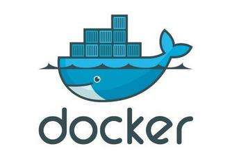
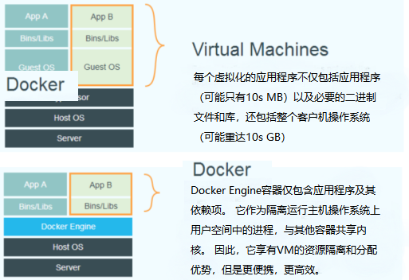

# 一、什么是Docker？

## 1.1 Docker简介

​	Docker是一种Linux容器技术，一种高效、敏捷、和轻量级的容器解决方案，并且支持在多种主流平台（PaaS）和本地部署。（ PaaS是（Platform as a Service）的缩写，是指平台即服务。）

​	Docker是基于Go语言实现的云开源项目，诞生于2013年，最初发起者是DotCloud公司，后来改名为Docker Inc，之后专注于Docker相关技术和产品的开发。Docker项目目前已经加入了Linux基金会，遵循Apache 2.0 开源协议，全部开源代码均在https://github.com/docker上进行相关维护，官网地址为：https://www.docker.com/,有相关文档可以参考，现在docker与openstack同为最受欢迎的云计算开源项目。

​	docker的Logo设计为蓝色鲸鱼，拖着许多集装箱。docker的构想思想是要实现“随时随地构建，运送和运行任何应用程序”，即通过对应用的封装（Packaging）、分发（Distribution [ˌdɪstrɪˈbjuːʃn] ）、部署（Deployment [dɪˈplɔɪmənt] ）、运行（Runtime）生命周期进行管理，达到应用组件“一次封装，到处运行”的目的。

​	这里的应用组件，既可以是一个Web应用、一个编译环境，也可以是一套数据库平台服务，甚至是一个操作系统或集群。基于Linux平台上的多项开源技术，Docker提供了高效、敏捷和轻量级的容器方案，并支持部署到本地环境和多种主流云平台。可以说，Docker首次为应用的开发、运行和部署提供了“一站式”的实用解决方案。

​	跟大部分新兴技术的诞生一样，Docker也并非“从石头缝里蹦出来的”，而是站在前人的肩膀上，其中最重要的就是Linux容器（Linux Containers，LXC）技术。

## 1.2 操作系统级虚拟化的历史

+ 1982年：你一定会很惊讶，第一个操作系统级的虚拟化技术是什么。答案就是
  chroot，直到现在我们依然在使用的一个系统调用。这个系统调用会改变运行进程的
  工作目录，并且只能在这个目录里面工作。这种操作其实就是一种文件系统层的隔
  离。

+ 2000年：FreeBSD jail [dʒeɪl] ，真正意义上的第一个功能完整的操作系统级虚拟化技
  术。所以，真正的容器化技术出现到现在已经过去了16年，并不是几年的时间。

+ 2005年：OpenVZ，这是linux平台上的容器化技术实现，同时也是LXC，即docker最初使用的容器技术核心实现。
  
+ 2008年：LXC发布，这是docker最初使用的具体内核功能实现。

+ 2013年：Docker发布，可以看出，docker最初是使用了LXC，同时封装了其他的一些功能。Docker的成功，与其说是技术的创新，还不如说是一次组合式的创新。
  总结：iPhone你要说有多创新，真的说不上。手机很早就有了，电脑很早就有，触摸屏
  很早就有，但是苹果将所有这些有机的组合到了一起，再提供极致的用户体验，就产生跨时
  代的产品。同样Docker所使用的技术也都不是新技术，它将这一系列技术有机的组合到一
  起，并提供极致的用户体验，就产生了垮时代意义的产品。

# 二、为何要使用docker?

## 2.1 Docker容器虚拟化的好处

​	Docker项目的发起人和Docker公司CTO Solomon Hykes曾认为，Docker在正确的地点、正确的时间顺应了正确的趋势——如何正确地构建应用。

​	在云时代，开发者创建的应用必须要能很方便地在网络上传播，也就是说应用必须脱离底层物理硬件的限制；同时必须是“任何时间、任何地点”可获取的。因此，开发者需要一种新型的创建分布式应用程序的方式，快速分发和部署，这正是Docker所能够提供的最大优势。

​	举个简单的例子，假设用户试图基于最常见的LAMP（Linux+Apache+MySQL+PHP）组合来构建一个网站。按照传统的做法，首先，需要安装Apache、MySQL和PHP以及它们各自运行所依赖的环境；之后分别对它们进行配置（包括创建合适的用户、配置参数等）；经过大量的操作后，还需要进行功能测试，看是否工作正常；如果不正常，则进行调试追踪，意味着更多的时间代价和不可控的风险。可以想象，如果应用数目变多，事情会变得更加难以处理。

​	更为可怕的是，一旦需要服务器迁移（例如从亚马逊云迁移到其他云），往往需要对每个应用都进行重新部署和调试。这些琐碎而无趣的“体力活”，极大地降低了工作效率。究其根源，是这些应用直接运行在底层操作系统上，无法保证同一份应用在不同的环境中行为一致。

​	而Docker提供了一种更为聪明的方式，通过容器来打包应用，解耦应用和运行平台。意味着迁移的时候，只需要在新的服务器上启动需要的容器就可以了，无论新旧服务器是否是同一类型的平台。这无疑将节约大量的宝贵时间，并降低部署过程出现问题的风险。

## 2.2 Docker在开发和运维中的优势

​	对开发和运维（DevOps）人员来说，可能最梦寐以求的效果就是一次创建或配置，之后可以在任意地方、任意时间让应用正常运行。而Docker恰恰是可以实现这一终极目标的“瑞士军刀”。

具体说来，Docker在开发和运维过程中，具有如下几个方面的优势：

1. **更快速的交付和部署：**使用Docker，开发人员可以使用镜像来快速构建一套标准的开发
   环境；开发完成之后，测试和运维人员可以直接使用完全相同环境来部署代码。只要开发测
   试过的代码，就可以确保在生产环境无缝运行。Docker可以快速创建和删除容器，实现快速迭代，大量节约开发、测试、部署的时间。并且，整个过程全程可见，使团队更容易理解应用的创建和工作过程。

2. **更高效的资源利用：**Docker容器的运行不需要额外的虚拟化管理程序（Virtual Machine Manager（VMM），以及Hypervisor）支持，它是内核级的虚拟化，可以实现更高的性
   能，同时对资源的额外需求很低。跟传统虚拟机方式相比，要提高一到两个数量级。

3. **更轻松的迁移和扩展：**Docker容器几乎可以在任意的平台上运行，包括物理机、虚拟机、公有云、私有云、个人电脑、服务器等，同时支持主流的操作系统发行版本。这种兼容性让用户可以在不同平台之间轻松地迁移应用。

4. **更简单的更新管理**：使用Dockerfile，只需要小小的配置修改，就可以替代以往大量的更新工作。并且所有修改都以增量的方式被分发和更新，从而实现自动化并且高效的容器管理。

## 2.3 Docker与虚拟机比较

​	作为一种轻量级的虚拟化方式，Docker在运行应用上与传统的虚拟机方式相比具有显著优势：

+ Docker容器很快，启动和停止可以在秒级实现，而传统的虚拟机方式需要数分钟。

+ Docker容器对系统资源需求很少，一台主机上可以同时运行数千个Docker容器（在IBM服务器上已经实现了同时运行10K量级的容器实例）。

+ Docker通过类似Git设计理念的操作来方便用户获取、分发和更新应用镜像，存储复用，增量更新。docker的公共镜像仓库：www.hub.docker.com

+ Docker通过Dockerfile支持灵活的自动化创建和部署机制，提高工作效率，使流程标准化。
  
+ Docker容器除了运行其中应用外，基本不消耗额外的系统资源，保证应用性能的同时，尽量减小系统开销。传统虚拟机方式运行N个不同的应用就要起N个虚拟机（每个虚拟机需要单独分配独占的内存、磁盘等资源），而Docker只需要启动N个隔离的“很薄的”容器，并将应用放进容器内即可。应用获得的是接近原生的运行性能。

  ​	当然，在隔离性方面，传统的虚拟机方式提供的是相对封闭的隔离。但这并不意味着Docker就不安全，Docker利用Linux系统上的多种防护技术实现了严格的隔离可靠性，并且可以整合众多安全工具。从1.3.0版本开始，Docker重点改善了容器的安全控制和镜像的安全机制，极大提高了使用Docker的安全性。在已知的大规模应用中，目前尚未出现值得担忧的安全隐患。

  

  Docker容器技术与传统虚拟机技术的特性比较

| 特 性    | 容 器    | 虚 拟 机 |
| :------: | :------: | :------: |
| **启动速度** | 秒级     | 分钟级   |
| **性能** | 接近原生 | 较弱     |
| **内存代价** | 很小               | 较多       |
| **硬盘使用** | 一般为MB           | 一般为GB   |
| **运行密度** | 单机支持上千个容器 | 一般几十个 |
| **隔离性** | 完全隔离           | 完全隔离   |
| **迁移性** | 优秀               | 一般       |

## 2.4 Docker与虚拟化

​	虚拟化（Virtualization）技术是一个通用的概念，在不同领域有不同的理解。在计算领域，一般指的是计算虚拟化（Computing Virtualization），或通常说的服务器虚拟化。维基百科上的定义如下：“虚拟化是一种资源管理技术，是将计算机的各种实体资源，如服务器、网络、内存及存储等，予以抽象、转换后呈现出来，打破实体结构间的不可切割的障碍，使用户可以比原本的组态更好的方式来应用这些资源。”

​	可见，虚拟化的核心是对资源的抽象，目标往往是为了在同一个主机上同时运行多个系统或应用，从而提高系统资源的利用率，并且带来降低成本、方便管理和容错容灾等好处。从大类上分，虚拟化技术可分为基于硬件的虚拟化和基于软件的虚拟化，基于软件的虚拟化从对象所在的层次，又可以分为应用虚拟化和平台虚拟化（通常说的虚拟机技术即属于这个范畴）。其中，前者一般指的是一些模拟设备或诸如Wine这样的软件。后者又可以细分为如下几个子类：

1. 完全虚拟化：虚拟机模拟完整的底层硬件环境和特权指令的执行过程，客户操作系统无需进行修改。例如IBM p和z系列的虚拟化、VMware Workstation、VirtualBox、QEMU等。

2. 硬件辅助虚拟化：利用硬件（主要是CPU）辅助支持（目前x86体系结构上可用的硬件辅助虚拟化技术包括Intel-VT和AMD-V）处理敏感指令来实现完全虚拟化的功能，客户操作系统无需修改，例如VMware Workstation、Xen、KVM。

3. 部分虚拟化：只针对部分硬件资源进行虚拟化，客户操作系统需要进行修改。现在有些虚拟化技术的早期版本仅支持部分虚拟化。

4. 准虚拟化（paravirtualization）：部分硬件接口以软件的形式提供给客户机操作系统，客户操作系统需要进行修改，例如早期的Xen。

5. 操作系统级虚拟化：内核通过创建多个虚拟的操作系统实例（内核和库）来隔离不同的进程。容器相关技术即在这个范畴。可见，Docker以及其他容器技术，都属于操作系统虚拟化这个范畴，操作系统虚拟化最大的特点就是不需要额外的hypervisor支持。

​	Docker虚拟化方式之所以有众多优势，这与操作系统虚拟化技术自身的设计和实现是分不开的。

   

​	传统方式是在硬件层面实现虚拟化，需要有额外的虚拟机管理应用和虚拟机操作系统层。Docker容器是在操作系统层面上实现虚拟化，直接复用本地主机的操作系统，因此更加轻量级。 

## 2.5 我可以将Docker用于什么？

**快速，一致地交付您的应用程序**

Docker允许开发人员使用提供您的应用程序和服务的本地容器在标准化环境中工作，从而简化了开发生命周期。容器非常适合持续集成和持续交付（CI / CD）工作流程。

有以下示例方案：

- 您的开发人员在本地编写代码，并使用Docker容器与同事共享他们的工作。
- 他们使用Docker将其应用程序推送到测试环境中，并执行自动和手动测试。
- 当开发人员发现错误时，他们可以在开发环境中对其进行修复，然后将其重新部署到测试环境中以进行测试和验证。
- 测试完成后，将修补程序推送给生产环境就像将更新的映像推送到生产环境一样简单。

**响应式部署和扩展**

Docker基于容器的平台允许高度可移植的工作负载。Docker容器可以在开发人员的本地笔记本电脑上，数据中心中的物理或虚拟机上，云提供商上或混合环境中运行。

Docker的可移植性和轻量级的特性还使您可以轻松地动态管理工作负载，并根据业务需求指示实时扩展或拆除应用程序和服务。

**在同一硬件上运行更多工作负载**

Docker轻巧快速。它为基于虚拟机管理程序的虚拟机提供了可行，经济高效的替代方案，因此您可以利用更多的计算能力来实现业务目标。Docker非常适合于高密度环境以及中小型部署，而您需要用更少的资源做更多的事情。

## 2.6 总结

容器化越来越受欢迎，因为容器是：

- 灵活：即使最复杂的应用程序也可以容器化。
- 轻量级：容器利用并共享主机内核，在系统资源方面比虚拟机更有效。
- 可移植：可以在本地构建，部署到云并在任何地方运行。
- 松散耦合：容器是高度自给自足并封装的容器，使您可以在不破坏其他容器的情况下更换或升级它们。
- 可扩展：可以在数据中心内增加并自动分发容器副本。
- 安全：容器将积极的约束和隔离应用于流程，而无需用户方面的任何配置。

