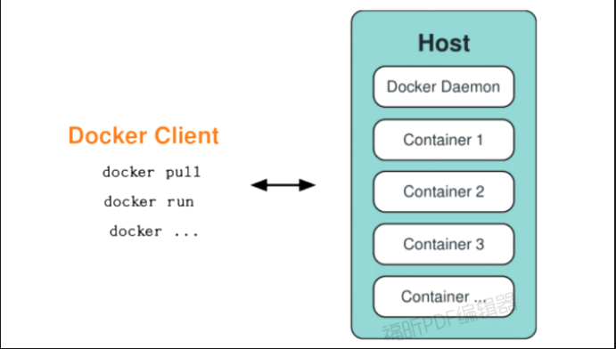
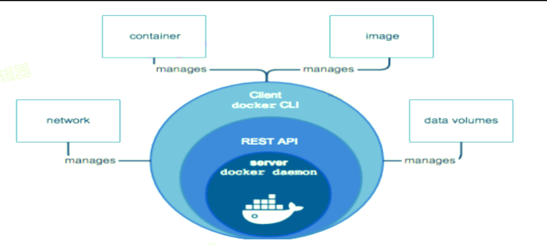
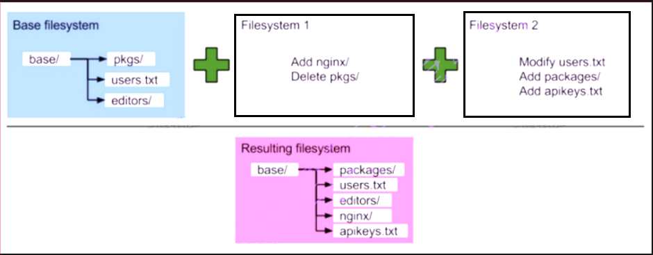
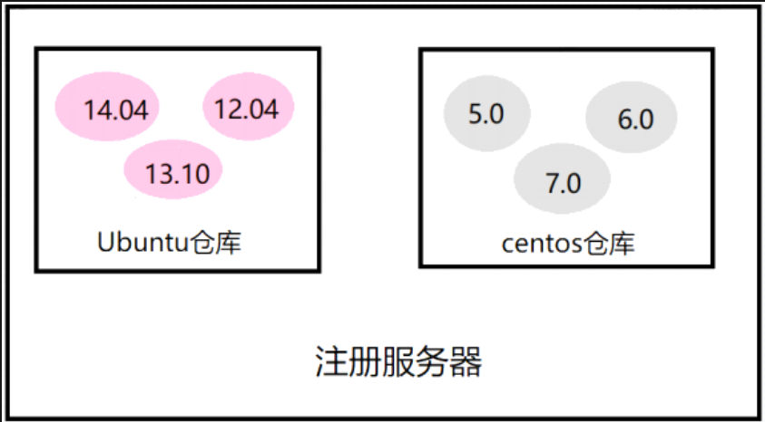
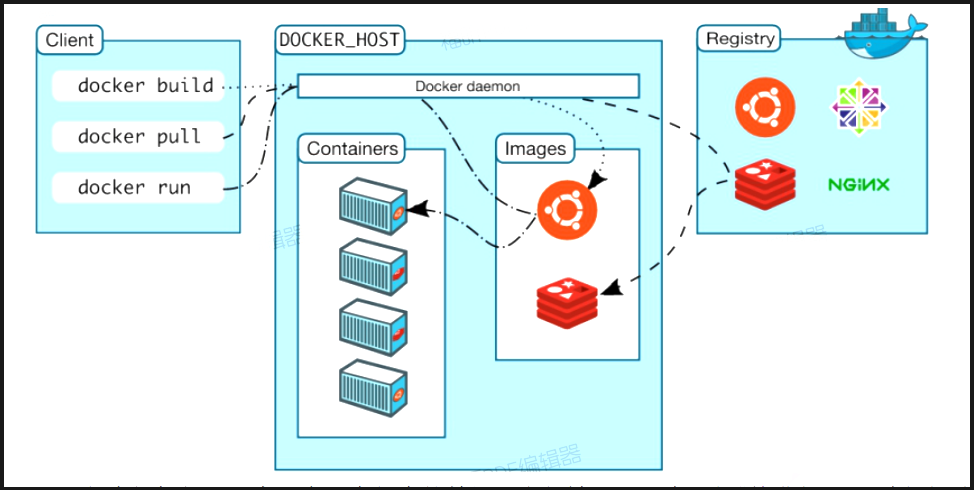
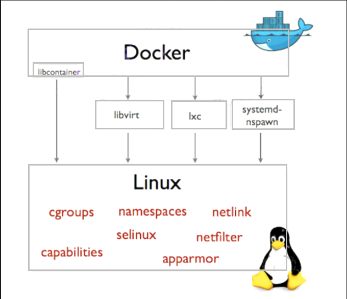

# Docker 的体系结构

docker使用C/S 架构，docker daemon 作为 server 端接受 client 的请求，并处理（创建、运行、分发容器），他们可以运行在一个机器上，也通过socket或者RESTful API 通信

Docker daemon 一般在宿主主机后台运行。
Docker client以系统命令的形式存在，用户用docker命令来跟docker daemon 交互。

## Docker 守护进程（Docker daemon）

如上图所示，**Docker** 守护进程运行在一台主机上。用户并不直接和守护进程进行交互，而是通过 Docker 客户端间接和其通信。
**Docker** 客户端（Docker client）
**Docker** 客户端，实际上是docker的二进制程序，是用户与 Docker 交互方式。它接收用户指令并且与背后的 Docker 守护进程通信。

## Docker 内部：

要理解 Docker 内部构建，需要理解以下**三大核心概念**：
**Docker 镜像** - Docker images
**Docker 仓库** - Docker repository [rɪˈpɑːzətɔːri] 
**Docker 容器** - Docker containers [kənˈteɪnərz]
只有理解了这**三个核心概念**，才能顺利地理解**Docker**容器的整个生命周期。

### Docker镜像

**Docker镜像是Docker容器运行时的只读模板**，**镜像可以用来创建Docker容器**。每一个镜像由一系列的层 (layers) 组成。Docker使用UnionFS（联合文件系统）来将这些层联合到单独的镜像中。UnionFS允许独立文件系统中的文件和文件夹(称之为分支)被透明覆盖，形成一个单独连贯的文件系统。正因为有了这些层的存在，Docker是如此的轻量。当你改变了一个Docker镜像，比如升级到某个程序到新的版本，一个新的层会被创建。因此，不用替换整个原先的镜像或者重新建立(在使用虚拟机的时候你可能会这么做)，只是一个新的层被添加或升级了。现在你不用重新发布整个镜像，只需要升级，层使得分发Docker 镜像变得简单和快速。

**例如**：centos镜像中安装nginx，就成了“nginx镜像”，其实在此时Docker镜像的层级概念就体现出来了。底层一个centos操作系统镜像，上面叠加一个nginx层，就完成了一个nginx镜像的构建。层级概念就不难理解，此时我们一般centos操作系统镜像称为nginx镜像层的父镜像。

镜像是创建Docker容器的基础。通过版本管理和增量的文件系统，Docker提供了一套十分简单的机制来创建和更新现有的镜像，用户甚至可以从网上下载一个已经做好的应用镜像，并直接使用。

### Docker仓库

Docker仓库类似于代码仓库，它是Docker集中存放镜像文件的场所。

不要将Docker仓库和仓库注册服务器（**Registry**[ˈredʒɪstri] ）混为一谈。实际上，仓库注册服务器是存放仓库的地方，其上往往存放着多个仓库。每个仓库集中存放某一类镜像，往往包括多个镜像文件，通过不同的标签（tag）来进行区分。例如存放Ubuntu操作系统镜像的仓库称为Ubuntu仓库，其中可能包括14.04、12.04等不同版本的镜像。仓库注册服务器的示例如图所示。

​	

根据所存储的镜像公开分享与否**，Docker仓库**可以分为**公开仓库（Public）**和**私有仓库（Private）**[ˈpraɪvət]两种形式。目前，最大的公开仓库是官方提供Docker Hub，其中存放了数量庞大的镜像供用户下载。国内不少云服务提供商（如时速云、阿里云等）也提供了仓库的本地源，可以提供稳定的国内访问。

​	当然，用户如果不希望公开分享自己的镜像文件，Docker也支持用户在本地网络内创建一个只能自己访问的私有仓库。当用户创建了自己的镜像之后就可以使用push命令将它上传到指定的公有或者私有仓库。这样用户下次在另外一台机器上使用该镜像时，只需要将其从仓库上pull下来就可以了。

​	可以看出，Docker利用仓库管理镜像的设计理念与Git非常相似，实际上在理念设计上借鉴了Git的很多优秀思想。

### Docker容器

​	Docker利用容器来运行应用，一个Docker容器包含了所有的某个应用运行所需要的环境。每一个Docker 容器都是从Docker 镜像创建的，是通过镜像创建的运行实例。Docker容器可以运行、开始、停止、移动和删除。**每一个Docker容器都是独立和安全的应用平台，彼此相互隔离、互不可见。**
​	可以把容器看做是一个简易版的Linux环境（包括root用户权限、进程空间、用户空间和网络空间等）和运行在其中的应用程序。
注：镜像是只读的 ，容器在启动的时候创建一层可写层作为最上层。

​	与虚拟机相比，容器有一个很大的差异，它们被设计用来运行"单进程"，无法很好地模拟一个完整的环境。Docker设计者极力推崇“一个容器一个进程的方式”，如果你要选择在一个容器中运行多个进程，那唯一情况是：出于调试目的。容器是设计来运行一个应用的，而非一台机器。你可能会把容器当虚拟机用，但你将失去很多的灵活性，因为Docker提供了用于分离应用与数据的工具，使得你可以快捷地更新运行中的代码/系统，而不影响数据。
​	**Docker** 从 0.9 版本开始使用 libcontainer替代lxc，libcontainer和Linux系统的交互图如下：

## Docker 底层技术

docker底层的**2个核心技术**分别是 **Namespaces  [neɪm ˈspeɪsɪz] 和Control groups**

**Namespaces用来隔离各个容器**

**1)** **pid namespace**

​	不同用户的进程就是通过pid namespace隔离开的，且不同namespace中可以有相同pid。所有的LXC进程在docker中的父进程为docker进程，每个lxc进程具有不同的namespace 。

**2)** **net namespace**
	有了pid namespace, 每个namespace中的pid能够相互隔离，但是网络端口还是共享host的端口。网络隔离是通过net namespace实现的，每个net namespace有独立的network devices, IP addresses, IP routing tables, /proc/net 目录。这样每个container的网络就能隔离开来。docker默认采用veth的方式将container中的虚拟网卡同host上的一个docker bridge: docker0 连接在一起。

**3)** **ipc namespace**
	container中进程交互还是采用linux常见的进程间交互方法 (interprocess communication-IPC),包括常见的信号量、消息队列和共享内存。container的进程间交互实际上还是host 上具有相同pid namespace中的进程间交互。

**4)** **mnt namespace**
	类似chroot，将一个进程放到一个特定的目录执行。mnt namespace 允许不同namespace的进程看到的文件结构不同，这样每个namespace中的进程所看到的文件目录就被隔离开了。在container里头，看到的文件系统，就是一个完整的linux系统，有/etc、/lib 等，通过chroot实现。

**5)** **uts namespace**
	UTS("UNIX Time-sharing System") namespace 允许每个container拥有独立的hostname和domain name, 使其在网络上可以被视作一个独立的节点而非Host上的一个进程。

**6)** **user namespace**
	每个container可以有不同的user和group id，也就是说可以在container内部用container内部的用户执行程序而非Host上的用户。
	有了以上6种namespace从进程、网络、IPC、文件系统、UTS和用户角度的隔离，一个container就可以对外展现出一个独立计算机的能力，并且不同container从OS层面实现了隔离。然而不同namespace之间资源还是相互竞争的，仍然需要类似ulimit来管理每个container所能使用的资源--cgroup。

​	**cgroups（Control groups）实现了对资源的配额和度量。**
​	**cgroups**（Control Groups）最初叫Process Container，由Google工程师（Paul Menage和Rohit Seth）于2006年提出，后来因为Container有多重含义容易引起误解，就在2007年更名为Control Groups，并被整合进Linux内核。顾名思义就是把进程放到一个组里面统一加以控制。官方的定义如下：cgroups是Linux内核提供的一种机制，这种机制可以根据特定的行为，把一系列系统任务及其子任务整合（或分隔）到按资源划分等级的不同组内，从而为系统资源管理提供一个统一的框架。
​	通俗的来说，cgroups可以限制、记录、隔离进程组所使用的物理资源（包括：CPU、memory、IO等），为容器实现虚拟化提供了基本保证，是构建Docker等一系列虚拟化管理工具的基石。
​	实现cgroups的主要目的是为不同用户层面的资源管理，提供一个统一化的接口。从单个进程的资源控制到操作系统层面的虚拟化。**Cgroups提供了以下四大功能：**

- **资源限制**（Resource Limitation）：cgroups可以对进程组使用的资源总额进行限制。如设定应用运行时使用内存的上限，一旦超过这个配额就发出OOM（Out of Memory）。
  
- **优先级分配**（Prioritization）：通过分配的CPU时间片数量及硬盘IO带宽大
  小，实际上就相当于控制了进程运行的优先级。

- **资源统计**（Accounting）： cgroups可以统计系统的资源使用量，如CPU使用时长、内存用量等等，这个功能非常适用于计费。
  
- **进程控制**（Control）：cgroups可以对进程组执行挂起、恢复等操作。