# docker镜像操作

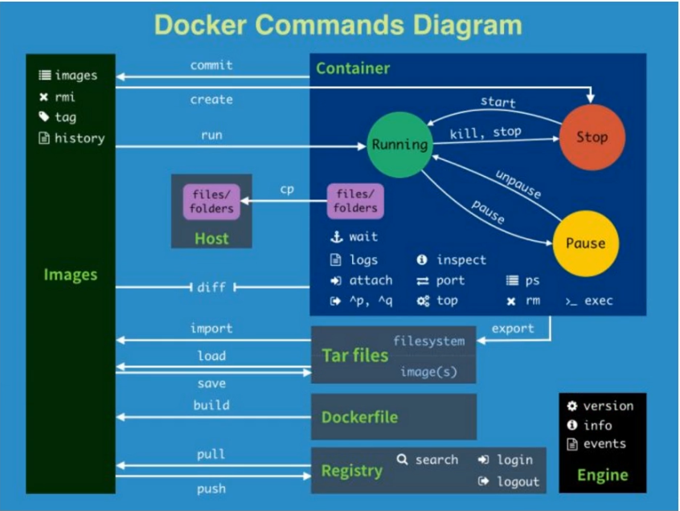

## 镜像（image）

​		镜像（image）是Docker三大核心概念中为重要的，自Docker诞生之日起“镜像”就是相关社区为热门的关键词。

​		Docker运行容器前需要本地存在对应的镜像，如果镜像没保存在本地，Docker会尝试先从默认镜像仓库下载（默认使用Docker Hub公共注册服务器的仓库），用户也可以通过配置，使用自定义的镜像仓库。

## 1、搜索镜像

​		使用docker search  [sɜːrtʃ] 命令可以搜索远端仓库中共享的镜像，默认搜索官方仓库中的镜像。
​		用法为docker search 关键字，支持的参数主要包括：

--automated=true|false： [ˈɔːtəmeɪtɪd] 仅显示自动创建的镜像，默认为否；

--no-trunc=true|false：输出信息不截断显示，默认为否；

-s, --stars=X：指定仅显示评价为指定星级以上的镜像，默认为0，即输出所有镜像。

​		例如，搜索所有自动创建的评价为1+的带nginx关键字的镜像，默认的输出结果将按照星级
评价进行排序，如下所示：

```bash
$  docker search --automated -s 3 nginx
```

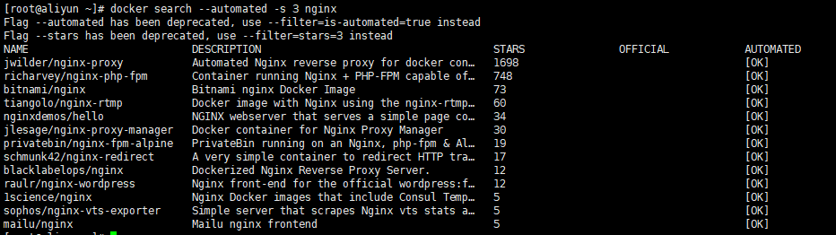

- NAME:镜像名称
- DESCRIPTION  [dɪˈskrɪpʃn]:描述
- STARS:星级，代表受欢迎程度
- OFFICIAL [əˈfɪʃl]:是否官方创建
- AUTOMATED:是否自动创建

## 2、获取镜像

​		镜像是运行容器的前提，官方的Docker Hub网站已经提供了数十万个镜像供大家开放下载。
​		可以使用docker pull命令直接从Docker Hub镜像源来下载镜像。该命令的格式为`docker pull NAME[:TAG]`。**其中，NAME是镜像仓库的名称（用来区分镜像），TAG [tæɡ] 是镜像的标签（往往用来表示版本信息）。**通常情况下，描述一个镜像需要包括“名称+标签”信息。

​		例如：

```bash
$ docker pull ubuntu:14.04
```

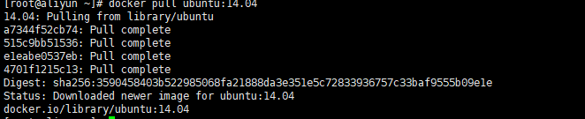


```bash
# 对于Docker镜像来说，如果不显式指定TAG，则默认会选择latest [ˈleɪtɪst] 标签，这会下载仓库中新版本的镜像。

$ docker pull ubuntu
```

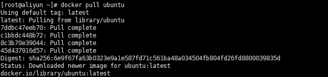

从下载过程中可以看出，镜像文件一般由若干层（layer）组成，`7ddbc47eeb70`这样的串是层的唯一id（实际上完整的id包括256比特，由64个十六进制字符组成）。

​		使用`docker pull`命令下载时会获取并输出镜像的各层信息。当不同的镜像包括相同的层时，本地仅存储层的一份内容，减小了需要的存储空间。
​		严格地讲，镜像的仓库名称中还应该添加**仓库地址**（即registry，注册服务器）作为前缀，
​		只是我们默认使用的是Docker Hub服务，该前缀可以忽略。
例如，`docker pull ubuntu:14.04`命令相当于`docker pull` 
`registry.hub.docker.com/ubuntu:14.04`命令，即从默认的注册服务器Docker Hub Registry中的ubuntu仓库来下载标记为14.04的镜像。
​		如果从非官方的仓库下载，则需要在仓库名称前指定完整的仓库地址。例如从网易蜂巢的镜像源来下载ubuntu:14.04镜像，可以使用如下命令，此时下载的镜像名称为
hub.c.163.com/public/ubuntu:14.04：

```bash
$ docker pull hub.c.163.com/public/ubuntu:14.04
```

## 3、查看镜像信息

### 		使用docker images命令可以列出本地主机上已有镜像的基本信息。

```bash
$ docker images
```

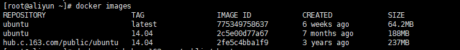

​		在列出的信息中，可以看到以下几个字段信息。

- repository [rɪˈpɑːzətɔːri] 来自于哪个仓库：比如ubuntu仓库用来保存ubuntu系列的基础镜像

- 镜像的标签信息：比如14.04、latest用来标注不同的版本信息。标签只是标记，并不能标识镜像内容；TAG信息用来标记来自同一个仓库的不同镜像。例如ubuntu仓库中有多个镜
  像，通过TAG信息来区分发行版本。
- 镜像的ID（唯一标识镜像）：如果镜像ID相同，说明实际上指向同一个镜像；在使用镜像ID的时候，一般可以使用该ID的前若干个字符组成的可区分串来替代完整的ID
- 创建时间：说明镜像后的更新时间；
- 镜像大小：优秀的镜像往往体积都较小。镜像大小信息只是表示该镜像的逻辑体积大小，实际上由于相同的镜像层本地只会存储一份，物理上占用的存储空间会小于各镜像的逻辑体积之和。

为了方便在后续工作中使用特定镜像，还可以使用docker tag命令来为本地镜像任意添加新的标签。例如添加一个新的mynginx:latest镜像标签：

```bash
$ docker pull nginx
$ docker tag nginx:latest mynginx:latest

# 查看镜像
$ docker images
```

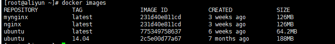

​		可以看到mynginx和nginx的镜像ID是一致的，它们实际上指向同一个镜像文件，只是别名不同而已。docker tag命令添加的标签实际上起到了类似链接的作用。


###  		**docker inspect[ɪnˈspekt]  :** 获取容器/镜像的元数据。 

​		 元数据： 描述数据的数据，对数据及信息资源的描述性信息。

​	     语法：`docker inspect [OPTIONS] NAME|ID [NAME|ID...]` 

​		OPTIONS说明：

-  **-f :**指定返回值的模板文件。 
-  **-s :**显示总的文件大小。 
-  **--type :**为指定类型返回JSON。  

```bash
$ docker inspect nginx
[
    {
        "Id": "sha256:231d40e811cd970168fb0c4770f2161aa30b9ba6fe8e68527504df69643aa145",
        "RepoTags": [
            "mynginx:latest",
            "nginx:latest"
        ],
        "RepoDigests": [
            "nginx@sha256:50cf965a6e08ec5784009d0fccb380fc479826b6e0e65684d9879170a9df8566"
        ],
        "Parent": "",
        "Comment": "",
        "Created": "2019-11-23T01:12:31.219881158Z",
        "Container": "806a0a78bcfee5212b2530e6f2a7e3f8eec5b51cc55d7a28935f5f8c8bd45826",
        "ContainerConfig": {
            "Hostname": "806a0a78bcfe",
            "Domainname": "",
            "User": "",
            "AttachStdin": false,
            "AttachStdout": false,
            "AttachStderr": false,
            "ExposedPorts": {
                "80/tcp": {}
            },
            "Tty": false,
            "OpenStdin": false,
            "StdinOnce": false,
            "Env": [
                "PATH=/usr/local/sbin:/usr/local/bin:/usr/sbin:/usr/bin:/sbin:/bin",
                "NGINX_VERSION=1.17.6",
                "NJS_VERSION=0.3.7",
                "PKG_RELEASE=1~buster"
            ],
            "Cmd": [
                "/bin/sh",
                "-c",
                "#(nop) ",
                "CMD [\"nginx\" \"-g\" \"daemon off;\"]"
            ],
            "ArgsEscaped": true,
            "Image": "sha256:f96d70a1d708239afa79b86f1e005c033864d22dabe94b466acba087d5bbc722",
            "Volumes": null,
            "WorkingDir": "",
            "Entrypoint": null,
            "OnBuild": null,
            "Labels": {
                "maintainer": "NGINX Docker Maintainers <docker-maint@nginx.com>"
            },
            "StopSignal": "SIGTERM"
        },
        "DockerVersion": "18.06.1-ce",
        "Author": "",
        "Config": {
            "Hostname": "",
            "Domainname": "",
            "User": "",
            "AttachStdin": false,
            "AttachStdout": false,
            "AttachStderr": false,
            "ExposedPorts": {
                "80/tcp": {}
            },
            "Tty": false,
            "OpenStdin": false,
            "StdinOnce": false,
            "Env": [
                "PATH=/usr/local/sbin:/usr/local/bin:/usr/sbin:/usr/bin:/sbin:/bin",
                "NGINX_VERSION=1.17.6",
                "NJS_VERSION=0.3.7",
                "PKG_RELEASE=1~buster"
            ],
            "Cmd": [
                "nginx",
                "-g",
                "daemon off;"
            ],
            "ArgsEscaped": true,
            "Image": "sha256:f96d70a1d708239afa79b86f1e005c033864d22dabe94b466acba087d5bbc722",
            "Volumes": null,
            "WorkingDir": "",
            "Entrypoint": null,
            "OnBuild": null,
            "Labels": {
                "maintainer": "NGINX Docker Maintainers <docker-maint@nginx.com>"
            },
            "StopSignal": "SIGTERM"
        },
        "Architecture": "amd64",
        "Os": "linux",
        "Size": 126323486,
        "VirtualSize": 126323486,
        "GraphDriver": {
            "Data": {
                "LowerDir": "/var/lib/docker/overlay2/3cfcb75d8b92676111cc5f47d02673112f424c4c7509abbf71e0cec4561a80e1/diff:/var/lib/docker/overlay2/e4dd8bb0d9dc4cff31020a4bb2a2fa3f4c63dbef5bd60d3df01f539c5fe4156b/diff",
                "MergedDir": "/var/lib/docker/overlay2/b247b51bd5131f3de2c9a3a3714b2347ec81510496bcdf454287707ba14dad57/merged",
                "UpperDir": "/var/lib/docker/overlay2/b247b51bd5131f3de2c9a3a3714b2347ec81510496bcdf454287707ba14dad57/diff",
                "WorkDir": "/var/lib/docker/overlay2/b247b51bd5131f3de2c9a3a3714b2347ec81510496bcdf454287707ba14dad57/work"
            },
            "Name": "overlay2"
        },
        "RootFS": {
            "Type": "layers",
            "Layers": [
                "sha256:831c5620387fb9efec59fc82a42b948546c6be601e3ab34a87108ecf852aa15f",
                "sha256:5fb987d2e54d85820d95d6c31f3fe4cd95bf71fe6d9d9e4684082cb551b728b0",
                "sha256:4fc1aa8003a3d0d2481f10d17773869cbff12c1008df30e0bab8259086a0311c"
            ]
        },
        "Metadata": {
            "LastTagTime": "2019-12-15T10:41:07.693039178+08:00"
        }
    }
]

```

​		返回的是一个JSON格式的消息，如果我们只要其中一项内容时，可以使用参数-f来指定，例如，获取镜像的Architecture [ˈɑːrkɪtektʃər]：

```bash
$ docker inspect -f {{".Architecture"}} nginx
```

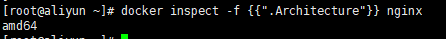

### 使用history命令查看镜像创建历史

​		既然镜像文件由多个层组成，那么怎么知道各个层的内容具体是什么呢？这时候可以使用history子命令，该命令将列出各层的创建信息。

语法：`docker history [OPTIONS] IMAGE`

-  **-H :**以可读的格式打印镜像大小和日期，默认为true； 
-  **--no-trunc :**显示完整的提交记录； 
-  **-q :**仅列出提交记录ID。 

```bash
$ docker history nginx
```

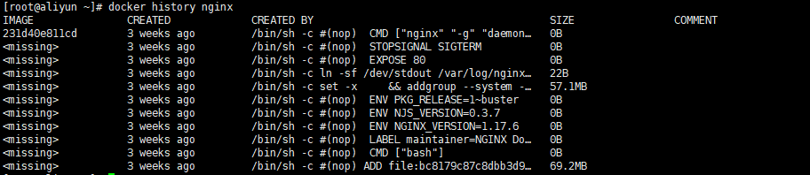


## 4、删除镜像

### 使用标签删除镜像

使用docker rmi命令可以删除镜像，命令格式为docker rmi IMAGE [IMAGE...]，其中IMAGE可以为标签或ID。

例如，要删除掉mynginx:latest镜像，可以使用如下命令：

```bash
$ docker rmi mynginx
```

### 使用镜像ID删除镜像

```bash
$ docker rmi 747cb2d60bbe
```


​		当使用docker rmi命令，并且后面跟上镜像的ID（也可以是能进行区分的部分ID串前缀）时，会先尝试删除所有指向该镜像的标签，然后删除该镜像文件本身。
​		**注意，当有该镜像创建的容器存在时，镜像文件默认是无法被删除的。如果要想强行删除镜像，可以使用-f参数。**

​		注意，通常并不推荐使用-f参数来强制删除一个存在容器依赖的镜像。正确的做法是，先删除依赖该镜像的所有容器，再来删除镜像。

## 5、创建镜像

创建镜像的方法主要有三种：

- 基于已有镜像的容器创建
- 基于本地模板导入
- 基于Dockerfile创建。

### 基于已有镜像的容器创建

该方法主要是使用docker commit命令。

语法：`docker commit [OPTIONS] CONTAINER 
[REPOSITORY[:TAG]]`

- -a, --author=""： [ˈɔːθər] 作者信息；
- -c, --change=[]：提交的时候执行Dockerfile指令，包括
  CMD|ENTRYPOINT|ENV|EXPOSE|LABEL|ONBUILD|USER|VOLUME|WORKDIR等；
- -m, --message=""：提交消息；
- -p, --pause=true： [pɔːz]提交时暂停容器运行。

​    下面将演示如何使用该命令创建一个新镜像。首先，启动一个镜像，并在其中进行修改操作，例如创建一个test文件，之后退出

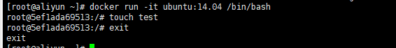

```bash
# -i: 以交互模式运行容器，通常与 -t 同时使用；
# -t: 为容器重新分配一个伪输入终端，通常与 -i 同时使用；
$ docker run -it ubuntu:14.04 /bin/bash
$ touch test
$ exit

记住容器的ID为5ef1ada69513。
```

此时该容器跟原ubuntu:14.04镜像相比，已经发生了改变，可以使用docker commit命令来提交为一个新的镜像。提交时可以使用ID或名称来指定容器

```bash
$ docker commit -m "Added a new file" -a "Docker Newbee" 5ef1ada69513 test:0.1

# 顺利的话，会返回新创建的镜像的ID信息，例如
sha256:8e374bf2efb207eda9364bff1f6e5a2beceede0fbb075fbdac17c8dba4bc45f4

```

此时查看本地镜像列表，会发现新创建的镜像已经存在了：

```bash
$ docker images
```

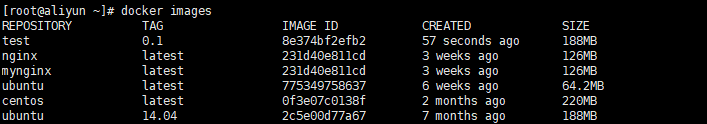


我们可以再做一个mariadb的数据库镜像

```bash
# 先启动一个centos的容器
$ docker run -it centos /bin/bash
[root@903ea30bbef6 /]# 
# 然后在容器里面安装mariadb-server软件包
$ yum install mariadb-server -y
# 当结束后，我们使用exit来退出，现在我们的容器已经被我们改变了
$ exit

# 使用docker commit命令来提交相应的副本。
$ docker commit -m "add mariadb server" -a "docker li" 903ea30bbef6 mariadb:1.0
sha256:ece8ab43b8b1e7d470dc2a71cb06fb9ac925c6adddac205f6f0bd9b3c798177e
# 查看镜像
$ docker images
```

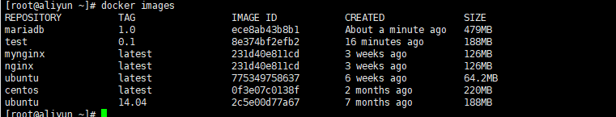

### 基于本地模板导入

用户也可以直接从一个操作系统模板文件导入一个镜像，主要使用docker import命令。命令格式为`docker import [OPTIONS] file|URL|-[REPOSITORY[:TAG]]`。

 OPTIONS说明 

-  **-c :**应用docker 指令创建镜像； 
-  **-m :**提交时的说明文字； 

​    要直接导入一个镜像，可以使用OpenVZ提供的模板来创建，或者用其他已导出的镜像模板来创建。

OPENVZ模板的下载地址为http://download.openvz.org/template/precreated/

```bash
$ docker import fedora-23-x86_64.tar.gz fedora:23
sha256:be16d5a40f66d6ff8a9514128529be6a23c890c3162cf14bc3f6dae0ec7873fb
# 或者 
# cat fedora-23-x86_64.tar.gz | docker import - fedora:23
# import 后面的 -  代表 从标准输入读取
```

## 6、存出和载入镜像 

用户可以使用docker save和docker load命令来存出和载入镜像

### 存出镜像

如果要导出镜像到本地文件，可以使用docker save命令。

语法：`docker save [OPTIONS] IMAGE [IMAGE...]`

OPTIONS 说明：

- **-o :**输出到的文件。

例如导出本地的ubuntu:14.04镜像为文ubuntu_14.04.tar，

```bash
$ docker save -o ubuntu_14.04.tar ubuntu:14.04
$ ls -lh ubuntu_14.04.tar 
-rw------- 1 root root 189M Dec 15 12:05 ubuntu_14.04.tar
```

之后，用户就可以复制ubuntu_14.04.tar文件将该镜像分享给他人使用了

### 载入镜像

可以使用docker load将导出的tar文件再导入到本地镜像库

语法:`docker load [OPTIONS]`

OPTIONS 说明：

- **--input , -i :** 指定导入的文件，代替 STDIN (标准输入)。
- **--quiet , -q :** 精简输出信息。

例如从文件ubuntu_14.04.tar导入镜像到本地镜像列表

```bash
$ docker load --input ubuntu_14.04.tar

$ docker load < ubuntu_14.04.tar
```

这将导入镜像及其相关的元数据信息（包括标签等）。导入成功后，可以使用docker images命令进行查看。

## 7、save 和 export

- `docker save images_name`：将一个镜像导出为文件，再使用`docker load`命令将文件导入为一个镜像，会保存该镜像的的所有历史记录。比`docker export`命令导出的文件大，很好理解，因为会保存镜像的所有历史记录。
- `docker export container_id`：将一个容器导出为文件，再使用`docker import`命令将容器导入成为一个新的镜像，但是相比`docker save`命令，容器文件会丢失所有元数据和历史记录，仅保存容器当时的状态，相当于虚拟机快照。

## 8、上传镜像

用户可以通过docker push命令，把自己创建的镜像上传到仓库中来共享。默认上传到Docker Hub官方仓库（需要登录），官网地址：https://hub.docker.com。

命令格式为：`docker push NAME[:TAG] | [REGISTRY_HOST[:REGISTRY_PORT]/]NAME[:TAG]`

OPTIONS说明：

- **--disable-content-trust :**忽略镜像的校验,默认开启


### 1. 首先申请一个docker hub帐号

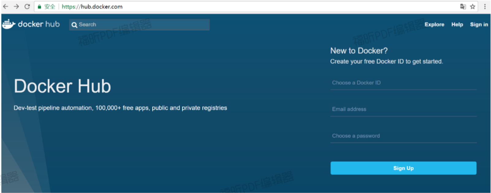

### 2. 注册成功

注册成功后，登录到docke hub点击一下按钮：create —> create repository ,取个名字，这里我们终创建的仓库名称：lidnyun/kube-apiserver-amd64 ，这个lidnyun是帐号，kube-apiserver-amd64是其中一个仓库名。如图所示：

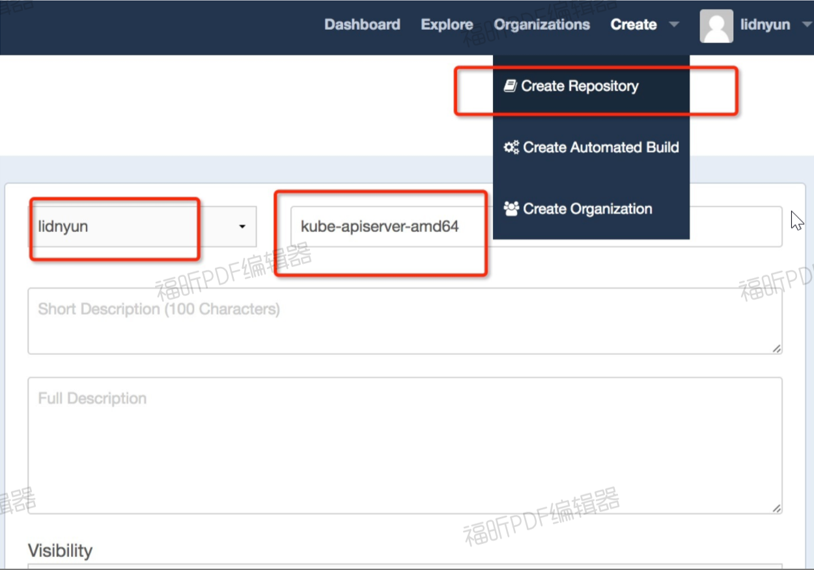

### 3. 为存在于本地的镜像打标签

语法：`docker tag <existing-image> <hub-user>/<repo-name>[:<tag>] `

这里的tag不指定就是latest

具体样例如下：

```bash
$ docker tag gcr.io/google_containers/kube-apiserver-amd64:v1.5.5 
# lidnyun/kube-apiserver-amd64:v1.5.5 
# lidnyun是步骤一提到的账户名 
# kube-apiserver-amd64是步骤一提到的仓库名称 
# v1.5.5是tag版本。
```

### 4. 在本地登录docker hub帐号

```bash
$ docker login 
Username: lidnyun 
Password: 
Email: 邮箱地址 


WARNING: login credentials saved in /root/.docker/config.json 
Login Succeeded

```

### 5. push镜像

语法：`docker push <hub-user>/<repo-name>:<tag>`

具体样例如下

```bash
$ docker push lidnyun/kube-apiserver-amd64:v1.5.5 
```

### 6. 可以有以下两种方式进行验证

#### 1. 网址方式

登录到docker hub网站,查看一下刚才创建的仓库名称，如图：

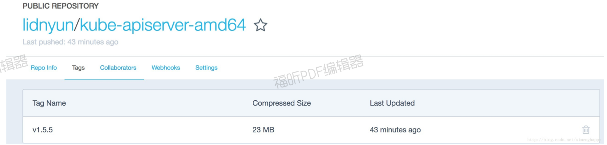

#### 2. 命令方式

通过命令拉取一下镜像看看是否成功

语法：`docker pull  <hub-user>/<repo-name>:<tag>`

具体样例如下

```bash
$ docker pull  lidnyun/kube-apiserver-amd64:v1.5.5 
```


