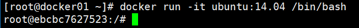
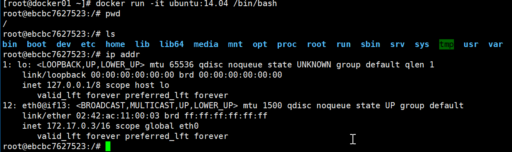
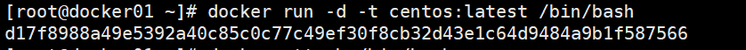
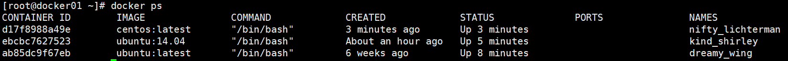
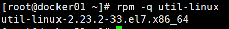
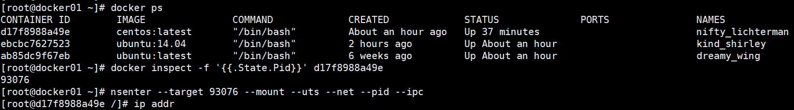

Docker容器操作

​		容器是docker的另一个核心概念。简单的说，容器是镜像的一个运行实例。所不同的是，镜像是静态的只读文件，而容器带有运行时需要的可写文件层，容器就是独立运行的一个或一组应用以及它们所必需的运行环境，包括文件系统、系统类库、shell环境等。本节将具体介绍围绕容器的重要操作，包括创建一个容器、启动容器、终止一个容器、进入容器内执行操作、删除容器和通过导入导出容器来实现容器迁移等。 

### 1、创建容器

#### 1）新建容器

可以使用docker create命令新建一个容器，例如：

```shell
[root@docker01 ~]# docker create  -it --name test1 centos:latest
ab85dc9f67eb068b3d22fd30fa1893008d833664f169e71a04e96e26d1bd2f1
root@nfs ~]# docker ps -a
CONTAINER ID        IMAGE               COMMAND             CREATED              STATUS              PORTS               NAMES
74e91a9acec6        centos:latest       "/bin/bash"         About a minute ago   Created                                 test1


-t 选项让Docker分配一个伪终端（pseudo-tty）并绑定到容器的标准输入上
-i 让容器的标准输入保持打开(即交互式) 还可以使用--name给容器起个形象的名称
--name 为容器分配一个名称
```

#### 2）启动容器

使用docker create命令新建的容器处于停止状态，可以使用docker start命令来启动它。

```shell
[root@nfs ~]# docker start test1 //开启容器
test1
root@nfs ~]# docker ps
CONTAINER ID        IMAGE               COMMAND             CREATED             STATUS              PORTS               NAMES
74e91a9acec6        centos:latest       "/bin/bash"         4 minutes ago       Up 10 seconds                           test1

[root@nfs ~]# docker stop test1 //关闭容器
test1
[root@nfs ~]# docker ps
CONTAINER ID        IMAGE               COMMAND             CREATED             STATUS              PORTS               NAMES
```

#### 3）新建并启动容器

可以直接新建并启动容器，所需命令主要为docker run，等价于先执行`docker create`命令，再执行`docker start`命令。下面的命令输出一个“Hello World”，之后终止容器。

```shell
//创建并启动但执行完命令后停止容器
[root@nfs ~]# docker run -it --name test3 centos:latest /bin/echo "Hello world"
Hello world

[root@nfs ~]# docker ps
CONTAINER ID        IMAGE               COMMAND             CREATED             STATUS              PORTS               NAMES

// 创建并启动后台运行
[root@nfs ~]# docker run -itd --name test4 centos:latest 
da1f85c9f2fee3144dfa837d5cfe635217f576063d950151e5263af40e99a2bb
[root@nfs ~]# docker ps
CONTAINER ID        IMAGE               COMMAND             CREATED             STATUS              PORTS               NAMES
da1f85c9f2fe        centos:latest       "/bin/bash"         3 seconds ago       Up 3 seconds                            test4


// 如果不想停止加 -d 参数
```

这跟在本地直接执行 /bin/echo 'hello world' 几乎感觉不出任何区别。 

当利用docker run 来创建容器时，Docker 在后台运行的标准操作包括：

- 检查本地是否存在指定的镜像，不存在就从公有仓库下载
- 利用镜像创建并启动一个容器

- 分配一个文件系统，并在只读的镜像层外面挂载一层可读写层
- 从宿主主机配置的网桥接口中桥接一个虚拟接口到容器中去
- 从网桥的地址池配置一个IP地址给容器
- 执行用户指定的应用程序
- 执行完毕后容器被终止 

下面的命令则启动一个 bash 终端，允许用户进行交互。 



在交互模式下，用户可以通过所创建的终端来输入命令，例如 



**docker exec ：**在运行的容器中执行命令

```
docker exec [OPTIONS] CONTAINER COMMAND [ARG...]
```

OPTIONS说明：

- **-d :**分离模式: 在后台运行
- **-i :**即使没有附加也保持STDIN 打开
- **-t :**分配一个伪终端

例如：

```shell
[root@nfs ~]# docker exec -it test /bin/bash
[root@da1f85c9f2fe /]# ls
bin  dev  etc  home  lib  lib64  lost+found  media  mnt  opt  proc  root  run  sbin  srv  sys  tmp  usr  var

```

​	容器的核心为所执行的应用程序，所需要的资源都是应用程序运行所必需的。除此之外，并没有其它的资源。可以在伪终端中利用ps或 top 来查看进程信息 

```shell
[root@da1f85c9f2fe /]# ps
   PID TTY          TIME CMD
    14 pts/1    00:00:00 bash
    29 pts/1    00:00:00 ps

```

​	可见，容器中仅运行了指定的 bash 应用。这种特点使得 Docker 对资源的利用率极高，是货真价实的轻量级虚拟化。 

​	如果这个时候我们正常退出，输入exit 或者Ctrl+d命令后，容器就自动处于退出（Exited）状态了。docker ps –a 查看容器处于Exit 状态。 

```shell
[root@nfs ~]# docker run -it --name test5 centos:latest /bin/bash
[root@11315808b25e /]# exit
exit
[root@nfs ~]# docker ps
CONTAINER ID        IMAGE               COMMAND             CREATED             STATUS              PORTS               NAMES
6306a2d74820        centos:latest       "/bin/bash"         22 seconds ago      Up 22 seconds                           test1
f26665ae112d        centos:latest       "/bin/bash"         41 seconds ago      Up 40 seconds                           test
[root@nfs ~]# 

```

也可以退出容器而不结束容器进程，输入Ctrl-q + Ctrl-p ，就像先按 CTRL -p 然后CTRL –q 退出伪终端，而不结束容器 

```shell
[root@nfs ~]# docker run -it --name test6 centos:latest /bin/bash
[root@8118535b9827 /]# 
[root@nfs ~]# 
[root@nfs ~]# docker ps 
CONTAINER ID        IMAGE               COMMAND             CREATED             STATUS              PORTS               NAMES
8118535b9827        centos:latest       "/bin/bash"         11 seconds ago      Up 10 seconds                           test6
6306a2d74820        centos:latest       "/bin/bash"         4 minutes ago       Up 4 minutes                            test1
f26665ae112d        centos:latest       "/bin/bash"         5 minutes ago       Up 4 minutes                            test

```

发现退出容器了，但是容器依然在运行，可以随时进入容器： 

```shell
[root@nfs ~]# docker exec -it test6 /bin/bash
[root@8118535b9827 /]# 

```

#### 4）守护态运行

​	更多的时候，需要让 Docker 容器在后台以守护态（Daemonized）形式运行。此时，可以通过添加 -d 参数来实现。例如下面的命令会在后台运行容器 

```shell
[root@nfs ~]# docker run -d --name test7 centos:latest /bin/sh -c 'while true;do echo weibo;sleep 1;done'
f60c227724c330c497a5d2d8e7ff94fcd9f42e20f4d75c2ebba45be8defb1f79

// 此时，如果要获取容器的输出信息，可以使用docker logs命令
[root@nfs ~]# docker logs f60c227724c330c497a5d2d8e7ff94f
weibo
weibo
weibo
weibo
weibo
weibo
weibo
weibo
weibo
weibo

容器启动后会返回一个唯一的 id，也可以通过docker ps命令来查看容器信息。
docker run -d 运行一个新的容器，我们通过-d命令让他作为一个后台运行
centos:latest  是一个我们想要在内部运行命令的镜像
/bin/sh -c 是我们想要在容器内部运行的命令
while true; do echo hello world; sleep 1; done 这是一个简单的脚本，我们仅
仅只是每秒打印一次 hello word 一直到我们结束它.


```

或者：



然后使用docker ps命令查看启动的容器： 



### 常用容器操作命令: 

```shell
[root@docker01 ~]# docker stop d17f8988a49e 停止一个容器
[root@docker01 ~]# docker start d17f8988a49e 启动一个容器
[root@docker01 ~]# docker restart d17f8988a49e 重启一个容器
[root@docker01 ~]# docker inspect d17f8988a49e 查看容器详细信息
可以使用inspect查看容器IP地址：
[root@docker01 ~]# docker inspect -f '{{.NetworkSettings.IPAddress}}' d17f8988a49e
还可以查看主机名
[root@nfs ~]# docker inspect -f '{{.Config.Hostname}}' test
f26665ae112d

```

进入容器
	在使用 -d 参数时，容器启动后会进入后台。某些时候需要进入容器进行操作，有很多种方法，包括使用docker attach 命令或nsenter命令 

使用docker attach进入容器 （常用exec进入）

```shell
[root@nfs ~]# docker attach test
[root@f26665ae112d /]# 

1．docker attach 允许我们进入后台进程.
2．--sig-proxy=false 不使用容器转发信号，允许我们使用 ctrl -c 来退出，执行docker
ps查看在后台运行
但是使用 attach 命令有时候并不方便。当多个窗口同时 attach 到同一个容器的时候，所有窗口都会同步显示。当某个窗口因命令阻塞时,其他窗口也无法执行操作了。
```

也可以执行docker exec进入运行的容器
docker exec -it 容器ID/名称 /bin/bash 

以上命令返回一个命令界面，exec代表直接在容器中运行命令 

```shell
[root@nfs ~]# docker exec -it f60c227724c3 /bin/bash
[root@f60c227724c3 /]# 
```


使用nsenter进入容器(过于麻烦了解即可)

安装 

nsenter工具在util-linux包2.23版本后包含。如果系统中util-linux包没有该命令，可以按照
下面的方法从源码安装 

```shell
#wget https://www.kernel.org/pub/linux/utils/util-linux/v2.24/util-linux-2.24.tar.gz
#tar util-linux-2.24.tar.gz
#cd util-linux-2.24
# ./configure --without-ncurses && make nsenter
#cp nsenter /usr/local/bin
```

nsenter可以访问另一个进程的名字空间。nsenter要正常工作需要有 root 权限centos7使用的是util-linux-2.23，所以就直接使用系统提供的util-linux包了。 



为了连接到容器，你还需要找到容器的第一个进程的PID，可以通过下面的命令获取 。

PID=$(docker inspect --format "{{ .State.Pid }}" <container>)通过这个PID，就可以连接到这个容器：
		nsenter --target $PID --mount --uts --ipc --net --pid

下面给出一个完整的例子 



### 容器导入和导出

导出容器
docker export [容器 id] > [导出文件]
如果要导出本地某个容器，可以使用docker export 命令。 

```shell
[root@nfs ~]# docker ps
CONTAINER ID        IMAGE               COMMAND                  CREATED             STATUS              PORTS               NAMES
f60c227724c3        centos:latest       "/bin/sh -c 'while t…"   14 minutes ago      Up 14 minutes                           test7
8118535b9827        centos:latest       "/bin/bash"              18 minutes ago      Up 18 minutes                           test6
6306a2d74820        centos:latest       "/bin/bash"              22 minutes ago      Up 22 minutes                           test1
[root@nfs ~]# docker export f60c227724c3 > test7.tar
[root@nfs ~]# ll
总用量 666408
-rw-------. 1 root root      1268 10月 11 13:22 anaconda-ks.cfg
-rw-------  1 root root 227455488 12月 16 15:21 cetnos8.tar
-rw-------  1 root root 227455488 12月 16 15:19 cetnos.tar
drwxr-xr-x. 2 root root      8192 11月 20 20:07 package
-rw-r--r--. 1 root root     13575 11月 20 19:58 package-0.1.1.tar.gz
-rw-r--r--. 1 root root      2421 11月 20 19:56 requirements.txt
-rw-r--r--  1 root root 227446272 12月 16 16:41 test7.tar

```

导入容器
可以使用docker import ，从容器快照文件中再导入为镜像 

```shell
[root@nfs ~]# cat test7.tar | docker import - test7:laster
sha256:0a7674862b1ed2d0dd575ed5af28209a6297e928afb8453d65915385958b52db
[root@nfs ~]# docker images
REPOSITORY          TAG                 IMAGE ID            CREATED             SIZE
test7               laster              0a7674862b1e        3 seconds ago       220MB
test                0.1                 7ca600fa4a4b        About an hour ago   220MB
nginx               latest              231d40e811cd        3 weeks ago         126MB
centos              latest              0f3e07c0138f        2 months ago        220MB
hello-world         latest              fce289e99eb9        11 months ago       1.84kB

```

此外，也可以通过指定 URL 或者某个目录来导入，例如 :

```shell
# docker import http://example.com/exampleimage.tgz example/imagerepo 
```

*注：用户既可以使用docker load 来导入镜像存储文件到本地镜像库，也可以使用dockerimport 来导入一个容器快照到本地镜像库。这两者的区别在于容器快照文件将丢弃所有的历史记录和元数据信息（即仅保存容器当时的快照状态），而镜像存储文件将保存完整记录，体积也要大。此外，从容器快照文件导入时可以重新指定标签等元数据信息。 


### 删除容器 

可以使用docker rm来删除一个处于终止状态的容器。
如果要删除一个运行中的容器，可以添加 -f 参数。Docker 会发送SIGKILL信号给容器。 

```shell
# docker rm [容器 id/容器 name]


批量删除多个容器
[root@nfs ~]# docker ps -aq //显示所有容器id
f60c227724c3
8118535b9827
842035ef97a9
11315808b25e
6306a2d74820
f26665ae112d
da1f85c9f2fe
b4ba768350c2

[root@nfs ~]# docker rm -f $(docker ps -a -q)
f60c227724c3
8118535b9827
6306a2d74820
[root@nfs ~]# docker ps -a
CONTAINER ID        IMAGE               COMMAND             CREATED             STATUS              PORTS               NAMES

```


