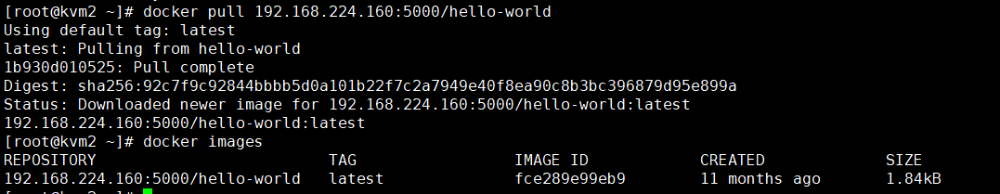

# 一、 Docker 仓库

## 1.1 仓库的理解

仓库（Repository）是集中存放镜像的地方。

​	一个容易混淆的概念是注册服务器（Registry）。实际上注册服务器是管理仓库的具体服务器，每个服务器上可以有多个仓库，而每个仓库下面有多个镜像。从这方面来说，仓库可以被认为是一个具体的项目或目录。

​	例如对于仓库地址 docker.sina.com.cn/centos:centos63 来说，docker.sina.com.cn 是注册服务器地址，centos 是仓库名，centos63 是仓库的tag。 

## 1.2 Docker Hub 官方仓库

目前 Docker 官方维护了一个公共仓库 Docker Hub，其中已经包括了超过 15,000 的镜像。大部分需求，都可以通过在 Docker Hub 中直接下载镜像来实现。

私有仓库项目推荐VMvare Harbor

### 1.2.1 注册&登录

可以通过命令行执行docker login 命令来输入用户名、密码和邮箱来完成注册和登录。注册成功后，本地用户目录的 .docker/config.json中将保存用户的认证信息 

```shell
$ docker login
Login with your Docker ID to push and pull images from Docker Hub. If you don't have a Docker ID, head over to https://hub.docker.com to create one.
Username: fish
Password: 
WARNING! Your password will be stored unencrypted in /root/.docker/config.json.
Configure a credential helper to remove this warning. See
https://docs.docker.com/engine/reference/commandline/login/#credentials-store

```


### 1.2.2 基本操作

用户无需登录即可通过docker search 命令来查找官方仓库中的镜像，并利用docker pull 命令来将它下载到本地。例如以 centos 为关键词进行搜索: 


	可以看到返回了很多包含关键字的镜像，其中包括镜像名字、描述、星级（表示该镜像的受欢迎程度）、是否官方创建、是否自动创建。

​	官方的镜像说明是官方项目组创建和维护的，automated 资源允许用户验证镜像的来源和内容。根据是否是官方提供，可将镜像资源分为两类。

​	一种是类似 centos 这样的基础镜像，被称为基础或根镜像。这些基础镜像是由 Docker 公司创建、验证、支持、提供。这样的镜像往往使用单个单词作为名字。

​	还有一种类型，比如Ɵanon/centos 镜像，它是由 Docker 的用户创建并维护的，往往带有用户名称前缀。可以通过前缀user_name/ 来指定使用某个用户提供的镜像，比如Ɵanon用户。另外，在查找的时候通过 ‐s N 参数可以指定仅显示评价为 N星以上的镜像。 

## 1.3 创建自己的私有仓库 

1. 通过官方的registry容器来运行

2. 本地安装, 我们通过registry这个官方的容器来构建私有仓库

   

   1、首先给仓库服务器设置IP地址信息，本案例为192.168.224.160/24

   + 预环境要求：安装docker-ce程序，并设置开机启动

   

   2、查看docker hub上的registry容器镜像 


3. 将registry镜像拉到本地 

```shell
# 拉取镜像
$ docker pull registry

# 查看镜像
$ docker images 
```

4. 启动容器

```shell
# 新registry的仓库目录是在/var/lib/registry 
# -v 选项指定将/opt/registry/目录挂载给/var/lib/registry/
# 查看镜像中的卷(volume)路径
# docker inspect registry:latest
$ docker run -d -p 5000:5000 --restart=always -v /opt/registry:/var/lib/registry --name registry registry:latest

#查看容器运行状态
$ docker ps -a
CONTAINER ID        IMAGE               COMMAND                  CREATED              STATUS              PORTS                    NAMES
0491e8e3b317        registry            "/entrypoint.sh /etc…"   About a minute ago   Up About a minute   0.0.0.0:5000->5000/tcp   eloquent_edison
```

5.  在防火墙里面放行TCP 5000端口 

```shell
$ firewall-cmd --list-all
$ firewall-cmd --add-port=5000/tcp --permanent
$ firewall-cmd --reload
```

6. 验证

```shell
# 能看到json格式的返回值时，说明registry已经运行起来了。
$ curl 192.168.224.160:5000/v2/_catalog
{"repositories":[]}

# 看看映射目录
$ cd /opt/registry/

```

往仓库push镜像

​	dockers registry V2 版本客户端默认使用https协议去push镜像到仓库服务器，而现在我们的仓库服务器只配置了支持http，所以客户端会push镜像失败。

+ 尝试报错：

```shell
# 拉下官方的hello-world镜像
$ docker pull hello-world 

# 打标签
$ docker tag hello-world 192.168.224.160:5000/hello-world

# 尝试push
$ docker push 192.168.224.160:5000/hello-world:latest
The push refers to repository [192.168.224.160:5000/hello-world]
Get https://192.168.224.160:5000/v2/: http: server gave HTTP response to HTTPS client

```


+ 解决问题

**方法一：**

​	如要希望docker客户端支持http协议，需在启动docker时加入信任仓库参数 --insecure-registry your_registry_ip:port

​	编辑/usr/lib/systemd/system/docker.service 文件增加 --insecure-registry 参数 。


```
# 重启docker
$ systemctl daemon-reload
$ systemctl restart docker
```

重新尝试push，发现成功。

```shell
$ docker push 192.168.224.160:5000/hello-world 
The push refers to repository [192.168.224.160:5000/hello-world]
af0b15c8625b: Pushed 
latest: digest: sha256:92c7f9c92844bbbb5d0a101b22f7c2a7949e40f8ea90c8b3bc396879d95e899a size: 524

$ curl 192.168.224.160:5000/v2/_catalog
{"repositories":["hello-world"]}
```


**方法二**

修改/etc/docker/daemon.json文件也可以，


然后再push镜像，发现成功 

```shell
# 重新加载服务的配置文件
$ systemctl daemon-reload
# 重启docker
$ systemctl restart docker

# 删除仓库里的hello-world镜像
$ rm -rf  /opt/registry/docker/registry/v2/repositories/hello-world/

# 查看是否删除
$ curl 192.168.224.160:5000/v2/_catalog
{"repositories":[]}

# push
$ docker push 192.168.224.160:5000/hello-world:latest
The push refers to repository [192.168.224.160:5000/hello-world]
af0b15c8625b: Pushed 
latest: digest: sha256:92c7f9c92844bbbb5d0a101b22f7c2a7949e40f8ea90c8b3bc396879d95e899a size: 524

# 验证
$ curl 192.168.224.160:5000/v2/_catalog
{"repositories":["hello-world"]}

# 实际上传路径
# /opt/registry/docker/registry/v2/repositories
```

在其他主机上也可以pull下来（采用方案一使客户端支持http协议）


