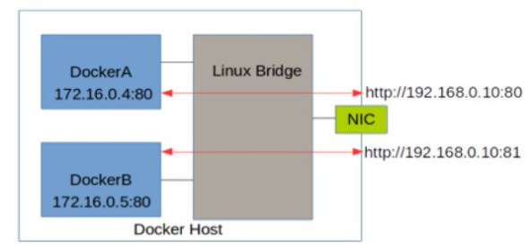

# Docekr网络配置

本节主要是介绍docker默认的网络行为，包含创建的默认网络类型以及如何创建用户自定义网络，也会介绍如何在单一主机或者跨主机集群上创建网络的资源需求。
默认网络 

	当你安装了docker,它自动创建了3个网络，可以使用docker network命令来查看 

```shell
[root@localhost ~]# docker network ls
NETWORK ID          NAME                DRIVER              SCOPE
07ec816fc688        bridge              bridge              local
7fd22e7fa822        host                host                local
c2ad777c52be        none                null                local
```

	这三个网络被docker内建。当你运行一个容器的时候，可以使用--network参数来指定你的容器连接到哪一个网络。 

### 1、bridge网络

​		默认连接到docker0这个网桥上。 

```shell
$ ip addr show docker0
3: docker0: <NO-CARRIER,BROADCAST,MULTICAST,UP> mtu 1500 qdisc noqueue state DOWN group default 
    link/ether 02:42:f8:25:4c:4e brd ff:ff:ff:ff:ff:ff
    inet 172.17.0.1/16 brd 172.17.255.255 scope global docker0
       valid_lft forever preferred_lft forever
    inet6 fe80::42:f8ff:fe25:4c4e/64 scope link 
       valid_lft forever preferred_lft forever
       
 $ brctl show
```

注：brctl 命令在centos中可以使用yum install bridge-utils 来安装 

启动并运行一个容器 

```shell
[root@localhost ~]# docker run -it -d --name test1 centos /bin/bash
Unable to find image 'centos:latest' locally
latest: Pulling from library/centos
729ec3a6ada3: Pull complete 
Digest: sha256:f94c1d992c193b3dc09e297ffd54d8a4f1dc946c37cbeceb26d35ce1647f88d9
Status: Downloaded newer image for centos:latest
d93d62a93a6ba2ed30e36ef40cdb1018e8e14a43c433c5f04b5ca64387dd00cc
[root@localhost ~]# docker ps
CONTAINER ID        IMAGE               COMMAND             CREATED             STATUS              PORTS               NAMES
d93d62a93a6b        centos              "/bin/bash"         7 seconds ago       Up 5 seconds                            test1
```

		可以看到test1容器已经获取了一个地址172.17.0.2，和主机的docker0接口地址在同一网络，并将主机的docker0接口地址设置为了网关。 

```shell
[root@localhost ~]# docker run -it -d --name test1 centos /bin/bash
Unable to find image 'centos:latest' locally
latest: Pulling from library/centos
729ec3a6ada3: Pull complete 
Digest: sha256:f94c1d992c193b3dc09e297ffd54d8a4f1dc946c37cbeceb26d35ce1647f88d9
Status: Downloaded newer image for centos:latest
d93d62a93a6ba2ed30e36ef40cdb1018e8e14a43c433c5f04b5ca64387dd00cc
[root@localhost ~]# docker ps
CONTAINER ID        IMAGE               COMMAND             CREATED             STATUS              PORTS               NAMES
d93d62a93a6b        centos              "/bin/bash"         7 seconds ago       Up 5 seconds                            test1

[root@localhost ~]# docker exec -it test1 /bin/bash
[root@d93d62a93a6b /]# ip addr
1: lo: <LOOPBACK,UP,LOWER_UP> mtu 65536 qdisc noqueue state UNKNOWN group default qlen 1000
    link/loopback 00:00:00:00:00:00 brd 00:00:00:00:00:00
    inet 127.0.0.1/8 scope host lo
       valid_lft forever preferred_lft forever
6: eth0@if7: <BROADCAST,MULTICAST,UP,LOWER_UP> mtu 1500 qdisc noqueue state UP group default 
    link/ether 02:42:ac:11:00:02 brd ff:ff:ff:ff:ff:ff link-netnsid 0
    inet 172.17.0.2/16 brd 172.17.255.255 scope global eth0
       valid_lft forever preferred_lft forever

```

		可以看到test1容器已经获取了一个地址172.17.0.2，和主机的docker0接口地址在同一网络，并将主机的docker0接口地址设置为了网关。 

```shell
[root@d93d62a93a6b /]# yum install net-tools -y

[root@d93d62a93a6b /]# route -n
Kernel IP routing table
Destination     Gateway         Genmask         Flags Metric Ref    Use Iface
0.0.0.0         172.17.0.1      0.0.0.0         UG    0      0        0 eth0
172.17.0.0      0.0.0.0         255.255.0.0     U     0      0        0 eth0

```

在物理主机上，查看网桥docker0，可以看到已经多了一个接口 

```shell
[root@localhost ~]# yum install bridge-utils

[root@localhost ~]# brctl show docker0
bridge name	bridge id		STP enabled	interfaces
docker0		8000.0242f8254c4e	no		veth438e10c

```

Docker 容器默认使用 bridge 模式的网络。其特点如下：

- 使用一个 linux bridge，默认为 docker0 
- 使用 veth 对，一头在容器的网络 namespace 中，一头在 docker0 上 
- 该模式下Docker Container不具有一个公有IP，因为宿主机的IP地址与veth pair的 IP地址不在同一个网段内 
- Docker采用 NAT 方式，将容器内部的服务监听的端口与宿主机的某一个端口port 进行“绑定”，使得宿主机以外的世界可以主动将网络报文发送至容器内部 

- 外界访问容器内的服务时，需要访问宿主机的 IP 以及宿主机的端口 port 

- NAT 模式由于是在三层网络上的实现手段，故肯定会影响网络的传输效率。 
- 容器拥有独立、隔离的网络栈；让容器和宿主机以外的世界通过NAT建立通信
  效果是这样的： 



示意图如下： 


​		在物理主机上查看iptables的nat表，可以看到在POSTROUTING链中做了地址伪装:MASQUERADE动作，这样容器就可以通过源地址转换NAT访问外部网络了。通过iptables -t nat -vnL命令查看到： 

源地址发送数据--> {PREROUTING-->路由规则-->POSTROUTING} -->目的地址接收到数据。

POSTROUTING是源地址转换，要把你的内网地址转换成公网地址才能让你上网。

PREROUTING是目的地址转换，要把别人的公网IP换成你们内部的IP，才让访问到你们内部受防火墙保护的机器。 

```shell
[root@localhost ~]# iptables -t nat -vnL
Chain POSTROUTING (policy ACCEPT 171 packets, 16358 bytes)
 pkts bytes target     prot opt in     out     source               destination         
   35  2209 MASQUERADE  all  --  *      !docker0  172.17.0.0/16        0.0.0.0/0           
  564 43038 POSTROUTING_direct  all  --  *      *       0.0.0.0/0            0.0.0.0/0           
  564 43038 POSTROUTING_ZONES_SOURCE  all  --  *      *       0.0.0.0/0            0.0.0.0/0           
  564 43038 POSTROUTING_ZONES  all  --  *      *       0.0.0.0/0            0.0.0.0/0     
```

可以使用docker network inspect bridge命令来查看bridge网络情况 :

```shell
[root@localhost ~]# docker network inspect bridge
[
    {
        "Name": "bridge",
        "Id": "07ec816fc6889403bb88fe665e195bdd2c5d93099e6d77cabc0de2c7cf91402b",
        "Created": "2019-12-16T19:23:24.235075859-05:00",
        "Scope": "local",
        "Driver": "bridge",
        "EnableIPv6": false,
        "IPAM": {
            "Driver": "default",
            "Options": null,
            "Config": [
                {
                    "Subnet": "172.17.0.0/16",
                    "Gateway": "172.17.0.1"
                }
            ]
        },
        "Internal": false,
        "Attachable": false,
        "Ingress": false,
        "ConfigFrom": {
            "Network": ""
        },
        "ConfigOnly": false,
        "Containers": {
            "d93d62a93a6ba2ed30e36ef40cdb1018e8e14a43c433c5f04b5ca64387dd00cc": {
                "Name": "test1",
                "EndpointID": "1e958f3d600366abeb69cd25aa8fb000d1e52744dd8b9d5a941a04b9cd058252",
                "MacAddress": "02:42:ac:11:00:02",
                "IPv4Address": "172.17.0.2/16",
                "IPv6Address": ""
            }
        },
        "Options": {
            "com.docker.network.bridge.default_bridge": "true",
            "com.docker.network.bridge.enable_icc": "true",
            "com.docker.network.bridge.enable_ip_masquerade": "true",
            "com.docker.network.bridge.host_binding_ipv4": "0.0.0.0",
            "com.docker.network.bridge.name": "docker0",
            "com.docker.network.driver.mtu": "1500"
        },
        "Labels": {}
    }
]

```

### 2、none网络模式： 

​		网络模式为 none，即不为Docker容器构造任何网络环境，不会为容器创建网络接口，一旦Docker容器采用了none网络模式，那么容器内部就只能使用loopback网络设备，不会再有其他的网络资源。Docker Container的none网络模式意味着不给该容器创建任何网络环境，容器只能使用127.0.0.1的本机网络。 

启动一个容器，设为none网络 

```shell
[root@localhost ~]# docker run -it -d --network none --name test2 centos:latest /bin/bash
9c38ed876ff2a4cb386799ff3ef5148cffc4ea1ec10f9a4e49314d4890f8b454
```

进入容器，查看网络情况 

```shell
[root@localhost ~]# docker exec -it test2 /bin/bash
[root@9c38ed876ff2 /]# ip addr
1: lo: <LOOPBACK,UP,LOWER_UP> mtu 65536 qdisc noqueue state UNKNOWN group default qlen 1000
    link/loopback 00:00:00:00:00:00 brd 00:00:00:00:00:00
    inet 127.0.0.1/8 scope host lo
       valid_lft forever preferred_lft forever
[root@9c38ed876ff2 /]# cat /etc/hosts
127.0.0.1	localhost
::1	localhost ip6-localhost ip6-loopback
fe00::0	ip6-localnet
ff00::0	ip6-mcastprefix
ff02::1	ip6-allnodes
ff02::2	ip6-allrouters

```

### 3、host网络模式

​		Host模式并没有为容器创建一个隔离的网络环境。而之所以称之为host模式，是因为该模式下的Docker 容器会和host宿主机共享同一个网络namespace，故Docker Container可以和宿主机一样，使用宿主机的eth0，实现和外界的通信。换言之，Docker Container的IP地址即为宿主机 eth0的IP地址 

其特点包括 :

- 这种模式下的容器没有隔离的 network namespace 
- 容器的 IP 地址同 Docker host 的 IP 地址 
- 需要注意容器中服务的端口号不能与 Docker host 上已经使用的端口号相冲突 
- host 模式能够和其它模式共存 

示意图:


​		例如，我们在192.168.1.102/24 的机器上用 host 模式启动一个含有 web 应用的 Docker容器，监听 tcp 80 端口。当我们在容器中执行任何类似 ifconfig 命令查看网络环境时，看到的都是宿主机上的信息。而外界访问容器中的应用，则直接使用192.168.1.102:80 即可，不用任何 NAT 转换，就如直接跑在宿主机中一样。但是，容器的其他方面，如文件系统、进程列表等还是和宿主机隔离的。 

启动容器前，查看物理主机的httpd进程 

```shell
[root@localhost ~]# pgrep httpd
```

启动一个容器： 

```shell
[root@localhost ~]# docker run -itd --privileged --name test7 --network host centos:latest init
96c6684155e6ad41c3bae2f65787c16817eb347c111426acd5356cef42f2e361
[root@localhost ~]# docker ps
CONTAINER ID        IMAGE               COMMAND             CREATED             STATUS              PORTS               NAMES
96c6684155e6        centos:latest       "init"              7 seconds ago       Up 6 seconds                            test7
9c38ed876ff2        centos:latest       "/bin/bash"         5 minutes ago       Up 5 minutes                            test2
d93d62a93a6b        centos              "/bin/bash"         27 minutes ago      Up 27 minutes                           test1
```

进入容器，安装httpd服务，并启动

```shell
[root@docker01 ~]# docker exec -it test7 /bin/bash
[root@docker01 /]# yum install httpd -y
[root@docker01 /]# systemctl start httpd
[root@docker01 /]# echo "test docker host network" > /var/www/html/index.htm
```

退出容器，再次查看httpd进程 

```shell
[root@localhost ~]# pgrep httpd
20403
20404
20405
20406
20407

```

访问主机的80端口，可以访问到容器test7中的网站服务: (ip写自己的ip地址)


注意防火墙 ：

//  关闭或者开放80端口

```shell
[root@localhost ~]# systemctl stop firewalld  //关闭
[root@localhost ~]# firewall-cmd --add-port=80/tcp //开放80端口

```

### 4、container  模式 

 container [kənˈteɪnər] 这个模式指定新创建的容器和已经存在的一个容器共享一个 Network Namespace，而不是和宿主机共享。新创建的容器不会创建自己的网卡，配置自己的 IP，而是和一个指定的容器共享 IP、端口范围等。同样，两个容器除了网络方面，其他的如文件系统、进程列表等还是隔离的。两个容器的进程可以通过 lo 网卡设备通信 

Container 网络模式是 Docker 中一种较为特别的网络的模式。这两个容器之间不存在网络隔离，而这两个容器又与宿主机以及除此之外其他的容器存在网络隔离。
注意：因为此时两个容器要共享一个network namespace，因此需要注意端口冲突情况，否则第二个容器将无法被启动 

示意图：


运行一个容器：查看容器的IP

```shell
[root@localhost ~]# docker ps
CONTAINER ID        IMAGE               COMMAND             CREATED             STATUS              PORTS               NAMES
96c6684155e6        centos:latest       "init"              12 minutes ago      Up 12 minutes                           test7
9c38ed876ff2        centos:latest       "/bin/bash"         18 minutes ago      Up 18 minutes                           test2
d93d62a93a6b        centos              "/bin/bash"         39 minutes ago      Up 39 minutes                           test1

[root@localhost ~]# docker exec -it test1 /bin/bash
[root@d93d62a93a6b /]# ip a
1: lo: <LOOPBACK,UP,LOWER_UP> mtu 65536 qdisc noqueue state UNKNOWN group default qlen 1000
    link/loopback 00:00:00:00:00:00 brd 00:00:00:00:00:00
    inet 127.0.0.1/8 scope host lo
       valid_lft forever preferred_lft forever
6: eth0@if7: <BROADCAST,MULTICAST,UP,LOWER_UP> mtu 1500 qdisc noqueue state UP group default 
    link/ether 02:42:ac:11:00:02 brd ff:ff:ff:ff:ff:ff link-netnsid 0
    inet 172.17.0.2/16 brd 172.17.255.255 scope global eth0
       valid_lft forever preferred_lft forever

```

启动另外一个容器，使用test1容器的网络

```shell
[root@localhost ~]# docker images
REPOSITORY          TAG                 IMAGE ID            CREATED             SIZE
centos              latest              0f3e07c0138f        2 months ago        220MB
hello-world         latest              fce289e99eb9        11 months ago       1.84kB

[root@localhost ~]# docker run -it -d --name test8 --network container:test1 centos:latest /bin/bash
7bf89d6d05e50c934a2609b5cd3eb3ae2883634fc1e84d8131911b4c9d41751c
[root@localhost ~]# docker ps
CONTAINER ID        IMAGE               COMMAND             CREATED             STATUS              PORTS               NAMES
7bf89d6d05e5        centos:latest       "/bin/bash"         13 seconds ago      Up 13 seconds                           test8
96c6684155e6        centos:latest       "init"              14 minutes ago      Up 14 minutes                           test7
9c38ed876ff2        centos:latest       "/bin/bash"         19 minutes ago      Up 19 minutes                           test2
d93d62a93a6b        centos              "/bin/bash"         41 minutes ago      Up 41 minutes                           test1

```

进入容器test8，查看网络情况，可以看到两个容器地址信息相同，是共享的 

```shell
[root@localhost ~]# docker exec -it test8 /bin/bash
[root@d93d62a93a6b /]# ip a
1: lo: <LOOPBACK,UP,LOWER_UP> mtu 65536 qdisc noqueue state UNKNOWN group default qlen 1000
    link/loopback 00:00:00:00:00:00 brd 00:00:00:00:00:00
    inet 127.0.0.1/8 scope host lo
       valid_lft forever preferred_lft forever
6: eth0@if7: <BROADCAST,MULTICAST,UP,LOWER_UP> mtu 1500 qdisc noqueue state UP group default 
    link/ether 02:42:ac:11:00:02 brd ff:ff:ff:ff:ff:ff link-netnsid 0
    inet 172.17.0.2/16 brd 172.17.255.255 scope global eth0
       valid_lft forever preferred_lft forever

```

​		通过上面的docker网络学习，已经可以实现容器和外部网络通信了，但是如何让外部网络来访问容器呢？ 

外部访问容器:

​	容器中可以运行一些网络应用，要让外部也可以访问这些应用，可以通过 -P 或 -p 参数来指定端口映射。 

​	当使用–P(大写)标记时，Docker 会随机映射一个随机的端口到内部容器开放的网络端口。
注：-P使用时需要指定--expose选项或dockerfile中用expose指令容器要暴露的端口，指定需要对外提供服务的端口 

从docker hub下载一个httpd镜像 

```shell
[root@localhost ~]# docker pull httpd 
Using default tag: latest
latest: Pulling from library/httpd
000eee12ec04: Pull complete 
32b8712d1f38: Pull complete 
f1ca037d6393: Pull complete 
c4bd3401259f: Pull complete 
51c60bde4d46: Pull complete 
Digest: sha256:ac6594daaa934c4c6ba66c562e96f2fb12f871415a9b7117724c52687080d35d
Status: Downloaded newer image for httpd:latest
docker.io/library/httpd:latest

```

使用这个下载的镜像启动一个容器： 

```shell
[root@localhost ~]# docker run -d -P --name web-test001 httpd
e8d35b337e6e25f2d8063d8f5c0176cc2f824c3fbcb7e44039be14d7edef6f0c


// 报错问题-> 如果出现以下问题重启docker即可
[root@localhost ~]# docker run -d -P --name web httpd
85ab55103dfe2ee634f3b194332f24c79db8976cde029462f1e46a67ef511334
docker: Error response from daemon: driver failed programming external connectivity on endpoint web (d798a461d6c5870bdf98408f3631dd3dd8334eba21500e3dd83e8092098ced0f):  (iptables failed: iptables --wait -t nat -A DOCKER -p tcp -d 0/0 --dport 32837 -j DNAT --to-destination 172.17.0.3:80 ! -i docker0: iptables: No chain/target/match by that name.
[root@localhost ~]# systemctl restart docker
[root@localhost ~]# docker run -d -P --name web-test001 httpd
e8d35b337e6e25f2d8063d8f5c0176cc2f824c3fbcb7e44039be14d7edef6f0c

[root@localhost ~]# docker ps
CONTAINER ID        IMAGE               COMMAND              CREATED             STATUS              PORTS                   NAMES
e8d35b337e6e        httpd               "httpd-foreground"   9 seconds ago       Up 9 seconds        0.0.0.0:32768->80/tcp   web-test001

```

可以看到容器的80端口被随机映射到主机的32768端口
访问主机IP地址的32768端s口，就可以访问到容器的httpd服务 


-p（小写）则可以指定要映射的端口，并且，在一个指定端口上只可以绑定一个容器。支
持的格式有ip:hostPort:containerPort | ip::containerPort | hostPort:containerPort
注意 :

- 容器有自己的内部网络和 ip 地址（使用 docker inspect 可以获取所有的变量。 
- -p 标记可以多次使用来绑定多个端口 

```shell
[root@localhost ~]# docker run -d -p 8000:80 --name web-test002 httpd
27a75d5683380eb46b0202b7c02b6f86df0aa241c5be659a9f58450045c8aecd
[root@localhost ~]# docker ps
CONTAINER ID        IMAGE               COMMAND              CREATED             STATUS              PORTS                   NAMES
27a75d568338        httpd               "httpd-foreground"   3 seconds ago       Up 2 seconds        0.0.0.0:8000->80/tcp    web-test002
e8d35b337e6e        httpd               "httpd-foreground"   2 hours ago         Up 2 hours          0.0.0.0:32768->80/tcp   web-test001
```

可以看到主机的8000端口已经和容器web-test002的80端口做了映射
访问主机的8000端口 


映射到指定地址的指定端口
可以使用 ip:hostPort:containerPort 格式，指定映射使用一个特定地址，比如宿主机网卡
配置的一个地址192.168.191.128

```shell
[root@localhost ~]# docker run -dit -p 192.168.191.128:10112:22 -p 192.168.191.128:80:80 centos
07028f1b4e4502b80643e9939d96b6a3c0535613a008327719683cc52b3ac529
[root@localhost ~]# docker ps
CONTAINER ID        IMAGE               COMMAND              CREATED             STATUS              PORTS                                                       NAMES
07028f1b4e45        centos              "/bin/bash"          10 seconds ago      Up 9 seconds        192.168.191.128:80->80/tcp, 192.168.191.128:10112->22/tcp   suspicious_pike
27a75d568338        httpd               "httpd-foreground"   13 minutes ago      Up 12 minutes       0.0.0.0:8000->80/tcp                                        web-test002
e8d35b337e6e        httpd               "httpd-foreground"   2 hours ago         Up 2 hours          0.0.0.0:32768->80/tcp                                       web-test001

```

 映射到指定地址的任意端口 

使用 ip::containerPort 绑定192.168.191.128的任意端口到容器的80端口，本地主机会自动分配一个口。--name为启动的容器指定一个容器名 

```shell
[root@localhost ~]# docker run -dit -p 192.168.191.128::80 --name webserver centos
930e898191975109bbcf64a0fec827152b589e2b26213b22ad73da32649ecf3a

[root@localhost ~]# docker ps
CONTAINER ID        IMAGE               COMMAND             CREATED             STATUS              PORTS                           NAMES
930e89819197        centos              "/bin/bash"         25 seconds ago      Up 24 seconds       192.168.191.128:32772->80/tcp   webserver

```

注：还可以使用 udp 标记来指定 udp 端口 (网络问题。。无法拉取镜像)

```shell
# docker run -d -p 127.0.0.1:5000:5000/udp –name db4 commit:v1
```

查看映射端口配置 

使用 docker port 来查看当前映射的端口配置，也可以查看到绑定的地址 

```shell
[root@localhost ~]# docker start web-test001
web-test001
[root@localhost ~]# docker ps
CONTAINER ID        IMAGE               COMMAND              CREATED             STATUS              PORTS                           NAMES
930e89819197        centos              "/bin/bash"          4 minutes ago       Up 4 minutes        192.168.191.128:32772->80/tcp   webserver
e8d35b337e6e        httpd               "httpd-foreground"   3 hours ago         Up 1 second         0.0.0.0:32769->80/tcp           web-test001
[root@localhost ~]# docker port web-test001
80/tcp -> 0.0.0.0:32769

```

docker端口映射实质上是在iptables 的nat表中添加了DNAT规则 

```shell
[root@localhost ~]# iptables -t nat -nvL
Chain PREROUTING (policy ACCEPT 0 packets, 0 bytes)
 pkts bytes target     prot opt in     out     source               destination         
    9   468 DOCKER     all  --  *      *       0.0.0.0/0            0.0.0.0/0            ADDRTYPE match dst-type LOCAL

Chain INPUT (policy ACCEPT 0 packets, 0 bytes)
 pkts bytes target     prot opt in     out     source               destination         

Chain OUTPUT (policy ACCEPT 0 packets, 0 bytes)
 pkts bytes target     prot opt in     out     source               destination         
    0     0 DOCKER     all  --  *      *       0.0.0.0/0           !127.0.0.0/8          ADDRTYPE match dst-type LOCAL

Chain POSTROUTING (policy ACCEPT 0 packets, 0 bytes)
 pkts bytes target     prot opt in     out     source               destination         
    0     0 MASQUERADE  all  --  *      !docker0  172.17.0.0/16        0.0.0.0/0           
    0     0 MASQUERADE  tcp  --  *      *       172.17.0.2           172.17.0.2           tcp dpt:80
    0     0 MASQUERADE  tcp  --  *      *       172.17.0.3           172.17.0.3           tcp dpt:80

Chain DOCKER (2 references)
 pkts bytes target     prot opt in     out     source               destination         
    0     0 RETURN     all  --  docker0 *       0.0.0.0/0            0.0.0.0/0           
    0     0 DNAT       tcp  --  !docker0 *       0.0.0.0/0            192.168.191.128      tcp dpt:32772 to:172.17.0.2:80
    0     0 DNAT       tcp  --  !docker0 *       0.0.0.0/0            0.0.0.0/0            tcp dpt:32769 to:172.17.0.3:80

```

用户定义网络（User-defined networks）
		建议使用用户定义的桥接网络来控制容器之间彼此通信，并启用容器名称和IP地址的自动DNS解析，docker默认提供了用于创建这些网络的默认网络驱动程序，你能创建 :

- bridge network
- overlay ([ˌoʊvərˈleɪ , ˈoʊvərleɪ]) 覆盖 network
- MACVLAN network
- network plugin
- remote[rɪˈmoʊt]  network

​	您可以根据需要创建尽可能多的网络，并且可以在任何给定的时间将容器连接到0个或多个网络。此外，还可以在不重新启动容器的情况下连接和断开网络中的运行容器。当容器连接到多个网络时，它的外部连接是通过第一个非内部网络提供的 

Bridge networks是docker中最常见的网络类型，它类似与默认的桥接网络，但是添加了一些新功能，去掉了一些旧功能 

可以通过下面的命令创建一个bridge网络 

```shell
[root@localhost ~]# docker network create --driver bridge isolated_nw
c244965a281eb5259505baca332b0df509fcfdddaa8dda7da6611b7e078a2d7d

查看网络情况：
[root@localhost ~]# docker network inspect isolated_nw
[
    {
        "Name": "isolated_nw",
        "Id": "c244965a281eb5259505baca332b0df509fcfdddaa8dda7da6611b7e078a2d7d",
        "Created": "2019-12-17T01:38:35.332602514-05:00",
        "Scope": "local",
        "Driver": "bridge",
        "EnableIPv6": false,
        "IPAM": {
            "Driver": "default",
            "Options": {},
            "Config": [
                {
                    "Subnet": "172.18.0.0/16",
                    "Gateway": "172.18.0.1"
                }
            ]
        },
        "Internal": false,
        "Attachable": false,
        "Ingress": false,
        "ConfigFrom": {
            "Network": ""
        },
        "ConfigOnly": false,
        "Containers": {},
        "Options": {},
        "Labels": {}
    }
]
[root@localhost ~]# docker network ls
NETWORK ID          NAME                DRIVER              SCOPE
15a13835cccf        bridge              bridge              local
7fd22e7fa822        host                host                local
c244965a281e        isolated_nw         bridge              local
c2ad777c52be        none                null                local

```

启动一个容器然后将其加入新创建的网络 

```shell
root@localhost ~]#  docker run -itd --network isolated_nw --name web002 httpd
ff9cad584126ed11141703d5a086264346c817da83895608a32b6700616661e0
[root@localhost ~]# docker network inspect isolated_nw
[
    {
        "Name": "isolated_nw",
        "Id": "c244965a281eb5259505baca332b0df509fcfdddaa8dda7da6611b7e078a2d7d",
        "Created": "2019-12-17T01:38:35.332602514-05:00",
        "Scope": "local",
        "Driver": "bridge",
        "EnableIPv6": false,
        "IPAM": {
            "Driver": "default",
            "Options": {},
            "Config": [
                {
                    "Subnet": "172.18.0.0/16",
                    "Gateway": "172.18.0.1"
                }
            ]
        },
        "Internal": false,
        "Attachable": false,
        "Ingress": false,
        "ConfigFrom": {
            "Network": ""
        },
        "ConfigOnly": false,
        "Containers": {
            "ff9cad584126ed11141703d5a086264346c817da83895608a32b6700616661e0": {
                "Name": "web002",
                "EndpointID": "f9da77ded670ccd8c8990c58203416b35b228d5175737f6a50a04852c02fdf31",
                "MacAddress": "02:42:ac:12:00:02",
                "IPv4Address": "172.18.0.2/16",
                "IPv6Address": ""
            }
        },
        "Options": {},
        "Labels": {}
    }
]

```

​		加入你创建的网络中的容器必须在同一个HOST主机上，网络中的每个容器都可以立即与网络中的其他容器通信。然而，网络本身将容器与外部网络隔离开来。 


在用户定义的网桥网络中，不支持linking。可以在这个网络中公开和发布容器端口,也就是`expose and publish` 。 


如果你想在单一主机上运行一个相对小的网络，使用桥接网络是有效果的。
然而你想创建一个大网络，可以通过overlay 网络来实现。 

### 跨主机docker容器通信方案介绍： 

现有的主要Docker网络方案 

基于实现方式分类： 

#### 隧道方案

通过隧道，或者说Overlay Networking的方式：

- Weave [wiːv]：UDP广播，本机建立新的BR，通过PCAP互通。 
- Open vSwitch(OVS虚拟交换机)：基于VxLAN和GRE协议，但是性能方面损失比较严重 
- Flannel [rɪˈmoʊt] ：UDP广播，VxLan 。

​	隧道方案在IaaS层的网络中应用也比较多，大家共识是随着节点规模的增长复杂度会提升，而且出了网络问题跟踪起来比较麻烦，大规模集群情况下这是需要考虑的一个 

#### 路由方案

通过路由来实现，比较典型的代表有 ：

- Calico[ˈkælɪkoʊ] ：基于BGP协议的路由方案，支持很细致的ACL控制，对混合云亲和度比较高
- Macvlan：（把一个物理网卡当多个物理网卡用）从逻辑和Kernel层来看隔离性和性能最优的方案，基于二层隔离，所以需要二层路由器支持，大多数云服务商不支持，所以混合云上比较难以实现。

路由方案一般是从3层或者2层实现隔离和跨主机容器互通的，出了问题也很容易排查。

### 基于网络模型分类

**Docker Libnetwork Container Network Model(CNM)阵营**

- Docker Swarm overlay（Docker群覆盖）
- Macvlan & IP network drivers（- Macvlan和IP网络驱动程序）
- Calico
- Contiv（from Cisco）（Contiv(思科)）

Docker Libnetwork的优势就是原生，而且和Docker容器生命周期结合紧密；缺点也可以理解为是原生，被Docker“绑架”。

**Container Network Interface(CNI)阵营** 

- Kubernetes
- Weave
- Macvlan
- Flannel
- Calico
- Contiv
- Mesos CNI 

CNI的优势是兼容其他容器技术(e.g. rkt)及上层编排系统(Kuberneres & Mesos//'maisɔːs//)，而且社区活跃势头迅猛，Kubernetes加上CoreOS主推；缺点是非Docker原生。

**从上的可以看出，有一些第三方的网络方案是同时属于两个阵营的。** 

下面主要介绍了Docker容器平台中的libnetwork，flannel，calico，weave这几种跨主机通信方案，并对各个方案的原理进行阐述 

**Libnetwork**（图书馆网络）

Libnetwork是从1.6版本开始将Docker的网络功能从Docker核心代码中分离出去，形成一个单独的库。Libnetwork的目标是定义一个健壮的容器网络模型，提供一个一致的编程接口和应用程序的网络抽象。

Libnetwork通过插件的形式为Docker提供网络功能，使得用户可以根据自己的需求实现自己的Driver来提供不同的网络功能。从1.9版本开始，docker已经实现了基于Libnetwork和libkv库的网络模式-多主机的Overlay网络。

Libnetwork所要实现的网络模型基本是这样的：用户可以创建一个或多个网络(一个网络就是一个网桥或者一个VLAN)，一个容器可以加入一个或多个网络。 同一个网络中容器可以通信，不同网络中的容器隔离。

Libnetwork实现了一个叫做Container Network Model (CNM)的东西，也就是说希望成为容器的标准网络模型、框架。其包含了下面几个概念： 


- Sandbox。Sandbox包含容器网络栈的配置，包括容器接口，路由表，DNS配置等的管理。 linux network namespace是常见的一种sandbox的实现。Sandbox中包含众多网络中的若干Endpoint。 

- Endpoint。Neutron中和Endpoint相对的概念应该是VNIC，也就是虚拟机的虚拟网卡（也可以看成是VIF）。Endpoint的常见实现包括veth pair、Openvswitch的internal port。当Sandbox要和外界通信的时候就是通过Endpoint连接到外界的，最简单的情况就是连接到一个Bridge上

-  Network。Network是一组可以互相通信的Endpoints集合，组内endpoint可以相互通讯。不同组内endpoint是不能通迅的，是完全隔离的。常见的实现包括linux，bridge,vlan等

  

目前已经实现了如下Driver： 

- Host：主机网络，只用这种网络的容器会使用主机的网络，这种网络对外界是完全开放的，能够访问到主机，就能访问到容器 。

- Bridge：桥接网络，这个Driver就是Docker现有网络Bridge模式的实现。除非创建容器的时候指定网络，不然容器就会默认的使用桥接网络。属于这个网络的容器 

- Null： Driver的空实现，类似于Docker容器的None模式。使用这种网络的容器会完全隔离。

- Overlay： Overlay驱动可以实现通过vxlan等重叠网络封装技术跨越多个主机的网络，目前Docker已经自带该驱动。

- Remote：Remote驱动包不提供驱动，但提供了融合第三方驱动的接口。

  

### **Flannel** 

Flannel之前的名字是Rudder，它是由CoreOS团队针对Kubernetes设计的一个重载网络工具，它的主要思路是：预先留出一个网段，每个主机使用其中一部分，然后每个容器被分配不同的ip；让所有的容器认为大家在同一个直连的网络，底层通过UDP/VxLAN等进行报文的封装和转发。 

Flannel类似于weave、vxlan，提供了一个可配置的虚拟承载网络。Flannel以一个daemon形式运行，负责子网的分配，flannel使用etcd存储、交换网络配置、状态等信息。 

#### flannel基本原理

flannel默认使用8285端口作为UDP封装报文的端口，VxLan使用8472端口。


1. 容器直接使用目标容器的ip访问，默认通过容器内部的eth0发送出去。
2. 报文通过veth pair被发送到vethXXX。
3. vethXXX是直接连接到虚拟交换机docker0的，报文通过虚拟bridge docker0发送出去。
4. 查找路由表，外部容器ip的报文都会转发到flannel0虚拟网卡，这是一个P2P的虚拟网卡，然后报文就被转发到监听在另一端的flanneld。
5. flanneld通过etcd维护了各个节点之间的路由表，把原来的报文UDP封装一层，通过配置的iface发送出去。
6. 报文通过主机之间的网络找到目标主机。
7. 报文继续往上，到传输层，交给监听在8285端口的flanneld程序处理。
8. 数据被解包，然后发送给flannel0虚拟网卡。
9. 查找路由表，发现对应容器的报文要交给docker0。
10. docker0找到连到自己的容器，把报文发送过去。 

### vxlan报文结构：


### **Calico** 

Calico是一个纯3层的数据中心网络方案，而且无缝集成像OpenStack这种IaaS云架构，能够提供可控的VM、容器、裸机之间的IP通信。

它基于BPG协议和Linux自己的路由转发机制，不依赖特殊硬件，没有使用NAT或Tunnel等技术。能够方便的部署在物理服务器、虚拟机或者容器环境下。同时它自带的基于Iptables的ACL管理组件非常灵活，能够满足比较复杂的安全隔离需求。

Calico在每一个计算节点利用Linux Kernel实现了一个高效的vRouter来负责数据转发，而每个vRouter通过BGP协议负责把自己上运行的workload的路由信息向整个Calico网络内传播—小规模部署可以直接互联，大规模下可通过指定的BGP route reflector来完成。这样保证最终所有的workload之间的数据流量都是通过IP路由的方式完成互联的 

#### Calico基本原理 


Calico的方案如上图所示。它把每个操作系统的协议栈认为是一个路由器，然后把所有的容器认为是连在这个路由器上的网络终端，在路由器之间跑标准的路由协议—BGP的协议，然后让它们自己去学习这个网络拓扑该如何转发。所以Calico方案其实是一个纯三层的方案，也就是说让每台机器的协议栈的三层去确保两个容器，跨主机容器之间的三层连通性 

#### Calico架构


结合上面这张图，我们来过一遍Calico的核心组件：

- Felix:Calico Agent，跑在每台需要运行Workload的节点上，主要负责配置路由及ACLS等信息来确保Endpoint的连通状态。 
- etcd:分布式键值存储，主要负责网络元数据一致性，确保Calico网络状态的准确性。 
- BGP Client（BIRD）: 主要负责把Felix写入Kernel的路由信息分发到当前Calico网络，确保Workload间的通信的有效性 。
- BGP Route Reflector（BIRD）：大规模部署时使用，摒弃所有节点互联的 mesh模式，通过一个或者多个BGP Route Reflector来完成集中式的路由分发。 

每个节点上会运行两个主要的程序，一个是它自己的叫Felix，它会监听ECTD中心的存储，从它获取事件，比如说用户在这台机器上加了一个IP，或者是分配了一个容器等。接着会在这台机器上创建出一个容器，并将其网卡、IP、MAC都设置好，然后在内核的路由表里面写一条，注明这个IP应该到这张网卡。

bird是一个标准的路由程序，它会从内核里面获取哪一些IP的路由发生了变化，然后通过标准BGP的路由协议扩散到整个其他的宿主机上，让外界都知道这个IP在这里，你们路由的时候得到这里来。

由于Calico是一种纯三层的实现，因此可以避免与二层方案相关的数据包封装的操作，中间没有任何的NAT，没有任何的overlay，所以它的转发效率可能是所有方案中最高的，因为它的包直接走原生TCP/IP的协议栈，它的隔离也因为这个栈而变得好做。因为TCP/IP的协议栈提供了一整套的防火墙的规则，所以它可以通过IPTABLES的规则达到比较复杂的隔离逻辑。 

#### Calico优劣势 

- Calico的优势
  1. 网络拓扑直观易懂，平行式扩展，可扩展性强
  2. 容器间网络三层隔离，无需要担心arp风暴
  3. 基于iptable/linux kernel包转发效率高，损耗低
  4. 更容易的编程语言(python)
  5. 社区活跃，正式版本较成熟 
- Calico的劣势
  1. calico仅支持TCP, UDP, ICMP andICMPv6协议，如果你想使用L4协议，你只能选择Flannel,Weave或Docker Overlay Network。
  2. Calico没有加密数据路径。 用不可信网络上的Calico建立覆盖网络是不安全的。
  3. 没有IP重叠支持。 虽然Calico社区正在开发一个实验功能，将重叠IPv4包放入IPv6包中。 但这只是一个辅助解决方案，并不完全支持技术上的IP重叠 

### Weave 

Weave是由Zett.io公司开发的，它能够创建一个虚拟网络，用于连接部署在多台主机上的Docker容器，这样容器就像被接入了同一个网络交换机，那些使用网络的应用程序不必去配置端口映射和链接等信息 。

外部设备能够访问Weave网络上的应用程序容器所提供的服务，同时已有的内部系统也能够暴露到应用程序容器上。Weave能够穿透防火墙并运行在部分连接的网络上，另外，Weave的通信支持加密，所以用户可以从一个不受信任的网络连接到主机 

#### Weave实现原理 


容器的网络通讯都通过route服务和网桥转发。


Weave会在主机上创建一个网桥,每一个容器通过veth pair连接到该网桥上，同时网桥上有个Weave router的容器与之连接，该router会通过连接在网桥上的接口来抓取网络包(该接口工作在Promiscuous模式)。 

在每一个部署Docker的主机(可能是物理机也可能是虚拟机)上都部署有一个W(即Weaverouter)，它本身也可以以一个容器的形式部署)。Weave run的时候就可以给每个veth的容器端分配一个ip和相应的掩码。veth的网桥这端就是Weave router容器，并在Weavelaunch的时候分配好ip和掩码。 

Weave网络是由这些weave routers组成的对等端点(peer)构成，每个对等的一端都有自己的名字，其中包括一个可读性好的名字用于表示状态和日志的输出，一个唯一标识符用于运行中相互区别，即使重启Docker主机名字也保持不变，这些名字默认是mac地址。 

每个部署了Weave router的主机都需要将TCP和UDP的6783端口的防火墙设置打开，保证Weave router之间控制面流量和数据面流量的通过。控制面由weave routers之间建立的TCP连接构成，通过它进行握手和拓扑关系信息的交换通信。 这个通信可以被配置为加密通信。而数据面由Weave routers之间建立的UDP连接构成，这些连接大部分都会加密。这些连接都是全双工的，并且可以穿越防火墙。 

#### Weave优劣势

- Weave优势 
  1. 支持主机间通信加密。
  2. 支持container动态加入或者剥离网络。
  3. 支持跨主机多子网通信。 
- Weave劣势

  1. 只能通过weave launch或者weave connect加入weave网络。


### **各方案对比**

- Flannel和overlay方案均使用承载网络，承载网络的优势和劣势都是非常明显。**优势有**：对底层网络依赖较少，不管底层是物理网络还是虚拟网络，对层叠网络的配置管理影响较少；配置简单，逻辑清晰，易于理解和学习，非常适用于开发测试等对网络性能要求不高的场景。

  **劣势主要包括**：网络封装是一种传输开销，对网络性能会有影响，不适用于对网络性能要求高的生产场景；由于对底层网络结构缺乏了解，无法做到真正有效的流量工程控制，也会对网络性能产生影响；某些情况下也不能完全做到与下层网络无关，例如隧道封装会对网络的MTU限制产生影响。

- Calico方案因为没有隧道封装的网络开销，会带来相对较高的网络性能。不支持多租户，由于没有封装所有的容器只能通过真实的IP来区分自己，这就要求所有租户的容器统一分配一个地址空间。Calico基于三层转发的原理对物理架构可能会有一定的要求和侵入性。
- weave可以穿透防火墙，安全性较高，流量是被加密的，允许主机连接通过一个不被信任的网络，同样会有承载网络的带来的优缺点。        
