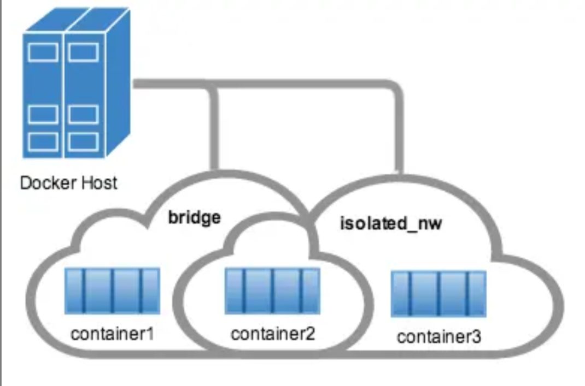
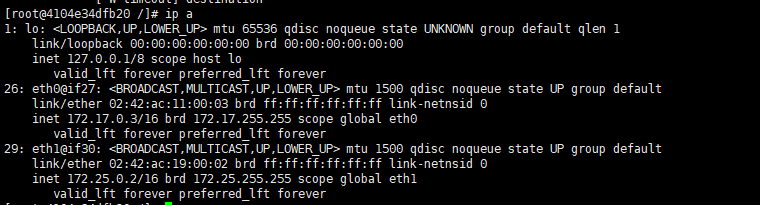
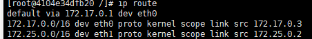
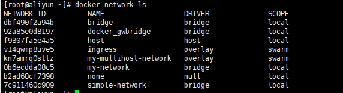

# 8、docker网络命令

docker网络管理命令如下：

- docker network create
- docker network connect
- docker network ls
- docker network rm
- docker network disconnect
- docker network inspect  

## 创建网络

### 默认创建的师bridge网络

```bash
$ docker network create simple-network

7c911460c909607dadc2bf2b9c12eeda4696e94fba63365ba498a94032478b9e

```

```bash
$ docker network inspect simple-network
[
    {
        "Name": "simple-network",
        "Id": "7c911460c909607dadc2bf2b9c12eeda4696e94fba63365ba498a94032478b9e",
        "Created": "2019-12-17T15:19:31.76286118+08:00",
        "Scope": "local",
        "Driver": "bridge",#注意这里
        "EnableIPv6": false,
        "IPAM": {
            "Driver": "default",
            "Options": {},
            "Config": [
                {
                    "Subnet": "172.19.0.0/16",
                    "Gateway": "172.19.0.1"
                }
            ]
        },
        "Internal": false,
        "Attachable": false,
        "Ingress": false,
        "ConfigFrom": {
            "Network": ""
        },
        "ConfigOnly": false,
        "Containers": {},
        "Options": {},
        "Labels": {}
    }
]

```

### overlay网络

不像bridge网络，直接可以创建。创建overlay网络需要一些条件：  

- 访问到一个键值存储。支持Consul,Etcd,ZooKeeper分布式键值存储
- 与键值存储连接的主机集群。
- 在swarm群集中的每个主机上正确配置了引擎的daemon。  

  支持overlay网络的docker选项：

- --cluster­store
- ­­--cluster­store­opt
- --­­cluster­advertise 

**当你创建了一个网络，默认会创建一个不重叠的子网，**使用--subnet选项可以直接指定子网络，在bridge网络中只可以指定一个子网络，而在overlay网络中支持多个子网络。

**注意 ：强烈建议在创建网络时使用`--subnet` 选项。 如果未指定`--subnet` 则Docker daemon会自动为网络选择并分配子网，这可能会导致与您基础结构中的另一个子网（该子网不受`--subnet` 管理）重叠。 当容器连接到该网络时，这种重叠可能导致连接问题或故障**

​		除了--subnet,还可以指定：--gateway,--ip-range,--aux-address选项  

```bash
$ docker network create -d overlay \
  --subnet=192.168.0.0/16 \
  --subnet=192.170.0.0/16 \
  --gateway=192.168.0.100 \
  --gateway=192.170.0.100 \
  --ip-range=192.168.1.0/24 \
  --aux-address="my-router=192.168.1.5" --aux-address="my-switch=192.168.1.6" \
  --aux-address="my-printer=192.170.1.5" --aux-address="my-nas=192.170.1.6" \
  my-multihost-network
  
  
  
 #如果报错 执行  docker swarm init
```

确保您的子网不重叠。 如果重叠，那么网络将会创建失败，Docker Engine返回错误。

创建自定义网络时，您可以向驱动传递其他选项。 `bridge` 驱动程序接受以下选项：

| Option                                           | Equivalent  | Description                     |
| ------------------------------------------------ | ----------- | ------------------------------- |
| `com.docker.network.bridge.name`                 | -           | 创建Linux网桥时要使用的网桥名称 |
| `com.docker.network.bridge.enable_ip_masquerade` | `--ip-masq` | 启用IP伪装                      |
| `com.docker.network.bridge.enable_icc`           | `--icc`     | 启用或禁用跨容器连接            |
| `com.docker.network.bridge.host_binding_ipv4`    | `--ip`      | 绑定容器端口时的默认IP          |
| `com.docker.network.driver.mtu`                  | `--mtu`     | 设置容器网络MTU                 |

`overlay` 驱动也支持`com.docker.network.driver.mtu` 选项。

以下参数可以传递给任何网络驱动的`docker network create` 。

| Argument     | Equivalent | Description          |
| ------------ | ---------- | -------------------- |
| `--internal` | -          | 限制对网络的外部访问 |
| `--ipv6`     | `--ipv6`   | 启用IPv6网络         |

 以下示例使用`-o` 选项，在绑定端口时绑定到指定的IP地址，然后使用`docker network inspect` 来检查网络，最后将新容器attach到新网络。 

```shell
$ docker network create -o "com.docker.network.bridge.host_binding_ipv4"="172.19.0.1" my-network
0b6ecdda08c510ee8690d223eed41616cae0afbe5e40b3e2cf16c5ef677108a5


$ docker network inspect my-network
[
    {
        "Name": "my-network",
        "Id": "0b6ecdda08c510ee8690d223eed41616cae0afbe5e40b3e2cf16c5ef677108a5",
        "Created": "2019-12-17T15:49:47.406153507+08:00",
        "Scope": "local",
        "Driver": "bridge",
        "EnableIPv6": false,
        "IPAM": {
            "Driver": "default",
            "Options": {},
            "Config": [
                {
                    "Subnet": "172.23.0.0/16",
                    "Gateway": "172.23.0.1"
                }
            ]
        },
        "Internal": false,
        "Attachable": false,
        "Ingress": false,
        "ConfigFrom": {
            "Network": ""
        },
        "ConfigOnly": false,
        "Containers": {},
        "Options": {
            "com.docker.network.bridge.host_binding_ipv4": "172.19.0.1"#注意这里
        },
        "Labels": {}
    }
]


$ docker run -d -P --name redis --network my-network redis
02ed3918b9f19bc955e9dbbc4a1c0776ea3397e090217b9fa801af8dee02c138


$ docker ps
CONTAINER ID        IMAGE               COMMAND                  CREATED              STATUS              PORTS                        NAMES
02ed3918b9f1        redis               "docker-entrypoint.s…"   About a minute ago   Up About a minute   172.19.0.1:32768->6379/tcp   redis

```

## 连接容器

您可以将一个现有容器连接到一个或多个网络。 容器可连接到使用不同网络驱动的网络。 一旦连接，容器即可使用另一个容器的IP地址或名称进行通信。

对于支持多主机连接的`overlay` 网络或自定义插件，不同主机上的容器，只要连接到同一multi-host network多主机网络，也可以这种方式进行通信。

### 基本容器网络示例

1. 首先，创建并运行两个容器， `container1`和`container2` ：

   

   ```shell
   $ docker run -itd --name=container1 centos /bin/bash
   
   ace00335aaeafc0ed8a31caf30bcde9db48ca12486e3a1abbab904e1cde836b9
   
   $ docker run -itd --name=container2 centos /bin/bash
   
   4104e34dfb207d642ae4f0244f6e40492a3eff44b68e5d3276b2065c42da279a
   ```

2.  创建一个用户自定义网络isolated_nw，是bridge网络  

   ```bash
   $ docker network create -d bridge --subnet 172.25.0.0/16 --gateway 172.25.0.1 isolated_nw
   
   b763925fefae7c5da735c0f424579873ae56627283b95a705498cf71125d024e
   ```

   

3.  连接continer2容器到这个新创建的网络，并inspect这个网络，检查网络的连接  


```bash
$ docker network connect isolated_nw container2
$ docker network inspect isolated_nw
[
    {
        "Name": "isolated_nw",
        "Id": "b763925fefae7c5da735c0f424579873ae56627283b95a705498cf71125d024e",
        "Created": "2019-12-17T15:57:12.96342471+08:00",
        "Scope": "local",
        "Driver": "bridge",
        "EnableIPv6": false,
        "IPAM": {
            "Driver": "default",
            "Options": {},
            "Config": [
                {
                    "Subnet": "172.25.0.0/16",
                    "Gateway": "172.25.0.1"
                }
            ]
        },
        "Internal": false,
        "Attachable": false,
        "Ingress": false,
        "ConfigFrom": {
            "Network": ""
        },
        "ConfigOnly": false,
        "Containers": {
            "4104e34dfb207d642ae4f0244f6e40492a3eff44b68e5d3276b2065c42da279a": {
                "Name": "container2",
                "EndpointID": "904d8e4746174d527deaa8b756124e6a560ef8ec1956059216a65699f8b6b6b6",
                "MacAddress": "02:42:ac:19:00:02",
                "IPv4Address": "172.25.0.2/16",#已经分配ip
                "IPv6Address": ""
            }
        },
        "Options": {},
        "Labels": {}
    }
]

# 请注意， container2 自动分配了一个IP地址。 因为在创建网络时指定了--subnet 选项，所以IP地址会从该子网选择。
```

4.   启动第三个容器，但这次使用`--ip` 标志分配一个IP地址，并使用 `docker run`命令的`--network`选项将其连接到`--isolated_nw`网络  

   ```bash
   $ docker run -itd --name container3 --network isolated_nw --ip=172.25.3.3 centos /bin/bash
   
   5d4c7a6632e243af09261b7fa30efe390fcc1b17dc752bcda63bbe113a9b62ce
   
   # 使用--ip和--ip6参数指定的IP地址，如果是用户定义的网络，在容器重启的时候，会保持有效，如果不是用户定义的网络，分配的IP地址是不会保持有效的
   ```

5.  检查`container3` 所使用的网络资源。 简洁起见，截断以下输出。 

   ```bash
   $ docker inspect --format=''  container3
   # 简短截取返回数据
   "Networks": {
                   "isolated_nw": {
                       "IPAMConfig": {
                           "IPv4Address": "172.25.3.3"
                       },
                       "Links": null,
                       "Aliases": [
                           "fe3ee4c044dc"
                       ],
                       "NetworkID": "b763925fefae7c5da735c0f424579873ae56627283b95a705498cf71125d024e",
                       "EndpointID": "8b0535c36787b7ad207c1cc436d0a6c8d56aad1ca66bd1364d3e70bf2e30a56a",
                       "Gateway": "172.25.0.1",
                       "IPAddress": "172.25.3.3",
                       "IPPrefixLen": 16,
                       "IPv6Gateway": "",
                       "GlobalIPv6Address": "",
                       "GlobalIPv6PrefixLen": 0,
                       "MacAddress": "02:42:ac:19:03:03",
                       "DriverOpts": null
                   }
   
   ```

6.  检查`container2` 所使用的网络。 如果你安装了Python，你可以打印输出格式化 

   ```bash
   $ docker inspect --format=''  container2 | python -m json.tool
   
   Networks": {
                   "bridge": {
                       "Aliases": null,
                       "DriverOpts": null,
                       "EndpointID": "ee4c9d070c7913501913b000f72dc54c29cd7c820f9b607303a86970decc86aa",
                       "Gateway": "172.17.0.1",
                       "GlobalIPv6Address": "",
                       "GlobalIPv6PrefixLen": 0,
                       "IPAMConfig": null,
                       "IPAddress": "172.17.0.3",
                       "IPPrefixLen": 16,
                       "IPv6Gateway": "",
                       "Links": null,
                       "MacAddress": "02:42:ac:11:00:03",
                       "NetworkID": "dbf490f2a94b33b0925b248ae4c709adf447103decb0adda53ca0a1d841995de"
                   },
                   "isolated_nw": {
                       "Aliases": [
                           "4104e34dfb20"
                       ],
                       "DriverOpts": {},
                       "EndpointID": "904d8e4746174d527deaa8b756124e6a560ef8ec1956059216a65699f8b6b6b6",
                       "Gateway": "172.25.0.1",
                       "GlobalIPv6Address": "",
                       "GlobalIPv6PrefixLen": 0,
                       "IPAMConfig": {},
                       "IPAddress": "172.25.0.2",
                       "IPPrefixLen": 16,
                       "IPv6Gateway": "",
                       "Links": null,
                       "MacAddress": "02:42:ac:19:00:02",
                       "NetworkID": "b763925fefae7c5da735c0f424579873ae56627283b95a705498cf71125d024e"
                   }
   
   ```

    请注意，现在 `container2` 属于两个网络。 



7.   进入容器continer2，并尝试和continer3及continer1通信  

   ```bash
   $ docker attach container2
   ```

    使用 `ip a` 命令检查容器的网络堆栈。 您应该看到两个以太网卡，一个用于默认`bridge` ，另一个用于`isolated_nw` 网络。 

   ```bash
   $ ip a
   ```

   

   ```bash
   $ ip route
   ```

   

     有两个IP,网关是连接到的第一个网络的网关  

     docker内嵌了DNS服务，意思是链接到同一个网络的容器，可以使用容器名进行通信。  

   ```bash
   $ ping container3
   PING container3 (172.25.3.3) 56(84) bytes of data.
   64 bytes from container3.isolated_nw (172.25.3.3): icmp_seq=1 ttl=64 time=0.081 ms
   64 bytes from container3.isolated_nw (172.25.3.3): icmp_seq=2 ttl=64 time=0.152 ms
   
   ```

     默认的bridge网络是不可以使用名称通信的，IP可以  

   ```bash
   $ ping container1
   ping: container1: Name or service not known
   $ ping 172.17.0.2
   PING 172.17.0.2 (172.17.0.2) 56(84) bytes of data.
   64 bytes from 172.17.0.2: icmp_seq=1 ttl=64 time=0.101 ms
   64 bytes from 172.17.0.2: icmp_seq=2 ttl=64 time=0.073 ms
   
   ```

     如果想让默认网络中，也可以使用容器名进行通信呢？
   使用link的特性。这是唯一推荐使用link的场景。应该使用自定义的网络来替代它的。  


​		在默认网络中使用link增加了一下特性：

- 解析容器名到IP地址
- 定义网络别名
  -   --link=CONTAINER-NAME:ALIAS  
-   增强网络连接的安全性  
-   环境变量注入  


```bash
$ docker run -itd --name container4 --link container1:c1 centos /bin/bash
ef77cd22f56f580f173bc1715be94cf533502d63fc237b4fba9b1474b8d9754d

$ docker attach container4
$ ping c1
PING c1 (172.17.0.2) 56(84) bytes of data.
64 bytes from c1 (172.17.0.2): icmp_seq=1 ttl=64 time=0.096 ms
64 bytes from c1 (172.17.0.2): icmp_seq=2 ttl=64 time=0.096 ms

```

###   取消连接

```bash
$ docker network disconnect isolated_nw container2
$ docker network disconnect isolated_nw container3
```

### 删除网络

```bash
$ docker network rm isolated_nw
# 查看网络
$ docker network ls
```



