# 一、 KVM 介绍

## 1.1 KVM简介

​	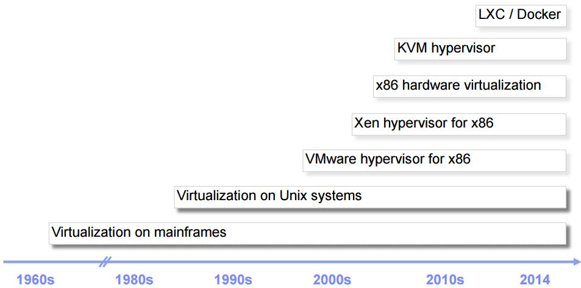

20世纪60年代virtualization 虚拟化主框架

虚拟化技术的初衷是为了优化内存

99年VMware Workstation诞生

VMware hypervisor  在x86上成功运行

Citrix（//ˈsɪtri:ks//美国思杰公司） Xen //zi:n//


KVM 全称是 基于内核的虚拟机（Kernel-based Virtual Machine），它是一个 Linux 的一个内核模块，该内核模块使得 Linux 变成了一个 Hypervisor。

KVM最初是由以色列的公司Qumranet（//kju'ma,net//）开发的。**KVM在2007年2月被正式合并到Linux 2.6.20核心中，成为内核源代码的一部分。**

​	2008年9月4日，RedHat公司收购了Qumranet，开始在RHEL中用KVM替换Xen，第一个包含KVM的版本是RHEL5.4。从RHEL6开始，KVM成为默认的虚拟化引擎。

​	**KVM必须在具备Intel VT或AMD-V功能的X86平台上运行。**它也被移植到S/390、PowerPC与IA-64平台上。在Linux内核3.9版中，加入了对ARM架构的支持。
​	KVM包含一个为处理器提供底层虚拟化、可加载的核心模块kvm.ko（kvm-intel.ko或kvm-amd.ko），使用QEMU（快速仿真器 Quick EMUlator  [ˈemjuleɪtər] ）（QEMU-KVM）作为虚拟机上层控制工具。KVM不需要改变Linux或Windows系统就能运行。

- 它由 Quramnet 开发，该公司于 2008 年被 Red Hat 收购。
- 它支持 x86 (32 and 64 位), s390, Powerpc 等 CPU。
- 它从 Linux 2.6.20 起就作为一模块被包含在 Linux 内核中。
- 它需要支持虚拟化扩展的 CPU。
- 它是完全开源的。[官网](http://www.linux-kvm.org/page/Main_Page)。

本课程介绍的是基于 X86 CPU 的 KVM。

## 1.2 KVM的优势

KVM的优势主要体现在以下几点。

1. 开源
   	KVM是一个开源项目，这就决定了KVM一直是开放的姿态，许多虚拟化的新技术都是首先在KVM上应用，再到其他虚拟化引擎上推广。
      	虚拟化一般网络和存储都是难点。网络方面，SRIOV（SR-IOV（Single Root I/O Virtualization）可允许Windows操作系统和微软的Hyper-V或VMware的ESXi等hypervisor对服务器的磁盘I/O设备，如现在SR-IOV对网卡设备一样进行封装，管理甚至共享。）技术就是最先在KVM上先有应用，然后再推广到其他虚拟化引擎上。再比如SDN（软件定义网络（Software Defined Network）是网络虚拟化的一种实现方式。）、Open vSwitch（Open vSwitch即开放虚拟交换标准！具体点说，Open vSwitch是在开源的Apache2.0许可下的产品级质量的多层虚拟交换标准！它旨在通过编程扩展，使庞大的网络自动化（配置、管理、维护））这些比较新的技术，都是先在KVM上得到应用。
   磁盘方面，基于SSD的分层技术，都是最早在KVM上得到应用。
   	KVM背靠Linux这棵大树，和Linux系统紧密结合，在Linux上的新技术都可以马上应用到KVM上。围绕KVM的是一个开源的生态链，从底层的Linux系统，到中间层的Libvirt管理工具，到云管理平台OpenStack，莫不是如此。

2. 性能

   ​	KVM吸引许多人使用的一个动因就是性能，在同样的硬件条件下，能提供更好的虚拟机性能，主要是因为KVM架构简单，代码只有2万行，一开始就支持硬件虚拟化，这些技术特点保证了KVM的性能。

   

3. 免费

   ​	KVM因为是开源项目，绝大部分KVM的解决方案都是免费方案，随着KVM的发展， KVM虚拟机越来越稳定，兼容性也越来越好，因而也就得到越来越多的应用。

   

4. 广泛免费的技术支持

   ​	免费并不意味着KVM没有技术支持。在KVM的开源社区，数量巨大的KVM技术支持者都可以提供KVM技术支持。另外，如果需要商业级支持，也可以购买红帽公司的服务。


## 1.3KVM与常用企业级虚拟化产品的PK

目前常见的企业级的虚拟化产品有4款：分别是VMware、HyperV、Xen、KVM。

1. VMware

   ​	VMware是最早的X86平台上的虚拟化引擎，1999年就发布了第一款产品，经过十几年的发展和市场检验，产品成熟、稳定，兼容性也不错。VMware的产品线非常全面，不仅有虚拟化的解决方案，在IaaS、SaaS、PaaS层都有自己的产品。并且VMware在网络、存储方面都有相关的解决方案，VMware和网络存储厂商在协议层面也有一些私有协议，许多主流的厂商都支持VMware一些专用的协议，和VMware一起形成了一个生态链。
   VMware目前被EMC控股，虚拟化产品线主要有针对个人使用的VMware Workstation，针对苹果用户的VMware Fusion，针对企业级用户的VMware ESXi服务器。管理工具主要是VMware vSphere套件。
   VMware的产品基本上都是非开源产品，并且大部分都是收费产品，一般在传统关键行业使用比较多一些，在中小型企业、互联网行业使用得比较少一点。

   

2. HyperV
      	HyperV是微软的虚拟化产品，最近几年发展非常迅速，在Windows Server 2012 R2中的HyperV支持许多非常新的虚拟化特性。HyperV必须使用64版的Windows产品，HyperV也支持Linux系统的虚拟机。
      HyperV也是一款非开源的收费产品，HyperV的集群管理工具SCVMM配置非常复杂，需要配置Windows域、Windows Server集群，然后才能管理多台宿主机。因为HyperV的成本相对比较低，所以最近几年市场占有率也在提升，主要是一些使用Windows系统的企业使用比较多。

   

3. Xen
      	Xen是最早的开源虚拟化引擎，由剑桥大学开发，半虚拟化的概念也是Xen最早提出的。Xen后来被思杰收购，推出了一套叫作XenServer的管理工具，XenServer于2013年年底宣布免费。Xen因为推出的时间比较长，兼容性、稳定性都不错，目前使用Xen的主要是一些在Xen上面技术积累较多的企业。

   

4. KVM
      	KVM比较年轻，所以出生的时候就吸取了其他虚拟化技术的优点，一开始就支持硬件虚拟化技术，没有历史兼容包袱。所以KVM推出来的时候，性能就非常优异。目前，KVM是OpenStack平台上首选的虚拟化引擎。国内新一代的公有云全部采用KVM作为底层的虚拟化引擎。KVM已经成为开源解决方案的主。


了解完KVM下面先学习虚拟化技术的演进过程。

# 二、虚拟化技术演变过程

​	虚拟化技术的演变过程可以分为**软件模拟、虚拟化层翻译、容器虚拟化**三个大的阶段。

其中，虚拟化层翻译又可以分为：

- 基于二进制翻译的全虚拟化，即**软件全虚拟化**。
- 改造虚拟机系统内核加虚拟化层翻译，即**半虚拟化**（超虚拟化或者操作系统辅助虚拟化）。
- 硬件支持的虚拟化层翻译，即硬件辅助的**全虚拟化**。


下面分别介绍一下这几种技术方式。

## 2.1  软件模拟的技术方式

​	软件模拟是通过软件完全模拟CPU、芯片组、磁盘、网卡等计算机硬件，如下图所示。

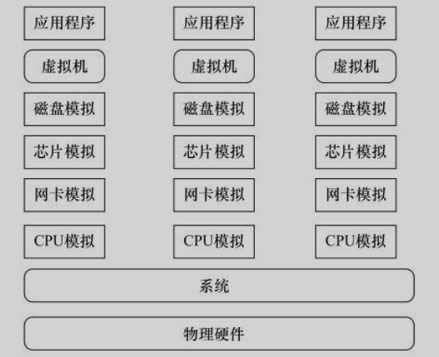
	

​	因为是软件模拟，所以理论上可以模拟任何硬件，甚至是不存在的硬件。但是因为这种方式全部是软件模拟硬件，所以非常低效，一般只用于研究测试的场景。采用这种技术的典型产品有Bochs//bɔːks//、**QEMU** 等。

## 2.2 CPU运行级别

​	在学习虚拟化层翻译之前，我们先先介绍一下X86平台的指令集权限划分。X86 操作系统是设计在直接运行在裸硬件设备上的，因此它们自动认为它们完全占有计算机硬件。如图所示，**X86平台指令集划分为4个特权模式(环ring[rɪŋ])：Ring0、Ring1、Ring2、Ring3，操作系统一般使用Ring0级别，应用程序使用Ring3级别，驱动程序使用Ring1和Ring2级别。**

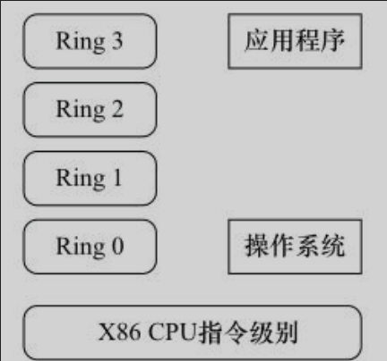

就 Linux+x86 来说:

+ **操作系统（内核）需要直接访问硬件和内存，因此它的代码需要运行在最高运行级别  Ring0上，这样它可以使用特权指令，控制中断、修改页表、访问设备等等。** 

+ **应用程序的代码运行在最低运行级别上ring3上，不能做受控操作。如果要做，比如要访问磁盘，写文件，那就要通过执行系统调用（函数），执行系统调用的时候，CPU的运行级别会发生从ring3到ring0的切换，并跳转到系统调用对应的内核代码位置执行，这样内核就为你完成了设备访问，完成之后再从ring0返回ring3。这个过程也称作用户态和内核态的切换。**

  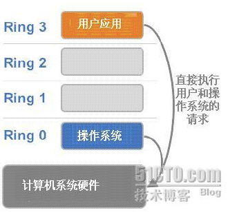

​        那么，虚拟化在这里就遇到了一个难题，因为宿主操作系统是工作在 ring0 的，客户操作系统就不能也在 ring0 了，但是它不知道这一点，以前执行什么指令，现在还是执行什么指令，但是没有执行权限是会出错的。所以这时候虚拟机管理程序（VMM）需要避免这件事情发生。 虚机怎么通过 VMM 实现 Guest CPU （客户[ɡest]CPU）对硬件的访问，根据其原理不同有三种实现技术：

1. 软件全虚拟化

2. 半虚拟化

3. 硬件辅助的全虚拟化 


## 2.3 虚拟化层翻译

### 	2.3.1 软件全虚拟化

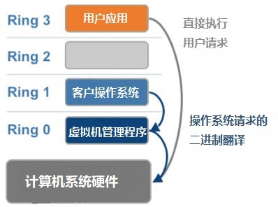

 	客户操作系统运行在 Ring 1，它在执行特权指令时，会触发异常（CPU的机制，没权限的指令会触发异常），然后 VMM 捕获这个异常，在异常里面做翻译，模拟，最后返回到客户操作系统内，客户操作系统认为自己的特权指令工作正常，继续运行。但是这个性能损耗，就非常的大，简单的一条指令执行完了事，现在却要通过复杂的异常处理过程。异常  “捕获（trap）-翻译（handle）-模拟（emulate）”  过程。

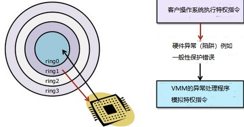


软件全虚拟化方案架构：

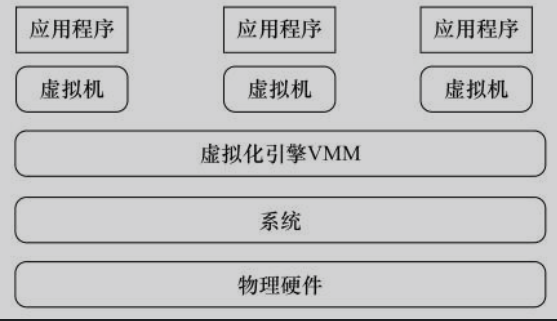

​	通过虚拟化引擎，捕获虚拟机的指令，并进行处理，这也是为什么在虚拟机上虽然使用的是物理机一样的指令，但是虚拟机不能对硬件进行操作的原因，比如重启虚拟机不会引起宿主机的重启。这种解决方案也叫软件全虚拟化方案。


### 2.3.2 半虚拟化

​	通过虚拟化引擎进行指令捕获和翻译的方式虽然可行，但是在虚拟化层要做大量的工作，Xen项目提供了另外一种思路，就是对虚拟机的操作系统内核进行改造，使虚拟机自己对特殊的指令进行更改，然后和虚拟化层一起配合工作，这也是Xen早期一直要使用一个特殊内核的原因，并且不支持Windows系统虚拟化。改造的虚拟机虽然使用上有限制，配置比较麻烦，但是这种方式效率非常高，这种方式也被称为半虚拟化方案。

​	半虚拟化的思想就是，修改操作系统内核，替换掉不能虚拟化的指令，通过超级调用（hypercall）直接和底层的虚拟化层 hypervisor 来通讯，hypervisor 同时也提供了超级调用接口来满足其他关键内核操作，比如内存管理、中断和时间保持。

  	这种做法省去了全虚拟化中的捕获和模拟，大大提高了效率。所以像 XEN 这种半虚拟化技术，客户机操作系统都是有一个专门的定制内核版本，和 x86、mips、arm 这些内核版本等价。这样一来，就不会有捕获异常、翻译、模拟的过程了，性能损耗非常低。这就是 XEN 这种半虚拟化架构的优势。这也是为什么 XEN 只支持虚拟化 Linux，无法虚拟化 windows 原因是因为微软不能改代码啊。

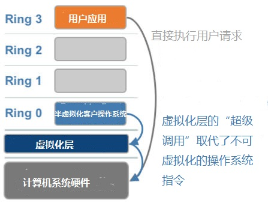


### 2.3.3 硬件辅助的全虚拟化 

​	2005 年后，CPU 厂商 Intel 和 AMD 开始支持虚拟化了。 Intel 引入了 Intel-VT （Virtualization Technology [ˈvɜːtʃʊəˌlaɪzeiʃən] [tekˈnɒlədʒi] 虚拟化技术）技术。（<!--Intel-VT 技术是Intel为了支持虚拟化而提供的一套CPU特殊运行模式。-->） 

​	这种 CPU有 VMX root operation（操作[ˌɑːpəˈreɪʃn] ） 和 VMX non-root operation 两种模式，两种模式都支持 Ring 0 ~ Ring 3 共 4 个运行级别。这样，VMM 可以运行在 VMX root operation 模式下，客户 OS 运行在 VMX non-root operation 模式下。

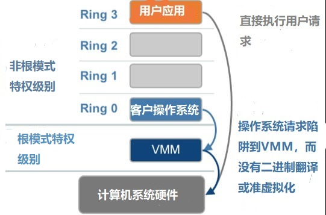

​	而且两种操作模式可以互相转换。运行在 VMX root operation 模式下的 VMM 通过显式调用 VMLAUNCH 或 VMRESUME 指令切换到 VMX non-root operation 模式，硬件自动加载 Guest OS 的上下文，于是 Guest OS 获得运行，这种转换称为 VM entry。

​	Guest OS 运行过程中遇到需要 VMM 处理的事件，例如外部中断或缺页异常，或者主动调用 VMCALL 指令调用 VMM 的服务的时候（与系统调用类似），硬件自动挂起 Guest OS，切换到 VMX root operation 模式，恢复 VMM 的运行，这种转换称为 VM exit（[ˈeksɪt] ）。

​	而VMX root operation 模式下软件的行为与在没有 VT-x 技术的处理器上的行为基本一致；而VMX non-root operation 模式则有很大不同，最主要的区别是此时运行某些指令或遇到某些事件时，发生 VM exit。

​	也就说，硬件这层就做了些区分，这样全虚拟化下，那些靠“捕获异常-翻译-模拟”的实现就不需要了。而且CPU厂商，支持虚拟化的力度越来越大，靠硬件辅助的全虚拟化技术的性能逐渐逼近半虚拟化，再加上全虚拟化不需要修改客户操作系统这一优势，全虚拟化技术应该是未来的发展趋势。

硬件全虚拟化方案架构：

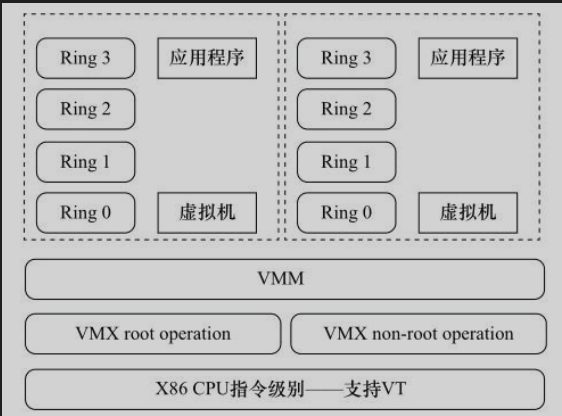

​	这种方案因为是基于硬件的，所以效率非常高，这种方案也称为硬件支持的全虚拟化方案，如图1-6所示。现在的一个发展趋势是不仅CPU指令有硬件解决方案，I/O通信也有硬件解决方案，称为VT-d；网络通信也有硬件解决方案，称为VT-c。

```markdown
提示:
	当前的虚拟化引擎，都是使用硬件支持的虚拟化解决方案。并且最新的操作系统一般都支持一些半虚拟化的特性，所以宿主机和虚拟机使用比较新的版本，性能也会好一些。
```

|                             | **利用二进制翻译的全虚拟化**       | **硬件辅助虚拟化**                                           | **操作系统协助/半虚拟化**                                    |
| --------------------------- | ---------------------------------- | ------------------------------------------------------------ | ------------------------------------------------------------ |
| **实现技术**                | BT和直接执行                       | 遇到特权指令转到root模式执行                                 | Hypercall                                                    |
| **客户操作系统修改/兼容性** | 无需修改客户操作系统，最佳兼容性   | 无需修改客户操作系统，最佳兼容性                             | 客户操作系统需要修改来支持hypercall，因此它不能运行在物理硬件本身或其他的hypervisor上，兼容性差，不支持Windows |
| **性能**                    | 差                                 | 全虚拟化下，CPU需要在两种模式之间切换，带来性能开销；但是，其性能在逐渐逼近半虚拟化。 | 好。半虚拟化下CPU性能开销几乎为0，虚机的性能接近于物理机。   |
| **应用厂商**                | VMware Workstation/QEMU/Virtual PC | VMware ESXi/Microsoft Hyper-V/Xen 3.0/KVM                    | Xen                                                          |

## 2.4 容器虚拟化（了解）

​	容器虚拟化的原理是基于CGroups、Namespace等技术将进程隔离，每个进程就像一台单独的虚拟机一样，有自己被隔离出来的资源，也有自己的根目录、独立的进程编号、被隔离的内存空间。基于容器的虚拟化可以实现在单一内核上运行多个实例，因此是一个更高效率的虚拟化方式。

​	目前最热的容器虚拟化技术就是Docker。Docker的优势是可以将一个开发环境进行打包，很方便地在另外一个系统上运行起来，并且有版本的概念，可以在前一个版本的基础上累加。但是Docker在生产环境的使用还需要一个过程，主要是磁盘、网络性能上还受到很多限制。

# 三、虚拟化架构分类

## 3.1  **寄居架构** 

 **寄居架构** （Hosted Architecture [ˈɑːrkɪtektʃər] 建筑） 就是在操作系统之上安装和运行虚拟化程序，依赖于主机操作系统对设备的支持和物理资源的管理。

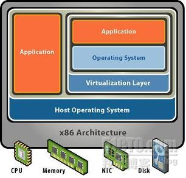

## 3.2 **裸金属架构** 

 **裸金属架构** (“Bare [ber]  Metal [ˈmetl] ” Architecture) 就是直接在硬件上面安装虚拟化软件，再在其上安装操作系统和应用，依赖虚拟层内核和服务器控制台进行管理。 代表产品：xen server 、 VMware ESXi、RHEV（Red Hat Enterprise[ˈentərpraɪz] virtualization ）

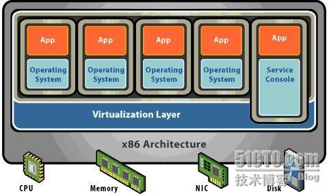

# 四、 KVM 底层

## 4.1 KVM架构

​	KVM 是基于虚拟化扩展（Intel VT 或者 AMD-V）的 X86 硬件的开源的 Linux 原生的全虚拟化解决方案。KVM 中，虚拟机被实现为常规的 Linux 进程，由标准 Linux 调度程序进行调度；虚机的每个虚拟 CPU 被实现为一个常规的 Linux 进程。这使得 KMV 能够使用 Linux 内核的已有功能。

 	但是，KVM 本身不执行任何硬件模拟，需要客户空间程序通过 /dev/kvm 接口设置一个客户机虚拟服务器的地址空间，向它提供模拟的 I/O，并将它的视频显示映射回宿主的显示屏。目前这个应用程序是 QEMU。

Linux 上的用户空间、内核空间和虚机：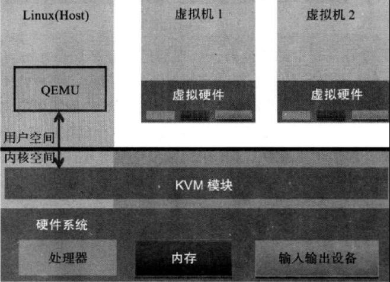

- Guest：客户机系统，包括 CPU（vCPU）、内存、驱动（Console、网卡、I/O 设备驱动等），被 KVM 置于一种受限制的 CPU 模式下运行。
- KVM：运行在内核空间，提供 CPU 和内存的虚级化，以及客户机的 I/O 拦截。Guest 的 I/O 被 KVM 拦截后，交给 QEMU 处理。
- QEMU：修改过的为 KVM 虚机使用的 QEMU 代码，运行在用户空间，提供硬件 I/O 虚拟化，通过 IOCTL /dev/kvm 设备和 KVM 交互。

## 4.2 KVM 实现拦截虚机的 I/O 请求的原理：

​    现代 CPU 本身了对特殊指令的截获和重定向的硬件支持，甚至新的硬件会提供额外的资源来帮助软件实现对关键硬件资源的虚拟化从而提高性能。以 X86 平台为例，支持虚拟化技术的 CPU  带有特别优化过的指令集来控制虚拟化过程。通过这些指令集，VMM 很容易将客户机置于一种受限制的模式下运行，一旦客户机视图访问物理资源，硬件会暂停客户机的运行，将控制权交回给 VMM 处理。VMM 还可以利用硬件的虚级化增强机制，将客户机在受限模式下对一些特定资源的访问，完全由硬件重定向到 VMM 指定的虚拟资源，整个过程不需要暂停客户机的运行和 VMM 的参与。由于虚拟化硬件提供全新的架构，支持操作系统直接在上面运行，无需进行二进制转换，减少了相关的性能开销，极大简化了 VMM 的设计，使得 VMM 性能更加强大。从 2005 年开始，Intel 在其处理器产品线中推广 Intel Virtualization Technology 即 IntelVT 技术。

## 4.3 QEMU-KVM：

  	其实 QEMU 原本不是 KVM 的一部分，它自己就是一个纯软件实现的虚拟化系统，所以其性能低下。但是，QEMU 代码中包含整套的虚拟机实现，包括处理器虚拟化，内存虚拟化，以及 KVM 需要使用到的虚拟设备模拟（网卡、显卡、存储控制器和硬盘等）。

  	为了简化代码，KVM 在 QEMU 的基础上做了修改。VM 运行期间，QEMU 会通过 KVM 模块提供的系统调用进入内核，由 KVM 负责将虚拟机置于处理的特殊模式运行。遇到虚机进行 I/O 操作，KVM 会从上次的系统调用出口处返回 QEMU，由 QEMU 来负责解析和模拟这些设备。

​	从 QEMU 的角度看，也可以说是 QEMU 使用了 KVM 模块的虚拟化功能，为自己的虚机提供了硬件虚拟化加速。除此以外，虚机的配置和创建、虚机运行说依赖的虚拟设备、虚机运行时的用户环境和交互，以及一些虚机的特定技术比如动态迁移，都是 QEMU 自己实现的。

## 4.4 KVM启动方式：

​    KVM 内核模块在运行时按需加载进入内核空间运行。KVM 本身不执行任何设备模拟，需要 QEMU 通过 /dev/kvm 接口设置一个 GUEST OS 的地址空间，向它提供模拟的 I/O 设备，并将它的视频显示映射回宿主机的显示屏。它是 KVM 虚机的核心部分，其主要功能是初始化 CPU 硬件，打开虚拟化模式，然后将虚拟客户机运行在虚拟机模式下，并对虚机的运行提供一定的支持。以在 Intel 上运行为例，KVM 模块被加载的时候，它：

+ 首先初始化内部的数据结构；做好准备后，KVM 模块检测当前的 CPU，
+ 然后打开 CPU 控制及存取 CR4（控制寄存器） 的虚拟化模式开关，并通过执行 VMXON（打开VMX（Virtual Machine Extension）） 指令将宿主操作系统置于虚拟化模式的根模式；

+ 最后，KVM 模块创建特殊设备文件 /dev/kvm 并等待来自用户空间的指令。

​    接下来的虚机的创建和运行将是 QEMU 和 KVM 相互配合的过程。两者的通信接口主要是一系列针对特殊设备文件 dev/kvm 的 IOCTL(input/output control) 调用。其中最重要的是创建虚机。它可以理解成 KVM 为了某个特定的虚机创建对应的内核数据结构，同时，KVM 返回一个文件句柄来代表所创建的虚机。

​    针对该句柄的调用可以对虚机做相应地管理，比如创建用户空间虚拟地址和客户机物理地址、真实物理地址之间的映射关系，再比如创建多个 vCPU。KVM 为每一个 vCPU 生成对应的文件句柄，对其相应地 IOCTL 调用，就可以对 vCPU 进行管理。其中最重要的就是 “执行虚拟处理器”。通过它，虚机在 KVM 的支持下，被置于虚拟化模式的非根模式下，开始执行二进制指令。在非根模式下，所有敏感的二进制指令都被 CPU 捕捉到，CPU 在保存现场之后自动切换到根模式，由 KVM 决定如何处理。

​      除了 CPU 的虚拟化，内存虚拟化也由 KVM 实现。实际上，内存虚拟化往往是一个虚机实现中最复杂的部分。CPU 中的内存管理单元 MMU 是通过页表的形式将程序运行的虚拟地址转换成实际物理地址。在虚拟机模式下，MMU 的页表则必须在一次查询的时候完成两次地址转换。因为除了将客户机程序的虚拟地址转换了客户机的物理地址外，还要将客户机物理地址转化成真实物理地址。 

## 4.5 KVM 虚机的创建过程

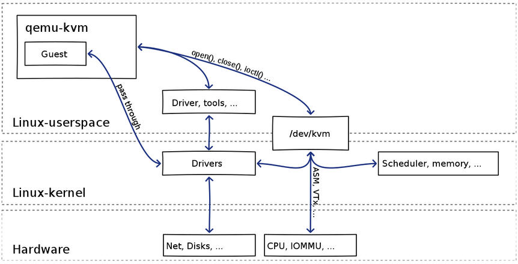

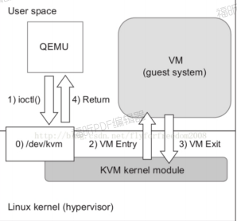

可见：

（1）qemu-kvm 通过对 /dev/kvm 的 一系列 ICOTL 命令控制虚机，比如

```
open("/dev/kvm", O_RDWR|O_LARGEFILE)    = 3 ioctl(3, KVM_GET_API_VERSION, 0)        = 12 ioctl(3, KVM_CHECK_EXTENSION, 0x19)     = 0 ioctl(3, KVM_CREATE_VM, 0)              = 4 ioctl(3, KVM_CHECK_EXTENSION, 0x4)      = 1 ioctl(3, KVM_CHECK_EXTENSION, 0x4)      = 1 ioctl(4, KVM_SET_TSS_ADDR, 0xfffbd000)  = 0 ioctl(3, KVM_CHECK_EXTENSION, 0x25)     = 0 ioctl(3, KVM_CHECK_EXTENSION, 0xb)      = 1 ioctl(4, KVM_CREATE_PIT, 0xb)           = 0 ioctl(3, KVM_CHECK_EXTENSION, 0xf)      = 2 ioctl(3, KVM_CHECK_EXTENSION, 0x3)      = 1 ioctl(3, KVM_CHECK_EXTENSION, 0)        = 1 ioctl(4, KVM_CREATE_IRQCHIP, 0)         = 0 ioctl(3, KVM_CHECK_EXTENSION, 0x1a)     = 0
```

（2）一个 KVM 虚机即一个 Linux qemu-kvm 进程，与其他 Linux 进程一样被Linux 进程调度器调度。

（3）KVM 虚机包括虚拟内存、虚拟CPU和虚机 I/O设备，其中，内存和 CPU 的虚拟化由 KVM 内核模块负责实现，I/O 设备的虚拟化由 QEMU 负责实现。

（3）KVM户机系统的内存是 qumu-kvm 进程的地址空间的一部分。

（4）KVM 虚机的 vCPU 作为 线程运行在 qemu-kvm 进程的上下文中。

vCPU、QEMU 进程、LInux 进程调度和物理CPU之间的逻辑关系：

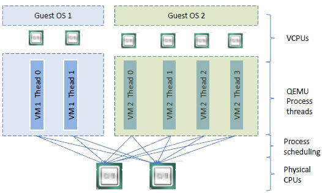

## 4.6 KVM中CPU是如何工作的

 因为 CPU 中的虚拟化功能的支持，并不存在虚拟的 CPU，KVM Guest 代码是运行在物理 CPU 之上

​    	根据上面的 2.3.3 章节，支持虚拟化的 CPU 中都增加了新的功能。以 Intel VT 技术为例，它增加了两种运行模式：VMX root 模式和 VMX nonroot 模式。通常来讲，主机操作系统和 VMM 运行在 VMX root 模式中，客户机操作系统及其应用运行在 VMX non root 模式中。因为两个模式都支持所有的 ring，因此，客户机可以运行在它所需要的 ring 中（OS 运行在 ring 0 中，应用运行在 ring 3 中），VMM 也运行在其需要的 ring 中 （对 KVM 来说，QEMU 运行在 ring 3，KVM 运行在 ring 0）。CPU 在两种模式之间的切换称为 VMX 切换。从 root mode 进入 non root mode，称为 VM entry[ˈentri]；从 non root mode 进入 root mode，称为 VM exit[ˈeksɪt] 。可见，CPU 受控制地在两种模式之间切换，轮流执行 VMM 代码和 Guest OS 代码。

  	对 KVM 虚机来说，运行在 VMX Root Mode 下的 VMM 在需要执行 Guest OS 指令时执行 VMLAUNCH( launch[lɔːntʃ] 发射 ) 指令将 CPU 转换到 VMX non-root mode，开始执行客户机代码，即 VM entry 过程；在 Guest OS 需要退出该 mode 时，CPU 自动切换到 VMX Root mode，即 VM exit 过程。可见，KVM 客户机代码是受 VMM 控制直接运行在物理 CPU 上的。QEMU 只是通过 KVM 控制虚机的代码被 CPU 执行，但是它们本身并不执行其代码。也就是说，CPU 并没有真正的被虚拟化成虚拟的 CPU 给客户机使用。

## 4.7 客户机系统的代码是如何运行的

​	一个普通的 Linux 内核有两种执行模式：内核模式（Kenerl）和用户模式 （User）。为了支持带有虚拟化功能的 CPU，KVM 向 Linux 内核增加了第三种模式即客户机模式（Guest），该模式对应于 CPU 的 VMX non-root mode。

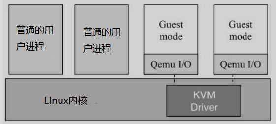

KVM 内核模块作为 User mode 和 Guest mode 之间的桥梁：

- User mode 中的 QEMU-KVM 会通过 IOCTL 命令来运行虚拟机
- KVM 内核模块收到该请求后，它先做一些准备工作，比如将 VCPU 上下文加载到 VMCS （virtual machine control structure [ˈstrʌktʃər]结构 ）等，然后驱动 CPU 进入 VMX non-root 模式，开始执行客户机代码

三种模式的分工为：

- Guest 模式：执行客户机系统非 I/O 代码，并在需要的时候驱动 CPU 退出该模式
- Kernel 模式：负责将 CPU 切换到 Guest mode 执行 Guest OS 代码，并在 CPU 退出  Guest mode 时回到 Kernel 模式
- User 模式：代表客户机系统执行 I/O 操作

## 4.8 QEMU-KVM 相比原生 QEMU 的改动：

- 原生的 QEMU 通过指令翻译实现 CPU 的完全虚拟化，但是修改后的 QEMU-KVM 会调用 IOCTL 命令来调用 KVM 模块。
- 原生的 QEMU 是单线程实现，QEMU-KVM 是多线程实现。

主机 Linux 将一个虚拟机视作一个 QEMU 进程，该进程包括下面几种线程：

- I/O 线程用于管理模拟设备
- vCPU 线程用于运行 Guest 代码
- 其它线程，比如处理 event loop，offloaded[ˌɔːfˈloʊdɪd]卸载 tasks任务[tæsks] 等的线程

## 4.9  KVM 内存虚拟化

​	 除了 CPU 虚拟化，另一个关键是内存虚拟化，通过内存虚拟化共享物理系统内存，动态分配给虚拟机。虚拟机的内存虚拟化很像现在的操作系统支持的虚拟内存方式，应用程序看到邻近的内存地址空间，这个地址空间无需和下面的物理机器内存直接对应，操作系统保持着虚拟页到物理页的映射。现在所有的 x86 CPU 都包括了一个称为内存管理的模块 MMU（Memory Management Unit）和  转译后备缓冲器（也被翻译为页表缓存、转址旁路缓存，是CPU的一种缓存）TLB(Translation [trænzˈleɪʃn] Lookaside[lʊk əˈsaɪd] Buffer[ˈbʌfər] )，通过 MMU 和 TLB 来优化虚拟内存的性能。

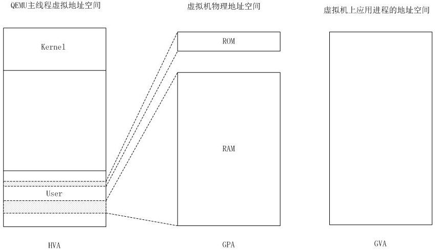

 	


HVA 同下面的 MA，GPA 同下面的 PA，GVA 同下面的 VA


KVM 实现客户机内存的方式是，利用 mmap 系统调用，在 QEMU 主线程的虚拟地址空间中申明一段连续的大小的空间用于客户机物理内存映射。

在有两个虚机的情况下，情形是这样的：

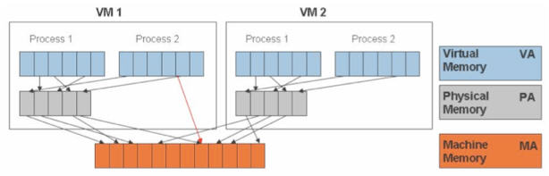

可见，KVM 为了在一台机器上运行多个虚拟机，需要增加一个新的内存虚拟化层，也就是说，必须虚拟 MMU 来支持客户操作系统，来实现 VA -> PA -> MA 的翻译。客户操作系统继续控制虚拟地址到客户内存物理地址的映射 （VA -> PA），但是客户操作系统不能直接访问实际机器内存，因此 VMM 需要负责映射客户物理内存到实际机器内存 （PA -> MA）。

VMM 内存虚拟化的实现方式：

- 软件方式：通过软件实现内存地址的翻译，比如 Shadow[ˈʃædoʊ] page [peɪdʒ] table （影子页表）技术

- 硬件实现：基于 CPU 的辅助虚拟化功能，比如 AMD 的 NPT 和 Intel 的 EPT 技术 

## 4.10 KVM的整体结构：

从GUI到Linux内核，包括以下五个组件：

1. virt-manager
   一个用来管理VM的GUI/CUI用户接口;它使用libvirt调用VM的各种功能。
   
2. libvirt
   一个工具及接口，作为较通用的服务器虚拟化软件，它支持Xen，VMware ESX/GSX，当然，还有QEMU/KVM。
   
3. QEMU
   一个和KVM内核模块交互的模拟器，处理多种客户机系统请求如I/O;一个QEMU进程对应一个客户机系统。
   
4. KVM内核模块
   从狭义上来说，KVM是一个Linux内核模块，处理客户机系统的VM Exit和执行VM Entry指令。
   
5. Linux内核
   既然QEMU作为一个普通的用户进程运行，相应客户机系统的调度就由Linux内核自己来处理。所有的组件都是开放源码软件(OSS)。


# 五、 KVM的功能列表

KVM 所支持的功能包括：

+ 支持CPU 和 memory 超分（Overcommit [ˈoʊvər kəˈmɪt] 过度承诺）
+ 支持半虚拟化I/O （virtio）
+ 支持热插拔 （cpu，块设备、网络设备等）
+ 支持对称多处理（Symmetric Multi-Processing，缩写为 SMP，指在一个计算机上汇集了一组处理器(多CPU)，所有的CPU共享全部资源，如总线，内存和I/O系统等，操作系统或管理数据库的复本只有一个，这种系统有一个最大的特点就是共享所有资源。多个CPU之间没有区别，平等地访问内存、外设、一个操作系统。SMP 服务器的主要问题，那就是它的扩展能力非常有限。实验证明， SMP 服务器 CPU 利用率最好的情况是 2 至 4 个 CPU 。
+ 支持实时迁移（Live Migration）
+ 支持 PCI 设备直接分配和 单根I/O 虚拟化 （Single Root I/O Virtualization（SR-IOV） 允许Windows操作系统和微软的Hyper-V或VMware的ESXi等hypervisor对服务器的磁盘I/O设备，如现在SR-IOV对网卡设备一样进行封装，管理甚至共享。 ）
+ 支持 内核同页合并 （KSM ）（ 简单说，就是把相同的内存合并，这样可以让物理机跑更多的虚拟机。 ）
+ 支持 NUMA （Non-Uniform Memory Access，非一致存储访问结构， 一种计算机体系结构技术，它由多个 SMP 服务器通过一定的节点互联网络进行连接，协同工作，完成相同的任务，从用户的角度来看是一个服务器系统。其基本特征是由多个 SMP 服务器 ( 每个 SMP 服务器称节点 ) 通过节点互联网络连接而成，每个节点只访问自己的本地资源 ( 内存、存储等 ) ，是一种完全无共享 (Share Nothing) 结构。）
# 六、KVM 工具集合
+ libvirt：操作和管理KVM虚机的虚拟化 API，使用 C 语言编写，可以由 Python,Ruby, Perl, PHP, Java 等语言调用。可以操作包括 KVM，VMware，XEN，Hyper-v, LXC 等 Hypervisor。
+ Virsh：基于 libvirt 的 命令行工具 （CLI）
+ Virt-Manager：基于 libvirt 的 GUI 工具
+ virt-v2v：虚机格式迁移工具
+ virt-* 工具：包括 Virt-install （创建KVM虚机的命令行工具）， Virt-viewer - - （连接到虚机屏幕的工具），Virt-clone（虚机克隆工具），virt-top 等
+ sVirt：安全工具和selinux相关
