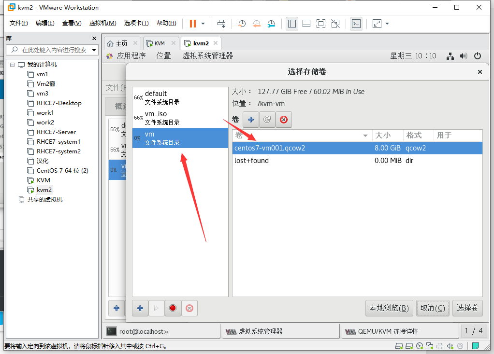

## 安装KVM虚拟机


### 1、创建虚拟机

​	**配置如下**

 1. 内存4G以上

 2. 处理器4个并开启虚拟引擎->虚拟化Intel VT-x/EPT或AMD-V/RVI(V)

 4. 镜像centos7+

 4. 安装选择带Gui的服务器附加选项选择（虚拟化客户端、虚拟化Hypervisor、虚拟化工具）

    

    

 5. 

    ```shell
    # 如果你的系统是最小化安装的，那你应该安装以下所需软件： 
    $ yum groupinstall "GNOME 桌面" -y # 安装GNOME桌面环境
    $ yum  install qemu-kvm -y	# KVM核心模块
    $ yum install qemu-kvm-tools -y	# KVM调试工具，可以选择性安装
    $ yum install qemu-img -y	# 允许你创建、转换和修改镜像，能处理被qemu支持的所有镜像格式	                                                                             
    $ yum  install libvirt -y	# 管理虚拟机的工具包
    $ yum  install virt-install -y	# virt-install是一个使用libvirt库构建新虚拟机的命令行工具
    $ yum install virt-manager -y	# 图形界面管理虚拟机
    $ yum install bridge-utils -y	# 配置linux以太网桥
    
    ```

 6. 开机验证

    ```shell
    # 安装系统后，可以检查CPU是否支持虚拟化功能。如果值为0，说明不支持，如果非0，说明支持
    # -c: 用于统计文中出现的次数
    $ egrep -c "(vmx|svm)"  /proc/cpuinfo # 检查KVM模块是否安装
    # lsmod命令用于显示已载入系统的模块
    $ lsmod | grep kvm
    $ systemctl status libvirtd.service
    
    ```

### 2、开始创建KVM

 1. 准备镜像

 2. 将镜像（centos7、win7）上传到系统的/iso目录下

    ```shell
    $ mkdir /iso
    # 利用光驱制作iso文件
    $ cp /dev/cdrom CentOS-7-x86_64-DVD-1908.iso &
    # cp /dev/cdrom windows_7_ultimate_with_sp1_x86_dvd.iso &
    ```

    

 3. 添加新的磁盘（磁盘大小100G+）

    ```shell
    # 更新（可选重启更新）
    $ echo "- - -">/sys/class/scsi_host/host0/scan 
    $ echo "- - -">/sys/class/scsi_host/host1/scan 
    $ echo "- - -">/sys/class/scsi_host/host2/scan
    ```

    

 4. 开始创建LVM

    ```shell
    $ pvcreate /dev/sdb # 根据自己的硬盘名
    $ vgcreate vmvg /dev/sdb
    $ vgdisplay
      --- Volume group ---
      VG Name               vmvg
      System ID             
      Format                lvm2
      Metadata Areas        1
      Metadata Sequence No  1
      VG Access             read/write
      VG Status             resizable
      MAX LV                0
      Cur LV                0
      Open LV               0
      Max PV                0
      Cur PV                1
      Act PV                1
      VG Size               <130.00 GiB
      PE Size               4.00 MiB
      Total PE              33279 //使用这个值
      Alloc PE / Size       0 / 0   
      Free  PE / Size       33279 / <130.00 GiB
      VG UUID               7LYK7I-4Cwv-yFGo-qKKE-fYiH-UtLQ-nKEEbl
    $ lvcreate -n kvm_lv -l 33279 vmvg  # 33279是上面查看的Total PE
      Logical volume "kvm_lv" created.
    $ mkfs.ext4 /dev/vmvg/kvm_lv  # 格式化
    ```

    

 5. 创建存储KVM的目录并挂载逻辑卷到目录

    ```shell
    $ mkdir /kvm-vm
    $ blkid
    /dev/sdb: UUID="gJg6wP-hy0f-aTb9-I8Ss-NdNU-OUU2-0O6f3X" TYPE="LVM2_member" 
    /dev/sda1: UUID="25348d4a-6f01-4404-8762-56ca8d12ae69" TYPE="xfs" 
    /dev/sda2: UUID="KY4VXX-Ltsj-V3cs-tlJu-nfUE-0Nyk-ObQzxs" TYPE="LVM2_member" 
    /dev/sr0: UUID="2019-09-11-18-50-31-00" LABEL="CentOS 7 x86_64" TYPE="iso9660" PTTYPE="dos" 
    /dev/mapper/centos-root: UUID="ee5fc384-caad-4eb4-9232-817c8d867810" TYPE="xfs" 
    /dev/mapper/centos-swap: UUID="ce238a4b-45fb-43e5-b058-fea584fe8bf5" TYPE="swap" 
    /dev/mapper/vmvg-kvm_lv: UUID="7c534b2c-1345-4d97-8d2c-c34ee8bbff59" TYPE="ext4"
    
    $ vim /etc/fstab 
    #增加
    UUID="7c534b2c-1345-4d97-8d2c-c34ee8bbff59" /kvm-vm ext4 defaults 0 0
    
    $ mount -a
    ```

    

 6. 创建储存池

    ```shell
    使用virt-manager图形界面创建
    virt-manager是基于libvirt的图形化虚拟机管理软件。在命令行中以root身份输入virt- manager命令，出现virt-manager管理界面
    创建存储池
    双击“QEMU/KVM”，然后选择“存储”选项卡，然后单击“+”按钮新建存储池，命名为“vm”，单击“前进”，然后输入上面创建的lvm挂载目录，单击完成。
    ```

    

    

 7. 创建镜像储存池

    ```shell
    同样的方法创建一个镜像存储池，命名为vm_iso,目录为/iso即可，用于放置以后KVM虚拟机使用的iso光盘镜像文件。
    ```

    

 8. 创建存储卷

    ```shell
    创建存储卷，其实就是KVM虚拟机的硬盘文件，选择刚建的“vm”存储卷，点击新建卷，设置名字和大小
    ```

    

    

 9. 开始创建虚拟机

    

    

 10. 

     

     

     

     

     

 11. 点击完成之后会出现安装界面

     

     最小化安装（含开发工具）


### 3、命令创建KVM

1. 创建qcow2格式的虚拟机磁盘文件

   ```shell
   # -f 磁盘映像文件的格式
   $ qemu-img create -f qcow2 /kvm-vm/windows7-vm001.qcow2 15G
   Formatting '/kvm-vm/windows7-vm001.qcow2', fmt=qcow2 size=16106127360 encryption=off cluster_size=65536 lazy_refcounts=off
   
   $ ll /kvm-vm/
   
   总用量 2042872
   -rw-------. 1 qemu qemu 8591507456 11月 27 10:23 centos7-vm001.qcow2
   drwx------. 2 root root      16384 11月 27 09:38 lost+found
   -rw-r--r--. 1 root root     197120 11月 27 10:23 windows7-vm001.qcow2
   ```

2. 开始创建虚拟机

   ```shell
   # 一般选项：指定虚拟机的名称、内存大小、VCPU个数及特性等；  
   # -n NAME, --name=NAME：虚拟机名称，需全局惟一；  
   # -r MEMORY, --ram=MEMORY：虚拟机内在大小，单位为MB；  
   # --vcpus=VCPUS[,maxvcpus=MAX][,sockets=#][,cores=#][,threads=#]：VCPU个数及相关配置；  
   # --cpu=CPU：CPU模式及特性，如coreduo等；可以使用qemu-kvm -cpu ?来获取支持的CPU模式；  
   
   # 安装方法：指定安装方法、GuestOS类型等；  
   # -c CDROM, --cdrom=CDROM：光盘安装介质；  
   # -l LOCATION, --location=LOCATION：安装源URL，支持FTP、HTTP及NFS等，如ftp://172.16.0.1/pub；  
   # --pxe：基于PXE完成安装；  
   # --livecd: 把光盘当作LiveCD；  
   # --os-type=DISTRO_TYPE：操作系统类型，如linux、unix或windows等； 
   # --os-variant=DISTRO_VARIANT：某类型操作系统的变体，如rhel5、fedora8等；可以使用osinfo-query os命令查询
   # -x EXTRA, --extra-args=EXTRA：根据--location指定的方式安装GuestOS时，用于传递给内核的额外选项，例如指定kickstart文件的位置，--extra-args "ks=http://172.16.0.1/class.cfg"  
   # --boot=BOOTOPTS：指定安装过程完成后的配置选项，如指定引导设备次序、使用指定的而非安装的kernel/initrd来引导系统启动等 ；例如：  
   # --boot  cdrom,hd,network：指定引导次序；  
   # --boot kernel=KERNEL,initrd=INITRD,kernel_args=”console=/dev/ttyS0”：指定启动系统的内核及initrd文件；  
   
   # 存储配置：指定存储类型、位置及属性等；  
   # --disk=DISKOPTS：指定存储设备及其属性；格式为--disk /some/storage/path,opt1=val1，opt2=val2等；常用的选项有：  
   # device：设备类型，如cdrom、disk或floppy等，默认为disk；  
   # bus：磁盘总结类型，其值可以为ide、scsi、usb、virtio或xen；  
   # perms：访问权限，如rw、ro或sh（共享的可读写），默认为rw；  
   # size：新建磁盘映像的大小，单位为GB；  
   # cache：缓存模型，其值有none、writethrouth（缓存读）及writeback（缓存读写）；  
   # format：磁盘映像格式，如raw、qcow2、vmdk等；  
   # sparse：磁盘映像使用稀疏格式，即不立即分配指定大小的空间；
   # --nodisks：不使用本地磁盘，在LiveCD模式中常用；  
   
   # 网络配置：指定网络接口的网络类型及接口属性如MAC地址、驱动模式等；  
   # -w NETWORK, --network=NETWORK,opt1=val1,opt2=val2：将虚拟机连入宿主机的网络中，其中NETWORK可以为：  
   # bridge=BRIDGE：连接至名为“BRIDEG”的桥设备；  
   # network=NAME：连接至名为“NAME”的网络；  
   
   # 其它常用的选项还有
   # model：GuestOS中看到的网络设备型号，如e1000、rtl8139或virtio等； 
   # mac：固定的MAC地址；省略此选项时将使用随机地址，但无论何种方式，对于KVM来说，其前三段必须为52:54:00；  
   # --nonetworks：虚拟机不使用网络功能；  
   
   # 图形配置：定义虚拟机显示功能相关的配置，如VNC相关配置；  
   # --graphics TYPE,opt1=val1,opt2=val2：指定图形显示相关的配置，此选项不会配置任何显示硬件（如显卡），而是仅指定虚拟机启动后对其进行访问的接口；  
   # TYPE：指定显示类型，可以为vnc、sdl、spice或none等，默认为vnc；  
   # port：TYPE为vnc或spice时其监听的端口；  
   # listen：TYPE为vnc或spice时所监听的IP地址，默认为127.0.0.1，可以通过修改/etc/libvirt/qemu.conf定义新的默认值；  
   # password：TYPE为vnc或spice时，为远程访问监听的服务进指定认证密码； 
   # --noautoconsole：禁止自动连接至虚拟机的控制台；  
   
   # 设备选项：指定文本控制台、声音设备、串行接口、并行接口、显示接口等； 
   # --serial=CHAROPTS：附加一个串行设备至当前虚拟机，根据设备类型的不同，可以使用不同的选项，格式为“--serial type,opt1=val1,opt2=val2,...”，例如：  
   # --serial pty：创建伪终端；  
   # --serial dev,path=HOSTPATH：附加主机设备至此虚拟机；  
   # --video=VIDEO：指定显卡设备模型，可用取值为cirrus、vga、qxl或vmvga；  
   
   # 虚拟化平台：虚拟化模型（hvm或paravirt）、模拟的CPU平台类型、模拟的主机类型、hypervisor类型（如kvm、xen或qemu等）以及当前虚拟机的UUID等； 
   # -v, --hvm：当物理机同时支持完全虚拟化和半虚拟化时，指定使用完全虚拟化；  
   # -p, --paravirt：指定使用半虚拟化；  
   # --virt-type：使用的hypervisor，如kvm、qemu、xen等；所有可用值可以使用’virsh capabilities’命令获取；  
   
   # 其它：  
   # --autostart：指定虚拟机是否在物理启动后自动启动；  
   # --print-xml：如果虚拟机不需要安装过程(--import、--boot)，则显示生成的XML而不是创建此虚拟机；默认情况下，此选项仍会创建磁盘映像；  
   # --force：禁止命令进入交互式模式，如果有需要回答yes或no选项，则自动回答为yes；  
   # --dry-run：执行创建虚拟机的整个过程，但不真正创建虚拟机、改变主机上的设备配置信息及将其创建的需求通知给libvirt；  
   # -d, --debug：显示debug信息；
   
   $ virt-install --name vm002 --vcpus 1 --ram 1024 --disk /kvm-vm/windows7-vm001.qcow2  --network network=default --graphics vnc,listen=0.0.0.0 --noautoconsole --os-type=windows --os-variant=win7 --cdrom=/iso/windows_7_ultimate_with_sp1_x86_dvd.iso
   
   开始安装......域安装仍在进行。您可以重新连接到控制台以便完成安装进程。
   $ osinfo-query os |grep win # 可以查看os版本
   
   ```
   


### 4、安装半虚拟化驱动

1. 为了提高内存、硬盘盒网络的性能，需要支持半虚拟化。

2. virtIO是一种半虚拟化驱动，广泛用于在XEN平台和KVM虚拟化平台，用于提高客户机IO的效率，事实证明，virtIO极大的提高了VM IO 效率，配备virtIO前后端驱动的情况下，客户机IO效率基本达到和宿主机一样的水平。

   

   

   **没有使用virtIO驱动的执行过程**

   

   

   **使用virtIO驱动的执行过程**

   

   

   **性能比较**

   

   

3. Linux自带，在windows上安装

   ```shell
   # 查看是否安装
   $ lsmmod | grep virtio
   ```

   

4. 下载半虚拟化驱动 官网：http://www.linux-kvm.org/page/WindowsGuestDrivers/Download_Drivers

5. 将驱动上传到/iso目录中

6. 关闭window虚拟主机

7. 添加一块储存硬盘

   

   

   

8. 同样的方法添加网卡

   

9. 更改镜像

   

   

   

10. 选择完毕开机，开机之后打开计算机管理，设备管理器更新三个其他设备（右击点击更新驱动程序软件）

   

   

   

   

   点击下一步它会自动更新三个程序同上

11. 关机删除新增的磁盘，删除原网卡，将原来磁盘的磁盘总线改成“VirtIO”。开启电脑

5、安装Qemu Guest Agent

Qemu Guest Agent可以使Host主机通过libvirt向VM发送命令。例如“冻结”、“释放”文件系统，虚拟CPU的热添加及移除等。


6. 虚拟Linux安装Qemu Guest Agent

   ```shell
   $ yum install libvirt -y
   ```

7. 