 

# 一、 Libvirt 

## 1. Libvirt是什么

​	libvirt是用来管理虚拟机或虚拟化功能的软件集合，便于使用者管理虚拟机和其他虚拟化功能，比如存储和网络接口管理等等。Libvirt概括起来包括一个API库（libvirt API）、一个 daemon（libvirtd进程）和一个命令行工具（virsh //'versh//工具集）。

​	Libvirt的主要目标是：提供一种单一的方式管理多种不同的虚拟化提供方式和 hypervisor。

```markdown
	Hypervisor——一种运行在基础物理服务器和操作系统之间的中间软件层，可允许多个操作系统和应用共享硬件。也可叫做VMM（ virtual machine monitor ），即虚拟机监视器。
```

### 1.1.1 为什么需要Libvirt？ 

1.  Hypervisor 比如 qemu-kvm 的命令行虚拟机管理工具参数众多，难于使用。 
2.  Hypervisor 种类众多，有没有统一的编程接口来管理它们，对云环境来说非常重要。 
3.  没有统一的方式来方便地定义虚拟机相关的各种可管理对象。 

### 1.1.2 Libvirt提供了什么？ 

1.  它提供统一、稳定、开放的源代码的应用程序接口（API）、守护进程 （libvirtd）和和一个默认命令行管理工具（virsh）。 
2.  它提供了对虚拟化客户机和它的虚拟化设备、网络和存储的管理。 
3.  它提供了一套较为稳定的C语言应用程序接口。目前，在其他一些流行的编程语言中也提供了对libvirt的绑定，在Python、Perl、Java、Ruby、PHP、OCaml等高级编程语言中已经有libvirt的程序库可以直接使用。 
4.  它对多种不同的 Hypervisor 的支持是通过一种基于驱动程序的架构来实现的。libvirt 对不同的 Hypervisor 提供了不同的驱动，包括 Xen 的驱动，对QEMU/KVM 有 QEMU 驱动，VMware 驱动等。在 libvirt 源代码中，可以很容易找到 qemu_driver.c、xen_driver.c、xenapi_driver.c、vmware_driver.c、vbox_driver.c 这样的驱动程序源代码文件。 
5.  它作为中间适配层，让底层 Hypervisor 对上层用户空间的管理工具是可以做到完全透明的，因为 libvirt 屏蔽了底层各种 Hypervisor 的细节，为上层管理工具提供了一个统一的、较稳定的接口（API）。 
6.  它使用 XML (可扩展标记语言，标准通用标记语言的子集，简称XML)来定义各种虚拟机相关的受管理对象。 

## 2. Libvirt C API

1.  Libvirt API 所管理的主要对象 

   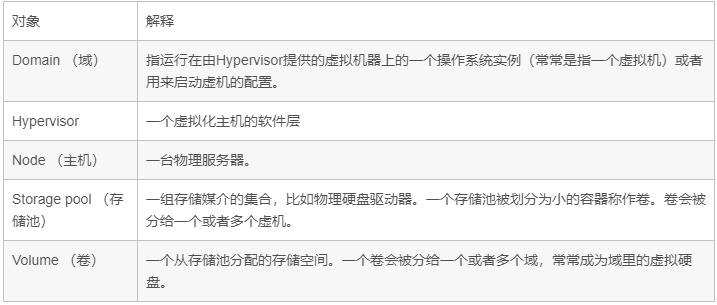

2.  对象的管理模型 

   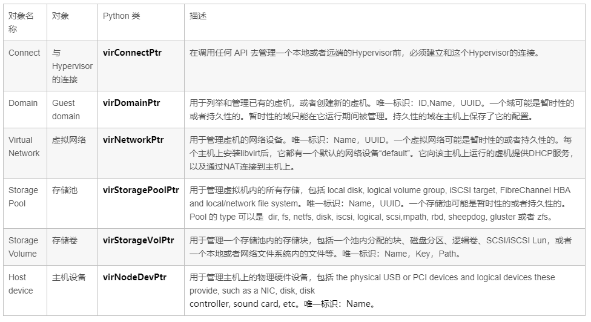

## 3. libvirtd进程  

- libvirtd该后台进程主要实现以下功能 

  1. 远程代理
     + 所有remote client发送来的命令，由该进程监测执行
  2. 本地环境初始化 
     + libvirt服务的启停，用户connection的响应等
  3. 根据环境注册各种Driver（qemu, xen, storage…）的实现  
     + 不同虚拟化技术以Driver的形式实现，由于libvirt对外提供的是统一的接口，所以各个Driver就是实现这些接口，即将Driver注册到libvirt中。

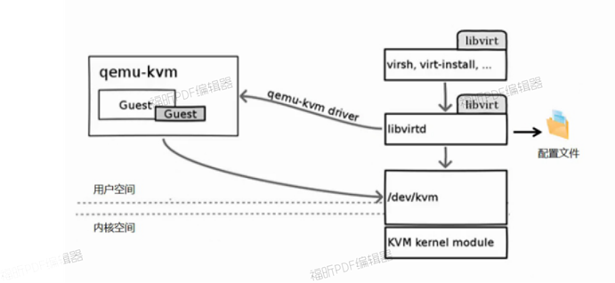

- 查看libvirtd服务状态  

  ```bash
  $ systemctl status libvirtd
  # 返回runing
  # 如果libvirtd服务停止运行，那么你将不能管理虚拟机，也就是不能使用virt-manager 等工具来管理虚拟机。
  ```

  

## 4. Libvirt XML 定义

  虚拟机的所有配置是放置在一个xml文件中，位置在/etc/libvirt/qemu/目录中，以后需要调整虚拟机参数时可以修改此配置文件，然后使虚拟机生效。在初次建立虚拟机时里面的参数都是根据第一次生成虚拟机的配置指定的，下面分析一下在此xml配置文件中可以使用的部分参数。

官网链接： https://libvirt.org/formatdomain.html 

  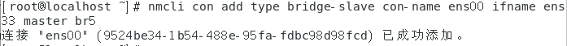

### 4.1 一般元数据介绍

+ ```shell
  ` <domain type='kvm'>
  # domain 是一个所有虚拟机都需要的根元素，它有两个属性，type定义使用哪个虚拟机管理程序，值可以是：xen、kvm、qemu、lxc、kqemu，第二个参数是id，它唯一的标示一个运行的虚拟机，不活跃的客户端没有id。
  
  ` <name>kvm_test3</name>
  # name参数为虚拟机定义了一个简短的名字，必须唯一。
  
  ` <uuid>f7333079-650e-8bea-4c36-184480afa0ba</uuid>
  # uuid为虚拟机定义了一个全球唯一的标示符，uuid的格式必须遵循RFC 4122指定的格式，当创建虚拟机没有指定uuid时会随机的生成一个uuid。
  
  ` <title>This is my first test kvm</title>
  
  # title参数提供一个对虚拟机简短的说明，它不能包含换行符。
  ```

  

### 4.2 操作系统启动介绍

+ ### 有多种不同的方法引导虚拟机：

```shell
` BIOS bootloader  
	# 通过BIOS启动支持全虚拟化

` <os>

` <type arch='x86_64'>hvm< pe>
 	# type参数指定了虚拟机操作系统的类型，内容：hvm表明该OS被设计为直接运行在裸金属上面，需要全虚拟化，而linux(一个不好的名字)指OS支 持XEN3hypervisor的客户端ABI，type同样有两个可选参数：arch指定虚拟机的CPU构架，machine指定机器的类型。
 
` <boot dev='hd'/>
	# dev属性的值可以是：fd、hd、cdrom、network，它经常被用来指定下一次启动。boot的元素可以被设置多个用来建立一个启动优先规则。 

` </os>
```

+ ### 内存分配：

```shell
` <memory unit='KiB'>524288</memory>
 	# memory 定义客户端启动时可以分配到的最大内存，内存单位由unit定义，单位可以是：K、KiB、M、MiB、G、GiB、T、TiB。默认是KiB。
 
` <currentMemory>1024000</currentMemory>
 	# currentMemory 定义实际分给给客户端的内存她小于memory的定义，如果没有定义，值和memory一致。
```

+ ### 控制周期：

```shell
` <on_poweroff>destroy</on_poweroff>
` <on_reboot>restart</on_reboot>
` <on_crash>restart</on_crash>
# crash[kræʃ]崩溃

# 当一个客户端的OS触发lifecycle [ˈlaɪf saɪkl] 时，它将采取新动作覆盖默认操作，具体状态参数如下：
	on_poweroff：当客户端请求poweroff时执行特定的动作
	on_reboot：当客户端请求reboot时执行特定的动作
	on_crash：当客户端崩溃时执行的动作

# 每种状态下可以允许指定如下四种行为：
	1. destory：domain将会被完全终止，domain的所有资源会被释放
	2. restart：domain会被终止，然后以相同的配置重新启动
	3. preserver：domain会被终止，它的资源会被保留用来分析
	4. rename-restart：domain会被终止，然后以一个新名字被重新启动
```

+ ### Hypervisor的特性：

```shell
 ` <features> <pae/> <acpi/> <apic/> <hap/> <privnet/> </features>

# Hypervisors允许特定的CPU/机器特性打开或关闭，所有的特性都在fearures元素中，以下介绍一些在全虚拟化中常用的标记：
	pae：扩展物理地址模式，使32位的客户端支持大于4GB的内存
	acpi：用于电源管理
	hap：Enable use of Hardware Assisted Paging if available in the hardware.
```

+ ### 时间设置：

```shell
` <clock offset="localtime" />
# 客户端的时间初始化来自宿主机的时间，大多数操作系统期望硬件时钟保持UTC格式，UTC也是默认格式，然而Windows机器却期望它是’localtime’

# clock的offset属性支持四种格式的时间：UTC localtime timezone variable
	UTC：当引导时客户端时钟同步到UTC时钟
	localtime：当引导时客户端时钟同步到主机时钟所在的时区
	timezone：使用timezone属性，客户时钟将同步到请求的时区。
```

+ ### 设备设置:

```shell
` <devices>
# 所有的设备都是一个名为devices元素的子设备(All devices occur as children of the main devices element.)，以下是一个简单的配置：

`<emulator>/usr/bin/kvm</emulator>
# emulator元素指定模拟设备二进制文件的全路径

`<disk type='block' device='disk'> <driver name='qemu' cache='none'/> <source dev='/dev/cciss/c0d0p6'/> <target dev='vda' bus='virtio'/> </disk> <disk type='block' device='cdrom'> <target dev='hdc' bus='ide'/> <readonly/> </disk>
# 所有的设备看起来就像一个disk、floppy、cdrom或者一个 paravirtualized driver，他们通过一个disk元素指定。disk是一个描述disks的主要容器，type特性包括:file,block,dir,network。device描述disk如何受到客户端 OS的，特性包括：floppy、disk、cdrom、lun，默认是disk。snapshot属性表明默认行为在磁盘做snapshot的时 候，snapshot的参数有：internal ，在snapshot的时候可以存储改变的数据。external，在snapshot时分开活动的数据。no，disk不参加snapshot，只读磁 盘默认是no。

# source元素：在disk的type是file时，file属性指定一个合格的全路径文件映像作为客户端的磁盘，在disk的type是block 时，dev属性指定一个主机设备的路径作为disk，在disk的type是dir时，dir属性指定一个全路径的目录作为disk，在disk的 type是network时，protocol属性指定协议用来访问镜像，镜像的值可以是：nbd，rbd，sheepdog。当protocal的属性 值是rbd或者sheepdog时，必须用一个额外的name属性指定使用那个镜像，当type的值是network时，source可以有0个或者多个 host字属性指定连接哪些主机。

# target元素：控制总线设备在某个磁盘被选为客户端的OS时，dev属性表明本地磁盘在客户端上的实际名称，因为实际设备的名称指定并不能保证映射到 客户端OS上的设备。bus属性指定了哪种类型的磁盘被模拟，值主要有：ide、scsi、virtio、xen、usb、sata。如果省略，总线类型 从设备名来推断，例如设备名是sda，则使用scsi类型的总线。tray属性指定可移动磁盘的状态，例如cdrom或者floppy，它的值是open 或closed，默认是closed。

# driver允许更进一步的指定hypervisor driver的相关细节。如果hypervisor支持多个后端驱动程序，name属性选择一个主要的后端驱动的名称，可选type参数可以指定一个子类 型，例如：xen支持的名称包括tap、tap2、phy、file，qemu只支持qemu名称，但是多类型的包括raw、bochs、qcow2、 qed等。cache属性控制cache机制，值可以是：default、none、writethtough、writeback、 directsync、unsafe。error_policy属性指定当hypervisor在读写磁盘出现错误时的行为，值可以是：stop、 report、ignored、enospace，默认值是report。io属性控制IO策略，qemu客户端支持threads、native。

# readonly元素：指定客户端不能修改设备。当一个disk含有type=cdrom，readonly则是默认值。

# host元素：有两个属性name和port，分别指定了hostname和port。
```

+ ### 网络接口：

```shell
# 有好几种网络接口访问客户端:Virtual network、Bridge to LAN、Userspace SLIRP stack、Generic ethernet connection、Direct p_w_upload to physical interface。
	Virtual network：这种推荐配置一般是对使用动态/无线网络环境访问客户端的情况。
	Bridge to LAN：这种推荐配置一般是使用静态有限网络连接客户端的情况。

 ` <interface type='bridge'> <source bridge='br0'/> <mac address='52:54:00:ad:82:97'/> <model type='virtio'/> </interface>
```

+ ### 输入设备：

```shell
# 输入设备允许使用图形化界面和虚拟机交互，当有图形化framebuffer的时候，输入设备会被自动提供的。

` <input type='mouse' bus='ps2'/>
# input元素：input元素含有一个强制的属性，type属性的值可以是mouse活tablet，前者使用想对运动，后者使用绝对运动。bus属性指定一个明确的设备类型，值可以是：xen、ps2、usb。
```

+ ### 图形设备：

```shell
# 图形设备允许有个图形接口和客户端进行交互，客户端有图形接口和text console模式允许admin进行交互。

` <graphics type='vnc' port='-1' keymap='en-us'/> <graphics type='vnc' port='5904'> <listen type='address' address='1.2.3.4'/> </graphics>
# graphics元素：graphics含有一个强制的属性type，type的值可以是：sdl、vnc、rdp、desktop。vnc则启动vnc 服务，port属性指定tcp端口，如果是-1，则表示自动分配，vnc的端口自动分配的话是从5900向上递增。listen属性提供一个IP地址给服 务器监听，可以单独在listen元素中设置。passwd属性提供一个vnc的密码。keymap属性提供一个keymap使用。
#从0.9开始，可以指定一个单独的<graphics>子元素称为<listen>（而不是将用于设置图形类型vnc和spice的侦听套接字的地址信息放在<graphics> listen属性中）（请参见上述示例）。 

# <listen>接受以下属性：
#listen元素：listen元素专门针对vnc和spice设置监听端口等。它包含以下属性：type、address、network。type的 值可以是address或network。如果设置了type=address，那么address属性设置一个ip地址或者主机名来监听。如果 type=network，则network属性设置一个网络名称在libvirt‘s的网络配置文件中。

#字符设备提供同虚拟机进行交互的接口，Paravirtualized consoles, serial ports, parallel ports and channels 都是字符设备，它们使用相同的语法
```

+ ### 串行端口：

```shell
` <serial type='pty'> <target port='0'/> </serial> <console type='pty'> <target type='serial' port='0'/> </console>
# Pseudo TTY 分配使用/dev/ptmx，A suitable client such as ‘virsh console’ can connect to interact with the serial port locally.

`<parallel type='pty'> <source path='/dev/pts/2'/> <target port='0'/> </parallel>
# 在每组指令中，最顶层的指令(parallel, serial, console, channel)描述设备怎样出现在客户端中，客户端接口通过target配置。
#呈现给主机的接口在顶级元素的type属性中给出。 主机接口由source元素配置
#主机接口通过source元素配置。
```

+ ### 声音设备：

```shell
` <video> <model type='cirrus'/> </video>
#video元素：是描述声音设备的容器，为了向后完全兼容，如果没有设置video但是有graphics在xml配置文件中，这时libvirt会按照 客户端类型增加一个默认的video，。model元素有一个强制的type属性，它的值可以是：vga、cirrus、vmvga、xen、vbox、 qxl。例如一个客户端类型为kvm，那么默认的type值是cirrus。

`</devices> 
```

## 5.  virt-manager  

​		 virt-manager应用程序是一个桌面用户接口，用于通过libvirt管理虚拟机。它的主要目标是管理KVM,不过也可以管理Xen和LXC（Linux容器）。它提供了运行域的汇总视图，当前性能和资源利用统计。向导可以允许创建新域，以及配置、调整域的资源分配和虚拟硬 件。内嵌的VNC和SPICE的客户端提供了一个全图形控制台。  

### 5.1 virt-manager主要功能  

1. 定义和创建虚拟机  
2. 硬件管理 
3. 性能监视
4. 虚拟机的保存和恢复、暂停和继续、关闭和启动
5. 控制台
6. 在线和离线迁移启用virt-manager  

### 5.2 启动virt-manager  

-  应用程序----系统工具----虚拟系统管理器  
-  输入virt-manager命令  

### 5.3 配置虚拟机启动选项

-   在1的位置如果勾选，可以设置虚拟机随物理主机启动而启动  
- 在2的位置如果勾选，那么虚拟机启动的时候就会出现启动菜单，然后可以选择从哪里启动 
- 在3的位置如果勾选，那么可以让虚拟机启动时候使用宿主机中的内核文件启动  

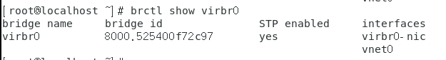

### 5.4 添加USB设备

- 以添加宿主机上的USB设备到虚拟机中使用，选择添加硬件，添加”USB主机设备”，选择要连接的宿主机上的USB设备即可。

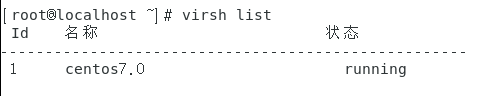

### 5.5 连接远程的KVM主机，进行管理(图形界面)  

- 首先“添加连接”

  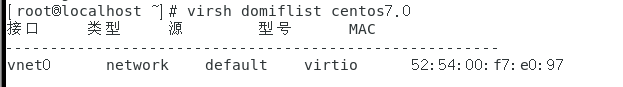

- 建立连接，添加必要的参数。连接端需要安装 软件包。连接时使用被连接端宿主机ip。

  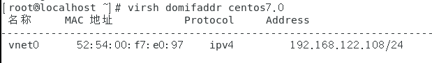

- 结果如下  

  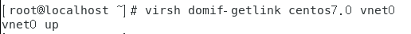

## 6  virsh

virsh是使用libvirt management API构建的管理工具

virsh的名称的含义是virtualization shell。它有两种工作模式： 

- 立即模式  

  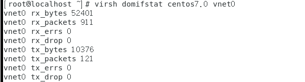

- 交互模式

  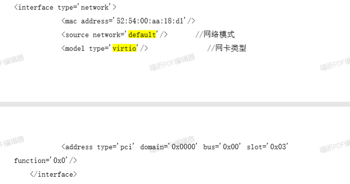


查看命令帮助virsh --help,主要有以下部分管理命令：  


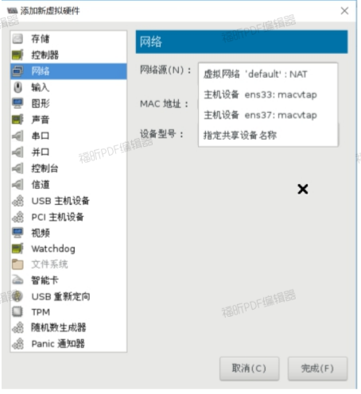

常用命令总结  :

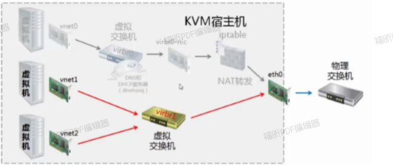

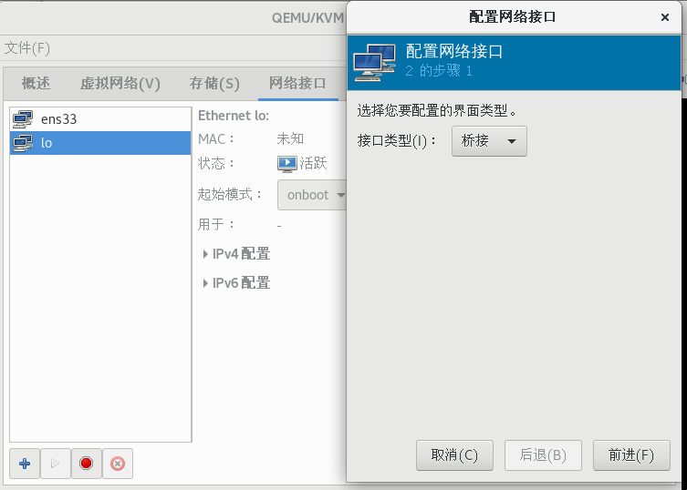

## 7  实操

1.  查看命令帮助  

   ```shell
   $ virsh -h
   ```

2.   查看KVM的配置文件存放目录  

   ```shell
   $ ls -l /etc/libvirt/qemu
   
   总用量 12
   drwxr-xr-x. 2 root root	23 9 月 28 17:20 autostart	 
   -rw-------. 1 root root 4364 9 月 27 12:01 centos7.0.xml
   drwx------.  3 root root	42 9 月 24 22:54 networks
   -rw-------. 1 root root 3847 9 月 28 16:35 vm002.xml
   
   ```

3.  查看虚拟机状态

   ```shell
   $ virsh list --all
   ```
   
4. 虚拟机关机与开机 

   ```shell
   $ virsh shutdown vm002	    
   域 vm002 被关闭
   
   $ virsh start vm002
   域 vm002 已开始
   
   ```

5. 强制虚拟机系统关闭电源 

   ```shell
   $ virsh destroy vm002
   域 vm002 被删除
   
   $ virsh list --all	 	  
   Id	名称	状态
   ----------------------------------------------------
   3	centos7.0	running
   -	vm002	关闭
   
   ```

6.  通过配置文件启动虚拟机系统实例  

   ```shell
   $ virsh create /etc/libvirt/qemu/vm002.xml 
   域 vm002 被 创 建 （ 从 /etc/libvirt/qemu/vm002.xml）
   
   $ virsh list --all
   Id	名称	状态
   ----------------------------------------------------
   3	centos7.0	running
   5	vm002	running 
   
   ```

7. 挂起虚拟机

   ```shell
   $ virsh suspend vm002
   域 vm002 被挂起
   
   $ virsh list --all	 
   Id	名称	状态
   ----------------------------------------------------
   3	centos7.0	running
   5	vm002	暂停
   
   ```

   

8. 恢复虚拟机  

   ```shell
   $ virsh resume vm002 
   域 vm002 被重新恢复
   
   $ virsh list --all
   Id	名称	状态
   ----------------------------------------------------	 
   3	centos7.0	running
   5	vm002	running
   
   ```

   

9. 配置虚拟机实例伴随宿主机自动启动  

   ```shell
   $ virsh autostart vm002
   域vm002标记为自动开始
   # 上述命令将创建/etc/libvirt/qemu/autostart/目录，里面内容为开机自动启动的系统
   
   $ virsh autostart --disable  vm002	                           
   域 vm002取消标记为自动开始
   
   ```

10. 导出虚拟机配置

    ```shell
    $ virsh dumpxml vm002 > /etc/libvirt/qemu/vm002-bak.xml
    ```

11. 虚拟机的删除与添加  

    1.  删除虚拟机  

       ```shell
       $ virsh shutdown vm002 
       域 vm002 被关闭
       
       $ virsh undefine vm002 
       域 vm002 已经被取消定义
       
       ```

       查看删除结果，vm002的配置文件被删除，但是磁盘文件不会被删除。

       ```shell
       $ ls /etc/libvirt/qemu
       autostart centos7.0.xml networks vm002-bak.xml
       # 通过virsh list --all 查看不到vm002的信息，说明此虚拟机被删除
       
       
       $ virsh list --all
       Id	名称	状态
       ----------------------------------------------------	 
       3	centos7.0	running
       
       ```

       

    2. 通过备份的配置文件重新定义虚拟机

       ```shell
       $ mv /etc/libvirt/qemu/vm002-bak.xml
       /etc/libvirt/qemu/vm002.xml
       
       $ virsh define /etc/libvirt/qemu/vm002.xml 
       定 义 域 vm002（ 从 /etc/libvirt/qemu/vm002.xml） 
       
       $ virsh  list --all 
       Id	名称	状态
       ----------------------------------------------------
       3	centos7.0	running
       -	vm002         关闭
       
       ```

12.   修改虚拟机配置信息 

    ```shell
    #直接修改配置文件
    $ vim /etc/libvirt/qemu/vm002.xml 
    #通过virsh命令修改
    $ virsh edit vm002
    
    ```

13. 查看虚拟机信息  

    ```shell
    $ virsh dominfo vm002	  
    Id:	1
    名称：	vm002
    UUID:	e144e9ba-a125-4a97-9cf1-1c571f58817a
    OS 类 型：		hvm 状态：	running CPU：		1
    CPU 时间：	72.9s
    最大内存： 1048576 KiB
    使用的内存： 1048576 KiB持久：	是
    自动启动： 禁用
    管理的保存： 否	 	                                         安全性模式： selinux
    安全性 DOI： 0
    安全性标签： system_u:system_r:svirt_t:s0:c215,c657 (enforcing)
    
    ```
    

    
14.  连接虚拟机

```shell
$  virsh console vm002	            
连接到域 vm002
换码符为 ^]

CentOS Linux 7 (Core)
Kernel 3.10.0-514.el7.x86_64 on an x86_64

vm002 login: root Password:
Last login: Fri Sep 29 09:00:18 on ttyS0 
```

想成功连接到虚拟机：

如果是CentOS7,需要在虚拟机里运行以下命令

```shell
# ttyS0串行终端 grubby[ˈɡrʌbi]（肮脏的）
# grubby是一个命令行工具，用于更新和显示有关grub，lilo，elilo （ia64），yaboot（powerpc）和zipl（s390）引导加载程序的配置文件的信息。它主要设计用于安装新内核的脚本，并需要查找有关当前引导环境的信息。
# --update-kernel 指定针对的内核版本。ALL为针对所有内核版本修改参数
# --args新内核的默认参数或正在更新的内核的新参数
$ grubby --update-kernel=ALL --args="console=ttyS0" 
$ reboot
```

​         如果想退出虚拟机连接，按“Ctrl+]”可以随时退出。如果是CentOS6的系统，需要做以下修改：   

```shell
# 1. 添加ttyS0的许可，允许root登陆
$ echo "ttyS0" >> /etc/securetty
# 2. 编辑/etc/grub.conf文件，在内核启动参数后面加上console=ttyS0
# 3. reboot重启
```

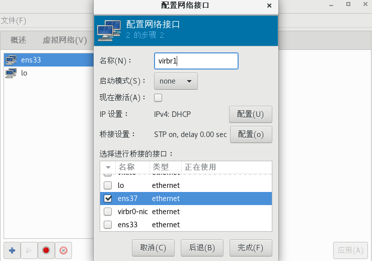

## 8. KVM文件管理

​		通过文件管理可以直接查看、修改、复制虚拟机的内部文件。例如，当系统因为配置文件无法启动时，可以直接修改虚拟机的文件。虚拟机磁盘文件主要有raw[rɔː] 和qcow2格式。raw格式性能最好，速度最快，它的缺点就是不支持一些新的功能，如支持镜像,zlib磁盘压缩,AES加密等。要使用镜像功能，磁盘格式必须为qcow2。

​		raw格式的话，速度稍微快点，在高版本的qemu-kvm中，几乎不比qcow2的格式快，而qcow2格式节省空间，可动态增长，在公有云中广泛使用，建议使用qcow2。所以有时候，我们需要将raw格式的磁盘转换成qcow2格式。

```shell
创建一个raw格式的磁盘文件
$ qemu-img create /kvm-vm/vmtest01.img 8G 
Formatting '/kvm-vm/vmtest01.img', fmt=raw size=8589934592
查看一下
$ls -lh 
总用量 3.0G
-rw-------. 1 qemu qemu 11G 9 月 28 22:40 centos7-vm001.qcow2
-rw-r--r--. 1 qemu qemu 1.3G 9 月 29 09:28 centos7-vm002.qcow2	 
drwx------. 2 root root 16K 9 月 27 10:45 lost+found
-rw-r--r--. 1 root root 8.0G 9 月 29 09:27 vmtest01.img

$ qemu-img info vmtest01.img 
image: vmtest01.img
file format: raw	 
virtual size: 8.0G (8589934592 bytes) 
disk size: 0
# 虽然通过ls命令看到磁盘为8G，但是实际空间大小为0，所以通过qemu-img创建的磁盘为稀疏模式磁盘。
# 通过virt-manager或者virt-install命令创建新虚拟机并安装好
 
$virt-install --name vmtest02 --vcpus 1 --ram 1024 --disk /kvm-vm/vmtest01.img,format=raw --network network=default --graphics vnc,listen=0.0.0.0 --noautoconsole --os-type=linux --os-variant=centos7.0  --location=/iso/CentOS-7-x86_64-DVD-1908.iso

开始安装......	 
搜索文件 .treeinfo......	| 366 B
00:00:00
搜索文件 vmlinuz......	| 5.1
MB 00:00:00
搜索文件 initrd.img......	| 41
MB 00:00:01
域安装仍在进行。您可以重新连接到控制台以便完成安装进程。

安装完成后，查看虚拟机状态
$ virsh list --all	 
Id	名称	状态
----------------------------------------------------
2	vm002	running
4	vmtest01	running
-	centos7.0	关闭关闭虚拟机：
$ virsh shutdown vmtest01	 
域 vmtest01 被关闭

$ virsh list --all
Id	名称	状态
----------------------------------------------------
2	vm002	running
-	centos7.0	关闭
-	vmtest01	关闭


```

### 实验：将raw磁盘格式的KVM虚拟机转换为qcow2磁盘格式的虚拟机

1. 转换磁盘格式为qcow2  

   ```shell
   $ qemu-img convert -f raw -O qcow2 /kvm-vm/vmtest01.img /kvm-vm/vmtest01.qcow2
   $ ls -lh 总用量 5.5G
   -rw-------. 1 qemu qemu   11G 9 月   28 22:40 centos7-vm001.qcow2
   -rw-r--r--. 1 qemu qemu 1.3G 9 月   29 10:01 centos7-vm002.qcow2
   drwx------. 2 root root 16K 9 月 27 10:45 lost+found
   -rw-r--r--. 1 root root 8.0G 9 月 29 09:59 vmtest01.img
   -rw-r--r--. 1 root root 1.3G 9 月 29 10:01 vmtest01.qcow2 
   $ qemu-img info vmtest01.qcow2 
   image: vmtest01.qcow2
   file format: qcow2
   virtual size: 8.0G (8589934592 bytes) disk size: 1.2G
   cluster_size: 65536
   Format specific information:
   			compat: 1.1	                                                    lazy refcounts: false
   
   ```

2.  修改vmtest01的xml配置文件，主要是修改type和source部分  

```shell
$ virsh edit vmtest01
```

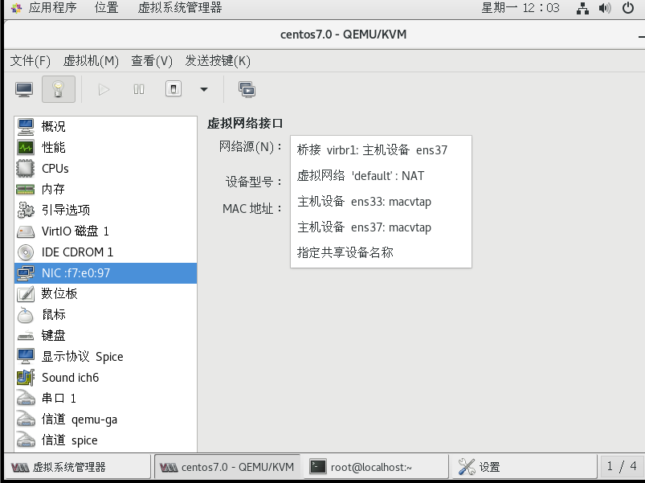

3.  然后启动vmtest01虚拟机  

   ```shell
   $ virsh start vmtest01 
   域 vmtest01 已开始
   ```

   **vrit-edit命令用于编辑文件，用法与vim基本一致  **

- virt-df命令用于查看虚拟机磁盘信息

```shell
$ yum -y install libguestfs-tools virt-top
$ virt-df -h vmtest01
文件系统	大 小 已 用 空 间 可 用 空 间 使 用 百 分 比 % vmtest01:/dev/sda1		1014M	106M	908M	11%
vmtest01:/dev/cl/root	6.2G	917M	5.3G	15%

```

-   virt-copy-out这个命令可以把虚拟机里的文件复制出来, 用法如下  

```shell
# virt-copy-out -d domname file|dir [file|dir ...] localdir
# virt-copy-out -a disk.img file|dir [file|dir ...] localdir
如 ：
$ virt-copy-out -d vmtest01 /etc/passwd ./ 
$ ls
anaconda-ks.cfg initial-setup-ks.cfg passwd


```

-  virt-copy-in是将文件复制到虚拟机里面,用法和virt-copy-out基本相同如 ：  

```bash
$ echo "this is a test" > test.txt  
$ virt-copy-in -d vmtest01 test.txt /opt/
```

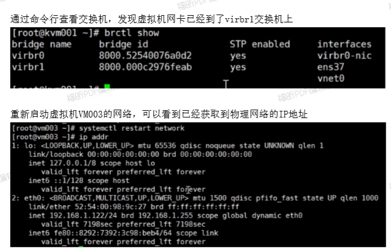

 **上面的这些操作最好要在虚拟机关机状态下做，否则会出错。**

- guestfish命令

```shell
# guestfish [--ro|--rw]  -i -a /path/to/disk.img 
# guestfish [--ro|--rw] -i -d name-of-libvirt-domain
# Guestfish是用于检查和修改虚拟机文件系统的shell程序和命令行工具。
# -r --ro 只读模式
# -i --inspector 检查寻找操作系统的磁盘，并像在真正的虚拟机上一样装载文件系统。
# -d --domain 指定域
# -a --add 指定磁盘文件
guestfish --ro -i -d vm003
```

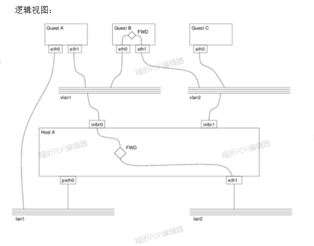

## 9. KVM虚拟机克隆  

1.  查看虚拟机状态  

```shell
$ virsh list --all
Id	名称	状态
----------------------------------------------------
17	vmtest01	running	 
-	centos7.0	关闭
-	vm002	关闭

```

2. 从vm002克隆到vm003

```shell
$ virt-clone -o vm002 -n vm003 -f /kvm-vm/vm003.qcow2
```

3. 查看虚拟机状态

   ```shell
   $ virsh list --all
   Id	名称	状态
   ----------------------------------------------------
   17	vmtest01	running	 
   -	centos7.0	关闭
   -	vm002	关闭
   -	vm003	关闭
   
   ```

   

4. 启动虚拟机

   ```shell
   $ virsh start vm003 
   域 vm003 已开始
   
   $ virsh list --all	 
   Id	名称	状态
   ----------------------------------------------------
   17	vmtest01	running
   18	vm003	running
   -	centos7.0	关闭
   -	vm002	关闭
   
   ```

## 10. KVM虚拟机快照

​		快照实际上做的是虚拟机的XML配置文件，默认快照XML文件在/var/lib/libvirt/qemu/snapshot/虚拟机名/下，快照只支持qcow2磁盘格式的系统。

1. 对虚拟机vm002做快照

   ```shell
   $ virsh snapshot-create vm002
   
   已生成域快照 1507040414
   或者在创建快照的同时给快照一个名字
   $ virsh snapshot-create-as vm002 firsh_snap 
   已生成域快照 firsh_snap
   
   ```

   

2. 查看快照信息  

   ```shell
   $ virsh snapshot-list vm002
   名称	生成时间	状态
   ------------------------------------------------------------ 1507040414	2017-10-03 22:20:14 +0800 shutoff
   firsh_snap	2017-10-03 22:26:49 +0800 shutoff
   
   ```

   

3. 查看当前快照信息

   ```shell
   $ virsh snapshot-current vm002
   <domainsnapshot>
   <name>firsh_snap</name>	//快照版本号
   <state>shutoff</state>
   <parent>	 	  
   <name>1507040414</name>
   </parent>
   <creationTime>1507040809</creationTime>
   <memory    snapshot='no'/> 
   ```
   
   
   
4. 恢复虚拟机状态到1507040414

   ```shell
   $ virsh snapshot-revert vm002 1507040414
   
   # 验证是否恢复
   $ virsh snapshot-current vm002
   <domainsnapshot>
   <name>1507040414</name>	//快照版本号
   <state>shutoff</state>
   <creationTime>1507040414</creationTime>
   <memory snapshot='no'/>
   ```

   

5. 删除快照  

```shell
$ virsh snapshot-list vm002 
名称	生成时间	状态
------------------------------------------------------------ 1507040414	2017-10-03 22:20:14 +0800 shutoff
firsh_snap	2017-10-03 22:26:49 +0800 shutoff	
$ virsh snapshot-delete vm002 firsh_snap
已删除域快照 firsh_snap

$ virsh snapshot-list vm002	  
名称	生成时间	状态
------------------------------------------------------------ 1507040414	2017-10-03 22:20:14 +0800 shutoff

```

