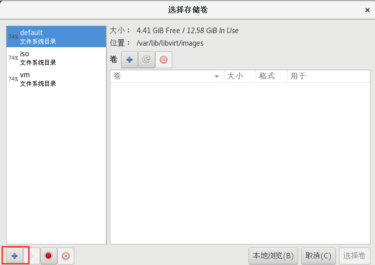
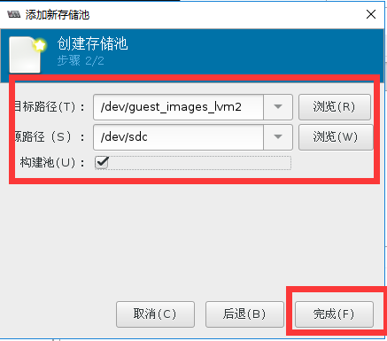

·一 、 管理虚拟存储

## 1.1 KVM的存储方式

​	KVM的存储选项有多种，包括虚拟磁盘文件、基于文件系统的存储和基于设备的存储。


### 1.1.1 基于文件系统的KVM存储

​	为实现KVM(Kernel-based Virtual Machine)存储管理，可以使用LVM(Logical Volume Manager)创建存储池。当系统创建KVM虚拟机的时候，默认使用虚拟磁盘文件作为后端存储。安装后，虚拟机认为在使用真实的磁盘，但实际上看到的是用于模拟硬盘的虚拟磁盘文件。这一额外的文件系统层会降低系统速度。

​	当然，基于磁盘镜像的虚拟磁盘并非全无益处，磁盘文件系统可以很轻松地用于其它的KVM虚拟化宿主机。但是如果您希望优化KVM虚拟化性能，最好考虑其它的存储方式。

​	在安装KVM宿主机时，可选文件系统为 dir(directory [dəˈrektəri] 目录)、fs(formatted block storage) 或netfs 作为初始KVM存储格式。默认选项为dir,用户指定本地文件系统中的一个目录用于创建磁盘镜像文件。

​	fs选项可以允许用户指定某个格式化文件系统的名称，把它作为专用的磁盘镜像文件存储。两种KVM存储选项之间最主要的区别在于：**fs文件系统不需要挂载到某个特定的分区。**

​	两种选项所指定的文件系统，都可以是本地文件系统或位于SAN（ 存储区域网络（Storage Area Network，简称*SAN*） ）上某个物理宿主机上的网络文件系统。后者具备一定的优势，因为SAN可以很轻易地实现多个主机同时访问，而本地磁盘或文件系统则无法实现。

​	还有一种基于文件的磁盘存储方式是netfs,用户可以指定一个网络文件系统的名称，如Samba.用这种方式作为KVM存储很方便，因为这样很容易访问到位于其它服务器上的文件系统，同时用户也可以通过多台宿主机访问磁盘文件。

​	所有的这些基于文件的KVM存储方式都有一个缺点：**文件系统固有缺陷。因为虚拟机的磁盘文件不能直接读取或写入KVM存储设备，而是写入宿主机OS之上的文件系统。这也就意味着在访问和写入文件时中间增加了额外一层，这通常会降低性能**。所以，如果您希望寻找KVM虚拟化性能最优方案，最好考虑基于设备的存储。

### 1.1.2 基于设备的KVM存储

​	另外一种KVM存储的方式就是使用基于设备的方式。共支持四种不同的物理存储：磁盘、iSCSI //ˈаɪskʌzi// 、SCSI /ˈskəzē/和逻辑盘。磁盘方式指直接读写硬盘设备。iSCSI和SCSI方式可选，取决于用户采取SCSI或iSCSI地址把磁盘设备连接。这种KVM存储方式的优势在于，磁盘的名称是固定的，而不需要取决于宿主机OS搜索到磁盘设备的顺序。

​	这种连接磁盘的方式也有缺点：灵活性不足。虚拟磁盘的大小很难改变，而且基于设备的KVM存储不支持快照。

​	如果要优化KVM存储的灵活性，可以使用LVM。LVM的优势在于可以使用快照，而快照并不是KVM虚拟化自带的功能

​	LVM可以把所有存储放到一个卷组里，从而轻松创建一个逻辑卷。该卷组是物理磁盘设备的一个抽象，所以如果超出可用磁盘空间最大值，还可以向卷组中添加新的设备，从而极大简化了增加存储空间的过程，增加的空间在逻辑卷中直接可以使用。使用LVM使得磁盘空间分配更加灵活，而且增加和删除存储也更为容易。

​	最后，LVM无论是在单宿主机或多宿主机环境中都可以很好工作。在多宿主机环境中，您可以在SAN上创建逻辑卷。如果使用Cluster （[ˈklʌstər] 群 ，组）   LVM,可以很容易的配置成多个主机同时访问某个逻辑卷。


## 1.2 使用KVM存储池

​	为简化KVM存储管理的目的，可以创建存储池。在宿主机上创建存储池，可以简化KVM存储设备的管理。采用存储池的方式还可以实现对提前预留的存储空间的分配。这种策略对于大型应用环境很有效，存储管理员和创建虚拟机的管理经常不是同一个人。这样，在创建首台虚拟机之前先完成KVM存储池的创建是很好的方法。

# 二、 管理虚拟磁盘

## 2.1 虚拟化项目中存储的注意事项

- 存储的性能几乎总是虚拟化的瓶颈
- 通过多个磁盘驱动以分布磁盘I/O来实现存储解决方案
- 驱动器的速度越快越好，考虑SSD与机械磁盘的混合使用
- 考虑部署集中化的SAN/NFS来实现高可用性和实时迁移


## 2.2  虚拟磁盘类型

### 2.2.1 固定 大小磁盘 Fixed [fɪkst]

​	固定尺寸硬盘在创建时要求你指定硬盘大小，并且将占用宿主机上相应的磁盘空间。例如，如果你创建一个2G的固定尺寸硬盘，那么此硬盘将立即占用宿主机上2G的硬盘空间。

- 不管在虚拟磁盘上实际存储多少数据，都将占用相同大小主机磁盘空间

### 2.2.2 动态磁盘Dynamic [daɪˈnæmɪk]

​	动态扩展硬盘根据所存储的数据量的大小来扩展在宿主机上所占用的磁盘空间，创建动态扩展硬盘时需要你指定硬盘大小，但是动态扩展硬盘刚创建时只会占用非常少的存储空间。这是微软推荐使用的硬盘类型，并且是唯一支持压缩的硬盘类型。但其性能不如固定大小磁盘，  因为固定大小磁盘没有与扩展物理的VHD文件相关的开支，磁盘访问速度更快，磁盘碎片整理也减少了。

-   动态扩展磁盘开始占用小，随着空间需要而增长

  

### 2.2.3 差异磁盘 Differencing   [ˈdɪfərənsɪŋ]

​	差异硬盘基于一个现有的虚拟硬盘（父硬盘）而创建，当你使用差异硬盘时，差异硬盘上的数据基于父硬盘上的数据，但是对父硬盘所做的任何修改都将保存在差异硬盘而不是提交到父硬盘中，并且差异硬盘只是保存对父硬盘所做的修改。当启用差异磁盘时，你不应再对父硬盘进行任何修改，否则差异硬盘上保存的数据将会失效；另外，父硬盘也可以是其他差异硬盘，此时，位于此硬盘链上的任何父硬盘都不能再进行修改，否则位于 硬盘链末尾的差异硬盘上保存的数据将会失效。差异磁盘是非常有用的功能，它可以极大的减小你所创建的虚拟机测试系统所占用的磁盘空间，你应该尽可能多的使用差异磁盘。

- 因为创建是差异磁盘，所以只保存变更的数据

​	例如，将操作系统安装在父盘，然后创建差异化磁盘来执行进一步配置，桌面虚拟化使用很多。

桌面虚拟化： 桌面虚拟化是指将计算机的终端系统（也称作桌面）进行虚拟化，以达到桌面使用的安全性和灵活性。可以通过任何设备，在任何地点，任何时间通过网络访问属于我们个人的桌面系统。 


## 2.3 KVM支持的镜像格式

  KVM 虚拟化中使用的镜像格式通常为 RAW 和 QCOW2 两种格式.

### 2.3.1 <font color=Red>raw</font>

​	RAW [rɔː]  格式镜像文件又被称为 原始镜像 或 裸设备镜像, RAW 格式镜像文件能够直接当作一个块设备类似/dev/sdb 设备直接挂载；可以使用dd指令创建一个 File 就能够模拟 RAW 镜像文件；性能较 QCOW2 要更高；能够随意转换格式；**RAW不支持快照**；从空间使用来看，这个很像磁盘，使用多少 就是多少（du -h看到的大小就是使用大小）。

- 这并非是一种真正的磁盘格式，而是代表虚拟机所使用的原始镜像

- 它并不存储元数据，因此可以作为保证虚拟机兼容性的候选方案。然而，也正因为它不存储元数据，因此不能支持某些高级特性，比如快照和压缩等

- 格式简单，容易转化为其他的格式。需要文件系统的支持才能支持sparse [spɑːrs] file 稀疏文件。

  当用户申请一块很大的存储空间时，由于最开始并没有写入数据（全是空），此时文件系统为了节省存储资源，提高资源利用率，不会分配实际存储空间，只有当真正写入数据时，操作系统才真正一点一点地分配空间，比如一次64KB。于是这个文件看起来很大，而占用空间很小，实际占用空间只与用户填的数据量有关。该文件看起来像一个大盒子，但可能装的东西不多，空洞很大，因此称为稀疏文件（Sparse file）。 

### 2.3.2 cow [kaʊ]

+ copy-on-wirte格式，此格式昙花一现。

### 2.3.3 qcow

+ QEMU早期的copy-on-write格式过渡性方案

### 2.3.4 <font color=Red>qcow2</font>

​	qcow2 镜像格式是 QEMU 模拟器支持的一种磁盘镜像。它也是可以用一个文件的形式来表示一块固定大小的块设备磁盘。与普通的 raw 格式的镜像相比，有以下特性：

+ 更小的空间占用，即使文件系统不支持空洞(holes)；

+ 支持写时拷贝（COW, copy-on-write），镜像文件只反映底层磁盘的变化；

+ 支持快照（snapshot[ˈsnæpʃɑːt]），镜像文件能够包含多个快照的历史；

+ 可选择基于 zlib 的压缩方式

+ 可以选择 AES 加密

### 2.3.5 vmdk

+ 全称为 virtual machine disk

- VMware环境当中默认使用的磁盘格式  

### 2.3.6 vhd

+ 全称为 Microsoft Virtual Hard Disk format

- 微软默认采用的文件格式   

  ### 

  ### vhdx

- 与旧的 VHD 格式相比，VHDX 具有更大的存储容量。虚拟硬盘的存储容量高达 64 TB

- 它还在电源故障期间提供数据损坏保护并且优化动态磁盘和差异磁盘的结构对齐方式，以防止在新的大型扇区物理磁盘上性能降级。

### 2.3.7 vdi

+ 全称为 Virtual Disk Images

+ VirtualBox的硬盘镜像文件

  

```shell
#可以通过qemu-img --help | grep Supported命令查看KVM所支持的磁盘格式
$ qemu-img --help | grep Supported

Supported formats: vvfat vpc vmdk vhdx vdi ssh sheepdog rbd raw host_cdrom
host_floppy host_device file qed qcow2 qcow parallels nbd iscsi gluster dmg tftp
ftps ftp https http cloop bochs blkverify blkdebug
```


# 三、 磁盘管理工具

​	qemu-img是QEMU的磁盘管理工具，在qemu-kvm源码编译后就会默认编译好qemu-img这个二进制文件。qemu-img也是QEMU/KVM使用过程中一个比较重要的工具，
qemu-img工 具的命令行基本用法如下：

​	qemu-img command [command options]


## 3.1 qemu-img常用功能命令：

+ check		#检查完整性
+ create 		#创建镜像
+ commit 		#提交更改
+ compare		#比较
+ convert		#转换
+ info		#获取信息
+ map 		#映射
+ snapshot 		#快照管理
+ rebase 		#在已有的镜像的基础上创建新的镜像
+ resize 		#调整大小
+ amend 		#修订镜像格式选项

### 3.1.1 create [-f fmt] [-o options] filename [size]

​	创建一个格式为*fmt*大小为*size*文件名为*filename*的镜像文件。根据文件格式*fmt*的不同，还可以添加一个或多个选项（*options*）来附加对该文件的各种功能设置，可以使用“-o ?”来查询某种格式文件支持那些选项，在“-o”选项中各个选项用逗号来分隔。

```shell
#假如我们想看一下各种磁盘格式所附带的-o option都有什么，我们可以这么做

$ qemu-img create -f raw -o ?
Supported options:
size             Virtual disk size

$ qemu-img create -f qcow2 -o ?
Supported options:
size             Virtual disk size
compat           Compatibility level (0.10 or 1.1) # 兼容级别
backing_file     File name of a base image # 指定后端镜像文件
backing_fmt      Image format of the base image # 设置后端镜像的镜像格式
encryption       Encrypt the image # 设置加密
cluster_size     qcow2 cluster size # 设置簇大小，取值在512到2M之间，默认是64K
preallocation    Preallocation mode (allowed values: off, metadata, falloc, full) # 预分配模式 (allowed values: off, metadata, falloc, full)
lazy_refcounts   Postpone refcount updates # 推迟引用计数更新

```

preallocation 允许值:

- off 缺省策略，既不使用预分配策略
- metadata 分配元数据，预分配后的虚拟磁盘仍然属于稀疏模式类型
  磁盘
- full 分配所有磁盘空间并置零，预分配后的虚拟磁盘属于厚盘
- falloc 分配文件的块并标示它们的状态为未初始化，创建速度快

​	size选项用于指定镜像文件的大小，其默认单位是字节（bytes），也可以支持k（或K）、M、G、T来分别表示KB、MB、GB、TB大小。另外，镜像文件的大小（size）也并非必须写在命令的最后，它也可以被写在“-o”选项中作为其中一个选项。

对create命令的演示如下所示:

1. **创建raw格式的磁盘**

```shell
$ cd /kvm-vm/
$ qemu-img create t1.img 1g 
Formatting 't1.img', fmt=raw size=1073741824     #默认的磁盘格式fmt=raw

```

2.  **创建qcow2格式的磁盘**

```shell
# -f:指定格式
$ qemu-img create -f qcow2 test1.qcow2 1g
```

  

### 3.1.2 info [-f fmt] filename

​	展示*filename*镜像文件的信息。如果文件是使用稀疏文件的存储方式，也会显示出它的本来分配的大小以及实际已占用的磁盘空间大小。如果文件中存放有客户机快照，快照的信息也会被显示出来。下面的命令行演示了前面进行文件转换的输入、输出文件的信息。

```shell
$ qemu-img info t1.img 
image: t1.img # 文件名称
file format: raw # 默认磁盘格式为raw
virtual size: 1.0G (1073741824 bytes) # 大小
disk size: 0 #虚拟磁盘大小（虚拟空间大小是0？？？？？？？？）

#我们用ll查看一下
$ ll -h t1.img 
-rw-r--r--. 1 root root 1.0G 12月 10 01:43 t1.img # 是1G啊！那为什么我们使用qemu-img 命令查看确实0呢？

#du 显示文件或目录所占用的磁盘空间
#但我们用du查看一下，发现磁盘真实空间的占用还真是0
# -s 显示文件或整个目录的大小，默认单位是KB
# -h 输出文件系统分区使用的情况，例如：10KB，10MB，10GB等
$ du -sh t1.img 
0	t1.img

# 因为默认情况下 qemu-img 创建的磁盘文件的类型是RAW ，RAW是动态的（Dynamic 空洞）会根据真实存放数据的大小进行动态扩容直到磁盘空间设定值的大小。

$ qemu-img info test1.qcow2
image: test1.qcow2 
file format: qcow2 # 磁盘格式
virtual size: 1.0G (1073741824 bytes)
disk size: 196K
cluster_size: 65536
Format specific information:
compat: 1.1
lazy refcounts: false
```

### 3.1.3 check [-f fmt] filename

​	对磁盘镜像文件进行一致性检查，查找镜像文件中的错误，**目前仅支持对“qcow2”、“qed”、“vdi”格式文件的检查。**其中，qcow2是QEMU 0.8.3版本引入的镜像文件格式，也是目前使用最广泛的格式。qed（QEMU enhanced disk）是从QEMU 0.14版开始加入的增强磁盘文件格式，为了避免qcow2格式的一些缺点，也为了提高性能，不过目前还不够成熟。而vdi（Virtual Disk Image）是Oracle的VirtualBox虚拟机中的存储格式。参数-f *fmt*是指定文件的格式，如果不指定格式qemu-img会自动检测，*filename*是磁盘镜像文件的名称（包括路径）。

​	如下命令行演示了qemu-img的check命令的使用方法。

```shell
$ qemu-img check test1.qcow2
No errors were found on the image. # 在镜像上未发现错误。
Image end offset: 262144

$ qemu-img check t1.img
qemu-img: This image format does not support checks # 此镜像格式不支持检查 
```

​	

## 3.2 后备差异虚拟磁盘（VMware中称作链接克隆）

​	多个虚拟机使用的差量镜像（前端镜像）都指向同一个后备镜像，默认从后备镜像读，写则到自己的差量镜像。后备镜像可以是raw或qcow2，差量镜像只能是qcow2

- 存储与基础镜像（父）磁盘的变化：
  - 虚拟机使用的差量磁盘时，删除文件时，基础镜像（父）磁盘不会改变。
  - 差异磁盘隔离变化
  - 多个差异磁盘可以使用相同的基础镜像（父）磁盘
- 优点：
  1. 标准化基础镜像，节省磁盘空间,
  2. 瞬间快速创建虚拟机

​         后备镜像差量生成虚拟机的方式可以快速的产生大量的虚拟机，节省磁盘空间，在生产环境中有非常重要的意义。经过测试，对后备镜像的读压力非常小，系统压力主要在差量镜像的写压力，使用的时候，为了取得良好效果，应将后备镜像和差量镜像分散到不同的物理硬盘上，并保证镜像的安全性。

- 缺点：增加了开销，较差的性能


​	


## 3.3 使用后备差异虚拟磁盘创建虚拟机

```shell
# 通过正常方式安装一个虚拟机得到基础镜像（父）磁盘

# 创建差异虚拟磁盘：
# 创建差异磁盘镜像需要使用在“-o”选项使用backing_file这个选项来指定其后端镜像文件，这个创建的镜像文件仅记录与后端镜像文件的差异部分。后端镜像文件不会被修改，除非在QEMU monitor中使用“commit”命令或者使用“qemu-img commit”命令去手动提交这些改动。这种情况下，size参数不是必须需的，其值默认为后端镜像文件的大小。另外，直接使用“-b *backfile*”参数也与“-o backing_file=*backfile*”效果相同。
$ qemu-img create -f qcow2 \
> -o backing_file=base-centos7.qcow2 \          # 指定父磁盘文件
> oa-disk0.qcow2

# 查看创建的差异虚拟磁盘
$ qemu-img info oa-disk0.qcow2

# 然后根据差异磁盘创建虚拟机
$ virt-install \
--name oa \
--vcpus 1 --ram 1024 \
--disk /kvm-vm/oa-disk0.qcow2 \
--network network=default \
--graphics vnc,listen=0.0.0.0 \
--noautoconsole \
--os-type=linux \
--os-variant=centos7.0  \
--import

#查看，发现虚拟机已经运行
$ virsh list
Id 名称 状态
----------------------------------------------------
1 oa running

# 可以使用相同的方法生成多个虚拟机，它们的父虚拟磁盘都是一样的
```


## 3.4 虚拟磁盘格式转换

```shell
#语法格式：
#convert [-c] [-p] [-q] [-n] [-f fmt] [-t cache] [-T src_cache] [-O output_fmt] [-o  options] [-s snapshot_name] [-S sparse_size] filename [filename2 [...]] output_filename

#将fmt格式的filename镜像文件根据options选项转换为格式为output_fmt的名为output_filename的镜像文件。它支持不同格式的镜像文件之间的转换，比如可以用VMware用的vmdk格式文件转换为qcow2文件，这对从其他虚拟化方案转移到KVM上的用户非常有用。一般来说，输入文件格式fmt由qemu-img工具自动检测到，而输出文件格式output_fmt根据自己需要来指定，默认会被转换为raw文件格式（且默认使用稀疏文件的方式存储以节省存储空间）。

#	其中，“-c”参数是对输出的镜像文件进行压缩，不过只有qcow2和qcow格式的镜像文件才支持压缩，而且这种压缩是只读的，如果压缩的扇区被重写，则会被重写为未压缩的数据。同样可以使用“-o options”来指定各种选项，如：后端镜像、文件大小、是否加密等等。使用backing_file选项来指定后端镜像，让生成的文件是copy-on-write的增量文件，这时必须让转换命令中指定的后端镜像与输入文件的后端镜像的内容是相同的，尽管它们各自后端镜像的目录、格式可能不同。

#	如果使用qcow2、qcow、cow等作为输出文件格式来转换raw格式的镜像文件（非稀疏文件格式），镜像转换还可以起到将镜像文件转化为更小的镜像，因为它可以将空的扇区删除使之在生成的输出文件中并不存在。

# 下面的命令行演示了两个转换：将VMware的vmdk格式镜像转换为KVM可以使用的qcow2镜像，将一个raw镜像文件转化为qcow2格式的镜像。
# (此处并无实际存在vmdk文件，仅演示其命令行操作)
$ qemu-img convert my-vmware.vmdk my-kvm.img
$ qemu-img convert -O qcow2 rhel6u3.img rhel6u3-a.qcow2
```

案例：不同格式虚拟机的迁移
1. 我们在VMware Workstation虚拟机中找一个关闭状态的虚拟机进行导出

    

    

2. 先将.vmdk虚拟磁盘文件拷入到KVM虚拟机中

    ```shell
    
    $ ll -h *.vmdk
    -rw-r--r--. 1 root root 924M 12月 31 20:56 LNMP-disk1.vmdk
    
    $ qemu-img info LNMP-disk1.vmdk
    image: LNMP-disk1.vmdk
    file format: vmdk
    virtual size: 20G (21474836480 bytes)
    disk size: 923M
    cluster_size: 65536
    Format specific information:
        cid: 3915664802
        parent cid: 4294967295
        create type: streamOptimized
        extents:
            [0]:
                compressed: true
                virtual size: 21474836480
                filename: LNMP-disk1.vmdk
                cluster size: 65536
                format:
    ```

    

3. 然后进行磁盘文件的格式转换

```shell
$ du -sh LNMP-disk1.vmdk
924M    LNMP-disk1.vmdk
$ qemu-img convert -O qcow2 LNMP-disk1.vmdk LNMP-disk1.qcow2
$ du -sh LNMP*
2.5G    LNMP-disk1.qcow2
924M    LNMP-disk1.vmdk
```

4. 然后根据虚拟磁盘迁移前的VMware配置，导入到新的KVM虚拟机

```shell

#导入新的KVM虚拟机
$ virt-install --import --name=LNMP --vcpus=1 --ram=1024 --disk bus=scsi,path=/vm/LNMP-disk1.qcow2 --network type=bridge,source=virbr0 --network network=default --graphics vnc,listen=0.0.0.0 --os-type=linux  --os-variant=rhel6 --noautoconsole
 
开始安装......
域创建完成。

$ virsh list
 Id    名称                         状态
----------------------------------------------------
 13    LNMP                           running
```


## 3.5 调整虚拟磁盘大小

语法格式：

```
resize [-q] filename [+ | -] size
```

- 操作之前一定要做好数据备份
- 增加文件大小后，需要在客户机中使用fdisk、parted等分区工具进行相应的操作才能真正让客户机使用到增加后的镜像空间
- 缩小镜像之前，要在客户机中保证里面的文件系统有空余空间，否则会数据丢失
- qcow2不支持缩小镜像的操作

```shell
[root@kvm001 ~]# qemu-img resize test2.qcow2 +2G
Image resized.
```

## 3.6 磁盘快照管理

### 3.6.1 快照/检查点 Snapshot/Checkpoint

- 磁盘快照
   + 对磁盘数据进行快照 
   + 主要用于虚拟机备份等场合
- 内存快照
     -  对虚拟机的内存/设备信息进行保存
     - 该机制同时用于休眠恢复、迁移等场景
     - 主要使用virsh save（qemu migrate[ˈmaɪɡreɪt]  to file（文件迁移））实现，只能对运行的虚拟机进行
- 检查点快照
     - 同时保存虚拟机的磁盘快照和内存快照
     - 用于将虚拟机恢复到某个时间点
     - 可以保证数据的一致性

### 3.6.2 磁盘快照分类

- 按快照信息保存分为：
   - 内置快照：快照数据和base磁盘数据放在一个qcow2文件中
   - 外置快照：快照数据单独的qcow2文件存放
- 按虚拟机状态可以分为：
  - 关机态快照：数据可以保证一致性
  - 运行态快照：数据无法保证一致性，类似于系统crash（ [kræʃ]  意外 ）后的磁盘数据，使用时可能需要fsck（检查文件系统）等操作。
- 按磁盘数量可以分为：
   - 单盘：单盘快照不涉及原子性
   - 多盘：涉及原子性。主要分为两个方面：1、所有盘快照点相同。2、所有盘要么都快照成功，要么都快照失败。主要依赖于qemu 的 transaction（ [trænˈzækʃn] 处理）实现。

### 3.6.2 快照创建

```shell
# qemu-img的快照语法格式
snapshot [-q] [-l | -a snapshot | -c snapshot | -d snapshot] filename
'snapshot' is the name of the snapshot to create, apply or delete
'-a' applies a snapshot (revert disk to saved state)
'-c' creates a snapshot
'-d' deletes a snapshot
'-l' lists all snapshots in the given image
```


创建名为s1的磁盘快照：

```shell
[root@kvm001 kvm-vm]# qemu-img snapshot -c s1 centos7-vm001.qcow2
#查看
[root@kvm001 kvm-vm]# qemu-img snapshot -l centos7-vm001.qcow2
Snapshot list:
ID TAG VM SIZE DATE VM CLOCK
1 s1 0 2017-10-04 23:02:43 00:00:00.000
#恢复快照：
[root@kvm001 kvm-vm]# qemu-img snapshot -a s1 centos7-vm001.qcow2
#删除S1快照
[root@kvm001 kvm-vm]# qemu-img snapshot -d 1 centos7-vm001.qcow2
```


# 四、 存储池管理

## 4.1 存储池的基本概念

​	存储池是一个由libvirt管理的文件、目录或存储设备，提供给虚拟机使用。存储池被分为存储卷，这些存储卷保存虚拟镜像或连接到虚拟机作为附加存储。libvirt通过存储池的形式对存储进行统一管理、简化操作。对于虚拟机操作来说，存储池和卷并不是必需的。支持以下类型存储池：


可以通过vrit-manager图形界面查看到


## 4.2 存储池的xml文件 

```shell
$ cd /etc/libvirt/storage/
$ ll
总用量 16
drwxr-xr-x. 2 root root  73 12月 10 08:00 autostart
-rw-------. 1 root root 538 12月  8 18:21 default.xml	#对应存储池的xml文件
-rw-------. 1 root root 514 12月 10 08:00 root.xml	    #对应存储池的xml文件
-rw-------. 1 root root 517 12月  8 18:39 vm_iso.xml	    #对应存储池的xml文件
-rw-------. 1 root root 512 12月  8 18:37 vm.xml		    #对应存储池的xml文件

$ cat vm_iso.xml 
<!--
WARNING: THIS IS AN AUTO-GENERATED FILE. CHANGES TO IT ARE LIKELY TO BE
OVERWRITTEN AND LOST. Changes to this xml configuration should be made using:
  virsh pool-edit vm_iso	#警告这是一个自动文件若需要编辑请用virsh pool-edit vm_iso
or other application using the libvirt API.
-->

<pool type='dir'>	#池类型
  <name>vm_iso</name>	#池名称
  <uuid>7cdcbfc4-d8e8-420a-af20-12b48d787004</uuid>
  <capacity unit='bytes'>0</capacity> # 容量
  <allocation unit='bytes'>0</allocation> # 分配
  <available unit='bytes'>0</available> # 可用的
  <source>
  </source>
  <target>
    <path>/iso</path>	#源是在/iso这个目录里
  </target>
</pool>

# 我们发现在/etc/libvirt/storage/路径下还有一个目录autostart,该目录包含该存储池 XML 描述的一个符号链接。
$ ll autostart/
总用量 0
lrwxrwxrwx. 1 root root 32 12月  8 18:21 default.xml -> /etc/libvirt/storage/default.xml
lrwxrwxrwx. 1 root root 29 12月 10 08:00 root.xml -> /etc/libvirt/storage/root.xml
lrwxrwxrwx. 1 root root 31 12月  8 18:39 vm_iso.xml -> /etc/libvirt/storage/vm_iso.xml
lrwxrwxrwx. 1 root root 27 12月  8 18:37 vm.xml -> /etc/libvirt/storage/vm.xml

# 如果我们用virsh pool-edit iso来打开iso.xml文件的话，会是如下内容
# virsh pool-edit name 为存储池编辑 XML 配置,类似于vim
[root@KVM storage]# virsh pool-edit iso
<pool type='dir'>
  <name>vm_iso</name>
  <uuid>7cdcbfc4-d8e8-420a-af20-12b48d787004</uuid>
  <capacity unit='bytes'>18238930944</capacity>		#内容出现了变化
  <allocation unit='bytes'>15074963456</allocation>	#内容出现了变化
  <available unit='bytes'>3163967488</available>	#内容出现了变化
  <source>
  </source>
  <target>
    <path>/iso</path>
    <permissions>
      <mode>0755</mode>
      <owner>0</owner>
      <group>0</group>
      <label>unconfined_u:object_r:default_t:s0</label>
    </permissions>
  </target>
</pool>

```


## 4.3 virsh中的命令

+ **virsh中的存储池相关命令**

```shell
find-storage-pool-sources-as #通过参数找到存储池源
find-storage-pool-sources #通过XML文档发现潜在存储池源
pool-autostart #自动启动某个池
pool-build #建立池
pool-create-as #从一组变量中创建一个池
pool-create #从一个 XML 文件中创建一个池
pool-define-as #在一组变量中定义池
pool-define #在一个XML文件中定义（但不启动）一个池或修改已有池
pool-delete #删除池
pool-destroy #销毁（删除）池
pool-dumpxml #将池信息保存到XML文档中
pool-edit #为存储池编辑 XML 配置
pool-info #查看存储池信息
pool-list #列出池
pool-name #将池 UUID 转换为池名称
pool-refresh #刷新池
pool-start #启动一个（以前定义的）非活跃的池
pool-undefine #取消定义一个不活跃的池
pool-uuid #把一个池名称转换为池 UUID
```

+ **virsh 中的存储卷相关命令**

```shell
vol-clone #克隆卷。
vol-create-as #从一组变量中创建卷
vol-create #从一个 XML 文件创建一个卷
vol-create-from #生成卷，使用另一个卷作为输入。
vol-delete #删除卷
vol-download #将卷内容下载到文件中
vol-dumpxml #保存卷信息到XML文档中
vol-info #查看存储卷信息
vol-key #根据卷名或路径返回卷的key
vol-list #列出卷
vol-name #根据给定卷key或者路径返回卷名
vol-path #根据卷名或key返回卷路径
vol-pool #为给定密钥或者路径返回存储池
vol-resize #重新定义卷大小
vol-upload #将文件内容上传到卷中
vol-wipe #擦除卷
```

**例如：**

### 	4.2.1 查看系统中的存储池

```shell
$ virsh pool-list
名称 状态 自动开始
-------------------------------------------
default 活动 是
vm 活动 否
vm_iso 活动 是
```


### 4.2.2 查看vm存储池的信息

```shell
$ virsh pool-info vm
名称： vm
UUID: f97233cf-7cde-4f3d-a6a7-381ca4730493
状态： running
持久： 是
自动启动： 否
容量： 78.62 GiB
分配： 8.38 GiB
可用： 70.23 GiB
```


### 4.2.3 查看vm存储池中的卷信息

```shell
$ virsh vol-list vm
名称 路径
------------------------------------------------------------------------------
base-centos7.qcow2 /kvm-vm/base-centos7.qcow2
centos7-vm001.qcow2 /kvm-vm/centos7-vm001.qcow2
centos7-vm002.qcow2 /kvm-vm/centos7-vm002.qcow2
lost+found /kvm-vm/lost+found
oa-disk0.qcow2 /kvm-vm/oa-disk0.qcow2
vm003.qcow2 /kvm-vm/vm003.qcow2
vmtest01.img /kvm-vm/vmtest01.img
vmtest01.qcow2 /kvm-vm/vmtest01.qcow2
```


### 4.2.4 图形界面查看情况


## 4.4 创建基于目录的存储池 dir:Filesystem Directory

### 4.4.1 通过virsh创建

```shell
# mkdir /guest_images
# chown root:root /guest_images/
# chmod 700 /guest_images

$ virsh pool-define-as test dir --target "/guest_images/"
$ virsh pool-list --all
名称 状态 自动开始
-------------------------------------------
default 活动 是
test 不活跃 否
vm 活动 否
vm_iso 活动 是

$ virsh pool-start test
池 test 已启动

$ virsh pool-autostart test
池 test 标记为自动启动

$ virsh pool-list -all
名称 状态 自动开始
-------------------------------------------
default 活动 是
test 活动 是
vm 活动 否
vm_iso 活动 是

# 如果创建的存储池的目录不存在的时候，需要先通过pool-build命令构建然后才能启动成功
$ virsh pool-build test


# 删除刚刚创建的池

# 查看test池状态，可以看到是活跃的
$ virsh pool-list --all
 名称               状态     自动开始
-------------------------------------------
 default              活动     是       
 root                 活动     是       
 test                 活动     是       
 vm                   活动     是       
 vm_iso               活动     是    
 
 # 将test池状态改为不活跃的
$ virsh pool-destroy test
销毁池 test

#可以看到test池状态为不活跃的
$ virsh pool-list --all
 名称               状态     自动开始
-------------------------------------------
 default              活动     是       
 root                 活动     是       
 test                 不活跃  是       
 vm                   活动     是       
 vm_iso               活动     是 

# 删除test池与之关联的文件
$ virsh pool-delete test
池 test 被删除

# 销毁test信息(删除池对应的XML的文件)
$ virsh pool-undefine test
池 test 已经被取消定义

#
[root@shuzai ~]# virsh pool-list --all
 名称               状态     自动开始
-------------------------------------------
 default              活动     是       
 root                 活动     是       
 vm                   活动     是       
 vm_iso               活动     是 
```


### 4.4.2 通过virt-manager创建

```shell
#创建存储池目录
$ mkdir /guest_images
$ chown root:root /guest_images
$ chmod 700 /guest_images/
```




```shell
# 用命令查看存储池状态
$ virsh pool-list 
 名称               状态     自动开始
-------------------------------------------
 default              活动     是       
 guest_images_dir     活动     是           #创建完毕   
 iso                  活动     是       
 vm                   活动     是 
 
# 查看新创建的存储池的配置文件
$ cat /etc/libvirt/storage/guest_images_dir.xml 
<!--
WARNING: THIS IS AN AUTO-GENERATED FILE. CHANGES TO IT ARE LIKELY TO BE
OVERWRITTEN AND LOST. Changes to this xml configuration should be made using:
  virsh pool-edit guest_images_dir
or other application using the libvirt API.
-->
 
<pool type='dir'>
  <name>guest_images_dir</name>
  <uuid>36a61077-c4db-40fe-8745-34e49d48506d</uuid>
  <capacity unit='bytes'>0</capacity>
  <allocation unit='bytes'>0</allocation>
  <available unit='bytes'>0</available>
  <source>
  </source>
  <target>
    <path>/guest_images</path>
  </target>
</pool>
```

$$ {阿萨的}
阿萨的
$$


## 4.5 创建基于分区的存储池 fs:Pre-Formatted Block Device

+ libvirtd会自动mount分区

+ 准备分区并创建文件系统
  

```shell
$ fdisk /dev/sdc
$ mkfs.ext4 /dev/sdc1
```


+ 创建命令：
  + Source Path：块设备名
  + Target Path：mount到的目录名

例如：

```shell
$ virsh pool-define-as guest_images_fs fs --source-dev "/dev/sdc1" --target "/guest_images2"
```

+ 操作准备
  给虚拟机再加入一块磁盘，分区并进行格式化来继续我们的实验

  ```shell
  # 更新（可选重启更新）
  $ grep mpt /sys/class/scsi_host/host?/proc_name
  $ echo "- - -">/sys/class/scsi_host/host2/scan
  $ fdisk -l
  
  # 将新磁盘sdc分两个分区，并进行格式化。
  $ ll /dev/sdc*
  brw-rw---- 1 root disk 8, 32 5月  11 20:12 /dev/sdc
  brw-rw---- 1 root disk 8, 33 5月  11 20:12 /dev/sdc1
  brw-rw---- 1 root disk 8, 34 5月  11 20:12 /dev/sdc2
  
  $ rm -rf /guest_images/  #清除旧存储池存放目录
  ```


### 4.5.1 通过virt-manager创建

+ **通过virt-manager创建一个基于分区的存储池**


```shell

#验证创建的存储池

$ virsh pool-list --all
 名称               状态     自动开始
-------------------------------------------
 default              活动     是       
 guest_images_fs      活动     是           #有了并处于活动状态
 iso                  活动     是       
 VM                   活动     是       
 
$ virsh pool-info guest_images_fs
名称：       guest_images_fs
UUID:           e50f34cc-89a5-47e3-80e5-324b91b0d001
状态：       running
持久：       是
自动启动： 是
容量：       9.72 GiB
分配：       36.02 MiB
可用：       9.68 GiB
 
$ ll -d /guest_images/
drwxr-xr-x 3 root root 4096 5月  11 20:14 /guest_images/    #存储池目录被自动创建了
 
$ df -h
文件系统                容量  已用  可用 已用% 挂载点
/dev/mapper/cl-root      17G  8.9G  8.1G   53% /
devtmpfs                901M     0  901M    0% /dev
tmpfs                   912M  4.0K  912M    1% /dev/shm
tmpfs                   912M  9.0M  903M    1% /run
tmpfs                   912M     0  912M    0% /sys/fs/cgroup
/dev/sda1              1014M  144M  871M   15% /boot
/dev/mapper/vmvg-lvvm1   40G  7.0G   31G   19% /vm
tmpfs                   183M  8.0K  183M    1% /run/user/0
/dev/sdc1               9.8G   37M  9.2G    1% /guest_images    #磁盘/dev/sdc1被自动挂载了
 
$ cat /etc/libvirt/storage/guest_images_fs.xml #查看存储池的配置文件
<!--
WARNING: THIS IS AN AUTO-GENERATED FILE. CHANGES TO IT ARE LIKELY TO BE
OVERWRITTEN AND LOST. Changes to this xml configuration should be made using:
  virsh pool-edit guest_images_fs
or other application using the libvirt API.
-->
 
<pool type='fs'>    #磁盘类型为fs
  <name>guest_images_fs</name>
  <uuid>e50f34cc-89a5-47e3-80e5-324b91b0d001</uuid>
  <capacity unit='bytes'>0</capacity>
  <allocation unit='bytes'>0</allocation>
  <available unit='bytes'>0</available>
  <source>
    <device path='/dev/sdc1'/>  #源磁盘路径
    <format type='auto'/>
  </source>
  <target>
    <path>/guest_images</path>  #目标目录路径
  </target>
</pool>
$ mount | grep sdc1   #查看mount挂载的信息
/dev/sdc1 on /guest_images type ext4 (rw,relatime,data=ordered)

# 最后重启电脑验证存储池自动激活时是否可以自动挂载磁盘/dev/sdc1。然后我们清理掉guest_images_fs存储池信息，继续使用virsh创建。
```

### 4.5.2 通过virsh创建

~~~shell
# Source Path:块设备名
# Target Path:mount到的目录名
$ virsh pool-define-as test fs \
> --source-dev "/dev/sdc1" --target "/guest_images"
  
# 定义池 test
$ virsh pool-build test
# 构建池 test
$ virsh pool-start test
池 test 已启动
  
$ virsh pool-autostart test
池 test 标记为自动启动
  
$ virsh pool-list
$ virsh pool-list
   名称               状态     自动开始
  -------------------------------------------
   default              活动     是        
   test                 活动     是        
  ```

~~~


## 4.6 基本LVM的存储池中的存储卷管理

- 基于LVM的存储池要求使用全部磁盘分区

- 创建存储池，有两种方法

  1. 使用现有的VG

  2. 创建新的VG

  

- 创建命令：

  - Target Path:新的卷组名
  - Source Path:存储设备的位置
  - Build Pool：会创建新的VG

  ```shell
  $ virsh pool-define-as guest_images_lvm3 logical \ --source-dev=/dev/sdc --source-name=libvirt_lvm \ --target=/dev/libvirt_vg
  ```

  

### 4.6.1 以手动的方式创建VG并通过virt-manager创建基于lvm的存储池

```shell
# fdisk分出一个全部容量的分区
$ ll /dev/sdc*
brw-rw---- 1 root disk 8, 32 5月  11 23:25 /dev/sdc
brw-rw---- 1 root disk 8, 33 5月  11 23:25 /dev/sdc1    #这就是我们实验用的分区
# 创建一个卷组
$ pvcreate /dev/sdc1
  Physical volume "/dev/sdc1" successfully created.
$ vgcreate guest_images_lvm /dev/sdc1
  Volume group "guest_images_lvm" successfully created
```


```shell

# 验证存储池创建状态
$ virsh pool-list --all
 名称               状态     自动开始
-------------------------------------------
 default              活动     是       
 guest_images_lvm     活动     是       
 iso                  活动     是       
 VM                   活动     是       
 
$ cat /etc/libvirt/storage/guest_images_lvm.xml 
<!--
WARNING: THIS IS AN AUTO-GENERATED FILE. CHANGES TO IT ARE LIKELY TO BE
OVERWRITTEN AND LOST. Changes to this xml configuration should be made using:
  virsh pool-edit guest_images_lvm
or other application using the libvirt API.
-->
 
<pool type='logical'>
  <name>guest_images_lvm</name>
  <uuid>a95d43e7-0d20-4347-8069-9ae39074058d</uuid>
  <capacity unit='bytes'>0</capacity>
  <allocation unit='bytes'>0</allocation>
  <available unit='bytes'>0</available>
  <source>
    <name>guest_images_lvm</name>
    <format type='lvm2'/>
  </source>


# 图形界面创建成功
```

### 4.6.2 通过virt-manager创建vg并创建LVM存储池

**先清除之前创建的存储池**

```shell
#清除之前的vg卷组
$ vgs
  VG               #PV #LV #SN Attr   VSize  VFree 
  cl                 1   2   0 wz--n- 19.00g     0 
  guest_images_lvm   1   0   0 wz--n- 20.00g 20.00g
  vmvg               1   1   0 wz--n- 40.00g     0 
  
$ vgremove guest_images_lvm
  Volume group "guest_images_lvm" successfully removed
  
$ vgs
  VG   #PV #LV #SN Attr   VSize  VFree
  cl     1   2   0 wz--n- 19.00g    0 
  vmvg   1   1   0 wz--n- 40.00g    0 
  
# 清除之前的pv状态
$ pvs
  PV         VG   Fmt  Attr PSize  PFree 
  /dev/sda2  cl   lvm2 a--  19.00g     0 
  /dev/sdb1  vmvg lvm2 a--  40.00g     0 
  /dev/sdc1       lvm2 ---  20.00g 20.00g
  
$ pvremove /dev/sdc1
  Labels on physical volume "/dev/sdc1" successfully wiped.
  
$ pvs
  PV         VG   Fmt  Attr PSize  PFree
  /dev/sda2  cl   lvm2 a--  19.00g    0 
  /dev/sdb1  vmvg lvm2 a--  40.00g    0 
  
# 通过fdisk清除/dev/sdc1的磁盘分区
$ ll /dev/sdc*
brw-rw---- 1 root disk 8, 32 5月  11 23:41 /dev/sdc
```





```shell

#验证存储池创建状态
$ vgs
  VG                #PV #LV #SN Attr   VSize  VFree 
  cl                  1   2   0 wz--n- 19.00g     0 
  guest_images_lvm2   1   0   0 wz--n- 20.00g 20.00g
  vmvg                1   1   0 wz--n- 40.00g     0 
$ virsh pool-list --all
 名称               状态     自动开始
-------------------------------------------
 default              活动     是       
 guest_images_lvm2    活动     是       
 iso                  活动     是       
 VM                   活动     是       
 
$ cat /etc/libvirt/storage/guest_images_lvm2.xml 
<!--
WARNING: THIS IS AN AUTO-GENERATED FILE. CHANGES TO IT ARE LIKELY TO BE
OVERWRITTEN AND LOST. Changes to this xml configuration should be made using:
  virsh pool-edit guest_images_lvm2
or other application using the libvirt API.
-->
 
<pool type='logical'>
  <name>guest_images_lvm2</name>
  <uuid>a66a085c-d017-409d-8925-4f508956e2b0</uuid>
  <capacity unit='bytes'>0</capacity>
  <allocation unit='bytes'>0</allocation>
  <available unit='bytes'>0</available>
  <source>
    <device path='/dev/sdc'/>
    <name>guest_images_lvm2</name>
    <format type='lvm2'/>
  </source>
  <target>
    <path>/dev/guest_images_lvm2</path>
  </target>
</pool>
```

### 4.6.3 通过virsh命令创建vg并创建基于LVM的存储池

```shell
# 清除之前创建的存储池并抹除vg痕迹
$ vgs
  VG                #PV #LV #SN Attr   VSize  VFree 
  cl                  1   2   0 wz--n- 19.00g     0 
  guest_images_lvm2   1   0   0 wz--n- 20.00g 20.00g
  vmvg                1   1   0 wz--n- 40.00g     0 

$ vgremove guest_images_lvm2
  Volume group "guest_images_lvm2" successfully removed

$ pvs
  PV         VG   Fmt  Attr PSize  PFree 
  /dev/sda2  cl   lvm2 a--  19.00g     0 
  /dev/sdb1  vmvg lvm2 a--  40.00g     0 
  /dev/sdc        lvm2 ---  20.00g 20.00g

$ pvremove /dev/sdc
  Labels on physical volume "/dev/sdc" successfully wiped.

#virsh命令创建vg并创建基于LVM的存储池
$ virsh pool-define-as guest_images_lvm3 logical --source-dev=/dev/sdc --source-name=libvirt_lvm --target=/dev/libvirt_vg
定义池 guest_images_lvm3

$ vgs   #我们发现virsh命令没有自动创建vg
  VG   #PV #LV #SN Attr   VSize  VFree
  cl     1   2   0 wz--n- 19.00g    0 
  vmvg   1   1   0 wz--n- 40.00g    0 

$ pvs   #我们发现virsh命令没有自动创建pv
  PV         VG   Fmt  Attr PSize  PFree
  /dev/sda2  cl   lvm2 a--  19.00g    0 
  /dev/sdb1  vmvg lvm2 a--  40.00g    0 

#virsh命令创建卷组libvirt_lvm
$ virsh pool-build guest_images_lvm3
构建池 guest_images_lvm3

$ pvs
  PV         VG          Fmt  Attr PSize  PFree 
  /dev/sda2  cl          lvm2 a--  19.00g     0 
  /dev/sdb1  vmvg        lvm2 a--  40.00g     0 
  /dev/sdc   libvirt_lvm lvm2 a--  20.00g 20.00g

$vgs
  VG          #PV #LV #SN Attr   VSize  VFree 
  cl            1   2   0 wz--n- 19.00g     0 
  libvirt_lvm   1   0   0 wz--n- 20.00g 20.00g
  vmvg          1   1   0 wz--n- 40.00g     0 

#启动LVM存储池并标记开机自启动
$ virsh pool-list --all
 名称               状态     自动开始
-------------------------------------------
 default              活动     是       
 guest_images_lvm3    不活跃  否       
 iso                  活动     是       
 VM                   活动     是       

$ virsh pool-start guest_images_lvm3
池 guest_images_lvm3 已启动

$ virsh pool-autostart guest_images_lvm3
池 guest_images_lvm3 标记为自动启动

$ virsh pool-list --all
 名称               状态     自动开始
-------------------------------------------
 default              活动     是       
 guest_images_lvm3    活动     是       
 iso                  活动     是       
 VM                   活动     是       

```

## 4.7 基于NFS的存储池

命令：

```shell
$ virsh pool-define-as --name nfstrial2 --type netfs --source-host 192.1688.200.132 --source-path /nfsshare --target /nfstrial2
```

环境准备:

1. 在一台KVM虚拟机中创建NFS共享存储文件系统
2. 创建基于NFS共享存储的存储池

**第一步：在一台虚拟机中yum安装nfs服务端**

```shell
#这是一台NAT链接的虚拟机，yum安装nfs
# 查看rpcbind服务是否启动
$ systemctl status rpcbind

# 查看是否安装了nfs-utils
$ rpm -qa nfs-utils

# 准备分享路径用户
$ mkdir /nfsshare
$ useradd nfsnobody

# 修改路径的所有者
$ chown nfsnobody.nfsnobody /nfsshare

# 如果没有selinux相关命令则需要安装
# yum -y install policycoreutils-python
semanage fcontext -a -t 'public_content_rw_t' '/nfsshare(/.*)?'
restorecon -rv /protected/

firewall-cmd --permanent --add-service=nfs
firewall-cmd --permanent --add-service=rpc-bind
firewall-cmd --permanent --add-service=mountd
firewall-cmd --reload

# 修改Exports文件
$ cat /etc/exports    
# 如果虚拟机是NAT模式，若要宿主机能够挂载需要开通两个网段权限
# no_root_squash 客户机用root访问该共享文件夹时，不映射root用户
/nfsshare 192.168.56.0/24(rw,sync,no_root_squash)

# 重启服务
systemctl restart nfs

# 重新让客户端加载修改后的配置，无需重启rpcbind服务
# 常用选项
# -a 全部挂载或者全部卸载
# -r 重新挂载
# -u 卸载某一个目录
# -v 显示共享目录
exportfs -ra

# 远端访问测试
# showmount查询NFS服务器的相关信息
# -e或--exports 显示NFS服务器的输出清单
showmount -e 192.168.56.3
```

**第二步：virt-manager创建基于NFS的存储池**


```shell
# 在宿主机中测试共享目录
$ df -h | grep nfsshare   #已经自动挂载
192.168.122.123:/nfsshare  6.7G  899M  5.4G   14% /nfs1
$ mount | grep nfsshare   #已经自动挂载
192.168.122.123:/nfsshare on /nfs1 type nfs4 (rw,relatime,vers=4.0,rsize=131072,wsize=131072,namlen=255,hard,proto=tcp,port=0,timeo=600,retrans=2,sec=sys,clientaddr=192.168.122.1,local_lock=none,addr=192.168.122.123)
$ virsh pool-list --all   
 名称               状态     自动开始
-------------------------------------------
 default              活动     是       
 iso                  活动     是       
 nfs1                 活动     是           #已经处于活动状态
 VM                   活动     是       
 
$ cat /etc/libvirt/storage/nfs1.xml 
<!--
WARNING: THIS IS AN AUTO-GENERATED FILE. CHANGES TO IT ARE LIKELY TO BE
OVERWRITTEN AND LOST. Changes to this xml configuration should be made using:
  virsh pool-edit nfs1
or other application using the libvirt API.
-->
 
<pool type='netfs'>     #类型为网络文件系统network file system
  <name>nfs1</name>
  <uuid>a662a36a-8927-4aa9-a73b-67bad0a378ef</uuid>
  <capacity unit='bytes'>0</capacity>
  <allocation unit='bytes'>0</allocation>
  <available unit='bytes'>0</available>
  <source>
    <host name='192.168.122.123'/>  #源共享主机IP
    <dir path='/nfsshare'/>         #源共享主机目录
    <format type='auto'/>
  </source>
  <target>
    <path>/nfs1</path>              #目标挂载目录
  </target>
</pool>

#到这里就配置完毕了，同学们可以自动对共享目录进行写入测试。另外，glusterfs（Gluster File System 开源的分布式文件系统）的配置方法也是类似的
```


## 4.8 基于ISCSI的存储池

```shell
virsh pool-define-as --name storage01 --type iscsi --source-host 192.168.191.129 --source-dev iqn.2019-12.com.test:server --target /dev/disk/by-path/
```


# 五、 存储卷

## 5.1 存储券概述

+ 存储池被分割为存储卷（Storage Volume）

+ 存储卷
  + 文件
  + 块设备（如物理分区 、LVM逻辑卷等）
  + Libvirt管理的其他类型存储的抽象


## 5.2 存储卷管理

- 创建
- 克隆
- 删除
- 移动
- 修改大小

**实验：**

### 5.2.1 基本目录的存储池中的存储卷管理

- 列出存储池

```shell
$ virsh pool-list
名称 状态 自动开始
-------------------------------------------
default 活动 是
nfs2 活动 是
storage02 活动 是
vm 活动 否
vm_iso 活动 是
```

- 查看具体存储池vm的信息

```shell
$ virsh pool-info vm
名称： vm
UUID: f97233cf-7cde-4f3d-a6a7-381ca4730493
状态： running
持久： 是
自动启动： 否
容量： 78.62 GiB
分配： 8.38 GiB
可用： 70.23 GiB
```

- 查看存储池VM中的卷

```shell
$ virsh vol-list vm
名称 路径
------------------------------------------------------------------------------
base-centos7.qcow2 /kvm-vm/base-centos7.qcow2
centos7-vm001.qcow2 /kvm-vm/centos7-vm001.qcow2
centos7-vm002.qcow2 /kvm-vm/centos7-vm002.qcow2
lost+found /kvm-vm/lost+found
oa-disk0.qcow2 /kvm-vm/oa-disk0.qcow2
vm003.qcow2 /kvm-vm/vm003.qcow2
vmtest01.img /kvm-vm/vmtest01.img
vmtest01.qcow2 /kvm-vm/vmtest01.qcow2
```

- 创建一个qcow2格式的卷

```shell
$ virsh vol-create-as vm test-vol1.qcow2 1G --format qcow2
$ virsh vol-list vm
名称 路径
------------------------------------------------------------------------------
base-centos7.qcow2 /kvm-vm/base-centos7.qcow2
centos7-vm001.qcow2 /kvm-vm/centos7-vm001.qcow2
centos7-vm002.qcow2 /kvm-vm/centos7-vm002.qcow2
lost+found /kvm-vm/lost+found
oa-disk0.qcow2 /kvm-vm/oa-disk0.qcow2
test-vol1.qcow2 /kvm-vm/test-vol1.qcow2
vm003.qcow2 /kvm-vm/vm003.qcow2
vmtest01.img /kvm-vm/vmtest01.img
vmtest01.qcow2 /kvm-vm/vmtest01.qcow2

# 查看卷信息
$ virsh vol-info test-vol1.qcow2 vm

# 查看卷xml信息
$ virsh vol-dumpxml test-vol1.qcow2 vm
```

### 5.2.2 向虚拟机添加卷

- attach-device 通过XML添加新的设备

```shell
$ virsh domblklist vm002
目标 源
------------------------------------------------
vda /kvm-vm/centos7-vm002.qcow2
hda -
$cat add-disk.xml
<disk type='file' device='disk'>
<driver name='qemu' type='qcow2' cache='none'/>
<source file='/kvm-vm/test-vol1.qcow2'/>
<target dev='vdb'/>
</disk>
[root@kvm001 ~]# virsh attach-device vm002 add-disk.xml
```


- attach-disk 通过参数添加新的磁盘设备

```shell
[root@kvm001 ~]# virsh attach-disk --domain vm002 --source=/kvm-vm/test-vol1.qcow2 --target=vdb --cache=none
```

- virt-manager图形界面添加


## 5.3 虚拟磁盘离线访问工具

1. 离线访问工具应用场景

	+ 观看或下载位于虚拟机磁盘中的文件

	- 编辑或上传文件到虚拟机磁盘
	- 读取或写入的虚拟机配置
	- 准备新的磁盘映像，其中包含文件、目录、文件系统、分区、逻辑卷和其他选项
	- 拯救和修复客户无法启动或需要更改启动配置的虚拟机

2. 监控虚拟机的磁盘使用情况
   - 根据组织安全标准审计虚拟机的合规性
   - 通过克隆和修改模板来部署虚拟机
   - 读取CD和DVD ISO和软盘映像

  主要是安装libguestfs软件工具

**命令：**

```shell
guestfish [--ro|--rw] -i -a /path/to/disk.img
guestfish [--ro|--rw] -i -d name-of-libvirt-domain
```


Guestmount:

在一些使用场景中，直接把虚机镜像文件挂接在本地系统中，也是一个简便的办法。例如。

```shell
$ guestmount -a vm1.qcow2 -m /dev/vg_centosbase/lv_root --rw /mnt
```

如果事先不知道虚机内部分区的路径信息，则可以使用参数-i来让guestmount自己决定使用哪一个挂接点：

```shell
$ guestmount -a vm1.qcow2 -i --rw /mnt
```

将/mnt下的挂载进行卸载

```shell
$ guestunmount /mnt
```


**其他离线工具**：

- virt-df 监视磁盘使用
- virt-resize 离线调整虚拟磁盘大小
- virt-inspector 虚拟机监视
- virt-win-reg Windows注册表读取和修改
- virt-sysprep 虚拟机设置重置