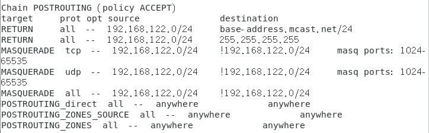
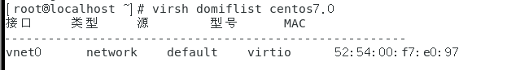
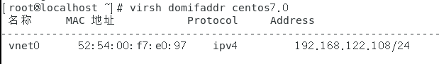
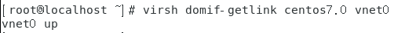
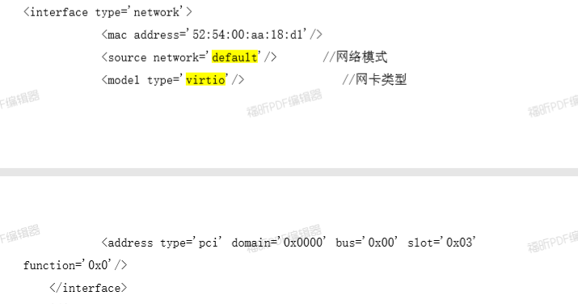
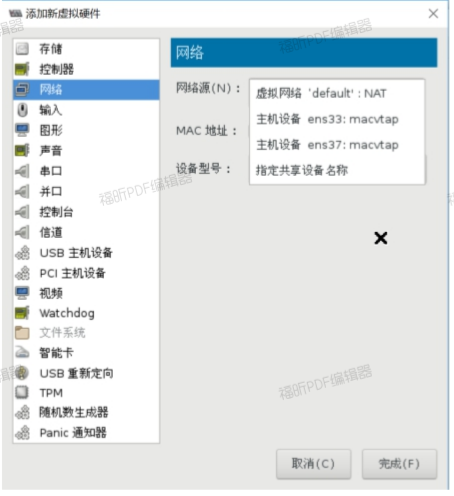
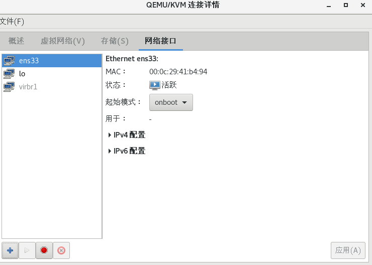
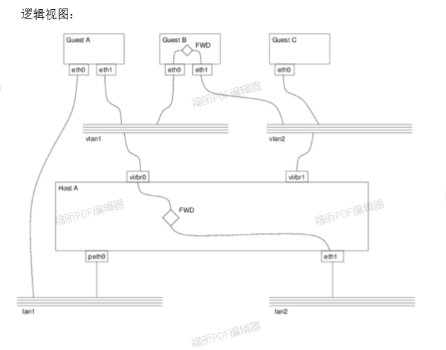

# 管理虚拟网络


## Linux网桥基本概念

- Socket

  套接字（socket）是一个抽象层，应用程序可以通过它发送或接收数据，可对其进行像对文件一样的打开、读写和关闭等操作。套接字允许应用程序将I/O插入到网络中，并与网络中的其他应用程序进行通信。网络套接字是IP地址与端口的组合。 

Bridge（桥）是Linux上用来做TCP/IP二层协议交换的设备，与现实世界中的交换机功能相似。Bridge设备实例可以和 Linux上其他网络设备实例连接，既attach（ [əˈtætʃ] 贴上）一个从设备，类似于在现实世界中的交换机和一个用户终端之间连接一根网线。当有数据到达时，Bridge会根据报文中的MAC信息进行广播、转发、丢弃处理。  

​		Bridge和现实世界中的二层交换机有一个区别：数据被直接发到Bridge上，而不是从一个端口接受。这种情况可以看做Bridge自己有一个MAC可以主动发送报文，或者说Bridge自带了一个隐藏端口和寄主Linux系统自动连接，Linux上的程序可以直接从这个端口向Bridge上的其他端口发数据。所以当一个Bridge拥有一个网络设备时，如bridge0加入了eth0时，实际上bridge0拥有两个有效MAC地址，一个是bridge0的，一个是eth0的，他们之间可以通讯。由此带来一个有意思的事情是，Bridge可以设置IP地址。通常来说IP 地址是三层协议的内容，不应该出现在二层设备Bridge上。但是Linux里Bridge是通用网络设备抽象的一种，只要是网络设备就能够设定IP地址。当一个bridge0拥有IP后，Linux 便可以通过路由表或者IP表规则在三层定位bridge0，此时相当于Linux拥有了另外一个隐藏的虚拟网卡和 Bridge的隐藏端口相连，这个网卡就是名为bridge0的通用网络设备，IP可以看成是这个网卡的。当有符合此IP的数据到达bridge0时，内核协议栈认为收到了一包目标为本机的数据，此时应用程序可以通过Socket接收到它。一个更好的对比例子是现实世界中的带路由的交换机设备，它也拥有一个隐藏的MAC地址，供设备中的三层协议处理程序和管理程序使用。设备里的三层协议处理程序，对应名为bridge0的通用网络设备的三层协议处理程序，即寄主 Linux系统内核协议栈程序。设备里的管理程序，对应 bridge0寄主Linux系统里的应用程序。

 		**简单来说，桥接就是把一台机器上的若干个网络接口“连接”起来。其结果是，其中一个网口收到的报文会被复制给其他网口并发送出去。以使得网口之间的报文能够互相转发。** 

​		 如下图：主机A发送的报文被送到交换机S1的eth0口，由于eth0与eth1、eth2桥接在一起，故而报文被复制到eth1和eth2，并且发送出去，然后被主机B和交换机S2接收到。而S2又会将报文转发给主机C、D。 


​		**桥接并不是在物理层实现的，而是在数据链路层。桥接不是单纯的报文转发。** 	

​		Bridge的实现当前有一个限制：当一个设备被attach到Bridge上时，那个设备的IP会变的无效，Linux不再使用那个IP在三层接受数据。举例如下：如果eth0本来的IP是 192.168.1.2，此时如果收到一个目标地址是192.168.1.2的数据，Linux的应用程序能通过Socket操作接受到它。而当eth0被attach到一个bridge0 时，尽管eth0的IP还在，但应用程序是无法接收到上述数据的。此时应该把 IP 192.168.1.2 赋予bridge0。


**相关模型**

​		linux内核支持网口的桥接（目前只支持以太网接口）。但是与单纯的交换机不同，交换机只是一个二层设备，对于接收到的报文，要么转发、要么丢弃。小型的交换机里面只需要一块交换芯片即可，并不需要CPU。而运行着linux内核的机器本身就是一台主机，有可能就是网络报文的目的地。其收到的报文除了转发和丢弃，还可能被送到网络协议栈的上层（网络层），从而被自己消化。
​		linux内核是通过一个虚拟的网桥设备来实现桥接的。这个虚拟设备可以绑定若干个以太网接口设备，从而将它们桥接起来。如下图（摘自ULNI）： 


​		网桥设备br0绑定了eth0和eth1。对于网络协议栈的上层来说，只看得到br0，因为桥接是在数据链路层实现的，上层不需要关心桥接的细节。于是协议栈上层需要发送的报文被送到br0，网桥设备的处理代码再来判断报文该被转发到eth0或是eth1，或者两者皆是；反过来，从eth0或从eth1接收到的报文被提交给网桥的处理代码，在这里会判断报文该转发、丢弃、或提交到协议栈上层。
​		而有时候eth0、eth1也可能会作为报文的源地址或目的地址，直接参与报文的发送与接收（从而绕过网桥）。 


## 网桥的配置

Redhat/CentOS配置网桥的常用方法（推荐 命令行）

- nmtui： NetworkManager的文本用户接口 
- nmcli： NetworkManager的命令行工具 
-  图形界面管理工具 


### 网桥配置方法

**nmcli**

```shell
# 增加两块网卡
$ nmcli conn show
$ nmcli conn delete '有线连接 1'
$ nmcli conn delete '有线连接 2'
# 增加连接配置
# $ nmcli conn add con-name ens37 ifname ens37 type ethernet ipv4.method auto

# 添加网桥
$ nmcli connection add con-name br2 type bridge ifname br2

# 桥接物理网卡
$ nmcli conn add type bridge-slave con-name br2-ens37 ifname ens37 master br2
$ nmcli conn up br2-ens37

# 查看桥接信息
$ brctl show

# 指定网桥ip地址
$ nmcli conn modify br2 ipv4.method manual ipv4.addresses 10.1.1.10/24
$ nmcli conn up br2
```


**brctl  (需要安装bridge-utils包)**

1. 添加网桥

```bash
# 建立一个逻辑网段，名称为br0
brctl addbr br0 
   
# 让ens33成为br0的一个端口 
brctl addif br0 ens33
```

2. brctl命令对网桥的配置需要以文件形式保存下来，这样系统再次启动后所有配置仍能生效。	

```bash
[root@localhost ~]# cat /etc/sysconfig/network-scripts/ifcfg-ens33 
TYPE="Ethernet"
PROXY_METHOD="none"
BROWSER_ONLY="no"
BOOTPROTO="static" #不需要ip
DEFROUTE="yes"
IPV4_FAILURE_FATAL="no"
IPV6INIT="yes"
IPV6_AUTOCONF="yes"
IPV6_DEFROUTE="yes"
IPV6_FAILURE_FATAL="no"
IPV6_ADDR_GEN_MODE="stable-privacy"
NAME="ens33"
UUID="b6666e18-1f7d-43ed-9287-d7996b945cef"
DEVICE="ens33"
ONBOOT="yes"
BRIDGE=br0 #设置网桥

#网桥配置文件
[root@localhost ~]# cat /etc/sysconfig/network-scripts/ifcfg-br0 
DEVICE=br5
TYPE=Bridge
BOOTPROTO=static
NAME=br5
ONBOOT=yes
IPADDR=192.168.119.140
NETMASK=255.255.255.0
GATEWAY=192.168.119.2


```


**图形界面管理工具**


###  qemu-kvm支持的网络 

- 基于NAT（NetworkAddressTranslation）的虚拟网络
- 基于网桥（Bridge）的虚拟网络
- 用户自定义的隔离的虚拟网络
- 直接分配网络设备（包括VT-d和SR-IOV）

虚拟机的网卡：

- RTL8139、e1000、.....

- virtio

  

```bash
[root@localhost ~]# /usr/libexec/qemu-kvm --net nic,model=?
qemu: Supported NIC models: ne2k_pci,i82551,i82557b,i82559er,rtl8139,e1000,pcnet,virtio

```

查看qemu网络配置文件

```bash
[root@localhost ~]# cat /etc/libvirt/qemu/networks/default.xml
<!--
WARNING: THIS IS AN AUTO-GENERATED FILE. CHANGES TO IT ARE LIKELY TO BE
OVERWRITTEN AND LOST. Changes to this xml configuration should be made using:
  virsh net-edit default
or other application using the libvirt API.
-->

<network>
  <name>default</name>
  <uuid>0578ac9e-4c39-4579-9872-d398c96c3ae1</uuid>
  <forward mode='nat'/>
  <bridge name='virbr0' stp='on' delay='0'/>
  <mac address='52:54:00:f7:2c:97'/>
  <ip address='192.168.122.1' netmask='255.255.255.0'>
    <dhcp>
      <range start='192.168.122.2' end='192.168.122.254'/>
    </dhcp>
  </ip>
</network>

```

 virsh命令查看

```bash
[root@storage01 ~]# virsh net-list
[root@storage01 ~]# virsh net-info default
[root@storage01 ~]# virsh net-dumpxml default
```


## 虚拟网络类型


### KVM安装时默认的网络配置


- 默认宿主机会有一个虚拟网卡virbr0,其实是一个虚拟交换机

```bash
$ ip a show dev virbr0
6: virbr0: <NO-CARRIER,BROADCAST,MULTICAST,UP> mtu 1500 qdisc noqueue state DOWN group default qlen 1000
    link/ether 52:54:00:d9:53:5e brd ff:ff:ff:ff:ff:ff
    inet 192.168.122.1/24 brd 192.168.122.255 scope global virbr0
       valid_lft forever preferred_lft forever
```

- 会绑定一个网卡virbr0-nic

  

- 这时候主机就变成了一个路由器，可以看到路由功能已经打开

  ```shell
  $ cat /proc/sys/net/ipv4/ip_forward
  1
  
  ```

- 查看iptables的nat表，可以看到做了NAT

  ```bash
  # -t 表名
  # -n 以数字形式显示规则。如果没有-n，规则中可能会出现anywhere，有了-n，它会变成0.0.0.0/0
  # -A 在指定链的末尾添加（append）一条新的规则
  # -D 删除（delete）指定链中的某一条规则，可以按规则序号和内容删除
  # -I 在指定链中插入（insert）一条新的规则，默认在第一行添加
  # -R 修改、替换（replace）指定链中的某一条规则，可以按规则序号和内容替换
  # -L 列出（list）指定链中所有的规则进行查看
  # -E 重命名用户定义的链，不改变链本身
  # -F 清空（flush）
  # -N 新建（new-chain）一条用户自己定义的规则链
  # -X 删除指定表中用户自定义的规则链（delete-chain）
  # -P 设置指定链的默认策略（policy）
  # -Z 将所有表的所有链的字节和数据包计数器清零
  # -v 查看规则表详细信息（verbose）的信息
  # -V 查看版本(version)
  # -h 获取帮助（help)
  $ iptables -t nat -L
  ```

  

  - 如果nat表出不来，将ens33修改成dhcp即可

    

- 可以看到从virbr0接口进来的DNS报文和DHCP报文是允许的

  

- 当有虚拟机启动，如果采用的是默认NAT模式，那么virbr0交换机下就会增加接口，可以看到有2个虚拟接口，代表有2个虚拟机接到了这个交换机上

  

  

- 可以通过virsh命令查看虚拟机的网卡情况

  

- 相似的命令还有

  

  	

- 向虚拟机添加虚拟机网络

  - 可以通过xml文档添加

    

  - 通过virt-manager图形添加

    


### 基于网桥的虚拟网络

**增加桥接连接模式**


- 首先需要创建虚拟交换机，方式很多，可以根据前面讲的知识创建，也可以使用virt-manager来创建

- 添加网络接口，选择“桥接”

  

- 勾选要桥接的物理网卡“ens37”,不需要勾选“现在激活”

  

- 可以看到生成虚拟交换机virbr1

  

- 可以看到自动生成了配置文件

  ```bash
  [root@localhost ~]# cat /etc/sysconfig/network-scripts/ifcfg-virbr1 
  DEVICE="virbr1"
  ONBOOT="no"
  TYPE="Bridge"
  BOOTPROTO="dhcp"
  STP="on"
  DELAY="0.0"
  
  ```

- 重新启动网络，让虚拟交换机virbr1激活

- 可以配置虚拟机vm003桥接到virbr1虚拟交换机上

  

### 用户自定义的隔离的虚拟网络

 这是官方的一个网络图：http://libvirt.org/archnetwork.html




**创建隔离网络**

通过virt-manager来创建

- 打开“虚拟网络”,点击增加，创建新的虚拟网络

  

  

  

- 选择“隔离的虚拟网络”，点击“完成”

  

- 登陆主机，可以看到创建的虚拟接口：

  

```bash
# 可以在/etc/libvirt/qemu/networks目录下看到创建的虚拟网络network1的配置文件
[root@localhost ~]# ls /etc/libvirt/qemu/networks/
autostart  default.xml  network1.xml
[root@localhost ~]# cat /etc/libvirt/qemu/networks/network1.xml 
<!--
WARNING: THIS IS AN AUTO-GENERATED FILE. CHANGES TO IT ARE LIKELY TO BE
OVERWRITTEN AND LOST. Changes to this xml configuration should be made using:
  virsh net-edit network1
or other application using the libvirt API.
-->

<network>
  <name>network1</name>
  <uuid>d8c82f5a-390a-46ef-a30d-ef46c3eb6344</uuid>
  <bridge name='virbr2' stp='on' delay='0'/>
  <mac address='52:54:00:b5:a5:e5'/>
  <domain name='network1'/>
  <ip address='192.168.200.1' netmask='255.255.255.0'>
    <dhcp>
      <range start='192.168.200.128' end='192.168.200.254'/>
    </dhcp>
  </ip>
</network>

```

- 可以看到创建的虚拟交换机virbr2

  

- 将虚拟机的网卡连接到virbr2上来

  

- 重启虚拟机网络，可以获取到新的地址，是虚拟网络分配的IP地址。

