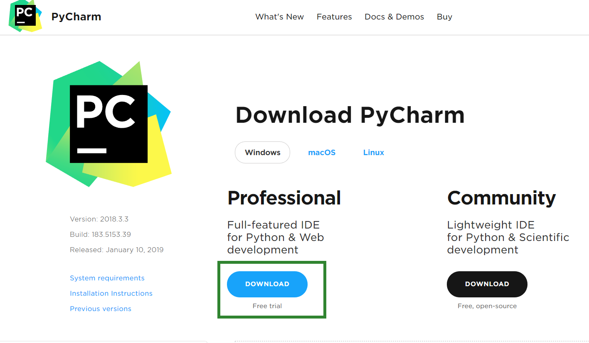
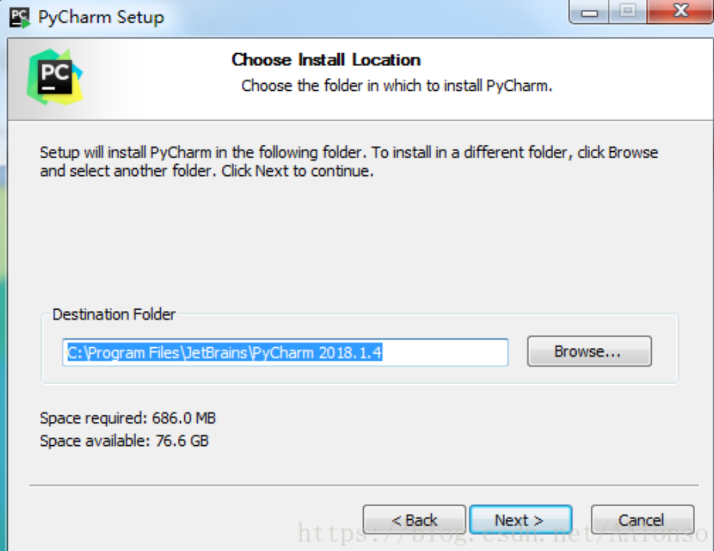
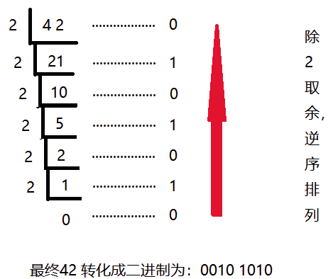
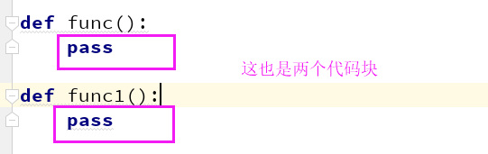
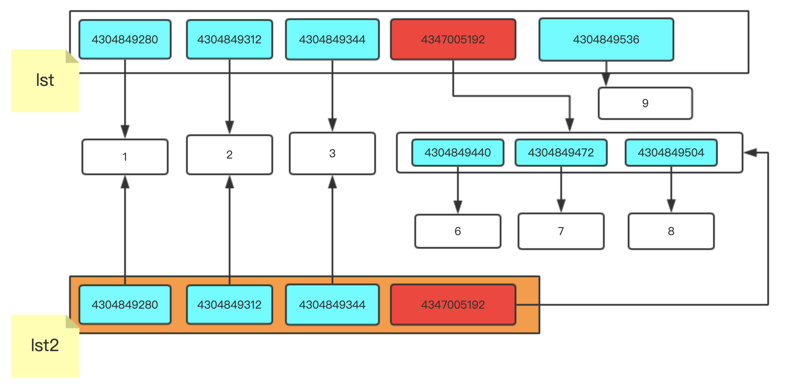
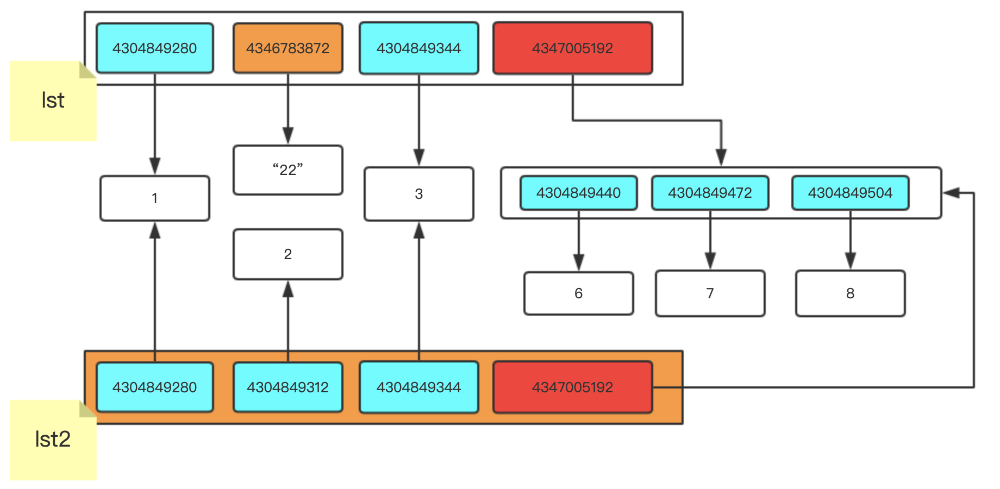

# 第一章 Python基础

#### 本章具体小节如下:

1. **第一节:Python快速入门**
2. **第二节:Python必备知识**
3. **第三节:Python字符串详解**
4. **第四节:Python列表详解**
5. **第五节:Python字典详解**
6. **第六节:Python节省空间**
7. **第七节:Python数据补充**
8. **第八节:Python文件操作**

​        本章主要是为大家讲解Python基础部分,希望大家通过本章的学习,对Python基础有个深入的了解.我们先来了解一下Python相关的介绍和安装

**Python的简介**

python的创始人为吉多·范罗苏姆（Guido van Rossum）。1989年的圣诞节期间，吉多·范罗苏姆（中文名字：龟叔）为了在阿姆斯特丹打发时间，决心开发一个新的脚本解释程序，作为ABC语言的一种继承。  

（龟叔：2005年加入谷歌至2012年，2013年加入Dropbox直到现在，依然掌握着Python发展的核心方向，被称为仁慈的独裁者）。


+ **Python的今世**

  2019年6月的TIOBE //ti:oubi://排行榜，Python占据第三的位置， Python崇尚优美、清晰、简单，是一个优秀并广泛使用的语言。


​		据当前来看Python在TIORB排行榜中,位居第三Python崇尚优美、清晰、简单，是一个优秀并广泛使用的语言.Python整体呈上升趋势，反映出Python应用越来越广泛并且也逐渐得到业内的认可！

- **Python的主要应用领域:**

  - 云计算: 云计算最火的语言， 典型应用OpenStack

  - WEB开发: 众多优秀的WEB框架，众多大型网站均为Python开发，Youtube, Dropbox, 豆瓣...典型WEB框架有Django

  - 科学运算、人工智能: 典型库NumPy, SciPy, Matplotlib, Enthought librarys,pandas

  - 系统运维: 运维人员必备语言

  - 爬虫:通过代码来模拟人进行页面访问,对信息进行批量的获取

  - 金融：量化交易，金融分析，在金融工程领域，Python不但在用，且用的最多，而且重要性逐年提高。原因：作为动态语言的Python，语言结构清晰简单，库丰富，成熟稳定，科学计算和统计分析都很牛逼，生产效率远远高于c,c++,java,尤其擅长策略回测

  - 图形GUI: PyQT, WxPython,TkInter

  

- **Python在哪些公司被使用:**

  - 谷歌：Google App Engine 、code.google.com 、Google earth 、谷歌爬虫、

  - Google广告等项目都在大量使用Python开发

  - CIA: 美国中情局网站就是用Python开发的

  - NASA: 美国航天局(NASA)大量使用Python进行数据分析和运算

  - YouTube:世界上最大的视频网站YouTube就是用Python开发的

  - Dropbox:美国最大的在线云存储网站，全部用Python实现，每天网站处理10亿个文件的上传和下载

  - Instagram:美国最大的图片分享社交网站，每天超过3千万张照片被分享，全部用python开发

  - Facebook:大量的基础库均通过Python实现的

  - Redhat: 世界上最流行的Linux发行版本中的yum包管理工具就是用python开发的

  - 豆瓣: 公司几乎所有的业务均是通过Python开发的

  - 知乎: 国内最大的问答社区，通过Python开发(国外Quora)

  - 春雨医生：国内知名的在线医疗网站是用Python开发的

  - 除上面之外，还有搜狐、金山、腾讯、盛大、网易、百度、阿里、淘宝 、土豆、新浪、果壳等公司都在使用Python完成各种各样的任务。

    

+ **Python的历史**

  1989年，为了打发圣诞节假期，Guido开始写Python语言的编译器。Python这个名字，来自Guido所挚爱的电视剧Monty Python’s Flying Circus。他希望这个新的叫做Python的语言，能符合他的理想：创造一种C和shell之间，功能全面，易学易用，可拓展的语言。

  1991年，第一个Python编译器诞生。它是用C语言实现的，并能够调用C语言的库文件。从一出生，Python已经具有了：类，函数，异常处理，包含表和词典在内的核心数据类型，以及模块为基础的拓展系统。

  + Granddaddy of Python web frameworks, Zope 1 was released in 1999
  + Python 1.0 - January 1994 增加了 [lambda](https://en.wikipedia.org/wiki/Lambda_calculus), [map](https://en.wikipedia.org/wiki/Map_(higher-order_function)), [filter](https://en.wikipedia.org/wiki/Filter_(higher-order_function)) and [reduce](https://en.wikipedia.org/wiki/Fold_(higher-order_function)).
  + Python 2.0 - October 16, 2000，加入了内存回收机制，构成了现在Python语言框架的基础
  + Python 2.4 - November 30, 2004, 同年目前最流行的WEB框架Django 诞生
  + Python 2.5 - September 19, 2006
  + Python 2.6 - October 1, 2008
  + Python 2.7 - July 3, 2010
  + In November 2014, it was announced that Python 2.7 would be supported until 2020, and reaffirmed that there would be no 2.8 release as users were expected to move to Python 3.4+ as soon as possible
  + Python 3.0 - December 3, 2008
  + Python 3.1 - June 27, 2009
  + Python 3.2 - February 20, 2011
  + Python 3.3 - September 29, 2012
  + Python 3.4 - March 16, 2014
  + Python 3.5 - September 13, 2015
  + Python 3.6 - December 16,2016

  

+ **Python是什么编程语言**

  编程语言主要从以下几个角度为进行分类，编译型和解释型、静态语言和动态语言、强类型定义语言和弱类型定义语言，我们主要通过编译型和解释性来划分Python是什么编程语言

  + **编译型与解释型**

    ​	编译器是把源程序的每一条语句都编译成机器语言,并保存成二进制文件,这样运行时计算机可以直接以机器语言来运行此程序,速度很快; 而**解释器**则是只在执行程序时,才一条一条的解释成机器语言给计算机来执行,所以运行速度是不如编译后的程序运行的快的. 

    为什么会有编译型与解释型语言是因为计算机不能直接认识并执行我们写的语句,它只能认识机器语言(是二进制的形式)	

    

    + 编译型

      优点：编译器一般会有预编译的过程对代码进行优化。因为编译只做一次，运行时不需要编译，所以编译型语言的程序执行效率高。可以脱离语言环境独立运行。

      缺点：编译之后如果需要修改就需要整个模块重新编译。编译的时候根据对应的运行环境生成机器码，不同的操作系统之间移植就会有问题，需要根据运行的操作系统环境编译不同的可执行文件。

    + 解释型

      优点: 有良好的平台兼容性，在任何环境中都可以运行，前提是安装了解释器（虚拟机）。灵活，修改代码的时候直接修改就可以，可以快速部署，不用停机维护。

      缺点: 每次运行的时候都要解释一遍，性能上不如编译型语言。

  + **动态语言和静态语言**

    + 动态类型语言

      ​	是指在运行期间才去做数据类型检查的语言，也就是说，在用动态类型的语言编程时，永远也不用给任何变量指定数据类型，该语言会在你第一次赋值给变量时，在内部将数据类型记录下来。Python和Ruby就是一种典型的动态类型语言，其他的各种脚本语言如VBScript也多少属于动态类型语言。

    + 静态类型语言

      ​	静态类型语言与动态类型语言刚好相反，它的数据类型是在编译期间检查的，也就是说在写程序时要声明所有变量的数据类型，C/C++是静态类型语言的典型代表，其他的静态类型语言还有C#、JAVA等。

  + **强类型定义语言和弱类型定义语言**

    + 强类型定义语言：

      ​	强制数据类型定义的语言。也就是说，一旦一个变量被指定了某个数据类型，如果不经过强制转换，那么它就永远是这个数据类型了。

      ​	举个例子：如果你定义了一个整型变量a,那么程序根本不可能将a当作字符串类型处理。强类型定义语言是类型安全的语言。

    + 弱类型定义语言：

      ​	数据类型可以被忽略的语言。它与强类型定义语言相反, 一个变量可以赋不同数据类型的值。
    
    + 强类型定义语言在速度上可能略逊色于弱类型定义语言，但是强类型定义语言带来的严谨性能够有效的避  免许多错误。另外,“这门语言是不是动态语言”与“这门语言是否类型安全”之间是完全没有联系的！

    例如：Python是动态语言，是弱类型定义语言（类型安全的语言）; VBScript是动态语言，是弱类型定义语言（类型不安全的语言）; JAVA是静态语言，是强类型定义语言（类型安全的语言）。

    通过上面这些介绍，我们可以得出：

    ​	**Python是一门动态解释型的弱类型定义语言。**
    
    

+ **Python的种类**

  + **Cpython**

    Python的官方版本，使用C语言实现，使用最为广泛，CPython实现会将源文件（py文件）转换成字节码文件（pyc文件），然后运行在Python虚拟机上。

    

  + **Jyhton //[ˈdʒθən]//**

    Python的Java实现，Jython会将Python代码动态编译成Java字节码，然后在JVM上运行。

    

  + **IronPython[ˈaɪərn] **

      Python的C#实现，IronPython将Python代码编译成C#字节码，然后在CLR上运行。（与Jython类似）

        

  + **PyPy //,pai'pai//（特殊）**

    Python实现的Python，将Python的字节码再编译成机器码。

    机器码是电脑CPU直接读取运行的机器指令，运行速度最快，但是非常晦涩难懂，也比较难编写，一般从业人员接触不到。
  
    字节码是一种中间状态（中间码）的二进制代码（文件）。需要直译器转译后才能成为机器码。
    
    
  
  看了这么多内容,感觉好厉害已近迫不及待的想要动手去试试了,我不得不说,还是需要在稍等一下.我们需要安装一下Python解释器。


+ **Python环境安装**

  + 打开官网：http://www.python.org 点击`Downloads`下载,如下图

    

  + 下拉页面，选择对应版本：Python3.6.3，如下图	

    向下查找,找到对应python版本，如：Python 3.6.3

  + 根据系统选择对应的安装包,如下图

    

     根据当前系统的选择对用的,红色的是windows32位,绿色的是windows64位

  + 下载完成，如下图

    

    下载完成后找到下载的目录,然后用鼠标左键双击

  + 安装

    

  + 执行下一步

    

  + 勾选安装

  + 安装进度

    

  + 安装成功

  + 验证是否配置成功

    打开电脑的终端(黑窗口),输入 python回车进去python解释器,返回的结果入下图:

    

  + 退出终端中的Python

    在终端中 >>> 输入exit() 如下图:

    


## 第一节: Python快速入门

#### 本节具体内容如下：

1. **输出**
   - Windows系统终端打印第一个程序
   - Mac系统终端打印第一个程序
2. **变量**
   
   - 变量的定义规则
   - 变量名的使用
   - 变量名的小高级
3. **常量**
  
   - 常量的介绍及应用场景
4. **注释**
   - 注释的分类
   - 注释的使用
5. **基础类型初识**
  
   - 整型 — int
   - 字符串 — str
   - 布尔值 — bool
6. **用户交互**
   - input使用
   - Py2和P3中input的区别
7. **流程控制**
   - 单独if
   
   - 二选一 if else
   
   - 多选一或零 if elif elif elif
   
   - 多选一 if elif elif else
   
   - 多选多 if if if 
   
   - if 嵌套
   
     

#### **1. 输出**

- Windows系统使用**Notepad++**创建一个文本,文本中的内容如下:

  ```python
  print("hello world")
  ```
  
  写完后一定要记得保存,保存完后我们打开我们的终端,Windows系统的找到图下的两个键:

  ​	
  
  然后会弹出运行的窗口,我们在运行的窗口中输入cmd.
  
  

- Mac系统的电脑首先打开 启动台 — 其他 — 终端 — 输入 vim 文件名字 然后按键盘i 进行输入然后退出的时候按一下esc键 发现文件的左下角有个**:** 然后在这个位置输入wq! 回车就行了,具体的请看图下实例

	

	我们现在都打开了终端后再终端中输入以下命令:

  ```python
python 文件名.py
  ```

  注意点:python和文件名是有空格的,再次确定一下大家的现在是不是都是这个样子的:

  

  print() 括号里面的内容就是要输出的内容,如果是文字和字母需要用英文的引号引起来,数字直接写就可以啦

  ```PYTHON
python2写法:      
       print  'hello world' 或者  print('hello world')

  python3写法:    
       print('hello world')
  我们学习的python3版本,python2版本是什么样也要知道
  ```

  我们现在成功的将英文的打印出来了,现在我们使用这种方式打印一下中文的内容吧!

  ```python
  print("你好 世界")
  ```

  然后将文件保存了,保存后我们在来终端上运行一次.是不是都出现报错了,出现报错这个是正常的,我们只需要在加上一句话就可以了.

  ```python
  #conding:utf-8
  ```

  这句话必须要加在文件的第一行,这个是告诉解释器当文件中出现中文的时候使用utf-8的编码进行查看。
  
  

#### **2. 变量**

+ 引子：

  比如我想让你计算一下下面算式的结果：

  1 + 2 + 3 + 4 + 5

  你直接打印就可以了：

  ```
  print(1 + 2 + 3 + 4 + 5)
  ```

  但是我想让上面的结果 乘以 3怎么做？有人说很简单：

  ```
  print(1 + 2 + 3 + 4 + 5)
  print((1 + 2 + 3 + 4 + 5)*3)
  ```

  然后我想让你得到的这个中间结果在加上100:

  ```
  print(1 + 2 + 3 + 4 + 5)
  print((1 + 2 + 3 + 4 + 5)*3)
  print(((1 + 2 + 3 + 4 + 5)*3)+100)
  ```

  我还想让你的这个中间结果除以4：

  ```
  print(1 + 2 + 3 + 4 + 5)
  print((1 + 2 + 3 + 4 + 5)*3)
  print(((1 + 2 + 3 + 4 + 5)*3)+100)
  print((((1 + 2 + 3 + 4 + 5)*3)+100)/4)
  ```

  这样写麻烦么？ 当然非常麻烦，如何改进呢？我们初中的时候就学过未知数这个概念了，此时我们可否引入呢？

  比如：

  ```
  x = 1 + 2 + 3 + 4 + 5
  y = x * 3
  z = y + 100
  v = z / 4
  ```

  如果你这样完成的话是不是非常清晰明了，上面例子中的x,y,z,v在python中就称为变量。

+ 什么是变量?

  **变量**： 就是用一些简单的英文字母代指程序运行的复杂的中间结果,以便后续代码使用

+ 这个知识点用在哪呢?
  变量在我们后期中经常会被使用

+ 变量如何使用?

```
name = "meet"  
```

​		这样就是在定义一个变量,我们具体说一下定义变量

```python
name 是一个变量名
=    是一个赋值操作  赋值就是将值交给name
'Meet'  是一个值
```

​	变量的作用:**昵称,就是代指内存中某个地址中的内容**

​			 

​	我们定义变量的时候,可以任意起名字吗? 应该是有规则的吧,我们来看看变量定义的规则

- **变量的定义规则**

   - 变量名由字母,数字,下划线组成

   - 变量名禁止使用数字开头

   - 禁止使用Python中的关键字以及内置函数的名字

    关键字如下:

    ```
    ['False', 'None', 'True', 'and', 'as', 'assert', 'break', 'class', 'continue', 'def', 'del', 'elif', 'else', 'except', 'finally', 'for', 'from', 'global', 'if', 'import', 'in', 'is', 'lambda', 'nonlocal', 'not', 'or', 'pass', 'raise', 'return', 'try', 'while', 'with', 'yield']
    ```

  - 不建议使用中文和拼音
  - 变量名要具有意义
  - 变量名区分大小写
  - 推荐写法:

    - 驼峰体: AgeOfBoy = 56
    - 下划线:age_of_boy = 56
  
    这是两种写法,你们觉得那种的比较清晰.是不是第二种看着比较清晰,第一种猛的一看还以为是AngelaBaby呢

-	**变量的赋值**

    在python 中我们把变量一般都比喻成便利贴，这些标签在内存中是唯一性的。
    
    ```python
    lux = '鲁迅本人'
name = '太白金星'
    ```

    此时的lux变量指向就是'鲁迅本人'，而name变量指向的就是'太白金星'

    

    ```python
    name1 = '太白金星'
    name2 = name1
    name3 = name2
    print(name1,name2,name3)
    ```
    
    
        
    
- **变量的小高级**

    ```python
    age1 = 18
    age2 = age1
    age1 = 12
    age3 = age2
    print(age1,age2,age3)
    ```
    
    我们先来分析一下这个结果是怎样的,在运行看结果是否和你想的一样
    
    如果结果和你想的不一致,你需要注意了.咱们代码的运行是从上至下的执行,并且在内存中只能用一个名字相同的便利贴.
    
    
    
    ```python
    age = 12
    age = 12 + 1
    age1 = age + 1
    print("我今年:",age1)
    name1 = 'barry'
    name2 = name1
    name1 = 'wusir'
    name3 = name2
    打印name1,name2name3分别对应的值是什么
    ```
    
    通过上边的小高级和练习我们可以得出一个宗旨,代码是从上向下执行,并且便签只能有一份,相当于一个变量名只能代指一个值


​    

#### 3. 常量

​	常量就是在python代码中不能被改变的变量，在其他语言中比如C语言中，如果一个变量设置成常量，那么这个常量肯定就不能改变，只要改变就会报错。但是python中虽然没有这样的规定，但是为了与其他语言保持一致，将全部大写的变量称为常量，目的就是让开发者看到之后告之其不要轻易改变。常量往往是以大写的形式放在文件的最上面，比如：

像一般的身份证号，生日，以及文件的路径等等都要设置成常量。

```
BITRH_OF_CHINA = 1949
FILE_PATH = 'd:/test1.py'
```


#### 4. 注释

​	在你写代码时，有些代码写的比较经典，或者过于复杂，你一眼看不出来，怎么办，比如在文言文中，有些出处或者偏难怪的文字，你是不是不理解？那么怎么办呢？是不是就得有简单说明。

注释就是做这个的,我们来看一下怎么用

​	单行注释： #

​	多行注释：''' ''' 或者 """ """

```python
# 这个就是给这一行进行注释,注释后的代码不会执行
'''
这种的是多行注释, 什么是多行注释啊,其实很简单就是咱们注释的内容可以
进行换行
'''
```

  看个示例:

```python
# print('hello') 这样就是对这个代码进行注释,并且这个代码不会执行
```
```python
'''
print(1)
print(2)
这种就是多行注释,这样的注释也不会执行
'''
```


#### 5. 基础数据类型

+ 数据类型知识

  什么是数据类型？

  ​	我们人类可以很容易的分清数字与字符的区别，但是计算机并不能呀，计算机虽然很强大，但从某种角度上看又很傻，除非你明确的告诉它，1是数字，“汉”是文字，否则它是分不清1和‘汉’的区别的，因此，在每个编程语言里都会有一个叫数据类型的东西，其实就是对常用的各种数据进行了明确的划分，你想让计算机进行数值运算，你就传数字给它，你想让他处理文字，就传字符串类型给他。Python中常用的数据类型有多种，今天我们暂只讲3种， 数字、字符串、布尔类型

  int是整型;也就是我们从小就接触的数学中的整数,整型在计算机中运于计算和比较

  在32位机器上int的范围是:   -2\*\*31～2**31-1，即-2147483648～2147483647

  在64位机器上int的范围是: -2\*\*63～2**63-1，即-9223372036854775808～9223372036854775807

  目前这些数字已经够你用了吧. 注意这些是整数.

+ 整型

  ```python
  num1 = 2
  num2 = 3
  print(num1 + num2)
  # 结果: 5   
  # 整型就和我们学的数学一样可以进行加减乘除
  ```

+ 字符串
  str是字符串也就是我们从小就接触的中文,如果我们在程序中直接把中文写入,程序是不能分辨这是个什么鬼东西.所以我们要遵循一种规则让计算机能够识别,这个规则就是只要是用引号引起来就是字符串

  在Python中,凡是用引号引起来的,全是字符 .

  字符  可以用单引号，双引号，或者三引号引起来，没有什么区别，只是一些特殊的格式需要不用的引号 比如：

  ```python
  msg = "My name is barry , I'm 22 years old!" 这个就需要单双引号配合。
  msg =""" 今天我想写首小诗，
  
  来歌颂我的同桌，
  
  你看他那乌黑的短发，
  
  好像一只炸毛鸡。
  
  """
  #想写多个内容还需要使用换行的时候,就需要三引号。
  ```

  数字类型可以做运算,字符串可以吗??

  -	字符串加法

    ```python
    #字符串的拼接
    s1 = 'a' 
    s2 = 'bc'
    print(s1 + s2)
    ```

  - 字符串乘法

    ```PYTHON
    name = '坚强'
    print(name*8)
    ```

+ **布尔值**

  bool是布尔值,布尔值中一共分为俩个状态

  True    就是真

  False   就是假

  例如我们想让计算机帮我们计算一下两个数的比较大小

  ```python
  print(3>7)
  
  结果: False
  
  print(7>3)
  
  结果: True
  
  ```

  我们现在简单的认识了这三个基础数据类型,接下来我们学习一下一个经常接触的功能：用户输入。

  

#### **6. 输入**

咱们在登录一些网页和QQ的时候是不是常常会让咱们输入账户或者密码的情况,

这样的情况在程序中会大量的存在，接下来咱们自己实现一个登录时候要输入的功能

```PYTHON
s = input('请输入你喜欢的东西') 
```

input就是固定格式,他是输入的意思 括号里边的内容是提示是给用户看的提示语句,用户输入的内容让input接收了然后赋值给了字符串s

- **输入用户名**

  ```PYTHON
#!/usr/bin/env python
  #-*- coding:utf-8 -*-
  
  #将用户输入的内容赋值给name变量
python2的写法
  name = raw_input("请输入用户名:")
  print name
  
  python3的写法
name = input("请输入用户名:")
  print(name)
  ```
  
  需要注意的是input程序交互获取到的内容都是字符串,我们看下面的简单示例:

  ```PYTHON
num = input('请输入数字:')
  print(num + 5)
  
  结果:
请输入数字:6
  Traceback (most recent call last):
    File "D:/python_object/test.py", line 350, in <module>
      print(num + 5)
  TypeError: must be str, not int
  ```
  
  报错了,提示我们类型错误,数字和字符串是不能相加的.可是我们输入的明明是数字啊.其实我们看着输入的是
数字,但是input获取到的都是字符串
  
  这个知识点用在哪里?

  在工作中如果需要用户输入一些个人信息比如账号，密码，性别，爱好等，即是你需要将你输入的信息传递给程序当中，那么就需要用到用户交互input。

  **注意**   

  ```python
在Python2 中使用raw_input              获取的都是字符串
  在Python3 中使用input                  获取的都是字符串
  ```

  课上练习：
  
  让学生输入姓名，性别，年龄，最后以这样的形式打印出来。
  
  '我叫：xxx 性别：x  今年：xx岁'
  
  ```python
  name = input('请输入姓名：')
  age = input('请输入年龄：')
  sex = input('请输入性别')
  print('我叫:'+name+'姓名：'age+'年龄'+sex)
  ```


#### **7. 流程控制**

你在生活中是不是经常遇到各种选择，比如玩色子，猜大小，比如选择走那条路回家？Python程序中也会遇到这种情况，这就用到了if语句。

这个功能就是Python中的流程控制语句if。
那么如何使用这个功能呢？（下面就是）

```PYTHON
if 条件: #冒号是将条件与结果分开。
  结果# 四个空格，或者一个tab键，这个是告诉程序满足这个条件的结果。切记空格和tab键不能混合使用
```

- 判断条件 if

```PYTHON
age = input("输入年龄:")
if int(age) >= 18:
    print("成年了,能干成年人的事了")
```

- 二选一 if else

```PYTHON
age = input('请输入您的年龄:')
if int(age) > 18:
    print('你可以去网吧尽情的嗨皮了')
else:
    print('你现在还不行啊!')
```

​	以上这种写法是让用户输入内容,然后进行比较,如果一个条件成立那就执行print,为了明确的区分改执行哪些部分,当条件成立后执行缩进的代码然后程序就退出了.下边的else就不会在执行了

- 多个选项进行单选或不选 if elif 

```PYTHON
num = input('请输入要比较的数字:')
if int(num) >= 22:
    print('可以扯证了')
elif int(num) >= 18:
    print('成年了,可以干一些成年的事了')
elif int(num) < 18:
    print('还是小屁孩')
```

以上写法就是我们做的单选题一样,三个分支判断中只要有个成立,其余都不再执行  

- 多个选项进行单选(必选) if elif else

```python
num = input("请输入要比较的数字:")
if num > 60:
  print("大了")
elif num < 60:
  print("小了")
else:
  print("猜对了")
```

- 嵌套if 

```PYTHON
name = input('请输入名字:')
if name == 'meet':
    age = input('请输入年龄:')
    if int(age) == 18:
        print('输入全部正确')
    else:
        print('年龄输入错误!')
else:
    print('名字输入错误!')
```

这样写法很常用,这样我们就可以明确的知道用户输入的名字和年龄那个是错误的,并且还做一个判断如果名字正确后再进行判断密码


## 第二节: 运算符

#### 本节具体内容如下：

1. **Pytcharm安装及使用**
   
   - Pytcharm安装
   - Pycharm使用
2. **while 循环**
   
   - while循环
   - break
   - continue
   - while else
3. **字符串格式化**
   - %s
   - %d
   - %%
4. **运算符**
   - 算数运算符
   - 比较运算符
   - 赋值运算符
   - 逻辑运算符
   - 成员运算符
5. **编码初识**
   - ascii
   
   - gbk
   
   - unicode
   
   - utf-8
   
   - 单位转换
   
     

#### 1. Pycharm使用

- 下载Pycahrm

  首先要下载Pycharm这个软件，官网的下载地址是: <http://www.jetbrains.com/pycharm/download/#section=windows>

  

  选择左边的点击进行下载,左边的是专业版右边是社区版

  - 下载中

  

  出现这个页面就是正在下载,稍微喝杯茶等等

  - 找到文件

    

  - 安装

    

    选择Next 点击

  - 选择要安装到那个目录

    

  - 选择配置

    

    我是64位机器,我选择了64,如果是32的就选择32 [不管64还是32剩下的都选择]

  - 点击安装

    

  - 安装中

    

  - 安装成功

    

    出现这个界面的直接点击Finish关闭就可以了. 我们现在切换到桌面

  - 使用Pycharm

    

  找到这个图标然后双击

  - 首次使用Pychram

    

  - 用户许可证

    

  - 激活Pycharm

    激活详情<http://idea.lanyus.com/>页面
    

    点击选择的内容生成激活码,然后将激活码复制到code选项中

    

  - 个性化设置

    

    这个直接关闭就可以了

  - 启动成功

    

    如果你的激活码没问题的话，会在个性化，主题设置完毕之后，经过短暂的加载（加载速度取决于电脑性能）进入如图页面，到这一步，PyCharm安装完成了

  - 创建文件

    

  - PyCharm选择解释器

    File -- Settings -- Project -- Project Interpreter,这里会显示当前系统默认的解释器，如果要添加别的解释器，点击工具图标，Add local -- Existing environment,点击三点图标，在打开的本地文件目录中选择解释器文件的.exe文件。就行了，如果你没有选择， PyCharm会自动选择当前环境默认的解释器

  - PyCharm创建py文件

    

    鼠标放到大纲然后右键鼠标,出现一个New然后鼠标向右滑动选择python file点击左键

    

    直接写文件的名字就可以了,写完后回车就搞定了.

#### 2.while循环

​	在生活中，我们遇到过循环的事情吧？比如循环听歌，吃饭睡觉学习等等等等。在程序中，也是存在的，这就是流程控制语句 while

+ 基本循环

```python
while 条件:
    # 循环体
    # 如果条件为真，那么循环则执行
    # 如果条件为假，那么循环不执行
# 每次循环完毕都会判断一次条件，条件为True则进入循环，条件为False则退出循环
```

```python
while True:
	print('运行一下试试！')
```

​		条件如果为真就会一直执行下去  也就人们常说的死循环，我们怎么能够让程序停止运行?

​		刚刚说到,死循环是因为条件一直都为真的时候,如果想让while循环停止最简单的方式就是将条件修改成假的,看下面示例

```python
flage = True
str_num = input("请输入要比较的数字:")
print("进入循环")
while flage:
  if "3" > str_num:
    print("在执行循环")
  else:
    print("要终止循环")
    flage = False
print("退出循环")
```

​		我们现在知道可以通过变量的形式改变while循环,我们还可以通过计数的方式来控制循环执行循环的次数,先来看一下

- 使用while计数

  **计数器思想**

```python
count = 0
while True:
	count = count + 1
	print(count)
```

这样下去我就会执行下去,但是我想到100就停了

- 控制while循环的次数

```python
count = 0
while count < 100:
	count = count + 1
	print(count)
```

​	while 关键后边的是条件,这样就可以通过条件成功的控制住循环的次数,我们现在知道通过修改while后边的内容来终止循环,这是咱们自己想的办法,python这个编程语言中是不是应该也得有个终止循环的关键字什么的吧,我们来找一下试试      

- break关键字

  我们除了可以使用条件能够让循环停止,其实Python还给我们提供了一个break关键字来停止循环

```python
num = 1
while num <6:
    print(num)
    num+=1
    break
    print("end")
```

当程序执行到break的时候就结束了.break就是结束当前这个while循环的 break以下的代码都不执行

- continue关键字

continue [kənˈtɪnjuː] 用于退出当前循环，继续下一次循环

```python
num = 1
while num <6:
    print(num)
    num+=1
    continue
    print("end")
```

​	**注意:break是终止循环,continue是跳出本次循环,继续下次循环**

- while else使用

```python
# 循环一
while True:
    if 3 > 2:
        print('你好')
        break
else:
    print('不好')


# 循环二
while True:
    if 3 > 2:
        print('你好')
print('不好')

# 大家看到的这个是不是感觉效果是一样的啊,其实不然
# 当上边的代码执行到break的时候else缩进后的内容不会执行
```

这个执行的效果是因为

循环一执行了循环也执行了if条件打印了你好然后碰到break循环结束了

循环二执行了循环也执行了if条件打印了你好,但是没有break 就继续重复执行了

循环一将3>2改成3<2这个条件就不成立,然后执行了else里打印了不好	

- while else 练习

  首先让用户输入序号选择格式如下:

  0.退出
  1.开始登录
  如果用户选择序号0 就提示用户退出成功
  如果用户选择序号1就让用户输入用户名密码然后进行判断,正确就终止循环,错误重新输入


#### 3. 格式化输出

现在有个需要我们录入我们身边好友的信息,格式如下:

```python
------------ info of 太白 ----------
             Name  : 太白
             Age   : 22
             job   : Teacher 
             Hobbie: girl
    ------------- end ----------------    
```

我们现在能想到的办法就是用以下方法:

```python
name = input('请输入姓名:')
age = input('请输入年龄:')
job = input('请输入职业:')
hobby = input('请输入爱好:')
a = '------------ info of 太白 ----------'
b = 'Name:'
c = 'Age:'
d = 'Job:'
e = 'Hobby:'
f = '------------- end ----------------'
print(a+
      '\n'+
      b+
      name+
      '\n'+
      c+
      age+
      '\n'+
      d+
      job+
      '\n'+
      e+
      hobby+
      '\n'+
      f)

# 运行结果
------------ info of 太白----------
Name:太白
Age:18
Job:it
Hobby:3
------------- end ----------------
```

​	这样写完全没有问题,但是会不会比较繁琐呢,有些大佬肯定会想这不都实现了吗,还逼叨逼什么啊,那是没有体验过格式化输出有多霸道,我们现在来体验下霸道的姿势

- %s

```python
name = input('请输入姓名:')
age = input('请输入年龄:')
job = input('请输入职业:')
hobby = input('请输入爱好:')
msg = '''
------------ info of barry Li ----------
Name  : %s
Age   : %s 
job   : %s 
Hobbie: %s 
------------- end ----------------
    
'''
print(msg%(name,age,job,hobby))
```

​	我们但从代码的数量来看,这样就比那样的少,看到这里有细心的老铁们肯定在想%s这是啥玩意?

​	% 是一个占位, 回想下我们小时候给朋友占位子的场景,是的这个就是占位.那s又是什么呢?  s代码的字符串类型;

- %d|%i

```python
name = input('>>>')
s1 = '1234%d'%int(name)
s2 = '1234%i'%int(name)
print(s1)
print(s2)

结果:
>>>89
123489
123489
# %d和%i这种格式化只能用数字来填补占位
# Python复制了C的格式
# 对于输出，%i并且%d是完全一样的东西，无论是在Python和在C.
# 区别在于，C使用它们来解析输入时，它们会做什么scanf()。参见printf中格式说明符％i和％d之间的差异。
# Python没有scanf等效项，但是Python字符串格式化操作保留了两个选项以保持与C的兼容性。
```

- %%

```python
num = input('>>>')
s= '目前学习进度:%s%%'%num
print(s)

结果:
>>>80
目前学习进度:80%

# 如果我们字符串中想要显示单独的%就需要用来个%%来转义,不然程序会认为那是一个占位
```


#### 4. 运算符

​	计算机可以进行的运算有很多种，可不只加减乘除这么简单，运算按种类可分为算数运算、比较运算、逻辑运算、赋值运算、成员运算、身份运算、位运算.

​	今天我们暂只学习 算数运算、比较运算、逻辑运算、赋值运算、成员运算

- 算数运算

以下假设变量：a=10，b=20


- 比较运算

以下假设变量：a=10，b=20


- 赋值运算

以下假设变量：a=10，b=20


- 逻辑运算


​	针对逻辑运算的进一步研究：

​	在没有()的情况下not 优先级高于 and，and优先级高于or，即优先级关系:

​	( )>not>and>or，同一优先级从左往右计算。

​	例题：

​	判断下列逻辑语句的True，False。

​	x or y , x为真，值就是x，x为假，值是y；

​	x and y, x为真，值是y,x为假，值是x。

```python
3>4 or 4<3 and 1==1
1 < 2 and 3 < 4 or 1>2 
2 > 1 and 3 < 4 or 4 > 5 and 2 < 1
not 2 > 1 and 3 < 4 or 4 > 5 and 2 > 1 and 9 > 8 or 7 < 6
```


例题：求出下列逻辑语句的值。

```python
8 or 4
0 and 3
0 or 4 and 3 or 7 or 9 and 6
```

- 成员运算

in    not in :

判断子元素是否在原字符串（字典，列表，集合）中：

例如：

```python
#print('喜欢' in 'dkfljadklf喜欢hfjdkas')
#print('a' in 'bcvd')
#print('y' not in 'ofkjdslaf')
```


#### 5. 编码

​	咱们的电脑，存储和发送文件，发送的是什么？电脑里面是不是有成千上万个二极管，亮的代表是1，不亮的代表是0，这样实际上电脑的存储和发送是不是都是010101啊 我们发送的内容都是010101010这样写的内容比较多就不知道是什么了,所以我们想要明确的区分出来发送的内容就需要

在某个地方进行分段.计算机中设定的就是8位一断句

- ASCII

```PYTHON
计算机:

    储存文件,或者是传输文件,实际上是010101010

    计算机创建初期,美国,是7位一段，但是发明者说为了拓展，留出一位，这样就是8位一段句。8位有多少种可能 ？256

    密码本:

    ascii

         00000001

         01000001 01000010 01000011   ABC
```

​	随着计算机的发展. 以及普及率的提高. 流⾏到欧洲和亚洲. 这时ASCII码就不合适了. 比如: 中⽂汉字有几万个. 而ASCII 多也就256个位置. 所以ASCII不行了. 怎么办呢? 这时, 不同的国家就提出了不同的编码用来适用于各自的语言环境. 比如, 中国的GBK, GB2312, BIG5, ISO-8859-1等等. 这时各个国家都可以使用计算机了. 

- GBK

  GBK, 国标码占用2个字节. 对应ASCII码 GBK直接兼容. 因为计算机底层是用英文写的. 你不支持英文肯定不行. 而英文已经使用了ASCII码. 所以GBK要兼容ASCII. 
  这里GBK国标码. 前⾯的ASCII码部分. 由于使⽤两个字节. 所以对于ASCII码⽽言. 前9位都是0

```PYTHON
字母A:0100 0001 # ASCII
字母A:0000 0000 0100 0001 # 国标码
```

​	随着全球化的普及，发展到欧洲，亚洲等国家，发现这些根本不够用，所以创建了万国码。因为全球语言很多,ascii不足以存储这么多对应关系,创建了一个超级密码本:万国码unicode

```PYTHON
8 位 == 1个字节.
hello h一个字符,e一个字符,he就不是一个字符.
中国:中是一个字符,国是一个字符.
```

- Unicode 

        创建之初,16位,2个字节,表示一个字符.
        英文:  a b c  六个字节   一个英文2个字节
        中文   中国   四个字节  一个中文用2个字节
    
    但是这种也不行，这种最多有65535种可能，可是中国文字有9万多，所以改成 32位,4个字节,表示一个字符.
    
        a  01000001 01000010 01000011 00000001
        b  01000001 01000010 01100011 00000001
        中 01001001 01000010 01100011 00000001
        浪费资源.

- UTF-8

对Unicode进行升级:  utf-8
utf-8 用最少用8位数,去表示一个字符.
    英文:                      8位,1个字节表示.
    欧洲文字:              16位,两个字节表示一个字符.
    中文,亚洲文字:      24位,三个字节表示.

utf-16 用最少用16位数。

gbk:
     国标,只能中国人自己用, 一个中文用16位,两个字节表示。

- 单位转化

```PYTHON
8bit = 1byte
1024byte = 1KB
1024KB = 1MB
1024MB = 1GB
1024GB = 1TB
1024TB = 1PB
1024TB = 1EB
1024EB = 1ZB
1024ZB = 1YB
1024YB = 1NB
1024NB = 1DB
常⽤到TB就够了　
```


## 第三节: Python字符串详解

#### 本节具体内容如下:

1. **整型**

   - 整型的计算
   - 整型的转换

2. **布尔值**

   - 数据转换

3. **索引**

   - 索引讲解练习

4. **切片**

   - 切片讲解练习

5. **步长**

   - 步长讲解练习

6. **字符串方法**

   - upper

   - lower

   - startswith

   - endswith

   - count

   - strip

   - split

   - replace

     

#### 1. 整数

整型在Python中的关键字用int来表示; 整型在计算机中是用于计算和比较的

在python3中所有的整数都是int类型. 但在python2中如果数据量比较大. 会使用long类型.

在python3中不存在long类型 整数可以进行的操作:

- 整数的加

```PYTHON
a = 10
b = 20
print(a + b)
结果:
30
```

- 整数的减

```PYTHON
a = 10
b = 20
print(b - a)
结果
10
```

- 整数的乘

```PYTHON
a = 10
b = 20
print(a * b)
结果:
200
```

- 整数的除

```PYTHON
a = 10
b = 20
print(b / a)
结果:
2.0
# 注意点:当我们使用Python3的时候我们除法获取到时浮点数,也就是小数,但是使用Python2的时候使用除法获取的就是整数
```

- 整数的整除

```PYTHON
a = 10
b = 20
print(b // a)
结果:
2
```

- 整数的取余

```PYTHON
a = 5
b = 2
print(a % b)
结果:
1
```

- 整数的次方(幂)

```PYTHON
a = 5
b = 2
print(a ** b)
结果:
25
```

注意点: 在Python2中存在long(长整型) 但是在Python3中long(长整型)不存在

我们常说的数字都是10进制的,数字表示的形式有很多种,我们今天就简单的说一下十进制数和二进制数

他们之间是如何转换,我们先来看看十进制转换二进制,使用一种整除法,例如十进制的数是15我们想要知道15的二进制是多少就除以2获取他的余数然后从下向上将这些余数拼到一起,就是用以下的方法



我们现在知道怎么将十进制的数转换成二进制,那就再来看看怎样将二进制的数转换成十进制.

我们使用110001来举例,现在想要获取到这个二进制的数然后转换成十进制 要进行如下操作

```python
接下来的计算我们就从右向左计算,用最右侧的数乘以2的0次方,依次向左推
1*2**0 + 0*2**1 + 0*2**2 + 0*2**3 + 1*2**4 + 1*2**5    换算下来就是
  1    +    0   +   0    +   0    +   16   +   32 =  49 
```

我们使用这种办法就能将二进制的数转换成十进制的数


#### 2. 布尔值

布尔值(bool) 判断真假

```PYTHON
python语法      人类语言       计算语言
   True           真            1
   False          假            0
```

- 字符串转换数字

```PYTHON
n = int('22')
print(n)
结果:22
#注意点:字符串中的内容必须是阿拉伯数字才能强行转换
```

- 数字转换字符串

```PYTHON
n = str(22)
print(n)
结果:
2   看到的效果是像是数字,实际上就是字符串,我们可以使用type查看类型
```

- 数字转换布尔值

```PYTHON
n = bool(4)  # bool(-1) 结果也是True
print(n)
结果:
True
注意点: 使用bool转换的时候只要是非0的都为True
```

- 布尔值转换数字

```PYTHON
n = int(True) # int(False) 结果是0
print(n)
结果:
1
```

- 字符串转换布尔值

```PYTHON
n = bool(' ')
print(n)
结果:
True   
注意点: 只要字符串中的内容不为空,所得到的结果就是True
```

- 布尔值转换字符串

```PYTHON
n = str(True)
print(n)
结果:
True　这是一个字符串的True
```


#### 3. 字符串

​	字符串, 用于存储一些少量的数据,在Pyhton当中只要是用引号引起来的就是字符串,字符串中的每个单独的字母汉字都是一个元素.

​	在第一天的时候咱们简单的认识了下字符串,今天我们好好的来认识一下这个让你又喜又优的字符串。我们来回忆下字符串是不是可以进行加减乘除

- 字符串加

```PYTHON
a = '世界'
b = '你好'
print(a + b)
结果:
世界你好
```

​	通过刚刚我们的测试发现字符串也是可以进行加法操作的,字符串相加其实有个专业的名词 --- 字符串拼接;相加的规则就是必须都是字符串才能相加

​	字符串中是不能进行减法和除法操作的,通过这句话就能得知字符串是可以进行乘法操作的,我们立马来看一下:

- 字符串乘

```PYTHON
a = '坚强'
print(a * 8)
结果:
坚强坚强坚强坚强坚强坚强坚强坚强

```

字符串的乘法就是将多个字符串拼接到一起,乘法的规则:只能是字符串和数字相乘我们回顾完第一天的字符的内容,那就来看看咱们今天要讲的内容是什么??

- 索引(下标)

大家在上学的时候就会发现在一个班有的同学的名字是一样的,最后大家为了好区分就有了外号,我们每个人都有个学号,其实学校就是为了防止重名找错人,

学号就是一种能够保证唯一且准确的手段,这种手段在计算机中存在,这种手段叫做索引,也有人称之为下标.


图上就是对"meet"字符串进行索引排号,其实图上有一点大家不难看出m对应的是数字0,如果让我们人来给排号.下意识的会从1开始.

因为我们从小的时候就是从1开始数数的,但是在计算机中数数确实要从0开始,其实这个点也是对程序的入门.

以后在碰到这种类似的问题我们就知道是从0开始计数,废话不多说我们来看看,我说的到底行不行.

```PYTHON
name = 'meet'
# 索引  0123
print(name[0])
结果:
m　
```

细心的老铁们会发现这[ ]是干啥的,这个是一个查找,我不知道字符串中第一个是什么,但是我知道第一个的索引,我就可以通过这个方式来查看

比方:我不知道这个学生叫什么,但是我知道他的学号.我也可以通过学号找到这个同学.

图上这个是从左到右的一种排序,其实还有一种从右像左的排序,看下图:


这个查看和上边的一样,只不过是索引排序的方式不一样,他这次的排列序号是从右向左并且还是以-1开始,这里的-1其实就是表示我们的倒数第一个

-2表示倒数第二个,这样排列,如果我们的字符串比较长的时候想要获取最后一个就完全可以使用-1,看以下示例:

```PYTHON
name = 'meet'
# 索引 -4-3-2-1
print(name[-1])
结果:
t
```

告诉大家一个小技巧,刚开始的我们不能明确的区分这个字符串中的每个索引的时候,我们就先把每个字母对应的索引写下来,这样就方便我们查找

上边我们说完了索引,你们就以为完事了是吗?不是滴,咱们还有来个内容没有进行讲解,分别是切片和步长

- 切片

切片又是什么呢?我们先来看一个示例:

```PYTHON
name = 'meet'
# 索引  0123
print(name[0:3])
结果:
mee


```

[第一个位置是开始:第二个位置是终止]中间必须使用分号,这样的写法就是从索引0开始获取到索引3结束　　

​	这个结果是不是和大家想的有点出入啊,大家肯定认为获取到的内容是meet,但是为什么是mee呢,因为终止的索引是不包含的获取的是这个区间的内容想想咱们在买肉的时候,有一个块整肉,这块整肉就后边有点肥,不想要是不是就让老板给切掉了,我们就买前边的部分啊.在生活中这种神操作就是切片我也知道你们刚接过这些东西,使用起来不是很熟悉,尤其是切片这部分,在悄悄的告诉你们个小技巧,下次当看到切片中终止位置的时候把这个数减一就ok啦

- 步长

步长又是什么呢?先看示例:

```PYTHON
name = 'meet'

# 索引  0123

print(name[0:3:1])

结果:

mee


```


发现我在中括号中最后一个位置写了一个东西,也没什么变化,是的没有变化,因为我们不写的时候他默认就是1,我们换个数字在来看看

```PYTHON
name = 'meet'

# 索引  0123

print(name[0:3:2])

结果:

me　


```

这又是啥情况呢?想想我开始告诉大家的中括号里第一个参数是起始位置,第二参数是终止位置,第三个参数现在告诉大家是步长(每次走几步)


​	当步长设置为2的时候,咱们只需要用起始位置0加上步长2,结果也就2然后在把索引为2的找到,2在加上步长2就是4,当要查找索引4是发现终止索引就是3,

​	所以不会进行查找.最终的结果就是me.

- 字符串方法详解
  - 全部大写

    ```PYTHON
    name = 'taibai'
    new_name = name.upper()
    print(new_name)
    # 把这个字符串全部变成大写
    ```
    
  -  全部小写

      ```PYTHON
      name = 'BArry'
      new_name = name.lower()
      print(new_name)
      # 把这个字符串全部变成小写　　
      ```

		- **应用场景:**

      ```PYTHON
      # 字符串大小写做验证码
      y_z_m = 'O98k'
      y_z_m_input = input("请输入验证码(O98k)")
      user = input('请输入账号:')
      pwd = input('请输入密码:')
      if y_z_m == y_z_m_input:
          if user == 'barry' and pwd == '8520':
              print('登陆成功!')
          else:
              print('登录失败')
      else:
          print('验证码错误!')
      ```

  - 判断是否以什么开头　　

    ```PYTHON
    name = 'barry'
    new_name = name.startswith('a')
    if new_name:
        print('是以a开头')
    # 判断这是不是字符串是不是以a开头的

    name = 'barry'
    new_name = name.startswith('e',2,5)
    if new_name:
        print('是以e开头')

    # 我们可以指定从哪个位置开始哪个位置结束

    ```

  - 判断是否以什么结尾　　

    ```PYTHON
    name = 'barry'
    new_name = name.endswith('x')
    if new_name:
        print('是以x结尾')
    # 判断这是不是字符串是不是以x结尾的

    name = 'barry'
    new_name = name.endswith('x',2,5)
    if new_name:
        print('是以x结尾')
    # 判断这是不是字符串是不是以x结尾的

    ```

  - 统计出现的次数

    ```PYTHON
    name = 'barrydasx'
    new_name = name.count('a')
    print(new_name)
    # 统计name这个字符串中a出现的次数　　
    ```

  - 字符串替换　　

    ```PYTHON
    name = 'barrydasx'

    new_name = name.replace('sx','sb',1)

    print(new_name)

    # replace[rɪˈpleɪs]替换字符串中的内容以外 我们可以指定要替换的次数
    ```

  - 去除头尾两边的空格  换行符/制表符　　

    ```PYTHON
    name = ' barrydasx '
    new_name = name.strip() # 默认去除的头尾两端的空格,换行符,制表符 也可以自己指定
    print(new_name)
    # strip[strɪp]去除头尾俩遍的空格和换行符
    # 一般都是用在input后面。
    ```
  
- 分割
  
    ```PYTHON
    #format的三种玩法 格式化输出
    res='{} {} {}'.format('太白',18,'male')
    res='{1} {0} {1}'.format('太白',18,'male')
  res='{name} {age} {sex}'.format(sex='male',name='taibai',age=18)
    
    name = 'barrydasx'
    new_name = name.split("x")  # split [splɪt] 默认以空格,换行符,制表符分隔
    print(new_name)
  # 也可以通过x将字符串name进行切割
    
  name = 'barrydasx'
    new_name = name.split("r",maxsplit=1)  # maxsplit是分离的次数，maxsplit=1分离一次，默认不限制次数。
  print(new_name)
    # 切割后的内容是一个列表
    
  ```
  
  - 字符串格式化
  
  ```PYTHON
    name = 'barrydasx{}'
  new_name = name.format('说的对')
    print(new_name)
    # 字符串格式化
    # 可以按照顺序去填充,也可以按照索引去填充,也可以按照关键字填充
  
  ```
  
- **练习**　　

  ```PYTHON
  将 name 变量对应的值中所有的"l"替换为 "p",并输出结果
  将name变量对应的值中的第一个"l"替换成"p",并输出结果
  将 name 变量对应的值根据所有的"l"进行分割,并输出结果。
  将name变量对应的值根据第一个"l"分割,并输出结果。
  请输出 name 变量对应的值的第2个字符?
  请输出 name 变量对应的值的前3个字符?
  请输出 name 变量对应的值的后2个字符?
  ```
  
- is系列
  
  -  判断是不是十进制的数字,返回的是布尔值

    ```PYTHON
    name = 'barrydasx'
    new_name = name.isdecimal()
    print(new_name)

    # 判断是不是十进制的数字,返回结果是布尔值 decimal  [ˈdesɪml] 
  	```

	- 判断是不是数字和字母以及中文,返回的是布尔值
  
    ```PYTHON
      name = 'barry7dasx'
      new_name = name.isalnum()
      print(new_name)

    # 判断是不是数字和字母以及中文,返回结果是布尔值
    ```
  
  - 判断是不是字母和汉字,返回的是布尔值

    ```PYTHON
    name = 'barrydasx'
    new_name = name.isalpha()
    print(new_name)

      # 判断是不是纯字母和汉字,返回的是布尔值 alpha阿尔法
    ```

- **练习**

```PYTHON
输⼊⼀个字符串，要求判断在这个字符串中⼤写字⺟，⼩写字⺟，数字， 其它字符共出现了多少次，并输出
```


#### 4. 获取长度

​	目前我们写的内容还比较少,如果有一个很长很长的字符串,要是一个一个数是不是很累呢,Python给咱们提供了一个方法就是获取长度的.

​	长度获取示例:

```PYTHON
name = "Meet"
print(len(name))
结果:
4　
```

​	这里需要大家清楚一点的就是,len是一个公共的方法，不是字符串的方法。


​	我们现在能够轻松的获取到到长度,现在我有这么一个字符串 name = "Meet",请使用while循环获取到字符串中每个元素并打印,效果图入下:


- 使用while循环打印单个元素

```PYTHON
name = "Meet"
count = 0
while count < len(name):
    print(name[count])
    count = count + 1
```

以上这个写法是没有问题的,你们来看下边这个会不会简单些


#### 5. for循环

```PYTHON
name = "Meet"
for i in name:
    print(i)
    
for i in "Meet":
    print(i)
```

上边的这个东西叫做for循环, for是关键字    i是一个变量    后边的name是要被循环的内容,他会把这个name指向的字符串里的每个元素打印出来

 for循环可以循环的数据结构:

- 字符串(str)
- 列   表(list)
- 元   组(tuple)
- 字   典(dict)
- 集   合(set)

唯独不能进行循环的就是 整型(int)和布尔值(bool)


## 第四节: Python列表详解

#### 本节具体内容如下:

1. **列表的简介**
2. **列表的索引**
3. **列表的切片**
4. **列表的增删改查**
5. **列表的嵌套**
6. **元组**
7. **range**

#### 1. 列表的简介

**Why:** 我们现在已经学过的数据类型有：数字，布尔值，字符串，大家都知道数字主要用于计算，bool值主要是条件判断，只有字符串可以用于数据的存储，这些数据类型够用么？对于一门语言来说，肯定是不够用的。就说字符串：

​    1，字符串只能存储少量的数据，对于大量的数据用字符串操作不方便也不易存储。

​    2，字符串存储的数据类型太单一，只能是字符串类型。

​    例如：‘1 True alex’ 像这样的字符串，我如果通过切片或者其他方法将1 True alex 取出来，他也只能是字符串，但是我想要得到数字的1，布尔值的True，必须还要转化，是不是很麻烦。

所以python给咱们也提供了一类数据类型，他能承载多种数据类型，这类数据类型被称作容器类数据类型。可以存储大量的数据。列表就属于容器类的数据类型。

**What:**这个数据类型就是list列表。

​    列表是python的基础数据类型之一 ,其他编程语言也有类似的数据类型.比如JS中的数组, java中的数组等等. 它是以[ ]括起来, 每个元素用' , '隔开而且可以存放各种数据类型: 列表是python中的基础数据类型之一，比如：

li = [‘alex’,123,Ture,(1,2,3,’wusir’),[1,2,3,’小明’,],{‘name’:’alex’}]

列表相比于字符串，不仅可以储存不同的数据类型，而且可以储存大量数据，32位python的限制是 536870912 个元素,64位python的限制是 1152921504606846975 个元素。而且列表是有序的，有索引值，可切片，方便取值。

**How**：那么这个列表如何使用呢？咱们从这几方面去深入研究这个列表。

我们定义了一个列表,我们现在来看看内存中是怎样存储的


list我们就可以想象有强迫症的人的一个书包,书包中存放了衣服,电脑,书,钱包,钱包中放的是身份证,公交卡,家门钥匙，并且每次都是按照一定顺序排放的。


#### 2.  列表的索引

列表和字符串一样也拥有索引:

```PYTHON
lst = ['刘德华','周润发','周杰伦','向华强']
print(lst[0])  # 列表中第一个元素
print(lst[1])  # 列表中第二个元素
print(lst[2])  # 列表中第三个元素
```


#### 3. 列表的切片

```PYTHON
lst = ["麻花藤", "王剑林", "马芸", "周鸿医", "向华强"] 
print(lst[0:3])     # ['麻花藤', '王剑林', '马芸'] 
print(lst[:3])      # ['麻花藤', '王剑林', '马芸']
print(lst[1::2])    # ['王剑林', '周鸿医'] 也有步长 
print(lst[2::-1])   # ['马芸', '王剑林', '麻花藤'] 也可以倒着取 
print(lst[-1:-3:-2])    # 倒着带步长
```

**练习**

```PYTHON
li = [1, 3, 2, "a", 4, "b", 5,"c"]
通过对li列表的切片形成新的列表l1,l1 = [1,3,2]
通过对li列表的切片形成新的列表l2,l2 = ["a",4,"b"]
通过对li列表的切片形成新的列表l3,l3 = ["1,2,4,5]
通过对li列表的切片形成新的列表l4,l4 = [3,"a","b"]
通过对li列表的切片形成新的列表l5,l5 = ["c"]
通过对li列表的切片形成新的列表l6,l6 = ["b","a",3]
```

#### 4. 列表的增删改查

- 增 
  - 追加模式

  ```PYTHON
  lst = ["麻花藤", "林俊杰", "周润发", "周芷若"] 
  print(lst) 
  lst.append("wusir") 
  print(lst)
  ```

  - **练习**
  
  输入用户信息,添加到列表中
  
  ```PYTHON
  lst = []
  while True:
      content = input("请输入你要录入的员工信息, 输入Q退出:")
      if content.upper() == 'Q':
          break
  lst.append(content)
  print(lst)
  ```
  
  - 插入模式

  ```PYTHON
  lst = ["麻花藤", "张德忠", "孔德福"]
  lst.insert(1, "刘德华")    # 在1的位置插入刘德华. 原来的元素向后移动一位
  print(lst)
  ```

  - 迭代添加

  ```PYTHON
  # 迭代添加
  lst = ["王志文", "张一山", "苦海无涯"]
  lst.extend(["麻花藤", "麻花不疼"])
  print(lst)
  ```

- 删除

  ```PYTHON
  pop 通过下标删除元素(默认删除最后一个)

  lst = ["麻花藤", "王剑林林", "李李嘉诚", "王富贵"] 
  print(lst)
  lst.pop()

  deleted = lst.pop()
  print('被删除的',deleted)
  print(lst)

  el = lst.pop(2)  # 删除下标位2的元素
  print(el)        # 被删除的元素
  print(lst)
  ```

	- remove　通过元素删除

  ```PYTHON
  lst = ["麻花藤", "王剑林", "李嘉诚", "王富贵"]
  lst.remove('王剑林')
  print(lst)

  结果:
  ['麻花藤', '李嘉诚', '王富贵']

  lst.remove('哈哈')   # 删除不存在的元素
  结果:
  Traceback (most recent call last):
    File "D:/python_object/path2/test.py", line 1115, in <module>
      lst.remove('哈哈')   # 删除不存在的元素
  ValueError: list.remove(x): x not in list
  ```

  - clear  清空

  ```PYTHON
  lst = ["麻花藤", "王剑林", "李嘉诚", "王富贵"]
  lst.clear()
  print(lst)

  结果:
  []
  ```

  - **练习**

  ```PYTHON
  写代码，有如下列表，按照要求实现每一个功能
  li = ["barry", "WuSir", "ritian", "barry", "wenzhou"]
  请删除列表中的元素"ritian",并输出添加后的列表
  请删除列表中的第2个元素，并输出删除的元素和删除元素后的列表
  请删除列表中的第2至4个元素，并输出删除元素后的列表
  ```

- 修改
  
  - 索引切片修改

  ```PYTHON
  # 修改 
  lst = ["太白", "太黑", "五色", "银王", "⽇天"] 
  lst[1] = "太污"   # 把1号元素修改成太污 print(lst) 
  lst[1:4:3] = ["麻花藤", "哇靠"]     # 切片修改也OK. 如果步长不是1, 要注意元素的数 
  print(lst) 
  lst[1:4] = ["我是哪个村的村长王富贵"]  # 如果切片没有步长或者步长是1. 则不用关心个数 
  print(lst)
  ```

- 查询　　

  ```PYTHON
  列表是一个可迭代对象,所以可以进行for循环

  lst = ["麻花藤", "王剑林", "李嘉诚", "王富贵"]

  for i in lst:
      print(i)

  结果:
  麻花藤
  王剑林
  李嘉诚
  王富贵

  ```

- **练习**

  ```PYTHON
  li = ["barry", "WuSir", "ritian", "barry", "wenzhou"]
  将列表li中第三个元素修改成'taibai'
  将列表li中第四个元素修改成'女神'
  将列表li中前三个元素修改成'barry1,barry2,barry3'

  ```


#### 5. 列表的嵌套

注意:采用降维操作,一层一层的看就好

```PYTHON
lst = [1,'太白','wusir',['麻花疼',['可口可乐'],'王健林']]

# 找到wusir
print(lst[2])

# 找到太白和wusir
print(lst[1:3])

# 找到太白的白字
print(lst[1][1])

# 将wusir拿到,然后首字母大写 在扔回去 capitalize [ˈkæpɪtəlaɪz] 用大写字母书写

s = lst[2]
s = s.capitalize()
lst[2] = s
print(lst)

# 简写
lst[2] = lst[2].capitalize()
print(lst)

# 把太白换成太黑
lst[1] = lst[1].replace('白','黑')

# 把麻花疼换成麻花不疼
lst[3][0] = lst[3][0].replace('疼','不疼')
print(lst)

# 在可口可乐后边添加一个雪碧
lst[3][1].append('雪碧')
print(lst)

```

**练习**

```PYTHON
写代码，有如下列表，按照要求实现每一个功能。
lis = [2, 3, "k", ["qwe", 20, ["k1", ["tt", 3, "1"]], 89], "ab", "adv"]
将列表lis中的"tt"变成大写（用两种方式）。
将列表中的数字3变成字符串"100"（用两种方式）。
将列表中的字符串"1"变成数字101（用两种方式）。

```

**Where**（这个知识点用在什么地方）:

你需要存储大量的数据，且需要这些数据有序的时候。制定一些特殊的数据群体：按顺序，按规则，自定制设计数据


#### 6. 元组

​    **Why**:对于容器型数据类型list，无论谁都可以对其增删改查，那么有一些重要的数据放在list中是不安全的，所以需要一种容器类的数据类型存放重要的数据，创建之初只能查看而不能增删改，这种数据类型就是元组 tuple //ˈtɑːpl//。

​    **What**:这个容器型数据类型就是元组。

元组:俗称不可变的列表,又被成为只读列表,元组也是python的基本数据类型之一,用小括号括起来,里面可以放任何数据类型的数据,查询可以,循环也可以,切片也可以.但就是不能改.

```PYTHON
tu = ('我','怎么','这么','可爱')

tu1 = tu[0]  # 记性下标
print(tu1)

for i in tu:
    print(i)  # 进行for循环

tu2 = tu[0:3]
print(tu2)  # 进行切片
```

关于不可变, 注意: 这里元组的不可变的意思是子元素不可变. 而子元素内部的子元素是可以变, 这取决于子元素是否是可变对象.     

元组中如果只有一个元素. 一定要添加一个逗号, 否则就不是元组

```PYTHON
tu = ('meet')
print(type(tu))  #type是查看数据类型

结果:
<class:str>

tu = ('meet',)
print(type(tu))  #type是查看数据类型

结果:
<class:tuple>

```

这个知识点如何使用

1. 可遍历

2. 可切片

3. 有len,count,index方法

- 元组嵌套　　

```PYTHON
tu = ('今天姐姐不在家','姐夫和小姨子在客厅聊天',('姐夫问小姨子税后多少钱','小姨子说提什么钱'))
tu1 = tu[0]
tu2 = tu[1]
tu3 = tu[2][0]
tu4 = tu[2][1]

print(tu1)
print(tu2)
print(tu3)
print(tu4)

```

```PYTHON
结果:
今天姐姐不在家
姐夫和小姨子在客厅聊天
姐夫问小姨子税后多少钱
小姨子说提什么钱
```

**Where**:

就是将一些非常重要的不可让人改动的数据放在元祖中，只供查看。后期你们写项目的时候会有配置文件,配置文件中的不想让人修改的单个变量使用常量,如果是多个不想让人修改的就是用元组来存储。


#### 7. range

range [reɪndʒ] 翻译过来就是范围,那我们我来先看下.

```PYTHON
range(0,5,1)

参数第一个是范围的起始位置
参数第二个是范围的结束位置
参数第三个是步长
print(range(0,5))
# 结果:
range(0, 5)  #一个范围

```

```PYTHON
# 我们可以通过list方法来转换这个范围来查看一下
l = list(range(0,5))
print(l)

# 结果:
[0, 1, 2, 3, 4]

```

```PYTHON
l = list(range(0,5,2))
print(l)
# 结果:
[0, 2, 4]   # 这个结果就会发现和我之前用步长获取的内容是相似的,是的他就是步长

```

**练习**　　

```PYTHON
利用for循环和range打印出下面列表的索引。

li = ["barry", "WuSir", "ritian", "barry", "wenzhou"]

利用for循环和range找出100以内所有的偶数并将这些偶数插入到一个新列表中

利用for循环和range 找出50以内能被3整除的数，并将这些数插入到一个新列表中

利用for循环和range从100~1，倒序打印

利用for循环和range，将1-30的数字一次添加到一个列表中，并循环这个列表，将能被3整除的数改成*。
```


## 第五节: Python字典详解

#### 本节具体内容如下:

1. **字典简介**

2. **字典的使用**

3. **字典的其他操作**

4. **解构**

5. **字典的嵌套**

   

#### 1. 字典的简介 

**Why:**咱们目前已经学习到的容器型数据类型只有list，那么list够用？他有什么缺点呢？

1. 列表可以存储大量的数据类型，但是如果数据量大的话，他的查询速度比较慢。

2. 列表只能按照顺序存储，数据与数据之间关联性不强。

   所以针对于上的缺点，说咱们需要引入另一种容器型的数据类型，解决上面的问题，这就需要dict字典。

**what：**

​    数据类型可以按照多种角度进行分类，就跟咱们人一样，人按照地域可以划分分为亚洲人，欧洲人，美洲人等，但是按照肤色又可以分为白种人，黄种人，黑种人，等等，数据类型可以按照不同的角度进行分类，先给大家按照可变与不可变的数据类型的分类：

​    不可变（可哈希）的数据类型：int，str，bool，tuple。

​    可变（不可哈希）的数据类型：list，dict，set。

对于 Python 的内建类型来说，只要是创建之后无法修改的(immutable [ɪˈmjuːtəbl] 不可变)类型都是 hashable 。如字符串，可变动的都是 unhashable的比如：列表、字典、集合，他们在改变值的同时却没有改变id,无法由地址定位值的唯一性,因而无法哈希。

字典是Python语言中的映射类型，他是以{}括起来，里面的内容是以键值对的形式储存的：

​    Key: 不可变（可哈希）的数据类型.并且键是唯一的，不重复的。

​    Value:任意数据(int，str，bool，tuple，list，dict，set)，包括后面要学的实例对象等。

```
# 合法
dic = {123: 456, True: 999, "id": 1, "name": 'sylar', "age": 18, "stu": ['帅
哥', '美⼥'], (1, 2, 3): '麻花藤'}
print(dic[123])
print(dic[True])
print(dic['id'])
print(dic['stu'])
print(dic[(1, 2, 3)])

# 不合法
# dic = {[1, 2, 3]: '周杰伦'} # list是可变的. 不能作为key
# dic = {{1: 2}: "哈哈哈"} # dict是可变的. 不能作为key
dic = {{1, 2, 3}: '呵呵呵'} # set是可变的, 不能作为key
```

　在Python3.5版本（包括此版本）之前，字典是无序的。

　在Python3.6版本之后，字典会按照初建字典时的顺序排列(即第一次插入数据的顺序排序)。

　当然，字典也有缺点：他的缺点就是内存消耗巨大。

　　**字典查询之所以快的解释：（了解）**

**字典的查询速度非常快，简单解释一下原因**：字典的键值对会存在一个散列表（稀疏数组）这样的空间中，每一个单位称作一个表元，表元里面记录着key：value,如果你想要找到这个key对应的值，先要对这个key进行hash获取一串数字咱们简称为门牌号（非内存地址），然后通过门牌号，确定表元，对比查询的key与被锁定的key是否相同，如果相同，将值返回，如果不同，报错。（这里只是简单的说一下过程，其实还是比较复杂的。），下面我已图形举例：


字典的开销是很大的：

```
由于字典使用了散列表，而散列表又必须是稀疏的，这导致它在空间上的效率低下。举例而言，如果你需要存放数量巨大的记录，那么放在由元组或是具名元组构成的列表中会是比较好的选择；最好不要根据 JSON 的风格，用由字典组成的列表来存放这些记录。用元组取代字典就能节省空间的原因有两个：其一是避免了散列表所耗费的空间，其二是无需把记录中字段的名字在每个元素里都存一遍。记住我们现在讨论的是空间优化。如果你手头有几百万个对象，而你的机器有几个GB 的内存，那么空间的优化工作可以等到真正需要的时候再开始计划，因为优化往往是可维护性的对立面。
```

注意:dict保存的数据不是按照我们添加进去的顺序保存的. 是按照hash表的顺序保存的. ⽽hash表 不是连续的. 所以不能进⾏切片⼯作. 它只能通过key来获取dict中的数据


#### 2. 字典增删改查

+ 创建字典的几种方式

  ```python
  # 创建字典的几种方式：
  
  # 方式1:
  dic = dict((('one', 1),('two', 2),('three', 3)))
  # dic = dict([('one', 1),('two', 2),('three', 3)])
  print(dic)  # {'one': 1, 'two': 2, 'three': 3}
  
  
  # 方式2:
  dic = dict(one=1,two=2,three=3)
  print(dic)  # {'one': 1, 'two': 2, 'three': 3}
  
  
  # 方式3:
  dic = dict({'one': 1, 'two': 2, 'three': 3})
  print(dic)  # {'one': 1, 'two': 2, 'three': 3}
  
  # 方式5: 后面会讲到先了解
  dic = dict(zip(['one', 'two', 'three'],[1, 2, 3]))
  print(dic)
  
  # 方式6: 字典推导式 后面会讲到
  # dic = { k: v for k,v in [('one', 1),('two', 2),('three', 3)]}
  # print(dic)
  
  # 方式7:利用fromkey后面会讲到。
  # dic = dict.fromkeys('abcd','太白')
  # print(dic)  # {'a': '太白', 'b': '太白', 'c': '太白', 'd': '太白'}
  ```

- 字典的常用操作方式

  **接下来咱们就进入字典的学习环节，字典对于咱们小白来说可能相对于列表是不好理解的，因为列表是有序的一个一个排列的，但是字典的键值对对于大家来说是比较陌生的，所以咱们可以把字典比喻成一个公寓，公寓里面有N多个房间，房间号就是键，房间里面具体的东西就值：比如房间001号：对应的房间住着两个人，也就是2person，简称2P，房间99号：3P， 房间78号：有人还有小动物....... 这样，咱们就能通过房间号（也就是键）找到对应的房间，查看里面的内容，也就是值。**

  ​    **那么首先先从字典的增删改查开始学习**

- 增

```python
dic = {}

dic['name'] = '汪峰'
dic['age'] = 18
print(dic)

结果:
{'name': '汪峰', 'age': 18}
# 如果dict中没有出现这个key,就会将key-value组合添加到这个字典中

# 如果dict中没有出现过这个key-value. 可以通过setdefault设置默认值
s1 = dic.setdefault('王菲')
print(s1)
print(dic)
结果:
None    
# 返回的是添加进去的值
{'王菲': None}  
# 我们使用setdefault这个方法 里边放的这个内容是我们字典的键,这样我们添加出来的结果就是值是一个None

dic.setdefault('王菲','歌手')    
# 这样就是不会进行添加操作了,因为王菲在dic这个字典中存在
# 总结: 当setdefault中第一个参数存在这个字典中就就不进行添加操作,否则就添加

dic1 = {}
s2 = dic1.setdefault('王菲','歌手')
print(s2)
print(dic1)
结果: 
歌手
{'王菲': '歌手'}
```

- 删

```python
dic = {'剑圣':'易','哈啥给':'剑豪','大宝剑':'盖伦'}
s = dic.pop('哈啥给')   # pop删除有返回值,返回的是被删的值
print(s)

print(dic)    # 打印删除后的字典
dic.popitem()  # 随机删除  python3.6是删除最后一个
print(dic)

dic.clear()  # 清空
```

- 改　　

```python
dic = {'剑圣':'易','哈啥给':'剑豪','大宝剑':'盖伦'}
dic['哈啥给'] = '剑姬'   # 当哈哈给是字典中的键值对这样写就是修改对应的值,如果不存在就是添加

print(dic)
dic.update({'key':'v','哈啥给':'剑姬'})

# 当update中的字典里没有dic中键值对就添加到dic字典中,如果有就修改里边的对应的值
print(dic)
```

- 查

```python
dic = {'剑圣':'易','哈啥给':'剑豪','大宝剑':'盖伦'}
s = dic['大宝剑']        #通过键来查看,如果这个键不在这个字典中.就会报错
print(s)

s1 = dic.get('剑圣')     #通过键来查看,如果这个键不在这个字典中.就会返回None
print(s1)

s2 = dic.get('剑姬','没有还查你是不是傻')  # 我们可以在get查找的时候自己定义返回的结果
print(s2)
```

- **练习**

```
dic = {'k1': "v1", "k2": "v2", "k3": [11,22,33]}
请在字典中添加一个键值对，"k4": "v4"，输出添加后的字典
请在修改字典中 "k1" 对应的值为 "barry"，输出修改后的字典
请在k3对应的值中追加一个元素 44，输出修改后的字典
请在k3对应的值的第 1 个位置插入个元素 18，输出修改后的字典
```


#### 3. 字典其他操作

- 获取字典所有的键

```python
key_list = dic.keys()    
print(key_list)

结果:
dict_keys(['剑圣', '哈啥给', '大宝剑'])
# 一个高仿列表,存放的都是字典中的key

```

- 获取字典所有的值

```python
value_list = dic.values()
print(value_list)

结果:
dict_values(['易', '剑豪', '盖伦'])
#一个高仿列表,存放都是字典中的value　
```

- 获取字典的键值对

```python
key_value_list = dic.items()
print(key_value_list)
结果:
dict_items([('剑圣', '易'), ('哈啥给', '剑豪'), ('大宝剑', '盖伦')])

# 一个高仿列表,存放是多个元祖,元祖中第一个是字典中的键,第二个是字典中的值　
```

- **练习**

循环打印字典的值

循环打印字典的键

循环打印元祖形式的键值对

- 循环打印字典中的键

```python
dic = {'剑圣':'易','哈啥给':'剑豪','大宝剑':'盖伦'}

for i in dic:
    print(i)

for i in dic.keys():
    print(i)
```

- 循环打印字典中的值

```python
dic = {'剑圣':'易','哈啥给':'剑豪','大宝剑':'盖伦'}
for i in dic:
    print(dic[i])
    
for i in dic.values():   
    print(i)
```

- 循环打印元祖形式的键值对

```python
dic = {'剑圣':'易','哈啥给':'剑豪','大宝剑':'盖伦'}
for i in dic.items():
    print(i)
```


#### 4. 解构

```python
a,b = 1,2
print(a,b)
结果:
1 2

a,b = ('你好','世界')
print(a,b)
结果:
你好 世界

a,b = ['你好','大飞哥']
print(a,b)
结果:
你好 世界

a,b = {'汪峰':'北京北京','王菲':'天后'}
print(a,b)
结果:
汪峰 王菲
```

解构可以将内容分别赋值到变量当中,我们使用解构就能够快速的将值使用

- 循环字典获取键和值

```python
for k,v in dic.items():
    print('这是键',k)
    print('这是值',v)

结果:
这是键 剑圣
这是值 易
这是键 哈啥给
这是值 剑豪
这是键 大宝剑
这是值 盖伦
```


#### 5. 字典的嵌套

```python
dic = {
    'name':'汪峰',
    'age':48,
    'wife':[{'name':'国际章','age':38}],
    'children':['第一个熊孩子','第二个熊孩子']
}
```

- 获取汪峰的妻子名字

```python
d1 = dic['wife'][0]['name']
print(d1)

```

- 获取汪峰的孩子们

```python
d2 = dic['children']
print(d2)

```

- 获取汪峰的第一个孩子

```python
d3 = dic['children'][0]
print(d3)

```

**练习**

```python
dic1 = {
 'name':['barry',2,3,5],
 'job':'teacher',
 'oldboy':{'barry':['python1','python2',100]}
 }
1，将name对应的列表追加⼀个元素’wusir’。
2，将name对应的列表中的barry⾸字⺟⼤写。
3，oldboy对应的字典加⼀个键值对’⽼男孩’,’linux’。
4，将oldboy对应的字典中的barry对应的列表中的python2删除
```


## 第六节: Python对节省内存的优化

#### 本节具体内容如下:

1. **== id is**

2. **代码块**

3. **小数据池**

4. **深浅拷贝**

5. **集合**

   

#### 1. ==  id is

在Python中，id是什么？id是内存地址，那就有人问了，什么是内存地址呢？ 你只要创建一个数据（对象）那么都会在内存中开辟一个空间，将这个数据临时加在到内存中，那么这个空间是有一个唯一标识的，就好比是身份证号，标识这个空间的叫做内存地址，也就是这个数据（对象）的id，那么你可以利用id（）去获取这个数据的内存地址：

```python
name = '太白'
print(id(name))  # 1585831283968
```

那么 is 是什么？ == 又是什么？

== 是比较的两边的数值是否相等，而 is 是比较的两边的内存地址是否相等。 如果内存地址相等，那么这两边其实是指向同一个内存地址。


可以说如果内存地址相同，那么值肯定相同，但是如果值相同，内存地址不一定相同。


#### 2. 代码块

根据提示我们从官方文档找到了这样的说法：
A Python program is constructed from code blocks. A block is a piece of Python program text that is executed as a unit. The following are blocks: a module, a function body, and a class definition. Each command typed interactively is a block. A script file (a file given as standard input to the interpreter or specified as a command line argument to the interpreter) is a code block. A script command (a command specified on the interpreter command line with the ‘-c‘ option) is a code block. The string argument passed to the built-in functions eval() and exec() is a code block.
A code block is executed in an execution frame. A frame contains some administrative information (used for debugging) and determines where and how execution continues after the code block’s execution has completed.

上面的主要意思是：

Python程序是由代码块构造的。块是一个python程序的文本，他是作为一个单元执行的。

代码块：一个模块，一个函数，一个类，一个文件等都是一个代码块。

而作为交互方式输入的每个命令都是一个代码块。

什么叫交互方式？就是咱们在cmd中进入Python解释器里面，每一行代码都是一个代码块，例如：


而对于一个文件中的两个函数，也分别是两个不同的代码块：



　　**那么，可能有的同学还有一些不理解代码块，可以这样解释：我们都上过学对吧，你们在初中的时候，有没有过值周？就以一个班的学生用一星期的时间打扫整个学校，再比如有没有运动会，无论是值周，还是运动会，还是组织什么活动，都是以什么为单位呢？对，都是以班级为单位，那么咱们学生就好比是代码，班级就好比是代码块，我们想让代码运行起来，必须依靠班级去执行，也就是代码块。**

OK，那么现在我们了解了代码块，这和小数据池有什么关系呢？且听下面分析。

代码块支持：

- 字符串：
  - 定义字符串的时候内容、长度任意内存地址相同。
  - 字符串进行乘法的时候总长度 <=20 内存地址相同。
  - 中文，特殊符号 乘法的时候只能乘以1或 0
- 数字：
  - 相同的数字内存地址相同
- 布尔值：
  - 相同的内存地址相同

这就是我们为什么在pycharm中测试的时候都是True，我们现在去终端上测试一下数字的范围


当代码块和小数据池两个在一起，先执行代码块

#### 3. 小数据池

我们知道了代码块支持的数据类型和支持怎样的操作，现在来看看小数据池的支持数据类型和范围:

小数据支持：

- 字符串：
  - 纯字母和数字的时候长度任意，内存地址相同。
  - Python36纯字母和数字乘法总长度 <= 20 内存地址相同。
  - Python37纯字母和数字乘法总长度 <= 4096 内存地址相同。
  - 中文和特殊符号乘法的时候只能乘以 0 内存地址相同
- 数字：
  - -5 ～ 256 
- 布尔值：
  - True
  - False

小数据池和代码块都是Python内置的,咱们开发的时候不使用,他们统称为驻留机制,有了小数据池和代码块能够提升Python的效率

**总结**：

​	**如果在同一代码块下，则采用同一代码块下的缓存机制。**

　**如果是不同代码块，则采用小数据池的驻留机制。**

```python
# pycharm 通过运行文件的方式执行下列代码：  这是在同一个文件下也就是同一代码块下，采用同一代码块下的缓存机制。
i1 = 1000
i2 = 1000
print(i1 is i2)  # 结果为True 因为代码块下的缓存机制适用于所有数字
```

```python
# 通过交互方式中执行下面代码：  这是不同代码块下，则采用小数据池的驻留机制。
>>> i1 = 1000
>>> i2 = 1000
>>> print(i1 is i2)
False  # 不同代码块下的小数据池驻留机制 数字的范围只是-5~256.
```

更多验证：

```python
# 虽然在同一个文件中，但是函数本身就是代码块，所以这是在两个不同的代码块下，不满足小数据池（驻存机制），则指向两个不同的地址。
def func():
    i1 = 1000
    print(id(i1))  # 2288555806672

def func2():
    i1 = 1000
    print(id(i1))  # 2288557317392

func()
func2()
```

 

#### 4. 深浅拷贝

往往到了深浅拷贝的时候,就是大家最容易蒙的地方,这个比较重要为什么这么说呢,因为面试的时候必问

都认真听,争取一遍就过,一般面试的时候都结合着赋值一起问

我们先说赋值,赋值就是一个容器有多个标签

```
lst = [1,2,3,[6,7,8]]
```

我们在程序这样写,当成程序执行完这两行的时候,内容空间发生的变化就是下图:


一个列表用两个标签,通过标签lst 找到的和标签lst1找到的是同一个,图中的那些一长串数字就是内存地址,Python中是通过内存地址来查看值

```
lst1 = lst
lst.append(9)
```


我们通过lst这个标签找到这个列表然后添加一个9,再通过lst1找到这个列表也就多了一个9 因为lst和lst1都是贴在一个地方

我们再来说说浅拷贝,浅拷贝就是只拷贝第一层的元素

看例子:

```python
lst = [1,2,3,[6,7,8]]
# lst2 = lst[:] # 浅拷贝
lst2 = lst.copy()
```


**图中橙色的是新开辟的空间,浅蓝色的是数字类型,红色的列表类型**

这样就是浅拷贝,浅拷贝只把原列表中记录的内存地址拿到一个新开辟的列表中

```python
lst = [1,2,3,[6,7,8]]
lst2 = lst[:]
lst.append(9)
```



为什么lst2中没有添加,是因为咱们先进行的浅拷贝,浅拷贝把原列表中有的内存地址复制了一份放到新开辟的空间中,后期对原列表添加的内容新列表是不会有的,再看看下边的例子

```python
lst = [1,2,3,[6,7,8]]
lst2 = lst.copy()
lst[1] = "22"
```



我们修改成字符串"22" 就是在列表中将以前的内存地址更换成新开辟的空间地址

```python
lst = [1,2,3,[6,7,8]]
lst1 = lst.copy()
lst[-1].append(0)
```


因为我们对里边的列表进行修改,列表本身就是可变的数据类型,我们通过原列表修改最里层的小列表,小列表进行变化,新开辟的列表里存放就是小列表中的内存地址.在去查看的时候就有变动

我们接下来,来看看深拷贝是怎样的操作

```python
import copy
lst = [1,2,3,[6,7,8]]
lst3 = copy.deepcopy(lst)
```


我们通过上图可以发现浅拷贝和深拷贝在最后列表的位置内存地址不一样,深拷贝是自己单独开辟了一个新的空间,我们现在修改原列表和新开辟的列表没有任何影响.

通过上面的各种测试,总结以下规律:

- 赋值:
  - 两个或多个变量名指向同一个内存地址,有一个操作内存地址的值进行改变,其余的变量名在查看的时候都进行更改
- 浅拷贝:
  - 只拷贝列表中第一层的内存地址,原列表修改了不可变数据类型,新开辟的列表不进行变动,因为只是在原列表中将内存地址进行修改了,新开辟的列表中的内存地址还是用的之前的内存地址
  - 原列表对可变数据类型进行了添加,新开辟的列表中存放就是可变数据类型的地址,在去查看的时候就发现进行更改了
- 深拷贝:
  - 不管你修改原数据的不可变类型还是可变类型,新开辟的空间中都不会进行改变,因为可变数据类型新开辟了一个空间

第六节详见博客：<https://www.cnblogs.com/jin-xin/articles/9439483.html>

#### 5. 集合

集合在python中也是一个数据类型,我们只用它自带的特性,其余的操作很少使用

集合在Pyhton中的关键字是set,也是以{}的形式展示 只不过集合是一个没有值得字典,为什么这么说呢??

因为集合中的元素要求是不可变的并且还是唯一的,我们就利用它是唯一来做去重

```python
lst = [1,3,4,112,23,1,3,1,41,12,3,1]
print(set(lst))  # 这样就没有重复的元素出现了,我们在将集合转换成列表
list(set(lst)) # 这样就把没有重复的集合转成列表了
print(list(set(lst)))
```

集合是无序,可变的数据类型,说到可变我们就知道集合是能够增加和删除等操作的,我们来看看怎么操作

- 集合增删改查
  - 增加

  ```python
  s = {"刘嘉玲", '关之琳', "王祖贤"}
  s.add("郑裕玲")
  print(s)
  s.add("郑裕玲") # 重复的内容不会被添加到set集合中
  print(s)
  s = {"刘嘉玲", '关之琳', "王祖贤"}
  s.update("麻花藤") # 迭代更新
  print(s)
  s.update(["张曼⽟", "李若彤","李若彤"])
  print(s)
  ```

  - 删除　　

  ```python
  s = {"刘嘉玲", '关之琳', "王祖贤","张曼⽟", "李若彤"}
  item = s.pop() # 随机弹出⼀个.
  print(s)
  print(item)
  s.remove("关之琳") # 直接删除元素
  # s.remove("⻢⻁疼") # 不存在这个元素. 删除会报错
  print(s)
  s.clear() # 清空set集合.需要注意的是set集合如果是空的. 打印出来是set() 因为要和
  dict区分的.
  print(s) # set()
  ```

  - 修改

  ```python
  # set集合中的数据没有索引. 也没有办法去定位⼀个元素. 所以没有办法进⾏直接修改.
  # 我们可以采⽤先删除后添加的⽅式来完成修改操作
  s = {"刘嘉玲", '关之琳', "王祖贤","张曼⽟", "李若彤"}
  # 把刘嘉玲改成赵本⼭
  s.remove("刘嘉玲")
  s.add("赵本⼭")
  print(s)
  ```

  - 查询　　

  ```python
  # set是⼀个可迭代对象. 所以可以进⾏for循环
  for el in s:
   print(el)
  ```

  - 常⽤操作　　

  ```python
  s1 = {"刘能", "赵四", "⽪⻓⼭"}
  s2 = {"刘科⻓", "冯乡⻓", "⽪⻓⼭"}
  # 交集
  # 两个集合中的共有元素
  print(s1 & s2) # {'⽪⻓⼭'}
  print(s1.intersection(s2)) # {'⽪⻓⼭'} intersection [ˌɪntərˈsekʃn]
  # 并集
  print(s1 | s2) # {'刘科⻓', '冯乡⻓', '赵四', '⽪⻓⼭', '刘能'}
  print(s1.union(s2)) # {'刘科⻓', '冯乡⻓', '赵四', '⽪⻓⼭', '刘能'}  union[ˈjuːniən]
  # 差集
  print(s1 - s2) # {'赵四', '刘能'} 得到第⼀个中单独存在的
  print(s1.difference(s2)) # {'赵四', '刘能'} difference  [ˈdɪfrəns] 
  # 反交集
  print(s1 ^ s2) # 两个集合中单独存在的数据 {'冯乡⻓', '刘能', '刘科⻓', '赵四'}
  print(s1.symmetric_difference(s2)) # {'冯乡⻓', '刘能', '刘科⻓', '赵四'}  symmetric [sɪ'metrɪk]
  s1 = {"刘能", "赵四"}
  s2 = {"刘能", "赵四", "⽪⻓⼭"}
  # ⼦集
  print(s1 < s2) # set1是set2的⼦集吗? True
  print(s1.issubset(s2))
  # 超集
  print(s1 > s2) # set1是set2的超集吗? False
  print(s1.issuperset(s2))
  ```

  set集合本⾝是可以发⽣改变的. 是不可hash的. 我们可以使⽤frozenset来保存数据. frozenset是不可变的. 也就是⼀个可哈希的数据类型

  ```python
  s = frozenset(["赵本⼭", "刘能", "⽪⻓⼭", "长桂"]) frozen [ˈfroʊzn] 冰冻
  dic = {s:'123'} # 可以正常使⽤了
  print(dic)
  ```

  这个不是很常⽤. 了解⼀下就可以了
  
  

## 第七节: Python数据补充

本节具体内容如下:

1. **Python数据类型补充**
2. **以后要遇到的坑**
3. **二次编码**

#### 1. Python数据类型补充

我们前期的时候和大家说了,有些方法我们放在数据类型补充的这一天中,我们今天将前面没有讲解的内容,都一起讲解了,就现从str开始

- str
  - 首字母大写

  ```python
  name = "meet"
  name.capitalize()
  ```

	- 每个单词的首字母大写

  ```python
  name = "meet"
  name.title()
  ```

  - 大小写反转

  ```python
  name = "meet"
  name.swapcase()
  ```

  - 统计

  ```python
  name = "meet"
  name.count()
  ```

  - 查找

  ```pyhton
  name = "meet"
  name.find()
  ```

  - 居中

  ```python
  name = "meet"
  name.index()
  ```

- list
  - 反转

    ```python
    lst = [1,2,3,4,5]
    lst.reverse()
    ```

  - 排序

    ```python
    lst = [1,2,3,4,5]
    lst.sort()  # 升序
    lst.sort(reverse=True)  # 降序
    ```

  - 查找

    ```
    lst = [1,2,3,4,5]
    lst.finde(3) # 存在返回索引,不存在就返回-1
    lst.index(3) # 存在就返回索引,不存在就报错
    ```

  - 统计

    ```python
    lst = [1,23,4,5,6,]
    lst.count(23) # 统计23出现的次数
    ```
  
  - 列表也可以这样操作
  
    ```python
  l1 = [1, 2, 3]
    l2 = [4, 5, 6]
    # print(l1+l2)  # [1, 2, 3, 4, 5, 6]
    print(l1*3)  # [1, 2, 3, 1, 2, 3, 1, 2, 3]
    ```
  
    
  
- dict

  - 随机删除

  ```python
  dic = {"key":"value","key2":"value2"}
  dic.popitem()  # 随机删除
  ```

  - 批量创建字典

  ```python
  dic = {}
  dic1 = dic.fromkeys("abc",[1,2])
  print(dic1)
  ```

  formkeys这个是个坑,坑点就在于值是可变数据类型的时候,当第一个键对应的值进行修改了以后,其余的键对应的值也都跟着进行改变了.  如何避免坑,就是批量创建字典的时候值不能使用可变的数据类型.

  最后我们对我们学习的这些数据类型进行一个总结,我们按照有序,无序,可变,不可变,取值方式来总结

  - 有序:
    - 数字
    - 字符串
    - 列表
    - 元组
  - 无序:
    - 字典
    - 集合
  - 可变数据类型:
    - 列表
    - 字典
    - 集合
  - 不可变数据类型:
    - 字符串
    - 数字
    - 元组
  - 取值顺序:
    - 直接取值 — 数字,布尔值,集合
    - 顺序取值(可以索引) — 列表,元组,字符串
    - 通过键取值 — 字典


- 类型转换

```python
　　元组 => 列表 list(tuple)

　　列表 => 元组 tuple(list)

　　list=>str str.join(list)

　　str=>list str.split()

　　转换成False的数据:

　　 0,'',None,[],(),{},set() ==> False
```


#### 2. 以后要遇到的坑

- 循环添加

```
lst = [1,2,3,4,5,6]
for i in lst:
    lst.append(7) # 这样写法就会一直持续添加7
    print(lst)
print(lst)   
```

- 列表循环删除

  **循环列表，改变列表大小的问题**

先不着急，说这个问题，先做一道小题：

有列表l1, l1 = [11, 22, 33, 44, 55]，请把索引为奇数对应的元素删除（不能一个一个删除，此l1只是举个例子，里面的元素不定）。

有人说这个还不简单么？我循环列表，然后进行判断，只要他的索引为奇数，我就删除。OK，你可以照着这个思路去做。

那么根据题意，这个题最终的结果应该是：l1 = [11, 33, 55],但是你得到的结果却是： l1 = [11, 33, 44] 为什么不对呢？？？

用这个进行举例：当你循环到22时，你将列表中的22删除了，但是你带来的影响是：33,44,55都会往前进一位，他们的索引由原来的2,3,4变成了1,2,3 所以你在往下进行循环时，就会发现，额........完全不对了。

那这个怎么解决呢？有三种解决方式：

**直接删除，倒叙删除，思维置换**。这个三种解决方式会在课上给你讲到。

**总结**：

在循环一个列表时的过程中，如果你要改变列表的大小（增加值，或者删除值），那么结果很可能会出错或者报错。

- 字典的坑

dict中的fromkey(),再次重提 可以帮我们通过list来创建⼀个dict

```
dic = dict.fromkeys(["jay", "JJ"], ["周杰伦", "麻花藤"])
print(dic)
结果:
{'jay': ['周杰伦', '麻花藤'], 'JJ': ['周杰伦', '麻花藤']}

```

代码中只是更改了jay那个列表. 但是由于jay和JJ⽤的是同⼀个列表. 所以. 前⾯那个改了.  后面那个也会跟着改　

- 字典(集合)在循环时不能修改

**循环字典，改变字典大小的问题**

来，先来研究一个小题，有如下字典：

dic = {'k1':'太白','k2':'barry','k3': '白白', 'age': 18} 请将字典中所有键带k元素的键值对删除。那么拿到这个题，有人说我一个一个删除，这是不行的，因为这个字典只是举个例子，里面的元素不确定，所以你要怎么样？你要遍历所有的键，符合的删除，对吧？ 嗯，终于上套了，哦不，上道了，请开始你的表演。

```
dic = {'k1':'太白','k2':'barry','k3': '白白', 'age': 18}
for i in dic:
    if 'k' in i:
        del dic[i]
print(dic)

你会发现，报错了。。。。。
错误原因：
RuntimeError: dictionary changed size during iteration
翻译过来是：字典在循环迭代时，改变了大小。
```

这是什么意思？ 他的意思很简单，你的字典在循环时，不要改变字典的大小，只要改变大小，就会报错！那么怎么解决？？?

**课上会给你讲到**～

所以说，他和列表差不多，只不过比列表更暴力一些，对其进行总结就是：

在循环一个字典的过程中，不要改变字典的大小（增，删字典的元素），这样会直接报错。 

数据类型补充详见：<https://www.cnblogs.com/jin-xin/articles/10577131.html>

python所有数据类型的最全面的方法汇总：https://www.processon.com/view/link/5c99fe1fe4b0353e3c62e606#map


#### 3 .二次编码

前两天咱们已经讲了编码，我相信大家对编码有一定的了解了，那么，咱们先回顾一下：

首先来说，编码即是密码本，编码记录的就是二进制与文字之间的对应关系，现存的编码本有：

**ASCII码：包含英文字母，数字，特殊字符与01010101对应关系。**

　　a  01000001  一个字符一个字节表示。

**GBK：只包含本国文字（以及英文字母，数字，特殊字符）与0101010对应关系。**

　　a  01000001  ascii码中的字符：一个字符一个字节表示。

　　中 01001001 01000010  中文：一个字符两个字节表示。

 **Unicode**：**包含全世界所有的文字与二进制0101001的对应关系。**

　　a  01000001 01000010 01000011 00000001        

　　b  01000001 01000010 01100011 00000001        

　　中 01001001 01000010 01100011 00000001

**UTF-8:包含全世界所有的文字与二进制0101001的对应关系（最少用8位一个字节表示一个字符）。**

　    a   01000001  ascii码中的字符：一个字符一个字节表示。

　　To 01000001 01000010   (欧洲文字：葡萄牙，西班牙等)一个字符两个字节表示。

　　中  01001001 01000010 01100011  亚洲文字；一个字符三个字节表示。

 简单回顾完编码之后，再给大家普及一些知识点：

　　**1. 在计算机内存中，统一使用Unicode编码，当需要将数据保存到硬盘或者需要网络传输的时候，就转换为非Unicode编码比如：UTF-8编码。**

　　其实这个不用深入理解，他就是规定，举个例子：用文件编辑器（word，wps,等）编辑文件的时候，从文件将你的数据（此时你的数据是非Unicode（可能是UTF-8，也可能是gbk，这个编码取决于你的编辑器设置））字符被转换为Unicode字符读到内存里，进行相应的编辑，编辑完成后，保存的时候再把Unicode转换为非Unicode（UTF-8，GBK 等）保存到文件。


 

　　**2. 不同编码之间，不能直接互相识别。**

　　比如你的一个数据：‘老铁没毛病’是以utf-8的编码方式编码并发送给一个朋友，那么你发送的肯定是通过utf-8的编码转化成的二进制01010101，那么你的朋友接收到你发的这个数据，他如果想查看这个数据必须将01010101转化成汉字，才可以查看，那么此时那也必须通过utf-8编码反转回去，如果要是通过gbk编码反转，那么这个内容可能会出现乱码或者报错。

那么了解完这两点之后，咱们开始进入编码进阶的最重要的内容。

**前提条件**：python3x版本（python2x版本与这个不同）。

**主要用途**：数据的存储或者传输。

**刚才咱们也说过了，在计算机内存中，统一使用Unicode编码，当需要将数据保存到硬盘或者需要网络传输的时候，就转换为非Unicode编码比如：UTF-8编码。**

咱们就以网络传输为例：

　　好那么接下来咱们继续讨论，首先先声明一个知识点就是这里所说的'数据'，这个数据，其实准确的说是以字符串(特殊的字符串)类型的数据。那么有同学就会问到，python中的数据类型很多，int bool list dict str等等，如果我想将一个列表数据通过网络传输给小明同学，不行么？ 确切的说不行，你必须将这个列表转化成一个特殊的字符串类型，然后才可以传输出去，数据的存储也是如此。

　　那么你就清楚一些了，你想通过存储或者网络传输的数据是一个特殊的字符串类型，那么我就直接将这个字符串传出去不就行了么？比如我这有一个数据：'今晚10点吃鸡，大吉大利' 这不就是字符串类型么？我直接将这个数据通过网络发送给小明不就可以了么？不行。这里你还没有看清一个问题，就是特殊的字符串。为什么？


**那么这个解决方式是什么呢？**


那么这个bytes类型是个什么类型呢？其实他也是Python基础数据类型之一：bytes类型。

这个bytes类型与字符串类型，几乎一模一样，可以看看bytes类型的源码，bytes类型可以用的操作方法与str相差无几.

那么上面写了这么多，咱们不用全部记住，对于某些知识点了解一下即可，但是对于有些知识点是需要大家理解的：

bytes类型也称作字节文本，他的主要用途就是网络的数据传输，与数据存储。那么有些同学肯定问，bytes类型既然与str差不多，而且操作方法也很相似，就是在字符串前面加个b不就行了，python为什么还要这两个数据类型呢？我只用bytes不行么？

如果你只用bytes开发，不方便。因为对于非ascii码里面的文字来说，bytes只是显示的是16进制。很不方便。

```python
s1 = '中国'
b1 = b'\xe4\xb8\xad\xe5\x9b\xbd'  # utf-8 的编码
```

好，上面咱们对于bytes类型应该有了一个大致的了解，对str 与 bytes的对比也是有了对比的了解，那么咱们最终要解决的问题，现在可以解决了，那就是str与bytes类型的转换的问题。

如果你的str数据想要存储到文件或者传输出去，那么直接是不可以的，上面我们已经图示了，我们要将str数据转化成bytes数据就可以了。

**str ----> bytes**

```python
# encode称作编码:将 str 转化成 bytes类型
s1 = '中国'
b1 = s1.encode('utf-8')  # 转化成utf-8的bytes类型
print(s1)  # 中国
print(b1)  # b'\xe4\xb8\xad\xe5\x9b\xbd'

s1 = '中国'
b1 = s1.encode('gbk')  # 转化成gbk的bytes类型
print(s1)  # 中国
print(b1)  # b'\xd6\xd0\xb9\xfa'
```

**bytes ---> str**

```python
# decode称作解码, 将 bytes 转化成 str类型
b1 = b'\xe4\xb8\xad\xe5\x9b\xbd'
s1 = b1.decode('utf-8')
print(s1)  # 中国
```

那么这里还有一个最重要的，也是你们以后工作中经常遇到的让人头疼的问题，就是gbk编码的数据，转化成utf-8编码的数据。有人说老师，我怎么有点蒙呢？这是什么？ 来，捋一下，bytes类型他叫字节文本，他的编码方式是非Unicode的编码，非Unicode即可以是gbk，可以是UTF-8,可以是GB2312..... 

```python
b1 =  b'\xe4\xb8\xad\xe5\x9b\xbd'  # 这是utf-8编码bytes类型的中国
b2 =  b'\xd6\xd0\xb9\xfa'   # 这是gbk编码bytes类型的中国
```

那么gbk编码的bytes如何转化成utf-8编码的bytes呢？ 

**不同编码之间，不能直接互相识别。**

上面我说了，不同编码之间是不能直接互相是别的，这里说了不能直接，那就可以间接，如何间接呢？ 现存世上的所有的编码都和谁有关系呢？ 都和万国码Unicode有关系，所以需要借助Unicode进行转换。

 看下面的图就行了！


 

## 第八节: Python文件操作


#### 本节具体内容如下:

1. **初识文件操作**
2. **文件操作：读**
3. **文件操作：写**
4. **文件操作：追加**
5. **文件操作其他模式**
6. **文件操作其他功能**
7. **打开文件的另一种方式**
8. **文件修改**


#### 1. 初识文件操作

引子：

​    现在这个世界上，如果可以操作文件的所有软件都消失了，比如word，wps等等，此时你的朋友通过qq给你发过来一个文件，文件名是：美女模特空姐护士联系方式.txt，在座的所有男同学，那么你接受到这个文件之后，你的内心是否有一丝冲动，当然咱们不是那种闷骚的人，其实我们就是比较好奇，就是想要看看里面写的是什么，仅此而已，绝不联系。但是我说了所有可以操作文件的软件全部都没了，那么你是不是百爪挠心，火急火燎，哎呀。别急呀，你忘了么？你学过Python这门编程语言，这个语言肯定有能操控文件的功能。我相信在这种强大的动力下，你是可以，必须能学会的。

那么假设，现在让你用Python开发一个软件来操作这个文件，你觉得你需要什么必要参数呢？

​      **文件路径**：D:\美女模特空姐护士联系方式.txt  （你想操作这个文件，必须要知道这个文件的位置）

​      **编码方式**：utf-8，gbk，gb2312....  （昨天刚讲完编码，文件其实就是数据的存储，数据存储你需要编码知道这个数据是以什么编码存储的）

​      **操作模式**：只读，只写，追加，写读，读写...

此时你需要先利用软件创建一个文件，文件里面随便写一些内容，然后保存在任意磁盘（路径尽量要简单一些）中。

然后创建一个py文件，利用Python代码打开这个文件。

```python
f = open('d:\护士少妇萝莉.txt',mode='r',encoding='utf-8')
content = f.read()
print(content)
f.close()

结果:
标题很好
```

接下来就是对上面代码的解释：

    f: 就是一个变量，一般都会将它写成f,f_obj,file,f_handler,fh,等，它被称作文件句柄。
    
    open：是Python调用的操作系统（windows,linux,等）的功能。
    
    'd:\护士少妇萝莉.txt': 这个是文件的路径。
    
    mode： 就是定义你的操作方式：r为读模式。
    
    encoding: 不是具体的编码或者解码，他就是声明：此次打开文件使用什么编码本。一般来说：你的文件用什么编码保存的，就用什么方法打开，一般都是用utf-8（有些使用的是gbk）。
    
    f.read():你想操作文件，比如读文件，给文件写内容，等等，都必须通过文件句柄进行操作。
    
    close(): 关闭文件句柄（可以把文件句柄理解成一个空间，这个空间存在内存中，必须要主动关闭）。

有了文件的概念，我们无需再去考虑操作硬盘的细节，只需要关注操作文件的流程：

```python
#1. 打开文件，得到文件句柄并赋值给一个变量
f=open('a.txt','r',encoding='utf-8') #默认打开模式就为r

#2. 通过句柄对文件进行操作
data=f.read()

#3. 关闭文件
f.close()
```

练习上面的代码，可能会出现的问题：

1. **路径问题**

****

*这个是没有找到该文件，很可能是你的文件路径错了。*


*你的的路径里面的\与后面的字符产生了某种'化学反应',这个截图中的\D此时\就不是路径分隔符了，\D就有了特殊意义，其实跟\t，\n，换行符一样，所以针对这种情况，你应该这样解决：*

​    解决方式一： 'C:\\Users\金鑫\Desktop\\111.txt' 凡是路径会发生化学反应的地方，多加一个\ 这样就是前面\对后面的\进行转译，告诉计算机这个只是想单纯的表示\路径而已。

​    **解决方式二**： r'C:\\Users\金鑫\Desktop\\111.txt' 在路径的整体前面加一个r。（**推荐**）

相对路径与绝对路径：

+ 绝对路径:从磁盘根目录开始一直到文件名

+ 相对路径:用一个文件夹下的文件,相对于当前这个程序所在的文件而言.如果在同一个文件中,则相对路劲就是这个文件名.如果再上一层文件夹则要使用../相对路径下，你就可以直接写文件名即可。

2. **编码的问题**


　　这个问题就是你打开文件的编码与文件存储时的编码用的编码本不一致导致的。比如这个文件当时用word软件保存时，word软件默认的编码为utf-8,但是你利用python代码打开时，用的gbk，那么这个就会报错了。

文件操作的操作模式分为三个类：读，写，追加。每一类又有一些具体的方法，那么接下来我们就分类研究这些方法。


#### 2. 文件操作：读

+ r模式

  ​	以只读方式打开文件，文件的指针将会放在文件的开头。是文件操作最常用的模式，也是默认模式，如果一个文件不设置mode，那么默认使用r模式操作文件。

  ```python
  f = open('path1/小娃娃.txt',mode='r',encoding='utf-8')
  msg = f.read()
  f.close()
  print(msg)
  
  结果:
  高圆圆
  刘亦菲
  张柏芝
  杨紫
  王菲
  ```

  ​	通过上面的例子可以看出来，我将小娃娃这个文件的内容全部读取出来了，那么读一个文件还可以怎么读取呢？下面我们研究一下不同的读文件的方法。

  + **read()**

    ​	read()将文件中的内容全部读取出来;弊端 如果文件很大就会非常的占用内存,容易导致内存奔溃.

    ```python
    f = open('path1/小娃娃.txt',mode='r',encoding='utf-8')
    msg = f.read()
    f.close()
    print(msg)
    
    结果:
    高圆圆
    刘亦菲
    张柏芝
    杨紫
    王菲
    ```

    

  + **read(n)**

    ​	read()读取的时候指定读取到什么位置

    ​	在r模式下,n按照**字符**读取。

    ```python
    f = open('path1/小娃娃.txt',mode='r',encoding='utf-8')
    msg = f.read(3)
    msg1 = f.read()
    f.close()
    print(msg)
    print(msg1)
    
    结果: 
    高圆圆
    
    刘亦菲
    张柏芝
    杨紫
    王菲
    ```

    

  + **readline()**

    readline()读取每次只读取一行,注意点:readline()读取出来的数据在后面都有一个\n

    ```python
    f = open('path1/小娃娃.txt',mode='r',encoding='utf-8')
    msg1 = f.readline()
    msg2 = f.readline()
    msg3 = f.readline()
    msg4 = f.readline()
    f.close()
    print(msg1)
    print(msg2)
    print(msg3)
    print(msg4)
    
    结果:
    高圆圆
    
    刘亦菲
    
    张柏芝
    
    杨紫
    ```

    解决这个问题只需要在我们读取出来的文件后边加一个strip()就OK了

    ```python
    f = open('path1/小娃娃.txt',mode='r',encoding='utf-8')
    msg1 = f.readline().strip()
    msg2 = f.readline().strip()
    msg3 = f.readline().strip()
    msg4 = f.readline().strip()
    f.close()
    print(msg1)
    print(msg2)
    print(msg3)
    print(msg4)
    
    结果:
    高圆圆
    刘亦菲
    张柏芝
    杨紫
    ```

    

  + **readlines()**

       readlines() 返回一个列表，列表里面每个元素是原文件的每一行，如果文件很大，占内存，容易崩盘。

    ```python
    f = open('log',encoding='utf-8')
    print(f.readlines())
    f.close()
    # 结果['666666\n', 'fkja l;\n', 'fdkslfaj\n', 'dfsflj\n', 'df;asdlf\n', '\n', ]
    
    ```

    上面这四种都太好，因为如果文件较大，他们很容易撑爆内存，所以接下来我们看一下第五种：

    

  + **for循环**

    可以通过for循环去读取，文件句柄是一个迭代器，他的特点就是每次循环只在内存中占一行的数据，非常节省内存。

    ```python
    f = open('../path1/弟子规',mode='r',encoding='utf-8')
    for line in f:
        print(line)      #这种方式就是在一行一行的进行读取,它就执行了下边的功能
    
    print(f.readline())
    print(f.readline())
    print(f.readline())
    print(f.readline())
    f.close()
    ```

    注意点:读完的文件句柄一定要关闭

+ rb模式

  rb模式：以二进制格式打开一个文件用于只读。文件指针将会放在文件的开头。记住下面讲的也是一样，带b的都是以二进制的格式操作文件，他们主要是操作非文字文件：图片，音频，视频等,**并且如果你要是带有b的模式操作文件，那么不用声明编码方式。**

  **可以网上下载一个图片给同学们举例：**

  

  当然rb模式也有read read(n) readline(),readlines() for循环这几种方法，我在这就不一一演示了。

  

#### **3. 文件操作：写**

第二类就是写，就是在文件中写入内容。这里也有四种文件分类主要四种模式：w，wb，w+，w+b，**我们只讲w，wb**。

+ **w模式**

　　**如果文件不存在，利用w模式操作文件，那么它会先创建文件，然后写入内容.**

****

 　　**如果文件存在，利用w模式操作文件，先清空原文件内容，在写入新内容。**

****

+ **wb模式**

　　wb模式：以二进制格式打开一个文件只用于写入。如果该文件已存在则打开文件，并从开头开始编辑，即原有内容会被删除。如果该文件不存在，创建新文件。一般用于非文本文件如：图片，音频，视频等。

举例说明：

**我先以rb的模式将一个图片的内容以bytes类型全部读取出来，然后在以wb将全部读取出来的数据写入一个新文件，这样我就完成了类似于一个图片复制的流程。**具体代码如下：


#### 4. 文件操作：追加

​	第三类就是追加，就是在文件中追加内容。这里也有四种文件分类主要四种模式：a，ab，a+，a+b，**我们只讲a**。

+ **a模式**

  打开一个文件用于追加。如果该文件已存在，文件指针将会放在文件的结尾。也就是说，新的内容将会被写入到已有内容之后。如果该文件不存在，创建新文件进行写入。

　　**如果文件不存在，利用a模式操作文件，那么它会先创建文件，然后写入内容。**

****

　　**如果文件存在，利用a模式操作文件，那么它会在文件的最后面追加内容。**

****


#### **5. 文件操作其他模式**

​	大家发现了没有，咱们还有一种模式没有讲，就是那种带+号的模式。什么是带+的模式呢？+就是加一个功能。比如刚才讲的r模式是只读模式，在这种模式下，文件句柄只能进行类似于read的这读的操作，而不能进行write这种写的操作。所以我们想让这个文件句柄既可以进行读的操作，又可以进行写的操作，那么这个如何做呢？这就是接下来要说这样的模式：r+ 读写模式，w+写读模式,a+写读模式，r+b 以bytes类型的读写模式.........

在这里咱们只讲一种就是**r+**，其他的大同小异，自己可以练练就行了。

+ **r+模式**

  r+: 打开一个文件用于读写。文件指针默认将会放在文件的开头。

  

  　　**注意：如果你在读写模式下，先写后读，那么文件就会出问题，因为默认光标是在文件的最开始，你要是先写，则写入的内容会讲原内容覆盖掉，直到覆盖到你写完的内容，然后在后面开始读取。**

  

#### **6. 文件操作其他功能**

+ **read(n)**

　　　　1. 文件打开方式为文本模式时，代表读取n个字符

　　　　2. 文件打开方式为b模式时，代表读取n个字节

+ **seek()**

  seek(n)光标移动到n位置,注意: 移动单位是byte,所有如果是utf-8的中文部分要是3的倍数

  通常我们使用seek都是移动到开头或者结尾

  移动到开头:seek(0)

  移动到结尾:seek(0,2) seek的第二个参数表示的是从哪个位置进行偏移,默认是0,表示开头,1表示当前位置,2表示结尾

  ```python
  f = open("小娃娃", mode="r+", encoding="utf-8")
  f.seek(0) # 光标移动到开头
  content = f.read() # 读取内容, 此时光标移动到结尾
  print(content)
  f.seek(0) # 再次将光标移动到开头
  f.seek(0, 2) # 将光标移动到结尾
  content2 = f.read() # 读取内容. 什么都没有
  print(content2)
  f.seek(0) # 移动到开头
  f.write("张国荣") # 写入信息. 此时光标在9 中文3 * 3个 = 9
  f.flush()
  f.close()
  ```

+ **tell()**

   使用tell()可以帮我们获取当前光标在什么位置

```python
f = open("小娃娃", mode="r+", encoding="utf-8")
f.seek(0) # 光标移动到开头
content = f.read() # 读取内容, 此时光标移动到结尾
print(content)
f.seek(0) # 再次将光标移动到开头
f.seek(0, 2) # 将光标移动到结尾
content2 = f.read() # 读取内容. 什么都没有
print(content2)
f.seek(0) # 移动到开头
f.write("张国荣") # 写入信息. 此时光标在9 中⽂文3 * 3个 = 9
print(f.tell()) # 光标位置9
f.flush()
f.close()
```

+ **readable(),writeable()**

```python
f = open('Test',encoding='utf-8',mode='r')
print(f.readable())  # True
print(f.writable())  # False
content = f.read()
f.close()
```

+ **flush()**

  刷新文件内部缓冲区，（就是主动保存到内存）。

  还有一些其他模式：详见博客：https://www.cnblogs.com/jin-xin/articles/8183203.html

  

#### **7. 打开文件的另一种方式**

​	咱们打开文件都是通过open去打开一个文件，其实Python也给咱们提供了另一种方式：with open() as .... 的形式，那么这种形式有什么好处呢？

```python
# 1,利用with上下文管理这种方式，它会自动关闭文件句柄。
with open('t1',encoding='utf-8') as f1:
    f1.read()
    
# 2，一个with 语句可以操作多个文件，产生多个文件句柄。
with open('t1',encoding='utf-8') as f1,\
        open('Test', encoding='utf-8', mode = 'w') as f2:
    f1.read()
    f2.write('太白金星')
```

　　这里要注意一个问题，虽然使用with语句方式打开文件，不用你手动关闭文件句柄，比较省事儿，但是依靠其自动关闭文件句柄，是有一段时间的，这个时间不固定，所以这里就会产生问题，如果你在with语句中通过r模式打开t1文件，那么你在下面又以a模式打开t1文件，此时有可能你第二次打开t1文件时，第一次的文件句柄还没有关闭掉，可能就会出现错误,他的解决方式只能在你第二次打开此文件前，手动关闭上一个文件句柄。


#### 8. 文件修改

​	文件的数据是存放于硬盘上的，因而只存在覆盖、不存在修改这么一说，我们平时看到的修改文件，都是模拟出来的效果，具体的说有两种实现方式：

+ 方式一：将硬盘存放的该文件的内容全部加载到内存，在内存中是可以修改的，修改完毕后，再由内存覆盖到硬盘（word，vim，nodpad++等编辑器）

  ```python
  import os  # 调用系统模块
  
  with open('a.txt') as read_f,open('.a.txt.swap','w') as write_f:
      data=read_f.read() #全部读入内存,如果文件很大,会很卡
      data=data.replace('alex','SB') #在内存中完成修改
  
      write_f.write(data) #一次性写入新文件
  
  os.remove('a.txt')  #删除原文件
  os.rename('.a.txt.swap','a.txt')   #将新建的文件重命名为原文件
  ```

+ 方式二：将硬盘存放的该文件的内容一行一行地读入内存，修改完毕就写入新文件，最后用新文件覆盖源文件

  ```python
  import os
  
  with open('a.txt') as read_f,open('.a.txt.swap','w') as write_f:
      for line in read_f:
          line=line.replace('alex','SB')
          write_f.write(line)
  
  os.remove('a.txt')
  os.rename('.a.txt.swap','a.txt') 
  ```

+ 相关练习题

  1. 文件a.txt内容：每一行内容分别为商品名字，价钱，个数。

     apple 10 3

     tesla 100000 1

     mac 3000 2

     lenovo 30000 3

     chicken 10 3

  通过代码，将其构建成这种数据类型：[{'name':'apple','price':10,'amount':3},{'name':'tesla','price':1000000,'amount':1}......] 并计算出总价钱。

  

  2. 有如下文件：

  -------

  ​	太白金星是靓仔。

  ​	男神就是太白金星。

  ​	太白金星取自西游记的人物。

  ​	好讲师就是我，我就是太白金星。

  ----------

  将文件中所有的太白金星都替换成大写的barry。

  