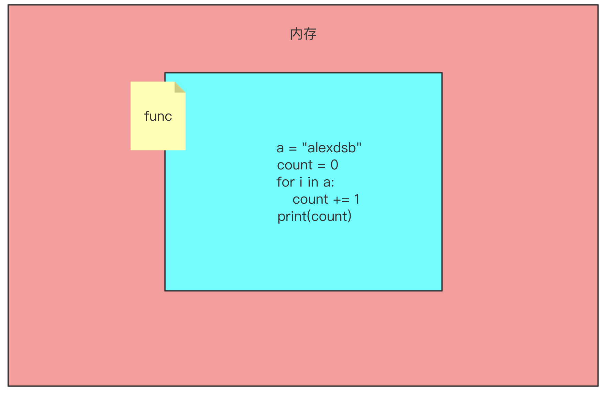
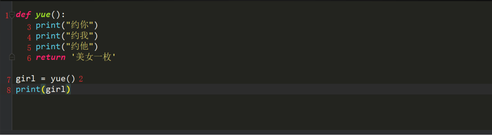
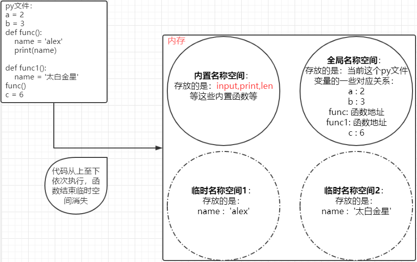
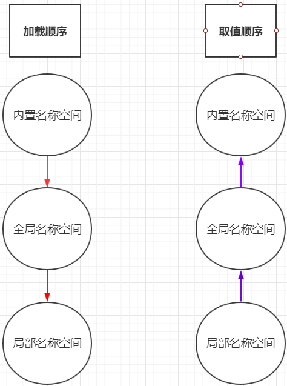
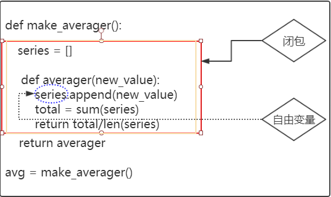
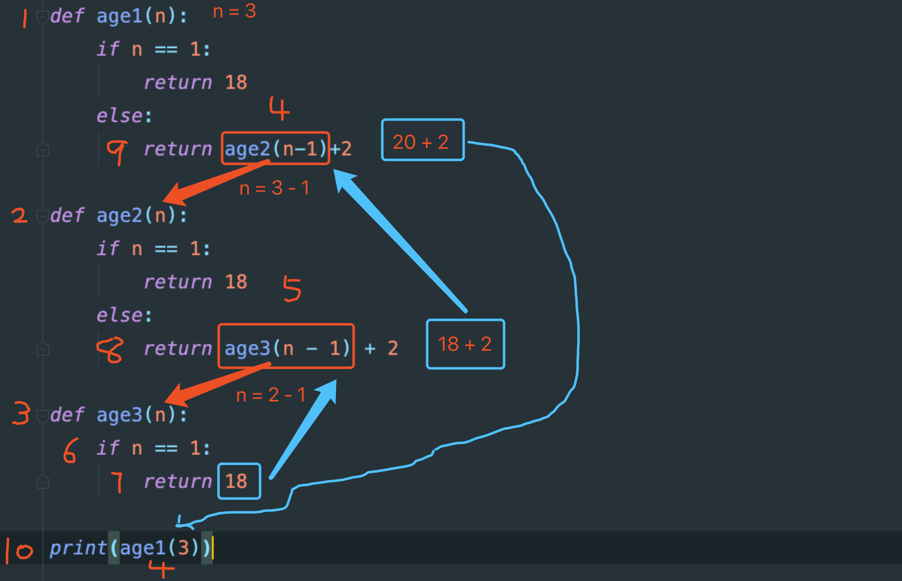

# 第二章 Python函数

#### 本章具体内容如下:

1. **函数初识**

2. **函数进阶**

3. **迭代器**

4. **生成器**

5. **内置函数**

6. **装饰器**

7. **装饰器进阶**

   

​    本章主要是为大家讲解Python函数部分,希望大家通过本章的学习,对Python函数有更深入的了解.更好的更规范的使用函数式编程，可以熟练的运用函数式编程的思想去解决问题。


## 第一节: 函数初识

#### 本节具体内容如下:

1. **函数介绍与定义**

2. **函数调用**

3. **函数的返回值**

4. **函数的参数**

   + 实参
     + 位置参数
     + 关键字参数
     + 混合参数
   + 形参
     + 位置参数
     + 默认参数
     + 万能参数
     + 仅限关键字参数（下一节讲）

   

#### 1. 函数介绍和定义

+ 引子

​	我们目前为止,已经可以完成一些软件的基本功能了,现在我们自己来实现一个获取字符串长度的代码,但是不能使用len

```python
a = "xiaomingdsb"
count = 0
for i in a:
    count += 1
print(count)
```

​	我们现在实现了一个求长度，我还想让你们求一下列表和元组的长度怎么做？是不是就要将我们写的内容再次拿过？

```python
a = [1, 2, 3, 'heruan']
count = 0
for i in a:
    count += 1
print(count)

a = (1, 2, 3, 'heruan')
count = 0
for i in a:
    count += 1
print(count)
```

来我们在求一个字典的长度,也需要将我们写好的内容拿过来使用? 是不是重复代码太多了，自己看着都很low。那么这里，我写了一个len的功能，我将上面的那些重复代码封装到这个所谓的函数中，这样，我什么时候需要使用这个功能，我通过一个指令调用即可

```python
a = (1, 2, 3, 'heruan')
def my_len():
	count = 0
	for i in a:
  	count += 1

my_len()
```

上面这个就是一个函数，那么接下来我们就来研究一下这个函数。

从上面的对比我们看一下函数的优势：

1. 减少代码的重复性。

2. 增强代码e的可读性。

   

- 函数的结构

  首先咱们先看一下函数的结构：

```
def 函数名():

    函数体
```

​	def 关键词开头，空格之后接函数名称和圆括号()，最后还有一个":"。

​	def 是固定的，不能变，他就是定义函数的关键字。

​	空格 为了将def关键字和函数名分开，必须空(四声)，当然你可以空2格、3格或者你想空多少都行，但正常人还是空1格。

​	函数名：函数名只能包含字符串、下划线和数字且不能以数字开头。虽然函数名可以随便起，但我们给函数起名字还是要尽量简短，并且要具有可描述性

​	括号：是必须加的，先别问为啥要有括号，总之加上括号就对了（下面就会讲到）！

​	下面的函数体一定全部都要缩进，这代表是这个函数的代码。



是的你没有看错,内存开辟了一个空间,但是里边存放是代码.

这样我就将咱们写的代码封装起来了,我们现在执行一下程序看看它会不会进行求长度,它并没有执行,我们来看看怎么能够执行上呢?


#### 2. 函数的调用

使用函数名加小括号就可以调用了  写法:函数名()  这个时候函数的函数体会被执行

```
def my_len():
  a = "alexdsb"
  count = 0
  for i in a:
      count += 1
  print(count)
 
my_len()  # 函数的调用
```

你调用几次函数，他就会执行几次。

```
my_len()
my_len()
my_len()
```

小结：

+ 只有解释器读到函数名() 时，才会执行此函数，如果没有这条指令，函数里面即使有10万行代码也是不执行的。

+ 这个指令你写几次，函数里面的代码就运行几次，就好比你在部队，我喊你名字，喊几次，你就得 到 几次，这就是指令。

  

#### 3. 函数的返回值

我们现在换一下例子,都是男同胞 大家都有哪方面的想法,就需要使用交友社交软件,我们现在来模拟一下使用社交软件的流程吧

```python
 def yue():
    print("掏出手机")
    print("打开默默")
    print("约一个妹子")  
yue()
```

咱们约完之后的得有个结果吧, 比如约的是萝莉小姐姐,还是大妈啊总得有个结果,那么这个结果

怎么来描述和获得呢? 这就涉及到函数的返回值啦

执行完函数之后,我们可以使用return来返回结果

```python
def yue():
    print("约你")
    print("约我")
    print("约他")
    return   
yue()
```

返回的是什么结果,返回的东西给谁了?? 返回值返回给了函数调用者 yue()就是函数的调用者 那就是返回给它了,我们来看看返回的什么

```python
def yue():
    print("约你")
    print("约我")
    print("约他")
    return   
ret = yue()
print(ret)
```

返回的结果是None,想想我们有的时候操作列表的方法 打印的结果就是None,我们所有用的字符串,列表的方法都是函数.

函数中遇到return,此函数就立马结束了.不在继续执行

```python
def yue():
    print("约你")
    print("约我")
    print("约他")
    return
  	print("大家一起约")
yue()
```

我们现在给return后边写一个返回值,我们试试返回个东西

```python
def yue():
    print("约你")
    print("约我")
    print("约他")
    return  "美女一枚"   
yue()
```

我们现在返回了一个字符串,我们来看一下

```python
def yue():
    print("约你")
    print("约我")
    print("约他")
    return '美女一枚'
girl =  yue()
print(girl)

结果:
约你
约我
约他
美女一枚
```

肯定好多朋友还是不明白上边怎么就打印美女一枚了,莫慌看下图:



```
1.定义了一个函数yue
2.调用函数
3.执行函数里的约你
4.执行函数里的约我
5.执行函数里的约他
6.返回给调用者一个字符串,这个调用者就是yue()
7.将返回的字符串通过一个等号赋值给白变量girl
8.打印变量girl的值
```

**函数的返回值可以有多个结果:**

```python
def yue():   
    print("约你")   
    print("约我")   
    print("约他")   
    return "美女一枚", "萝莉一枚"
girl = yue()
print(type(girl))   # tuple
```

当函数的返回值是多个的时候,返回的就是一个元组

- 小结

　　1. 遇到return,此函数结束,return下面的代码将不会在执行

　　2. return 返回值

　　	如果return什么都不写或者干脆就没写return,返回的结果就是None

　　　如果return后面写了一个值,返回给调用者这个值

　　　如果return后面写了多个结果,返回给调用者一个tuple(元祖),调用者可以直接使用解构获取多个变量

```python
def date():
    print("拿出手机")
    print("打开陌陌")
    print('左滑一下')
    print('右滑一下')
    print("找个漂亮的妹子")
    print("问她,约不约啊!")
    print("ok 走起")
    return '漂亮的妹子','小萝莉', '成熟女性'
g1,g2,g3 = date()
print(g1, g2, g3)  # 漂亮的妹子 小萝莉 成熟女性
```


#### 4. 函数的参数

 我们上面研究了，函数的结构，函数的执行，以及函数的返回值。对函数有一个初步的了解，那么接下来就是一个非常重要的知识点，函数的参数。函数是以功能为导向的，上面我们写的函数里面的代码都是写死的，也就是说，这个函数里面的更改起来很麻烦，试想一下，我们使用探探，陌陌等软件，可不可以进行筛选，比如选择性别，年龄等，导出结果？ 再拿我们之前学过的len 这个len是不是可以获取字符串的总个数？是不是可以获取列表的总个数？你更改了len函数内部的代码了？没有吧？你看下面的例子：

```
s1 = 'sfdas'
l1 = [1, 3, 7]
print(len(s1))  # 5
print(len(l1))  # 3
```

那么我们写的函数也是可以将一些数据传到函数里面的，然后让里面的代码利用上这个数据产生我们想要的结果，在返回。

举个例子：

```python
def date(sex):
    print("拿出手机")
    print("打开陌陌")
    print('设置筛选条件：性别: %s' %sex)
    print("找个漂亮的妹子")
    print("问她,约不约啊!")
    print("ok 走起")

date('女')
```


- 参数分类

　　1.形参

　　　　写在函数声明的位置的变量叫形参,形式上的一个完整.表示这个函数需要xxx

　　2.实参

　　　　在函数调用的时候给函数传递的值.加实参,实际执行的时候给函数传递的信息.表示给函数xxx

```python
def yue(chat):    # chat  形参   

    print("拿出手机")   

    print("打开"+chat)   

    print("找个漂亮的妹子")   

    print("约不约")

     

yue("陌陌")     # "陌陌"在这里就是实参

len("字符串")    # "字符串"在这里就是实参

print("麻花藤")    # "麻花藤"就是实参
```

- **实参角度**

  - 位置参数

    **位置参数就是从左至右，实参与形参一一对应。**

  　　约到现在,有没有想过这么一个问题,啥样的都约么? 哪里的都约么? 不一定吧.比如我现在在北京,我很寂寞,我喜欢小姐姐 

  　   你同桌在泰国,很寂寞 人妖就行了 .需求是不一样的 而我们现在的函数没有这些功能 那怎么办呢? 很简单 多来几个参数就好了。

  ```python
  def yue(chat,addr,age):    # chat  形参
  
      print("拿出手机")
  
      print("打开"+chat)
  
      print("找个" + addr +"附近漂亮的" + str(age) + "岁妹子")
  
      print("约不约")
  
  
  
  yue("陌陌","北京",18)    # 实参
  
  结果:
  
  拿出手机
  
  打开陌陌
  
  找个北京附近漂亮的18岁妹子
  
  约不约
  ```

  ​		上述代码分析: 在访问yue()的时候,我们按照位置的顺序分别把"陌陌","北京",18赋值给chat,addr,age,在传参过程中.系统会按照位置把实参赋值到形参.

  + 练习

  编写函数,给函数传递两个参数a,b  a,b相加 返回a参数和b参数相加的和

```
def f(a,b):
    c = a+b
    return c

num_sum = f(5,8)
print(num_sum)
结果: 13

```

​	编写函数,给函数传递两个参数a,b 比较a,b的大小 返回a,b中最大的那个数

```
def f(a,b):

    if a>b:

        return a

    else:

        return b

num_sum = f(5,8)

print(num_sum)
结果:8

```

比较大小的这个写法有点麻烦,我们在这里学一个三元运算符

```python
def f(a,b):

    c = a if a > b else b  #当a>b就把a赋值给c,否则就把b赋值给c

    return c

msg = f(5,7)

print(msg)

结果:

7

```

- 关键字参数

  位置参数好不好呢?  如果是少量的参数还算OK, 没有问题. 但是如果函数在定义的时候参数非常多怎么办? 程序员必须记住, 我有哪些参数, 而且还有记住每个参数的位置, 否则函数就不能正常调用了. 那则么办呢? python提出了一种叫做关键字参数. 我们不需要记住每个参数的位置. 只要记住每个参数的名字就可以了 

```python
def yue(chat, address, age):

    print("拿出手机")

    print("打开"+chat)

    print("找个"+address+"附近漂亮的"+str(age)+"岁妹子")

    print("约不约")


yue(chat="微信", age=18, address="北京")       # 关键字参数.

结果:

拿出手机

打开微信

找个北京附近漂亮的18岁妹子

约不约　

```

​	搞定, 这样就不需要记住繁琐的参数位置了.

- 混合参数

  可以把上面两种参数混合着使用. 也就是说在调用函数的时候即可以给出位置参数, 也可以指定关键字参数. 

```python
def yue(chat,addr,age):    # chat  形参

    print("拿出手机")

    print("打开"+chat)

    print("找个" + addr +"附近漂亮的" + str(age) + "岁妹子")

    print("约不约")


yue("陌陌","北京",18)    # 实参

结果:

拿出手机

打开陌陌

找个北京附近漂亮的18岁妹子

约不约

```

​	注意: **在使用混合参数的时候, 关键字参数必须在位置参数后面**

- **小结**

  在实参的⾓角度来看分为三种:

  + 位置参数
  + 关键字参数
  + 混合参数,  位置参数必须在关键字参数前面

- 形参角度
  - 位置参数:

  　　位置参数,按照位置来赋值,到目前为止,我们编写的函数都是这种

  ```python
  def yue(chat, address, age):   
  
      print("拿出手机")   
  
      print("打开"+chat)   
  
      print("找个"+address+"附近漂亮的"+str(age)+"岁妹子")   
  
      print("约不约")
  
  ```

  + 默认值参数:

  　　在函数声明的时候, 就可以给出函数参数的默认值. 在调用的时候可以 给出具体的值, 也可以不给值, 使⽤用默认值. 比如, 我们录入咱们班学生的基本信息. 通过调查发现. 我们班大部分学生都是男生. 这个时 候就可以给出⼀一个sex='男'的默认值. 

```
def stu_info(name, age, sex='男'):   

    print("录入学生信息")

    print(name, age, sex)   

    print("录入完毕")


stu_info("张强", 18)

```

注意:必须先声明在位置参数,才能声明关键字参数

+ 小结：
  + 位置参数

  + 默认值参数（一般使用较多的实参设定为默认参数）


## 第二节: Python 函数进阶I

#### 本节具体内容如下:

1. **形参角度：动态(万能)参数**

2. ***的魔法用法**

   + 函数中使用
   + 函数外处理剩余元素

3. **形参的顺序**

4. **形参角度：仅限关键字参数**

5. **函数的属性**

6. **名称空间,作用域**

7. **高阶函数**

8. **global及nonlocal**

    


#### 1. 形参角度：动态(万能)参数

+ 引子

​	昨天我们从形参角度，讲了两种参数，一个是位置参数，位置参数主要是实参与形参从左至右一一对应，一个是默认值参数，默认值参数，如果实参不传参，则形参使用默认参数。那么无论是位置参数，还是默认参数，函数调用时传入多少实参，我必须写等数量的形参去对应接收， 如果不这样，那么就会报错：

```python
def eat(a,b,c,):
print('我请你吃：',a,b,c) 
eat('蒸羊羔','蒸熊掌','蒸鹿尾儿','烧花鸭') # 报错
```

如果我们在传参数的时候不很清楚有哪些的时候,或者说给一个函数传了很多实参,我们就要对应写很多形参,这样很麻烦，怎么办？,我们可以考虑使用动态参数也叫万能参数。

+ 动态参数：
  动态参数分为两种：动态接受位置参数，动态接受关键字参数
  + 动态接收位置参数 *args

    在参数位置用*表示接受任意参数

    ```python
    def eat(*args):
    
        print('我想吃',args)
    
    eat('大米饭','中米饭','小米饭')  # 收到的结果是一个tuple元祖
    ```

     解释一下上面参数的意义：首先来说args，args就是一个普通的形参，但是如果你在args前面加一个，那么就拥有了特殊的意义：在python中除了表示乘号，他是有魔法的。+args，这样设置形参，那么这个形参会将实参所有的位置参数接收，放置在一个元组中，并将这个元组赋值给args这个形参，这里起到魔法效果的是 * 而不是args，a也可以达到刚才效果，但是我们PEP8规范中规定就使用args，约定俗成的。

    练习：传入函数中数量不定的int型数据，函数计算所有数的和并返回。

    **那关键字参数呢?**

  + 动态接受关键字参数`**kwargs`

    ​	实参角度有位置参数和关键字参数两种，python中既然有*args可以接受所有的位置参数那么肯定也有一种参数接受所有的关键字参数，那么这个就是**kwargs，同理这个**是具有魔法用法的，kwargs约定俗成使用作为形参。举例说明：**kwargs，是接受所有的关键字参数然后将其转换成一个字典赋值给kwargs这个形参。

    ```python
    def func(**kwargs):
    print(kwargs) # {'name': '太白金星', 'sex': '男'}
    func(name='太白金星',sex='男')
    ```

    我们看一下动态参数的完成写法：

    ```python
    def func(*args,**kwargs):
        print(args) # ('蒸羊羔儿', '蒸熊掌', '蒸鹿尾儿')
        print(kwargs) # {'name': '太白金星', 'sex': '男'}
    func('蒸羊羔儿', '蒸熊掌', '蒸鹿尾儿',name='太白金星',sex='男')
    ```

    ​    如果一个参数设置了动态参数，那么他可以接受所有的位置参数，以及关键字参数，这样就会大大提升函数拓展性，针对于实参参数较多的情况下，解决了一一对应的麻烦。

    

#### 2. ***的魔法用法**

   刚才我们研究了动态参数，其实有的同学对于魔法用法 * 比较感兴趣，那么那的魔性用法不止这么一点用法，我们继续研究：

​        **函数中分为打散和聚合。**

​        **函数外可以处理剩余的元素。**

+ 函数中使用
  +  **聚合**

  ​    刚才我们研究了，在函数定义时，如果我只定义了一个形参称为args，那么这一个形参只能接受几个实参？ 是不是只能当做一个位置参数对待？它只能接受一个参数

  ```
  def eat(args):
    print('我请你吃：',args) # 我请你吃： 蒸羊羔儿
    eat('蒸羊羔儿')
  ```

  ​    但是如果我给其前面加一个* 那么args可以接受多个实参，并且返回一个元组，对吧？ （**kwargs也是同理将多个关键字参数转化成一个字典返回）所以在函数的定义时： *起到的是聚合的作用。
  + **打散**

  ​    此时不着急给大家讲这个打散，而是出一个小题：你如何将三个数据（这三个数据都是可迭代对象类型）s1 = 'barry',l1 = [1, 2, 3, 4], tu1 = ('yes', '太白', '女神',)的每一元素传给动态参数*args？（就是args最终得到的是 ('b','a','r','r','y', 1, 2, 3, 4,'yes', '太白', '女神',）?有人说这还不简单么？我直接传给他们不就行了？

  ```
  s1 = 'barry'
  l1 = [1, 2, 3, 4]
  tu1 = ('yes', '太白', '女神',)
  def func(*args):
      print(args) # ('barry', [1, 2, 3, 4], ('yes', '太白', '女神'))
  func(s1,l1,tu1)
  ```

  这样肯定是不行，他会将这个三个数据类型当成三个位置参数传给args，没有实现我的要求。

  好像你除了直接写，没有别的什么办法，**那么这里就得用到我们的魔法用法 ：\***

  ```python
  s1 = 'barry'
  l1 = [1, 2, 3, 4]
  tu1 = ('yes', '太白', '女神',)
  def func(*args):
      print(args) # ('b', 'a', 'r','r','y', 1, 2, 3, 4, 'yes', '太白', '女神')
  func(*s1,*l1,*tu1)
  ```

  ​    你看此时是函数的执行时，我将你位置参数的实参（可迭代类型）前面加上，相当于将这些实参给拆解成一个一个的组成元素当成位置参数，然后传给args,这时候这个好像取到的是打散的作用。所以在函数的执行时：，**起到的是打散的作用。

  ```python
  dic1 = {'name': '太白', 'age': 18}
  dic2 = {'hobby': '喝茶', 'sex': '男'}
  def func(**kwargs):
      print(kwargs) # {'name': '太白', 'age': 18, 'hobby': '喝茶', 'sex': '男'}
  func(**dic1,**dic2)
  ```

  

+ ***处理剩下的元素**

  *除了在函数中可以这样打散，聚合外，函数外还可以灵活的运用：

  ```python
  # 之前讲过的分别赋值
  a,b = (1,2)
  print(a, b) # 1 2
  # 其实还可以这么用：
  a,*b = (1, 2, 3, 4,)
  print(a, b) # 1 [2, 3, 4]
  *rest,a,b = range(5)
  print(rest, a, b) # [0, 1, 2] 3 4
  print([1, 2, *[3, 4, 5]]) # [1, 2, 3, 4, 5]
  ```


#### 3. **形参的顺序**

​	到目前为止，从形参的角度我们讲了位置参数，默认值参数，动态参数*args，**kwargs，还差一种参数，需要讲完形参顺序之后，引出。先不着急，我们先看看已经讲的这些形参他的排列顺序是如何的呢？

首先，位置参数，与默认参数他两个的顺序我们昨天已经确定了，位置参数必须在前面，即 ：位置参数，默认参数。

那么动态参数*args，**kwargs放在哪里呢？

动态参数*args，肯定不能放在位置参数前面，这样我的位置参数的参数就接收不到具体的实参了：

```python
# 这样位置参数a,b始终接收不到实参了，因为args全部接受完了
def func(*args,a,b,sex='男'):
print(args)
print(a,b)
func(1, 2, 3, 4, 5)
```

那么动态参数必须在位置参数后面，他可以在默认参数后面么？

```python
# 这样也不行，我的实参的第三个参数始终都会将sex覆盖掉，这样失去了默认参数的意义。
def func(a,b,sex='男',*args,):
print(args) # (4, 5)
print(sex) # 3
print(a,b) # 1 2
func(1, 2, 3, 4, 5)
```

所以*args一定要在位置参数与默认值参数中间：**位置参数，\*args，默认参数**。

那么我的**kwargs放在哪里？**kwargs可以放在默认参数前面么？

```python
# 直接报错：因为**kwargs是接受所有的关键字参数，如果你想改变默认参数sex，你永远也改变不了，因为
# 它会先被**kwargs接受。
def func(a,b,*args,**kwargs,sex='男',):
print(args) # (4, 5)
print(sex) # 3
print(a,b) # 1 2
print(kwargs)
func(1, 2, 3, 4, 5)
```

所以截止到此：所有形参的顺序为：**位置参数，\*args，默认参数，\**kwargs。**


#### 4. **形参角度：仅限关键字参数**

  仅限关键字参数是python3x更新的新特性，他的位置要放在*args后面，**kwargs前面（如果有**kwargs），也就是默认参数的位置，它与默认参数的前后顺序无所谓，它只接受关键字传的参数：

```python
# 这样传参是错误的，因为仅限关键字参数c只接受关键字参数
def func(a,b,*args,c):
print(a,b) # 1 2
print(args) # (4, 5)
# func(1, 2, 3, 4, 5)
# 这样就正确了：
def func(a,b,*args,c):
print(a,b) # 1 2
print(args) # (3, 4)
print(5)
func(1, 2, 3, 4, c=5)
```

​    这个仅限关键字参数从名字定义就可以看出他只能通过关键字参数传参，其实可以把它当成不设置默认值的默认参数而且必须要传参数，不传就报错。

所以形参角度的所有形参的最终顺序为：**位置参数，\*args，默认参数，仅限关键字参数，\**kwargs。**

```python
课间考一道题：
def foo(a,b,*args,c,sex=None,**kwargs):
print(a,b)
print(c)
print(sex)
print(args)
print(kwargs)
# foo(1,2,3,4,c=6)
# foo(1,2,sex='男',name='alex',hobby='old_woman')
# foo(1,2,3,4,name='alex',sex='男')
# foo(1,2,c=18)
# foo(2, 3, [1, 2, 3],c=13,hobby='喝茶')
# foo(*[1, 2, 3, 4],**{'name':'太白','c':12,'sex':'女'})
```

### 

#### 5. **函数的属性**

​	python函数为我们提供了很多属性，有一些是经常用到的，有一些则使用比较少，我把这些属性都展示出来，经常用到的我会通过代码给大家演示，剩余的自己课下练习即可。

```python
def eat(food, drink, sex='男'):

    """

    这里描述这个函数是做什么的.例如这函数eat就是吃

    :param food:  food这个参数是什么意思

    :param drink: drink这个参数是什么意思

    :return:  执行完这个函数想要返回给调用者什么东西

    """

    print(food, drink,sex)

    return 666

eat('麻辣烫','肯德基')

# print(dir(eat))   dir() 获取函数所有的属性
['__annotations__', '__call__', '__class__', '__closure__', '__code__',
 '__defaults__', '__delattr__', '__dict__', '__dir__', '__doc__',
 '__eq__', '__format__', '__ge__', '__get__', '__getattribute__',
 '__globals__', '__gt__', '__hash__', '__init__', '__init_subclass__',
 '__kwdefaults__', '__le__', '__lt__', '__module__',
 '__name__', '__ne__', '__new__', '__qualname__', '__reduce__',
 '__reduce_ex__', '__repr__', '__setattr__', '__sizeof__', '__str__',
 '__subclasshook__']

# 常用的属性
print(eat.__doc__)  # str类型 获取函数的注释信息
print(eat.__name__)  # str类型 获取函数名
print(eat.__defaults__)  # tuple类型 获取默认参数的默认值
print(eat.__closure__)  # 与闭包函数相关，后面会涉及
```


#### 6. **名称空间,作用域**

+ **名称空间**

  ​	接下来我们讲的内容，理论性的偏多，就是从空间角度，内存级别去研究python。首先我们看看什么是全局名称空间：

  ​    在python解释器开始执行之后, 就会在内存中开辟一个空间, 每当遇到一个变量的时候, 就把变量名和值之间的关系记录下来, 但是当遇到函数定义的时候, 解释器只是把函数名读入内存, 表示这个函数存在了,  至于函数内部的变量和逻辑, 解释器是不关心的. 也就是说一开始的时候函数只是加载进来, 仅此而已, 只有当函数被调用和访问的时候, 解释器才会根据函数内部声明的变量来进行开辟变量的内部空间. 随着函数执行完毕, 这些函数内部变量占用的空间也会随着函数执行完毕而被清空.

  ​    我们首先回忆一下Python代码运行的时候遇到函数是怎么做的，从Python解释器开始执行之后，就在内存中开辟里一个空间，每当遇到一个变量的时候，就把变量名和值之间对应的关系记录下来，但是当遇到函数定义的时候，解释器只是象征性的将函数名读如内存，表示知道这个函数存在了，至于函数内部的变量和逻辑，解释器根本不关心。

  ​    等执行到函数调用的时候，Python解释器会再开辟一块内存来储存这个函数里面的内容，这个时候，才关注函数里面有哪些变量，而函数中的变量回储存在新开辟出来的内存中，函数中的变量只能在函数内部使用，并且会随着函数执行完毕，这块内存中的所有内容也会被清空。

  我们给这个‘存放名字与值的关系’的空间起了一个名字-------命名空间。

  代码在运行伊始，创建的存储“变量名与值的关系”的空间叫做全局命名空间；

  在函数的运行中开辟的临时的空间叫做局部命名空间也叫做临时名称空间。

  现在我们知道了，py文件中，存放变量与值的关系的一个空间叫做全局名称空间，而当执行一个函数时，内存中会临时开辟一个空间，临时存放函数中的变量与值的关系，这个叫做临时名称空间，或者局部名称空间。

  ​    其实python还有一个空间叫做内置名称空间：内置名称空间存放的就是一些内置函数等拿来即用的特殊的变量：input，print，list等等，所以，我们通过画图捋一下：

  

  那么这就是python中经常提到的三个空间。

  **总结:**

  1. 全局命名空间--> 我们直接在py文件中, 函数外声明的变量都属于全局命名空间

  2. 局部命名空间--> 在函数中声明的变量会放在局部命名空间

  3. 内置命名空间--> 存放python解释器为我们提供的名字, list, tuple, str, int这些都是内置命名空间

     
  
+ **加载顺序：**

​    所谓的加载顺序，就是这三个空间加载到内存的先后顺序，也就是这个三个空间在内存中创建的先后顺序，你想想他们能是同时创建么？肯定不是的，那么谁先谁后呢？我们捋顺一下：在启动python解释器之后，即使没有创建任何的变量或者函数，还是会有一些函数直接可以用的比abs(-1),max(1,3)等等，在启动Python解释器的时候，就已经导入到内存当中供我们使用，所以肯定是先加载内置名称空间，然后就开始从文件的最上面向下一行一行执行，此时如果遇到了初始化变量，就会创建全局名称空间，将这些对应关系存放进去，然后遇到了函数执行时，在内存中临时开辟一个空间，加载函数中的一些变量等等。

所以这三个空间的加载顺序为：内置命名空间(程序运行伊始加载)->全局命名空间(程序运行中：从上到下加载)->局部命名空间(程序运行中：调用时才加载）。


+ **取值顺序：**

  ​    取值顺序就是引用一个变量，先从哪一个空间开始引用。这个有一个关键点：从哪个空间开始引用这个变量。我们分别举例说明：

  ```python
  # 如果你在全局名称空间引用一个变量，先从全局名称空间引用，全局名# 称空间如果没有，才会向内置名称空间引用。
  input = 666
  print(input) # 666
  # 如果你在局部名称空间引用一个变量，先从局部名称空间引用，
  # 局部名称空间如果没有，才会向全局名称空间引用，全局名称空间在没有，就会向内置名称空间引用。
  input = 666
  print(input) # 666
  input = 666
  def func():
      input = 111
      print(input) # 111
  func()
  ```

  所以空间的取值顺序与加载顺序是相反的，取值顺序满足的就近原则，从小范围到大范围一层一层的逐步引用。



+ **作用域**

  作用域就是作用范围, 按照生效范围来看分为全局作用域和局部作用域

  全局作用域: 包含内置命名空间和全局命名空间. 在整个文件的任何位置都可以使用(遵循 从上到下逐⾏执行).

  局部作用域: 在函数内部可以使用.

  作⽤域命名空间:

  ​    **1. 全局作用域:    全局命名空间 + 内置命名空间**

  ​    **2. 局部作⽤域:    局部命名空间**

  

+ **内置函数globals(),locals()**

  这两个内置函数放在这里讲是在合适不过的，他们就直接可以反映作用域的内容，有助于我们理解作用域的范围。

  globals(): 以字典的形式返回全局作用域所有的变量对应关系。

  locals(): 以字典的形式返回当前作用域的变量的对应关系。

  这里一个是全局作用域，一个是当前作用域，一定要分清楚，接下来，我们用代码验证：

  ```python
  # 在全局作用域下打印，则他们获取的都是全局作用域的所有的内容。
  a = 2
  b = 3
  print(globals())
  print(locals())
  '''
  {'__name__': '__main__', '__doc__': None, '__package__': None,
  '__loader__': <_frozen_importlib_external.SourceFileLoader object at 0x000001806E50C0B8>, 
  '__spec__': None, '__annotations__': {},
  '__builtins__': <module 'builtins' (built-in)>, 
  '__file__': 'D:/lnh.python/py project/teaching_show/day09~day15/function.py',
  '__cached__': None, 'a': 2, 'b': 3}
  '''
  
  # 在局部作用域中打印。
  a = 2
  b = 3
  def foo():
      c = 3
      print(globals()) # 和上面一样，还是全局作用域的内容
      print(locals()) # {'c': 3}
  foo()
  ```


#### 7. **高阶函数**

1. 只要遇见了()就是函数的调用. 如果没有()就不是函数的调用
2. 函数的执行顺序

```
def fun1():   
    print(111)  
def fun2():   
    print(222)   
    fun1()   
fun2()
print(111)
```


```
def fun2():   
    print(222)   
    def fun3():       
        print(666)   
    print(444)   
    fun3()   
    print(888)
print(33)
fun2()
print(555)

```


#### 8 .gloabal、nonlocal


+ **global**

  讲这个关键字之前，先给大家看一个现象：

  ```python
  a = 1
  def func():
      print(a)
  func()
  a = 1
  def func():
      a += 1 # 报错
  func()
  ```

  局部作用域对全局作用域的变量（此变量只能是不可变的数据类型）只能进行引用，而不能进行改变，只要改变就会报错，但是有些时候，我们程序中会遇到局部作用域去改变全局作用域的一些变量的需求，这怎么做呢？这就得用到关键字global：

  + global第一个功能：在局部作用域中可以更改全局作用域的变量。

    ```python
    count = 1
    def search():
        global count
        count = 2
    search()
    print(count)
    ```

    

  + global第二个功能：利用global在局部作用域也可以声明一个全局变量。

    ```python
    def func():
        global a
        a = 3
    func()
    print(a)
    ```

+ 小结

  + 声明一个全局变量。

  + 在局部作用域想要对全局作用域的全局变量进行修改时，需要用到 global(限于字符串，数字)。

    

+ **nonlocal**

  nonlocal是python3x新加的功能，与global用法差不多，就是在局部作用域如果想对父级作用域的变量进行改变时，需要用到nonlocal，当然这个用的不是很多，了解即可。

  ```python
  def add_b():
      b = 42
      def do_global():
          b = 10
          print(b)
          def dd_nonlocal():
              nonlocal b
              b = b + 20
              print(b)
          dd_nonlocal()
          print(b)
      do_global()
      print(b)
  add_b()
  
  nonlocal关键字举例
  ```

+ 小结
  + 不能更改全局变量。
  + 在局部作用域中，对父级作用域（或者更外层作用域非全局作用域）的变量进行引用和修改，并且引用的哪层，从那层及以下此变量全部发生改变。

 


## 第三节: 函数进阶II以及迭代器

#### 本节具体内容如下:

1. **函数名的第一类对象及使用**
2. **f-strings字符串格式化**
3. **迭代器**


#### 1. 函数名的第一类对象及使用

函数名是一个变量, 但它是一个特殊的变量, 与括号配合可以执行函数的变量

- 函数名的内存地址

```
def func():   
    print("呵呵")
print(func)

结果: <function func at 0x1101e4ea0>
```

- 函数名可以赋值给其他变量

```
def func():   
    print("呵呵")
    print(func)
a = func    # 把函数当成一个值赋值给另一个变量

a()     # 函数调用 func()
```

- 函数名可以当做容器类的元素

```
def func1():   
    print("呵呵")
def func2():   
    print("呵呵")
def func3():   
    print("呵呵")
def func4():  
     print("呵呵")

lst = [func1, func2, func3]
for i in lst:  
     i()
```

- 函数名可以当做函数的参数

```
def func():   
    print("吃了么")
def func2(fn):   
    print("我是func2")   
    fn()    # 执行传递过来的fn   
    print("我是func2")
func2(func)     # 把函数func当成参数传递给func2的参数fn.
```

- 函数名可以作为函数的返回值

```
def func_1():   
    print("这里是函数1")   
    def func_2():       
        print("这里是函数2")   
    print("这里是函数1")   
    return func_2
fn = func_1()  
# 执行函数1.  函数1返回的是函数2, 这时fn指向的就是上面函数2
fn()    # 执行func_2函数
```


#### 2. f-string字符串格式化

​	f-strings 是Python3.6开始加入标准库的格式化输出新的写法，这个格式化输出比之前的%s 或者 format 效率高并且更加简化，非常的好用，相信我，你们学完这个之后，以后再用格式化输出这就是你们唯一的选择。

- 简单举例

​    他的结构就是F(f)+ str的形式，在字符串中想替换的位置用{}展位，与format类似，但是用在字符串后面写入替换的内容，而他可以直接识别。碉堡了。

```
name = '太白'
age = 18
sex = '男'
msg = F'姓名：{name},性别：{age}，年龄：{sex}'  # 大写字母也可以
msg = f'姓名：{name},性别：{age}，年龄：{sex}'  
print(msg)
'''
输出结果：
姓名：太白,性别：18，年龄：男
'''
```

- 任意表达式

他可以加任意的表达式，非常方便：

```
print(f'{3*21}')  # 63

name = 'barry'
print(f"全部大写：{name.upper()}")  # 全部大写：BARRY

# 字典也可以
teacher = {'name': '太白', 'age': 18}
msg = f"The teacher is {teacher['name']}, aged {teacher['age']}"
print(msg)  # The comedian is 太白, aged 18

# 列表也行
l1 = ['太白', 18]
msg = f'姓名：{l1[0]},年龄：{l1[1]}.'
print(msg)  # 姓名：太白,年龄：18.
```

- 也可以插入表达式

可以用函数完成相应的功能，然后将返回值返回到字符串相应的位置

```
def sum_a_b(a,b):
    return a + b
a = 1
b = 2
print('求和的结果为' + f'{sum_a_b(a,b)}')
```

- 多行f

```pytho
xname = 'barry'
age = 18
ajd = 'handsome'

# speaker = f'''Hi {name}.
# You are {age} years old.
# You are a {ajd} guy!'''

speaker = f'Hi {name}.'\
          f'You are {age} years old.'\
          f'You are a {ajd} guy!'
print(speaker)
```

- 其他细节

```python
print(f"{{73}}")  # {73}
print(f"{{{73}}}")  # {73}
print(f"{{{{73}}}}")  # {{73}}
m = 21
# ! , : { } ;这些标点不能出现在{} 这里面。
# print(f'{;12}')  # 报错
# 所以使用lambda 表达式会出现一些问题。
# 解决方式：可将lambda嵌套在圆括号里面解决此问题。
x = 5
print(f'{(lambda x: x*2) (x)}')  # 10
```


#### 3. 迭代器

- 可迭代对象
  
  - 可迭代对象定义
  
  ​    对于迭代器来说，我们更熟悉的应该是可迭代对象，之前无论是源码还是讲课中或多或少我们提到过可迭代对象这个词。之前为了便于大家理解可迭代对象，可能解释的不是很正确，所以今天我们正式的聊一聊什么是可迭代对象。从字面意思来说，我们先对其进行拆解：什么是对象？Python中一切皆对象，之前我们讲过的一个变量，一个列表，一个字符串，文件句柄，函数名等等都可称作一个对象，其实一个对象就是一个实例，就是一个实实在在的东西。那么什么叫迭代？其实我们在日常生活中经常遇到迭代这个词儿，更新迭代等等，迭代就是一个重复的过程，但是不能是单纯的重复（如果只是单纯的重复那么他与循环没有什么区别）每次重复都是基于上一次的结果而来。比如你爹生你，你生你爹，哦不对，你生你儿子，你儿子生你孙子等等，每一代都是不一样的；还有你使用过得app，微信，抖音等，隔一段时间就会基于上一次做一些更新，那么这就是迭代。可迭代对象从字面意思来说就是一个可以重复取值的实实在在的东西。
  
  ​    那么刚才我们是从字面意思分析的什么是可迭代对象，到目前为止我们接触到的可迭代对象有哪些呢？
  
  ​    str  list   tuple  dic  set  range 文件句柄等，那么int，bool这些为什么不能称为可迭代对象呢？虽然在字面意思这些看着不符合，但是我们要有一定的判断标准或者规则去判断该对象是不是可迭代对象。
  
  ​    **在Python中，但凡内部含有`__iter__`方法的对象，都是可迭代对象**。
  
  - 查看对象内部方法
  
  ​    该对象内部含有什么方法除了看源码还有什么其他的解决方式么？当然有了， 可以通过dir() 去判断一个对象具有什么方法
  
  ```
  s1 = 'alex'
  print(dir(s1))
  ```
  
  ​	dir()会返回一个列表，这个列表中含有该对象的以字符串的形式所有方法名。这样我们就可以判断python中的一个对象是不是可迭代对象了：
  
  ```
  s1 = 'alex'
  i = 100
  print('__iter__' in dir(i))  # False
  print('__iter__' in dir(s1))  # True
  ```
  
  - 小结：
  
  ​    从字面意思来说：可迭代对象就是一个可以重复取值的实实在在的东西。
  
  ​    从专业角度来说：但凡内部含有\_\_iter\_\_方法的对象，都是可迭代对象。
  
  ​    可迭代对象可以通过判断该对象是否有\_\_iter\_\_方法来判断。
  
  ​    可迭代对象的优点：
  
  ​        可以直观的查看里面的数据。
  
  ​    可迭代对象的缺点：
  
  ​			1.占用内存。
  
  ​			2.可迭代对象不能迭代取值（除去索引，key以外）。
  
  ​    那么这个缺点有人就提出质疑了，即使抛去索引,key以外，这些我可以通过for循环进行取值呀！对，他们都可以通过for循环进行取值，其实for循环在底层做了一个小小的转化，就是先将可迭代对象转化成迭代器，然后在进行取值的。那么接下来，我们就看看迭代器是个什么鬼。
  
  
  
- 迭代器

  ​    从字面意思来说迭代器，是一个可以迭代取值的工具，器：在这里当做工具比较合适。

  ​    从专业角度来说：迭代器是这样的对象：实现了无参数的\_\_next\_\_方法，返回序列中的下一个元素，如果没有元素了，那么抛出StopIteration异常.python中的迭代器还实现了\_\_iter\_\_方法，因此迭代器也可以迭代。 出自《流畅的python》

  ​    那么对于上面的解释有一些超前，和难以理解，不用过于纠结，我们简单来说：**在python中，内部含有\_\_Iter\_\_方法并且含有\_\_next\_\_方法的对象就是迭代器。**

  - 如何判断该对象是否是迭代器

  ​    ok，那么我们有了这个定义，我们就可以判断一些对象是不是迭代器或者可迭代对象了了，请判断这些对象：str list tuple dict set range 文件句柄 哪个是迭代器，哪个是可迭代对象：

  ```python 
  o1 = 'alex'
  o2 = [1, 2, 3]
  o3 = (1, 2, 3)
  o4 = {'name': '太白','age': 18}
  o5 = {1, 2, 3}
  f = open('file',encoding='utf-8', mode='w')
  print('__iter__' in dir(o1))  # True
  print('__iter__' in dir(o2))  # True
  print('__iter__' in dir(o3))  # True
  print('__iter__' in dir(o4))  # True
  print('__iter__' in dir(o5))  # True
  print('__iter__' in dir(f))  # True
  
  print('__next__' in dir(o1))  # False
  print('__next__' in dir(o2))  # False
  print('__next__' in dir(o3))  # False
  print('__next__' in dir(o4))  # False
  print('__next__' in dir(o5))  # False
  print('__next__' in dir(f))  # True
  f.close()
  ```

  通过以上代码可以验证，之前我们学过的这些对象，只有文件句柄是迭代器，剩下的那些数据类型都是可迭代对象。

  - 可迭代对象如何转化成迭代器

    ```python 
    l1 = [1, 2, 3, 4, 5, 6]
    obj = l1.__iter__()
    # <list_iterator object at 0x000002057FE1A3C8>
    # 或
    obj = iter(l1)
    print(obj)
    # <list_iterator object at 0x102cc67f0>
    ```

  - 迭代器取值

    ​    可迭代对象是不可以一直迭代取值的（除去用索引，切片以及Key），但是转化成迭代器就可以了，迭代器是利用\_\_next\_\_()进行取值：

    ```python
    l1 = [1, 2, 3,]
    obj = l1.__iter__()  # 或者 iter(l1)
    # print(obj)  # <list_iterator object at 0x000002057FE1A3C8>
    ret = obj.__next__()
    print(ret)
    ret = obj.__next__()
    print(ret)
    ret = obj.__next__()
    print(ret)
    ret = obj.__next__()  # StopIteration
    print(ret)
    # 迭代器利用next取值：一个next取对应的一个值，如果迭代器里面的值取完了，还要next，
    # 那么就报StopIteration的错误。
    ```

  

  - while模拟for的内部循环机制

    ​    刚才我们提到了，for循环的循环对象一定要是可迭代对象，但是这不意味着可迭代对象就可以取值，因为for循环的内部机制是：将可迭代对象转换成迭代器，然后利用next进行取值，最后利用异常处理处理StopIteration抛出的异常。

    ```python
    l1 = [1, 2, 3, 4, 5, 6]
    # 1 将可迭代对象转化成迭代器
    obj = iter(l1)
    # 2,利用while循环，next进行取值
    while 1:
        # 3,利用异常处理终止循环
        try:
            print(next(obj))
        except StopIteration:
            break
    ```

    

  - 小结:

  ​        从字面意思来说：迭代器就是可以迭代取值的工具。

  ​        从专业角度来说：在python中，内部含有\_\_Iter\_\_方法并且含有\_\_next\_\_方法的对象就是迭代器。

  + 迭代器的优点：
    + 节省内存,迭代器在内存中相当于只占一个数据的空间：因为每次取值都上一条数据会在内存释放，加载当前的此条数据。
    + 惰性机制。next一次，取一个值，绝不过多取值。​
    + 有一个迭代器模式可以很好的解释上面这两条：迭代是数据处理的基石。扫描内存中放不下的数据集时，我们要找到一种惰性获取数据项的方式，即按需一次获取一个数据项。这就是迭代器模式。

  + 迭代器的缺点：
    + 不能直观的查看里面的数据。
    + 取值时不走回头路，只能一直向下取值。

    ```python
    l1 = [1, 2, 3, 4, 5, 6]
    obj = iter(l1)
    
    for i in range(2):
        print(next(obj))
    
    for i in range(2):
        print(next(obj))
    ```

    

  + 可迭代对象与迭代器对比

    ​    我们今天比较深入的了解了可迭代对象与迭代器，接下来我们说一下这两者之间比较与应用：

    + **可迭代对象：**

      ​    是一个私有的方法比较多，操作灵活（比如列表，字典的增删改查，字符串的常用操作方法等）,比较直观，但是占用内存，而且不能直接通过循环迭代取值的这么一个数据集。

      ​    **应用**：当你侧重于对于数据可以灵活处理，并且内存空间足够，将数据集设置为可迭代对象是明确的选择。

    + **迭代器：**

      ​    是一个非常节省内存，可以记录取值位置，可以直接通过循环+next方法取值，但是不直观，操作方法比较单一的数据集。

      ​    **应用**：当你的数据量过大，大到足以撑爆你的内存或者你以节省内存为首选因素时，将数据集设置为迭代器是一个不错的选择。（可参考为什么python把文件句柄设置成迭代器)


## 第四节: 生成器

#### 本节具体内容如下:

1. **初识生成器**
2. **生成器的构建方式**
3. **生成器函数**


#### 1. 初识生成器

​	什么是生成器？这个概念比较模糊，各种文献都有不同的理解，但是核心基本相同。生成器的本质就是迭代器，在python社区中，大多数时候都把迭代器和生成器是做同一个概念。不是相同么？为什么还要创建生成器？生成器和迭代器也有不同，唯一的不同就是：迭代器都是Python给你提供的已经写好的工具或者通过数据转化得来的，（比如文件句柄，iter([1,2,3])。生成器是需要我们自己用python代码构建的工具。最大的区别也就如此了。

- 生成器的构建方式

  在python中有两种方式来创建生成器：

  1. 通过生成器函数
  2. 通过生成器推导式

 

- 生成器函数

  **我们先来研究通过生成器函数构建生成器。**

  首先,我们先看一个很简单的函数:

  ```python
  def func():
      print(11)
      return 22
  ret = func()
  print(ret)
  # 运行结果:
  11
  22
  ```

  将函数中的return换成yield，这样func就不是函数了，而是一个生成器函数

  ```python
  def func():
      print(11)
      yield 22
  ```

  我们这样写没有任何的变化,这是为什么呢? 我们来看看函数名加括号获取到的是什么?

  ```python
  def func():
      print(11)
      yield 22
  ret = func()
  print(ret)
  
  # 运行结果:
  <generator object func at 0x000001A575163888>
  ```

  为什么在函数中添加了yield在调用函数的时候就发现结果不是我们预想的结果呢,是因为当我们调用函数的时候函数体里的代码会进行执行当执行到yield的关键字的时候,发现我们是想声明一个生成器.程序就会返回一个生成器给咱们

  那么生成器对象如何取值呢？

  之前我们说了，生成器的本质就是迭代器.迭代器如何取值，生成器就如何取值。所以我们可以直接执行**next**()来执行以下生成器

  ```
  def func():
       print("111")
       yield 222
  gener = func() # 这个时候函数不会执⾏. ⽽是获取到⽣成器
  ret = gener.__next__() # 这个时候函数才会执⾏
  print(ret)  # 并且yield会将func生产出来的数据 222 给了 ret。  
  
  结果:
  111
  222
  ```

  并且我的生成器函数中可以写多个yield。

  ```
  def func():
  
      print("111")
  
      yield 222
  
      print("333")
  
      yield 444
  
  gener = func()
  
  ret = gener.__next__()
  
  print(ret)
  
  ret2 = gener.__next__()
  
  print(ret2)
  
  ret3 = gener.__next__()
  
  # 最后⼀个yield执⾏完毕. 再次__next__()程序报错
  print(ret3)
  ```

  

  当程序运行完最后一个yield,那么后面继续运行**next**()程序会报错，一个yield对应一个next，next超过yield数量，就会报错，与迭代器一样。

- yield与return的区别

  return一般在函数中只设置一个，他的作用是终止函数，并且给函数的执行者返回值。

  yield在生成器函数中可设置多个，他并不会终止函数，next会获取对应yield生成的元素。

  **举例：**

  我们来看一下这个需求：老板向楼下卖包子的老板订购了10000个包子.包子铺老板非常实在，一下就全部都做出来了

  ```
  def eat():
  
      lst = []
  
      for i in range(1,10000):
  
          lst.append('包子'+str(i))
  
      return lst
  
  e = eat()
  
  print(e)
  ```

  这样做没有问题，但是我们由于学生没有那么多，只吃了2000个左右，剩下的8000个，就只能占着一定的空间，放在一边了。如果包子铺老板效率够高，我吃一个包子，你做一个包子，那么这就不会占用太多空间存储了，完美。

  ```
  def eat():
  
      for i in range(1,10000):
  
          yield '包子'+str(i)
  
  e = eat()
  
  for i in range(200):
      next(e)
  ```

  **这两者的区别:**

  ​    第一种是直接把包子全部做出来，占用内存。

  ​    第二种是吃一个生产一个，非常的节省内存，而且还可以保留上次的位置。

  ```
  def eat():
  
      for i in range(1,10000):
  
          yield '包子'+str(i)
  
  e = eat()
  
  for i in range(200):
      next(e)
      
  for i in range(300):
      next(e)
  # 多次next包子的号码是按照顺序记录的。
  ```

- **send 方法（了解,不讲)**

  接下来我们再来认识一个新的东西,send方法

  ```
  # next只能获取yield生成的值，但是不能传递值。
  def gen(name):
      print(f'{name} ready to eat')
      while 1:
          food = yield
          print(f'{name} start to eat {food}')
  
  dog = gen('alex')
  next(dog)
  next(dog)
  next(dog)
  
  
  # 而使用send这个方法是可以的。
  def gen(name):
      print(f'{name} ready to eat')
      while 1:
          food = yield 222
          print(f'{name} start to eat {food}')
  
  dog = gen('alex')
  next(dog)  # 第一次必须用next让指针停留在第一个yield后面
  # 与next一样，可以获取到yield的值
  ret = dog.send('骨头')
  print(ret)
  
  
  def gen(name):
      print(f'{name} ready to eat')
      while 1:
          food = yield
          print(f'{name} start to eat {food}')
  
  dog = gen('alex')
  next(dog)
  # 还可以给上一个yield发送值
  dog.send('骨头')
  dog.send('狗粮')
  dog.send('香肠')
  ```

  **send和next()区别:**

  ​        相同点：

  ​            send 和 next()都可以让生成器对应的yield向下执行一次。

  ​            都可以获取到yield生成的值。

  ​        不同点：

  ​            第一次获取yield值只能用next不能用send（可以用send(None)）。

  ​            send可以给上一个yield置传递值。

- yield from

  在python3中提供一种可以直接把可迭代对象中的每一个数据作为生成器的结果进行返回

  ```
  # 对比yield 与 yield from 
  def func():
      lst = ['卫龙','老冰棍','北冰洋','牛羊配']
      yield lst
  g = func()
  print(g)
  print(next(g))  # 只是返回一个列表
  ​
  def func():
      lst = ['卫龙','老冰棍','北冰洋','牛羊配']
      yield from lst
  g = func()
  print(g)
  # 他会将这个可迭代对象(列表)的每个元素当成迭代器的每个结果进行返回。
  print(next(g))
  print(next(g))
  print(next(g))
  print(next(g))
  '''
  yield from ['卫龙','老冰棍','北冰洋','牛羊配'] 
  等同于：
      yield '卫龙'
      yield '老冰棍'
      yield '北冰洋'
      yield '牛羊配'
  ```

- yield from 小坑

  ```
  def func():
      lst1 = ['卫龙', '老冰棍', '北冰洋', '牛羊配']
      lst2 = ['馒头', '花卷', '豆包', '大饼']
      yield from lst1
      yield from lst2
  
  
  g = func()
  for i in g:
      print(i)
  ```

  返回的结果是将第一个列表的元素全部返回后,在返回第二个列表


#### 2. 推导式

​	本节我们讲列表推导式,生成器表达式以及其他推导式，我认为推导式就是构建比较有规律的列表,生成器，字典等一种简便的方式。那么他如何简便呢？看下面的例题：

- 列表推导式

  **这里让学生自己做一下**，首先我们先看一下这样的代码,给出一个列表,通过循环,想列表中添加1~10:

  ```
  li = []
  
  for i in range(10):
  
      li.append(i)
  
  print(li)
  ```

  那么按照上面的要求我们用列表推导式写一下：

  ```
  ls = [i for i in range(10)]
  
  print(ls)
  ```

  怎么样？一行搞定，上面这个代码就是列表推导式，接下来我们将列表推导式进行一个分类：

  **列表推导式分为两种模式：**

  1. 循环模式：[变量(加工的变量) for 变量 in iterable]

  2. 筛选模式: [变量(加工的变量) for 变量 in iterable if 条件]

  当然还有多层循环的，这个我们一会就会讲到，那么我们先来看循环模式。

  - 循环模式

    刚才我们看到的就是循环模式，那么有同学会问到，什么叫' 加工的变量'? 这个也比较简单，接下来我们做几道题：

    + 将10以内所有整数的平方写入列表。

      ```
      l1 = [i*i for i in range(1,11)]
      print(l1)
      ```

    + 100以内所有的偶数写入列表.

      ```
      l1 = [i for i in range(2,101,2)]
      print(l1)
      ```

    + 从python1期到python24期写入列表lst

      ```
      lst = [f'python{i}' % i for i in range(1,25)]
      
      print(lst)
      ```

    上面那个格式化输出的变量f'python{i}'，就是加工的变量。

    上面做的那三个就是循环模式，比较简单，接下来我们研究筛选模式。

  - 筛选模式

    筛选模式就是在上面的基础上加上一个判断条件，将满足条件的变量留到列表中。

    **带着同学们做一个题：**

    + 将这个列表中大于3的元素留下来。

      ```
      l1 = [4, 3, 2, 6, 5, 5, 7, 8] 
      print([i for i in l1 if i > 3])
      ```

  + 练习题
    + 三十以内可以被三整除的数。
    + 过滤掉长度小于3的字符串列表，并将剩下的转换成大写字母
    + 找到嵌套列表中名字含有两个‘e’的所有名字（**有难度**）

​	列表推导式基本上讲完了，当然今天会做一些有关列表推导式的题，让大家更加深入的了解。

- 生成器表达式

  生成器表达式和列表推导式的语法上一模一样,只是把[]换成()就行了。比如将十以内所有数的平方放到一个生成器表达式中

  ```
  gen = (i**2 for i in range(10))
  print(gen)
  # 结果: <generator object <genexpr> at 0x0000026046CAEBF8>
  ```

  生成器表达式也可以进行筛选

  ```
  # 获取1-100内能被3整除的数
  gen = (i for i in range(1,100) if i % 3 == 0)
  for num in gen:
      print(num)
  ```

  **生成器表达式和列表推导式的区别:**

  1. 列表推导式比较耗内存,所有数据一次性加载到内存。而生成器表达式遵循迭代器协议，逐个产生元素。
  2. 得到的值不一样,列表推导式得到的是一个列表.生成器表达式获取的是一个生成器
  3. 列表推导式一目了然，生成器表达式只是一个内存地址。

  ​    无论是生成器表达式，还是列表推导式，他只是Python给你提供了一个相对简单的构造方式，因为使用推导式非常简单，所以大多数都会为之着迷，这个一定要慎重，推导式只能构建相对复杂的并且有规律的对象，对于没有什么规律，而且嵌套层数比较多（for循环超过三层）这样就不建议大家用推导式构建。

  生成器的惰性机制: 生成器只有在访问的时候才取值,说白了.你找他要才给你值.不找他要.他是不会执行的.

- 其他相关的推导式 (了解)

  + **字典推导式**

    根据名字应该也能猜到,推到出来的是字典

    ```
     lst1 = ['jay','jj','barry']
    lst2 = ['周杰伦','林俊杰','太白']
    dic = {lst1[i]:lst2[i] for i in range(len(lst1))}
    print(dic)
    ```

  + **集合推导式**

    集合推导式可以帮我们直接生成一个集合,集合的特点;无序,不重复 所以集合推导式自带去重功能。

    ```
    lst = [1,2,3,-1,-3,-7,9]
    s = {abs(i) for i in lst}
    print(s)
    ```

    

#### 3. 内置函数Ⅰ

​    本节我们讲内置函数。 首先来说，函数就是以功能为导向，一个函数封装一个功能，那么Python将一些常用的功能（比如len）给我们封装成了一个一个的函数，供我们使用，他们不仅效率高（底层都是用C语言写的），而且是拿来即用，避免重复早轮子，那么这些函数就称为内置函数，到目前为止python给我们提供的内置函数一共是68个，由于时间关系以及考虑这些函数的不同重要性我们会挑常用的重要的内置函数去讲，就是下面红色黄色背景的内置函数，剩下的内置函数你们参照着我的博客自己课下练习一下即可。

 	由于我们这没有表格的功能，我把这些内置函数进行分类：

<table><tr><td bgcolor=orange> <font color=white>黄色一带而过：all()  any()  bytes() callable() chr() complex() divmod() eval() exec() format() frozenset() globals() hash() help() id() input() int()  iter() locals() next()  oct()  ord()  pow()    repr()  round()</font></td></tr></table>
<table><tr><td bgcolor=red> <font color=wihte>红色重点讲解：abs() enumerate() filter()  map() max()  min() open()  range() print()  len()  list()  dict() str()  float() reversed()  set()  sorted()  sum()    tuple()  type()  zip()  dir() </font></font></td></tr></table>
<table><tr><td bgcolor=blue><font color=white>蓝色未来会讲： classmethod()  delattr() getattr() hasattr()  issubclass()  isinstance()  object() property()  setattr()  staticmethod()  super()
  </font></td></tr></table>

​	上面的黄色，红色的内置函数是在这两天讲完的（讲过的就不讲了），蓝色的讲完面向对象会给大家补充，剩余还有一些课上就不讲了，课下练习一下就可以。

eval：执行字符串类型的代码，并返回最终结果。

```
eval('2 + 2')  # 4
n=81
eval("n + 4")  # 85
eval('print(666)')  # 666

```

exec:执行字符串类型的代码。

```
s = '''
for i in [1,2,3]:
    print(i)
'''
exec(s)

```

以上两个内置函数很强大 工作中禁止使用

hash：获取一个对象（可哈希对象：int，str，Bool，tuple）的哈希值。

```
print(hash(12322))
print(hash('123'))
print(hash('arg'))
print(hash('alex'))
print(hash(True))
print(hash(False))
print(hash((1,2,3)))

'''
-2996001552409009098
-4637515981888139739
1
2528502973977326415
'''

```

help：函数用于查看函数或模块用途的详细说明。

```
print(help(list))
print(help(str.split))

```

callable：函数用于检查一个对象是否是可调用的。如果返回True，仍然可能调用失败；但如果返回False，调用对象ojbect绝对不会成功。

```
name = 'alex'
def func():
    pass
print(callable(name))  # False
print(callable(func))  # True

```

int：函数用于将一个字符串或数字转换为整型。

```
print(int())  # 0
print(int('12'))  # 12
print(int(3.6))  # 3
print(int('0100',base=2))  # 将2进制的 0100 转化成十进制。结果为 4

```

float：函数用于将整数和字符串转换成浮点数。

complex：函数用于创建一个值为 real + imag * j 的复数或者转化一个字符串或数为复数。如果第一个参数为字符串，则不需要指定第二个参数。。

```
print(float(3))  # 3.0
print(complex(1,2))  # (1+2j)

```

bin：将十进制转换成二进制并返回。

oct：将十进制转化成八进制字符串并返回。

hex：将十进制转化成十六进制字符串并返回。

```
print(bin(10),type(bin(10)))  # 0b1010 <class 'str'>
print(oct(10),type(oct(10)))  # 0o12 <class 'str'>
print(hex(10),type(hex(10)))  # 0xa <class 'str'>

```

divmod：计算除数与被除数的结果，返回一个包含商和余数的元组(a // b, a % b)。

round：保留浮点数的小数位数，默认保留整数。

pow：求x\*\*y次幂。（三个参数为x**y的结果对z取余）

```
print(divmod(7,2))  # (3, 1)
print(round(7/3,2))  # 2.33
print(round(7/3))  # 2
print(round(3.32567,3))  # 3.326
print(pow(2,3))  # 两个参数为2**3次幂
print(pow(2,3,3))  # 三个参数为2**3次幂，对3取余。

```

bytes：用于不同编码之间的转化。

```
# s = '你好'
# bs = s.encode('utf-8')
# print(bs)
# s1 = bs.decode('utf-8')
# print(s1)
# bs = bytes(s,encoding='utf-8')
# print(bs)
# b = '你好'.encode('gbk')
# b1 = b.decode('gbk')
# print(b1.encode('utf-8'))

```

ord:输入字符找当前字符编码的位置

chr:输入当前编码的位置数字找出其对应的字符

```
# ord 输入字符找该字符编码的位置
# print(ord('a'))
# print(ord('中'))

# chr 输入位置数字找出其对应的字符
# print(chr(97))
# print(chr(20013))

```

repr:返回一个对象的string形式（原形毕露）。

```
# %r  原封不动的写出来
# name = 'taibai'
# print('我叫%r'%name)

# repr 原形毕露
print(repr('{"name":"alex"}'))
print('{"name":"alex"}')

```

all：可迭代对象中，全都是True才是True

any：可迭代对象中，有一个True 就是True

```
# all  可迭代对象中，全都是True才是True
# any  可迭代对象中，有一个True 就是True
# print(all([1,2,True,0]))
# print(any([1,'',0]))
```


## 第五节: 内置函数二


#### 本节具体内容如下:

1. **匿名函数**
2. **内置函数二**
3. **闭包**


#### 1.  匿名函数

​	匿名函数，顾名思义就是没有名字的函数，那么什么函数没有名字呢？这个就是我们以后面试或者工作中经常用匿名函数 lambda，也叫一句话函数。

现在有一个需求：你们写一个函数，此函数接收两个int参数，返回和值。

```
def func(a,b):
    return a+b
print(func(3,4))
```

那么接下来我们用匿名函数完成上面的需求：

```
func = lambda a,b: a+b
print(func(3, 4))  # 7
```

我们分析一下上面的代码：

语法:

　　函数名 = lambda 参数:返回值

​    1）此函数不是没有名字，他是有名字的，他的名字就是你给其设置的变量，比如func.

​    2）lambda 是定义匿名函数的关键字，相当于函数的def.

​    3）lambda 后面直接加形参，形参加多少都可以，只要用逗号隔开就行。

```
func = lambda a,b,*args,sex= 'alex',c,**kwargs: kwargs
print(func(3, 4,c=666,name='alex'))  # {'name': 'alex'}
# 所有类型的形参都可以加，但是一般使用匿名函数只是加位置参数，其他的用不到。
```

​    4）返回值在冒号之后设置，返回值和正常的函数一样,可以是任意数据类型。

​    5）匿名函数不管多复杂.只能写一行.且逻辑结束后直接返回数据

接下来做几个匿名函数的小题：

写匿名函数：接收一个可切片的数据，返回索引为0与2的对应的元素（元组形式）。

```
func = lambda x:(x[0],x[2])
print(func('afafasd'))
```

写匿名函数：接收两个int参数，将较大的数据返回。

```
func = lambda x,y: x if x > y else y
print(func(3,100))
```


#### 2.  内置函数Ⅱ

<table><tr><td bgcolor=red> **红色重点讲解**：abs() max() min() sum() open() range() print() len() list() dict() str() tuple() set() type() enumerate() dir() format() filter() map() reversed() sorted()</tr></td></table

​	昨天，我们已经将一些需要了解的内置函数讲完了，那么今天我们要讲的是最最重要的内置函数，这些内置函数是面试与工作中经常用到的，所以，今天的这些内置函数，我们一定要全部记住，并且熟练使用。

**print() 屏幕输出。**

```python
''' 源码分析
def print(self, *args, sep=' ', end='\n', file=None): # known special case of print
    """
    print(value, ..., sep=' ', end='\n', file=sys.stdout, flush=False)
    file:  默认是输出到屏幕，如果设置为文件句柄，输出到文件
    sep:   打印多个值之间的分隔符，默认为空格
    end:   每一次打印的结尾，默认为换行符
    flush: 立即把内容输出到流文件，不作缓存
    """
'''
​
print(111,222,333,sep='*')  # 111*222*333
​
print(111,end='')
print(222)  #两行的结果 111222
​
f = open('log','w',encoding='utf-8')
print('写入文件',fle=f,flush=True)
```

**list() 将一个可迭代对象转换成列表**

**tuple() 将一个可迭代对象转换成元组**

**dict() 通过相应的方式创建字典。**

```python
list
l1 = list('abcd')
print(l1)  # ['a', 'b', 'c', 'd']
tu1 = tuple('abcd')
print(tu1)  # ('a', 'b', 'c', 'd')
```

**abs() 返回绝对值**

```
i = -5
print(abs(i))  # 5

```

**sum() 求和**

```
print(sum([1,2,3]))
print(sum((1,2,3),100))
```

**min() 求最小值**

```
print(min([1,2,3]))  # 返回此序列最小值

ret = min([1,2,-5,],key=abs)  # 按照绝对值的大小，返回此序列最小值
print(ret)
# 加key是可以加函数名，min自动会获取传入函数中的参数的每个元素，然后通过你设定的返回值比较大小，返回最小的传入的那个参数。
print(min(1,2,-5,6,-3,key=lambda x:abs(x)))  # 可以设置很多参数比较大小
dic = {'a':3,'b':2,'c':1}
print(min(dic,key=lambda x:dic[x]))

# x为dic的key，lambda的返回值（即dic的值进行比较）返回最小的值对应的键
```

**max() 最大值与最小值用法相同。**

**zip() 拉链方法。**函数用于将可迭代的对象作为参数,将对象中对应的元素打包成一个个元组,

然后返回由这些元祖组成的内容,如果各个迭代器的元素个数不一致,则按照长度最短的返回，

```python
lst1 = [1,2,3]
lst2 = ['a','b','c','d']
lst3 = (11,12,13,14,15)
for i in zip(lst1,lst2,lst3):
    print(i)
结果:
(1, 'a', 11)
(2, 'b', 12)
​
(3, 'c', 13)
```

**format**格式转换

```python
print(format(13,'b')) # 转换成二进制
print(format(13,'08b')) #转换成二进制一共是8位

print(format(13,'d')) # 转换成十进制
print(format(13,'o')) # 转换成八进制
print(format(13,'x')) # 转换成十六进制

print(format(13,"^20")) # 占用20位,内容居中显示
print(format(13,">20")) # 左对齐20位
print(format(13,"<20")) # 右对齐20位
```

**reversed() 将一个序列翻转, 返回翻转序列的迭代器 reversed 示例:**

```
l = reversed('你好')  # l 获取到的是一个生成器
print(list(l))
ret = reversed([1, 4, 3, 7, 9])
print(list(ret))  # [9, 7, 3, 4, 1]
```

**sorted**排序函数

```
语法:sorted(iterable,key=None,reverse=False)

iterable : 可迭代对象

key: 排序规则(排序函数),在sorted内部会将可迭代对象中的每一个元素传递给这个函数的参数.根据函数运算的结果进行排序

reverse :是否是倒序,True 倒序 False 正序

lst = [1,3,2,5,4]
lst2 = sorted(lst)
print(lst)    #原列表不会改变
print(lst2)   #返回的新列表是经过排序的
 
 
lst3 = sorted(lst,reverse=True)
print(lst3)   #倒叙
 
结果:
[1, 3, 2, 5, 4]
[1, 2, 3, 4, 5]
[5, 4, 3, 2, 1]

字典使用sorted排序

dic = {1:'a',3:'c',2:'b'}
print(sorted(dic))   # 字典排序返回的就是排序后的key
 
结果:
[1,2,3]


和函数组合使用

# 定义一个列表,然后根据一元素的长度排序
lst = ['天龙八部','西游记','红楼梦','三国演义']
 
# 计算字符串的长度
def func(s):
    return len(s)
print(sorted(lst,key=func))
 
# 结果:
# ['西游记', '红楼梦', '天龙八部', '三国演义']


和lambda组合使用

lst = ['天龙八部','西游记','红楼梦','三国演义']
 
print(sorted(lst,key=lambda s:len(s)))
 
结果:
['西游记', '红楼梦', '天龙八部', '三国演义']
 
 
lst = [{'id':1,'name':'alex','age':18},
    {'id':2,'name':'wusir','age':17},
    {'id':3,'name':'taibai','age':16},]
 
# 按照年龄对学生信息进行排序
 
print(sorted(lst,key=lambda e:e['age']))
 
结果:
[{'id': 3, 'name': 'taibai', 'age': 16}, {'id': 2, 'name': 'wusir', 'age': 17}, {'id': 1, 'name': 'alex', 'age': 18}]
```

**filter**筛选过滤

```
语法: filter(function,iterable)

function: 用来筛选的函数,在filter中会自动的把iterable中的元素传递给function,然后根据function返回的True或者False来判断是否保留此项数据

iterable:可迭代对象

lst = [{'id':1,'name':'alex','age':18},
        {'id':1,'name':'wusir','age':17},
        {'id':1,'name':'taibai','age':16},]
 
ls = filter(lambda e:e['age'] > 16,lst)
 
print(list(ls))
 
结果:
[{'id': 1, 'name': 'alex', 'age': 18},
 {'id': 1, 'name': 'wusir', 'age': 17}]
```

**map映射** 

```
映射函数

语法: map(function,iterable) 可以对可迭代对象中的每一个元素进映射,分别取执行function

计算列表中每个元素的平方,返回新列表

lst = [1,2,3,4,5]

def func(s):

    return  s*s

mp = map(func,lst)

print(mp)

print(list(mp))


改写成lambda

lst = [1,2,3,4,5]

print(list(map(lambda s:s*s,lst)))


计算两个列表中相同位置的数据的和

lst1 = [1, 2, 3, 4, 5]

lst2 = [2, 4, 6, 8, 10]

print(list(map(lambda x, y: x+y, lst1, lst2)))

结果:

[3, 6, 9, 12, 15]
```

**reduce**

```
from functools import reduce
def func(x,y):
    return x + y

# reduce 的使用方式:
# reduce(函数名,可迭代对象)  # 这两个参数必须都要有,缺一个不行

ret = reduce(func,[3,4,5,6,7])
print(ret)  # 结果 25
reduce的作用是先把列表中的前俩个元素取出计算出一个值然后临时保存着,
接下来用这个临时保存的值和列表中第三个元素进行计算,求出一个新的值将最开始
临时保存的值覆盖掉,然后在用这个新的临时值和列表中第四个元素计算.依次类推

注意:我们放进去的可迭代对象没有更改
以上这个例子我们使用sum就可以完全的实现了.我现在有[1,2,3,4]想让列表中的数变成1234,就要用到reduce了.
普通函数版
from functools import reduce

def func(x,y):

    return x * 10 + y
    # 第一次的时候 x是1 y是2  x乘以10就是10,然后加上y也就是2最终结果是12然后临时存储起来了
    # 第二次的时候x是临时存储的值12 x乘以10就是 120 然后加上y也就是3最终结果是123临时存储起来了
    # 第三次的时候x是临时存储的值123 x乘以10就是 1230 然后加上y也就是4最终结果是1234然后返回了

l = reduce(func,[1,2,3,4])
print(l)


匿名函数版
l = reduce(lambda x,y:x*10+y,[1,2,3,4])
print(l)


在Python2.x版本中recude是直接 import就可以的, Python3.x版本中需要从functools这个包中导入

龟叔本打算将 lambda 和 reduce 都从全局名字空间都移除, 舆论说龟叔不喜欢lambda 和 reduce

最后lambda没删除是因为和一个人给龟叔写了好多封,进行交流然后把lambda保住了.

```

参考资料:

https://www.processon.com/view/link/5b4ee15be4b0edb750de96ac


#### 3. 闭包

由于闭包这个概念比较难以理解，尤其是初学者来说，相对难以掌握，所以我们通过示例去理解学习闭包。

给大家提个需求，然后用函数去实现：完成一个计算不断增加的系列值的平均值的需求。

例如：整个历史中的某个商品的平均收盘价。什么叫平局收盘价呢？就是从这个商品一出现开始，每天记录当天价格，然后计算他的平均值：平均值要考虑直至目前为止所有的价格。

比如大众推出了一款新车：小白轿车。

第一天价格为：100000元，平均收盘价：100000元

第二天价格为：110000元，平均收盘价：（100000 + 110000）/2 元

第三天价格为：120000元，平均收盘价：（100000 + 110000 + 120000）/3 元

........

```
series = []
def make_averager(new_value):
    series.append(new_value)
    total = sum(series)
    return total / len(series)
    
print(make_averager(100000))
print(make_averager(110000))
print(make_averager(120000))

```

从上面的例子可以看出，基本上完成了我们的要求，但是这个代码相对来说是不安全的，因为你的这个series列表是一个全局变量，只要是全局作用域的任何地方，都可能对这个列表进行改变。

```
series = []
def make_averager(new_value):
    series.append(new_value)
    total = sum(series)
    return total / len(series)
    
print(make_averager(100000))
print(make_averager(110000))
series.append(666)  # 如果对数据进行相应改变，那么你的平均收盘价就会出现很大的问题。
print(make_averager(120000))

```

那么怎么办呢？有人说，你把他放在函数中不就行了，这样不就是局部变量了么？数据不就相对安全了么？

```
def make_averager(new_value):
    series = []
    series.append(new_value)
    total = sum(series)
    return total / len(series)


print(make_averager(100000))  # 100000.0
print(make_averager(110000))  # 110000.0
print(make_averager(120000))  # 120000.0

```

这样计算的结果是不正确的,那是因为执行函数，会开启一个临时的名称空间，随着函数的结束而消失，所以你每次执行函数的时候，都是重新创建这个列表，那么这怎么做呢？这种情况下，就需要用到我们讲的闭包了，我们用闭包的思想改一下这个代码。

```
def make_averager():
    
    series = []
    def averager(new_value):
        series.append(new_value)
        total = sum(series)
        return total/len(series)

    return averager

avg = make_averager()
print(avg(100000))
print(avg(110000))
print(avg(120000))

```

**大家仔细看一下这个代码，我是在函数中嵌套了一个函数。那么avg 这个变量接收的实际是averager函数名，也就是其对应的内存地址，我执行了三次avg 也就是执行了三次averager这个函数。那么此时你们有什么问题？**

肯定有学生就会问，那么我的make_averager这个函数只是执行了一次，为什么series这个列表没有消失？反而还可以被调用三次呢？这个就是最关键的地方，也是闭包的精华所在。我给大家说一下这个原理，以图为证：



​    上面被红色方框框起来的区域就是闭包，被蓝色圈起来的那个变量应该是make_averager()函数的局部变量，它应该是随着make_averager()函数的执行结束之后而消失。但是他没有，是因为此区域形成了闭包，series变量就变成了一个叫自由变量的东西，averager函数的作用域会延伸到包含自由变量series的绑定。也就是说，每次我调用avg对应的averager函数 时，都可以引用到这个自用变量series，这个就是闭包。

**闭包的定义：**

1. 闭包是嵌套在函数中的函数。
2. 闭包必须是内层函数对外层函数的变量（非全局变量）的引用。

如何判断判断闭包？举例让同学回答：

```
# 例一：
def wrapper():
    a = 1
    def inner():
        print(a)
    return inner
ret = wrapper()

# 例二：
a = 2
def wrapper():
    def inner():
        print(a)
    return inner
ret = wrapper()


# 例三：

def wrapper(a,b):
    def inner():
        print(a)
        print(b)
    return inner
a = 2
b = 3
ret = wrapper(a,b)

```

以上三个例子，最难判断的是第三个，其实第三个也是闭包，如果我们每次去研究代码判断其是不是闭包，有一些不科学，或者过于麻烦了，那么有一些函数的属性是可以获取到此函数是否拥有自由变量的，如果此函数拥有自由变量，那么就可以侧面证明其是否是闭包函数了（**了解**）：

```
def make_averager():

    series = []
    def averager(new_value):
        series.append(new_value)
        total = sum(series)
        return total/len(series)

    return averager
avg = make_averager()
# 函数名.__code__.co_freevars 查看函数的自由变量
print(avg.__code__.co_freevars)  # ('series',)
当然还有一些参数，仅供了解：

# 函数名.__code__.co_freevars 查看函数的自由变量
print(avg.__code__.co_freevars)  # ('series',)
# 函数名.__code__.co_varnames 查看函数的局部变量
print(avg.__code__.co_varnames)  # ('new_value', 'total')
# 函数名.__closure__ 获取具体的自由变量对象，也就是cell对象。
# (<cell at 0x0000020070CB7618: int object at 0x000000005CA08090>,)
# cell_contents 自由变量具体的值
print(avg.__closure__[0].cell_contents)  # []

```

**闭包的作用**：保存局部信息不被销毁，保证数据的安全性。

**闭包的应用**：

1. 可以保存一些非全局变量但是不易被销毁、改变的数据。
2. 装饰器


## 第六节: Python 装饰器

#### 本节具体内容如下:

1. **开放封闭原则**
2. **初识装饰器**
3. **被装饰函数带返回值**
4. **被装饰函数带参数**
5. **标准版装饰器**


#### 1. 开放封闭原则

在讲解装饰器之前的时候我们先讲解一下开放封闭原则

- **开放封闭原则**

  ​    什么是开放封闭原则？有的同学问开放，封闭这是两个反义词这还能组成一个原则么？这不前后矛盾么？其实不矛盾。开放封闭原则是分情况讨论的。

  ​    我们的软件一旦上线之后（比如你的软件主要是多个函数组成的）,那么这个软件对功能的扩展应该是开放的，比如你的游戏一直在迭代更新，推出新的玩法，新功能。但是对于源代码的修改是封闭的。你就拿函数举例，如果你的游戏源代码中有一个函数是闪躲的功能，那么你这个函数肯定是被多个地方调用的，比如对方扔手雷，对方开枪，对方用刀，你都会调用你的闪躲功能，那么如果你的闪躲功能源码进行改变了，或者调用方式改变了，当对方发起相应的动作，你在调用你的闪躲功能，就会发生问题。所以，开放封闭原则具体定义是这样：

  ​    1.对扩展是开放的

  ​        我们说，任何一个程序，不可能在设计之初就已经想好了所有的功能并且未来不做任何更新和修改。所以我们必须允许代码扩展、添加新功能。

  ​    2.对修改是封闭的

  ​        就像我们刚刚提到的，因为我们写的一个函数，很有可能已经交付给其他人使用了，如果这个时候我们对函数内部进行修改，或者修改了函数的调用方式，很有可能影响其他已经在使用该函数的用户。OK，理解了开封封闭原则之后，我们聊聊装饰器。

  ​    什么是装饰器？从字面意思来分析，先说装饰，什么是装饰? 装饰就是添加新的，

  ​    比如我现在不会飞，怎么才能让我会飞？给我额外增加一个翅膀，我就能飞了。那么你给我加一个翅膀，它会改变我原来的行为么？我之前的吃喝拉撒睡等生活方式都不会改变。它就是在我原来的基础上，添加了一个新的功能。

  今天我们讲的装饰器（翅膀）是以功能为导向的，就是一个函数。

  被装饰的对象：我本人，其实也是一个函数。

  **所以装饰器最终最完美的定义就是：在不改变原被装饰的函数的源代码以及调用方式下，为其添加额外的功能。**

  

- **初识装饰器**

  接下来，我们通过一个例子来为大家讲解这个装饰器：

  需求介绍：你现在xx科技有限公司的开发部分任职，领导给你一个业务需求让你完成：让你写代码测试小明同学写的函数的执行效率。

  ```
  def index():
      print('欢迎访问博客园主页')
  ```

  + **版本1：**

    ​    需求分析：你要想测试此函数的执行效率，你应该怎么做？应该在此函数执行前记录一个时间， 执行完毕之后记录一个时间，这个时间差就是具体此函数的执行效率。那么执行时间如何获取呢？ 可以利用time模块，有一个time.time()功能。

    ```
    import time
    print(time.time())
    ```

    ​    此方法返回的是格林尼治时间，是此时此刻距离1970年1月1日0点0分0秒的时间秒数。也叫时间戳，他是一直变化的。所以要是计算index的执行效率就是在执行前后计算这个时间戳的时间，然后求差值即可。

    ```python
    import time
    def index():
        print('欢迎访问博客园主页')
    
    start_time = time.time()
    index()
    end_time = time.time()
    print(f'此函数的执行效率为{end_time-start_time}')
    ```

    由于index函数只有一行代码，执行效率太快了，所以我们利用time模块的一个sleep模拟一下

    ```python
    import time
    def index():
        time.sleep(2)  # 模拟一下网络延迟以及代码的效率
        print('欢迎访问博客园主页')
    
    start_time = time.time()
    index()
    end_time = time.time()
    print(f'此函数的执行效率为{end_time-start_time}')
    ```

    **版本1分析**：你现在已经完成了这个需求，但是有什么问题没有？ 虽然你只写了四行代码，但是你完成的是一个测试其他函数的执行效率的功能，如果让你测试一下，小张，小李，小刘的函数效率呢？ 你是不是全得复制：

    ```python
    import time
    def index():
        time.sleep(2)  # 模拟一下网络延迟以及代码的效率
        print('欢迎访问博客园首页')
    
    def home(name):
        time.sleep(3)  # 模拟一下网络延迟以及代码的效率
        print(f'欢迎访问{name}主页')
    
    start_time = time.time()
    index()
    end_time = time.time()
    print(f'此函数的执行效率为{end_time-start_time}')
    
    start_time = time.time()
    home('太白')
    end_time = time.time()
    print(f'此函数的执行效率为{end_time-start_time}')
    ```

    重复代码太多了，所以要想解决重复代码的问题，怎么做？我们是不是学过函数，函数就是以功能为导向，减少重复代码，好我们继续整改。

  + **版本2：**

    ```python
    import time
    
    def index():
        time.sleep(2)  # 模拟一下网络延迟以及代码的效率
        print('欢迎访问博客园主页')
    
    def inner():
        start_time = time.time()
        index()
        end_time = time.time()
        print(f'此函数的执行效率为{end_time-start_time}')
    
    inner()
    ```

    但是你这样写也是有问题的，你虽然将测试功能的代码封装成了一个函数，但是这样，你只能测试小明同学的的函数index，你要是测试其他同事的函数呢？你怎么做？

    ```python
    import time
    def index():
        time.sleep(2)  # 模拟一下网络延迟以及代码的效率
        print('欢迎访问博客园主页')
    
    def home(name):
        time.sleep(3)  # 模拟一下网络延迟以及代码的效率
        print(f'欢迎访问{name}主页')
    
    def inner():
        start_time = time.time()
        index()
        home('太白')
        end_time = time.time()
        print(f'此函数的执行效率为{end_time-start_time}')
    
    timer()
    ```

    你要是像上面那么做，每次测试其他同事的代码还需要手动改，这样是不是太low了？所以如何变成动态测试其他函数？我们是不是学过函数的传参？能否将被装饰函数的函数名作为函数的参数传递进去呢？

  + **版本3：**

    ```python
    import time
    def index():
        time.sleep(2)  # 模拟一下网络延迟以及代码的效率
        print('欢迎访问博客园主页')
    
    def home(name):
        time.sleep(3)  # 模拟一下网络延迟以及代码的效率
        print(f'欢迎访问{name}主页')
    
    def timmer(func):  # func == index 函数
        start_time = time.time()
        func()  # index()
        end_time = time.time()
        print(f'此函数的执行效率为{end_time-start_time}')
    
    timmer(index)
    ```

    这样我将index函数的函数名作为参数传递给timmer函数，然后在timmer函数里面执行index函数，这样就变成动态传参了。好，你们现在将版本3的代码快速练一遍。 大家练习完了之后，发现有什么问题么？ 对比着开放封闭原则说： 首先，index函数除了完成了自己之前的功能，还增加了一个测试执行效率的功能，对不？所以也符合开放原则。 其次，index函数源码改变了么？没有，但是执行方式改变了，所以不符合封闭原则。 原来如何执行？ index() 现在如何执行？ inner(index),这样会造成什么问题？ 假如index在你的项目中被100处调用，那么这相应的100处调用我都得改成inner(index)。 非常麻烦，也不符合开放封闭原则。

  + **版本4：**实现真正的开放封闭原则：装饰器。

    这个也很简单，就是我们昨天讲过的闭包，只要你把那个闭包的执行过程整清楚，那么这个你想不会都难。

    ```python
    import time
    def index():
        time.sleep(2)  # 模拟一下网络延迟以及代码的效率
        print('欢迎访问博客园主页')
    
    def home(name):
        time.sleep(3)  # 模拟一下网络延迟以及代码的效率
        print(f'欢迎访问{name}主页')
    ```

    你将上面的inner函数在套一层最外面的函数timer，然后将里面的inner函数名作为最外面的函数的返回值，这样简单的装饰器就写好了，一点新知识都没有加，这个如果不会就得多抄几遍，抄的时候要理解一下代码。

    ```python
    def timer(func):  # func = index
        def inner():
            start_time = time.time()
            func()
            end_time = time.time()
            print(f'此函数的执行效率为{end_time-start_time}')
        return inner
    # f = timer(index)
    # f()
    ```

    我们分析一下，代码，代码执行到这一行：f = timer(index) 先执行谁？看见一个等号先要执行等号右边， timer(index) 执行timer函数将index函数名传给了func形参。内层函数inner执行么？不执行，inner函数返回 给f变量。所以我们执行f() 就相当于执行inner闭包函数。 f(),这样既测试效率又执行了原函数，有没有问题？当然有啦！！版本4你要解决原函数执行方式不改变的问题，怎么做？ 所以你可以把 f 换成 index变量就完美了！ index = timer(index) index()带着同学们将这个流程在执行一遍，特别要注意 函数外面的index实际是inner函数的内存地址而不是index函数。让学生们抄一遍，理解一下，这个timer就是最简单版本装饰器，在不改变原index函数的源码以及调用方式前提下，为其增加了额外的功能，测试执行效率。

- 被装饰函数带返回值

  ​    你现在这个代码，完成了最初版的装饰器，但是还是不够完善，因为你被装饰的函数index可能会有返回值，如果有返回值，你的装饰器也应该不影响，开放封闭原则嘛。但是你现在设置一下试试：

  ```python
  import time
  def index():
      time.sleep(2)  # 模拟一下网络延迟以及代码的效率
      print('欢迎访问博客园主页')
      return '访问成功'
  
  def timer(func):  # func = index
      def inner():
          start_time = time.time()
          func()
          end_time = time.time()
          print(f'此函数的执行效率为{end_time-start_time}')
      return inner
  
  index = timer(index)
  print(index())  # None
  ```

  加上装饰器之后，他的返回值为None，为什么？因为你现在的index不是函数名index，这index实际是inner函数名。所以index() 等同于inner() 你的 '访问成功'返回值应该返回给谁？应该返回给index，这样才做到开放封闭，实际返回给了谁？实际返回给了func，所以你要更改一下你的装饰器代码，让其返回给外面的index函数名。 所以：你应该这么做：

  ```python
  def timer(func):  # func = index
      def inner():
          start_time = time.time()
          ret = func()
          end_time = time.time()
          print(f'此函数的执行效率为{end_time-start_time}')
          return ret
      return inner
  
  index = timer(index)  # inner
  print(index())  # print(inner())
  ```

  借助于内层函数inner，你将func的返回值，返回给了inner函数的调用者也就是函数外面的index，这样就实现了开放封闭原则，index返回值，确实返回给了'index'。

  练习一下。

- 被装饰函数带参数

  到目前为止，你的被装饰函数还是没有传参呢？按照我们的开放封闭原则，加不加装饰器都不能影响你被装饰函数的使用。所以我们看一下。

  ```python
  import time
  def index():
      time.sleep(2)  # 模拟一下网络延迟以及代码的效率
      print('欢迎访问博客园主页')
      return '访问成功'
  
  def home(name):
      time.sleep(3)  # 模拟一下网络延迟以及代码的效率
      print(f'欢迎访问{name}主页')
  
  def timer(func):  # func = index
      def inner():
          start_time = time.time()
          func()
          end_time = time.time()
          print(f'此函数的执行效率为{end_time-start_time}')
      return inner
  
  # 要想timer装饰home函数怎么做？
  home = timer(home)
  home('太白')
  ```

  上面那么做，显然报错了，为什么？ 你的home这个变量是谁？是inner，home('太白')实际是inner('太白')但是你的'太白'这个实参应该传给谁？ 应该传给home函数，实际传给了谁？实际传给了inner，所以我们要通过更改装饰器的代码，让其将实参'太白'传给home.

  ```python
  import time
  def index():
      time.sleep(2)  # 模拟一下网络延迟以及代码的效率
      print('欢迎访问博客园主页')
      return '访问成功'
  
  def home(name):
      time.sleep(3)  # 模拟一下网络延迟以及代码的效率
      print(f'欢迎访问{name}主页')
  
  def timer(func):  # func = home
      def inner(name):
          start_time = time.time()
          func(name)  # home(name) == home('太白')
          end_time = time.time()
          print(f'此函数的执行效率为{end_time-start_time}')
      return inner
  ​
  # 要想timer装饰home函数怎么做？
  home = timer(home)
  home('太白')
  ```

  这样你就实现了，还有一个小小的问题，现在被装饰函数的形参只是有一个形参，如果要是多个怎么办？有人说多少个我就写多少个不就行了，那不行呀，你这个装饰器可以装饰N多个不同的函数，这些函数的参数是不统一的。所以你要有一种可以接受不定数参数的形参接受他们。这样，你就要想到*args，**kwargs。

  ```python
  import time
  def index():
      time.sleep(2)  # 模拟一下网络延迟以及代码的效率
      print('欢迎访问博客园主页')
      return '访问成功'
  
  def home(name,age):
      time.sleep(3)  # 模拟一下网络延迟以及代码的效率
      print(name,age)
      print(f'欢迎访问{name}主页')
  
  def timer(func):  # func = home
      def inner(*args,**kwargs):  # 函数定义时，*代表聚合：所以你的args = ('太白',18)
          start_time = time.time()
          func(*args,**kwargs)  # 函数的执行时，*代表打散：所以*args --> *('太白',18)--> func('太白',18)
          end_time = time.time()
          print(f'此函数的执行效率为{end_time-start_time}')
      return inner
  
  home = timer(home)
  home('太白',18)
  ```

  这样利用*的打散与聚合的原理，将这些实参通过inner函数的中间完美的传递到给了相应的形参。

  好将上面的代码在敲一遍。

- 标准版装饰器

  代码优化：语法糖

  根据我的学习，我们知道了，如果想要各给一个函数加一个装饰器应该是这样：

  ```python
  def home(name,age):
      time.sleep(3)  # 模拟一下网络延迟以及代码的效率
      print(name,age)
      print(f'欢迎访问{name}主页')
  
  def timer(func):  # func = home
      def inner(*args,**kwargs):
          start_time = time.time()
          func(*args,**kwargs)
          end_time = time.time()
          print(f'此函数的执行效率为{end_time-start_time}')
      return inner
  
  home = timer(home)
  home('太白',18)
  ```

   如果你想给home加上装饰器，每次执行home之前你要写上一句：home = timer(home)这样你在执行home函数 home('太白',18) 才是真生的添加了额外的功能。但是每次写这一句也是很麻烦。所以，Python给我们提供了一个简化机制，用一个很简单的符号去代替这一句话。

  ```python
  def timer(func):  # func = home
      def inner(*args,**kwargs):
          start_time = time.time()
          func(*args,**kwargs)
          end_time = time.time()
          print(f'此函数的执行效率为{end_time-start_time}')
      return inner
  ​
  @timer  # home = timer(home)
  def home(name,age):
      time.sleep(3)  # 模拟一下网络延迟以及代码的效率
      print(name,age)
      print(f'欢迎访问{name}主页')
  ​
  home('太白',18)
  
  ```

  你看此时我调整了一下位置，你要是不把装饰器放在上面，timer是找不到的。home函数如果想要加上装饰器那么你就在home函数上面加上@home，就等同于那句话 home = timer(home)。这么做没有什么特殊意义，就是让其更简单化，比如你在影视片中见过野战军的作战时由于不方便说话，用一些简单的手势代表一些话语，就是这个意思。

  **至此标准版的装饰器就是这个样子：**

  ```
  def wrapper(func):
      def inner(*args,**kwargs):
          '''执行被装饰函数之前的操作'''
          ret = func
          '''执行被装饰函数之后的操作'''
          return ret
      return inner
  
  ```

  这个就是标准的装饰器，完全符合代码开放封闭原则。这几行代码一定要背过，会用。

  **此时我们要利用这个装饰器完成一个需求：简单版模拟博客园登录。** 此时带着学生们看一下博客园，说一下需求： 博客园登陆之后有几个页面，diary，comment，home，如果我要访问这几个页面，必须验证我是否已登录。 如果已经成功登录，那么这几个页面我都可以无阻力访问。如果没有登录，任何一个页面都不可以访问，我必须先登录，登录成功之后，才可以访问这个页面。我们用成功执行函数模拟作为成功访问这个页面，现在写三个函数，写一个装饰器，实现上述功能。

  ```python
  login_status = {
      'username': None,
      'status': False,
  }
  
  def auth(func):
      def inner(*args,**kwargs):
          if login_status['status']:
              ret = func()
              return ret
          username = input('请输入用户名：').strip()
          password = input('请输入密码：').strip()
          if username == '太白' and password == '123':
              login_status['status'] = True
              ret = func()
              return ret
      return inner
  
  @auth
  def diary():
      print('欢迎访问日记页面')
  
  @auth
  def comment():
      print('欢迎访问评论页面')
  
  @auth
  def home():
      print('欢迎访问博客园主页')
  
  diary()
  comment()
  home()
  ```

  

## 第七节:  装饰器的进阶

#### 本节具体内容如下:

1. **带参数的装饰器**
2. **装饰器装饰多个函数**
3. **递归函数**


#### 1. 带参数的装饰器

我们看，装饰器其实就是一个闭包函数，再说简单点就是两层的函数。那么是函数，就应该具有函数传参功能。

```
login_status = {
    'username': None,
    'status': False,
}

def auth(func):
    def inner(*args,**kwargs):
        if login_status['status']:
            ret = func()
            return ret
        username = input('请输入用户名：').strip()
        password = input('请输入密码：').strip()
        if username == '太白' and password == '123':
            login_status['status'] = True
            ret = func()
            return ret
    return inner
```

**你看我上面的装饰器，不要打开，他可以不可在套一层：**

```
def auth(x):
    def auth2(func):
        def inner(*args,**kwargs):
            if login_status['status']:
                ret = func()
                return ret
            username = input('请输入用户名：').strip()
            password = input('请输入密码：').strip()
            if username == '太白' and password == '123':
                login_status['status'] = True
                ret = func()
                return ret
        return inner
    return auth
```

​    举例说明：抖音：绑定的是微信账号密码。 皮皮虾：绑定的是qq的账号密码。 你现在要完成的就是你的装饰器要分情况去判断账号和密码，不同的函数用的账号和密码来源不同。 但是你之前写的装饰器只能接受一个参数就是函数名，所以你写一个可以接受参数的装饰器。

```
def auth2(func):
    def inner(*args, **kwargs):
        if login_status['status']:
            ret = func()
            return ret
        if 微信:
            username = input('请输入用户名：').strip()
            password = input('请输入密码：').strip()
            if username == '太白' and password == '123':
                login_status['status'] = True
                ret = func()
                return ret
        elif 'qq':
            username = input('请输入用户名：').strip()
            password = input('请输入密码：').strip()
            if username == '太白' and password == '123':
                login_status['status'] = True
                ret = func()
                return ret
    return inner

@auth2
def jitter():
    print('记录美好生活')


@auth2
def pipefish():
    print('期待你的内涵神评论')
```

**解决方式:**

```
def auth(x):
    def auth2(func):
        def inner(*args, **kwargs):
            if login_status['status']:
                ret = func()
                return ret
            
            if x == 'wechat':
                username = input('请输入用户名：').strip()
                password = input('请输入密码：').strip()
                if username == '太白' and password == '123':
                    login_status['status'] = True
                    ret = func()
                    return ret
            elif x == 'qq':
                username = input('请输入用户名：').strip()
                password = input('请输入密码：').strip()
                if username == '太白' and password == '123':
                    login_status['status'] = True
                    ret = func()
                    return ret
        return inner
    return auth2
    
@auth('wechat')  
def jitter():
    print('记录美好生活')

@auth('qq')
def pipefish():
    print('期待你的内涵神评论')
```

@auth('wechat') :分两步：

​    **第一步先执行auth('wechat')函数，得到返回值auth2**

​    **第二步@与auth2结合，形成装饰器@auth2 然后在依次执行。**

这样就是带参数的装饰器，参数可以传入多个，一般带参数的装饰器在以后的工作中都是给你提供的， 你会用就行，但是自己也一定要会写，面试经常会遇到。


#### 2. 装饰器装饰多个函数

我们现在知道标准装饰器和带参数的装饰器,我们来看看多个装饰器装饰一个函数:

```python
def wrapper1(func):
    def inner1(*args,**kwargs):
        print("这是装饰器一开始")
        func(*args,**kwargs)
        print("这是装饰器一结束")
    return inner1

def wrapper2(func):  
    def inner2(*args,**kwargs):
        print("这是装饰器二开始")
        func(*args,**kwargs)
        print("这是装饰器二结束")
    return inner2

def wrapper3(func):  
    def inner3(*args,**kwargs):
        print("这是装饰器三开始")
        func(*args,**kwargs)
        print("这是装饰器三结束")
    return inner3


@wrapper1  
@wrapper2  
@wrapper3 
def func():
    print("这是被装饰的函数")

func()
```

大家来推断一下,这个的打印结果

```python
这是装饰器一开始
这是装饰器二开始
这是装饰器三开始
这是被装饰的函数
这是装饰器三结束
这是装饰器二结束
这是装饰器一结束
```

这个结果和我们想象的是不是不一样啊,这是为什么呢?

是因为@语法糖要检测下面的代码是不是函数,只有@语法糖检测到函数的时候才会进行执行,也就是被装饰的函数正上方的@语法糖先执行,然后在执行被装饰的函数上面的第二个装饰器,以此类推!


#### 3. 递归函数

什么是递归,我们通过名字先来分析一波,递类似于传递,我给你个东西你们一直向下传递,归就是将我给你们传递过去的东西,你们在传到我的手上.这是我们生活上递归

程序中的递归有点不太一样,程序中的递归就是不断调用自己本身

我们说到了调用,你们能想到什么??函数对吧,递归就是用函数实现的,我们来写一个递归

```python
def func():
    print(1)
    func()
func()
```

这个就是递归,你们肯定有人在写函数的时候碰到过这个问题,现在和大家说一下它为什么会报错,是因为这样一直执行下去的话就是一个死循环了,Python这个语言当初设定递归的时候就不是让大家这么用的,Python中使用递归要满足两个条件才是有意义的递归

- 不断的调用自己本身
- 有明确的终止条件

我们用一个例子来说一下递归,你们问我小明多大,我不告诉你小明多大,但是小明比小红大2岁,你们问我小红多大,我不告诉,但是小红比我大两岁,你问我多大,我今年18岁.你们现在知道小明多大吗?我们就可以画个表来推算小明多大.

| 1     | 小明     | 18+2+2   |
| :---- | -------- | -------- |
| **2** | **小红** | **18+2** |
| **3** | **太白** | **18**   |

小明 22岁是咱们人计算的,用程序怎么来计算呢?

```python
def age(n):
    if n == 1:
        return 18
    else:
        return age(n-1)+2
print(age(3))
```

我们想知道小明多大,一共问了三次,age(3)就是咱们询问的次数,if n==1 这是一个结束条件,是因为最后一次我告诉你们我多大了,知道我多大了就需要计算小红多大,知道小红多大就需要计算小明多大.在问的时候就是递一共递了3次,知道我18岁的时候要就小红和小明多大的时候就是归.

到现在为止你们还是不太明白这个是怎么实现的,我们来对递归进行一个拆解

```python
def age1(n):
    if n == 1:
        return 18
    else:
        return age2(n-1)+2

def age2(n):
    if n == 1:
        return 18
    else:
        return age3(n - 1) + 2

def age3(n):
    if n == 1:
        return 18

print(age1(3))
```

看着还是很迷糊,莫慌看以上代码的执行流程图:



图中红色箭头是递的过程,蓝色箭头是归的过程

这个你们大家自己敲一下,体会体会

递归什么时候使用呢?我们之前做了一道题,

li = [1, 3, 4, "alex", [3, 7, 8, "TaiBai"], 5, "RiTiAn"]

这个还有印象吗,我们稍微改改需求

```python
li = [1, 3, 4, "alex", [3, 7, 8, "TaiBai"], 5, "RiTiAn",[4,5,6,[7,[11,12,34,5],10,8,9]]]
```

将以上列表中的每个元素打印出来,我们之前比较少使用的for实现,使用for它有点不兼容,我们现在使用递归实现一下

```python
def func(lst):
    for i in lst:
        if type(i) == list:
            func(i)
        else:
            print(i)
func(li)
```

```python
li = [1, 3, 4, "alex", [3, 7, 8, "TaiBai"], 5, "RiTiAn",[4,5,6,[7,[11,12,34,["alex","wusir","baoyuan"],5],10,8,9]]]
```

我们将结构修改成这样的,用刚刚写的代码也能实现.

