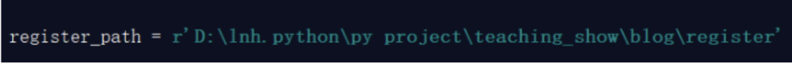
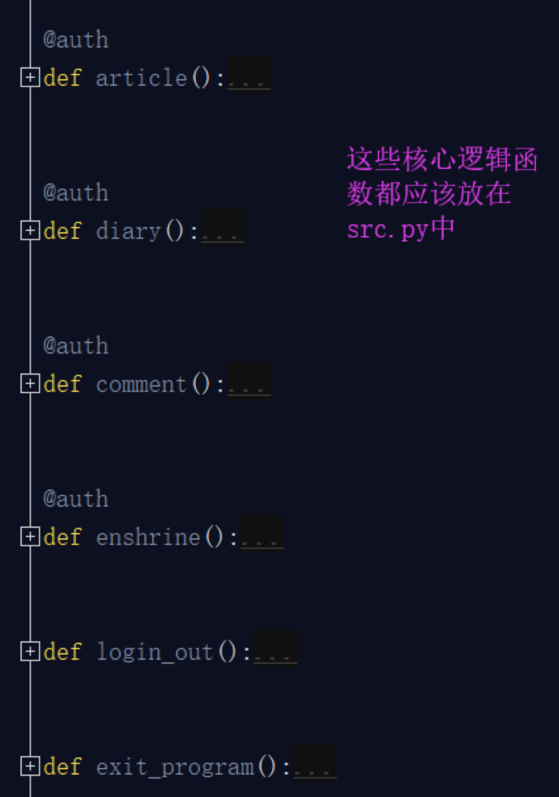
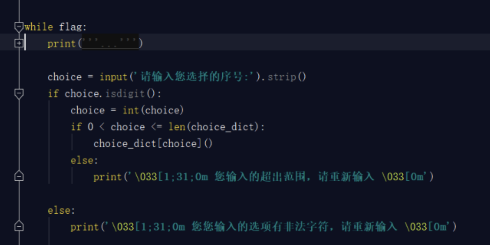
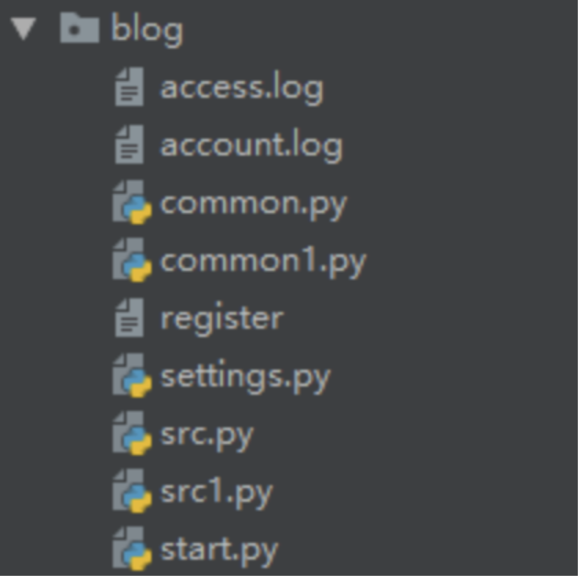
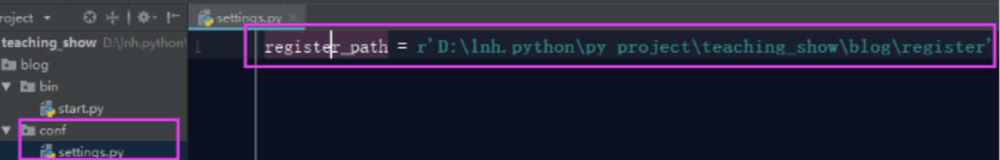
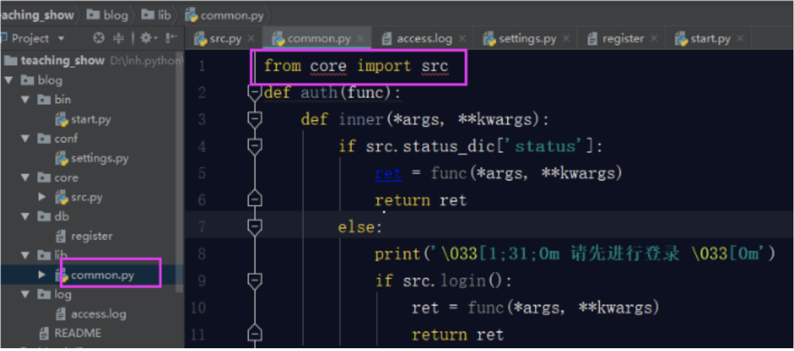
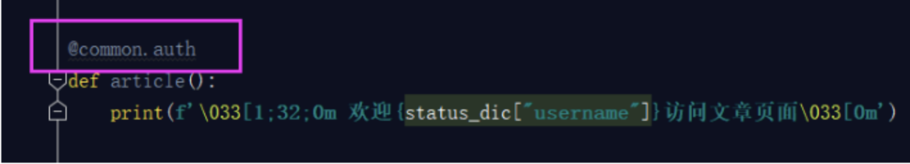
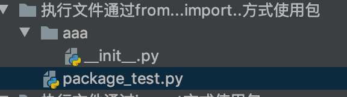

## 第三章: Python模块

#### 本章具体内容如下:

1. **自定义模块**
2. **模块一**
3. **模块二**
4. **软件开发规范**
5. **包**

本章主要是为大家讲解Python模块部分,众所周知，模块是python语言中的一大亮点，python语言开发效率高的主要原因就是因为模块的存在，模块就是将我们一些常用的功能封装到一个地方，随用随拿，避免我们重复造轮子，极大的提高了我们的开发效率，python内置的模块大概有200多个，而第三方模块高达6000+，并且都在持续更新，这几天我们只是学习web开发常用的十几种模块，后面也会接触学习到一些第三方模块，但这只是带大家入个门，剩下的非常多的模块我们可以在以后工作中遇到相应的需求之后在随学随用了，如果对python的模块有深入的兴趣的同学，可以通过网上资料或者看一些有关模块第三方库的书籍进行学习。推荐相关书籍：《python第三方库》,《python标准库》等。接下来我们就开始学习python的模块。


## 第一节: 自定义模块

#### 本节具体内容如下:

1. **模块的定义与分类**
2. **import导入**
3. **from ... import ... 导入**
4. **py文件的两种功能**
5. **模块的搜索路径**
6. **内置模块I**
   + time模块
   + datatime模块
   + random模块


#### 1. 模块的定义与分类

+ **模块是什么？**

  ​    这几天，我们进入模块的学习。在学习模块之前，我们首先要知道，什么是模块？

  ​    一个函数封装一个功能，你使用的软件可能就是由n多个函数组成的（先不考虑面向对象）。比如抖音这个软件，不可能将所有程序都写入一个文件，所以咱们应该将文件划分，这样其组织结构要好并且代码不冗余。假如分了10个文件，每个文件里面可能都有相同的功能（函数），怎么办？所以将这些相同的功能封装到一个文件中，那么这个存储着很多常用的功能的py文件，就是模块。 模块就是文件，存放一堆常用的函数，比如：我要在大草原上策马奔腾，应该怎么样？我应该骑马，你也要去浪，你是不是也要骑马。我们说一个函数就是一个功能，那么把一些常用的函数放在一个py文件中，这个文件就称之为模块，模块，就是一些列常用功能的集合体。


+ **为什么要使用模块?**

  + 从文件级别组织程序，更方便管理, 随着程序的发展，功能越来越多，为了方便管理，我们通常将程序分成一个个的文件，这样做程序的结构更清晰，这时我们不仅仅可以把这些文件当做脚本去执行，还可以把他们当做模块来导入到其他的模块中，实现了功能的重复利用

  + 拿来主义，提升开发效率 同样的原理，我们也可以下载别人写好的模块然后导入到自己的项目中使用，这种拿来主义，可以极大地提升我们的开发效率，避免重复造轮子.

    

+ **人们常说的脚本是什么？**

  如果你在终端上编写的代码运行完后,退出python解释器然后重新进入，那么你之前定义的函数或者变量都将丢失，因此我们通常将程序写到文件中以便永久保存下来，需要时就通过python test.py方式去执行，此时test.py被称为脚本script。

  所以，脚本就是一个python文件，比如你之前写的购物车，模拟博客园登录系统的文件等等。

  

+ **模块的分类**

  Python语言中，模块分为三类。

  ​    第一类：内置模块，也叫做**标准库**。此类模块就是python解释器给你提供的，比如我们之前见过的time模块,os模块。标准库的模块非常多（200多个，每个模块又有很多功能），我们这几天就讲常用的十几种，后面课程中还会陆续的讲到。

  ​    第二类：第三方模块，第三方库。一些python大神写的非常好用的模块，必须通过pip install 指令安装的模块，比如BeautfulSoup, Django,等等。大概有6000多个。

  ​    第三类：自定义模块。我们自己在项目中定义的一些模块。

  这几天，我们先学第一类和第三类模块，第二类模块会在我们并发编程开始逐渐的接触学习。

  今天，我们先讲第三类，自定义模块。

  我们先定义一个模块，定义一个模块其实很简单就是写一个文件，里面写一些代码（变量，函数）即可。此文件的名字为tbjx.py，文件内容如下：

  ```python
  print('from the tbjx.py')
  name = '太白金星'
  
  def read1():
      print('tbjx模块：',name)
  
  def read2():
      print('tbjx模块')
      read1()
  
  def change():
      global name
      name = 'barry'
  ```

#### 2. import

+ import 使用

  import 翻译过来是一个导入的意思。

  这里一定要给同学强调哪个文件执行文件，和哪个文件是被执行模块。   

  模块可以包含可执行的语句和函数的定义，这些语句的目的是初始化模块，它们只在模块名第一次遇到导入import语句时才执行（import语句是可以在程序中的任意位置使用的,且针对同一个模块import很多次,为了防止你重复导入，python的优化手段是：第一次导入后就将模块名加载到内存了，后续的import语句仅是对已经加载到内存中的模块对象增加了一次引用，不会重新执行模块内的语句），如下 import tbjx 只在第一次导入时才执行tbjx.py内代码,此处的显式效果是只打印一次'from the tbjx.py',当然其他的顶级代码也都被执行了,只不过没有显示效果.

  ```python
  import tbjx
  import tbjx
  import tbjx
  import tbjx
  import tbjx
  
  执行结果：只是打印一次：
  from the tbjx.py
  ```

  **重复导入会直接引用内存中已经加载好的结果**

  + 第一次导入模块执行三件事

    1. 创建一个以模块名命名的名称空间。

    2. 执行这个名称空间（即导入的模块）里面的代码。

    3. 通过此模块名. 的方式引用该模块里面的内容（变量，函数名，类名等）。 这个名字和变量名没什么区别，都是‘第一类的’，且使用tbjx名字的方式可以访问tbjx.py文件中定义的名字，tbjx.名字与test.py中的名字来自两个完全不同的地方。

  + 被导入模块有独立的名称空间

    ​    每个模块都是一个独立的名称空间，定义在这个模块中的函数，把这个模块的名称空间当做全局名称空间，这样我们在编写自己的模块时，就不用担心我们定义在自己模块中全局变量会在被导入时，与使用者的全局变量冲突。

    示例：

    ```python
    import tbjx
    name = 'alex'
    print(name)
    print(tbjx.name)
    '''
    from the tbjx.py
    alex
    太白金星
    '''
    
    def read1():
        print(666)
    tbjx.read1()
    '''
    from the tbjx.py
    tbjx模块： 太白金星
    '''
    
    name = '日天'
    tbjx.change()
    print(name)
    print(tbjx.name)
    '''
    from the tbjx.py
    日天
    barry
    '''
    ```

    **让同学们将上面的代码练习一下。**

  + 为模块起别名

    别名其实就是一个外号,我们小的时候，都喜欢给学生们起外号对吧。

    **1. 好处可以将很长的模块名改成很短,方便使用.**

    ```python
    import tbjx as t
    t.read1()
    ```

    **2. 有利于代码的扩展和优化。**

    ```python
    #mysql.py
    def sqlparse():
        print('from mysql sqlparse')
    #oracle.py
    def sqlparse():
        print('from oracle sqlparse')
    ```

    ```python
    #test.py
    db_type=input('>>: ')
    if db_type == 'mysql':
        import mysql as db
    elif db_type == 'oracle':
        import oracle as db
    
    db.sqlparse()
    ```

  + 导入多个模块

    ​    我们以后再开发过程中，免不了会在一个文件中，导入多个模块，推荐写法是一个一个导入。

    ```python
    import os,sys,json   # 这样写可以但是不推荐
    
    推荐写法
    
    import os
    import sys
    import json
    ```

    **多行导入：易于阅读 易于编辑 易于搜索 易于维护。**

  

#### 3. from ... import ...

- from ... import ... 使用

  ```python
  from ... import ... 的使用示例。
  
  from tbjx import name, read1
  print(name)
  read1()
  '''
  执行结果：
  from the tbjx.py
  太白金星
  tbjx模块： 太白金星
  '''
  ```

- from...import... 与import对比

  ​    唯一的区别就是：使用from...import...则是将span中的名字直接导入到当前的名称空间中，所以在当前名称空间中，直接使用名字就可以了、无需加前缀：tbjx.

  from...import...的方式有好处也有坏处

  ​    好处：使用起来方便了

  ​    坏处：容易与当前执行文件中的名字冲突

  示例演示：

  **1. 执行文件与模块同名的变量或者函数名，会有覆盖效果。**

  ```python
  name = 'oldboy'
  from tbjx import name, read1, read2
  print(name)  
  '''
  执行结果：
  太白金星
  '''
  ----------------------------------------
  from tbjx import name, read1, read2
  name = 'oldboy'
  print(name)  
  
  '''
  执行结果：
  oldboy
  '''
  ----------------------------------------
  def read1():
      print(666)
  from tbjx import name, read1, read2
  read1()
  
  '''
  执行结果：
  tbjx模块： 太白金星
  '''
  ----------------------------------------
  
  from tbjx import name, read1, read2
  def read1():
      print(666)
  read1()
  
  '''
  执行结果：
  666
  '''
  
  ```

  **2. 当前位置直接使用read1和read2就好了，执行时，仍然以tbjx.py文件全局名称空间**

  ```python
  #测试一：导入的函数read1，执行时仍然回到tbjx.py中寻找全局变量 'alex'
  #test.py
  from tbjx import read1
  name = 'alex'
  read1()
  '''
  执行结果:
  from the tbjx.py
  tbjx->read1->name = '太白金星'
  '''
  
  #测试二:导入的函数read2，执行时需要调用read1(),仍然会到tbjx.py中找
  #read1()
  
  #test.py
  from tbjx import read2
  def read1():
      print('==========')
  read2()
  
  '''
  执行结果:
  from the tbjx.py
  tbjx模块
  tbjx模块： 太白金星
  '''
  
  ```

  from … import也支持as

  通过这种方式引用模块也可以对模块进行改名。

  ```python
  from tbjx import read1 as read
  read()
  
  ```

- 一行导入多个

```python
from tbjx import read1,read2,name
```

- from ... import \*

  ​    from tbjx import *  把tbjx中所有的不是以下划线(_)开头的名字都导入到当前位置

  ​    大部分情况下我们的python程序不应该使用这种导入方式，因为*你不知道你导入什么名字，很有可能会覆盖掉你之前已经定义的名字。而且可读性极其的差，在交互式环境中导入时没有问题。

  可以使用**all**来控制*（用来发布新版本），在tbjx.py中新增一行

  ```python
  __all__=['name','read1'] #这样在另外一个文件中用from spam import *就只能导入列表中规定的两个名字
  ```

- 模块循环导入问题

  ​    模块循环/嵌套导入抛出异常的根本原因是由于在python中模块被导入一次之后，就不会重新导入，只会在第一次导入时执行模块内代码

  ​    在我们的项目中应该尽量避免出现循环/嵌套导入，如果出现多个模块都需要共享的数据，可以将共享的数据集中存放到某一个地方。在程序出现了循环/嵌套导入后的异常分析、解决方法如下（**了解，以后尽量避免**）

  示范文件内容如下

  ```python
  #创建一个m1.py
  print('正在导入m1')
  from m2 import y
  x='m1'
  
  #创建一个m2.py
  print('正在导入m2')
  from m1 import x
  y='m2'
  
  #创建一个run.py
  import m1
  
  #测试一
  执行run.py会抛出异常
  正在导入m1
  正在导入m2
  Traceback (most recent call last):
    File "/python项目/run.py", line 1, in <module>
      import m1
    File "/python项目/m1.py", line 2, in <module>
      from m2 import y
    File "/python项目/m2.py", line 2, in <module>
      from m1 import x
  ImportError: cannot import name 'x'
  
  #测试一结果分析
  先执行run.py--->执行import m1，开始导入m1并运行其内部代码--->打印内容"正在导入m1"
  --->执行from m2 import y 开始导入m2并运行其内部代码--->打印内容“正在导入m2”--->执行from m1 import x,由于m1已经被导入过了，所以不会重新导入，所以直接去m1中拿x，然而x此时并没有存在于m1中，所以报错
  
  #测试二:执行文件不等于导入文件，比如执行m1.py不等于导入了m1
  正在导入m1
  正在导入m2
  Traceback (most recent call last):
  正在导入m1
    File "/python项目/m1.py", line 2, in <module>
      from m2 import y
    File "/python项目/m2.py", line 2, in <module>
      from m1 import x
    File "/python项目/m1.py", line 2, in <module>
      from m2 import y
  ImportError: cannot import name 'y'
  
  
  #测试二分析
  执行m1.py，打印“正在导入m1”，执行from m2 import y ，导入m2进而执行m2.py内部代码--->打印"正在导入m2"，执行from m1 import x，此时m1是第一次被导入，执行m1.py并不等于导入了m1，于是开始导入m1并执行其内部代码--->打印"正在导入m1"，执行from m2 import y，由于m2已经被导入过了，所以无需继续导入而直接问m2要y，然而y此时并没有存在于m2中所以报错
  
  
  # 解决方法:
  方法一:导入语句放到最后
  #m1.py
  print('正在导入m1')
  x='m1'
  from m2 import y
  
  #m2.py
  print('正在导入m2')
  y='m2'
  from m1 import x
  
  方法二:导入语句放到函数中
  #m1.py
  print('正在导入m1')
  
  def f1():
      from m2 import y
      print(x,y)
  
  x = 'm1'
  
  # f1()
  #m2.py
  print('正在导入m2')
  
  def f2():
      from m1 import x
      print(x,y)
  
  y = 'm2'
  
  #run.py
  import m1
  
  m1.f1()
  ```
  
  

#### **4. py文件的两种功能**

编写好的一个python文件可以有两种用途：

1. 脚本，一个文件就是整个程序，用来被执行（比如你之前写的模拟博客园登录那个作业等）
2. 模块，文件中存放着一堆功能，用来被导入使用
   ​
   python为我们内置了全局变量\_\_name\_\_，
   当文件被当做脚本执行时：\_\_name\_\_ 等于'\_\_main\_\_'
   当文件被当做模块导入时：\_\_name\_\_等于模块名
   ​
   作用：用来控制.py文件在不同的应用场景下执行不同的逻辑（或者是在模块文件中测试代码）

```python
if __name__ == '__main__':
```

```python
print('from the tbjx.py')

__all__ = ['name', 'read1',]

name = '太白金星'

def read1():
   print('tbjx模块：',name)

def read2():
   print('tbjx模块')
   read1()

def change():
   global name
   name = '宝浪'
   
if __name__ == '__main__':  
   # 在模块文件中测试read1()函数
   # 此模块被导入时 __name__ == tbjx 所以不执行
   read1()
```


#### 5. 模块的搜索路径

当你引用一个模块时，不见得每次都可以import到：

当咱们导入同一个目录下的模块的时候就能够使用import成功,不是同一个目录下的导入就会报错。

​    Python中引用模块是按照一定的规则以及顺序去寻找的，这个查询顺序为：先从内存中已经加载的模块进行寻找，找不到再从内置模块中寻找，内置模块如果也没有，最后去sys.path路径中包含的模块中寻找。它只会按照这个顺序从这些指定的地方去寻找，如果最终都没有找到，那么就会报错。

​    **内存中已经加载的模块->内置模块->sys.path路径中包含的模块**

**模块的查找顺序**

1. 在第一次导入某个模块时（比如tbjx），会先检查该模块是否已经被加载到内存中（当前执行文件的名称空间对应的内存），如果有则直接引用（ps：python解释器在启动时会自动加载一些模块到内存中，可以使用sys.modules查看）
2. 如果没有，解释器则会查找同名的内置模块
3. 如果还没有找到就从sys.path给出的目录列表中依次寻找tbjx.py文件。

**需要特别注意的是：我们自定义的模块名不应该与系统内置模块重名。虽然每次都说，但是仍然会有人不停的犯错**

```python
#在初始化后，python程序可以修改sys.path,路径放到前面的优先于标准库被加载。

> > > import sys
> > > sys.path.append('/a/b/c/d')
> > > sys.path.insert(0,'/x/y/z') #排在前的目录，优先被搜索
> > > # 注意：搜索时按照sys.path中从左到右的顺序查找，位于前的优先被查找，sys.path中还可能包含.zip归档文件和.egg文件，python会把.zip归档文件当成一个目录去处理，

#首先制作归档文件：zip module.zip foo.py bar.py 
import sys
sys.path.append('module.zip')
import foo,bar

#也可以使用zip中目录结构的具体位置
sys.path.append('module.zip/lib/python')

#windows下的路径不加r开头，会语法错误
sys.path.insert(0,r'C:\Users\Administrator\PycharmProjects\a')

#至于.egg文件是由setuptools创建的包，这是按照第三方python库和扩展时使用的一种常见格式，.egg文件实际上只是添加了额外元数据(如版本号，依赖项等)的.zip文件。

#需要强调的一点是：只能从.zip文件中导入.py，.pyc等文件。使用C编写的共享库和扩展块无法直接从.zip文件中加载（此时setuptools等打包系统有时能提供一种规避方法），且从.zip中加载文件不会创建.pyc或者.pyo文件，因此一定要事先创建他们，来避免加载模块是性能下降。
# pyc文件，是python编译后的字节码（bytecode）文件。
# pyo文件，是python编译优化后的字节码文件。
```

下一节我们就开始讲解Python常用的内置模块，由于Python常用的模块非常多，我们不可能将所有的模块都讲完， 所以只针对于工作中经常用到模块进行讲解。剩下的模块可以在课余时间自学。


#### 6. 内置模块

+ **time模块**

  + **引子**

    time翻译过来就是时间,这个模块是与时间相关的模块，那么言外之意，如果我们在工作中遇到了对时间的需求（比如获取当前时间，获取时间戳等等）就要先想到time模块。

    

  + **三种形式**

    time模块中对于时间可以分成三种形式:

    + **时间戳**

       通常来说，时间戳表示的是从1970年1月1日00:00:00开始按秒计算的偏移量。这个是实时变化的。我们运行“type(time.time())”，返回的是float类型。

    + **格式化字符串时间**:

       格式化的时间字符串(Format String)： ‘1999-12-06’

      ```python
      python中时间日期格式化符号：
      	%y 两位数的年份表示（00-99）
      	%Y 四位数的年份表示（000-9999）
      	%m 月份（01-12）
      	%d 月内中的一天（0-31）
      	%H 24小时制小时数（0-23）
      	%I 12小时制小时数（01-12）
      	%M 分钟数（00=59）
      	%S 秒（00-59）
      	%a 本地简化星期名称
      	%A 本地完整星期名称
      	%b 本地简化的月份名称
      	%B 本地完整的月份名称
      	%c 本地相应的日期表示和时间表示
      	%j 年内的一天（001-366）
      	%p 本地A.M.或P.M.的等价符
      	%U 一年中的星期数（00-53）星期天为星期的开始
      	%w 星期（0-6），星期天为星期的开始
      	%W 一年中的星期数（00-53）星期一为星期的开始
      	%x 本地相应的日期表示
      	%X 本地相应的时间表示
      	%Z 当前时区的名称
      	%% %号本身
      **上面这些在课上简单的练习几个就行。**
      ```

    + **结构化时间**

      元组(struct_time) struct_time元组共有9个元素共九个元素:(年，月，日，时，分，秒，一周中的第几天，一年中第几天, 是否为夏令时）

    首先，我们先导入time模块，来认识一下python中表示时间的几种格式：

    ```python
    import time
    # 时间戳
    print(time.time())  # 1567568068.612113
    
    # 字符串格式化时间
    print(time.strftime('%Y-%m-%d %H:%M:%S'))  # 2019-09-04 11:36:54
    
    # 结构化时间
    print(time.localtime())  # time.struct_time(tm_year=2019, tm_mon=9, tm_mday=4, tm_hour=11, tm_min=37, tm_sec=45, tm_wday=2, tm_yday=247, tm_isdst=0)
    ```

    **小结**：

    ​	时间戳是计算机能够识别的时间；时间字符串是人能够看懂的时间；元组则是用来操作时间的，时间模块我们就是学会如何获取当前的时间，以及三种时间之间的转化就行了。

    

  + **时间格式转换**

    

    ```python
    import time
    # 格式化时间 ---->  结构化时间
    ft = time.strftime('%Y/%m/%d %H:%M:%S')
    st = time.strptime(ft,'%Y/%m/%d %H:%M:%S')
    print(st)
    # 结构化时间 ---> 时间戳
    t = time.mktime(st)
    print(t)
    
    # 时间戳 ----> 结构化时间
    t = time.time()
    st = time.localtime(t)
    print(st)
    # 结构化时间 ---> 格式化时间
    ft = time.strftime('%Y/%m/%d %H:%M:%S',st)
    print(ft)
    ```
  
    还有另一种转换方式，只是转化成的格式化时间是固定的格式，不能自定制，但是可以做到结构化时间与时间戳直接转化成格式化时间，省去了中间的一些步骤。
    
    
    
    ```python
    # 时间戳转化成格式化时间
    t = time.time()
    ft = time.ctime(t)
    print(ft)
    
    # 结构化时间转化成格式化时间
    st = time.localtime()
    ft = time.asctime(st)
    print(ft)
    ```
    
    
  
+ **datatime模块**

  此模块也是与时间相关的模块，他提供的功能更广泛一些，具体与time模块的区别，我下面会有具体的总结。

  + **获取当前日期和时间**

  ```python
  from datetime import datetime
  print(datetime.now())
  '''
  结果:2018-12-04 21:07:48.734886
  '''
  ```

  + **获取指定日期和时间**

  要指定某个日期和时间，我们直接用参数构造一个`datetime`：

  ```python
  from datetime import datetime
  
  dt = datetime(2018,5,20,13,14)
  print(dt)
  
  '''
  结果:2018-05-20 13:14:00
  '''
  ```

  + **datetime与时间戳的转换**

  ```python
  from datetime import datetime
  
  dt = datetime.now()
  new_timestamp = dt.timestamp()
  print(new_timestamp)
  
  '''
  结果:1543931750.415896
  '''
  
  import time
  from datetime import datetime
  
  new_timestamp = time.time()
  print(datetime.fromtimestamp(new_timestamp))
  ```

  + **str与datetime的转换**

  很多时候，用户输入的日期和时间是字符串，要处理日期和时间，首先必须把str转换为datetime。转换方法是通过`datetime.strptime()`实现，需要一个日期和时间的格式化字符串：

  ```python
  from datetime import datetime
  
  t = datetime.strptime('2018-4-1 00:00','%Y-%m-%d %H:%M')
  print(t)
  '''
  结果: 2018-04-01 00:00:00
  '''
  
  	如果已经有了datetime对象，要把它格式化为字符串显示给用户，就需要转换为str，转换方法是通过`strftime()`实现的，同样需要一个日期和时间的格式化字符串：
  
  ​```
  from datetime import datetime
  now = datetime.now()
  print(now.strftime('%a, %b %d %H:%M'))
  Mon, May 05 16:28
  ​```
  ```

  + **datetime加减**

  对日期和时间进行加减实际上就是把datetime往后或往前计算，得到新的datetime。加减可以直接用`+`和`-`运算符，不过需要导入`timedelta` [ˈdeltə]这个类：

  ```python
  from datetime import datetime, timedelta
  now = datetime.now()
  now + timedelta(hours=10)  # 10小时后
  now - timedelta(days=-1)  # 一天前
  now + timedelta(days=2, hours=12)  # 2天12小时之后
  ```

  可见，使用`timedelta`你可以很容易地算出前几天和后几天的时刻。

  + **指定datetime时间**

  ```python
  current_time = datetime.datetime.now()
  print(current_time.replace(year=1977))  # 直接调整到1977年 replace[rɪˈpleɪs] 
  print(current_time.replace(month=1))  # 直接调整到1月份
  print(current_time.replace(year=1989,month=4,day=25))  # 1989-04-25 18:49:05.898601
  ```

+ 小结：

  + time模块它提供的功能时更加接近于操作系统层面，部分函数都是与平台相关的，不同平台可能会有不同的效果，另外一点：由于time模块是基于Unix Timestamp,所以其所能表述的日期范围被限定在1970～2038年之间。

  + datatime模块比time模块更加高级，可以理解为datetime模块基于time模块进行的封装。提供了更多实用的函数。

    

## 第二节:  内置模块

#### 本节具体内容如下:

1. **序列化**
2. **os**
3. **sys**
4. **random**
5. **collections**


#### 1. 序列化模块

+ **引子**

  我们今天学习下序列化,什么是序列化呢? 序列化的本质就是将一种数据结构（如字典、列表)等转换成一个特殊的序列（字符串或者bytes）的过程就叫做序列化。那么有同学就会问了，为什么要转化成这个序列，我们不是学过么？

  ```python
  dic = {'name': '太白金星'}
  ret = str(dic)
  print(ret,type(ret))  
  ```

  首先你要看清楚！我说的是一个特殊的序列，而不是我们常用的str这种字符串。

+ **为什么要有序列化模块？**

  其次，将这个数据结构转化成这个特殊的序列有什么用呢？ 这个才是序列化的关键所在，这个特殊的序列大有用处。举例说明：

  比如，你的程序中需要一个字典类型的数据存放你的个人信息：

  ```python
   dic = {'username':'太白', 'password': 123,'login_status': True}
  ```

  　　你的程序中有一些地方都需要使用这个dic数据，登录时会用到，注册时也会用到。那么我们之前就是将这个dic写在全局里，但是这样是不合理的，应该是将这数据写入一个地方存储（还没有学数据库）先存放在一个文件中，那么程序中哪里需要这个数据了，你就读取文件取出你需要的信息即可。**那么有没有什么问题？** 你将这个字典直接写入文件是不可以的，必须转化成字符串的形式，而且你读取出来也是字符串形式的字典（可以用代码展示）。

  那么你拿到一个str(dic)有什么用？他是根本转化不成dic的（不能用eval很危险），所以很不方便。那么这时候序列化模块就起到作用了，如果你写入文件中的字符串是一个序列化后的特殊的字符串，那么当你从文件中读取出来，是可以转化回原数据结构的。这个就很牛逼了。

  下面说的是json序列化，pickle序列化有所不同。

  json序列化除了可以解决写入文件的问题，还可以解决网络传输的问题，比如你将一个list数据结构通过网络传给另个开发者，那么你不可以直接传输，之前我们说过，你要想传输出去必须用bytes类型。但是bytes类型只能与字符串类型互相转化，它不能与其他数据结构直接转化，所以，你只能将list ---> 字符串 ---> bytes 然后发送，对方收到之后，在decode() 解码成原字符串。此时这个字符串不能是我们之前学过的str那种字符串，因为它不能反解，必须要是这个特殊的字符串，他可以反解成list 这样开发者之间就可以借助网络互传数据了，不仅仅是开发者之间，你要借助网络爬取数据这些数据多半是这种特殊的字符串，你接受到之后，在反解成你需要的数据类型。

  对于这个序列化模块我们做一个小小总结：

  序列化模块就是将一个常见的数据结构转化成一个特殊的序列，并且这个特殊的序列还可以反解回去。它的主要用途：文件读写数据，网络传输数据。

+ **序列化模块分类**

  Python中这种序列化模块有三种：

  + json模块 （**重点**）
    + 不同语言都遵循的一种数据转化格式，即不同语言都使用的特殊字符串。（比如Python的一个列表[1, 2, 3]利用json转化成特殊的字符串，然后在编码成bytes发送给php的开发者，php的开发者就可以解码成特殊的字符串，然后在反解成原数组(列表): [1, 2, 3]）
    + json序列化只支持部分Python数据结构：dict,list, tuple,str,int, float,True,False,None
  + pickle模块 [ˈpɪkl] 泡菜
    + 只能是Python语言遵循的一种数据转化格式，只能在python语言中使用。
    + 支持Python所有的数据类型包括实例化对象。
  + shelve模块 [ʃelv] 搁置
    + 类似于字典的操作方式去操作特殊的字符串（不讲，可以课下了解）。

当然序列化模块中使用最多的的就是json模块，那么接下来，我们讲一下json与pickle模块。

+ **json模块**

  **json模块是将满足条件的数据结构转化成特殊的字符串，并且也可以反序列化还原回去。**

  上面介绍我已经说过了，序列化模块总共只有两种用法，要不就是用于网络传输的中间环节，要不就是文件存储的中间环节，所以json模块总共就有两对四个方法：

  ​    **用于网络传输：dumps、loads**

  ​    **用于文件写读：dump、load**

  + dumps、loads

    + 将字典类型转换成字符串类型

    ```python
    import json
    dic = {'k1':'v1','k2':'v2','k3':'v3'}
    str_dic = json.dumps(dic)  #序列化：将一个字典转换成一个字符串
    print(type(str_dic),str_dic)  #<class 'str'> {"k3": "v3", "k1": "v1", "k2": "v2"}
    #注意，json转换完的字符串类型的字典中的字符串是由""表示的
    ```

    + 将字符串类型的字典转换成字典类型

    ```python
    import json
    dic2 = json.loads(str_dic)  #反序列化：将一个字符串格式的字典转换成一个字典
    #注意，要用json的loads功能处理的字符串类型的字典中的字符串必须由""表示
    print(type(dic2),dic2)  #<class 'dict'> {'k1': 'v1', 'k2': 'v2', 'k3': 'v3'}
    ```

    + 还支持列表类型

    ```python
    list_dic = [1,['a','b','c'],3,{'k1':'v1','k2':'v2'}]
    str_dic = json.dumps(list_dic) #也可以处理嵌套的数据类型 
    print(type(str_dic),str_dic) #<class 'str'> [1, ["a", "b", "c"], 3, {"k1": "v1", "k2": "v2"}]
    list_dic2 = json.loads(str_dic)
    print(type(list_dic2),list_dic2) #<class 'list'> [1, ['a', 'b', 'c'], 3, {'k1': 'v1', 'k2': 'v2'}]
    ```

  + dump、load

    + 将对象转换成字符串写入到文件当中

    ```python
    import json
    f = open('json_file.json','w')
    dic = {'k1':'v1','k2':'v2','k3':'v3'}
    json.dump(dic,f)  #dump方法接收一个文件句柄，直接将字典转换成json字符串写入文件
    f.close()
    # json文件也是文件，就是专门存储json字符串的文件。
    ```

    + 将文件中的字符串类型的字典转换成字典

    ```python
    import json
    f = open('json_file.json')
    dic2 = json.load(f)  #load方法接收一个文件句柄，直接将文件中的json字符串转换成数据结构返回
    f.close()
    print(type(dic2),dic2)
    ```

  + **其他参数说明**

    `ensure_ascii`:，当它为True的时候，所有非ASCII码字符显示为\uXXXX序列，只需在dump时将ensure_ascii设置为False即可，此时存入json的中文即可正常显示。  ensure  [ɪnˈʃʊr] 确保

    `separators`：分隔符，实际上是(item_separator, dict_separator)的一个元组，默认的就是(,,:)；这表示dictionary内keys之间用“,”隔开，而KEY和value之间用“：”隔开。  separators  [ˈsɛpəˌreɪtərz] 分离器

    `sort_keys`：将数据根据keys的值进行排序。 剩下的自己看源码研究

  + **json序列化存储多个数据到同一个文件中**

    对于json序列化，存储多个数据到一个文件中是有问题的，默认一个json文件只能存储一个json数据，但是也可以解决，举例说明：

    ```python
    # 对于json 存储多个数据到文件中
    dic1 = {'name':'oldboy1'}
    dic2 = {'name':'oldboy2'}
    dic3 = {'name':'oldboy3'}
    f = open('序列化',encoding='utf-8',mode='a')
    json.dump(dic1,f)
    json.dump(dic2,f)
    json.dump(dic3,f)
    f.close()
    
    f = open('序列化',encoding='utf-8')
    ret = json.load(f)
    ret1 = json.load(f)
    ret2 = json.load(f)
    print(ret)
    ```

    上边的代码会报错,解决方法:

    ```python
    dic1 = {'name':'oldboy1'}
    dic2 = {'name':'oldboy2'}
    dic3 = {'name':'oldboy3'}
    f = open('序列化',encoding='utf-8',mode='a')
    str1 = json.dumps(dic1)
    f.write(str1+'\n')
    str2 = json.dumps(dic2)
    f.write(str2+'\n')
    str3 = json.dumps(dic3)
    f.write(str3+'\n')
    f.close()
    
    f = open('序列化',encoding='utf-8')
    for line in f:
        print(json.loads(line))
    ```

+ **pickle模块**

  **pickle模块是将Python所有的数据结构以及对象等转化成bytes类型，然后还可以反序列化还原回去。**

  ​    刚才也跟大家提到了pickle模块，pickle模块是只能Python语言识别的序列化模块。如果把序列化模块比喻成全世界公认的一种交流语言，也就是标准的话，json就是像是英语，全世界（python，java，php，C，等等）都遵循这个标准。而pickle就是中文，只有中国人（python）作为第一交流语言。

  ​    既然只是Python语言使用，那么它支持Python所有的数据类型包括后面我们要讲的实例化对象等，它能将这些所有的数据结构序列化成特殊的bytes，然后还可以反序列化还原。使用上与json几乎差不多，也是两对四个方法。

  ​    **用于网络传输：dumps、loads**

  ​    **用于文件写读：dump、load**

  + **dumps、loads**

  ```python
  import pickle
  dic = {'k1':'v1','k2':'v2','k3':'v3'}
  str_dic = pickle.dumps(dic)
  print(str_dic)  # bytes类型
  
  dic2 = pickle.loads(str_dic)
  print(dic2)    #字典
  ```

  ```python
  # 还可以序列化对象
  import pickle
  def func():
      print(666)
      
  ret = pickle.dumps(func)
  print(ret,type(ret))  # b'\x80\x03c__main__\nfunc\nq\x00.' <class 'bytes'>
  f1 = pickle.loads(ret)  # f1得到 func函数的内存地址
  f1()  # 执行func函数
  ```

  + **dump、load**

  ```python
  dic = {(1,2):'oldboy',1:True,'set':{1,2,3}}
  f = open('pick序列化',mode='wb')
  pickle.dump(dic,f)
  f.close()
  with open('pick序列化',mode='wb') as f1:
      pickle.dump(dic,f1)
  ```

  + **pickle序列化存储多个数据到一个文件中**

  ```python
  dic1 = {'name':'oldboy1'}
  dic2 = {'name':'oldboy2'}
  dic3 = {'name':'oldboy3'}
  
  f = open('pick多数据',mode='wb')
  pickle.dump(dic1,f)
  pickle.dump(dic2,f)
  pickle.dump(dic3,f)
  f.close()
  
  f = open('pick多数据',mode='rb')
  while True:
      try:
          print(pickle.load(f))
      except EOFError:
          break
  f.close()
  ```

  ​	这时候机智的你又要说了，既然pickle如此强大，为什么还要学json呢？这里我们要说明一下，json是一种所有的语言都可以识别的数据结构。如果我们将一个字典或者序列化成了一个json存在文件里，那么java代码或者js代码也可以拿来用。但是如果我们用pickle进行序列化，其他语言就不能读懂这是什么了～所以，如果你序列化的内容是列表或者字典，我们非常推荐你使用json模块，但如果出于某种原因你不得不序列化其他的数据类型，而未来你还会用python对这个数据进行反序列化的话，那么就可以使用pickle。

  

#### **2. os模块**

os模块是与操作系统交互的一个接口,它提供的功能多与工作目录，路径，文件等相关。接下来这些方法我会带着大家演示一遍，重点的一些方法最好记住，剩下的记好笔记，以后需要时随时查阅即可。

讲这些方法前先给大家普及一下专用名词：

目录指的是:文件夹 当前目录，工作目录，父级目录：指的都是一个，就是本文件所在的文件夹。

接下来带着学生讲解下面的这些方法：**按照星的等级划分,三颗星是需要记住的**

当前执行这个python文件的工作目录相关的工作路径

```python
os.getcwd() 获取当前工作目录，即当前python脚本工作的目录路径  ** 
os.chdir("dirname")  改变当前脚本工作目录；相当于shell下cd  **
os.curdir  返回当前目录: ('.')  **
os.pardir  获取当前目录的父目录字符串名：('..') **
```

文件夹相关

```python
os.makedirs('dirname1/dirname2')    可生成多层递归目录  ***
os.removedirs('dirname1') 若目录为空，则删除，并递归到上一级目录，如若也为空，则删除，依此类推 ***
os.mkdir('dirname')    生成单级目录；相当于shell中mkdir dirname ***
os.rmdir('dirname')    删除单级空目录，若目录不为空则无法删除，报错；相当于shell中rmdir dirname ***
os.listdir('dirname')    列出指定目录下的所有文件和子目录，包括隐藏文件，并以列表方式打印 **
```

文件相关

```python
os.remove()  删除一个文件  ***
os.rename("oldname","newname")  重命名文件/目录  ***
os.stat('path/filename')  获取文件/目录信息 **
```

路径相关

```python
os.path.abspath(path) 返回path规范化的绝对路径  ***
os.path.split(path) 将path分割成目录和文件名二元组返回 ***
os.path.dirname(path) 返回path的目录。其实就是os.path.split(path)的第一个元素  **
os.path.basename(path) 返回path最后的文件名。如果path以／或\结尾，那么就会返回空值，即os.path.split(path)的第二个元素。 **
os.path.exists(path)  如果path存在，返回True；如果path不存在，返回False  ***
os.path.isabs(path)  如果path是绝对路径，返回True  **
os.path.isfile(path)  如果path是一个存在的文件，返回True。否则返回False  ***
os.path.isdir(path)  如果path是一个存在的目录，则返回True。否则返回False  ***
os.path.join(path1[, path2[, ...]])  将多个路径组合后返回，第一个绝对路径之前的参数将被忽略 ***
os.path.getatime(path)  返回path所指向的文件或者目录的最后访问时间  **
os.path.getmtime(path)  返回path所指向的文件或者目录的最后修改时间  **
os.path.getsize(path) 返回path的大小 ***

```

操作系统相关(了解)

```python
os.sep    输出操作系统特定的路径分隔符，win下为"\\",Linux下为"/" *
os.linesep    输出当前平台使用的行终止符，win下为"\t\n",Linux下为"\n" 
os.pathsep    输出用于分割文件路径的字符串 win下为;,Linux下为: *
os.name    输出字符串指示当前使用平台。win->'nt'; Linux->'posix' *
# 和执行系统命令相关
os.system("bash command")  运行shell命令，直接显示  **
os.popen("bash command).read()  运行shell命令，获取执行结果  **
os.environ  获取系统环境变量  **

```

os.stat('path/filename') 获取文件/目录信息 的结构说明(了解)

```python
stat 结构:
st_mode: inode 保护模式
st_ino: inode 节点号。
st_dev: inode 驻留的设备。
st_nlink: inode 的链接数。
st_uid: 所有者的用户ID。
st_gid: 所有者的组ID。
st_size: 普通文件以字节为单位的大小；包含等待某些特殊文件的数据。
st_atime: 上次访问的时间。
st_mtime: 最后一次修改的时间。
st_ctime: 由操作系统报告的"ctime"。在某些系统上（如Unix）是最新的元数据更改的时间，在其它系统上（如Windows）是创建时间（详细信息参见平台的文档）。

```


#### 3. **sys模块**

sys模块是与python解释器交互的一个接口，这个模块功能不是很多，练习一遍就行。

```python
sys.argv           命令行参数List，第一个元素是程序本身路径
sys.exit(n)        退出程序，正常退出时exit(0),错误退出sys.exit(1)
sys.version        获取Python解释程序的版本信息
sys.path           返回模块的搜索路径，初始化时使用PYTHONPATH环境变量的值  ***
sys.platform       返回操作系统平台名称
```


#### 4. random模块

+ 引子

  random  [ˈrændəm] 模块是一个随机模块，生活中经常遇到随机的场景，彩票，抓阄，打牌，等等，以后你的代码中如果遇到需要随机的需求：随机验证码，发红包等等，那么首先要想到的是random模块。

+ 代码示例

  ```python
  >>> import random
  #随机小数
  >>> random.random()      # 大于0且小于1之间的小数
  0.7664338663654585
  >>> random.uniform(1,3) #大于1小于3的小数
  1.6270147180533838
  
  #随机整数
  >>> random.randint(1,5)  # 大于等于1且小于等于5之间的整数
  >>> random.randrange(1,10,2) # 大于等于1且小于10之间的奇数
  
  
  #随机选择一个返回
  >>> random.choice([1,'23',[4,5]])  # #1或者23或者[4,5]
  #随机选择多个返回，返回的个数为函数的第二个参数
  
  >>> random.sample([1,'23',[4,5]],2) # #列表元素任意2个组合
  [[4, 5], '23']
  
  #打乱列表顺序
  >>> item=[1,3,5,7,9]
  >>> random.shuffle(item) # 打乱次序
  >>> item
  [5, 1, 3, 7, 9]
  >>> random.shuffle(item)
  >>> item
  [5, 9, 7, 1, 3]
  ```

+ 练习题：生成随机验证码。

  

#### 5. collections模块

**简单了解**

在内置数据类型（dict、list、set、tuple）的基础上，collections [kəˈlɛkʃənz] 收藏 模块还提供了几个额外的数据类型：Counter、deque //dei'k//、defaultdict、namedtuple和OrderedDict等。

1. namedtuple: 生成可以使用名字来访问元素内容的tuple

2. deque: 双端队列，可以快速的从另外一侧追加和推出对象

3. Counter: 计数器，主要用来计数

4. OrderedDict: 有序字典

5. defaultdict: 带有默认值的字典

- namedtuple

  我们知道tuple可以表示不变数据，例如，一个点的二维坐标就可以表示成：

  ```
  p = (1, 2)
  ```

  但是，看到(1, 2)，很难看出这个tuple是用来表示一个坐标的。

  这时，namedtuple就派上了用场：

  ```python
  from collections import namedtuple
  Point = namedtuple('Point', ['x', 'y'])
  p = Point(1, 2)
  print(p)
  
  ```

  结果：Point(x=1, y=2)

  类似的，如果要用坐标和半径表示一个圆，也可以用namedtuple定义：

  ```python
  namedtuple('名称', [属性list]):
  Circle = namedtuple('Circle', ['x', 'y', 'r'])
  
  ```

- deque

  使用list存储数据时，按索引访问元素很快，但是插入和删除元素就很慢了，因为list是线性存储，数据量大的时候，插入和删除效率很低。

  deque是为了高效实现插入和删除操作的双向列表，适合用于队列和栈：

  ```python
  from collections import deque
  q = deque(['a', 'b', 'c'])
  q.append('x')
  q.appendleft('y')
  print(q)
  # deque(['y', 'a', 'b', 'c', 'x'])
  
  ```

  deque除了实现list的append()和pop()外，还支持appendleft()和popleft()，这样就可以非常高效地往头部添加或删除元素。

- OrderedDict

  使用dict时，Key是无序的。在对dict做迭代时，我们无法确定Key的顺序。

  如果要保持Key的顺序，可以用OrderedDict：

  ```python
  from collections import OrderedDict
  d = dict([('a', 1), ('b', 2), ('c', 3)]) # 另一种定义字典的方式
  print(d)
  # 结果:
  {'a': 1, 'c': 3, 'b': 2}
  
  od = OrderedDict([('a', 1), ('b', 2), ('c', 3)])
  print(od)
  # 结果:
  OrderedDict([('a', 1), ('b', 2), ('c', 3)])
  
  ```

  注意，OrderedDict的Key会按照插入的顺序排列，不是Key本身排序：

  ```python
  >>> od = OrderedDict()
  >>> od['z'] = 1
  >>> od['y'] = 2
  >>> od['x'] = 3
  >>> od.keys() # 按照插入的Key的顺序返回
  ['z', 'y', 'x']
  
  ```

- defaultdict

  有如下值集合 [11,22,33,44,55,66,77,88,99,90...]，将所有大于 66 的值保存至字典的第一个key中，将小于 66 的值保存至第二个key的值中。

  即： {'k1': 大于66 , 'k2': 小于66}

  ```python
  li = [11,22,33,44,55,77,88,99,90]
  result = {}
  for row in li:
      if row > 66:
          if 'key1' not in result:
              result['key1'] = []
          result['key1'].append(row)
      else:
          if 'key2' not in result:
              result['key2'] = []
          result['key2'].append(row)
  print(result)
  
  
  from collections import defaultdict
  values = [11, 22, 33,44,55,66,77,88,99,90]
  my_dict = defaultdict(list)
  
  for value in  values:
      if value>66:
          my_dict['k1'].append(value)
      else:
          my_dict['k2'].append(value)
  
  ```

  使用dict时，如果引用的Key不存在，就会抛出KeyError。如果希望key不存在时，返回一个默认值，就可以用defaultdict：

  ```python
  from collections import defaultdict
  dd = defaultdict(lambda: 'N/A')
  dd['key1'] = 'abc'
   # key1存在
  print(dd['key1'])
  dd['key2'] # key2不存在，返回默认值
  print(dd['key2'])
  
  ```

- Counter

  Counter类的目的是用来跟踪值出现的次数。它是一个无序的容器类型，以字典的键值对形式存储，其中元素作为key，其计数作为value。计数值可以是任意的Integer（包括0和负数）。Counter类和其他语言的bags或multisets很相似。

  ```python
  c = Counter('abcdeabcdabcaba')
  print c
  输出：Counter({'a': 5, 'b': 4, 'c': 3, 'd': 2, 'e': 1})
  ```

  

## 第三节:  软件开发规范

#### 本节具体内容如下:

1. **软件的开发规范**
2. **按照项目目录结构,规范博客园系统**
3. **关于README的内容**
4. **内置模块III :hashlib模块**


#### 1.  软件的开发规范

+ **什么是开发规范?为什么要有开发规范呢?**

  你现在包括之前写的一些程序，所谓的'项目'，都是在一个py文件下完成的，代码量撑死也就几百行，你认为没问题，挺好。但是真正的后端开发的项目，系统等，少则几万行代码，多则十几万，几十万行代码，你全都放在一个py文件中行么？当然你可以说，只要能实现功能即可。咱们举个例子，如果你的衣物只有三四件，那么你随便堆在橱柜里，没问题，咋都能找到，也不显得特别乱，但是如果你的衣物，有三四十件的时候，你在都堆在橱柜里，可想而知，你找你穿过三天的袜子，最终从你的大衣口袋里翻出来了，这是什么感觉和心情......

  软件开发，规范你的项目目录结构，代码规范，遵循PEP8规范等等，让你更加清晰滴，合理滴开发。

  那么接下来我们以博客园系统的作业举例，将我们之前在一个py文件中的所有代码，整合成规范的开发。

  首先我们看一下，这个是我们之前的目录结构（简化版）：

  

  py文件的具体代码如下：

  ```python
  status_dic = {
      'username': None,
      'status': False,
  }
  flag = True
  
  def login():
      i = 0
      with open('register', encoding='utf-8') as f1:
          dic = {i.strip().split('|')[0]: i.strip().split('|')[1] for i in f1}
      while i < 3:
          username = input('请输入用户名：').strip()
          password = input('请输入密码：').strip()
          if username in dic and dic[username] == password:
              print('登录成功')
              return True
          else:
              print('用户名密码错误，请重新登录')
              i += 1
  
  
  def register():
      with open('register', encoding='utf-8') as f1:
          dic = {i.strip().split('|')[0]: i.strip().split('|')[1] for i in f1}
      while 1:
          print('\033[1;45m 欢迎来到注册页面 \033[0m')
          username = input('请输入用户名：').strip()
          if not username.isalnum():
              print('\033[1;31;0m 用户名有非法字符，请重新输入 \033[0m')
              continue
          if username in dic:
              print('\033[1;31;0m 用户名已经存在，请重新输入 \033[0m')
              continue
          password = input('请输入密码：').strip()
          if 6 <= len(password) <= 14:
              with open('register', encoding='utf-8', mode='a') as f1:
                  f1.write(f'\n{username}|{password}')
              status_dic['username'] = str(username)
              status_dic['status'] = True
              print('\033[1;32;0m 恭喜您，注册成功！已帮您成功登录~ \033[0m')
              return True
          else:
              print('\033[1;31;0m 密码长度超出范围，请重新输入 \033[0m')
  
  
  def auth(func):
      def inner(*args, **kwargs):
          if status_dic['status']:
              ret = func(*args, **kwargs)
              return ret
          else:
              print('\033[1;31;0m 请先进行登录 \033[0m')
              if login():
                  ret = func(*args, **kwargs)
                  return ret
      
      return inner
  
  
  @auth
  def article():
      print(f'\033[1;32;0m 欢迎{status_dic["username"]}访问文章页面\033[0m')
  
  
  @auth
  def diary():
      print(f'\033[1;32;0m 欢迎{status_dic["username"]}访问日记页面\033[0m')
  
  
  @auth
  def comment():
      print(f'\033[1;32;0m 欢迎{status_dic["username"]}访问评论页面\033[0m')
  
  
  @auth
  def enshrine():
      print(f'\033[1;32;0m 欢迎{status_dic["username"]}访问收藏页面\033[0m')
  
  
  def login_out():
      status_dic['username'] = None
      status_dic['status'] = False
      print('\033[1;32;0m 注销成功 \033[0m')
  
  
  def exit_program():
      global flag
      flag = False
      return flag
  
  
  choice_dict = {
      1: login,
      2: register,
      3: article,
      4: diary,
      5: comment,
      6: enshrine,
      7: login_out,
      8: exit_program,
  }
  
  
  while flag:
      print('''
      欢迎来到博客园首页
      1:请登录
      2:请注册
      3:文章页面
      4:日记页面
      5:评论页面
      6:收藏页面
      7:注销
      8:退出程序''')
      
      choice = input('请输入您选择的序号:').strip()
      if choice.isdigit():
          choice = int(choice)
          if 0 < choice <= len(choice_dict):
              choice_dict[choice]()
          else:
              print('\033[1;31;0m 您输入的超出范围，请重新输入 \033[0m')
      
      else:
          print('\033[1;31;0m 您您输入的选项有非法字符，请重新输入 \033[0m')
  ```

  此时我们是将所有的代码都写到了一个py文件中，如果代码量多且都在一个py文件中，那么对于代码结构不清晰，不规范，运行起来效率也会非常低。所以我们接下来一步一步的修改：

**1. 程序配置.**


   你项目中所有的有关文件的操作出现几处，都是直接写的register[ˈredʒɪstər]（登记）相对路径，如果说这个register注册表路径改变了，或者你改变了register注册表的名称，那么相应的这几处都需要一一更改，这样其实你就是把代码写死了，那么怎么解决？ 我要统一相同的路径，也就是统一相同的变量，在文件的最上面写一个变量指向register注册的路径，代码中如果需要这个路径时，直接引用即可。


**2. 划分文件。**


一个项目的函数不能只是这些，我们只是举个例子，这个小作业函数都已经这么多了，那么要是一个具体的实际的项目，函数会非常多，所以我们应该将这些函数进行分类，然后分文件而治。在这里我划分了以下几个文件：

+ **settings.py**: 配置文件，就是放置一些项目中需要的静态参数，比如文件路径，数据库配置，软件的默认设置等等

  类似于我们作业中的这个：

  

+ **common.py**:公共组件文件，这里面放置一些我们常用的公共组件函数，并不是我们核心逻辑的函数，而更像是服务于整个程序中的公用的插件，程序中需要即调用。比如我们程序中的装饰器auth，有些函数是需要这个装饰器认证的，但是有一些是不需要这个装饰器认证的，它既是何处需要何处调用即可。比如还有密码加密功能，序列化功能，日志功能等这些功能都可以放在这里。

  


+ **src.py**:这个文件主要存放的就是核心逻辑功能，你看你需要进行选择的这些核心功能函数，都应该放在这个文件中。

  


+ **start.py**:项目启动文件。你的项目需要有专门的文件启动，而不是在你的核心逻辑部分进行启动的，有人对这个可能不太理解，我为什么还要设置一个单独的启动文件呢？你看你生活中使用的所有电器基本都一个单独的启动按钮，汽车，热水器，电视，等等等等，那么为什么他们会单独设置一个启动按钮，而不是在一堆线路板或者内部随便找一个地方开启呢？ 目的就是放在显眼的位置，方便开启。你想想你的项目这么多py文件，如果src文件也有很多，那么到底哪个文件启动整个项目，你还得一个一个去寻找，太麻烦了，这样我把它单独拿出来，就是方便开启整个项目。

  那么我们写的项目开启整个项目的代码就是下面这段： 

  

  你把这些放置到一个文件中也可以，但是没有必要，我们只需要一个命令或者一个开启指令就行，就好比我们开启电视只需要让人很快的找到那个按钮即可，对于按钮后面的一些复杂的线路板，我们并不关心，所以我们要将上面这个段代码整合成一个函数，开启项目的''按钮''就是此函数的执行即可。

  

  这个按钮要放到启动文件start.py里面。

  除了以上这几个py文件之外还有几个文件，也是非常重要的：

+ **类似于register文件**：这个文件文件名不固定，register只是我们项目中用到的注册表，但是这种文件就是存储数据的文件，类似于**文本数据库**，那么我们一些项目中的数据有的是从数据库中获取的，有些数据就是这种文本数据库中获取的，总之，你的项目中有时会遇到将一些数据存储在文件中，与程序交互的情况，所以我们要单独设置这样的文件。

  

+ **log文件**：log文件顾名思义就是存储log日志的文件。日志我们一会就会讲到，日志主要是供开发人员使用。比如你项目中出现一些bug问题，比如开发人员对服务器做的一些操作都会记录到日志中，以便开发者浏览，查询。

至此，我们将这个作业原来的两个文件，合理的划分成了6个文件，但是还是有问题的，如果我们的项目很大，你的每一个部分相应的你一个文件存不下的，比如你的src主逻辑文件，函数很多，你是不是得分成：src1.py src2.py？

你的文本数据库register这个只是一个注册表，如果你还有个人信息表，记录表呢？ 如果是这样，你的整个项目也是非常凌乱的： 




**3. 划分具体目录**

上面看着就非常乱了，那么如何整改呢？ 其实非常简单，原来你就是30件衣服放在一个衣柜里，那么你就得分类装，放外套的地方，放内衣的地方，放佩饰的地方等等，但是突然你的衣服编程300件了，那一个衣柜放不下，我就整多个柜子，分别放置不同的衣物。所以我们这可以整多个文件夹，分别管理不同的物品，那么标准版本的目录结构就来了：

+ **为什么要设计项目目录结构？**

  "设计项目目录结构"，就和"代码编码风格"一样，属于个人风格问题。对于这种风格上的规范，一直都存在两种态度:

  + 一类同学认为，这种个人风格问题"无关紧要"。理由是能让程序work就好，风格问题根本不是问题。

  + 另一类同学认为，规范化能更好的控制程序结构，让程序具有更高的可读性。

  我是比较偏向于后者的，因为我是前一类同学思想行为下的直接受害者。我曾经维护过一个非常不好读的项目，其实现的逻辑并不复杂，但是却耗费了我非常长的时间去理解它想表达的意思。从此我个人对于提高项目可读性、可维护性的要求就很高了。"项目目录结构"其实也是属于"可读性和可维护性"的范畴，我们设计一个层次清晰的目录结构，就是为了达到以下两点:
  + 可读性高: 不熟悉这个项目的代码的人，一眼就能看懂目录结构，知道程序启动脚本是哪个，测试目录在哪儿，配置文件在哪儿等等。从而非常快速的了解这个项目。
  + 可维护性高: 定义好组织规则后，维护者就能很明确地知道，新增的哪个文件和代码应该放在什么目录之下。这个好处是，随着时间的推移，代码/配置的规模增加，项目结构不会混乱，仍然能够组织良好。

  所以，我认为，保持一个层次清晰的目录结构是有必要的。更何况组织一个良好的工程目录，其实是一件很简单的事儿。

  

  上面那个图片就是较好的目录结构。


#### 2.  重构博客园系统

接下来，我就带领大家把具体的代码写入对应的文件中，并且将此项目启动起来，一定要跟着我的步骤一步一步去执行：

+ **配置start.py文件**

  我们首先要配置启动文件，启动文件很简答就是将项目的启动执行放置start.py文件中，运行start.py文件可以成功启动项目即可。 那么项目的启动就是这个指令run() 我们把这个run()放置此文件中不就行了？


  

  这样你能执行这个项目么？肯定是不可以呀，你的starts.py根本就找不到run这个变量，肯定是会报错的。

  NameError: name 'run' is not defined 本文件肯定是找不到run这个变量也就是函数名的，不过这个难不倒我们，我们刚学了模块， 另个一文件的内容我们可以引用过来。但是你发现import run 或者 from src import run 都是报错的。为什么呢？ 骚年，遇到报错不要慌！我们说过你的模块之所以可以引用，那是因为你的模块肯定在这个三个地方：内存，内置，sys.path里面，那么core在内存中肯定是没有的，也不是内置，而且sys.path也不可能有，因为sys.path只会将你当前的目录（bin）加载到内存，所以你刚才那么引用肯定是有问题的，那么如何解决？内存，内置你是左右不了的，你只能将core的路径添加到sys.path中，这样就可以了。

  ```
  import sys
  sys.path.append(r'D:\lnh.python\py project\teaching_show\blog\core')
  from src import run
  run()
  ```

  这样虽然解决了，但是你不觉得有问题么？你现在从这个start文件需要引用src文件，那么你需要手动的将src的工作目录添加到sys.path中，那么有没有可能你会引用到其他的文件？比如你的项目中可能需要引用conf，lib等其他py文件，那么在每次引用之前，或者是开启项目时，全部把他们添加到sys.path中么？

  ```python
  sys.path.append(r'D:\lnh.python\py project\teaching_show\blog\core')
  sys.path.append(r'D:\lnh.python\py project\teaching_show\blog\conf')
  sys.path.append(r'D:\lnh.python\py project\teaching_show\blog\db')
  sys.path.append(r'D:\lnh.python\py project\teaching_show\blog\lib')
  ```

  这样是不是太麻烦了？ 我们应该怎么做？我们应该把项目的工作路径添加到sys.path中，用一个例子说明：你想找张三，李四，王五，赵六等人，这些人全部都在一栋楼比如在汇德商厦，那么我就告诉你汇德商厦的位置：北京昌平区沙河镇汇德商厦。 你到了汇德商厦你在找具体这些人就可以了。所以我们只要将这个blog项目的工作目录添加到sys.path中，这样无论这个项目中的任意一个文件引用项目中哪个文件，就都可以找到了。所以：

  ```Python
  import sys
  sys.path.append(r'D:\lnh.python\py project\teaching_show\blog')
  from core.src import run
  run()
  ```

  上面还是差一点点，你这样写你的blog的路径就写死了，你的项目不可能只在你的电脑上，项目是共同开发的，你的项目肯定会出现在别人电脑上，那么你的路径就是问题了，在你的电脑上你的blog项目的路径是上面所写的，如果移植到别人电脑上，他的路径不可能与你的路径相同， 这样就会报错了，所以我们这个路径要动态获取，不能写死，所以这样就解决了：

  ```python
  import sys
  import os
  # sys.path.append(r'D:\lnh.python\py project\teaching_show\blog')
  print(os.path.dirname(__file__))
  # 获取本文件的绝对路径  # D:/lnh.python/py project/teaching_show/blog/bin
  print(os.path.dirname(os.path.dirname(__file__)))
  # 获取父级目录也就是blog的绝对路径  # D:/lnh.python/py project/teaching_show/blog
  BATH_DIR = os.path.dirname(os.path.dirname(__file__))
  sys.path.append(BATH_DIR)
  from core.src import run
  run()
  ```

  那么还差一个小问题，这个starts文件可以当做脚本文件进行直接启动，如果是作为模块，被别人引用的话，按照这么写，也是可以启动整个程序的，这样合理么？这样是不合理的，作为启动文件，是不可以被别人引用启动的，所以我们此时要想到 \_\_name\_\_了：

  ```python
  import sys
  import os
  # sys.path.append(r'D:\lnh.python\py project\teaching_show\blog')
  # print(os.path.dirname(__file__))
  # 获取本文件的绝对路径  # D:/lnh.python/py project/teaching_show/blog/bin
  # print(os.path.dirname(os.path.dirname(__file__)))
  # 获取父级目录也就是blog的绝对路径  # D:/lnh.python/py project/teaching_show/blog
  BATH_DIR = os.path.dirname(os.path.dirname(__file__))
  sys.path.append(BATH_DIR)
  from core.src import run
  
  if __name__ == '__main__':
      run()
  ```

  这样，我们的starts启动文件就已经配置成功了。以后只要我们通过starts文件启动整个程序，它会先将整个项目的工作目录添加到sys.path中，然后在启动程序，这样我整个项目里面的任何的py文件想引用项目中的其他py文件，都是可以的了。

+ **配置settings.py文件。**

  接下来，我们就会将我们项目中的静态路径，数据库的连接设置等等文件放置在settings文件中。

  我们看一下，你的主逻辑src中有这样几个变量：

  ```python
  status_dic = {
      'username': None,
      'status': False,
  }
  flag = True
  register_path = r'D:\lnh.python\py project\teaching_show\blog\register'
  ```

  我们是不是应该把这几个变量都放置在settings文件中呢？不是！setttings文件叫做配置文件，其实也叫做配置静态文件，什么叫静态？ 静态就是一般不会轻易改变的，但是对于上面的代码status_dic ，flag这两个变量，由于在使用这个系统时会时长变化，所以不建议将这个两个变量放置在settings配置文件中，只需要将register_path放置进去就可以。

  ```python
  register_path = r'D:\lnh.python\py project\teaching_show\blog\register'
  ```

  

  但是你将这个变量放置在settings.py之后，你的程序启动起来是有问题，为什么？

  ```
  with open(register_path, encoding='utf-8') as f1:
  NameError: name 'register_path' is not defined
  ```

  因为主逻辑src中找不到register_path这个路径了，所以会报错，那么我们解决方式就是在src主逻辑中引用settings.py文件中的register_path就可以了。

  

  这里引发一个问题：为什么你这样写就可以直接引用settings文件呢？我们在starts文件中已经说了，刚已启动blog文件时，我们手动将blog的路径添加到sys.path中了，这就意味着，我在整个项目中的任何py文件，都可以引用到blog项目目录下面的任何目录：bin,conf,core,db,lib,log这几个，所以，刚才我们引用settings文件才是可以的。

+ **配置common.py文件**

  接下来，我们要配置我们的公共组件文件，在我们这个项目中，装饰器就是公共组件的工具，我们要把装饰器这个工具配置到common.py文件中。先把装饰器代码剪切到common.py文件中。这样直接粘过来，是有各种问题的：

  

  所以我们要在common.py文件中引入src文件的这两个变量。

  

  可是你的src文件中使用了auth装饰器，此时你的auth装饰器已经移动位置了，所以你要在src文件中引用auth装饰器，这样才可以使用上。

  

  

  OK，这样你就算是将你之前写的模拟博客园登录的作业按照规范化目录结构合理的完善完成了，最后还有一个关于README文档的书写。


#### 3. 关于README的内容

**这个我觉得是每个项目都应该有的一个文件**，目的是能简要描述该项目的信息，让读者快速了解这个项目。

它需要说明以下几个事项:

1. 软件定位，软件的基本功能。
2. 运行代码的方法: 安装环境、启动命令等。
3. 简要的使用说明。
4. 代码目录结构说明，更详细点可以说明软件的基本原理。
5. 常见问题说明。

我觉得有以上几点是比较好的一个`README`。在软件开发初期，由于开发过程中以上内容可能不明确或者发生变化，并不是一定要在一开始就将所有信息都补全。但是在项目完结的时候，是需要撰写这样的一个文档的。

可以参考Redis源码中[Readme](https://github.com/antirez/redis#what-is-redis)的写法，这里面简洁但是清晰的描述了Redis功能和源码结构。

#### 4. 内置模块:hashlib模块

- 引子

  ​    此模块有人称为摘要算法，也叫做加密算法，或者是哈希算法，散列算法等等，这么多title不用大家记，那么有同学就问他到底是干啥的？ 简单来说就是做加密和校验使用，它的工作原理给大家简单描述一下：它通过一个函数，把任意长度的数据按照一定规则转换为一个固定长度的数据串（通常用16进制的字符串表示）。

  比如：之前我们在一个文件中存储用户的用户名和密码是这样的形式：

  ​    太白|123456

  有什么问题？你的密码是明文的，如果有人可以窃取到这个文件，那么你的密码就会泄露了。所以，一般我们存储密码时都是以密文存储，比如：

  ​    太白|4665ace0eb5d3d6a2822a7c455587e47

  那么即使是他窃取到这个文件，他也不会轻易的破解出你的密码，这样就会保证了数据的安全。

  hashlib模块就可以完成的就是这个功能。

  hashlib的特征以及使用要点：

  1. bytes类型数据 ---> 通过hashlib算法 ---> 固定长度的字符串
  2. 不同的bytes类型数据转化成的结果一定不同。
  3. 相同的bytes类型数据转化成的结果一定相同。
  4. 此转化过程不可逆。

  那么刚才我们也说了，hashlib的主要用途有两个：

  ​    **密码的加密。**

  ​    **文件一致性校验。**

  hashlib模块就相当于一个算法的集合，这里面包含着很多的算法，算法越高，转化成的结果越复杂，安全程度越高，相应的效率就会越低。

- **普通加密：**

  我们以常见的摘要算法MD5为例，计算出一个字符串的MD5值：

  ```python
  import hashlib
  
  md5 = hashlib.md5()
  md5.update('123456'.encode('utf-8')) # 必须是bytes类型才能够进行加密
  print(md5.hexdigest())
  
  # 计算结果如下：
  'e10adc3949ba59abbe56e057f20f883e'
  
  # 验证：相同的bytes数据转化的结果一定相同
  
  import hashlib
  md5 = hashlib.md5()
  md5.update('123456'.encode('utf-8'))
  print(md5.hexdigest())
  
  # 计算结果如下：
  'e10adc3949ba59abbe56e057f20f883e'
  
  # 验证：不相同的bytes数据转化的结果一定不相同
  import hashlib
  
  md5 = hashlib.md5()
  md5.update('12345'.encode('utf-8'))
  print(md5.hexdigest())
  
  # 计算结果如下：
  '827ccb0eea8a706c4c34a16891f84e7b'
  
  ```

  上面就是普通的md5加密，非常简单，几行代码就可以了，但是这种加密级别是最低的，相对来说不很安全。虽然说hashlib加密是不可逆的加密方式，但也是可以破解的，那么他是如何做的呢？你看网上好多MD5解密软件，他们使用撞库的方式。他们会把常用的一些密码比如：123456,111111,以及他们的md5的值做成对应关系，类似于字典，

  dic = {'e10adc3949ba59abbe56e057f20f883e': 123456}

  循环他们那定义的字典中的键和咱们生成的密文进行比较,比较成功后通过你的密文获取对应的密码。

  所以针对刚才说的情况，我们有更安全的加密方式：加盐。

- **加盐加密**

  - **固定的盐**

    什么叫加盐？加盐这个词儿来自于国外，外国人起名字我认为很随意，这个名字来源于烧烤，俗称BBQ。我们烧烤的时候，一般在快熟的时候，都会给肉串上面撒盐，增加味道，那么这个撒盐的工序，外国人认为比较复杂，所以就将比较复杂的加密方式称之为加盐。

    其实代码非常简单：

    ```python
    ret = hashlib.md5('xx教育'.encode('utf-8'))  # xx教育就是固定的盐
    ret.update('a'.encode('utf-8'))
    print(ret.hexdigest())
    
    ```

    上面的xx教育就是固定的盐，比如你在一家公司，公司会将你们所有的密码在md5之前增加一个固定的盐，这样提高了密码的安全性。但是如果黑客通过手段窃取到你这个固定的盐之后，也是可以破解出来的。所以，我们还可以加动态的盐。

  - **动态的盐**

  ```python
    username = '太白666'
    ret = hashlib.md5(username[::2].encode('utf-8'))  # 针对于每个账户，每个账户的盐都不一样
    ret.update('a'.encode('utf-8'))
    print(ret.hexdigest())
    
  ```

  这样，安全性能就大大提高了。

  那么我们之前说了hahslib模块是一个算法集合，他里面包含很多种加密算法，刚才我们说的MD5算法是比较常用的一种加密算法，一般的企业用MD5就够用了。但是对安全要求比较高的企业，比如金融行业，MD5加密的方式就不够了，得需要加密方式更高的，比如sha系列，sha1,sha224,sha512等等，数字越大，加密的方法越复杂，安全性越高，但是效率就会越慢。

  ```python
    ret = hashlib.sha1()
    ret.update('guobaoyuan'.encode('utf-8'))
    print(ret.hexdigest())
    
    #也可加盐
    ret = hashlib.sha384(b'asfdsa')
    ret.update('guobaoyuan'.encode('utf-8'))
    print(ret.hexdigest())
    
    # 也可以加动态的盐
    ret = hashlib.sha384(b'asfdsa'[::2])
    ret.update('guobaoyuan'.encode('utf-8'))
    print(ret.hexdigest())
    
  ```

  不过一般我们用到MD5加密就可以了。

- **文件的一致性校验**

  hashlib模块除了可以用于密码加密之外，还有一个常用的功能，那就是文件的一致性校验。

  ​    linux讲究：一切皆文件，我们普通的文件，是文件，视频，音频，图片，以及应用程序等都是文件。我们都从网上下载过资源，比如我们刚开学时让大家从网上下载Python解释器，当时你可能没有注意过，其实你下载的时候都是带一个MD5或者shax值的，为什么？ 我们的网络世界是很不安全的，经常会遇到病毒，木马等，有些你是看不到的可能就植入了你的电脑中，那么他们是怎么来的？ 都是通过网络传入来的，就是你在网上下载一些资源的时候，趁虚而入，当然大部分被我们的浏览器或者杀毒软件拦截了，但是还有一部分偷偷的进入你的磁盘中了。那么我们自己如何验证我们下载的资源是否有病毒呢？这就需要文件的一致性校验了。在我们下载一个软件时，往往都带有一个MD5或者shax值，当我们下载完成这个应用程序时你要是对比大小根本看不出什么问题，你应该对比他们的md5值，如果两个md5值相同，就证明这个应用程序是安全的，如果你下载的这个文件的MD5值与服务端给你提供的不同，那么就证明你这个应用程序肯定是植入病毒了（文件损坏的几率很低），那么你就应该赶紧删除，不应该安装此应用程序。

  我们之前说过，md5计算的就是bytes类型的数据的转换值，同一个bytes数据用同样的加密方式转化成的结果一定相同，如果不同的bytes数据（即使一个数据只是删除了一个空格）那么用同样的加密方式转化成的结果一定是不同的。所以，hashlib也是验证文件一致性的重要工具。

  

  我们在安装python解释器的时候计算本地的md5值是否一致,一致安装,不一致的删除.

  我将文件校验写在一个函数中

  - **low版文件校验：**	

    ```python
    import hashlib
    # 直接 update
    md5obj = hashlib.md5()
    md5obj.update('太白 is a old driver'.encode('utf-8'))
    print(md5obj.hexdigest())  # da525c66739e6baa8729332f8bae8e0f
    
    # 分段update
    md5obj = hashlib.md5()
    md5obj.update('太白 '.encode('utf-8'))
    md5obj.update('is '.encode('utf-8'))
    md5obj.update('a '.encode('utf-8'))
    md5obj.update('old '.encode('utf-8'))
    md5obj.update('driver'.encode('utf-8'))
    print(md5obj.hexdigest())  # da525c66739e6baa8729332f8bae8e0f
    # 结果相同
    
    
    ```

    我们现在知道可以进行分段update后,我们就可以迭代的获取文件中的内容,现在来做一个高大上版文件校验

  - **高大上版文件校验**

    **校验Pyhton解释器的Md5值是否相同**

    ```python
    import hashlib
    
    def file_check(file_path):
        with open(file_path,mode='rb') as f1:
            sha256 = hashlib.md5()
            while 1:
                content = f1.read(1024)
                if content:
                    sha256.update(content)
                else:
                    return sha256.hexdigest()
    print(file_check('python-3.6.6-amd64.exe'))
    
    ```


## 第四节: 内置模块:re模块

#### 本节具体内容如下:

#### 1. 正则

　**正则就是用一些具有特殊含义的符号组合到一起（称为正则表达式）来描述字符或者字符串的方法。或者说：正则就是用来描述一类事物的规则。**（在Python中）它内嵌在Python中，并通过 re 模块实现。正则表达式模式被编译成一系列的字节码，然后由用 C 编写的匹配引擎执行。

| `元字符` | `匹配内容`                                                   |
| -------- | ------------------------------------------------------------ |
| \w       | 匹配字母（包含中文）或数字或下划线                           |
| \W       | 匹配非字母（包含中文）或数字或下划线                         |
| \s       | 匹配任意的空白符                                             |
| \S       | 匹配任意非空白符                                             |
| \d       | 匹配数字                                                     |
| \D       | 匹配非数字                                                   |
| \A       | 从字符串开头匹配                                             |
| \z       | 匹配字符串的结束，如果是换行，只匹配到换行前的结果           |
| \n       | 匹配一个换行符                                               |
| \t       | 匹配一个制表符                                               |
| ^        | 匹配字符串的开始                                             |
| $        | 匹配字符串的结尾                                             |
| .        | 匹配任意字符，除了换行符，当re.DOTALL标记被指定时，则可以匹配包括换行符的任意字符。 |
| [...]    | 匹配字符组中的字符                                           |
| [^...]   | 匹配除了字符组中的字符的所有字符                             |
| *        | 匹配0个或者多个左边的字符。                                  |
| +        | 匹配一个或者多个左边的字符。                                 |
| ？       | 匹配0个或者1个左边的字符，非贪婪方式。                       |
| {n}      | 精准匹配n个前面的表达式。                                    |
| {n,m}    | 匹配n到m次由前面的正则表达式定义的片段，贪婪方式             |
| ab       | 匹配a或者b                                                   |
| ()       | 匹配括号内的表达式，也表示一个组                             |


#### 2. 匹配模式

我们现在配合着[正则表达式](https://tool.chinaz.com/regex)来进行测试

1.字符串的常用操作：一对一匹配

```python
s1 = 'tbjx太白金星'
print(s1.find('太白'))
```

2.正则匹配

**\w** 匹配中文,字母,数字,下划线

```python
import re
name = "太白-tbjx_123 "
print(re.findall("\w",name))
#结果
['太', '白', 't', 'b', 'j', 'x', '_', '1', '2', '3']
```

**\W** 不匹配中文,字母,数字,下划线

```python
import re
name = "太白-tbjx_123 "
print(re.findall("\W",name))
# 结果
['-',' ']
```

**\s** 匹配任意的空白符

```python
import re
name = "太白-tbjx_123 "
print(re.findall("\s",name))
# 结果
[' ']
```

**\S** 匹配不是任意的空白符

```python
import re
name = "太白-tbjx_123 "
print(re.findall("\s",name))
# 结果
['太', '白', '-', 't', 'b', 'j', 'x', '_', '1', '2', '3']
```

**\d** 匹配数字

```python
import re
name = "太白-tbjx_123 "
print(re.findall("\d",name))
# 结果
['1', '2', '3']
```

**\D** 匹配非数字

```python
import re
name = "太白-tbjx_123 "
print(re.findall("\D",name))
# 结果
['太', '白', '_', 't', 'b', 'j', 'x', '_', ' ']
```

**\A 与 ^ **从字符串开头匹配

```python
import re
name = "太白-tbjx_123 "
print(re.findall("\A太白",name))
# 结果
['太白']

import re
name = "太白-tbjx_123 "
print(re.findall("\A太白",name))
# 结果
['太白']
```

**\Z 与 \z 与 $** 字符串结尾匹配

```python
import re
name = "太白-tbjx_123 "
print(re.findall("123 \Z",name))
# 结果
['123 ']

import re
name = "太白-tbjx_123 "
print(re.findall("123 \Z",name))
# 结果
['123 ']

import re
name = "太白-tbjx_123 "
print(re.findall("123 $",name))
# 结果
['123 ']
```

**\n 与 \t** 匹配换行符合制表符

```python
import re
name = "太白-tbjx_123\t \n"
print(re.findall("\n",name))
# 结果
['\n']

import re
name = "太白-tbjx_123\t \n"
print(re.findall("\t",name))
# 结果
['\t']
```


#### **3. 重复匹配**

**.**  匹配任意字符(换行符除外)

```python
import re
print(re.findall('a.b', 'ab aab a*b a2b a牛b a\nb')) 
```

**.**  匹配任意字符

```python
import re
print(re.findall('a.b', 'ab aab a*b a2b a牛b a\nb',re.DOTALL))  
```

**?** 匹配?前元素0个或1个

```python
import re
print(re.findall('a?b', 'ab aab abb aaaab a牛b aba**b'))
```

***** 匹配 * 前面元素0个或多个 [贪婪匹配]

```python
import re
print(re.findall('a*b', 'ab aab aaab abbb'))  # ['ab', 'aab', 'aaab', 'ab', 'b', 'b']
print(re.findall('ab*', 'ab aab aaab abbbbb'))
```

**+** 匹配 +前面元素1个或多个 [贪婪匹配]

```python
import re
print(re.findall('a+b', 'ab aab aaab abbb'))
```

**{n,m}** 匹配n到m个左边元素

```python
import re
print(re.findall('a{2,4}b', 'ab aab aaab aaaaabb')) 
```

**.*** 任意内容0个或多个 

```python
import re
print(re.findall('a.*b', 'ab aab a*()b'))
```

**.*?** 任意内容0个或1个

```python
import re
# 此时的?不是对左边的字符进行0次或者1次的匹配,
# 而只是针对.*这种贪婪匹配的模式进行一种限定:告知他要遵从非贪婪匹配 推荐使用!
print(re.findall('a.*?b', 'ab a1b a*()b, aaaaaab')) 
```

**[]** 获取括号中的内容

```python
import re
# 括号中可以放任意一个字符,一个中括号代表一个字符
# - 在[]中表示范围,如果想要匹配上- 那么这个-符号不能放在中间.
# ^ 在[]中表示取反的意思.
# print(re.findall('a.b', 'a1b a3b aeb a*b arb a_b'))  
# print(re.findall('a[abc]b', 'aab abb acb adb afb a_b'))  
# print(re.findall('a[0-9]b', 'a1b a3b aeb a*b arb a_b'))  
# print(re.findall('a[a-z]b', 'a1b a3b aeb a*b arb a_b'))  
# print(re.findall('a[a-zA-Z]b', 'aAb aWb aeb a*b arb a_b'))  
# print(re.findall('a[0-9][0-9]b', 'a11b a12b a34b a*b arb a_b')) 
# print(re.findall('a[*-+]b','a-b a*b a+b a/b a6b')) 
# - 在[]中表示范围,如果想要匹配上- 那么这个-符号不能放在中间.
# print(re.findall('a[-*+]b','a-b a*b a+b a/b a6b'))  
# print(re.findall('a[^a-z]b', 'acb adb a3b a*b'))  
```

**练习**

有如下字符串:'alex_sb ale123_sb wu12sir_sb wusir_sb ritian_sb' 的 alex wusir '

找到所有带_sb的内容


**()** 分组 定制一个匹配规则

```python
import re
print(re.findall('(.*?)_sb', 'alex_sb wusir_sb 日天_sb'))
# 结果
['alex', ' wusir', ' 日天']

# 应用举例:
print(re.findall('href="(.*?)"','<a href="http://www.baidu.com">点击</a>')
# 结果
['http://www.baidu.com']

```

**| ** 匹配 左边或者右边

```python
import re
print(re.findall('alex|太白|wusir', 'alex太白wusiraleeeex宝太白odlb'))
# 结果
['alex', '太白', 'wusir', '太白']

import re
print(re.findall('compan(day|morrow)','Work harder today than yesterday, and the day after tomorrow will be better'))
# 结果
['day', 'morrow']

import re
print(re.findall('compan(?:day|morrow)','Work harder today than yesterday, and the day after tomorrow will be better'))
# 结果
['today', 'tomorrow']
# 分组() 中加入?: 表示将整体匹配出来而不只是()里面的内容。

```


#### 4. 常用方法

**findall**   全部找到返回一个列表

```python
import re
print(re.findall("alex","alexdsb,alex_sb,alexnb,al_ex"))
# 结果
['alex', 'alex', 'alex']

```

**search**  从字符串中任意位置进行匹配查找到一个就停止了,返回的是一个对象. 获取匹配的内容必须使用.group()进行获取

```python
import re
print(re.search("sb|nb","alexdsb,alex_sb,alexnb,al_ex").group())
# 结果
sb
```

**match** 从字符串开始位置进行匹配

```python
import re
print(re.match('tbjx', 'tbjx alex wusir 日天').group())
# 结果
tbjx

import re
print(re.match('alex', 'tbjx alex wusir 日天'))
# 结果
None 

```

**split** 分隔 可按照任意分隔符进行分隔

```python
import re
print(re.split('[ ：:,;；，]','alex wusir,日天，太白;女神;肖锋：吴超'))
# 结果
['alex', 'wusir', '日天', '太白', '女神', '肖锋', '吴超']

```

**sub** 替换

```python
import re
print(re.sub('barry', 'tbjx', 'barry是最好的讲师，barry就是一个普通老师，请不要将barry当男神对待。'))
# 结果
tbjx是最好的讲师，tbjx就是一个普通老师，请不要将tbjx当男神对待。

```

**compile** 定义匹配规则

```python
import re
obj = re.compile('\d{2}')
print(obj.findall("alex12345"))
# 结果
['12', '34']

import re
['12', '34']
obj = re.compile('\d{2}')
print(obj.search("alex12345").group())
# 结果
12

```

**finditer** 返回一个迭代器

```python
import re
g = re.finditer('al',"alex_alsb,al22,aladf")
print(next(g).group())
print([i.group() for i in g])
# 结果
al
['al','al','al']

```

给分组起名字

```python
import re
ret = re.search("<(?P<tag_name>\w+)>\w+</\w+>","<h1>hello</h1>")
print(ret.group("tag_name"))
print(ret.group())
# 结果
h1
<h1>hello</h1>

import re
ret = re.search(r"<(\w+)>\w+</\1>","<h1>hello</h1>")
print(ret.group(1))
print(ret.group())

```

相关练习:

```python
1 "1-2*(60+(-40.35/5)-(-4*3))"
1.1 匹配所有的整数
print(re.findall('\d+',"1-2*(60+(-40.35/5)-(-4*3))"))
1.2 匹配所有的数字（包含小数）
print(re.findall(r'\d+\.?\d*|\d*\.?\d+', "1-2*(60+(-40.35/5)-(-4*3))"))
1.3 匹配所有的数字（包含小数包含负号）
print(re.findall(r'-?\d+\.?\d*|\d*\.?\d+', "1-2*(60+(-40.35/5)-(-4*3))"))

2,匹配一段你文本中的每行的邮箱
http://blog.csdn.net/make164492212/article/details/51656638 匹配所有邮箱

3，匹配一段你文本中的每行的时间字符串 这样的形式：'1995-04-27'

s1 = '''
时间就是1995-04-27,2005-04-27
1999-04-27 老男孩教育创始人
老男孩老师 alex 1980-04-27:1980-04-27
2018-12-08
'''
print(re.findall('\d{4}-\d{2}-\d{2}', s1))

4 匹配 一个浮点数
print(re.findall('\d+\.\d*','1.17'))

5 匹配qq号：腾讯从10000开始：
print(re.findall('[1-9][0-9]{4,}', '2413545136'))

s1 = '''
<div id="cnblogs_post_body" class="blogpost-body"><h3><span style="font-family: 楷体;">python基础篇</span></h3>
<p><span style="font-family: 楷体;">&nbsp; &nbsp;<strong><a href="http://www.cnblogs.com/guobaoyuan/p/6847032.html" target="_blank">python 基础知识</a></strong></span></p>
<p><span style="font-family: 楷体;"><strong>&nbsp; &nbsp;<a href="http://www.cnblogs.com/guobaoyuan/p/6627631.html" target="_blank">python 初始python</a></strong></span></p>
<p><span style="font-family: 楷体;"><strong>&nbsp; &nbsp;<strong><a href="http://www.cnblogs.com/guobaoyuan/articles/7087609.html" target="_blank">python 字符编码</a></strong></strong></span></p>
<p><span style="font-family: 楷体;"><strong><strong>&nbsp; &nbsp;<a href="http://www.cnblogs.com/guobaoyuan/articles/6752157.html" target="_blank">python 类型及变量</a></strong></strong></span></p>
<p><span style="font-family: 楷体;"><strong>&nbsp; &nbsp;<a href="http://www.cnblogs.com/guobaoyuan/p/6847663.html" target="_blank">python 字符串详解</a></strong></span></p>
<p><span style="font-family: 楷体;">&nbsp; &nbsp;<strong><a href="http://www.cnblogs.com/guobaoyuan/p/6850347.html" target="_blank">python 列表详解</a></strong></span></p>
<p><span style="font-family: 楷体;"><strong>&nbsp; &nbsp;<a href="http://www.cnblogs.com/guobaoyuan/p/6850496.html" target="_blank">python 数字元祖</a></strong></span></p>
<p><span style="font-family: 楷体;">&nbsp; &nbsp;<strong><a href="http://www.cnblogs.com/guobaoyuan/p/6851820.html" target="_blank">python 字典详解</a></strong></span></p>
<p><span style="font-family: 楷体;"><strong>&nbsp; &nbsp;<strong><a href="http://www.cnblogs.com/guobaoyuan/p/6852131.html" target="_blank">python 集合详解</a></strong></strong></span></p>
<p><span style="font-family: 楷体;"><strong>&nbsp; &nbsp;<a href="http://www.cnblogs.com/guobaoyuan/articles/7087614.html" target="_blank">python 数据类型</a>&nbsp;</strong></span></p>
<p><span style="font-family: 楷体;"><strong>&nbsp; &nbsp;<a href="http://www.cnblogs.com/guobaoyuan/p/6752169.html" target="_blank">python文件操作</a></strong></span></p>
<p><span style="font-family: 楷体;"><strong>&nbsp; &nbsp;<a href="http://www.cnblogs.com/guobaoyuan/p/8149209.html" target="_blank">python 闭包</a></strong></span></p>
<p><span style="font-family: 楷体;"><strong>&nbsp; &nbsp;<a href="http://www.cnblogs.com/guobaoyuan/articles/6705714.html" target="_blank">python 函数详解</a></strong></span></p>
<p><span style="font-family: 楷体;"><strong>&nbsp; &nbsp;<a href="http://www.cnblogs.com/guobaoyuan/articles/7087616.html" target="_blank">python 函数、装饰器、内置函数</a></strong></span></p>
<p><span style="font-family: 楷体;"><strong>&nbsp; &nbsp;<a href="http://www.cnblogs.com/guobaoyuan/articles/7087629.html" target="_blank">python 迭代器 生成器</a>&nbsp;&nbsp;</strong></span></p>
<p><span style="font-family: 楷体;"><strong>&nbsp; &nbsp;<a href="http://www.cnblogs.com/guobaoyuan/articles/6757215.html" target="_blank">python匿名函数、内置函数</a></strong></span></p>
</div>
'''
1,找到所有的span标签的内容
ret = re.findall('<span(.*?)>', s1)
print(ret)

2,找到所有a标签对应的url
print(re.findall('<a href="(.*?)".*?</a>',s1))

```


## 第五节: 包


#### 本节具体内容如下:

1. **包**
2. **logging模块**


#### 1. 包 

+ **引子**

  这几天我们一直在研究模块，现在回忆一下我们为什么有模块？随着功能越写越多，我们无法将所有功能都放到一个文件中，于是出现了模块的概念，一个模块封装了很多相似的功能，这样组织结构更清晰便于管理而且还实现了拿来主义谁用谁直接调用即可，避免我们重复造轮子，但是你有没有想过你的模块也是一个文件，如果这个模块中相似功能太多了，那么这个文件也就会比较臃肿了，加载慢，并且很不清晰。那么你会怎么做？你是不是会想我要分文件，将一个模块中的n多个功能分成多个文件，将这些文件放置在一个文件夹中，那么这个文件夹就是专属的这个功能的集合了，这个文件夹下面的多个文件就是多个模块。像这样承载着多个相似模块的的文件夹就是一个包。

  比如我们之前学的json模块：

  

  json模块就是一个包，他里面包含着四个模块，这就是对n多个相似模块的集合，但是你不要只看到表面，他不仅仅是集合这么简单，里面涉及的内容比较多，接下来我们就来学习包这个知识点。

  + 包在py2与py3的区别

    上面我们讲到了包其实就是一个文件夹，但是他是不同于一般的文件夹，包这个文件夹必须有一个`__init__.py`文件，py2版本中创建一个包必须含有`__init__.py`这个py文件才可以使用，而py3中做了一个改动，你要是创建一个包,如果你没有`__init__.py`这个文件，也是可以使用的（其实是内部给你创建了一个）。

    综上所述，python中的包是含有一个`__init__.py`文件的文件夹。如图：

    

  

+ **import**

  **执行文件通过import的方式使用包**

  + 第一次导入包发生了三件事

    回忆一下之前我们学自定义模块的场景，当时我们学习模块的时候，最开始import一个模块发生了三件事：

    1. 创建一个以模块名命名的名称空间。
    2. 执行这个名称空间（即导入的模块）里面的代码。
    3. 通过此模块名. 的方式引用该模块里面的内容（变量，函数名，类名等）。 这个名字和变量名没什么区别，都是‘第一类的’，且使用tbjx名字的方式可以访问tbjx.py文件中定义的名字，tbjx.名字与test.py中的名字来自两个完全不同的地方。

    而导入包的时候也是发生了三件事，与上面的非常相似，模块是一个文件，作为一个代码块是可以运行的，但是包是一个文件夹，文件夹是不能在内存中运行的，所以包很聪明，就找了一个傀儡，这个傀儡就是`__init__.py`文件，所以引用一个包的时候也是发生了三件类似的事情：

    1. 创建一个以包名命名的名称空间。
    2. 执行`__init__.py`傀儡文件里的代码。
    3. 通过包名.的方式引用该傀儡文件`__init__.py`的名字（变量，函数名，类名等）。

    举例说明：

    创建一个aaa命名的包，在aaa包中的`__init__.py`内容为：

    ```python
    print('引用时直接执行了此傀儡文件，将此文件加载到了内存')
    x = 1
    ```

    在与包的同级目录下创建一个package_test.py执行文件，文件内容为：

    ```python
    import aaa
    ```

    运行结果为：

    ```
    引用时直接执行了此傀儡文件，将此文件加载到了内存
    ```

    这就验证了前两件事情，此时你在在package_test.py执行文件写上：

    ```python
    print(aaa.x)
    ```

    运行结果为：

    ```python
    引用时直接执行了此傀儡文件，将此文件加载到了内存
    1
    ```

    这就验证了第三件事情：通过包名.的方式引用了变量x，我们通过图解的方式简单说一下：

    

  + 引用包中的其他模块

    创建包的初衷就是为了让包中承载的多个模块为我所用，但是现在只是在引用`__init__.py`傀儡文件中的内容是不够的，那么我们要引用其他模块如何使用呢？

    我们在aaa包中在创建一个模块m1.py，此时你的目录结构是这样的：

    

    我们在m1模块中添加如下代码：

    ```python
    y = 2
    
    def func():
        print('in m1')
    ```

    现在我们的需求是从package_test.py文件中，引用aaa包的m1模块里面的y变量。

    + 错误示例

      有同学说，你就直接在package_test.py中写入：

      ```python
      import aaa
      print(aaa.m1.y)
      ```

      然后你执行package_test.py文件就会报错了：

      AttributeError: module 'aaa' has no attribute 'm1'

      **为什么？**

      分析报错原因是从aaa包中没有找到m1属性。为什么没有找到m1属性呢？这就得从模块的引用说起了，我们通过import引用一个模块，为什么可以引用到？是因为引用一个模块他只会在三个地方寻找，内存，内置，sys.path，首先内存中肯定是没有m1文件的，他也是不是内置模块，最后sys.path只能是把**执行文件**当前目录下的模块自动加载到内存中，谁是执行文件？package_test.py是执行文件，那么这个文件的当前目录只有aaa包，所以他把aaa加载到了内存，是么？no！他是把aaa的傀儡文件`__init__.py`加载到了内存，所以我们找不到m1，我们要想找到m1这个名字应该怎么做？我们之前可以找到x是如何找到的？是不是在傀儡文件`__init__.py`中定义了x变量，当自动加载傀儡文件`__init__.py`时，就会把x加载到内存中，所以按照这个思路，我们应该怎么做？

      我们应该在执行aaa的傀儡文件`__init__.py`时，让m1这个名字也要加载到内存中，这样执行文件才可以找到m1这个名字！

    + 正确示例

       所以我们应该在aaa的傀儡文件`__init__.py`加上这一句代码：
    
      ```python
  from aaa import m1
      ```

      这样，我们再次执行package_test.py时：
    
      ```python
      import aaa
  print(aaa.m1.y)
      ```

      就可以找到了。自己体会一下，然后完成找到m1文件的func函数并且执行一下。

  + 引用包中的其他包

    如果我在aaa包中在定义一个bbb包，你如何引用到bbb包中的傀儡文件`__init__.py`?
  
    其实这个道理与上面的思路是一样的。
  
    只要你想找到自己定义的模块或者包，那么只有三种方式：
  
    + 主动将自己定义的模块或者包的当前目录的绝对路径，加载到sys.path中。
    + 将自己定义的模块或者包放置在执行文件的当前目录下。
    + 通过某种方式将你想要引用的模块或者包加载到内存中。
    
    同学们对前两种方式应该没有问题，现在我们要通过第三种方式进行解决，因为第三种方式是解决包的引用问题的最合适的解决方式。那么你如何通过某种方式将bbb包加载到内存中呢？还是沿用我们刚才引用x和m1模块的思路，由于aaa包和执行文件package_test.py在相同目录下，所以我们在执行文件中可以直接import aaa包，当imort aaa包的时候，python做了一件什么事？ python解释器会自动将aaa包的傀儡文件`__init__.py`加载到内存，什么叫加载到内存？就是从开始到最后执行了一遍，所以我们要想在执行文件package_test.py引用到bbb这个名字，那么bbb必须出现在内存，按照我们上面的解体思路，我们可以在aaa包的傀儡文件`__init__.py`中 写入：
    
    ```python
    from aaa import bbb
    ```
    
    这样，我们就可以从执行文件中引用到bbb包的傀儡文件`__init__.py`里面的内容了。
    
    + 试验：
    
      我们目前的目录结构如下：
    
      
    
    ```python
    # aaa 的__init__.py代码：
    from aaa import bbb
    
    # bbb 的__init__.py代码：
    y = 666
    
    #package_test.py代码：
    import aaa
    print(aaa.bbb.y)
    ```
    
  + 引用包中的其他包的模块
  
    那么通过这种方式，你可以引用到bbb的傀儡文件`__init__.py`里面定义的任何变量、函数、类名字了，你就直接可以使用了。
  
    但是bbb包中下面也可以出现其他的模块比如m2.py模块，那么这个模块中的一些名字你在执行文件package_test.py中如何引用呢？其实就是同样的思路，这个就跟俄罗斯套娃一样，如果我们在bbb包中建立一个m2.py模块，你想要引用到m2模块，它必须出现在内存之中，由于有之前的逻辑存在：
  
    ​	运行执行文件package_test.py时，此句代码：import aaa 就会将aaa包加载到内存，实际上是执行aaa包中的傀儡文件`__init__.py`，执行到 from aaa import bbb 则会将bbb包加载到内存，实际上是执行bbb包中的傀儡文件`__init__`.py,所以我们在此傀儡文件中加上什么就行了？加上
  
    ```python
    from aaa.bbb import m2
    ```
  
    这样m2的名字就会加载到内存了，我们从执行文件中就可以引用到了。
  
    + 试验
  
      我们目前的目录结构：
  
      
  
      ```python
      # aaa 的__init__.py代码：
      from aaa import bbb
      
      # bbb 的__init__.py代码：
      from aaa.bbb import m2
      
      #package_test.py代码：
      import aaa
      print(aaa.bbb.m2.name)
      ```
  
    + 练习
  
      从aaa包中的bbb包中创建一个m3.py模块，
  
+ **from ... import ...**

  **执行文件通过from...import...的方式使用包**

  **通过这种方式使用包，可以不用设置傀儡文件`__init__.py`了！**

  这是在执行文件中from ... import ... 模块，就会省去了很多傀儡文件

  设置说明：

  + 引用aaa包中的傀儡文件`__init__.py`名字。

    比如，我们在傀儡文件`__init__.py`中设置一个函数func，你在package_test.py怎么引用？

    + 试验：

      我们目前的目录结构如下：

      

      ```python
      # aaa 的__init__.py代码：
      def func():
        print('in aaa __init__.py')
      
      #package_test.py代码：
      from aaa import func
      func()
      ```

  + 引用包中的其他模块

    ​	引用aaa包中的m1.py模块中的名字，你如果引用？在m1.py中设置一个函数login，通过package_test.py执行文件引用
    + 试验

      我们的目录结构：

      

      ```python
      # aaa包 的m1.py代码：
      def login():
        print('请登录。。。')
      
      #package_test.py代码：
      
      from aaa import m1
      m1.login()
      # 或者
      from aaa.m1 import login
      login()
      ```

  + 引用包中的包的傀儡文件的名字，以及引用包中的包的其他模块，思路是一样的，接下来需要大家自行完成。

  + #### **注意！！！**

    from ... import ... 的方式，是有注意事项的，具体的要求如下：

    比如以 from a.b.c import d 为例：

    + a可以是模块或者是包，但是a这个名字必须是在内存中的也就是说a这个名字要不就是你执行文件的同级目录下，要不就是sys.path手动添加的。
    + 不能使用from  a.b.c import d.e 的方式，import后面可以是一个模块，或者是一个模块中的具体的名字，但是不能出现 **点**。
    + 点 的左边必须是一个包。如果你通过from a.b.c import d 的方式引用，其中a b 必须是一个包。

  + from ... import * 

    通过from  ... import * 其实就是将一个模块或者包中的名字全部引用。但是这里有一个小问题，如果是一个包，那么*引用的实际是傀儡文件`__init__.py`的所有的名字，因为包作为一个文件夹是不能执行的，只是执行其傀儡文件。

    这样，你就可以在傀儡文件`__init__.py`中利用之前讲过的`__all__`来控制被引用的名字了。

    

+ **相对导入、绝对导入**

  首先我们要知道这样一个前提，无论源码还是第三方或者是我们写的包，都是给我们封装了常用的功能，提供给我们使用的，避免我们重复造轮子。我们在使用这些包的时候，这些包势必会不定期的更新（添加或者更改一些功能），那么这里有一个不成文的原则：无论你这个包如何更新，一定要尽可能的不会影响我之前对你的这个包的使用方式。假如我的项目中有十多处都用了你的包的一些功能，突然有一天你更新了,某些功能原来是通过`nb.f1()`进行引用了，但是更新完毕之后变成的`new_nb.func1()`,这样的话，我必须将项目中所有的引用方式全部替换，用户体验是极不友好的，那么谁还会用你的功能呢？

  接下来我们通过这样的示例演示来引出相对导入以及绝对导入知识点。

  1. **版本一**：

     我们现在有一个nb的模块，里面封装着3个功能，并且如果我们想使用其功能，直接调用即可。
  
    + 目录结构：
  
    
  
    + 各文件代码：
    
      ```python
      # nb.py文件
      def f1():
          print('in f1')
      
      
      def f2():
          print('in f2')
          
      # 执行文件.py
      import nb
      nb.f1()
      nb.f2()
      ```
  
  2. **版本二**：
  
     随着nb模块封装的功能越来越多，一个文件已经承载不了这么多功能了，我们应该怎么做？我们应该分文件，用到包的思想调整。（我用6个函数比拟600个函数）
  
     + 目录结构：
  
       
  
     + 各文件代码：
  
       ```python
       # nb包中的m1.py文件
       def f1():
           print('in f1')
       
       
       def f2():
           print('in f2')
       
       
       # nb包中的m2.py文件
       def f3():
           print('in f3')
       
       
       def f4():
           print('in f4')
       
       # nb包中的m3.py文件
       def f5():
           print('in f5')
       
       
       def f6():
           print('in f6')
           
       # 执行文件.py
       import nb
       nb.f1()
       nb.f2()
       ```
  
     但是此时你在执行文件运行时，就会报错了。找不到f1 f2的名字了，我们说过一个不成文的原则：**无论你这个包如何更新，一定要尽可能的不会影响我之前对你的这个包的使用方式。**所以我们即使更新了我的nb模块，但是也不能更改我们使用这个模块的方式，那么怎么去操作？找不到f1 f2的名字，无非就是没有在内存中，当你import nb时，会运行那个文件？肯定会运行傀儡文件`__init__py`，只要我们在傀儡文件中出现f1 f2 等名字即可。
  
     目录结构不变，就是在傀儡文件`__init__.py`中加一些代码即可：
  
     ```python
     # nb包中的傀儡文件`__init__.py`文件
     from nb.m1 import f1,f2
     from nb.m2 import f3,f4
     from nb.m3 import f5,f6
     
     
     # nb包中的m1.py文件
     def f1():
         print('in f1')
     
     
     def f2():
         print('in f2')
     
     
     # nb包中的m2.py文件
     def f3():
         print('in f3')
     
     
     def f4():
         print('in f4')
     
     # nb包中的m3.py文件
     def f5():
         print('in f5')
     
     
     def f6():
         print('in f6')
       
     # 执行文件.py
     import nb
     nb.f1()
     nb.f2()
     ```
  
  3. **版本三**：
  
     这个nb包我只是放在了执行文件的同级目录下，真正的项目中，自定义的包或者第三方的包不会放在你的执行文件的同级目录下面的，而都是统一放在一个文件夹中的，所以我们将nb包的路径更改，放在另一目录中：
  
     + 目录结构：
  
       
  
       我将nb包放到了lib文件夹下，而执行文件与lib文件夹是同级目录。
  
       
  
     接下来，你在运行时就会报错，找不到nb这个名字了，因为sys.path只是将执行文件的当前目录下的其他模块或者包加载到内存，而nb包没有在当前目录下，所以你直接import就引用不到了，那么我们可以主动将nb的目录添加到sys.path中，这样就可以解决了。
  
     + 各文件代码：
  
       ```python
       # nb包中的文件不变
       # 执行文件.py 代码
       import sys
       sys.path.append(r'/Users/barry/PycharmProjects/heruan/day19/相对导入、绝对导入/lib')
       import nb
       nb.f1()
       nb.f2()
       ```
  
  4. **版本四**：
  
     如果此时我将nb包的名字改成NB了，你应该怎么去做？记住不成文的规定，我们要尽可能少的影响其他人的使用，所以执行文件好改：
  
     ```python
     # nb包中的文件不变
     # 执行文件.py 代码
     import sys
     sys.path.append(r'/Users/barry/PycharmProjects/heruan/day19/相对导入、绝对导入/lib')
     import NB as nb # 尽可能少的修改
     nb.f1()
     nb.f2()
     ```
  
     但是这样运行也会报错的，因为你在NB包中的傀儡文件是这样写的：
  
     ```python
     # nb包中的傀儡文件`__init__.py`文件
     from nb.m1 import f1,f2
     from nb.m2 import f3,f4
     from nb.m3 import f5,f6
     
     ```
  
     你要记得我现在是要将所有的nb 变成 大写的NB，这里可以600个函数，你这样修改起来太费劲了，所以针对上面的情况，我们引入绝对导入、相对导入的概念，
  
     类似于上面的from nb.m1 import f1,f2 这样的就是绝对导入：
  
     + **绝对导入**: 
  
       绝对导入：以执行文件的sys.path为起始点开始导入,称之为绝对导入
  
       + 优点: 执行文件与被导入的模块中都可以使用
       + 缺点: 所有导入都是以sys.path为起始点,导入麻烦
  
     nb 就是我们在sys.path里面主动添加的，只要是从这为起点的导入都是绝对导入。
  
     + **相对导入**
  
       相对导入：参照当前所在文件的文件夹为起始开始查找,称之为相对导入
       符号:  **. **  代表当前所在文件的文件夹, 
  
       ​		  **..**  代表上一级文件夹,
  
       ​		 **...**  代表上一级的上一级文件夹
       优点: 导入更加简单
       缺点: **只能在导入包中的模块时才能使用**
  
     所以我们在NB包中的傀儡文件`__init__.py`的代码可以直接写成：
  
     ```
     # nb包中的傀儡文件`__init__.py`文件
     from .m1 import f1,f2
     from .m2 import f3,f4
     from .m3 import f5,f6
     ```
  
     这就是相对导入，这是最简洁科学的导入方式，但是！！！ **只能在包中使用**。


#### 2 .  logging模块

+ 引子

  ​	讲这个模块之前，我先问问大家，什么叫做日志？生活中的日志就是自己你生活的点点滴滴。而工作中的日志与生活中的日志差不多，不用把日志理解的很难，日志就是记录数据，记录这些数据有什么用？方便**开发人员**研究或者查询。

+ 日志的分类

  工作中记录的日志一般分四类：

  + 第一类：系统日志。

    ​	记录系统中的硬件、软件和系统的问题信息，同时还可以监控系统中发生的事件，系统日志包括系统日志、应用程序日志和安全日志。

    ​	比如：常见的监控系统，实时监测监控服务器的cpu温度，监控网卡的流量，监控内存的占用率，等系统安全状况和运行情况，监测的这些硬件如果出现安全问题或者运行状况的问题就会将报警记录等写入日志。

    ​	比如：运维人员在维护服务器中会输入很多指令，有一些指令比较危险 rf 。如果来一个野生运维，上来一顿干，直接将之前的所有数据全部删除了，无从查询，这样就有类似的功能比如堡垒机，用来记录运维人员对服务器的操作写入日志，以便后续的查询。

  + 第二类：网站日志。

    ​	记录web服务器接收处理请求以及运行时错误等各种原始信息以.log结尾的文件。我们通过对日志进行统计、分析、综合，就能有效地掌握网站运行状况，发现和排除错误原因，了解客户访问分布等，更好的加强系统的维护和管理。

    ​	日志也是了解搜索引擎工作原理和搜索引擎对网页抓取频率的最佳途径。通过这个文件，可以了解搜索引擎什么时间、抓取了哪些页面，以及可以知道是主搜索蜘蛛还是从搜索蜘蛛抓取了您的网站等的信息。通过不同的log日志级别来记录以往的操作行为，可以很轻易地分析得到通过分析网站日志Log文件我们可以看到用户、搜索引擎蜘蛛访问网站和管理人员操作的行数据，这些数据能让我们分析出用户和蜘蛛对网站的偏好以及网站安全操作及健康情况。因此在网站日志分析中，我们主要需要分析的是蜘蛛行为和操作行为。在分析日志时，对于单日日志文件我们需要分析的内容有：访问次数、停留时间、抓取量、目录抓取统计、页面抓取统计、蜘蛛访问IP、HTTP状态码、蜘蛛活跃时段、蜘蛛爬取路径等；对于多日日志文件我们需要分析的内容有：蜘蛛访问次数趋势、停留时间趋势、整体	抓取趋势、各目录抓取趋势、抓取时间段、蜘蛛活跃周期等。

  + 第三类：辅助开发日志。

    ​	再比如：我们开发人员开发的软件，在开发过程中，会通过打印日志的方式辅助我们开发，调试软件，在软件上线之后，有时会将经常出现的一些bug，错误及时的记录日志，然后我们根据日志的记录了解我们项目的进行状态等。

  + 第四类：记录用户信息日志（数据库）。

    ​	记录用户的一些信息：比如转账，购买信息，新闻类的爱好，个人的使用软件的记录。日志一般都是开发者得到的数据，然后进行数据分析，以便开发者使用。

    

+ 低配版：简单配置

  我们先来看一下**函数式简单配置**

  ```python
  import logging  
  logging.debug('debug message')  
  logging.info('info message')  
  logging.warning('warning message')  
  logging.error('error message')  
  logging.critical('critical message') 
  
  ```

  默认情况下Python的logging模块将日志打印到了标准输出中，且只显示了大于等于WARNING([ˈwɔːrnɪŋ]  警告)级别的日志，这说明默认的日志级别设置为WARNING

  （日志级别等级CRITICAL /ˈkritikəl/ > ERROR（[ˈerər]错误） > WARNING > INFO（信息） > DEBUG（调试）），

  默认的日志格式为日志级别：Logger名称：用户输出消息。

  我们自己用函数写的这个可以正常使用但是不够灵活,我们看看这个灵活的

  **灵活配置日志级别，日志格式，输出位置:**

  ```python
  import logging  
  logging.basicConfig(level=logging.DEBUG,  
                      format='%(asctime)s %(filename)s[line:%(lineno)d] %(levelname)s %(message)s',  
                      datefmt='%a, %d %b %Y %H:%M:%S',  
                      filename='/tmp/test.log',  
                      filemode='w')  
    
  logging.debug('debug message')  
  logging.info('info message')  
  logging.warning('warning message')  
  logging.error('error message')  
  logging.critical('critical message')
  
  ```

  **basicConfig()函数中可通过具体参数来更改logging模块默认行为，可用参数有：**

  ```python
  - filename：用指定的文件名创建FiledHandler，这样日志会被存储在指定的文件中。
  - filemode：文件打开方式，在指定了filename时使用这个参数，默认值为“a”还可指定为“w”。
  - format：指定handler使用的日志显示格式。
  - datefmt：指定日期时间格式。
  - level：设置记录日志的级别  [ˈlevl]
  - stream：用指定的stream[striːm]创建StreamHandler。可以指定输出到sys.stderr,sys.stdout或者文件(f=open(‘test.log’,’w’))，默认为sys.stderr。若同时列出了filename和stream两个参数，则stream参数会被忽略。
  ```
  

**format参数中可能用到的格式化串**：

```python
  - %(name)s Logger的名字
  - %(levelno)s 数字形式的日志级别
  - %(levelname)s 文本形式的日志级别
  - %(pathname)s 调用日志输出函数的模块的完整路径名，可能没有
  - %(filename)s 调用日志输出函数的模块的文件名
  - %(module)s 调用日志输出函数的模块名
  - %(funcName)s 调用日志输出函数的函数名
  - %(lineno)d 调用日志输出函数的语句所在的代码行
  - %(created)f 当前时间，用UNIX标准的表示时间的浮 点数表示
  - %(relativeCreated)d 输出日志信息时的，自Logger创建以 来的毫秒数
  - %(asctime)s 字符串形式的当前时间。默认格式是 “2003-07-08 16:49:45,896”。逗号后面的是毫秒
  - %(thread)d 线程ID。可能没有
  - %(threadName)s 线程名。可能没有
  - %(process)d 进程ID。可能没有
  - %(message)s用户输出的消息
```

+ 标配版**logger对象配置**

  ```python
  import logging
  
  logger = logging.getLogger()
  # 创建一个handler，用于写入日志文件
  fh = logging.FileHandler('test.log',encoding='utf-8') 
  
  # 再创建一个handler，用于输出到控制台 
  ch = logging.StreamHandler() 
  formatter = logging.Formatter('%(asctime)s - %(name)s - %(levelname)s - %(message)s')
  
  fh.setLevel(logging.DEBUG)
  
  fh.setFormatter(formatter) 
  ch.setFormatter(formatter) 
  logger.addHandler(fh) #logger对象可以添加多个fh和ch对象 
  logger.addHandler(ch) 
  
  logger.level = logging.DEBUG
  
  logger.debug('logger debug message') 
  logger.info('logger info message') 
  logger.warning('logger warning message') 
  logger.error('logger error message') 
  logger.critical('logger critical message')
  
  ```

  ​	logging库提供了多个组件：Logger、Handler、Filter、Formatter。Logger对象提供应用程序可直接使用的接口，Handler发送日志到适当的目的地，Filter提供了过滤日志信息的方法，Formatter指定日志显示格式。另外，可以通过：logger.setLevel(logging.Debug)设置级别,当然，也可以通过fh.setLevel(logging.Debug)单对文件流设置某个级别。

+ 高配版**通过自定制字典的方式**

  ​	有的同学习惯通过logger的对象配置去完成日志的功能，没问题，但是上面这种方式需要创建各种对象，比如logger对象，fileHandler对象，ScreamHandler对象等等，比较麻烦，那么下面给你提供一种字典的方式，创建logger配置文件，这种才是工作中经常使用的实现日志功能的方法，真正的做到   ----- 拿来即用（简单改改）。

  ```python
  """
  logging配置
  """
  
  import os
  import logging.config
  
  # 定义三种日志输出格式 开始
  
  standard_format = '[%(asctime)s][%(threadName)s:%(thread)d][task_id:%(name)s][%(filename)s:%(lineno)d]' \
                    '[%(levelname)s][%(message)s]' #其中name为getlogger指定的名字
  
  simple_format = '[%(levelname)s][%(asctime)s][%(filename)s:%(lineno)d]%(message)s'
  
  id_simple_format = '[%(levelname)s][%(asctime)s] %(message)s'
  
  # 定义日志输出格式 结束
  
  # log文件的目录
  # os.path.dirname 去掉文件名，返回目录
  # os.path.abspath 返回绝对路径
  logfile_dir = os.path.dirname(os.path.abspath(__file__))  # __file__ ：当前文件路径
  
  logfile_name = 'all2.log'  # log文件名
  
  # 如果不存在定义的日志目录就创建一个
  if not os.path.isdir(logfile_dir):
      os.mkdir(logfile_dir)
  
  # log文件的全路径
  logfile_path = os.path.join(logfile_dir, logfile_name)
  
  # log配置字典
  LOGGING_DIC = {
      'version': 1,
      'disable_existing_loggers': False,
      'formatters': {
          # [ˈstændərd] 标准
          'standard': {
              'format': standard_format
          },
          # [ˈsɪmpl] 简单的
          'simple': {
              'format': simple_format
          },
      },
      'filters': {},
      'handlers': {
          #打印到终端的日志
          'console': {
              'level': 'DEBUG',
              'class': 'logging.StreamHandler',  # 打印到屏幕
              'formatter': 'simple'
          },
          #打印到文件的日志,收集info及以上的日志
          'default': {
              'level': 'DEBUG',
              'class': 'logging.handlers.RotatingFileHandler',  # 保存到文件
              'formatter': 'standard',
              'filename': logfile_path,  # 日志文件
              'maxBytes': 1024*1024*5,  # 日志大小 5M
              'backupCount': 5,
              'encoding': 'utf-8',  # 日志文件的编码，再也不用担心中文log乱码了
          },
      },
      'loggers': {
          #logging.getLogger(__name__)拿到的logger配置
          '': {
              'handlers': ['default', 'console'],  # 这里把上面定义的两个handler都加上，即log数据既写入文件又打印到屏幕
              'level': 'DEBUG',
              'propagate': True,  # 向上（更高level的logger）传递 [ˈprɑːpəɡeɪt]
          },
      },
  }
  
  
  def load_my_logging_cfg():
      logging.config.dictConfig(LOGGING_DIC)  # 导入上面定义的logging配置
      logger = logging.getLogger(__name__)  # 生成一个log实例
      logger.info('It work!')  # 记录该文的运行状态
      
  if __name__ == '__main__':
        load_my_logging_cfg()
          
  logger配置文件
  ```
  
  ```python
  注意注意注意：
    
    
    #1、有了上述方式我们的好处是：所有与logging模块有关的配置都写到字典中就可以了，更加清晰，方便管理
    
    
    #2、我们需要解决的问题是：
        1、从字典加载配置：logging.config.dictConfig(settings.LOGGING_DIC)
    
        2、拿到logger对象来产生日志
        logger对象都是配置到字典的loggers 键对应的子字典中的
        按照我们对logging模块的理解，要想获取某个东西都是通过名字，也就是key来获取的
        于是我们要获取不同的logger对象就是
        logger=logging.getLogger('loggers子字典的key名')
    
        
        但问题是：如果我们想要不同logger名的logger对象都共用一段配置，那么肯定不能在loggers子字典中定义n个key   
     'loggers': {    
            'l1': {
                'handlers': ['default', 'console'],  #
                'level': 'DEBUG',
                'propagate': True,  # 向上（更高level的logger）传递
            },
            'l2': {
                'handlers': ['default', 'console' ], 
                'level': 'DEBUG',
                'propagate': False,  # 向上（更高level的logger）传递
            },
            'l3': {
                'handlers': ['default', 'console'],  #
                'level': 'DEBUG',
                'propagate': True,  # 向上（更高level的logger）传递
            },
    
    }
    
        
    #我们的解决方式是，定义一个空的key
        'loggers': {
            '': {
                'handlers': ['default', 'console'], 
                'level': 'DEBUG',
                'propagate': True, 
            },
    
    }
    
  这样我们再取logger对象时
    logging.getLogger(__name__)，不同的文件__name__不同，这保证了打印日志时标识信息不同，但是拿着该名字去loggers里找key名时却发现找不到，于是默认使用key=''的配置
  
    如何拿到logger对象的详细解释
  ```

  

  

  