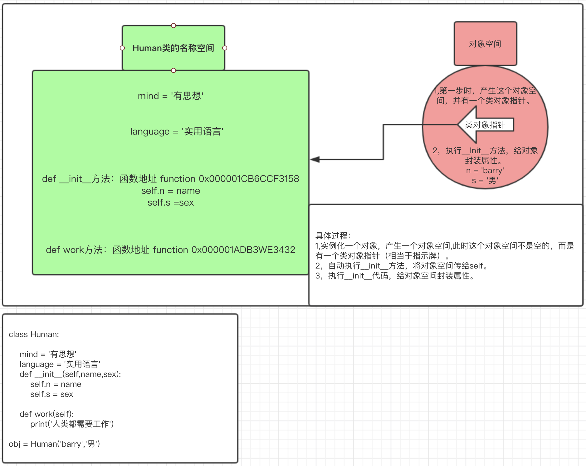
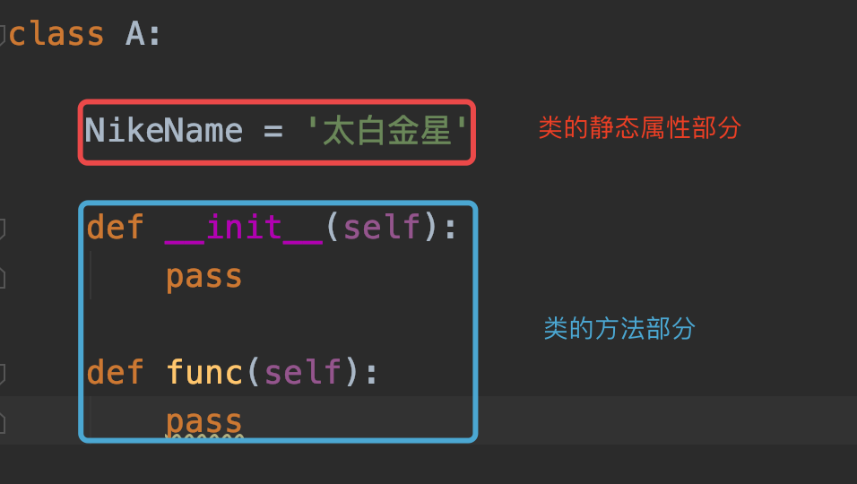
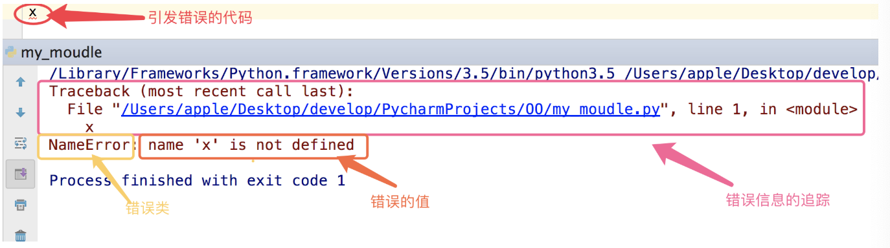
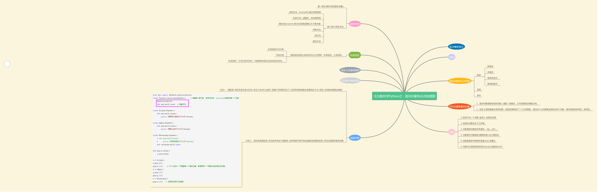
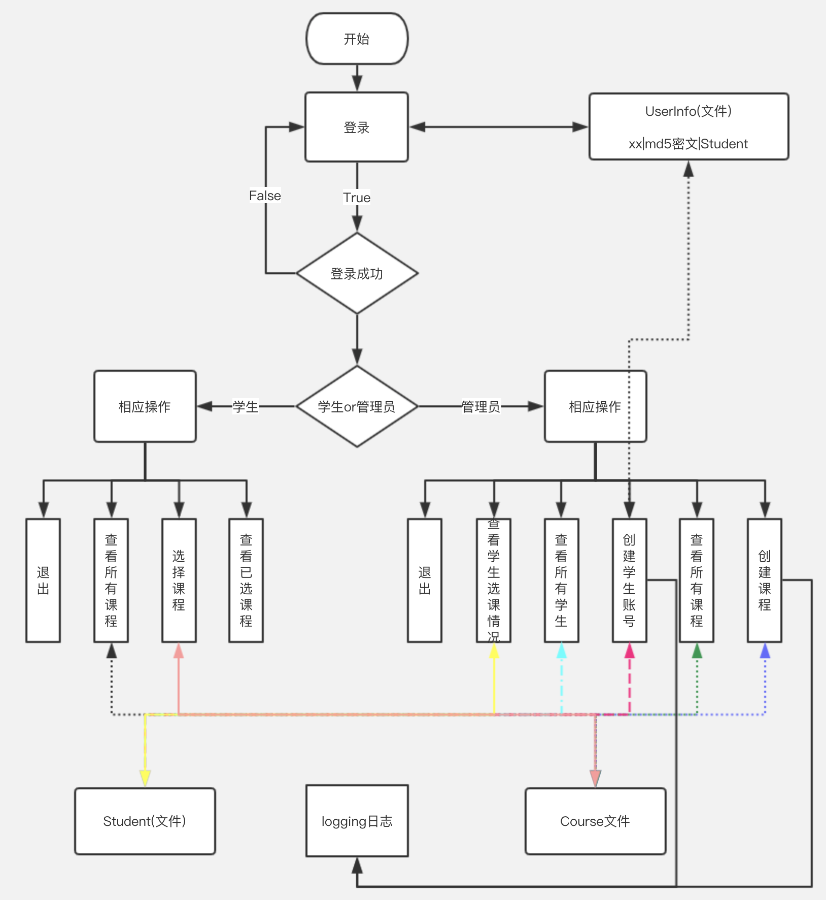

0第四章：面向对象        

## 本章具体小节如下               


1. **第一节：初识面向对象**                                 

2. **第二节：类的空间问题以及类之间的关系**

3. **第三节：面向对象三大特性之：继承**

4. **第四节：面向对象三大特性之：封装、多态，以及类的约束**

5. **第五节：类的成员**

6. **第六节：反射，特殊的双下方法**

7. **第七节：异常处理，面向对象实战应用**

   

   
  
   本章主要是为大家讲解Python的面向对象部分，希望大家通过对本章的学习，对面向对象有深入的了解。


#### 1. 面向过程式编程vs面向函数式编程        

​	之前我们讲过面向过程式编程与面向函数式编程的区别，现在我们在回忆一下。

```python
# 面向过程编程 测量对象的元素个个数。
s1 = 'fjdsklafsjda'
count = 0
for i in s1:
    count += 1


l1 = [1,2,3,4]
count = 0
for i in l1:
    count += 1

面向过程编程
```

```python
def func(s):
    count = 0
    for i in s:
        count += 1
    return count
func('fdsafdsa')
func([1,2,3,4])

函数式编程
```

通过对比可知：函数编程较之面向过程编程最明显的两个特点：

 1. **减少代码的重用性。**	

 2. **增强代码的可读性。**


#### 2. 函数式编程vs面向对象编程        

```python
# 函数式编程

# auth 认证相关
def login():
    pass

def regisgter():
    pass

# account 账户相关
def func1():
    pass

def func2():
    pass


# 购物车相关
def shopping(username,money):
    pass
def check_paidgoods(username,money):
    pass
def check_unpaidgoods(username,money):
    pass
def save(username,money):
    pass

函数式编程
```

```python
class LoginHandler:
    def login(self):
        pass

    def regisgter(self):
        pass

class Account:
    def func1(self):
        pass

    def func2(self):
        pass

class ShoppingCar:
    def shopping(username,money):
        pass
    def check_paidgoods(username,money):
        pass
    def check_unpaidgoods(username,money):
        pass
    def save(username,money):
        pass

面向对象式编程
```


#### 3. 什么是面向对象编程        

通过对比可以看出面向对象第一个优点：

​	1.  **面向对象编程：是一类相似功能函数的集合,使你的代码更清晰化，更合理化。**

​	说第二个优点之前,先看看什么是面向对象。面向对象的程序设计的核心是对象（上帝式思维），要理解对象为何物，必须把自己当成上帝，上帝眼里世间存在的万物皆为对象，不存在的也可以创造出来。那什么是类？什么是对象？

​	**类：就是具有相同属性和功能的一类事物。**

​	**对象：就是类的具体表现。**

​	具体一些：先解释解释什么是⻋? 有轱辘, 有⽅向盘, 有发动机, 会跑的是车. 好. 在解释⼀个. 什么是人. 有名字, 年龄, 爱好, 会唱歌跳舞思考的是⼈.那么广义上车，人就是类：但是具体的我的车，你这个人这是一个对象。

​	猫，是一类，你们家养的 大橘。

​	狗，是一类，隔壁家养的那只二哈就是对象。

​	⾯向对象思维, 要⾃⼰建立对象. ⾃⼰建立场景. 你是就是⾯向对象世界中的上帝. 你想让⻋⼲嘛就⼲嘛. 你想让⼈⼲嘛⼈就能⼲嘛，再说第二个优点：

2. **面向对象编程：要拥有上帝的视角看问题，类其实就是一个公共模板（厂房），对象就从具体的模板实例化出来。核心思想是运用对象编程，得到了对象就是得到了一切**。


## 第一节：初识面向对象                  

​																																																									

#### 本节具体内容如下：        

1. **类的结构**                                 
2. **从类名的角度研究类**
   - 类名操作静态属性
     - 第一种：查看类中的所有内容
     - 第二种：万能的点
   - 类名操作动态方法
3. **从对象角度研究类**
   - 什么是对象
   - 实例化对象发生了三件事
   - 对象操作对象空间属性
     - 对象查看对象中的所有属性
     - 对象操作对象中的单个属性：万能的点
   - 对象查看类中的属性
   - 对象操作类中的方法
4. **什么是self**
5. **一个类可以实例化多个对象**


#### 1. 类的结构                                 

```python
class Human:
    """
    此类主要是构建人类
    """
    mind = '有思想'  # 第一部分：静态属性 属性 静态变量 静态字段
    dic = {}
    l1 = []
    def work(self): # 第二部分：方法 函数 动态属性
        print('人类会工作')
        
class 是关键字与def用法相同，定义一个类。
Human是此类的类名，类名使用驼峰(CamelCase)命名风格，首字母大写，私有类可用一个下划线开头。
类的结构从大方向来说就分为两部分：
	静态属性。
	动态方法。
```


#### 2. 从类名的角度研究类     

- 类名操作静态属性

  - 第一种: 查看类中的所有内容, 类名`__dict__`方式。

    ```python
    class Human:
        """
        此类主要是构建人类
        """
        mind = '有思想'  # 第一部分：静态属性 属性 静态变量 静态字段
        dic = {}
        l1 = []
        def work(self): # 第二部分：方法 函数 动态属性
            # print(self)
            print('人类会工作')
    
    print(Human.__dict__)
    print(Human.__dict__['mind'])
    Human.__dict__['mind'] = '无脑'
    print(Human.__dict__)  # 错误
    #通过这种方式只能查询，不能增删改.
    
    # 第一种方式只用户查询全部内容（一般不用单独属性查询）.
    ```

  - 第二种：万能的点.

    ```python
    class Human:
        """
        此类主要是构建人类
        """
        mind = '有思想'  # 第一部分：静态属性 属性 静态变量 静态字段
        dic = {}
        l1 = []
        def work(self): # 第二部分：方法 函数 动态属性
            # print(self)
            print('人类会工作')
    print(Human.mind)  # 查
    Human.mind = '无脑'  # 改
    print(Human.mind)
    del Human.mind  # 删
    Human.walk = '直立行走'
    print(Human.walk)
    # 通过万能的点 可以增删改查类中的单个属性
    ```

    **对以上两种做一个总结：如果想查询类中的所有内容，通过 第一种__dict__方法，如果只是操作单个属性则用万能的点的方式。**

- 类名操作动态方法

  前提：除了两个特殊方法：静态方法，类方法之外，一般不会通过类名操作一个类中的方法。

  ```python
  class Human:
      """
      此类主要是构建人类
      """
      mind = '有思想'  # 第一部分：静态属性 属性 静态变量 静态字段
      dic = {}
      l1 = []
      def work(self): # 第二部分：方法 函数 动态属性
          # print(self)
          print('人类会工作')
      def tools(self):
          print('人类会使用工具')
  
  Human.work(111)
  Human.tools(111)
  下面可以做，但不用。
  Human.__dict__['work'](111)
  ```


#### 3. 从对象的角度研究类    

- 什么是对象

  对象是从类中出来的，只要是类名加上（），这就是一个实例化过程，这个就会实例化一个对象。

- 实例化对象发生了三件事

  ```python
  class Human:
      mind = '有思想'
      def __init__(self):
          print(666)
          print(self)  # <__main__.Human object at 0x00000191508AA828>
  
      def work(self): 
          print('人类会工作')
  
      def tools(self):
          print('人类会使用工具')
  obj = Human() # 只要实例化对象，它会自动执行__init__方法
  print(obj)  # <__main__.Human object at 0x00000191508AA828>
  # 并且obj的地址与self的地址相同
  ```

  其实实例化一个对象总共发生了三件事：

  1. 在内存中开辟了一个对象空间。
  2. 自动执行类中的`__init__`方法，并将这个对象空间（内存地址）传给了`__init__`方法的第一个位置参数self。
  3. 在`__init__ `方法中通过self给对象空间添加属性。

- 对象操作对象空间属性

  - 对象查询对象中所有属性。 对象`__dict__`

    ```python
    class Human:
    
        mind = '有思想'
        language = '实用语言'
        def __init__(self,name,sex,age,hobby):
            # self 和 obj 指向的是同一个内存地址同一个空间，下面就是通过self给这个对象空间封装四个属性。
            self.n = name
            self.s = sex
            self.a = age
            self.h = hobby
    
    obj = Human('barry','男',18,'运动')
    print(obj.__dict__)  # {'n': 'barry', 'h': '运动', 's': '男', 'a': 18}
    ```

  - 对象操作对象中的单个属性: 万能的点 .

    ```python
    class Human:
    
        mind = '有思想'
        language = '实用语言'
        def __init__(self,name,sex,age,hobby):
            # self 和 obj 指向的是同一个内存地址同一个空间，下面就是通过self给这个对象空间封装四个属性。
            self.n = name
            self.s = sex
            self.a = age
            self.h = hobby
    
    obj = Human('barry','男',18,'运动')
    obj.job = 'IT'  # 增
    del obj.n  # 删
    obj.s = '女' # 改
    print(obj.s)  # 查
    print(obj.__dict__)
    ```
  
- 对象查看类中的属性

  ```python
  class Human:
  
      mind = '有思想'
      language = '实用语言'
      def __init__(self,name,sex,age,hobby):
          self.n = name
          self.s = sex
          self.a = age
          self.h = hobby
  
  obj = Human('barry','男',18,'运动')
  print(obj.mind)
  print(obj.language)
  obj.a = 666
  print(obj.a)
  ```

- 对象操作类中的方法

  ```python
  class Human:
  
      mind = '有思想'
      language = '实用语言'
      def __init__(self,name,sex,age,hobby):
          self.n = name
          self.s = sex
          self.a = age
          self.h = hobby
  
      def work(self):
          print(self)
          print('人类会工作')
  
      def tools(self):
          print('人类会使用工具')
  
  obj = Human('barry','男',18,'运动')
  obj.work()
  obj.tools()
  ```


#### 4. 什么是self     

​	self其实就是类中方法（函数）的第一个位置参数，只不过解释器会自动将调用这个函数的对象传给self。所以咱们把类中的方法的第一个参数约定俗成设置成self, 代表这个就是对象。


#### 5. 一个类可以实例化对个对象    

```python
class Human:

    mind = '有思想'
    language = '实用语言'
    def __init__(self,name,sex,age,hobby):
        self.n = name
        self.s = sex
        self.a = age
        self.h = hobby

    def work(self):
        print(self)
        print('人类会工作')

    def tools(self):
        print('人类会使用工具')
obj1= Human('小胖','男',20,'美女')
obj2= Human('相爷','男',18,'肥女')
print(obj1,obj2)
print(obj1.__dict__)
print(obj2.__dict__)
```


## 第二节：类的空间问题以及类之间的关系                  

​																																																									

#### 本节具体内容如下：        

1. **类的空间问题**

   + 何处添加对象属性
   + 何处添加类的属性
   + 从空间角度研究类
   + 对象以及类查询"名字"的顺序

2. **类与类之间的关系**

   + 依赖(关联)关系

   + 组合(聚合)关系

   + 继承(实现)关系(下节讲)

     

#### 1. 类的空间问题

+ 何处添加对象属性

  ```python
  class A:
      def __init__(self,name):
          self.name = name
  
      def func(self,sex):
          self.sex = sex
  # 类外面可以：
  obj = A('barry')
  obj.age = 18
  print(obj.__dict__)  # {'name': 'barry', 'age': 18}
  
  # 类内部也可以：
  obj = A('barry') # __init__方法可以。
  obj.func('男')  # func 方法也可以。
  ```

  **总结：对象的属性不仅可以在__init__里面添加，还可以在类的其他方法或者类的外面添加。**

+ 何处可以添加类的静态属性

  ```python
  class A:
      def __init__(self,name):
          self.name = name
  
      def func(self,sex):
          self.sex = sex
      
      def func1(self):
          A.bbb = 'ccc'
          
  # 类的外部可以添加
  A.aaa = 'taibai'
  print(A.__dict__)
  
  # 类的内部也可以添加。
  A.func1(111)
  print(A.__dict__)
  ```

  **总结：类的属性不仅可以在类内部添加，还可以在类的外部添加。**

+ 对象如何找到类的属性

  之前咱们都学习过，实例化一个对象，可以通过点的方式找到类中的属性，那么他为什么可以找到类中的属性呢？

  通过图解说明：

  

+ 对象以及类查询"名字"的顺序

  对象查找属性的顺序：先从对象空间找  ------> 类空间找 ------> 父类空间找 ------->.....

  类名查找属性的顺序：先从本类空间找 -------> 父类空间找--------> ........

  上面的顺序都是单向不可逆，类名不可能找到对象的属性。

  

#### 2.类与类之间的关系

​	⼤千世界, 万物之间皆有规则和规律. 我们的类和对象是对⼤千世界中的所有事物进⾏归类. 那事物之间存在着相对应的关系. 类与类之间也同样如此. 在⾯向对象的世界中. 类与类中存在以下关系:

1. 依赖关系
2. 关联关系
3. 组合关系
4. 聚合关系
5. 实现关系
6. 继承关系(类的三大特性之一：继承。)

​    上面是Java语言中对类进行划分，而python中对面向对象没有这么明确的定义，我们是借助Java语言对Python中的类进行科学的划分。

1. 依赖(关联)关系

2. 组合(聚合)关系

3. 继承(实现)关系(下节讲)

   

+ 依赖(关联)关系

  ​	⾸先, 我们设计⼀个场景. 还是最初的那个例⼦. 要把⼤象装冰箱. 注意. 在这个场景中, 其实是存在了两种事物的. ⼀个是⼤象, ⼤象负责整个事件的掌控者, 还有⼀个是冰箱, 冰箱负责被⼤象操纵. 

  ⾸先, 写出两个类, ⼀个是⼤象类, ⼀个是冰箱类

  ```python
  class Elphant:
      def __init__(self, name):
          self.name = name
  
      def open(self):
          '''
          开⻔
          '''
          pass
      
      def close(self):
          '''
          关⻔
          '''
          pass
  
  
  class Refrigerator:
      
      def open_door(self):
          print("冰箱⻔被打开了")
      
      def close_door(self):
          print("冰箱⻔被关上了")
  ```

  ​	冰箱的功能非常简单, 只要会开⻔, 关⻔就⾏了. 但是⼤象就没那么简单了. 想想. ⼤象开⻔和关⻔的时候是不是要先找个冰箱啊. 然后呢? 打开冰箱⻔. 是不是打开刚才找到的那个冰箱⻔. 然后装⾃⼰. 最后呢? 关冰箱⻔, 注意, 关的是刚才那个冰箱吧. 也就是说. 开⻔和关⻔⽤的是同⼀个冰箱. 并且. ⼤象有更换冰箱的权利, 想进那个冰箱就进那个冰箱. 这时, ⼤象类和冰箱类的关系并没有那么的紧密. 因为⼤象可以指定任何⼀个冰箱. 接下来. 我们把代码完善⼀下.

  ```python
  class Elphant:
      def __init__(self, name):
          self.name = name
  
      def open(self,obj1):
          '''
          开⻔
  
          '''
          print('大象要开门了，默念三声，开')
          obj1.open_door()
  
      def close(self):
          '''
          关⻔
          '''
          print('大象要关门了，默念三声，关')
  
  
  class Refrigerator:
  
      def open_door(self):
          print("冰箱⻔被打开了")
  
      def close_door(self):
          print("冰箱⻔被关上了")
  
  
  elphant1 = Elphant('大象')
  haier = Refrigerator()
  elphant1.open(haier)
  ```

  ​	动作发起的主体是大象，你们把关门这个练一下。依赖关系：**将一个类的对象或者类名传到另一个类的方法使用。**此时, 我们说, ⼤象和冰箱之间就是依赖关系. 我⽤着你. 但是你不属于我. 这种关系是最弱的.比如. 公司和雇员之间. 对于正式员⼯, 肯定要签订劳动合同. 还得⼩⼼伺候着. 但是如果是兼职. 那⽆所谓. 需要了你就来. 不需要你就可以拜拜了. 这⾥的兼职(临时⼯) 就属于依赖关系.我⽤你. 但是你不属于我。

+ 组合(关联,聚合)关系

  例一：男女朋友的示例。

  ```python
  class Boy:
      def __init__(self,name,girlFriend=None):
          self.name = name
          self.girlFriend = girlFriend
  
      def have_a_diner(self):
          if self.girlFriend:
              print('%s 和 %s 一起晚饭'%(self.name,self.girlFriend.name))
          else:
              print('单身狗，吃什么饭')
  
  
  class Girl:
      def __init__(self,name):
          self.name = name
  
  b = Boy('日天')
  b.have_a_diner() # 此时是单身狗
  
  # 突然有一天，日天牛逼了
  b.girlFriend = '如花'
  b.have_a_diner()  #共进晚餐
  
  # wusir 生下来就有女朋友 服不服
  gg = Girl('小花')
  bb = Boy('wusir', gg)
  bb.have_a_diner()
  
  # 结果嫌他有点娘，不硬，分了
  bb.girlFriend = None
  bb.have_a_diner()
  ```

  ​    注意. 此时Boy和Girl两个类之间就是关联关系. 两个类的对象紧密练习着. 其中⼀个没有了. 另⼀个就孤单的不得了. 关联关系, 其实就是 我需要你. 你也属于我. 这就是关联关系. 像这样的关系有很多很多. 比如. 学校和老师之间的关系.

  例二：老师学校的关系。

  ```python
  # 老师属于学校，必须有学校才可以工作
  class School:
  
      def __init__(self,name,address):
          self.name = name
          self.address = address
  
  
  class Teacher:
  
      def __init__(self,name,school):
          self.name = name
          self.school = school
  
  s1 = School('北京校区','朝阳区')
  s2 = School('上海校区','上海迪士尼旁边')
  s3 = School('深圳校区','南山区')
  
  t1 = Teacher('郭德纲',s1)
  t2 = Teacher('啵啵',s2)
  t3 = Teacher('太白',s3)
  
  print(t1.school.name)
  print(t2.school.name)
  print(t3.school.name)
  ```

  但是学校也是依赖于老师的，所以老师学校应该互相依赖。

  ```python
  class School:
  
      def __init__(self,name,address):
          self.name = name
          self.address = address
          self.teacher_list = []
  
      def append_teacher(self,teacher):
          self.teacher_list.append(teacher)
          
  class Teacher:
  
      def __init__(self,name,school):
          self.name = name
          self.school = school
  
  s1 = School('北京校区','朝阳区')
  s2 = School('上海校区','上海迪士尼旁边')
  s3 = School('深圳校区','南山区')
  
  t1 = Teacher('郭德纲',s1)
  t2 = Teacher('啵啵',s2)
  t3 = Teacher('太白',s3)
  
  s1.append_teacher(t1)
  s1.append_teacher(t2)
  s1.append_teacher(t3)
  
  # print(s1.teacher_list)
  # for teacher in s1.teacher_list:
  #     print(teacher.name)
  ```

  好了. 这就是关联关系. 当我们在逻辑上出现了. 我需要你. 你还得属于我. 这种逻辑 就是关联关系. 那注意. 这种关系的紧密程度比上⾯的依赖关系要紧密的多. 为什么呢? 想想吧

  例三：游戏人物示例。

  **组合：将一个类的对象封装到另一个类的对象的属性中，就叫组合。**

  咱们设计一个游戏人物类，让实例化几个对象让这几个游戏人物实现互殴的效果。

  ```python
  class Gamerole:
      def __init__(self,name,ad,hp):
          self.name = name
          self.ad = ad
          self.hp = hp
      def attack(self,p1):
          p1.hp -= self.ad
          print('%s攻击%s,%s掉了%s血,还剩%s血'%(self.name,p1.name,p1.name,self.ad,p1.hp))
  gailun = Gamerole('盖伦',10,200)
  yasuo= Gamerole('亚索',50,80)
  
  #盖伦攻击亚索
  gailun.attack(yasuo)
  # 亚索攻击盖伦
  yasuo.attack(盖伦)
  ```

  但是这样互相攻击没有意思，一般游戏类的的对战方式要借助武器，武器是一个类，武器类包含的对象很多：刀枪棍剑斧钺钩叉等等，所以咱们要写一个武器类。

  ```python
  class Gamerole:
      def __init__(self,name,ad,hp):
          self.name = name
          self.ad = ad
          self.hp = hp
      def attack(self,p1):
          p1.hp -= self.ad
          print('%s攻击%s,%s掉了%s血,还剩%s血'%(self.name,p1.name,p1.name,self.ad,p1.hp))
  
  class Weapon:
      def __init__(self,name,ad):
          self.name = name
          self.ad = ad
      def weapon_attack(self,p1,p2):
          p2.hp = p2.hp - self.ad - p1.ad
          print('%s 利用 %s 攻击了%s,%s还剩%s血' %(p1.name,self.name,p2.name,p2.name,p2.hp))
  ```

  接下来借助武器攻击对方：

  ```python
  pillow = Weapon('绣花枕头',2)
  pillow.weapon_attack(barry,panky)
  # 但是上面这么做不好，利用武器攻击也是人类是动作的发起者，所以不能是pillow武器对象，而是人类利用武器攻击对方
  ```

  所以，对代码进行修改。

  ```python
  class Gamerole:
      def __init__(self,name,ad,hp):
          self.name = name
          self.ad = ad
          self.hp = hp
      def attack(self,p1):
          p1.hp -= self.ad
          print('%s攻击%s,%s掉了%s血,还剩%s血'%(self.name,p1.name,p1.name,self.ad,p1.hp))
          
      def equip_weapon(self,wea):
          self.wea = wea  # 组合：给一个对象封装一个属性改属性是另一个类的对象
  class Weapon:
      def __init__(self,name,ad):
          self.name = name
          self.ad = ad
      def weapon_attack(self,p1,p2):
          p2.hp = p2.hp - self.ad - p1.ad
          print('%s 利用 %s 攻击了%s,%s还剩%s血'
                %(p1.name,self.name,p2.name,p2.name,p2.hp))
  
  
  # 实例化三个人物对象：
  barry = Gamerole('太白',10,200)
  panky = Gamerole('金莲',20,50)
  pillow = Weapon('绣花枕头',2)
  
  # 给人物装备武器对象。
  barry.equip_weapon(pillow)
  
  # 开始攻击
  barry.wea.weapon_attack(barry,panky)
  ```

  上面就是组合，只要是人物.equip_weapon这个方法，那么人物就封装了一个武器对象，再利用武器对象调用其类中的weapon_attack方法。

   在python中类的实现关系和类的继承是一个意思，这个下一节我们再讲。

​	

## 第三节：面向对象三大特性之：继承               

​																																																									

#### 本节具体内容如下：        

1. **什么是面向对象的继承？**

2. **继承的优点**

3. **继承的分类**

   + 继承的分类
   + Python中类的分类

4. **单继承**

5. **多继承**

   + 经典类的多继承

   + 新式类的多继承

     

#### 1. 什么是面向对象的继承

比较官方的说法就是：

​	继承（英语：inheritance）是面向对象软件技术当中的一个概念。如果一个类别A“继承自”另一个类别	B，就把这个A称为“B的子类别”，而把B称为“A的父类别”也可以称“B是A的超类”。继承可以使得子类别具有父类别的各种属性和方法，而不需要再次编写相同的代码。在令子类别继承父类别的同时，可以重新定义某些属性，并重写某些方法，即覆盖父类别的原有属性和方法，使其获得与父类别不同的功能。另外，为子类别追加新的属性和方法也是常见的做法。 一般静态的面向对象编程语言，继承属于静态的，意即在子类别的行为在编译期就已经决定，无法在执行期扩充。

​	字面意思就是：子承父业，合法继承家产，就是如果你是独生子，而且你也很孝顺，不出意外，你会继承你父母所有家产，他们的所有财产都会由你使用（败家子儿除外）。

那么用一个例子来看一下继承：

```python
class Person:
    def __init__(self,name,sex,age):
        self.name = name
        self.age = age
        self.sex = sex

class Cat:
    def __init__(self,name,sex,age):
        self.name = name
        self.age = age
        self.sex = sex

class Dog:
    def __init__(self,name,sex,age):
        self.name = name
        self.age = age
        self.sex = sex

# 继承的用法：
class Aniaml(object):
    def __init__(self,name,sex,age):
            self.name = name
            self.age = age
            self.sex = sex


class Person(Aniaml):
    pass

class Cat(Aniaml):
    pass

class Dog(Aniaml):
    pass
```


#### 2.继承的优点

1. 增加了类的耦合性（耦合性不宜多，宜精）。

2. 减少了重复代码。

3. 使得代码更加规范化，合理化。

   

#### 3.继承的分类

+ 继承的分类

  就向上面的例子：

  Aminal 叫做父类,基类,超类。
  Person Cat Dog: 子类，派生类。
  继承：可以分**单继承，多继承**。

  

+ python中类的分类

  这里需要补充一下python中类的种类（继承需要）：

  在python2x版本中存在两种类.：
  　⼀个叫**经典类**. 在python2.2之前. ⼀直使⽤的是经典类. 经典类在基类的根如果什么都不写.
  　⼀个叫**新式类**. 在python2.2之后出现了新式类. 新式类的特点是基类的根是object类。
  python3x版本中只有一种类：
  	python3中使⽤的都是**新式类**. 如果基类谁都不继承. 那这个类会默认继承 object类。

  

#### 4.单继承

+ 类名,对象执行父类方法

  ```python
  class Aniaml(object):
      type_name = '动物类'
  
      def __init__(self,name,sex,age):
              self.name = name
              self.age = age
              self.sex = sex
  
      def eat(self):
          print(self)
          print('吃东西')
  
  
  class Person(Aniaml):
      pass
  
  
  class Cat(Aniaml):
      pass
  
  
  class Dog(Aniaml):
      pass
  
  # 类名：
  print(Person.type_name)  # 可以调用父类的属性，方法。
  Person.eat(111)
  print(Person.type_name)
  
  # 对象：
  # 实例化对象
  p1 = Person('春哥','男',18)
  print(p1.__dict__)
  # 对象执行类的父类的属性，方法。
  print(p1.type_name)
  p1.type_name = '666'
  print(p1)
  p1.eat()
  
  类名，对象分别调用父类方法
  ```

+ 执行顺序

  ```python
  class Aniaml(object):
      type_name = '动物类'
      def __init__(self,name,sex,age):
              self.name = name
              self.age = age
              self.sex = sex
  
      def eat(self):
          print(self)
          print('吃东西')
  
  class Person(Aniaml):
      
      def eat(self):
          print('%s 吃饭'%self.name)
          
  class Cat(Aniaml):
      pass
  
  class Dog(Aniaml):
      pass
  
  p1 = Person('barry','男',18)
  # 实例化对象时必须执行__init__方法,类中没有，从父类找，父类没有，从object类中找。
  p1.eat()
  # 先要执行自己类中的eat方法，自己类没有才能执行父类中的方法。
  ```

+ 同时执行类以及父类方法

  + 方法一：

    如果想执行父类的func方法，这个方法并且子类中夜用，那么就在子类的方法中写上：

    父类.func(对象,其他参数)

    举例说明：

    ```python
    class Aniaml(object):
        type_name = '动物类'
        def __init__(self,name,sex,age):
                self.name = name
                self.age = age
                self.sex = sex
    
        def eat(self):
            print('吃东西')
    
    class Person(Aniaml):
        def __init__(self,name,sex,age,mind):
            '''
            self = p1
            name = '春哥'
            sex = 'laddboy'
            age = 18
            mind = '有思想'
            '''
            # Aniaml.__init__(self,name,sex,age)  # 方法一
            self.mind = mind
    
        def eat(self):
            super().eat()
            print('%s 吃饭'%self.name)
    class Cat(Aniaml):
        pass
    
    class Dog(Aniaml):
        pass
    
    # 方法一： Aniaml.__init__(self,name,sex,age)
    # p1 = Person('春哥','laddboy',18,'有思想')
    # print(p1.__dict__)
    
    # 对于方法一如果不理解：
    # def func(self):
    #     print(self)
    # self = 3
    # func(self)
    ```

  + 方法二：

    利用super，super().func(参数)

    ```python
    class Aniaml(object):
        type_name = '动物类'
        def __init__(self,name,sex,age):
                self.name = name
                self.age = age
                self.sex = sex
    
        def eat(self):
            print('吃东西')
    
    class Person(Aniaml):
        def __init__(self,name,sex,age,mind):
            '''
            self = p1
            name = '春哥'
            sex = 'laddboy'
            age = 18
            mind = '有思想'
            '''
            # super(Person,self).__init__(name,sex,age)  # 方法二
            super().__init__(name,sex,age)  # 方法二
            self.mind = mind
    
        def eat(self):
            super().eat()
            print('%s 吃饭'%self.name)
    class Cat(Aniaml):
        pass
    
    class Dog(Aniaml):
        pass
    # p1 = Person('春哥','laddboy',18,'有思想')
    # print(p1.__dict__)
    ```

    相关练习题：

    ```python
    # 1
    class Base:
        def __init__(self, num):
            self.num = num
        def func1(self):
            print(self.num)
    
    class Foo(Base):
        pass
    obj = Foo(123)
    obj.func1() # 123 运⾏的是Base中的func1  
    
    # 2      
    class Base:
        def __init__(self, num):
            self.num = num
        def func1(self):
            print(self.num)
    class Foo(Base):
        def func1(self):
            print("Foo. func1", self.num)
    obj = Foo(123)
    obj.func1() # Foo. func1 123 运⾏的是Foo中的func1       
     
    # 3
    class Base:
        def __init__(self, num):
            self.num = num
        def func1(self):
            print(self.num)
            self.func2()
        def func2(self):
            print("Base.func2")
    class Foo(Base):
        def func2(self):
        print("Foo.func2")
    obj = Foo(123)
    obj.func1() # 123 Foo.func2 func1是Base中的 func2是⼦类中的 
    
    # 4
    class Base:
        def __init__(self, num):
            self.num = num
        def func1(self):
            print(self.num)
            self.func2()
        def func2(self):
            print(111, self.num)
    class Foo(Base):
        def func2(self):
            print(222, self.num)
    lst = [Base(1), Base(2), Foo(3)]
    for obj in lst:
        obj.func2() # 111 1 | 111 2 | 222 3
    
    # 5
    class Base:
        def __init__(self, num):
            self.num = num
        def func1(self):
            print(self.num)
            self.func2()
        def func2(self):
            print(111, self.num)
    class Foo(Base):
        def func2(self):
            print(222, self.num)
    lst = [Base(1), Base(2), Foo(3)]
    for obj in lst:
     obj.func1() # 那笔来吧. 好好算
    ```

    

#### 5.多继承

​	多继承，顾名思义就是一个子类有多个父类，我们可以用例子说明：

```python
class ShenXian: # 神仙
    def fei(self):
        print("神仙都会⻜")
class Monkey: # 猴
    def chitao(self):
        print("猴⼦喜欢吃桃⼦")
class SunWukong(ShenXian, Monkey): # 孙悟空是神仙, 同时也是⼀只猴
    pass
sxz = SunWukong() # 孙悟空
sxz.chitao() # 会吃桃⼦
sxz.fei() # 会⻜
```

​	此时, 孙悟空是⼀只猴⼦, 同时也是⼀个神仙. 那孙悟空继承了这两个类. 孙悟空⾃然就可以执⾏这两个类中的⽅法. 多继承⽤起来简单. 也很好理解. 但是多继承中, 存在着这样⼀个问题. 当两个⽗类中出现了重名⽅法的时候. 这时该怎么办呢? 这时就涉及到如何查找⽗类⽅法的这么⼀个问题.即MRO(method resolution order) 问题. 在python中这是⼀个很复杂的问题. 因为在不同的python版本中使⽤的是不同的算法来完成MRO的.

​	**经典类：沿用深度优先算法。**

​	**新式类：沿用C3算法。**

+ 经典类的多继承：深度优先。

  ​	虽然在python3x中已经不存在经典类了. 但是经典类的MRO最好还是学⼀学. 这是⼀种树形结构遍历的⼀个最直接的案例. 在python的继承体系中. 我们可以把类与类继承关系化成⼀个树形结构的图来, 上代码:

  ```python
  class A:
      pass
  class B(A):
      pass
  class C(A):
      pass
  class D(B, C):
      pass
  class E:
      pass
  class F(D, E):
      pass
  class G(F, D):
      pass
  class H:
      pass
  class Foo(H, G):
      pass
  ```

  

  继承关系图已经有了. 那如何进⾏查找呢? 记住⼀个原则. 在经典类中采⽤的是深度优先，遍历⽅案. 什么是深度优先. 就是⼀条路走到头. 然后再回来. 继续找下⼀个.

  

  深度优先原则：

   	1. 从左至右，依次查找。
   	2. 每次都选取节点的最左边，一直找到头，如果没有，返回上一个节点在查询其他路线。
   	3. 如果上一个节点没有其他路线或者都已经查询完毕，再返回上一个节点，直至遍历完所有的节点

  

  

+ 新式类的多继承：C3算法。

  新式类的继承需要借助一些公式以及新的概念，别着急我们一步一步来。

  + mro序列。

    MRO是一个有序列表L，在类被创建时就计算出来。
    通用计算公式为：

    ```python
    mro(Child(Base1，Base2)) = [ Child ] + merge( mro(Base1), mro(Base2), [ Base1, Base2] )
    （其中Child继承自Base1, Base2）
    ```

    如果继承至一个基类：class B(A) 
    这时B的mro序列为

    ```python
    mro( B ) = mro( B(A) )
    = [B] + merge( mro(A) + [A] )
    = [B] + merge( [A] + [A] )
    = [B,A]
    ```

     

    如果继承至多个基类：class B(A1, A2, A3 …) 
    这时B的mro序列

    ```python
    mro(B) = mro( B(A1, A2, A3 …) )
    = [B] + merge( mro(A1), mro(A2), mro(A3) ..., [A1, A2, A3] )
    = ...
    ```

    计算结果为列表，列表中至少有一个元素即类自己，如上述示例[A1,A2,A3]。merge操作是C3算法的核心。

  + 表头表尾。

    表头： 
    　　列表的第一个元素

    表尾： 
    　　列表中表头以外的元素集合（可以为空）

    示例 
    　　列表：[A, B, C] 
    　　表头是A，表尾是B和C

  + 列表之间的操作

    操作：

    [A] + [B] = [A, B]
    （以下的计算中默认省略）
    \---------------------

    merge操作示例：

    ```python
    如计算merge( [E,O], [C,E,F,O], [C] )
    有三个列表 ：  ①      ②          ③
    
    1 merge不为空，取出第一个列表列表①的表头E，进行判断                              
       各个列表的表尾分别是[O], [E,F,O]，E在这些表尾的集合中，因而跳过当前当前列表
    2 取出列表②的表头C，进行判断
       C不在各个列表的集合中，因而将C拿出到merge外，并从所有表头删除
       merge( [E,O], [C,E,F,O], [C]) = [C] + merge( [E,O], [E,F,O] )
    3 进行下一次新的merge操作 ......
    --------------------- 
    ```

    

    计算mro(A)方式：

    ```python
mro(A) = mro( A(B,C) )
    
    原式= [A] + merge( mro(B),mro(C),[B,C] )
    
      mro(B) = mro( B(D,E) )
             = [B] + merge( mro(D), mro(E), [D,E] )  # 多继承
             = [B] + merge( [D,O] , [E,O] , [D,E] )  # 单继承mro(D(O))=[D,O]
             = [B,D] + merge( [O] , [E,O]  ,  [E] )  # 拿出并删除D
             = [B,D,E] + merge([O] ,  [O])
             = [B,D,E,O]
    
      mro(C) = mro( C(E,F) )
             = [C] + merge( mro(E), mro(F), [E,F] 
                          )
             = [C] + merge( [E,O] , [F,O] , [E,F] )
             = [C,E] + merge( [O] , [F,O]  ,  [F] )  # 跳过O，拿出并删除
             = [C,E,F] + merge([O] ,  [O])
             = [C,E,F,O]
    
    原式= [A] + merge( [B,D,E,O], [C,E,F,O], [B,C])
        = [A,B] + merge( [D,E,O], [C,E,F,O],   [C])
        = [A,B,D] + merge( [E,O], [C,E,F,O],   [C])  # 跳过E
        = [A,B,D,C] + merge([E,O],  [E,F,O])
        = [A,B,D,C,E] + merge([O],    [F,O])  # 跳过O
        = [A,B,D,C,E,F] + merge([O],    [O])
        = [A,B,D,C,E,F,O]
    --------------------- 
    ```
    
结果OK. 那既然python提供了. 为什么我们还要如此⿇烦的计算MRO呢? 因为笔
    试.......你在笔试的时候, 是没有电脑的. 所以这个算法要知道. 并且简单的计算要会. 真是项⽬
    开发的时候很少有⼈这么去写代码. 
    
这个说完了. 那C3到底怎么看更容易呢? 其实很简单. C3是把我们多个类产⽣的共同继
    承留到最后去找. 所以. 我们也可以从图上来看到相关的规律. 这个要⼤家⾃⼰多写多画图就
    能感觉到了. 但是如果没有所谓的共同继承关系. 那⼏乎就当成是深度遍历就可以了。
  
  

## 第四节：面向对象三大特性之：继承,封装,多态             

​																																																									

#### 本节具体内容如下：        

1. **面向对象的三大特性之:封装**

2. **面向对象的三大特性之:多态**

   + 鸭子类型

3. **类的约束**

4. **super()深入学习**

   

#### 1.看懂了但是不理解封装意义何在面向对象的三大特性: 封装

+ 封装的定义

  ​	把很多数据封装到⼀个对象中. 把固定功能的代码封装到⼀个代码块, 函数, 对象, 打包成模块. 这都属于封装的思想. 具体的情况具体分析. 比如. 你写了⼀个很⽜B的函数. 那这个也可以被称为封装. 在⾯向对象思想中. 是把⼀些看似⽆关紧要的内容组合到⼀起统⼀进⾏存储和使⽤. 这就是封装. 

+ 代码演示

  

  这就是封装，将teacher1空间封装了两个属性,name,age，我通过万能的点的方式就可以将这些属性值取出来。

  ```python
  class Teacher:
      
      mind = '教书育人'
      
      def __init__(self,name,age):
          self.name = name
          self.age = age
      
      def work(self):
          print('人类都会工作')
      
  teacher1 = Teacher('太白金星',18)
  teacher2 = Teacher('barry', 18)
  print(teacher1.name)  # 太白金星
  print(teacher2.name)  # barry
  ```


#### 2.不是很理解面向对象的三大特性: 多态

+ 多态的定义

  ​	同⼀个对象, 多种形态. 这个在python中其实是很不容易说明⽩的. 因为我们⼀直在⽤. 只是没有具体的说. 比如. 我们创建⼀个变量a = 10 , 我们知道此时a是整数类型. 但是我们可以通过程序让a = "太白", 这时, a⼜变成了字符串类型. 这是我们都知道的. 但是, 我要告诉你的是. 这个就是多态性. 同⼀个变量a可以是多种形态。

+ 代码演示

  ```python
  # 在java或者c#定义变量或者给函数传值必须定义数据类型，否则就报错。
  
  def func(int a):
      print('a必须是数字')
      
  # 而类似于python这种弱定义类语言,a可以是任意形态（str,int,object等等）。
  def func(a):
      print('a是什么都可以')
      
  # 再比如：
  class F1:
      pass
  
  
  class S1(F1):
      
      def show(self):
          print 'S1.show'
  
  
  class S2(F1):
      
      def show(self):
          print 'S2.show'
                 
  
  # 由于在Java或C#中定义函数参数时，必须指定参数的类型
  # 为了让Func函数既可以执行S1对象的show方法，又可以执行S2对象的show方法，所以，定义了一个S1和S2类的父类
  # 而实际传入的参数是：S1对象和S2对象
  
  def Func(F1 obj):
  """Func函数需要接收一个F1类型或者F1子类的类型"""
  
      print obj.show()
      
  
  s1_obj = S1()
  Func(s1_obj)  # 在Func函数中传入S1类的对象 s1_obj，执行 S1 的show方法，结果：S1.show
  
  s2_obj = S2()
  Func(s2_obj)  # 在Func函数中传入Ss类的对象 ss_obj，执行 Ss 的show方法，结果：S2.show
  
  Python伪代码实现Java或C  # 的多态
  ```

+ 鸭子类型

  ```python
  python中有一句谚语说的好，你看起来像鸭子，那么你就是鸭子。
  对于代码上的解释其实很简答：
  class A:
      def f1(self):
          print('in A f1')
      
      def f2(self):
          print('in A f2')
  
  
  class B:
      def f1(self):
          print('in A f1')
      
      def f2(self):
          print('in A f2')
          
  obj = A()
  obj.f1()
  obj.f2()
  
  obj2 = B()
  obj2.f1()
  obj2.f2()
  # A 和 B两个类完全没有耦合性，但是在某种意义上他们却统一了一个标准。
  # 对相同的功能设定了相同的名字，这样方便开发，这两个方法就可以互成为鸭子类型。
  
  # 这样的例子比比皆是：str  tuple list 都有 index方法，这就是统一了规范。
  # str bytes 等等 这就是互称为鸭子类型。
  ```


#### 3.看不懂类的约束

+ 结合代码讲解

  ⾸先, 你要清楚. 约束是对类的约束. 

  举例说明：

  + 公司让小明给他们的网站完善一个支付功能，小明写了两个类，如下：

  ```python
  class QQpay:
      def pay(self,money):
          print('使用qq支付%s元' % money)
  
  class Alipay:
      def pay(self,money):
          print('使用阿里支付%s元' % money)
  
  a = Alipay()
  a.pay(100)
  
  b = QQpay()
  b.pay(200)
  ```

  + 但是上面这样写不太放方便，也不合理，老大说让他整改，统一一下付款的方式，小明开始加班整理：

  ```python
  class QQpay:
      def pay(self,money):
          print('使用qq支付%s元' % money)
  
  class Alipay:
      def pay(self,money):
          print('使用阿里支付%s元' % money)
  
  def pay(obj,money):  # 这个函数就是统一支付规则，这个叫做： 归一化设计。
      obj.pay(money)
  
  a = Alipay()
  b = QQpay()
  
  pay(a,100)
  pay(b,200)
  ```

  + 写了半年的接口，小明终于接了大项目了，结果公司没品位，招了一个野生的程序员春哥接替小明的工作，老大给春哥安排了任务，让他写一个微信支付的功能：

  ```python
  class QQpay:
      def pay(self,money):
          print('使用qq支付%s元' % money)
  
  class Alipay:
      def pay(self,money):
          print('使用阿里支付%s元' % money)
  
  class Wechatpay:  # 野生程序员一般不会看别人怎么写，自己才是最好，结果......
      def fuqian(self,money):
          print('使用微信支付%s元' % money)
  
  def pay(obj,money):
      obj.pay(money)
  
  a = Alipay()
  b = QQpay()
  
  pay(a,100)
  pay(b,200)
  
  c = Wechatpay()
  c.fuqian(300)
  ```

  + 结果春哥，受惩罚了，限期整改，那么春哥，发奋图强，看了太白教你学python的相关资料，重新梳理的代码：

  ```python
  class Payment: 
  　　""" 此类什么都不做，就是制定一个标准，谁继承我，必须定义我里面的方法。
     """
      def pay(self,money):pass
  
  class QQpay(Payment):
      def pay(self,money):
          print('使用qq支付%s元' % money)
  
  class Alipay(Payment):
      def pay(self,money):
          print('使用阿里支付%s元' % money)
  
  class Wechatpay(Payment):
      def fuqian(self,money):
          print('使用微信支付%s元' % money)
  
  
  def pay(obj,money):
      obj.pay(money)
  
  a = Alipay()
  b = QQpay()
  
  pay(a,100)
  pay(b,200)
  
  c = Wechatpay()
  c.fuqian(300)
  ```

  + 但是，这样还会有问题，如果再来野生程序员，他不看其他的支付方式，也不知道为什么继承的类中要定义一个没有意义的方法，所以他会是会我行我素：

  ```python
  class Payment: 
  　　""" 此类什么都不做，就是制定一个标准，谁继承我，必须定义我里面的方法。
     """
      def pay(self,money):pass
  
  class QQpay(Payment):
      def pay(self,money):
          print('使用qq支付%s元' % money)
  
  class Alipay(Payment):
      def pay(self,money):
          print('使用阿里支付%s元' % money)
  
  class Wechatpay(Payment):
      def fuqian(self,money):
          print('使用微信支付%s元' % money)
  
  
  def pay(obj,money):
      obj.pay(money)
  
  a = Alipay()
  b = QQpay()
  
  pay(a,100)
  pay(b,200)
  
  c = Wechatpay()
  c.fuqian(300)
  ```

  + 所以此时我们要用到对类的约束，对类的约束有两种：

  1. 提取⽗类. 然后在⽗类中定义好⽅法. 在这个⽅法中什么都不⽤⼲. 就抛⼀个异常就可以了. 这样所有的⼦类都必须重写这个⽅法. 否则. 访问的时候就会报错. 

  2. 使⽤元类来描述⽗类. 在元类中给出⼀个抽象⽅法. 这样⼦类就不得不给出抽象⽅法的具体实现. 也可以起到约束的效果.

     + 方式一：

     ```python
     class Payment:
         """
         此类什么都不做，就是制定一个标准，谁继承我，必须定义我里面的方法。
         """
         def pay(self,money):
             raise Exception("你没有实现pay方法")
     
     class QQpay(Payment):
         def pay(self,money):
             print('使用qq支付%s元' % money)
     
     class Alipay(Payment):
         def pay(self,money):
             print('使用阿里支付%s元' % money)
     
     class Wechatpay(Payment):
         def fuqian(self,money):
             print('使用微信支付%s元' % money)
     
     
     def pay(obj,money):
         obj.pay(money)
     
     a = Alipay()
     b = QQpay()
     c = Wechatpay()
     pay(a,100)
     pay(b,200)
     pay(c,300)
     ```

     + 方式二：引入抽象类的概念

     ```python
     from abc import ABCMeta,abstractmethod
     class Payment(metaclass=ABCMeta):   
     # 抽象类 接口类  规范和约束  metaclass指定的是一个元类
         @abstractmethod
         def pay(self):pass  # 抽象方法
     
     class Alipay(Payment):
         def pay(self,money):
             print('使用支付宝支付了%s元'%money)
     
     class QQpay(Payment):
         def pay(self,money):
             print('使用qq支付了%s元'%money)
     
     class Wechatpay(Payment):
         # def pay(self,money):
         #     print('使用微信支付了%s元'%money)
         def recharge(self):pass
     
     def pay(a,money):
         a.pay(money)
     
     a = Alipay()
     a.pay(100)
     pay(a,100)    # 归一化设计：不管是哪一个类的对象，都调用同一个函数去完成相似的功能
     q = QQpay()
     q.pay(100)
     pay(q,100)
     w = Wechatpay()
     pay(w,100)   # 到用的时候才会报错
     ```

     抽象类和接口类做的事情 ：建立规范，只要子类继承了我写的这个抽象类，实例化对象时就会报错。

  + 总结

    1. 使⽤抽象类和抽象⽅法, 由于该⽅案来源是java和c#. 所以使⽤频率还是很少的

    2. 使⽤⼈为抛出异常的⽅案. 并且尽量抛出的是NotImplementError. 这样比较专业, ⽽且错误比较明确.(推荐)

       

#### 4.看不懂super()深入学习

+ super的用法

​	 super是严格按照对象从属于类的mro顺序执行下一个类。

+ 示例一

  ```python
  class A:
      def f1(self):
          print('in A f1')
      
      def f2(self):
          print('in A f2')
  
  
  class Foo(A):
      def f1(self):
          super().f2()
          print('in A Foo')
          
          
  obj = Foo()
  obj.f1()
  ```

+ 示例二

  ```python
  class A:
      def f1(self):
          print('in A')
  
  class Foo(A):
      def f1(self):
          super().f1()
          print('in Foo')
  
  class Bar(A):
      def f1(self):
          super().f1()
          print('in Bar')
  
  class Info(Foo,Bar):
      def f1(self):
          super().f1()
          print('in Info f1')
  
  obj = Info()
  obj.f1()
  
  '''
  in Bar
  in Foo
  in Info f1
  '''
  print(Info.mro())  # [<class '__main__.Info'>, <class '__main__.Foo'>, <class '__main__.Bar'>, <class '__main__.A'>, <class 'object'>]
  ```

+ 看不懂示例三

  ```python
  class A:
      def f1(self):
          print('in A')
  
  class Foo(A):
      def f1(self):
          super().f1()
          print('in Foo')
  
  class Bar(A):
      def f1(self):
          print('in Bar')
  
  class Info(Foo,Bar):
      def f1(self):
          super(Foo,self).f1()
          print('in Info f1')
  
  obj = Info()
  obj.f1()
  ```

  

## 第五节：类的成员

​																																																									

#### 本节具体内容如下：        

1. **类的成员总览**

2. **类的私有成员**

3. **类的其他成员**

   + 实例方法
   + 类方法
   + 静态方法
   + 属性
   + 特殊的双下方法(下一节讲到)

4. **isinstance与issubclass**

5. **了解元类**

   

#### 1.类的成员总览

+ 之前我们讲过，类大致分为两块区域，如下图所示：

  

+ 每个区域详细划分又可以：

  ```python
  class A:
  
      NikeName = '太白金星'  # 静态变量(静态字段)
      __iphone = '1353333xxxx'  # 私有静态变量(私有静态字段)
  
  
      def __init__(self,name,age): #特殊方法
  
          self.name = name  #对象属性(普通字段)
          self.__age = age  # 私有对象属性(私有普通字段)
  
      def func1(self):  # 普通方法
          pass
  
      def __func(self): #私有方法
          print(666)
  
  
      @classmethod  # 类方法
      def class_func(cls):
          """ 定义类方法，至少有一个cls参数 """
          print('类方法')
  
      @staticmethod  #静态方法
      def static_func():
          """ 定义静态方法 ，无默认参数"""
          print('静态方法')
  
      @property  # 属性
      def prop(self):
          pass
  ```


#### 2.类的私有成员

+ 私有成员详解

  对于每一个类的成员而言都有两种形式：

  + 公有成员，在任何地方都能访问
  + 私有成员，只有在类的内部才能方法

  **私有成员和公有成员的访问限制不同**：

  

+ 
  公有、私有类的静态属性

  - 公有类的静态属性：类可以访问；类内部可以访问；派生类中可以访问

  ```python
  class C:
  
      name = "公有静态字段"
  
      def func(self):
          print C.name
  
  class D(C):
  
      def show(self):
          print C.name
  
  
  C.name         # 类访问
  
  obj = C()
  obj.func()     # 类内部可以访问
  
  obj_son = D()
  obj_son.show() # 派生类中可以访问
  ```
  
  + 私有类的静态属性：只能类的内部访问
  
    ```python
    class C:
      
          __name = "私有静态字段"
      
          def func(self):
              print C.__name
      
      class D(C):
      
          def show(self):
              print C.__name
      
      
      C.__name       # 不可在外部访问
      
      obj = C()
      obj.__name  # 不可在外部访问
      obj.func()     # 类内部可以访问   
      
      obj_son = D()
      obj_son.show() #不可在派生类中可以访问  
      
      私有静态字段
      
      私有静态属性(字段)
    ```
  
    
  
+ 公有、私有对象属性

  - 公有对象属性：对象可以访问；类内部可以访问；派生类中可以访问

    ```python
    class C:
        
        def __init__(self):
            self.foo = "公有字段"
    
        def func(self):
            print self.foo 　#　类内部访问
    
    class D(C):
        
        def show(self):
            print self.foo　＃　派生类中访问
    
    obj = C()
    
    obj.foo     # 通过对象访问
    obj.func()  # 类内部访问
    
    obj_son = D();
    obj_son.show()  # 派生类中访问
    
    公有普通字段
    
    公有对象属性
    ```

  - 私有对象属性：仅类内部可以访问

    ```python
    class C:
        
        def __init__(self):
            self.__foo = "私有字段"
    
        def func(self):
            print self.foo 　#　类内部访问
    
    class D(C):                         
        
        def show(self):
            print self.foo　＃　派生类中访问
    
    obj = C()
    
    obj.__foo     # 通过对象访问    ==> 错误
    obj.func()  # 类内部访问        ==> 正确
    
    obj_son = D();
    obj_son.show()  # 派生类中访问  ==> 错误
    ```

+ 公有、私有类的方法

  - 公有方法:对象可以访问；类内部可以访问；派生类中可以访问

    ```python
    class C:
    
        def __init__(self):
            pass
        
        def add(self):
            print('in C')
    
    class D(C):
    
        def show(self):
            print('in D')
            
        def func(self):
            self.show()
    obj = D()
    obj.show()  # 通过对象访问   
    obj.func()  # 类内部访问    
    obj.add()  # 派生类中访问  
    
    公有方法
    
    公有方法
    ```

  - 私有方法:仅类内部可以访问

    ```python
    class C:
    
        def __init__(self):
            pass
    
        def __add(self):
            print('in C')
    
    class D(C):
    
        def __show(self):
            print('in D')
    
        def func(self):
            self.__show()
    obj = D()
    obj.__show()  # 通过不能对象访问
    obj.func()  # 类内部可以访问
    obj.__add()  # 派生类中不能访问
    
    私有方法
    ```

+ 总结

  对于这些私有成员来说,他们只能在类的内部使用,不能再类的外部以及派生类中使用.

  *ps：非要访问私有成员的话，可以通过 对象._类__属性名,但是绝对不允许!!!*

  *为什么可以通过._类__私有成员名访问呢?因为类在创建时,如果遇到了私有成员(包括私有静态字段,私有普通字段,私有方法)它会将其保存在内存时自动在前面加上_类名.*

  #### 

#### 3.类的其他成员


- 实例方法

    定义：第一个参数必须是实例对象，该参数名一般约定为“self”，通过它来传递实例的属性和方法（也可以传类的属性和方法）；

  ​    调用：只能由实例对象调用。

  ​	简而言之，实例方法就是类的实例能够使用的方法。这里不做过多解释。

  

- 类方法

    定义：使用装饰器@classmethod。第一个参数必须是当前类对象，该参数名一般约定为“cls”，通过它来传递类的属性和方法（不能传实例的属性和方法）；

  ​    调用：实例对象和类对象都可以调用。

  ​	详解：原则上，类方法是将类本身作为对象进行操作的方法。假设有个方法，且这个方法在逻辑上采用类本身作为对象来调用更合理，那么这个方法就可以定义为类方法。另外，如果需要继承，也可以定义为类方法。

  如下场景：

  假设我有一个学生类和一个班级类，想要实现的功能为：
      执行班级人数增加的操作、获得班级的总人数；
      学生类继承自班级类，每实例化一个学生，班级人数都能增加；
      最后，我想定义一些学生，获得班级中的总人数。

  **思考**：这个问题用类方法做比较合适，为什么？因为我实例化的是学生，但是如果我从学生这一个实例中获得班级总人数，在逻辑上显然是不合理的。同时，如果想要获得班级总人数，如果生成一个班级的实例也是没有必要的。

  ```python
  class Student:
      
      __num = 0
      def __init__(self,name,age):
          self.name = name
          self.age= age
          Student.addNum()  # 写在__new__方法中比较合适，但是现在还没有学，暂且放到这里
          
      @classmethod
      def addNum(cls):
          cls.__num += 1
  
      @classmethod
      def getNum(cls):
          return cls.__num
  
  
  
  a = Student('太白金星', 18)
  b = Student('barry', 18)
  print(Student.getNum())
  ```

  

- 静态方法

  ​	定义：使用装饰器@staticmethod。参数随意，没有“self”和“cls”参数，但是方法体中不能使用类或实例的任何属性和方法；

  ​    调用：实例对象和类对象都可以调用。

  ​    详解：静态方法是类中的函数，不需要实例。静态方法主要是用来存放逻辑性的代码，逻辑上属于类，但是和类本身没有关系，也就是说在静态方法中，不会涉及到类中的属性和方法的操作。可以理解为，静态方法是个**独立的、单纯的**函数，它仅仅托管于某个类的名称空间中，便于使用和维护。

  譬如，我想定义一个关于时间操作的类，其中有一个获取当前时间的函数。

  ```python
  import time
  
  class TimeTest(object):
      def __init__(self, hour, minute, second):
          self.hour = hour
          self.minute = minute
          self.second = second
  
      @staticmethod
      def showTime():
          return time.strftime("%H:%M:%S", time.localtime())
  
  
  print(TimeTest.showTime())
  t = TimeTest(2, 10, 10)
  nowTime = t.showTime()
  print(nowTime)
  ```

  如上，使用了静态方法（函数），然而方法体中并没使用（也不能使用）类或实例的属性（或方法）。若要获得当前时间的字符串时，并不一定需要实例化对象，此时对于静态方法而言，所在类更像是一种名称空间。

  其实，我们也可以在类外面写一个同样的函数来做这些事，但是这样做就打乱了逻辑关系，也会导致以后代码维护困难。
  
- 属性

  **什么是特性property**

  property是一种特殊的属性，访问它时会执行一段功能（函数）然后返回值

  举例说明：

  ```python
  例一：BMI指数（bmi是计算而来的，但很明显它听起来像是一个属性而非方法，如果我们将其做成一个属性，更便于理解）
  
  成人的BMI数值：
  过轻：低于18.5
  正常：18.5-23.9
  过重：24-27
  肥胖：28-32
  非常肥胖, 高于32
  　　体质指数（BMI）=体重（kg）÷身高^2（m）
  　　EX：70kg÷（1.75×1.75）=22.86
  ```

  ```python
  class People:
      def __init__(self,name,weight,height):
          self.name=name
          self.weight=weight
          self.height=height
      @property
      def bmi(self):
          return self.weight / (self.height**2)
  
  p1=People('egon',75,1.85)
  print(p1.bmi)
  
  ```

  **看不懂为什么要用property**

  将一个类的函数定义成特性以后，对象再去使用的时候obj.name,根本无法察觉自己的name是执行了一个函数然后计算出来的，这种特性的使用方式**遵循了统一访问的原则**0

  **由于新式类中具有三种访问方式，我们可以根据他们几个属性的访问特点，分别将三个方法定义为对同一个属性：获取、修改、删除**

  ```python
  class Foo:
      @property
      def AAA(self):
          print('get的时候运行我啊')
  
      @AAA.setter
      def AAA(self,value):
          print('set的时候运行我啊')
  
      @AAA.deleter
      def AAA(self):
          print('delete的时候运行我啊')
  
  #只有在属性AAA定义property后才能定义AAA.setter,AAA.deleter
  f1=Foo()
  f1.AAA
  f1.AAA='aaa'
  del f1.AAA
  
  或者：
  class Foo:
      def get_AAA(self):
          print('get的时候运行我啊')
  
      def set_AAA(self,value):
          print('set的时候运行我啊')
  
      def delete_AAA(self):
          print('delete的时候运行我啊')
      AAA=property(get_AAA,set_AAA,delete_AAA) #内置property三个参数与get,set,delete一一对应
  
  f1=Foo()
  f1.AAA
  f1.AAA='aaa'
  del f1.AAA
  ```


#### 4.isinstance与issubclass

+ isinstance

  isinstance(a,b)：判断a是否是b类（或者b类的派生类）实例化的对象

  ```python
  class A:
      pass
  
  class B(A):
      pass
  
  obj = B()
  
  
  print(isinstance(obj,B))
  print(isinstance(obj,A))
  
  isinstance
  ```

+ issubclass

  issubclass(a,b)： 判断a类是否是b类（或者b的派生类）的派生类

  ```python
  class A:
      pass
  
  class B(A):
      pass
  
  class C(B):
      pass
  
  print(issubclass(B,A))
  print(issubclass(C,A))
  
  issubclass
  ```


#### 5.了解元类

​	按照Python的一切皆对象理论，类其实也是一个对象，那么类这个对象是从哪里实例化出来的呢？

```python
print(type('abc'))
print(type(True))
print(type(100))
print(type([1, 2, 3]))
print(type({'name': '太白金星'}))
print(type((1,2,3)))
print(type(object))

class A:
    pass

print(isinstance(object,type))
print(isinstance(A, type))
```

​	type元类是获取该对象从属于的类,而type类比较特殊，Python原则是：一切皆对象，其实类也可以理解为'对象',而type元类又称作构建类，python中大多数内置的类（包括object）以及自己定义的类，都是由type元类创造的。

​	而type类与object类之间的关系比较独特：object是type类的实例，而type类是object类的子类，这种关系比较神奇无法使用python的代码表述，因为定义其中一个之前另一个必须存在。所以这个只作为了解。


## 第六节：反射、双下方法

​																																																									

#### 本节具体内容如下：        

1. **反射**

2. **函数vs方法**

3. **特殊的双下方法**

   - `__len__`
   - `__hash__`
   - `__str__`
   - `__repr__`
   - `__call__`

   + `__eq__`
   + `__del__`
   + `__new__`
   + `__item__`系列
   + `__delattr__`
   + 上下文管理`__enter__`、`__exit__`

   + 相关面试题

     

#### 1.反射

+ 反射定义

  反射的概念是由Smith在1982年首次提出的，主要是指程序可以访问、检测和修改它本身状态或行为的一种能力（自省）。这一概念的提出很快引发了计算机科学领域关于应用反射性的研究。它首先被程序语言的设计领域所采用,并在Lisp和面向对象方面取得了成绩。

  **python面向对象中的反射：通过字符串的形式操作对象相关的属性。python中的一切事物都是对象（都可以使用反射）**

+ 代码示例

  四个可以实现自省的函数：hasattr,getattr,setattr,delattr

  下列方法适用于类和对象（一切皆对象，类本身也是一个对象）

  + 应用于对象的反射

    ```python
    class Foo:
        f = '类的静态变量'
        def __init__(self,name,age):
            self.name=name
            self.age=age
    
        def say_hi(self):
            print('hi,%s'%self.name)
    
    obj=Foo('egon',73)
    
    #检测是否含有某属性
    print(hasattr(obj,'name'))
    print(hasattr(obj,'say_hi'))
    
    #获取属性
    n=getattr(obj,'name')
    print(n)
    func=getattr(obj,'say_hi')
    func()
    
    print(getattr(obj,'aaaaaaaa','不存在啊')) #报错
    
    #设置属性
    setattr(obj,'sb',True)
    setattr(obj,'show_name',lambda self:self.name+'sb')
    print(obj.__dict__)
    print(obj.show_name(obj))
    
    #删除属性
    delattr(obj,'age')
    delattr(obj,'show_name')
    delattr(obj,'show_name111')#不存在,则报错
    
    print(obj.__dict__)
    
    对实例化对象的示例
    
    对对象的反射
    ```

  + 应用于类的反射

    ```python
    class Foo(object):
     
        staticField = "人工智能"
     
        def __init__(self):
            self.name = '太白金星'
     
        def func(self):
            return 'func'
     
        @staticmethod
        def bar():
            return 'bar'
     
    print getattr(Foo, 'staticField')
    print getattr(Foo, 'func')
    print getattr(Foo, 'bar')
    
    对类的反射
    ```

  + 应用于当前模块的反射

    ```python
    import sys
    
    
    def s1():
        print 's1'
    
    
    def s2():
        print 's2'
    
    
    this_module = sys.modules[__name__]
    
    hasattr(this_module, 's1')
    getattr(this_module, 's2')
    
    当前模块的反射
    ```

  + 应用于其他模块的反射

    ```python
    #一个模块中的代码
    def test():
        print('from the test')
    """
    程序目录：
        module_test.py
        index.py
     
    当前文件：
        index.py
    """
    # 另一个模块中的代码
    import module_test as obj
    
    #obj.test()
    
    print(hasattr(obj,'test'))
    
    getattr(obj,'test')()
    
    其他模块的示例
    
    其他模块的反射
    ```

  + 反射的应用

    了解了反射的四个函数。那么反射到底有什么用呢？它的应用场景是什么呢？

    现在让我们打开浏览器，访问一个网站，你单击登录就跳转到登录界面，你单击注册就跳转到注册界面，等等，其实你单击的其实是一个个的链接，每一个链接都会有一个函数或者方法来处理。

    没学反射之前的解决方式：

    ```
    class User:
        def login(self):
            print('欢迎来到登录页面')
        
        def register(self):
            print('欢迎来到注册页面')
        
        def save(self):
            print('欢迎来到存储页面')
    
    
    while 1:
        choose = input('>>>').strip()
        if choose == 'login':
            obj = User()
            obj.login()
        
        elif choose == 'register':
            obj = User()
            obj.register()
            
        elif choose == 'save':
            obj = User()
            obj.save()
    ```

    学了反射之后的解决方式

    ```python
    class User:
        def login(self):
            print('欢迎来到登录页面')
        
        def register(self):
            print('欢迎来到注册页面')
        
        def save(self):
            print('欢迎来到存储页面')
    
    user = User()
    while 1:
        choose = input('>>>').strip()
        if hasattr(user,choose):
            func = getattr(user,choose)
            func()
        else:
            print('输入错误。。。。')
    ```


#### 2.函数vs方法

​	学到这里，我终于能回答你一直以来可能有的一个疑问。那就是，之前的学习中我们称len()为函数(口误时称为方法)却称如str的strip为方法，那它到底叫什么？函数和方法有什么区别和相同之处？我在这里就正式的解释一下。

+ 通过打印函数名确定

  ```python
  def func():
      pass
  
  print(func)  # <function func at 0x00000260A2E690D0>
  
  
  class A:
      def func(self):
          pass
      
  print(A.func)  # <function A.func at 0x0000026E65AE9C80>
  obj = A()
  print(obj.func)  # <bound method A.func of <__main__.A object at 0x00000230BAD4C9E8>>
  ```

+ 通过types模块验证

  ```python
  from types import FunctionType
  from types import MethodType
  
  def func():
      pass
  
  
  class A:
      def func(self):
          pass
  
  obj = A()
  
  
  print(isinstance(func,FunctionType))  # True
  print(isinstance(A.func,FunctionType))  # True
  print(isinstance(obj.func,FunctionType))  # False
  print(isinstance(obj.func,MethodType))  # True
  ```

+ 函数与方法的区别

  那么，函数和方法除了上述的不同之处，我们还总结了一下几点区别。

  （1）函数的是显式传递数据的。如我们要指明为len()函数传递一些要处理数据。

  （2）函数则跟对象无关。

  （3）方法中的数据则是隐式传递的。

  （4）方法可以操作类内部的数据。

  （5）方法跟对象是关联的。如我们在用strip()方法是，是不是都是要通过str对象调用，比如我们有字符串s,然后s.strip()这样调用。是的，strip()方法属于str对象。

  我们或许在日常中会口语化称呼函数和方法时不严谨，但是我们心中要知道二者之间的区别。

  在其他语言中，如Java中只有方法，C中只有函数，C++么，则取决于是否在类中。

  

#### 3.双下方法

+ 定义

  ​	双下方法是特殊方法，他是解释器提供的 由爽下划线加方法名加双下划线 `__方法名__`的具有特殊意义的方法,双下方法主要是python源码程序员使用的，我们在开发中尽量不要使用双下方法，但是深入研究双下方法，更有益于我们阅读源码。

+ 调用

  ​	不同的双下方法有不同的触发方式，就好比盗墓时触发的机关一样，不知不觉就触发了双下方法，例如：`__init__`

  

- `__len__`

  通过len(obj)调用，返回值必须设置为int类型

  ```python
  class B:
      def __len__(self):
          print(666)
  
  b = B()
  len(b) # len 一个对象就会触发 __len__方法。
  
  class A:
      def __init__(self):
          self.a = 1
          self.b = 2
  
      def __len__(self):
          return len(self.__dict__)
  a = A()
  print(len(a))
  ```

- `__hash__`

  通过hash(obj)调用

  ```python
  class A:
      def __init__(self):
          self.a = 1
          self.b = 2
  
      def __hash__(self):
          return hash(str(self.a)+str(self.b))
  a = A()
  print(hash(a))
  ```

- `__str__`

  通过打印一个对象print(obj)或者str(obj)的方式或者格式化输出时调用

  ```python
  class A:
      def __init__(self):
          pass
      def __str__(self):
          return '太白'
  a = A()
  print(a)
  print('%s' % a)
  ```

- `__repr__`

  通过打印一个对象print(obj)、repr(obj)、str(obj)、格式化输出的方式调用

  ```python
  class A:
      def __init__(self):
          pass
      def __repr__(self):
          return '太白'
  a = A()
  print(a)
  print(str(a))
  print(repr(a))
  print('%r'%a)
  ```

- `__call__`

  ​	通过对象()的方式调用，只要类中定义了此类，一个对象就是可调用的，可以通过内置函数callable()的方式判断。

  ```python
  class Foo:
  
      def __init__(self):
          pass
      
      def __call__(self, *args, **kwargs):
  
          print('__call__')
  
  
  obj = Foo() # 执行 __init__
  obj()       # 执行 __call__
  print(callable(obj))  # True
  ```

- `__eq__`

  通过比较两个对象的方式调用

  ```python
  class A:
      def __init__(self):
          self.a = 1
          self.b = 2
  
      def __eq__(self,obj):
          if  self.a == obj.a and self.b == obj.b:
              return True
  a = A()
  b = A()
  print(a == b)
  ```

  ```python
  class A:
      def __init__(self):
          self.a = 1
          self.b = 2
  
      def __eq__(self,obj):
          if  self.a == obj.a and self.b == obj.b:
              return True
          
  class B:
      def __init__(self):
          self.a = 1
          self.b = 2
  a = A()
  b = B()
  print(a == b)
  ```

  

- `__del__`

  析构方法：当一个对象准备被垃圾回收机制回收时，CPython 会在对象上调用 `__del__ `方法（如果定义了），然后释放分配给对象的内存。

  注：此方法一般无须定义，因为Python是一门高级语言，程序员在使用时无需关心内存的分配和释放，因为此工作都是交给Python解释器来执行，所以，析构函数的调用是由解释器在进行垃圾回收时自动触发执行的。

- `__new__`

  + 构造方法：类名() 会自动触发object类的`__new__`构造方法，此方法是在内存中创建一个对象空间并返回。

    所以，类名()先会执行`__new__`方法，然后在执行`__init__`方法

    ```python
    class A:
        def __init__(self):
            self.x = 1
            print('in init function')
        def __new__(cls, *args, **kwargs):
            print('in new function')
            return object.__new__(A, *args, **kwargs)
    
    a = A()
    print(a.x)
    ```

  - 单例模式

    ```python
    class A:
        __instance = None
        def __new__(cls, *args, **kwargs):
            if cls.__instance is None:
                obj = object.__new__(cls)
                cls.__instance = obj
            return cls.__instance
    ```

    

- `__item__`系列

  当对一个对象进行类似于字典的操作时，会触发相应的`__item__`方法。

  ```python
  class Foo:
      def __init__(self,name):
          self.name=name
  
      def __getitem__(self, item):
          print(self.__dict__[item])
  
      def __setitem__(self, key, value):
          self.__dict__[key]=value
          
      def __delitem__(self, key):
          print('del obj[key]时,我执行')
          self.__dict__.pop(key)
  
  f1=Foo('sb')
  f1['age']=18
  f1['age1']=19
  del f1['age']
  f1['name']='alex'
  print(f1.__dict__)
  ```

  + `__delattr__`

    del obj.属性 会触发此方法

    ```python
    class Foo:
        def __init__(self,name):
            self.name=name
        def __delattr__(self, item):
            print('del obj.key时,我执行')
            self.__dict__.pop(item)
    
    f1=Foo('sb')
    del f1.age1
    ```

- 上下文管理`__enter__`、`__exit__`

  对一个对象进行with语句操作时，会触发这两个方法。

  + 没有他不可以这样操作

  ```python
  # 如果想要对一个类的对象进行with  as 的操作 不行。
  class A:
      def __init__(self, text):
          self.text = text
  
  with A('大爷') as f1:
      print(f1.text)
  ```

  + 有他们可以这样操作

  ```python
  class A:
      
      def __init__(self, text):
          self.text = text
      
      def __enter__(self):  # 开启上下文管理器对象时触发此方法
          self.text = self.text + '您来啦'
          return self  # 必须将实例化的对象返回f1
      
      def __exit__(self, exc_type, exc_val, exc_tb):  # 执行完上下文管理器对象f1时触发此方法
          self.text = self.text + '这就走啦'
          
  with A('大爷') as f1:
      print(f1.text)
  print(f1.text)
  ```

  + 示例

  ```python
  class Diycontextor:
      def __init__(self,name,mode):
          self.name = name
          self.mode = mode
   
      def __enter__(self):
          print "Hi enter here!!"
          self.filehander = open(self.name,self.mode)
          return self.filehander
   
      def __exit__(self,*para):
          print "Hi exit here"
          self.filehander.close()
   
   
  with Diycontextor('py_ana.py','r') as f:
      for i in f:
          print(i)
  
  ```

- 相关面试题

  ```python
  class StarkConfig:
      def __init__(self,num):
          self.num = num
      
      def run(self):
          self()
      
      def __call__(self, *args, **kwargs):
          print(self.num)
  
  class RoleConfig(StarkConfig):
      def __call__(self, *args, **kwargs):
          print(345)
      def __getitem__(self, item):
          return self.num[item]
  
  v1 = RoleConfig('alex')
  v2 = StarkConfig('太白金星')
  # print(v1[1])
  # print(v2[2])
  v1.run()
  
  -------
  class UserInfo:
      pass
  
  
  class Department:
      pass
  
  
  class StarkConfig:
      def __init__(self, num):
          self.num = num
      
      def changelist(self, request):
          print(self.num, request)
      
      def run(self):
          self.changelist(999)
  
  
  class RoleConfig(StarkConfig):
      def changelist(self, request):
          print(666, self.num)
  
  
  class AdminSite:
      
      def __init__(self):
          self._registry = {}
      
      def register(self, k, v):
          self._registry[k] = v
  
  
  site = AdminSite()
  site.register(UserInfo, StarkConfig)
  # 1 
  # obj = site._registry[UserInfo]()
  
  # 2
  obj = site._registry[UserInfo](100)
  obj.run()
  
  -------
  class UserInfo:
      pass
  
  class Department:
      pass
  
  class StarkConfig:
      def __init__(self,num):
          self.num = num
  
      def changelist(self,request):
          print(self.num,request)
  
      def run(self):
          self.changelist(999)
  
  class RoleConfig(StarkConfig):
      def changelist(self,request):
          print(666,self.num)
  
  
  class AdminSite:
  
      def __init__(self):
          self._registry = {}
  
      def register(self,k,v):
          self._registry[k] = v(k)
  
  site = AdminSite()
  site.register(UserInfo,StarkConfig)
  site.register(Department,RoleConfig)
  
  for k,row in site._registry.items():
      row.run()
  
  -------
  class A:
      list_display = []
      
      def get_list(self):
          self.list_display.insert(0,33)
          return self.list_display
  
  s1 = A()
  print(s1.get_list())
  
  -------
  class A:
      list_display = [1, 2, 3]
      def __init__(self):
          self.list_display = []
      def get_list(self):
          self.list_display.insert(0, 33)
          return self.list_display
  
  
  s1 = A()
  print(s1.get_list())
  
  ------
  class A:
      list_display = []
  
      def get_list(self):
          self.list_display.insert(0,33)
          return self.list_display
  
  class B(A):
      list_display = [11,22]
  
  
  s1 = A()
  s2 = B()
  print(s1.get_list())
  print(s2.get_list())
  ```

  

## 第七节：异常处理、面向对象总结

​																																																									

#### 本节具体内容如下：        

1. **异常处理**

   + 错误分类
   + 什么是异常
   + python中异常的种类
   + 什么是异常处理
   + 为什么要有异常处理
   + 常用的异常处理的方式
     + 基本语法
     + 异常类只能用来处理指定异常情况
     + 单分支
     + 多分支
     + 万能异常
     + 多分支+万能异常
     + 异常处理其他功能
     + 主动出发异常
     + 断言
     + 自定义异常
     + 异常处理正确的使用方式

2. **面向对象总结**

3. **大作业：选课系统需求分析**

   + 需求分析

   + 框架的构建

     

#### 1.异常处理

+ 错误分类

  程序中难免出现错误，而错误类型分为两种

  + 语法错误

  + 

    这种错误，根本过不了python解释器的语法检测，必须在程序执行前就改正
  
    ```python
    #语法错误示范一
    if
    
    #语法错误示范二
    def test:
        pass
    
    #语法错误示范三
    print(haha
    
    语法错误
    
  语法错误
    ```

  + 逻辑错误
  
    ```python
    #用户输入不完整(比如输入为空)或者输入非法(输入不是数字)
    num=input(">>: ")
    int(num)
    
    #无法完成计算
    res1=1/0
    res2=1+'str'
    
    # 没有此键值对
    dic = {"key": 222}
    dic[1]
    
    # 超出索引范围
    l1 = [1, 2, 3]
  l1[100]
    ```

    异常就是程序运行时发生错误的信号，在python中,错误触发的异常如下
  
    

- 什么是异常

  异常发生之后，程序中断，异常之后的代码就不执行了。

- python中异常的种类

  在python中不同的异常可以用不同的类型（python中统一了类与类型，类型即类）去标识，不同的类对象标识不同的异常，一个异常标识一种错误

  ```python
  # 触发IndexError
  l=['egon','aa']
  l[3]
  # 触发KeyError
  dic={'name':'egon'}
  dic['age']
  
  #触发ValueError
  s='hello'
  int(s)
  
  错误举例
  ```

  常用异常：

  ```python
  AttributeError 试图访问一个对象没有的树形，比如foo.x，但是foo没有属性x
  IOError 输入/输出异常；基本上是无法打开文件
  ImportError 无法引入模块或包；基本上是路径问题或名称错误
  IndentationError 语法错误（的子类） ；代码没有正确对齐
  IndexError 下标索引超出序列边界，比如当x只有三个元素，却试图访问x[5]
  KeyError 试图访问字典里不存在的键
  KeyboardInterrupt Ctrl+C被按下
  NameError 使用一个还未被赋予对象的变量
  SyntaxError Python代码非法，代码不能编译(个人认为这是语法错误，写错了）
  TypeError 传入对象类型与要求的不符合
  UnboundLocalError 试图访问一个还未被设置的局部变量，基本上是由于另有一个同名的全局变量，
  导致你以为正在访问它
  ValueError 传入一个调用者不期望的值，即使值的类型是正确的
  
  常用异常
  ```

  更多异常

  ```python
  ArithmeticError
  AssertionError
  AttributeError
  BaseException
  BufferError
  BytesWarning
  DeprecationWarning
  EnvironmentError
  EOFError
  Exception
  FloatingPointError
  FutureWarning
  GeneratorExit
  ImportError
  ImportWarning
  IndentationError
  IndexError
  IOError
  KeyboardInterrupt
  KeyError
  LookupError
  MemoryError
  NameError
  NotImplementedError
  OSError
  OverflowError
  PendingDeprecationWarning
  ReferenceError
  RuntimeError
  RuntimeWarning
  StandardError
  StopIteration
  SyntaxError
  SyntaxWarning
  SystemError
  SystemExit
  TabError
  TypeError
  UnboundLocalError
  UnicodeDecodeError
  UnicodeEncodeError
  UnicodeError
  UnicodeTranslateError
  UnicodeWarning
  UserWarning
  ValueError
  Warning
  ZeroDivisionError
  ```

- 什么是异常处理

  python解释器检测到错误，触发异常（也允许程序员自己触发异常）

  程序员编写特定的代码，专门用来捕捉这个异常（这段代码与程序逻辑无关，与异常处理有关）

  如果捕捉成功则进入另外一个处理分支，执行你为其定制的逻辑，使程序不会崩溃，这就是异常处理

- 为什么要有异常处理

  python解析器去执行程序，检测到了一个错误时，触发异常，异常触发后且没被处理的情况下，程序就在当前异常处终止，后面的代码不会运行，谁会去用一个运行着突然就崩溃的软件。所以你必须提供一种异常处理机制来增强你程序的健壮性与容错性 。

- 常用的异常处理的方式

  其实我们之前已经使用过一种异常处理的方式了，那就是条件判断语句if

  ```python
  num1=input('>>: ') #输入一个字符串试试
  int(num1)
  ```

  ```python
  num1=input('>>: ') #输入一个字符串试试
  if num1.isdigit():
      int(num1) #我们的正统程序放到了这里,其余的都属于异常处理范畴
  elif num1.isspace():
      print('输入的是空格,就执行我这里的逻辑')
  elif len(num1) == 0:
      print('输入的是空,就执行我这里的逻辑')
  else:
      print('其他情情况,执行我这里的逻辑')
  
  '''
  问题一：
  使用if的方式我们只为第一段代码加上了异常处理，但这些if，跟你的代码逻辑并无关系，这样你的代码会因为可读性差而不容易被看懂
  
  问题二：
  这只是我们代码中的一个小逻辑，如果类似的逻辑多，那么每一次都需要判断这些内容，就会倒置我们的代码特别冗长。
  '''
  
  使用if判断进行异常处理
  ```

  总结：

  1. if判断式的异常处理只能针对某一段代码，对于不同的代码段的相同类型的错误你需要写重复的if来进行处理。

  2. 在你的程序中频繁的写与程序本身无关，与异常处理有关的if，会使得你的代码可读性极其的差

  3. if是可以解决异常的，只是存在1,2的问题，所以，千万不要妄下定论if不能用来异常处理。

  你之前使用的异常处理机制：

  ```python
  def test():
      print('test running')
  choice_dic={
      '1':test
  }
  while True:
      choice=input('>>: ').strip()
      if not choice or choice not in choice_dic:continue #这便是一种异常处理机制啊
      choice_dic[choice]()
  
  你之前用的异常处理机制
  ```

  

  - 基本语法

    ```python
    try:
         被检测的代码块
    except 异常类型：
         try中一旦检测到异常，就执行这个位置的逻辑
    ```

    

  - 异常类只能用来处理指定异常情况

    ```python
    # 未捕获到异常，程序直接报错
     
    s1 = 'hello'
    try:
        int(s1)
    except IndexError as e:
        print e
    ```

    

  - 单分支

    只能处理单个异常，只要检测出ValueError的错误，不让程序中断，立马跳转到ecept语句，实现程序分流的效果。

    ```python
    try:
        int(input('>>>'))
    
    except ValueError:
        print('必须输入数字。。。')
    print(111)
    ```

  - 多分支

    代码尝试运行try下面的代码，从上至下依次运行，只要出现了逻辑错误即异常，马上跳转到except语句，从上至下依次匹配错误类型，匹配成功，程序跳转，否则报错。

    ```python
    s1 = 'hello'
    try:
        int(s1)
        dic = {"name": 'taibai'}
        dic[1]
        l1 = [1, 2, 3]
        l1[100]
    except IndexError as e:
        print(e)
    except KeyError as e:
        print(e)
    except ValueError as e:
        print(e)
    ```

  - 万能异常

    可以捕获python给你提供的所有异常错误类型。

    ```python
    s1 = 'hello'
    try:
        int(s1)
    except Exception as e:
        print(e)
    ```

    你可能会说既然有万能异常，那么我直接用上面的这种形式就好了，其他异常可以忽略

    你说的没错，但是应该分两种情况去看

    1. 如果你想要的效果是，无论出现什么异常，我们统一丢弃，或者使用同一段代码逻辑去处理他们，那么骚年，大胆的去做吧，只有一个Exception就足够了。

    ```python
    s1 = 'hello'
    try:
        int(s1)
    except Exception,e:
        '丢弃或者执行其他逻辑'
        print(e)
    
    #如果你统一用Exception，没错，是可以捕捉所有异常，但意味着你在处理所有异常时都使用同一个逻辑去处理（这里说的逻辑即当前expect下面跟的代码块）
    ```

    2. 如果你想要的效果是，对于不同的异常我们需要定制不同的处理逻辑，那就需要用到多分支了。

    ```python
    s1 = 'hello'
    try:
        int(s1)
    except IndexError as e:
        print(e)
    except KeyError as e:
        print(e)
    except ValueError as e:
        print(e)
    
    多分支
    ```

    

  - 多分支+万能异常

    还有一种是多分支+万能异常的处理情况，发生的异常中，有一些异常是需要不同的逻辑处理的，剩下的异常统一处理掉即可，无需进一步判断或者研究，这样的情况下，这种异常处理是最好的方式。

    实战项目应用举例：

    ```python
    dic = {
        1: login,
        2: register,
        3: dariy,
        4: article,
        5: comment,
    }
    print('''
        欢迎访问博客园系统：
        1，登录
        2，注册
        3，访问日记页面
        4，访问文章页面
        5，访问评论页面
    ''')
    try:
        choice = int(input('请输入：'))
        dic[choice]()
    # if choice.isdigit():
    #     if
    #
    # else:
    #     print('请输入数字...')
    except ValueError:
        print('请输入数字....')
    except KeyError:
        print('您输入的选项超出范围...')
    except Exception as e:
        print(e)
    ```

    

  - 异常处理其他功能

    异常处理除了常用了try和except组合之外，还有一些其他的组合，我们先整体看一下：

    ```python
    s1 = 'hello'
    try:
        int(s1)
    except IndexError as e:
        print(e)
    except KeyError as e:
        print(e)
    except ValueError as e:
        print(e)
    #except Exception as e:
    #    print(e)
    else:
        print('try内代码块没有异常则执行我')
    finally:
        print('无论异常与否,都会执行该模块,通常是进行清理工作')
    ```

    + try...except...else组合

      与循环中的else比较类似，try代码中，只要出现了异常，则不会执行else语句，如果不出现异常，则执行else语句。

      比如我们完成一个转账功能的代码，需要一个转账给另一个人，然后另一个人确认收到才算是转账成功，我们用伪代码写一下，他就可以用在这个地方：

      ```python
      # 伪代码
      try:
          print('扣第一个人钱')
          ...
          print('给第二个人加钱')
      except ValueError:
          print('必须输入数字。。。')
      
      else:
          print('转账成功')
      
      ```

    + Try...excet...finally组合

      finally这个用法比较有意思，他是在捕获异常发生之前，先执行finally的代码，有点未卜先知的意思。

      + 如果出现异常并且成功捕获了，finally会在try中最后执行。

        ```python
        try:
            dic = {'name': '太白金星'}
            print(dic[1])
        
        except KeyError:
            print('出现了keyError错误....')
        
        finally:
            print('正常执行')
        ```

      + 如果出现异常但是没有成功捕获，finally会在异常发生之前执行。

        ```python
        try:
            dic = {'name': '太白金星'}
            print(dic[1])
        
        except NameError:
            print('出现了NameError错误....')
        
        finally:
            print('异常发生之前，先执行我')
        ```

      + finally用在哪里呢？

        1. 关闭文件的链接链接，数据等链接时，需要用到finally。

        ```python
        f = open('file',encoding='utf-8')
        try:
            '''各种操作'''
            print(f.read())
            '''但是发生错误了, 此时没关闭文件句柄，所以'''
        
        finally:
            f.close()
        ```

        2. 函数中，finally也会在return之前先执行。

        ```python
        def func():
            try:
                return 1
            finally:
                print('finally')
        func()
        ```

        3. 循环中，finally也会在return之前执行。

        ```python
        while 1:
            try:
                break
            finally:
                print('finally')
        ```

        finally一般就是收尾工作，在一些重要环节出错之前必须一定要做的比如关闭链接的问题时，最好是用上finally作为最后一道防线，收尾。

  - 主动出发异常

    在类的约束中，我们已经用过此方法，主动发出异常

    ```python
    raise TypeError('类型错误')
    ```

  - 断言

    表示一种强硬的态度，只要assert后面的代码不成立，直接报错，下面的代码就不让你执行。

    ```python
    # assert 条件
     
    assert 1 == 1
     
    assert 1 == 2
    # 应用：
    assert 条件
    代码
    代码
    .......
    ```

  - 自定义异常

    python中给你提供的一些错误类型并不是所有的，只是常见的异常，如果以后你在工作中，出现了某种异常无法用已知的错误类型捕获（万能异常只能捕获python中存在的异常），那么你就可以尝试自定义异常，只要继承BaseException类即可。

    ```python
    class EvaException(BaseException):
        def __init__(self,msg):
            self.msg=msg
        def __str__(self):
            return self.msg
    
    try:
        raise EvaException('类型错误')
    except EvaException as e:
        print(e)
    ```

  - 异常处理正确的使用方式

    有的同学会这么想，学完了异常处理后，好强大，我要为我的每一段程序都加上try...except，干毛线去思考它会不会有逻辑错误啊，这样就很好啊，多省脑细胞===》2B青年欢乐多

    try...except应该尽量少用，因为它本身就是你附加给你的程序的一种异常处理的逻辑，与你的主要的工作是没有关系的
    这种东西加的多了，会导致你的代码可读性变差，只有在有些异常无法预知的情况下，才应该加上try...except，其他的逻辑错误应该尽量修正

#### 2.面向对象的总结

​	到今天为止，面向对象基础部分我们算是告一段落了，现在带领大家一起整体回顾总结一下：（通过流程图的方式进行总结）：



具体链接地址：https://www.processon.com/view/link/5befdb99e4b0d74dc5449c94

#### 3.大作业：选课系统需求分析

- 需求分析

  利用规范化目录结构完成一个学生选课系统。

  - **角色：**学生、管理员。
  - 功能分析：
    - 用户登录之后就可以直接判断用户身份，是学生还是管理员。
    - 学生登录之后有以下几个功能：
      1. 查看所有课程。
      2. 选择课程。
      3. 查看所选课程。
      4. 退出程序。
    - 管理员登录之后有以下几个功能：
      1. 创建课程(需要记录日志)。
      2. 创建学生账号(需要记录日志)。
      3. 查看所有课程。
      4. 查看所有学生。
      5. 查看所有学生的选课情况。
      6. 退出程序。
  - **课程属性**：课程名，价格，周期，老师。
  - **学生属性**：姓名，所选课程。
  - **管理员属性**：姓名。

  

  流程图： https://www.processon.com/view/link/5d283960e4b0878e40af9dd8

- 框架的构建

  参考模板：src主逻辑文件。

  ```python
  class Student:
      def __init__(self,name):
          self.name = name
          self.courses = []
  
      def show_courses(self):
          '''查看可选课程'''
          pass
  
      def select_course(self):
          '''选择课程'''
          pass
  
      def show_selected_course(self):
          '''查看所选课程'''
          pass
  
      def exit(self):
          '''退出'''
          pass
  
  class Manager:
      def __init__(self,name):
          self.name = name
  
      def create_course(self):
          '''创建课程'''
          pass
  
      def create_student(self):
          '''创建学生'''
          pass
  
      def show_courses(self):
          '''查看可选课程'''
          pass
  
      def show_students(self):
          '''查看所有学生'''
          pass
  
      def show_students_courses(self):
          '''查看所有学生选课情况'''
          pass
  
      def exit(self):
          '''退出'''
          pass
  
  
  
  class Course:
      def __init__(self,name,price,period):
          self.name = name
          self.price = price
          self.period = period
          self.teacher = None
  
  def login():
  	pass
  def main():
      '''程序入口'''
  	pass
  main()
  
  ```