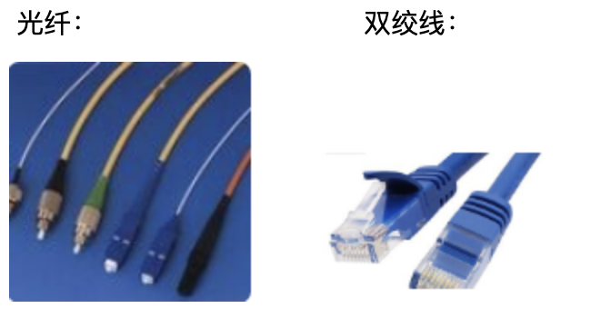
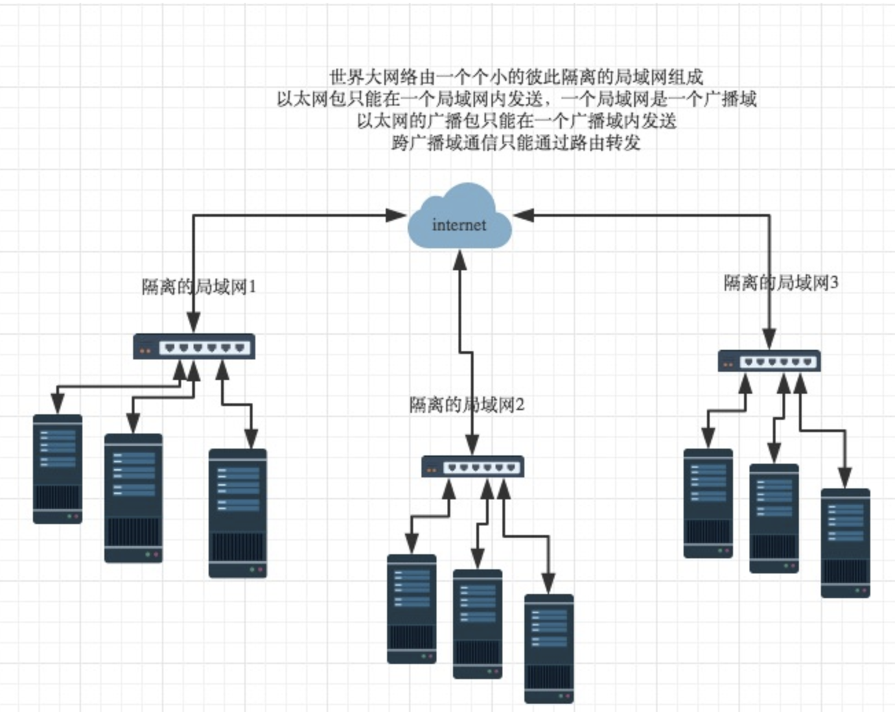
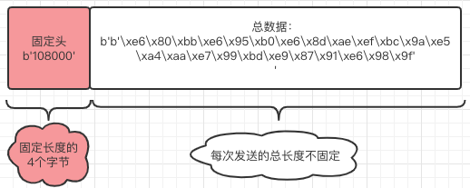

# 第五章 网络编程

#### 本章具体小节如下


1. **第一节：网络相关基础理论知识**
2. **第二节：基于TCP协议的socket套接字**
3. **第三节：如何处理粘包现象**
4. **第四节：基于UDP协议的socket套接字以及socketserver**


​	本章主要是带着大家简单学习一下网络相关的知识，以及能够实现通过socket套接字完成的网络通信。网络相关知识我们会涉及到C/S、B/S架构，网络通信协议原理，七层协议，TCP（三次握手四次挥手），UDP协议，socket套接字等。网络通信我们会涉及到：建立客户端、服务端完成的链接循环，通信循环，远程执行命令，粘包现象以及如何解决粘包现象等。除此之外我们还会带领大家研究基于多线程以及多进程的socketserver，以及从源码方面进行剖析。通过完成本章的学习希望大家可以对网络相关的理论知识有一定的了解，以及对socket底层通信有比较深入的掌握。


## 第一节：网络相关基础理论知识


#### 本节具体内容如下：

1. **C/S、B/S架构**
2. **互联网通信本质**
3. **osi七层协议**
   + 简单串联每层协议以及作用。
   + 对每层协议进行详细讲解补充。
4. **TCP，UDP协议**
5. **TCP协议的三次握手、四次挥手**
6. **socket套接字**


#### 1.C/S、B/S架构

​	客户端英文名称：Client，

​	浏览器英文名称：Browser.

​	服务端英文名称：Server.

​	C/S架构：基于客户端与用户端之间的架构。例如：QQ、微信、优酷、暴风影音等等。

+ 优点：C/S架构的界面和操作非常丰富满足客户的个性化要求，安全性很容易保证，响应速度较快。

+ 缺点：需要开发客户端和服务器两套程序，开发成本维护成本较高，兼容性差，用户群固定等。	

​	B/S架构：基于C/S架构的一种特殊的C/S架构，浏览器与服务端之间的架构。

+ 优点：分布性强，客户端几乎无需维护，开发简单，共享性强，维护简单方便。

+ 缺点：个性化低，安全性以及响应速度需要花费巨大设计成本。

​    小结：CS响应速度快，安全性强，一般应用于局域网中，但是开发维护成本高；BS可以实现跨平台，客户端零维护，但是个性化能力低，响应速度较慢。所以有些单位日常办公应用BS，在实际生产中使用CS结构。


#### 2.互联网通信本质

​	什么叫互联网通信？

​	现在追溯到八九十年代，当时电话刚刚兴起，还没有手机的概念，只是有线电话，那么此时你要是给在外地的人打电话，你应该怎么做？

​	首先你要确保你们两个的座机要有一堆连接介质连接（电话线，转换器等等）咱们统称物理连接介质。

​	其次，你要拨号，锁定对方的电话。

​	最后就开始通话了。

​	通话是有学问的，当时那个年代还没有推广普通话，所以你要是和河南的人电话联系，你要讲河南话。

​	你要是和东北的人电话联系，你要讲东北话。

​	你要是和上海的人联系你要讲上海话。


​	如果你要是有广西，内蒙，唐山，山东等等等等的朋友，你要是打电话是否都要学习当地的方言才能沟通呢？

​	其实不是，而是咱们推广了普通话，这样只要大家都会说普通话，这样就可以建立良好的通信。

​	那如果是与特朗普和普京通电话呢？


​	那你还要学各个国家的语言么？ No！No! No! 咱们现在国际上交流通用语言就是英语，其实咱们把英语学会了，就可以与各个国家的人交流了。这两个例子说明了什么？说明了咱们要统一标准，都遵循一个标准的话，就可以建立良好的通信。

那么我们把思路回归到互联网上来，什么是网络之间的通信？

其实互联网通信就是你的客户端软件：计算机+操作系统+软件，与服务端的软件：计算机+操作系统+软件之间的通信

扫雷，纸牌算不算互联网通信？这个不算互联网通信，互联网通信是精确到客户端的软件（比如QQ）与服务端的软件（QQ）之间的通信。

​	两台计算机之间的通信与两个人打电话原理是一样的。

- 首先要通过各种物理连接介质连接。
- 找准确确定对方计算机（准确到软件）的位置。
- 通过统一的标准（一揽子协议）进行数据的收发。

​    物理连接介质，这个是网络工程师所考虑的，后面也会给大家简单的讲到，咱们主要就是学习这统一的标准。

​    英语成为世界上所有人通信的统一标准，如果把计算机看成分布于世界各地的人，那么连接两台计算机之间的internet实际上就是一系列统一的标准，这些标准称之为互联网协议，互联网的本质就是一系列的协议，总称为‘互联网协议’（Internet Protocol Suite).

​    互联网协议的功能：定义计算机如何接入internet，以及接入internet的计算机通信的标准。


#### 3.osi七层协议

+ **简单串联每层协议以及作用**

  互联网协议按照功能不同分为osi七层或tcp/ip五层或tcp/ip四层

  ​	我们将应用层，表示层，会话层并作应用层，从tcp／ip五层协议的角度来阐述每层的由来与功能，搞清楚了每层的主要协议就理解了整个互联网通信的原理。

  ​	首先，用户感知到的只是最上面一层应用层，自上而下每层都依赖于下一层，所以我们从最下一层开始切入，比较好理解每层都运行特定的协议，越往上越靠近用户，越往下越靠近硬件。

  接下来我们自下往上进行详细的分析。

  + **物理层**

    物理层就是网线，交换机，路由器等一堆物理连接介质，他连接就是你的网卡。

    

    我在这发一堆010101011110 高低高低高高高高电平他在那边会啊啊啊啊啊啊啊啊收到一堆 010101011110 ，单纯的电信号没有意义，物理层只是发一堆01010101，但是你应该对数据进行分组、划分，（类比与二进制8bit == 1bytes）这个就不是物理层干的，物理层只是发一堆0101010.

    要想让二进制有真正的意义就必须对二进制进行分组，分组不是物理层做的事儿，分组是数据链路层做的事情。

  + **数据链路层**

    数据链路层就是对这些二进制数据也就是比特流进行分组，早期的时候各个公司都有自己的分组方式，后来形成了统一的标准。对数据进行分组有什么意义？

    我们都写过信么？写信除去写信的内容之外，还要注意什么？你要写寄信人，收信人的地址。网络通信同理，我们要发数据，数据从哪里来，发到哪里去？我们一定要有注明。所以数据链路层是给你的数据进行分组，

    共同遵守的这个分组协议就是**以太网协议ethernet** 。

    一组电信号为一帧，构成一个数据报，

    每一组数据报分为报头和数据两部分。

    ​																head       |        data

    head包含：(固定18个字节)

    - 发送者／源地址，6个字节
    
    - 接收者／目标地址，6个字节
    
    - 数据类型，6个字节
    
      data包含：(最短46字节，最长1500字节)
    
    数据包的具体内容
    
    head长度＋data长度＝最短64字节，最长1518字节，超过最大限制就分片发送。
    
    头要固定长度：为什么？这就是标准的一种体现。
    
    发过去一帧，我会按照固定长度切出head ，data部分。先取出18个字节，再取出前六个，在取出后六个，确实是他 在读取数据。
    
    我们知道数据链路层做的事情了，还有一个问题，写信的时候，你知道通过具体某个省市门牌号确定寄信人，发信人地址，计算机如何确定地址呢？
    
    head中包含的源和目标地址由来：ethernet规定接入internet的设备都必须具备网卡，发送端和接收端的地址便是指网卡的地址，即mac地址
    
    **mac地址**：每块网卡出厂时都被烧制上一个世界唯一的mac地址，长度为48位2进制，通常由12位16进制数表示（前六位是厂商编号，后六位是流水线号）
    
    
    
    既然有了源地址，目标地址以及数据，那么数据是如何准确的发给对方呢？
    
    **在同一个局域网中，计算机的通信方式为广播**。
    
    什么叫广播？ 村里如果通知什么事情，都是村长进行全村的广播，只要他一广播，全村的每家每户都可以接收到信息。计算机都是瞎的，他是通过广播的方式。非常原始。有了以太网的标准，和广播的方式，全世界机器全部都能听见。
    
    以我举例： 我是太白金星，数据今天晚上请我吃饭。 在班级吼出来。
    
    然后你们找到这个包，拆包，发现不是自己，是不是就丢掉了。有了以太网和广播的方式，理论上就能实现通信。但是 我吼，你们吼不吼？ 全世界都丢一份，数据量太大了。比广播风暴还要大。那么我要是吼一嗓子，通过交换机是不是能传播很多，但是不能让全世界都听到？ 不切合实际，假如我把所有的交换机放到本教室，那么我通过数据发送，全世界能收到，但是这样的话，数据太大，所以有了局域网这一说：我从班里吼一嗓子，其他班能听到么？不能听到，我们班就好比一个局域网，在一个局域网之内计算机是通过广播+以太网协议进行通信的。好，那么现在 如果你一个服务端，客户端同在一个教室，通过以太网加上吼的方式能否传到，可以，这是一个局域网。但是你想在访问百度，是不是通过浏览器 客户端，访问百度这个服务端，那么你需要将百度客户端一个服务器放到你的旁边供你浏览么？ 不可能。mac地址只能在局域网中用，如果跨局域网怎么办？这个就是上一层网络层做的事情了。
    
  + **网络层**

    网络层由来：有了ethernet、mac地址、广播的发送方式，世界上的计算机就可以彼此通信了，问题是世界范围的互联网是由一个个彼此隔离的小的局域网组成的，那么如果所有的通信都采用以太网的广播方式，那么一台机器发送的包全世界都会收到，这就不仅仅是效率低的问题了，这会是一种灾难

    

    上图结论：必须找出一种方法来区分哪些计算机属于同一广播域，哪些不是，如果是就采用广播的方式发送，如果不是，就采用路由的方式（向不同广播域／子网分发数据包），mac地址是无法区分的，它只跟厂商有关

    网络层功能：引入一套新的地址用来区分不同的广播域／子网，这套地址即网络地址。

    **IP协议**

    IP协议就是确定对方局域网的位置（具体的我们下一节详细说明），所以：ip + mac + 广播的方式 就能让你找到全世界所有的计算机的位置。没问题吧？但是这样你就可以通信了么？没有！ 互联网之间通信本质是：客户端的应用软件与服务端的应用软件的通信，只是找到计算机的位置是不够的，你应该需要找到具体的软件的位置。你的计算机上软件很多，每一个软件都有一个对应的端口用于专门收发数据的，这个端口就是下一层的事情了。

  + **传输层**

    传输层就是TCP/UDP协议也叫做端口工作协议。这样我们就可以找到计算机具体软件的位置。

    所以：现在是ip+mac+端口 就可以确定全世界任何一个计算机上的任何一个软件的位置。

  + **应用层**

    这个协议是每个软件自定义的一些协议。

    那么基本上我们就了解了以上这些协议以及每个协议具体的功能，简单的从上至下捋顺一遍。

    

+ **对每层协议进行详细讲解补充**

  + 数据链路层
    + 交换机的学习功能
  
      我要进行数据通信，我要吼一嗓子，将我的数据包发到交换机上，然后交换机将所有的数据包都发到你们的网卡上，进行查找。找到之后拿到了数据各种拆包，然后回包。我继续进行数据通信，然后又吼一嗓子，交换机发到所有的计算机上，周而复始。这样有什么问题？交换机每次都要通过广播的方式寻找目标计算机，消耗太大了。其实针对这个问题交换机给我们提供了一个mac地址学习功能：
  
      + 工作原理
  
        你的计算机连接的是网口5，目标计算机连接的是网口1，你现在要给目标计算机发送数据。你要先以单播的方式发给交换机：
  
        | 网口号 |      mac地址      |
        | :----: | :---------------: |
        | 网口1: | FF-FF-FF-FF-FF-FF |
        | 网口2: | FF-FF-FF-FF-FF-FF |
        | 网口3: | FF-FF-FF-FF-FF-FF |
        | 网口4: | FF-FF-FF-FF-FF-FF |
        | 网口5: | FF-FF-FF-FF-FF-FF |
  
        交换机接受到你的消息之后，马上将你的网口与mac地址对应上：
  
        | 网口号 |      mac地址      |
        | :----: | :---------------: |
        | 网口1: | FF-FF-FF-FF-FF-FF |
        | 网口2: | FF-FF-FF-FF-FF-FF |
        | 网口3: | FF-FF-FF-FF-FF-FF |
        | 网口4: | FF-FF-FF-FF-FF-FF |
        | 网口5: | 1C-39-47-C2-9E-0F |
  
        然后交换机再以广播的方式将消息数据发送，交换机所连接的所有的计算机都会接受到消息数据，只有目标计算机会接受数据，其余的计算机发现不是找自己的全部将数据丢掉。当目标计算机进行回消息时，交换机就会将目标计算机的网口（网口1）与目标计算机的mac地址对应上。
  
        | 网口号 |      mac地址      |
        | :----: | :---------------: |
        | 网口1: | 1D-25-F3-43-9A-E3 |
        | 网口2: | FF-FF-FF-FF-FF-FF |
        | 网口3: | FF-FF-FF-FF-FF-FF |
        | 网口4: | FF-FF-FF-FF-FF-FF |
        | 网口5: | 1C-39-47-C2-9E-0F |
  
        这样以来，以后同一个交换机下的计算机再次发送消息时，交换机先去查看此表有无记录如果可以查询到，则以单薄的形式发到目标计算机，如果没有对应则以广播的形式发送给所有计算机（不包含源计算机）。
  
        
  
    + ARP协议
  
      ARP协议他的定位不是很明确，在osi七层模型中，ARP协议属于数据链路层，而在TCP/UDP模型中，人们往往将ARP协议归纳在网络层。我们这里主要讲的就是OSI七层模型，所以将APR协议划归到数据链路层。
  
      ARP协议（Address Resolution Protocol）地址解析协议，根据目标IP地址获取目标物理地址的协议。
  
      ARP协议需要分两种情况讨论：
  
      1. 同一个局域网（网段，子网）。
      2. 不同的局域网（网段，子网）。
      
      本节我们先说在**同一个局域网**下的ARP协议是如何工作的。
      上面我们说过，在同一个局域网内，计算机如何通信？计算机是通过广播的方式+以太网协议进行通信的。mac地址是计算机的物理地址，它可以确定计算机在一个局域网内的具体位置。
      
      
      但是真实情是：如果两台计算机之间要想通信，如下图计算机1想将数据发送给计算机5，那么他可能不知道计算机5的mac地址，但是**必须要知道计算机5的IP地址**。
      
      
      
      所以我们就得借助ARP协议，通过对方的IP地址获取到其mac地址，然后在同一个局域网内通过广播+以太网协议在进行通信。那么ARP协议的工作原理是什么呢？
      
      例如：主机172.16.10.10  访问 172.16.10.11
      前提条件：在同一个局域网。
      
      | 源mac             | 目标mac           | 源ip         | 目标ip       | 源端口号 | 目的端口号 | 数据部分 |
      | ----------------- | ----------------- | ------------ | ------------ | -------- | ---------- | -------- |
      | 1C-39-47-C2-9E-0F | FF-FF-FF-FF-FF-FF | 172.16.10.10 | 172.16.10.11 | 8080     | 10342      | 数据     |
      
      1. 计算机1会以广播的形式在局域网发送一个ARP请求：请求信息为上面显示信息（询问IP地址为172.16.10.11的计算机，告诉我172.16.10.10 你的mac地址！！）。
      2. 同一个局域网内的所有计算机都会接受到这个消息，当目标IP从属于的计算机接受到我的信息之后，检查发现这个信息是给我的，然后将自己的mac地址以单播的形式回给我。
      
      其实ARP协议还有个功能，他在每个计算机都有一个ARP缓冲区，这里面有一个ARP列表：这个列表就是记录的IP地址和MAC地址的对应关系，但是这个缓存区是有生存期的，一段时间之后就会清空，如果清空了那么在重复此操作。
      
      |    IP地址     |      MAC地址      |
      | :-----------: | :---------------: |
      | 172.16.10.11  | 1D-25-F3-43-9A-E3 |
      | 168.16.12.36  | 1A-5D-B3-43-3D-5F |
      | 172.14.15.107 | 1B-23-A3-43-9A-6A |
      |  127.36.1.18  | 1B-25-E1-43-2B-4C |
      
      同一个局域网内，ARP协议真正的流程是这样：
      主机172.16.10.10  访问 172.16.10.11
      
      1. 计算机1会先查询自己的ARP缓存区的ARP列表，如果有对应mac地址则直接发送数据。如果没有或者ARP列表清空了则进行下面步骤：
         1. 计算机1会以**广播**的形式在局域网发送一个ARP请求：请求信息为上面显示信息（询问IP地址为172.16.10.11的计算机，告诉我172.16.10.10 你的mac地址！！）。
         2. 同一个局域网内的所有计算机都会接受到这个消息，当目标IP从属于的计算机5接受到我的信息之后，检查发现这个信息是给我的，然后将自己的mac地址以单播的形式回给我。
       3. 计算机1接收到计算机5的消息之后，将对应关系补充至ARP列表，然后与计算机5开始通信。
  
  + **网络层**
    
    + IP协议
      
      规定网络地址的协议叫ip协议，它定义的地址称之为ip地址，广泛采用的v4版本即ipv4，它规定网络地址由32位2进制表示
      
      范围0.0.0.0-255.255.255.255
      
      一个ip地址通常写成四段十进制数，例：172.16.10.1
      
      **ip地址分成两部分**
      
        - 网络部分：标识子网
      - 主机部分：标识主机
      
      注意：单纯的ip地址段只是标识了ip地址的种类，从网络部分或主机部分都无法辨识一个ip所处的子网
      
      例：172.16.10.1与172.16.10.2并不能确定二者处于同一子网
      
      **子网掩码**
      
      所谓”子网掩码”，就是表示子网络特征的一个参数。它在形式上等同于IP地址，也是一个32位二进制数字，它的网络部分全部为1，主机部分全部为0。比如，IP地址172.16.10.1，如果已知网络部分是前24位，主机部分是后8位，那么子网络掩码就是11111111.11111111.11111111.00000000，写成十进制就是255.255.255.0。
      
      知道”子网掩码”，我们就能判断，任意两个IP地址是否处在同一个子网络。方法是将两个IP地址与子网掩码分别进行AND运算（两个数位都为1，运算结果为1，否则为0），然后比较结果是否相同，如果是的话，就表明它们在同一个子网络中，否则就不是。
      
      比如，已知IP地址172.16.10.1和172.16.10.2的子网掩码都是255.255.255.0，请问它们是否在同一个子网络？两者与子网掩码分别进行AND运算，
      
      172.16.10.1：        10101100.00010000.00001010.00000001
      
      255255.255.255.0:11111111.11111111.11111111.00000000
      
      AND运算得网络地址结果：10101100.00010000.00001010.000000001->172.16.10.0
      
       
      
      172.16.10.2：	    10101100.00010000.00001010.00000010
      
      255255.255.255.0:11111111.11111111.11111111.00000000
      
      AND运算得网络地址结果：10101100.00010000.00001010.00000001->172.16.10.0
      
      结果都是172.16.10.0，因此它们在同一个子网络。
      
      总结一下，IP协议的作用主要有两个，一个是为每一台计算机分配IP地址，另一个是确定哪些地址在同一个子网络。
      
      
    
  + **传输层**
  
    传输层的由来：网络层的ip帮我们区分子网，以太网层的mac帮我们找到主机，然后大家使用的都是应用程序，你的电脑上可能同时开启qq，暴风影音，等多个应用程序，那么我们通过ip和mac找到了一台特定的主机，如何标识这台主机上的应用程序，答案就是端口，端口即应用程序与网卡关联的编号。
  
    传输层功能：建立端口到端口的通信
  
    补充：端口范围0-65535，0-1023为系统占用端口
  
    传输层也有协议叫‘端口’协议，这两个协议包含两种：UDP协议，TCP协议，下面我们会详细讨论。
    
  + **应用层**：
  
    应用层由来：用户使用的都是应用程序，均工作于应用层，互联网是开放的，大家都可以开发自己的应用程序，数据多种多样，必须规定好数据的组织形式 
  
    应用层功能：
  
    1. 选择一个合适的网络应用体系结构；
  
    2. 根据所选的网络应用体系结构，确定客户进程和服务器进程；
  
    3. **确定客户进程和服务器进程的端口号**；
  
    4. **确定客户进程和服务器进程的IP地址**；
  
    5. **选择一个合适的应用层协议**；
  
    6. 考虑网络应用所需的服务。
  
    从上面我们可以得知应用层要获取客户端服务端的端口号以及ip协议，还有就是选择一个合适的应用层协议，封装我的数据，目前存在的应用层协议有：
  
    DNS,FTP,HTTP,telnet,HTTP,SMTP,POP3,SNMP等。
  
    我们使用的应用程序都会根据其本身的性质选择其中的某个协议作为传输数据的规范。
  
    举个例子比如FTP协议，FTP协议就是文件传输协议，FTP是因特网上使用得最广泛的文件传送协议。FTP提供交互式的访问，允许客户指明文件类型与格式，并允许文件具有存取权限。
  
    比如我们利用百度云盘上传一个文件，文件读取出来就是一堆二进制的数据，它不只是上传一堆这样的二进制数据，我们上传文件时肯定需要验证文件的完整性，获取源文件名，获取源文件的大小等，所以我们假如file_content代表文件的内容，我们应用程序可以按照一定规范对其进行加工：
  
    原本我们只需要上传file_content数据即可，现在我们要上传一个字典：
  
    ```python
    dic = {
    	"md5": 'ec623e4013d9e87a367ea086b8392563',
    	"filename": '太白金星.md',
    	"file_size": 7676565,
    	"file_content": file_content,
    }
    ```
  
    这样百度云盘接受到我的数据之后，就可以获取到相应的数据信息了。
  
    
  
  + **小结**：
  
    现在你的计算机A想要向一个计算机B发送数据，你需要知道什么信息？ 
  
     1. 应用层获取你的IP地址（包含子网掩码）、端口，和对方的IP地址（包含子网掩码）、端口。
  
     2. 通过ARP协议拿到对方的mac地址（无论在不在同一个局域网都可以）。
  
     3. 通过对方的IP地址和子网掩码去判断，计算机A与计算机B是否在同一个局域网。
  
        + 如果是在同一个局域网则通过广播+以太网协议找到计算机B的位置，然后在通过端口号确定软件的位置，从而进行通信。
  
        + 如果不是在同一个局域网怎么办？
  
          那你就将数据传给路由器就行了，路由器遵从路由协议通过对方的IP地址（包含子网掩码）确定对方的网段，将数据发送到目标计算机从属于的路由器上然后通过广播+以太网协议最终发送到目标计算机，最后通过端口传输到目标软件上。
  
    这只是一个简单的描述，下一节会给大家做一个详细的过程分析。
  
    所以说，我要通过计算机A给计算机B发送数据，只要知道对方的IP地址和端口（mac地址会通过ARP协议自动获取）即可，也就是说，IP地址+端口就可以定位世界上任意一台计算机上的目标软件。
    
    

#### 4.TCP，UDP协议

由于tcp协议与udp协议比较重要，我们单独的把传输层的两个协议拿出来进行详细的说明。

+ **UDP协议**

  UDP 是User Datagram Protocol的简称， 中文名是用户数据报协议，它是不可靠的无连接协议，面相数据报，相对不安全，但是他的传输效率高，尽最大努力服务，无拥塞控制。一般用于即时通信：qq聊天，微信，在线视频，网络语音电话，对数据准确性和丢包要求比较低，但是速度必须快。

  ”报头”部分一共只有8个字节，总长度不超过65,535字节，正好放进一个IP数据包。

  | 以太网头 | ip头 | udp头 | 数据 |
  | -------- | ---- | ----- | ---- |
  |          |      |       |      |

+ **TCP协议**

  TCP协议是Transmission Control Protocol的简称，中文名是传输控制协议，它是可靠的面相连接的流式协议。相对安全，但是传输效率相对低，一般用于文件传输，发送或者接受邮件，远程登录等等。

  可靠传输，TCP数据包没有长度限制，理论上可以无限长，但是为了保证网络的效率，通常TCP数据包的长度不会超过IP数据包的长度，以确保单个TCP数据包不必再分割。总长度也是不超过65535字节。
  
  | 以太网头 | ip头 | TCP头 | 数据 |
  | -------- | ---- | ----- | ---- |
  |          |      |       |      |
  
  ***IP数据报就是一个抽象概念，是对数据包的结构进行分析，由首部和数据两部分组成，总长度不超过65535个字节。***
  
  

 

​		tcp报文


#### 5.**TCP协议的三次握手、四次挥手**

比如客户端与服务端基于TCP协议这种面相连接的网络通信，通过OSI七层模型的层层封装，然后广播、在通过ARP协议获取mac地址，经由路由协议终于找到了计算机B对应的软件上，这就好比唐僧师徒四人经历九九八十一最终取得真经一样，如果每次通信都是这么艰辛，不仅效率低，而且各个硬件设备处理的事务重复繁琐，产生的内耗是巨大的。所以如果让我们去设计网络通信的方式应该怎么去做？

比如，如果回到没有导航的年代，我想跑保定到济南的运输线，你怎么做？ 第一次的时候，你应该参考纸质版地图，经过路标等提示信息、沿路的询问最终到达济南。那么下一次你在从保定跑济南，你还用这么麻烦么？ 最优路线你已经记住了，下一次你就直接按照上一次走的路线送货就可以了。

所以，我们网络通信也是基于这个原理，当客户端与服务端第一次建立链接时，他先要建立最优路线的专属管道，管道建立完毕之后，我的客户端想要给服务端发送消息了，直接将数据向管道一丢，数据就会顺着管道传输到服务端上，非常的快速方便。同理，服务端要想与客户端回消息，也一定要先建立最优路线的专属管道，消息顺着管道就会快速的到达客户端，这样省去了每次发送数据不必要的操作，重复的工作，提高了效率。

+ **TCP协议的三次握手**

  所以客户端要与服务端通信之前，先要建立链接，两条通道修好之后，两边各自在利用通道收发消息，方便快捷。那么TCP协议第一次建立链接需要经历三次握手。

  

  + 思路：

    

    这是几次握手？哪来的三次握手呢？这不是四次握手么？对，建立链接时理应是四次握手，但是这里的2、3次握手是可以整合到一起的，服务端可以发送一个回应既包含同意客户端与我建立链接，又包含我也向客户端建立链接的申请。

    

  + 规范版本：

    

    

    图解：

    SYN就是请求，seq是一个随机的序列号。

    第一次握手：客户端发送SYN=1 随机序列号seq到服务端，服务端接受到消息。

    第二次握手：客户端回一个ack=1+x,并且也发送了一个SYN=1，随机序列号seq=y,这个说明服务端同意了（客户端到服务端的通道建立完毕），并且服务端也给客户端发送了一个建立通道的请求。

    第三次握手：客户端接受到消息之后，回复了一个ack=1+y,消息到达服务端（服务端到客户端的通道建立完毕）。

    至此两条通道建立完毕，接下来客户端与服务端就可以沿着两条通道互相收发消息了。

    

+ **TCP协议的四次挥手**

  当客户端向服务端消息发送完毕，应该将通道关闭（通道一直开启会占用资源），此时就涉及到了TCP协议断开链接的四次挥手。
  
  + 思路：
  
    
  
    **为什么断开链接需要四次挥手呢**？2、3整合成一次不行么？（**面试题经常会问到**）
  
    这个与建立链接时不太一样，客户端向服务端发起断开链接的请求时，证明客户端已经向服务端数据发送完毕了，所以我请求断开链接，**但是此时服务端向客户端端发送的数据完成与否不确定**，服务端需要等待向客户端发送的数据全部完成之后，才可以发起断开链接的请求，所以不能整合到一起。
  
  + 规范版本：
  
    
  
    
  
  + 图解：
  
    第一次挥手：客户端向服务端的数据发送完毕之后，会向服务端发送一个FIN=1 seq=u的请求，服务端接受到这个请求。
  
    第二次挥手：服务端接受到这个请求之后，会向客户端发送一个ack=1+u的请求，同意客户端断开链接，客户端接受到这个请求，断开了通往服务端的通道。
  
    第三次挥手：服务端向客户端的数据发送完毕之后，会向客户端发送一个FIN=1 seq=w的请求，客户端接受到这个请求。
  
    第四次挥手：客户端接受到这个请求之后，会向服务端发送一个ack=1+w的请求，同意服务端断开链接，服务端接受到这个请求，断开了通往客户端的通道。
  
  
  
  相关面试题：
  
  1. 为什么断开链接需要四次挥手呢？
  
     这个与建立链接时不太一样，客户端向服务端发起断开链接的请求时，证明客户端已经向服务端数据发送完毕了，所以我请求断开链接，**但是此时服务端向客户端端发送的数据完成与否不确定**，服务端需要等待向客户端发送的数据全部完成之后，才可以发起断开链接的请求，所以不能整合到一起。
  
  2. 如果已经建立了连接，但是客户端突然出现故障了怎么办？
  
     TCP设有一个保活计时器，显然，客户端如果出现故障，服务器不能一直等下去，白白浪费资源。服务器每收到一次客户端的请求后都会重新复位这个计时器，时间通常是设置为2小时，若两小时还没有收到客户端的任何数据，服务器就会发送一个探测报文段，以后每隔75秒钟发送一次。若一连发送10个探测报文仍然没反应，服务器就认为客户端出了故障，接着就关闭连接。
  
  3. 什么是SYN洪水攻击？
  
     TCP协议也称为"好人"协议，什么叫好人？因为TCP协议不会拒绝任何客户端来链接我，只有我客户端来链接我，我就给他回一个ack然后向客户端发送SYN请求，等待客户端同意，在客户端没有同意之前，服务器会维护一个未连接队列，该队列为每个客户端的SYN包（syn=j）开设一个条目，该条目表明服务器已收到SYN包，并向客户发出确认，正在等待客户的确认包。这些条目所标识的连接在服务器处于Syn_RECV状态，当服务器收到客户的确认包时，删除该条目，服务器进入ESTABLISHED状态。
     
       
     
     SYN洪水攻击：利用TCP协议缺陷，通过发送大量的半连接请求，耗费CPU和内存资源，配合IP欺骗，SYN攻击能达到很好的效果，通常，客户端在短时间内伪造大量不存在的IP地址，向服务器不断地发送syn包，服务器回复确认包，并等待客户的确认，由于源地址是不存在的，服务器需要不断的重发直至超时，这些伪造的SYN包将长时间占用未连接队列，正常的SYN请求被丢弃，目标系统运行缓慢，严重者引起网络堵塞甚至系统瘫痪。
     

#### 6.socket套接字

看socket之前，先来回顾一下五层通讯流程：


但实际上从传输层开始以及以下，都是操作系统以及各个硬件设备帮咱们完成的，下面的各种包头封装的过程，用咱们去一个一个做么？**NO！**


　　Socket又称为套接字，它是应用层与TCP/IP协议族通信的中间软件抽象层，它是一组接口。在设计模式中，Socket其实就是一个**门面模式**，它把复杂的TCP/IP协议族隐藏在Socket接口后面，对用户来说，一组简单的接口就是全部，让Socket去组织数据，以符合指定的协议。当我们使用不同的协议进行通信时就得使用不同的接口，还得处理不同协议的各种细节，这就增加了开发的难度，软件也不易于扩展(就像我们开发一套公司管理系统一样，报账、会议预定、请假等功能不需要单独写系统，而是一个系统上多个功能接口，不需要知道每个功能如何去实现的)。于是UNIX BSD就发明了socket这种东西，socket屏蔽了各个协议的通信细节，使得程序员无需关注协议本身，直接使用socket提供的接口来进行互联的不同主机间的进程的通信。这就好比操作系统给我们提供了使用底层硬件功能的系统调用，通过系统调用我们可以方便的使用磁盘（文件操作），使用内存，而无需自己去进行磁盘读写，内存管理。socket其实也是一样的东西，就是提供了tcp/ip协议的抽象，对外提供了一套接口，同过这个接口就可以统一、方便的使用tcp/ip协议的功能了。

　　其实站在你的角度上看，socket就是一个模块。我们通过调用模块中已经实现的方法建立两个进程之间的连接和通信。也有人将socket说成ip+port，因为ip是用来标识互联网中的一台主机的位置，而port是用来标识这台机器上的一个应用程序。 所以我们只要确立了ip和port就能找到一个应用程序，并且使用socket模块来与之通信。

套接字起源于 20 世纪 70 年代加利福尼亚大学伯克利分校版本的 Unix,即人们所说的 BSD Unix。 因此,有时人们也把套接字称为“伯克利套接字”或“BSD 套接字”。一开始,套接字被设计用在同 一台主机上多个应用程序之间的通讯。这也被称进程间通讯,或 IPC。套接字有两种（或者称为有两个种族）,分别是基于文件型的和基于网络型的。 

***基于文件类型的套接字家族***

套接字家族的名字：AF_UNIX

unix一切皆文件，基于文件的套接字调用的就是底层的文件系统来取数据，两个套接字进程运行在同一机器，可以通过访问同一个文件系统间接完成通信

***基于网络类型的套接字家族***

套接字家族的名字：AF_INET

(还有AF_INET6被用于ipv6，还有一些其他的地址家族，不过，他们要么是只用于某个平台，要么就是已经被废弃，或者是很少被使用，或者是根本没有实现，所有地址家族中，AF_INET是使用最广泛的一个，python支持很多种地址家族，但是由于我们只关心网络编程，所以大部分时候我么只使用AF_INET)


## 第二节：基于TCP协议的网络通信


#### 本节具体内容如下：

1. **对上一节内容补充总结**
2. **单个客户端与服务端通信**
3. **通信循环**
4. **通信，连接循环**
5. **远程执行命令示例**
6. **提出粘包现象**


#### 1.对上一节内容补充总结

上一节我们通篇讲的是网络相关的知识，接触了很多专业名词以及各种协议，在本节开篇先对上一届内容进行简单的汇总梳理。

+ 相关名词解释

  + 互联网协议：就是制定一系列全世界范围内都公认的通信标准，让全世界各地的人通过计算机都可以通信。（比如英语）

  + mac地址：网卡烧制的48位二进制一串数字，计算机上的唯一标识，全世界的每台计算机的mac都是不同的，唯一的，由12位16进制数表示，根据它可以查找局域网内计算机的位置。

  + 以太网协议：数据链路层的协议，可以将bit流分组，分成固定的头18个字节（源mac地址，目标mac地址，数据类型）和数据两部分 ，用于查找局域网内的目标计算机。

  + 广播：计算机在局域网内通信方式，一个计算机发出数据，同一局域网内的其他计算机都可以接受到数据。

  + 单播：数据可以单独发送，比如交换机接受到一个计算机来的数据之后，可以通过mac表查找目标mac地址对应的网口，然后单独发送。

  + 局域网内的通信是通过广播+以太网协议完成的。

  + 局域网，网段，子网：都是一个概念，都是局域网的意思。什么是局域网呢？

    局域网将一定区域内的各种计算机、外部设备和数据库连接起来形成计算机通信网，通过专用数据线路与其他地方的局域网或数据库连接，形成更大范围的信息处理系统。局域网可以实现文件管理、应用软件共享、打印机共享等功能，在使用过程当中，通过维护局域网网络安全，能够有效地保护资料安全，保证局域网网络能够正常稳定的运行。 局域网自身的组成大体由计算机设备、网络连接设备、网络传输介质3大部分构成，其中，计算机设备又包括服务器，工作站，网络连接设备则包含了网卡、集线器、交换机，网络传输介质简单来说就是网线，由同轴电缆、双绞线及光缆3大原件构成。

    

  + 集线器：存在局域网中，就是扩充网线端口，它没有mac地址学习功能，只能广播的形式进行通信。也就是low版的"交换机"。

    

  + 交换机：存在局域网中，也是扩充网线端口，但是能够利用mac地址学习功能绘制mac地址～网线口表，可以通过单播的形式收发数据。常见的标准的固定端口数量有8、12、16、24、48等几种。

    交换机与集线器的区别也就是集线器必须通过广播的形式发送数据，而交换机存在mac地址～网口表，可以单播的形式发送数据。

    

  + 交换机mac地址学习功能：交换机存储一张mac地址～端口对照表，作用是可以对照表快速定位目标mac的端口通过单播的形式传递数据。

  + ARP协议：通过计算机的IP地址获取其mac地址。我们上一节只讲了同一个局域网内ARP协议是如何工作的，本节会讲到不同的局域网内ARP协议如何工作。

  + 路由器：简单描述一下，路由器又可以称为网关设备，它就是连接为外网与不同的子网传递数据，他的包含了很多协议，其中有几个技术点需要我们清楚：

    1. DHCP协议，给局域网内的计算机自动分配IP地址。
    2. 路由器也有mac地址（下面会说到他的作用）。
    3. 路由协议，包含多个协议，主要目的就是选取到达目的路由的最优路径。
    4. 默认网关：计算机A以广播的形式发数据，当发现子网内都没有找到目标mac时，就会将数据发送到路由器上的默认网关，然后由默认网关再将数据发送出去。一般默认网关的ip地址为xxx.xxx.xxx.1。

  + IP地址：标示的一个计算机的网络地址一般都是四段十进制。

    + 公网IP:也可以直接称为外网IP，可以直接访问因特网,公网IP时唯一的。
    + 私网IP:就是路由器给你自动分配虚拟的IP，同一个局域网内的私网IP唯一，但是不可直接访问因特网。

  + 子网掩码：表示子网络的一个参数，有两个作用：

    + 与IP地址and运算，确定子网网段。

    + 不同种类的子网掩码限定了局域网内ip地址的数量也就是限定了局域网内承载计算机的上限。

      A类子网掩码：255.0.0.0

      B类子网掩码：255.255.0.0

      C类子网掩码：255.255.255.0 

      由于我们国家引入计算机技术相对较晚，所以给我们国家分配的大部分都是C类子网掩码，这就意味我们如果创建一个局域网，ip地址取值范围0～255（0，255不能使用）. 

  + 端口协议：简单说就是数据到传输层需要封装客户端与服务端的端口号，有两种协议分别是UDP与TCP。

    

+ 同一局域网，计算机通信流程：

  https://www.processon.com/view/link/5d784083e4b04a19501d5ddb

  提取密码：taibai

+ 不同局域网，计算机通信流程：

  https://www.processon.com/view/link/5d78ab9ae4b03461a3a4d184

  提取密码：taibai

  

 + **额外解疑**

  1. 有人常说数据链路层对应的设备除了计算机之外还有以太网(二层)交换机（就是我们讲的交换机）为什么？

     因为以太网交换机会将计算机发出的数据进行拆包，但是只能拆到数据链路层，他需要查看源mac地址以及目标mac地址。

  2. 网络层对应的设备有路由器，为什么？

     网络层除了计算机在拆封数据时需要封装或者解析IP地址，mac地址，路由器也是需要拆封数据直至网络层，因为它需要查看源ip 目标ip，源mac，目标mac。

  3. 家用路由器与企业路由器的区别？

     家用路由器与企业路由器区别很多，对我们有帮助的区别就是：

     家用路由器（比如大学宿舍中一个路由器可以连接几台电脑）只有一个外网IP，只能设置一个网段，每个连接电脑的端口都是内网IP，它既有路由的功能，也具有交换机的功能，因为电脑数量很少，不需要用交换机分端口。

     企业级路由器可以连接多个外网IP，可以设置多个网段，每个端口对应一个网段，每个端口都可以连接一个交换机，然后交换机在连接其他交换机...... 理论上，一个端口就可以分流出去255左右个IP地址。

  4. 路由器都**必须**有路由表（每个端口对应那个网段），路由协议（计算机给另一个网段发消息，计算最优路径），ARP协议（存储周围获着经常发送的路由器的mac地址与ip），**可以**具有交换机的功能（比如家用路由一般都有交换机的功能即有mac地址与端口的对照表）。
  5. 交换机主要就是分多个端口，而且可以泛洪（广播的功能），具有mac地址表。

  6. ARP请求以广播发送、以单播回应

  7. 路由器隔离广播。每一个网段都是独立的广播域。

  8. 跨越网段通信必须使用网关的mac地址。

  9. 上面不同网段通信时，源IP与目的IP始终不变，但是只要经过路由就需要mac地址置换。

     如想深入分析，建议模拟环境，进行抓包操作，可以看到具体经历了哪些过程，有助于深入了解。


#### 2.单个客户端与服务端通信

+ 服务端代码示例：

  ```python
  import socket
  
  # 1. 创建socket对象（买电话）
  phone = socket.socket(socket.AF_INET, socket.SOCK_STREAM)  # 参数可以默认不写
  
  # 2. 绑定IP地址和端口  # 安装电话卡
  phone.bind(('127.0.0.1',8848))
  
  # 3. 监听（开机）
  phone.listen(5)
  
  # 4. 等待电话连接（等别人给你打电话）
  phone.accept()
  # 此时运行就会一直阻塞住。
  ```

  参数详解：

  socket.AF_INET：基于网络的socket套接字。

   socket.SOCK_STREAM：基于TCP协议的socket套接字。

  phone.listen:这个知识点有一些不容易理解，服务端开启之后，等待客户端连接，listen做了一个客户端数量的限定，listen(n)只有n+1的客户端可以连接上我的服务端，但是连接上之后，只有第一个客户端可以与服务端进行互相通信，其他的n个客户端已经成功建立链接但是需要等待第一个客户端结束之后，逐一进行通信，通信之前的状态都是阻塞状态；n+1以外的客户端虽然也是阻塞，但是是连链接都建立不成的，就是单纯的阻塞。只有第一客户端结束之后，剩余的才可以逐一建立链接等待。这个其实与服务端开启的半链接池相关，什么叫半链接池？服务端开启之后，只要有客户端链接我，理论上来说都可以与我建立链接的，但是只要建立链接，在我服务端就会占有一定的内存，暂存这些链接数据，试想一下，如果1000万个链接进入我的服务端的内存，这样会极大的浪费内存资源，所以服务端设置一个半链接池，只允许n+1个客户端与我服务端建立链接，剩下的客户端也是处于阻塞状态，但是不会进入我的内存，这样可以控制客户端的数量，节省内存。

  

  accept：服务端会处于阻塞状态，直至有客户端链接我，服务端代码才会向下执行。

  服务端代码示例：此时运行一下就会一直阻塞住，我们继续完善。

  ```python
  import socket
  
  # 1. 创建socket对象（买电话）
  phone = socket.socket(socket.AF_INET, socket.SOCK_STREAM)  # 参数可以默认不写
  
  # 2. 绑定IP地址和端口  # 安装电话卡
  phone.bind(('127.0.0.1',8848))
  
  # 3. 监听（开机）
  phone.listen(5)
  
  # 4. 等待电话连接（等别人给你打电话）
  print('start...')
  conn,client_addr = phone.accept()  # 此时运行就会一直阻塞住。
  print('连接来了：',conn,client_addr)
  
  # 5. 接受消息
  msg = conn.recv(1024)  # 每次至多读取1024个字节
  print('客户端的消息：',msg)
  conn.send(msg.upper())
  
  # 6. 关闭连接
  conn.close()
  
  # 7. 关机
  phone.close()
  ```

+ 客户端代码示例：

  ```python
  import socket
  
  # 1. 创建socket对象（买电话）
  phone = socket.socket()
  
  # 2. 与服务端建立链接
  phone.connect(('127.0.0.1',8848))
  
  # 3. 发消息
  phone.send('hello'.encode('utf-8'))
  from_server_data = phone.recv(1024)
  print(from_server_data)
  
  phone.close()
  
  
  ```

  

  进行一个错误演示，先开启客户端，就会报错：

  

  先开启客户端就会报错，应该是先启动服务端，然后在开启客户端。

  同学们可以简单练习一下。


#### 3.通信循环

真实场景是互相沟通，有收有发，通讯循环。

+ server端代码示例：

  ```python
  import socket
  
  # 1. 创建socket对象（买电话）
  phone = socket.socket(socket.AF_INET, socket.SOCK_STREAM)  # 参数可以默认不写
  
  # 2. 绑定IP地址和端口  # 安装电话卡
  phone.bind(('127.0.0.1',8848))
  
  # 3. 监听（开机）
  phone.listen(5)
  
  # 4. 等待电话连接（等别人给你打电话）
  print('start...')
  conn,client_addr = phone.accept()  # 此时运行就会一直阻塞住。
  print('连接来了：',conn,client_addr)
  
  # 5. 循环收发接受消息
  while 1:
      msg = conn.recv(1024)  # 每次至多读取1024个字节
      print(f'来自客户{client_addr}的消息：{msg.decode("utf-8")}')
      to_client = input('>>>')
      conn.send(to_client.encode('utf-8'))
  
  # 6. 关闭连接
  conn.close()
  # 7. 关机
  phone.close()
  ```

  

+ 客户端代码示例：

  ```python
  import socket
  
  # 1. 创建socket对象（买电话）
  phone = socket.socket()
  
  # 2. 与服务端建立链接
  phone.connect(('127.0.0.1',8848))
  
  # 3. 循环收发消息
  while 1:
      to_server = input('>>>')
      phone.send(to_server.encode('utf-8'))
      from_server_data = phone.recv(1024)
      print(from_server_data.decode('utf-8'))
  
  phone.close()
  ```

  

  此时如果你直接关闭客户端，服务端就会出现如下的错误：

  

  所以，无论你的客户端是合理关闭，或者强制关闭，你的服务端最起码是正常关闭的。我们应该怎么解决？在服务端加上异常处理！

  服务端：

  ```python
  import socket
  
  # 1. 创建socket对象（买电话）
  phone = socket.socket(socket.AF_INET, socket.SOCK_STREAM)  # 参数可以默认不写
  
  # 2. 绑定IP地址和端口  # 安装电话卡
  phone.bind(('127.0.0.1',8848))
  
  # 3. 监听（开机）
  phone.listen(5)
  
  # 4. 等待电话连接（等别人给你打电话）
  print('start...')
  conn,client_addr = phone.accept()  # 此时运行就会一直阻塞住。
  print('连接来了：',conn,client_addr)
  
  # 5. 循环收发接受消息
  while 1:
      try:
          msg = conn.recv(1024)  # 每次至多读取1024个字节
          print(f'来自客户{client_addr}的消息：{msg.decode("utf-8")}')
          to_client = input('>>>')
          conn.send(to_client.encode('utf-8'))
      except ConnectionResetError:
          break
  
  # 6. 关闭连接
  conn.close()
  # 7. 关机
  phone.close()
  ```

  客户端：

  ```python
  import socket
  
  # 1. 创建socket对象（买电话）
  phone = socket.socket()
  
  # 2. 与服务端建立链接
  phone.connect(('127.0.0.1',8848))
  
  # 3. 循环收发消息
  while 1:
      to_server = input('>>>')
      phone.send(to_server.encode('utf-8'))
      from_server_data = phone.recv(1024)
      print(from_server_data.decode('utf-8'))
  
  phone.close()
  ```

  但是上面也不是非常合理，因为你的客户端无论是不是正常关闭，服务端一定是一直开启状态，等待其他人链接的。


#### 4.通信，连接循环

+ 服务端：

  ```python
  import socket
  
  # 1. 创建socket对象（买电话）
  phone = socket.socket(socket.AF_INET, socket.SOCK_STREAM)  # 参数可以默认不写
  
  # 2. 绑定IP地址和端口  # 安装电话卡
  phone.bind(('127.0.0.1',8848))
  
  # 3. 监听（开机）
  phone.listen(3)
  
  # 4. 等待电话连接（等别人给你打电话）
  
  while 1:
      conn,client_addr = phone.accept()  # 此时运行就会一直阻塞住。
  # 5. 循环收发接受消息
      while 1:
          try:
              msg = conn.recv(1024)  # 每次至多读取1024个字节
              print(f'来自客户{client_addr}的消息：{msg.decode("utf-8")}')
              to_client = input('>>>')
              conn.send(to_client.encode('utf-8'))
          except ConnectionResetError:
              break
      # 6. 关闭连接
      conn.close()
  # 7. 关机
  phone.close()
  ```

+ 客户端：

  ```python
  import socket
  
  # 1. 创建socket对象（买电话）
  phone = socket.socket()
  
  # 2. 与服务端建立链接
  phone.connect(('127.0.0.1',8848))
  
  # 3. 循环收发消息
  while 1:
      to_server = input('>>>')
      phone.send(to_server.encode('utf-8'))
      from_server_data = phone.recv(1024)
      print(from_server_data.decode('utf-8'))
  
  phone.close()
  ```


#### 5.远程执行命令示例

+ 先学习一下subprocess模块。

  ```python
  import subprocess
  
  obj = subprocess.Popen('dir',
                   shell=True,
                   stdout=subprocess.PIPE,
                   stderr=subprocess.PIPE,
                         
                  )
  
  print(obj.stdout.read().decode('gbk'))  # 正确命令
  print(obj.stderr.read().decode('gbk'))  # 错误命令
  
  # 'dir' 就是命令语句，以字符串的形式放置在第一个参数。
  # shell: 命令解释器，相当于调用cmd 执行指定的命令。
  # stdout:正确结果丢到管道中。
  # stderr:错了丢到另一个管道中。
  # windows操作系统的默认编码是gbk编码。
  ```

+ 通过远程发命令获取服务器的结果：

  + 服务端：

    ```
    import socket
    import subprocess
    
    phone = socket.socket(socket.AF_INET, socket.SOCK_STREAM)
    
    phone.bind(('127.0.0.1', 8080))
    
    phone.listen(5)
    
    while 1:  # 循环连接客户端
        conn, client_addr = phone.accept()
        print(client_addr)
        
        while 1:
            try:
                cmd = conn.recv(1024)
                ret = subprocess.Popen(cmd.decode('utf-8'), shell=True, stdout=subprocess.PIPE, stderr=subprocess.PIPE)
                correct_msg = ret.stdout.read()
                error_msg = ret.stderr.read()
                conn.send(correct_msg + error_msg)
            except ConnectionResetError:
                break
    
        conn.close()
    phone.close()
    
    
    ```

  + 客户端

    ```
    import socket
    
    phone = socket.socket(socket.AF_INET, socket.SOCK_STREAM)  # 买电话
    
    phone.connect(('127.0.0.1', 8080))  # 与客户端建立连接， 拨号
    
    while 1:
        cmd = input('>>>')
        phone.send(cmd.encode('utf-8'))
        
        from_server_data = phone.recv(1024)
        
        print(from_server_data.decode('gbk'))
    
    phone.close()  # 挂电话
    
    ```

#### 6.提出粘包现象

​	上面的结果是有问题的，如果通过命令获取的结果太大，那么一次是收不完的，但是第二次只是收取第一次没有收完的结果，请大家课下验证一下，为什么呢？这个就是我们下一节讲的粘包现象。


## 第三节：如何处理粘包现象


#### 本节具体内容如下：

1. **粘包现象**
2. **socket缓冲区**
3. **recv的工作机制**
4. **什么情况下会产生粘包**
5. **粘包的解决方案**


#### 1.粘包现象

+ 服务端：

  ```python
  import socket
  import subprocess
  
  phone = socket.socket(socket.AF_INET, socket.SOCK_STREAM)
  
  phone.bind(('127.0.0.1', 8080))
  
  phone.listen(5)
  
  while 1:  # 循环连接客户端
      conn, client_addr = phone.accept()
      print(client_addr)
      
      while 1:
          try:
              cmd = conn.recv(1024)
              ret = subprocess.Popen(cmd.decode('utf-8'), shell=True, stdout=subprocess.PIPE, stderr=subprocess.PIPE)
              correct_msg = ret.stdout.read()
              error_msg = ret.stderr.read()
              conn.send(correct_msg + error_msg)
          except ConnectionResetError:
              break
  
      conn.close()
  phone.close()
  
  ```

+ 客户端：

  ```python
  import socket
  
  phone = socket.socket(socket.AF_INET, socket.SOCK_STREAM)  # 买电话
  
  phone.connect(('127.0.0.1', 8080))  # 与客户端建立连接， 拨号
  
  while 1:
      cmd = input('>>>')
      phone.send(cmd.encode('utf-8'))
      
      from_server_data = phone.recv(1024)
      
      print(from_server_data.decode('gbk'))
  
  phone.close()  # 挂电话
  
  ```

测试这个代码，会产生问题，如果通过你的命令获取的结果小于1024个字节，那么客户端获取的结果没有问题，但是如果通过你的命令获取的结果超过1024个字节，那么第一次第一输入命令获取结果为1024个字节，第二次输入命令获取的结果是第一次没有获取完的结果，而不是第一次剩余的+第二次的结果。

通过每次打印结果的字节数可以验证.

(通过len测试一下获取bytes类型的字节数)

```python
s1 = '中国'
b1 = s1.encode('utf-8')
print(b1)
print(len(b1))  # 6 
```

+ 服务端：

```python
import socket
import subprocess

phone = socket.socket(socket.AF_INET, socket.SOCK_STREAM)

phone.bind(('127.0.0.1', 8080))

phone.listen(5)

while 1:  # 循环连接客户端
    conn, client_addr = phone.accept()
    print(client_addr)
    
    while 1:
        try:
            cmd = conn.recv(1024)
            ret = subprocess.Popen(cmd.decode('utf-8'), shell=True, stdout=subprocess.PIPE, stderr=subprocess.PIPE)
            correct_msg = ret.stdout.read()
            error_msg = ret.stderr.read()
            print(f'服务端产生的总字节数：{len(correct_msg) + len(error_msg)}')
            conn.send(correct_msg + error_msg)
        except ConnectionResetError:
            break

    conn.close()
phone.close()


```

客户端：

```python
import socket

phone = socket.socket(socket.AF_INET, socket.SOCK_STREAM)  # 买电话

phone.connect(('127.0.0.1', 8080))  # 与客户端建立连接， 拨号

while 1:
    cmd = input('>>>')
    phone.send(cmd.encode('utf-8'))
    
    from_server_data = phone.recv(1024)
    print(f'客户端接收的总字节数：{len(from_server_data)}')
    print(from_server_data.decode('gbk'))

phone.close()  # 挂电话

```

​	上面的客户端与服务端，刚好证实我们的猜想，粘包现象的产生与socket缓冲区和recv的功能有直接的关系。

#### 2.socket缓冲区


配以图片说明。

那么为什么要有缓冲区？

存储一定数据在缓冲区中，就是避免由于网络情况等原因，造成的短暂的网络中断，而不会中断你recv或者send数据，使你的收发数据流畅不间断、稳定，提升收发数据的效率。但是凡事都是双刃剑，他带来的弊端就是容易产生粘包现象。

所以，缓冲区是产生粘包现象的根本原因之一，recv与send都会产生粘包。

#### 3.recv的工作机制

```python
'''
源码解释：
Receive up to buffersize bytes from the socket.
接收来自socket缓冲区的字节数据，
For the optional flags argument, see the Unix manual.
对于这些设置的参数，可以查看Unix手册。
When no data is available, block untilat least one byte is available or until the remote end is closed.
当缓冲区没有数据可取时，recv会一直处于阻塞状态，直到缓冲区至少有一个字节数据可取，或者远程端关闭。
When the remote end is closed and all data is read, return the empty string.
关闭远程端并读取所有数据后，返回空字符串。
'''
----------服务端------------：
# 1，验证服务端缓冲区数据没有取完，又执行了recv执行，recv会继续取值。

import socket

phone =socket.socket(socket.AF_INET,socket.SOCK_STREAM)

phone.bind(('127.0.0.1',8080))

phone.listen(5)

conn, client_addr = phone.accept()
from_client_data1 = conn.recv(2)
print(from_client_data1)
from_client_data2 = conn.recv(2)
print(from_client_data2)
from_client_data3 = conn.recv(1)
print(from_client_data3)
conn.close()
phone.close()

# 2，验证服务端缓冲区取完了，又执行了recv执行，此时客户端20秒内不关闭的前提下，recv处于阻塞状态。

import socket

phone =socket.socket(socket.AF_INET,socket.SOCK_STREAM)

phone.bind(('127.0.0.1',8080))

phone.listen(5)

conn, client_addr = phone.accept()
from_client_data = conn.recv(1024)
print(from_client_data)
print(111)
conn.recv(1024) # 此时程序阻塞20秒左右，因为缓冲区的数据取完了，并且20秒内，客户端没有关闭。
print(222)

conn.close()
phone.close()


# 3 验证服务端缓冲区取完了，又执行了recv执行，此时客户端处于关闭状态，则recv会取到空字符串。

import socket

phone =socket.socket(socket.AF_INET,socket.SOCK_STREAM)

phone.bind(('127.0.0.1',8080))

phone.listen(5)

conn, client_addr = phone.accept()
from_client_data1 = conn.recv(1024)
print(from_client_data1)
from_client_data2 = conn.recv(1024)
print(from_client_data2)
from_client_data3 = conn.recv(1024)
print(from_client_data3)
conn.close()
phone.close()
------------客户端------------
# 1，验证服务端缓冲区数据没有取完，又执行了recv执行，recv会继续取值。
import socket
import time
phone = socket.socket(socket.AF_INET,socket.SOCK_STREAM)
phone.connect(('127.0.0.1',8080))
phone.send('hello'.encode('utf-8'))
time.sleep(20)

phone.close()


# 2，验证服务端缓冲区取完了，又执行了recv执行，此时客户端20秒内不关闭的前提下，recv处于阻塞状态。
import socket
import time
phone = socket.socket(socket.AF_INET,socket.SOCK_STREAM)
phone.connect(('127.0.0.1',8080))
phone.send('hello'.encode('utf-8'))
time.sleep(20)

phone.close()

# 3，验证服务端缓冲区取完了，又执行了recv执行，此时客户端处于关闭状态，则recv会取到空字符串。
import socket
import time
phone = socket.socket(socket.AF_INET,socket.SOCK_STREAM)
phone.connect(('127.0.0.1',8080))
phone.send('hello'.encode('utf-8'))
phone.close()
```

#### 4.什么情况下会产生粘包

+ recv产生粘包（输入缓冲区的数据大于recv的一次接收数的量，下一次recv会接受输入缓冲区剩余的数据）

  服务端：

  ```python 
  import socket
  import subprocess
  
  phone = socket.socket(socket.AF_INET, socket.SOCK_STREAM)
  
  phone.bind(('127.0.0.1', 8080))
  
  phone.listen(5)
  
  while 1:  # 循环连接客户端
      conn, client_addr = phone.accept()
      print(client_addr)
      
      while 1:
          try:
              cmd = conn.recv(1024)
              ret = subprocess.Popen(cmd.decode('utf-8'), shell=True, stdout=subprocess.PIPE, stderr=subprocess.PIPE)
              correct_msg = ret.stdout.read()
              error_msg = ret.stderr.read()
              print(f'服务端产生的总字节数：{len(correct_msg) + len(error_msg)}')
              conn.send(correct_msg + error_msg)
          except ConnectionResetError:
              break
  
      conn.close()
  phone.close()
  ```

  客户端：

  ```python
  import socket
  
  phone = socket.socket(socket.AF_INET, socket.SOCK_STREAM)  # 买电话
  
  phone.connect(('127.0.0.1', 8080))  # 与客户端建立连接， 拨号
  
  while 1:
      cmd = input('>>>')
      phone.send(cmd.encode('utf-8'))
      
      from_server_data = phone.recv(1024)
      print(f'客户端接收的总字节数：{len(from_server_data)}')
      print(from_server_data.decode('gbk'))
  
  phone.close()  # 挂电话
  ```

  

+ send产生粘包。（发送数据时间间隔很短，数据也很小，容易合到一起产生粘包）

  服务端：

  ```python
  import socket
  
  
  phone = socket.socket(socket.AF_INET, socket.SOCK_STREAM)
  
  phone.bind(('127.0.0.1', 8080))
  
  phone.listen(5)
  
  conn, client_addr = phone.accept()
  
  cmd = conn.recv(1024)
  
  conn.send(b'hello')
  conn.send(b'world')
  
  
  conn.close()
  phone.close()
  ```

  客户端：

  ```python
  import socket
  
  phone = socket.socket(socket.AF_INET, socket.SOCK_STREAM)  # 买电话
  
  phone.connect(('127.0.0.1', 8080))  # 与客户端建立连接， 拨号
  
  phone.send('111'.encode('utf-8'))
  
  from_server_data = phone.recv(1024)
  
  print(from_server_data.decode('utf-8'))
  
  from_server_data = phone.recv(1024)
  
  print(from_server_data.decode('utf-8'))
  
  phone.close()  # 挂电话
  
  
  ```

#### 5.粘包解决方案

+ 错误示例

  + send时加上时间间隔，虽然可以解决，但是会影响效率。不可取。

    服务端：

    ```
    import socket
    
    
    phone = socket.socket(socket.AF_INET, socket.SOCK_STREAM)
    
    phone.bind(('127.0.0.1', 8080))
    
    phone.listen(5)
    
    conn, client_addr = phone.accept()
    
    frist_data = conn.recv(1024)
    print('1:',frist_data.decode('utf-8'))  # 1: helloworld
    second_data = conn.recv(1024)
    print('2:',second_data.decode('utf-8'))
    
    
    conn.close()
    phone.close()
    ```

    客户端：

    ```
    import socket
    import time
    
    phone = socket.socket(socket.AF_INET, socket.SOCK_STREAM)
    
    phone.connect(('127.0.0.1', 8080))
    
    phone.send(b'hello')
    time.sleep(1)
    phone.send(b'world')
    
    phone.close()
    ```

  + 提升recv的接收数量的上限。 不可取，因为没有上限。8G文件，一次接收8G撑爆内存了。

    服务端：

    ```python
    import socket
    import subprocess
    
    phone = socket.socket(socket.AF_INET, socket.SOCK_STREAM)
    
    phone.bind(('127.0.0.1', 8080))
    
    phone.listen(5)
    
    while 1:  # 循环连接客户端
        conn, client_addr = phone.accept()
        print(client_addr)
        
        while 1:
            try:
                cmd = conn.recv(1024)
                ret = subprocess.Popen(cmd.decode('utf-8'), shell=True, stdout=subprocess.PIPE, stderr=subprocess.PIPE)
                correct_msg = ret.stdout.read()
                error_msg = ret.stderr.read()
                print(f'服务端产生的总字节数：{len(correct_msg) + len(error_msg)}')
                conn.send(correct_msg + error_msg)
            except ConnectionResetError:
                break
    
        conn.close()
    phone.close()
    ```

    客户端：

    ```python
    import socket
    
    phone = socket.socket(socket.AF_INET, socket.SOCK_STREAM)  # 买电话
    
    phone.connect(('127.0.0.1', 8080))  # 与客户端建立连接， 拨号
    
    while 1:
        cmd = input('>>>')
        phone.send(cmd.encode('utf-8'))
        
        from_server_data = phone.recv(10240000000000000000000000)
        from_server_data = phone.recv(10240000000000000000000000)
        from_server_data = phone.recv(10240000000000000000000000)
        .......
        print(f'客户端接收的总字节数：{len(from_server_data)}')
        print(from_server_data.decode('gbk'))
    
    phone.close()  # 挂电话
    ```

+ 研究收发的本质

  + send与recv不一定一一对应。

    服务端：

    ```
    import socket
    
    
    phone = socket.socket(socket.AF_INET, socket.SOCK_STREAM)
    
    phone.bind(('127.0.0.1', 8080))
    
    phone.listen(5)
    
    conn, client_addr = phone.accept()
    
    frist_data = conn.recv(1024)
    print('1:',frist_data.decode('utf-8'))  # 1: helloworld
    
    conn.close()
    phone.close()
    ```

    客户端：

    ```
    import socket
    import time
    
    phone = socket.socket(socket.AF_INET, socket.SOCK_STREAM)
    
    phone.connect(('127.0.0.1', 8080))
    
    phone.send(b'hello')
    phone.send(b'world')
    phone.send(b'a')
    phone.send(b'b')
    
    phone.close()
    ```

+ 解决粘包真正的方式：

  + 分析思路：

    1. 根据我们研究的收发本质，我们知道send与recv不一定一一对应，假如服务端send1次为2048个字节，客户端可以recv两次，每次都是1024个字节，言外之意，客户端是可以一直recv直至将数据全部都接受完毕。我们面临的问题就是我如何确定服务端发送的数据，我客户端最终接受几次？换句话说服务端发送的数据，我客户端循环接受，终止循环的条件是什么？

       | 次数   | 服务端发送的总数据 | 客户端每次接受字节数 | 几次接受完毕 |
       | ------ | ------------------ | -------------------- | ------------ |
       | 第一次 | 300字节            | 1024                 | 1次          |
       | 第二次 | 8097字节           | 1024                 | 8次          |
       | 第三次 | 10800字节          | 1024                 | 11次         |
  
    2. 有同学说可以通过发送的总字节数除以1024，利用商和余数的关系限制循环次数，这样做也可以，但是做起来相对麻烦，而且会有一些问题，除了这个思路呢？recv的用法是什么？recv(n)是至多接受n个字节，如果数据小于n，那么我就全部接受了，如果数据大于n，那么我就只接受n个字节，并且字节用法与字符串类似，字符串可以进行拼接，其实字节也可以进行拼接，我能否把每次接受的字节全部累加起来直到什么时候结束？直到我接受的总数据与你发送的总数据相等，我就可以结束了。那么问题来了，问题是我如何确定你每次发送的总数据是多少？
  
    3. 你每次发送总数据之前可以先发送总数据所占用的总字节数，然后在发送总数据，这样不就行了？总字节数我们可以通过len(总数据)获取，但是结果为int类型，应该将int类型转化成bytes类型在发送，但是这也会有问题，什么问题？
  
       | 次数   | 服务端发送的总数据    | 服务端发送的总字节数 | 转化成bytes类型 | 占用的字节数 |
     | ------ | --------------------- | -------------------- | --------------- | ------------ |
       | 第一次 | b'fdfasdkjaflj......' | int: 300个字节       | b'300'          | 3个字节      |
     | 第二次 | b'fdfasdkjaflj......' | int: 8097个字节      | b'8097'         | 4个字节      |
       | 第一次 | b'fdfasdkjaflj......' | int: 10800个字节     | b'10800'        | 5个字节      |

       你每次发送的总数据大小不固定，最终导致你每次获取总数据所占用的总字节数不固定，那么我为什么要固定的呢？因为只有设置成固定的字节数，客户端第一次recv(n)时才可以准确的接收总数据占用的总字节数，这样客户端可以反解本次发送的总数据的大小，有了大小才可以限制我循环接收的次数。

    4. 所以我们急需解决什么问题？ 急需解决将不等的int类型转化成固定长度的bytes类型，并且还可以转化回去。比如无论你是300，1000000，3435332，这样的总数据，我都可以转化成固定长度的4个字节，那么我客户端就统一recv(4)然后在还原成原来的总数据的字节数比如100000，从而就解决了。所以我们引入一个struct模块
  
  + 解决他我们先要引入一个模块：struct模块。
  
    struct模块将不固定长度的int类型转化成固定长度的bytes。
  
    ```
    import struct
    # 将一个数字转化成等长度的bytes类型。
    ret = struct.pack('i', 183346)
    print(ret, type(ret), len(ret))
    
    # 通过unpack反解回来
    ret1 = struct.unpack('i',ret)[0]
    print(ret1, type(ret1), len(ret1))
    
    ```
  
  + low版。
  
    　问题的根源在于，接收端不知道发送端将要传送的字节流的长度，所以解决粘包的方法就是围绕，如何让发送端在发送数据前，把自己将要发送的字节流总数按照固定字节发送给接收端后面跟上总数据，然后接收端先接收固定字节的总字节流，再来一个死循环接收完所有数据。
  
    我们发送的数据是这样：
  
    
    
    这样我客户端第一次recv(4)将这个bytes数据反解出来就是总数据的总大小数，然后在循环接收总数据即可。
    
    服务端：
    
    ```python 
    import socket
    import subprocess
    import struct
    
    phone = socket.socket(socket.AF_INET, socket.SOCK_STREAM)
    
    phone.bind(('127.0.0.1', 8080))
    
    phone.listen(5)
  
    while 1:  # 循环连接客户端
      conn, client_addr = phone.accept()
        print(client_addr)
        
        while 1:
            try:
                cmd = conn.recv(1024)
                ret = subprocess.Popen(cmd.decode('utf-8'), shell=True, stdout=subprocess.PIPE, stderr=subprocess.PIPE)
                correct_msg = ret.stdout.read()
                error_msg = ret.stderr.read()
                # 1.获取总长度
                total_size = len(correct_msg) + len(error_msg)  # 7865
                # total_size int数据类型。--->bytes
                # 将一个不定长的int类型转化成定长bytes类型，并且还能反转回来。
    
                # 2. 制作等长度的报头
                # 将一个数字转化成等长度的bytes类型。
                ret = struct.pack('i', total_size)
                # print(ret, type(ret), len(ret))
                # 3. 发送固定长度的报头
                conn.send(ret)
                # 4. 发送数据
                conn.send(correct_msg + error_msg)
          except ConnectionResetError:
                break

        conn.close()
  phone.close()
    ```
  
    客户端：
  
    ```python 
    import socket
    import struct
    phone = socket.socket(socket.AF_INET, socket.SOCK_STREAM)  # 买电话
    
    phone.connect(('127.0.0.1', 8080))  # 与客户端建立连接， 拨号
  
    while 1:
        cmd = input('>>>')
        phone.send(cmd.encode('utf-8'))
        # 1. 接收固定长度报头
        data_head = phone.recv(4)
        
        # 2. 获取数据总长度
        total_size = struct.unpack('i', data_head)[0]
        total_data = b''
        while len(total_data) < total_size:
          total_data += phone.recv(1024)
        print(total_data.decode('gbk'))
      
    phone.close()  # 挂电话
  
    ```
  
    但是low版本有问题：
    
    + 报头不只有总数据大小，而是还应该有MD5数据，文件名等等一些数据。
    
    + 通过struct模块直接数据处理，不能处理太大。
    
    ```
      # 但是通过struct 处理不能处理太大
      
      ret = struct.pack('l', 4323241232132324)
      print(ret, type(ret), len(ret))  # 报错
      ```
    
      

## 第四节：基于UDP协议的socket通信以及socketserver


#### 本节具体内容如下：

1. **解决粘包方式：自定制报头版**
2. **基于UDP协议的socket网络通信**
3. **socketserver**


#### 1.高大上版解决粘包方式

+ 为什么需要高大上版？

  其实上一节我们已经抛出了原因，low版的有两点是不好的：

  - 报头不只有总数据大小，而是还应该有MD5数据，文件名等等一些描述信息的数据。

  - 通过struct模块直接数据处理，不能处理太大。

    ```
    # 但是通过struct 处理不能处理太大
    
    ret = struct.pack('l', 4323241232132324)
    print(ret, type(ret), len(ret))  # 报错
    ```

  所以我们应该制作一个包含信息量比较多的固定的报头，比如：

  ```python 
  dic = {
    'filename': 'file1',
    "file_size":5660,
    "md5": "34e32e34354"}
  ```

+ 思路分析：

  1. 制定成上面的报头:可以包含多个描述信息而且无论这个数据的总字节数多大都可以利用struct转化成固定的字节。

  2. 我们遇到的问题是如何将一个字典转化成固定长度的bytes发送出去。利用struct模块只能将一个数字转化成bytes并且还原，他不能直接将字典转化。所以我们应该怎么做？我们可以将这个字典转化成json类型，然后在转化成bytes 类型，这样报头可以发送了，可是报头的长度不固定，我们没办法准确的接收报头的数据，所以我们要将不固定的报头的长度int转化成固定的bytes类型，先发送，然后在发送报头数据，最后发送总数据：

     发送时：
     先发报头长度
     再编码报头内容然后发送
     最后发真实内容

     接收时：
     先接报头长度，用struct取出来
     根据取出的长度收取报头内容，然后解码，反序列化
     从反序列化的结果中取出待取数据的描述信息，然后去取真实的数据内容

  

+ 代码示例：

  服务端：

  ```python
  import socket
  import subprocess
  import struct
  import json
  phone = socket.socket(socket.AF_INET, socket.SOCK_STREAM)
  
  phone.bind(('127.0.0.1', 8080))
  
  phone.listen(5)
  
  while 1:
      conn, client_addr = phone.accept()
      print(client_addr)
      
      while 1:
          try:
              cmd = conn.recv(1024)
              ret = subprocess.Popen(cmd.decode('utf-8'), shell=True, stdout=subprocess.PIPE, stderr=subprocess.PIPE)
              correct_msg = ret.stdout.read()
              error_msg = ret.stderr.read()
              
              # 1 制作固定报头
              total_size = len(correct_msg) + len(error_msg)
              
              header_dict = {
                  'md5': 'fdsaf2143254f',
                  'file_name': 'f1.txt',
                  'total_size':total_size,
              }
              
              header_dict_json = json.dumps(header_dict) # str
              bytes_headers = header_dict_json.encode('utf-8')
              
              header_size = len(bytes_headers)
              
              header = struct.pack('i', header_size)
              
              # 2 发送报头长度
              conn.send(header)
              
              # 3 发送报头
              conn.send(bytes_headers)
              
              # 4 发送真实数据：
              conn.send(correct_msg)
              conn.send(error_msg)
          except ConnectionResetError:
              break
  
  conn.close()
  phone.close()
  
  服务端
  ```

  客户端：

  ```python
  import socket
  import struct
  import json
  phone = socket.socket(socket.AF_INET,socket.SOCK_STREAM)
  
  phone.connect(('127.0.0.1',8080))
  
  
  while 1:
      cmd = input('>>>').strip()
      if not cmd: continue
      phone.send(cmd.encode('utf-8'))
      
      # 1，接收固定报头
      header_size = struct.unpack('i', phone.recv(4))[0]
      
      # 2，解析报头长度
      header_bytes = phone.recv(header_size)
      
      header_dict = json.loads(header_bytes.decode('utf-8'))
      
      # 3,收取报头
      total_size = header_dict['total_size']
      
      # 4，根据报头信息，接收真实数据
      recv_size = 0
      res = b''
      
      while recv_size < total_size:
          
          recv_data = phone.recv(1024)
          res += recv_data
          recv_size += len(recv_data)
  
      print(res.decode('gbk'))
  
  phone.close()
  
  客户端
  ```


#### 2.基于UDP协议的socket网络通信

**udp是无链接的，先启动哪一端都不会报错**


UDP下的socket通讯流程

　　先从服务器端说起。服务器端先初始化Socket，然后与端口绑定(bind)，recvform接收消息，这个消息有两项，消息内容和对方客户端的地址，然后回复消息时也要带着你收到的这个客户端的地址，发送回去，最后关闭连接，一次交互结束

上代码感受一下，需要创建两个文件，文件名称随便起，为了方便看，我的两个文件名称为udp_server.py(服务端)和udp_client.py(客户端)，将下面的server端的代码拷贝到udp_server.py文件中，将下面cliet端的代码拷贝到udp_client.py的文件中，然后先运行udp_server.py文件中的代码，再运行udp_client.py文件中的代码，然后在pycharm下面的输出窗口看一下效果。

+ 简单通信：

  + 服务端：

    ```python
    import socket
    udp_sk = socket.socket(type=socket.SOCK_DGRAM)   #创建一个服务器的套接字
    udp_sk.bind(('127.0.0.1',9000))        #绑定服务器套接字
    msg,addr = udp_sk.recvfrom(1024)
    print(msg)
    udp_sk.sendto(b'hi',addr)                 # 对话(接收与发送)
    udp_sk.close()                         # 关闭服务器套接字
    ```

  + 客户端：

    ```python 
    import socket
    ip_port=('127.0.0.1',9000)
    udp_sk=socket.socket(type=socket.SOCK_DGRAM)
    udp_sk.sendto(b'hello',ip_port)
    back_msg,addr=udp_sk.recvfrom(1024)
    print(back_msg.decode('utf-8'),addr)
    ```

+ 通信循环：

  + 服务端：

    ```python
    import socket
    server = socket.socket(socket.AF_INET,socket.SOCK_DGRAM)
    server.bind(('127.0.0.1',8000))
    while 1:
        client_data,client_addr = server.recvfrom(1024)
        print('来自%s消息： %s' %(client_addr,client_data.decode('utf-8')))
        data = input('回复信息：')
        server.sendto(data.encode('utf-8'),client_addr)
    server.close()
    ```

  + 客户端：

    ```python
    import socket
    
    client = socket.socket(socket.AF_INET,socket.SOCK_DGRAM)
    while 1:
        data = input('>>>')
        res = client.sendto(data.encode('utf-8'), ('127.0.0.1',8000))
        print(client.recvfrom(1024))
    client.close()
    ```

    

#### 3.socketserver

​	为什么要讲socketserver？我们之前写的tcp协议的socket是不是一次只能和一个客户端通信，如果用socketserver可以实现和多个客户端通信。它是在socket的基础上进行了一层封装，也就是说底层还是调用的socket，在py2.7里面叫做SocketServer也就是大写了两个S，在py3里面就小写了。后面我们要写的FTP作业，需要用它来实现并发，也就是同时可以和多个客户端进行通信，多个人可以同时进行上传下载等。

　　那么我们先看socketserver怎么用呢，然后在分析，先看下面的代码

```
import socketserver  # 引入模块

class MyServer(socketserver.BaseRequestHandler):   # 类名随便定义，但是必须继承socketserver.BaseRequestHandler此类
    
    def handle(self):  # 写一个handle方法，固定名字
        while 1:
            # self.request 相当于conn管道
            from_client_data = self.request.recv(1024).decode('utf-8')
            print(from_client_data)
            to_client_data = input('服务端回信息：').strip()
            self.request.send(to_client_data)
            


if __name__ == '__main__':
    ip_port = ('127.0.0.1',8080)
    # socketserver.TCPServer.allow_reuse_address = True  # 允许端口重用
    server = socketserver.ThreadingTCPServer(ip_port,MyServer)
    # 对 socketserver.ThreadingTCPServer 类实例化对象，将ip地址，端口号以及自己定义的类名传入，并返回一个对象
    server.serve_forever() # 对象执行serve_forever方法，开启服务端
```

源码剖析


具体流程分析：

```
在整个socketserver这个模块中，其实就干了两件事情：1、一个是循环建立链接的部分，每个客户链接都可以连接成功  2、一个通讯循环的部分，就是每个客户端链接成功之后，要循环的和客户端进行通信。
看代码中的：server=socketserver.ThreadingTCPServer(('127.0.0.1',8090),MyServer)

还记得面向对象的继承吗？来，大家自己尝试着看看源码：

查找属性的顺序：ThreadingTCPServer->ThreadingMixIn->TCPServer->BaseServer

实例化得到server，先找ThreadMinxIn中的__init__方法，发现没有init方法，然后找类ThreadingTCPServer的__init__,在TCPServer中找到，在里面创建了socket对象，进而执行server_bind（相当于bind）,server_active（点进去看执行了listen）
找server下的serve_forever,在BaseServer中找到，进而执行self._handle_request_noblock()，该方法同样是在BaseServer中
执行self._handle_request_noblock()进而执行request, client_address = self.get_request()（就是TCPServer中的self.socket.accept()），然后执行self.process_request(request, client_address)
在ThreadingMixIn中找到process_request，开启多线程应对并发，进而执行process_request_thread，执行self.finish_request(request, client_address)
上述四部分完成了链接循环，本部分开始进入处理通讯部分，在BaseServer中找到finish_request,触发我们自己定义的类的实例化，去找__init__方法，而我们自己定义的类没有该方法，则去它的父类也就是BaseRequestHandler中找....
源码分析总结：

基于tcp的socketserver我们自己定义的类中的

　　self.server即套接字对象
　　self.request即一个链接
　　self.client_address即客户端地址
基于udp的socketserver我们自己定义的类中的

　　self.request是一个元组（第一个元素是客户端发来的数据，第二部分是服务端的udp套接字对象），如(b'adsf', <socket.socket fd=200, family=AddressFamily.AF_INET, type=SocketKind.SOCK_DGRAM, proto=0, laddr=('127.0.0.1', 8080)>)
　　self.client_address即客户端地址
```

