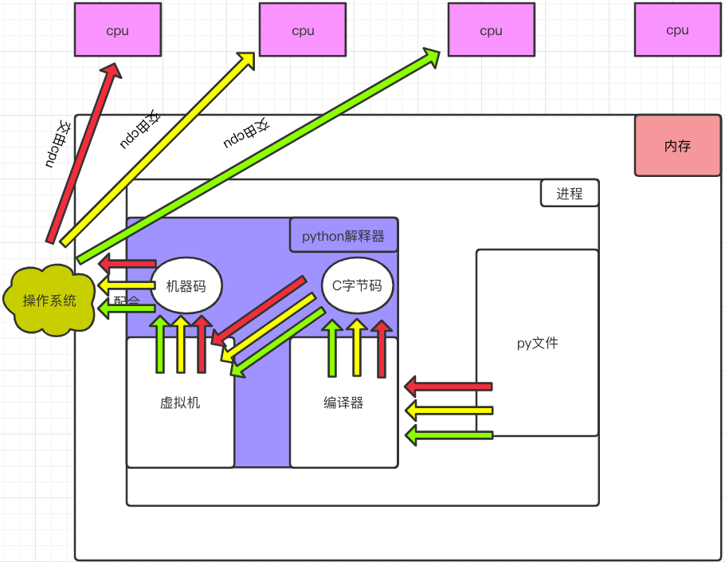

第六章 并发编程

#### 本章具体小节如下


1. **第一节：操作系统发展史以及初识进程**
2. **第二节：Python并发编程: 多进程I**
3. **第三节：python并发编程: 多线程I**
4. **第四节：python并发编程: 多线程II**
5. **第五节：Python并发编程: 协程**

​        今天我们开始并发编程，并发编程前期就是理论作为基础，全部都是抽象的内容，可能会有一些枯燥，但是这些理论基础和抽象的内容非常重要，这些内容会伴随着并发编程全部课程。

## 第一节：网络相关基础理论知识


#### 本节具体内容如下：

1. **进程基础概念**
2. **操作系统**
3. **操作系统的发展史**
4. **进程的介绍（理论部分）**
5. **Python并发编程：多进程I**
   + 创建进程的两种方式
   + 获取进程的pid


#### 1.进程的基础概念

+ 什么是程序？

  程序就是一堆文件，你下载一个qq客户端其实就是下载了一堆文件。

+ 什么是进程？

  进程就是一个正在执行的过程/程序,他是一个抽象概念。

+ 你写程序做什么？

  其实就是让计算机即cpu运行你的程序。是应用程序让cpu运行？cpu主动去运行你的应用程序？都不是，是操作系统调用的cpu运行你的程序。

  举例：现在你有一个任务，就是操作系统让cpu去运行你的任务。这个应用程序本来在硬盘，然后启动这个程序，要通过操作系统调度到内存，然后给了CPU运行。程序运行过程说白了：就是操作系统调用cpu去执行。

  你的机器能够同时接几个任务？ 上万个?最起码十几个，所以，十几个操作系统都给我了，但是硬件只有一个cpu，能让你们抢么？但是拿过一个来运行一下你，拿过一个来，运行一下你。 怎么叫进程：一个正在执行的过程，就叫做进程。操作系统调用cpu运行一个任务，一段时间后在调用cpu执行其他的任务。

  所以，进程的概念起源于操作系统。

  我要先将操作系统的概念整明白。

#### 2.操作系统

+ 什么是操作系统？

  精简的说的话，操作系统就是一个协调、管理和控制计算机硬件资源和软件资源的控制程序。

+ 操作系统的作用？

  如果没有操作系统，你要怎么做，你要先研究底层的东西，等你研究明白了，你的公司也就倒闭了。所以怎么办？你如果自己写程序，没有操作系统，你要怎么做，实现两层就行：

  第一层：对硬件的协调，控制。

  第二层：如何调用各种接口，写程序。

  其实你实现的那一层：对硬件的协调，控制。就是一个操作系统，每个人编写程序时都需要先完成第一层，搞个三五年，然后再去写程序。

  **操作系统第一个作用：把复杂丑陋的硬件操作都封装成美丽的接口，提供给应用程序使用。**比如open函数。

  如果没有操作系统，你同时启动10个程序，调用cpu去执行你，只有一个cpu，你如何去分配？

  举个例子：一群学生同时来问老师问题：一个同学刚问了老师，我说你停一下，下一个学生问，这样行么，共享一个就会存在竞争，如何合理妥善处理这个竞争的先后，就是操作系统干的事情。

  **操作系统第二个作用：将进程对硬件的竞争变得合理有序。**

  

#### 3.操作系统发展史

​	其实讲操作系统的发展史就是引出并着重讲解一个最重要的重点：多道技术。

​	我们今天讲的是电子计算机。

+ **第一代（1940~1955）  手工操作----穿孔卡片**

  第一代计算机的产生背景：

  第一代之前人类是想用机械取代人力，第一代计算机的产生是计算机由机械时代进入电子时代的标志，从Babbage(查尔斯·巴贝奇大型差分机)失败之后一直到第二次世界大战，数字计算机的建造几乎没有什么进展，第二次世界大战刺激了有关计算机研究的爆炸性进展。

  lowa州立大学的john Atanasoff (约翰·阿塔那索夫)教授和他的学生Clifford Berry(克利福特·贝瑞)建造了据认为是第一台可工作的数字计算机。该机器使用300个真空管。大约在同时，Konrad Zuse(康拉德·楚泽)在柏林用继电器构建了Z3计算机，英格兰布莱切利园的一个小组在1944年构建了Colossus[kəˈlɑːsəs] (巨人计算机)，Howard Aiken(霍华德·艾肯)在哈佛大学建造了Mark 1，宾夕法尼亚大学的William Mauchley(威廉·莫奇利)和他的学生J.Presper Eckert(约翰·埃克特)建造了ENIAC(第一台通用电子计算机)。这些机器有的是二进制的，有的使用真空管，有的是可编程的，但都非常原始，设置需要花费数秒钟时间才能完成最简单的运算。

  在这个时期，同一个小组里的工程师们，设计、建造、编程、操作及维护同一台机器，所有的程序设计是用纯粹的机器语言编写的，甚至更糟糕，需要通过成千上万根电缆接到插件板上连成电路来控制机器的基本功能。没有程序设计语言（汇编也没有），操作系统则是从来都没听说过。使用机器的过程更加原始，详见下‘工作过程’

    

  特点：
  没有操作系统的概念
  所有的程序设计都是直接操控硬件

  工作过程：
  程序员在墙上的机时表预约一段时间，然后程序员拿着他的插件板到机房里，将自己的插件板接到计算机里，这几个小时内他独享整个计算机资源，后面的一批人都得等着(两万多个真空管经常会有被烧坏的情况出现)。

  后来出现了穿孔卡片，可以将程序写在卡片上，然后读入机而不用插件板

  

  优点：

  程序员在申请的时间段内独享整个资源，可以即时地调试自己的程序（有bug可以立刻处理）

  缺点：

  浪费计算机资源，一个时间段内只有一个人用。
  注意：同一时刻只有一个程序在内存中，被cpu调用执行，比方说10个程序的执行，是串行的

  穿孔卡带的过程：程序员将对应于程序和数据的已穿孔的纸带（或卡片）装入输入机，然后启动输入机把程序和数据输入计算机内存，接着通过控制台开关启动程序针对数据运行；计算完毕，打印机输出计算结果；用户取走结果并卸下纸带（或卡片）后，才让下一个用户上机。

+ **第二代(1955~1965)磁带存储-批处理系统**

  第二代计算机的产生背景：

  由于当时的计算机非常昂贵，很自然的想办法较少机时的浪费。通常采用的方法就是批处理系统。

  特点：
  设计人员、生产人员、操作人员、程序人员和维护人员直接有了明确的分工，计算机被锁在专用空调房间中，由专业操作人员运行，这便是‘大型机’。

  有了操作系统的概念

  有了程序设计语言：FORTRAN（[ˈfɔːrtræn] 公式变换语言）语言或汇编语言，写到纸上，然后穿孔打成卡片，再讲卡片盒带到输入室，交给操作员，然后喝着咖啡等待输出接口

  工作过程：插图

  

  

  第二代如何解决第一代的问题/缺点：
  1.把一堆人的输入攒成一大波输入，
  2.然后顺序计算（这是有问题的，但是第二代计算也没有解决）
  3.把一堆人的输出攒成一大波输出

  现代操作系统的前身:(见图）

  **优点**：批处理，节省了机时

  **缺点**：1.整个流程需要人参与控制，将磁带搬来搬去（中间俩小人）

  2.计算的过程仍然是顺序计算-》串行

  3.程序员原来独享一段时间的计算机，现在必须被统一规划到一批作业中，等待结果和重新调试的过程都需要等同批次的其他程序都运作完才可以（这极大的影响了程序的开发效率，无法及时调试程序）

+ **第三代(1955~1965)集成电路,多道程序系统**

  第三代计算机的产生背景：

  20世纪60年代初期，大多数计算机厂商都有两条完全不兼容的生产线。

  一条是面向字的：大型的科学计算机，如IBM 7094，见上图，主要用于科学计算和工程计算

  另外一条是面向字符的：商用计算机，如IBM 1401，见上图，主要用于银行和保险公司从事磁带归档和打印服务。

  开发和维护完全不同的产品是昂贵的，同时不同的用户对计算机的用途不同。

  IBM公司试图通过引入system/360系列来同时满足科学计算和商业计算，360系列低档机与1401相当，高档机比7094功能强很多，不同的性能卖不同的价格

  360是第一个采用了（小规模）芯片（集成电路）的主流机型，与采用晶体管的第二代计算机相比，性价比有了很大的提高。这些计算机的后代仍在大型的计算机中心里使用，**此乃现在服务器的前身**，这些服务器每秒处理不小于千次的请求。

  如何解决第二代计算机的问题1：
  卡片被拿到机房后能够很快的将作业从卡片读入磁盘，于是任何时刻当一个作业结束时，操作系统就能将一个作业从磁带读出，装进空出来的内存区域运行，这种技术叫做同时的外部设备联机操作：SPOOLING（假脱机），该技术同时用于输出。当采用了这种技术后，就不在需要IBM1401机了，也不必将磁带搬来搬去了（中间俩小人不再需要）
  

如何解决第二代计算机的问题2：

第三代计算机的操作系统广泛应用了第二代计算机的操作系统没有的关键技术：多道技术

**cpu在执行一个任务的过程中，若需要操作硬盘，则发送操作硬盘的指令，指令一旦发出，硬盘上的机械手臂滑动读取数据到内存中，这一段时间，cpu需要等待，时间可能很短，但对于cpu来说已经很长很长，长到可以让cpu做很多其他的任务，如果我们让cpu在这段时间内切换到去做其他的任务，这样cpu不就充分利用了吗。这正是多道技术产生的技术背景**

**多道技术：**

多道技术中的多道指的是多个程序，多道技术的实现是为了解决多个程序竞争或者说共享同一个资源（比如cpu）的有序调度问题，解决方式即多路复用，多路复用分为时间上的复用和空间上的复用。

**空间上的复用**：将内存分为几部分，每个部分放入一个程序，这样，同一时间内存中就有了多道程序。


 

**时间上的复用**：当一个程序在等待I/O时，另一个程序可以使用cpu，如果内存中可以同时存放足够多的作业，则cpu的利用率可以接近100%，类似于我们小学数学所学的**统筹方法**。（操作系统采用了多道技术后，可以控制进程的切换，或者说进程之间去争抢cpu的执行权限。这种切换不仅会在一个进程遇到io时进行，一个进程占用cpu时间过长也会切换，或者说被操作系统夺走cpu的执行权限）

空间上的复用最大的问题是：程序之间的内存必须分割，这种分割需要在硬件层面实现，由操作系统控制。如果内存彼此不分割，则一个程序可以访问另外一个程序的内存。

首先丧失的是安全性，比如你的qq程序可以访问操作系统的内存，这意味着你的qq可以拿到操作系统的所有权限。

其次丧失的是稳定性，某个程序崩溃时有可能把别的程序的内存也给回收了，比方说把操作系统的内存给回收了，则操作系统崩溃。

```
  我们做的web开发以及爬虫等项目都是IO密集型的，用生活上的例子可以完美的诠释为什么空间上的复用会提升效率：
  比如你在生活中需要同时干三个家务活：
  			   需要干活的时间        等待的时间(IO阻塞)
  洗衣服:      10分钟               50分钟
  烧水:        5分钟                10分钟
  做饭:       15分钟                 5分钟
  你应该怎么分配这几个任务？
  你在洗衣服等待的时间内其实就已经把其他任务都做完毕了。
```

IO密集型：cpu遇到IO切换是提升效率的。

计算密集型：cpu来回切换是降低效率的。

```
  我们经常遇到的阻塞：input read write accept recv sleep 通过网络收发数据等等。
```

第三代计算机的操作系统仍然是批处理

许多程序员怀念第一代独享的计算机，可以即时调试自己的程序。为了满足程序员们很快可以得到响应，出现了分时操作系统

如何解决第二代计算机的问题3：

分时操作系统：
  多个联机终端+多道技术

20个客户端同时加载到内存，有17在思考，3个在运行，cpu就采用多道的方式处理内存中的这3个程序，由于客户提交的一般都是简短的指令而且很少有耗时长的，索引计算机能够为许多用户提供快速的交互式服务，所有的用户都以为自己独享了计算机资源。

CTTS：麻省理工（MIT）在一台改装过的7094机上成功的开发CTSS兼容分时系统，**第三代计算机广泛采用了必须的保护硬件（程序之间的内存彼此隔离）之后，分时系统才开始流行**

MIT（麻省理工学院），贝尔实验室和通用电气在CTTS成功研制后决定开发能够同时支持上百终端的MULTICS//,moʊ'teiks//（其设计者着眼于建造满足波士顿地区所有用户计算需求的一台机器），很明显真是要上天啊，最后摔死了。

后来一位参加过MULTICS研制的贝尔实验室计算机科学家Ken Thompson（肯·汤普森）开发了一个简易的，单用户版本的MULTICS，**这就是后来的UNIX系统**。基于它衍生了很多其他的Unix版本，为了使程序能在任何版本的unix上运行，IEEE提出了一个unix标准，即**posix / ˈpäsiks /（可移植的操作系统接口Portable Operating System Interface）**

后来，在1987年，出现了一个UNIX的小型克隆，即minix，用于教学使用。芬兰学生Linus  Benedict Torvalds(林纳斯·本纳第克特·托瓦兹)基于它编写了Linux

+ **第四代(1980~至今)现代计算机**

  进入20世纪80年代，大规模集成电路工艺技术的飞跃发展，微处理机的出现和发展，掀起了计算机大发展大普及的浪潮。一方面迎来了个人计算机的时代，同时又向计算机网络、分布式处理、巨型计算机和智能化方向发展。于是，操作系统有了进一步的发展，如：个人计算机操作系统、网络操作系统、分布式操作系统等。

  　　1.个人计算机操作系统

  　　　　个人计算机上的操作系统是联机交互的单用户操作系统，它提供的联机交互功能与通用分时系统提供的功能很相似。

  　　　　由于是个人专用，因此一些功能会简单得多。然而，由于个人计算机的应用普及，对于提供更方便友好的用户接口和丰富功能的文件系统的要求会愈来愈迫切。

  　　2.网络操作系统

  　　　　计算机网络：通过通信设施，将地理上分散的、具有自治功能的多个计算机系统互连起来，实现信息交换、资源共享、互操作和协作处理的系统。

  　　　　网络操作系统：在原来各自计算机操作系统上，按照网络体系结构的各个协议标准增加网络管理模块，其中包括：通信、资源共享、系统安全和各种网络应用服务。

   　　　   就是添加了一些网络方面的功能。

  　　3.分布式操作系统

  　　　　表面上看，分布式系统与计算机网络系统没有多大区别。分布式操作系统也是通过通信网络，将地理上分散的具有自治功能的数据处理系统或计算机系统互连起来，实现信息交换和资源共享，协作完成任务。——硬件连接相同。

  　　　　分布式：将一个大的任务拆分成几个小的任务，分配给不同的任务处理机制，具体怎么分配是由系统中的算法决定的，大家同时来运行自己的任务，然后各自将任务的返回结果再返回给你这个大的任务。

  　　　　但有如下一些明显的区别：

  　　　　　　（1）分布式系统要求一个统一的操作系统，实现系统操作的统一性。

  　　　　　　（2）分布式操作系统管理分布式系统中的所有资源，它负责全系统的资源分配和调度、任务划分、信息传输和控制协调工作，并为用户提供一个统一的界面。

  　　　　　　（3）用户通过这一界面，实现所需要的操作和使用系统资源，至于操作定在哪一台计算机上执行，或使用哪台计算机的资源，则是操作系统完成的，用户不必知道，此谓：系统的透明性。

  　　　　　　（4）分布式系统更强调分布式计算和处理，因此对于多机合作和系统重构、坚强性和容错能力有更高的要求，希望系统有：更短的响应时间、高吞吐量和高可靠性。

  　　　　分布式系统已经很普遍了，一般个人用不到，企业在处理比较大的任务的时候才会使用。

  ​	详见博客：<https://www.cnblogs.com/jin-xin/articles/10078845.html

#### 4.进程的介绍（理论部分）

+ 什么是进程

  ​    进程：正在进行的一个过程或者说一个任务。而负责执行任务则是cpu。

  ​    举例（单核+多道，实现多个进程的并发执行）：

  ​    太白金星在一个时间段内有很多任务要做：python备课的任务，写书的任务，交女朋友的任务，王者荣耀上分的任务，但太白金星同一时刻只能做一个任务（cpu同一时间只能干一个活），如何才能玩出多个任务并发执行的效果？

  ​    太白金星备一会课，再去跟嫂子聊聊天，再去打一会王者荣耀....这就保证了每个任务都在进行中.

+ 进程与程序的区别

  程序仅仅只是一堆代码而已，而进程指的是程序的运行过程。

  **需要强调的是：同一个程序执行两次，那也是两个进程，比如打开暴风影音，虽然都是同一个软件，但是一个可以播放苍井空，一个可以播放饭岛爱。**

+ 并发与并行

  无论是并行还是并发，在用户看来都是'同时'运行的，不管是进程还是线程，都只是一个任务而已，真实干活的是cpu，cpu来做这些任务，而一个cpu同一时刻只能执行一个任务

  + 并发：是伪并行，即看起来是同时运行。单个cpu+多道技术就可以实现并发，（并行属于特殊的并发）

  + 并行：同时运行，只有具备多个cpu才能实现并行

     单核下，可以利用多道技术，多个核，每个核也都可以利用多道技术（**多道技术是针对单核而言的**）有四个核，六个任务，这样同一时间有四个任务被执行，假设分别被分配给了cpu1，cpu2，cpu3，cpu4，

     一旦任务1遇到I/O就被迫中断执行，此时任务5就拿到cpu1的时间片去执行，这就是单核下的多道技术

    而一旦任务1的I/O结束了，操作系统会重新调用它(**需知进程的调度、分配给哪个cpu运行，由操作系统说了算**)，可能被分配给四个cpu中的任意一个去执行

  

  ​	所有现代计算机经常会在同一时间做很多件事，一个用户的PC（无论是单cpu还是多cpu），都可以同时运行多个任务（一个任务可以理解为一个进程）。

　　　　启动一个进程来杀毒（360软件）

　　　　启动一个进程来看电影（暴风影音）

　　　　启动一个进程来聊天（腾讯QQ）

​		所有的这些进程都需被管理，于是一个支持多进程的多道程序系统是至关重要的

多道技术概念回顾：内存中同时存入多道（多个）程序，cpu从一个进程快速切换到另外一个，使每个进程各自运行几十或几百毫秒，这样，虽然在某一个瞬间，一个cpu只能执行一个任务，但在1秒内，cpu却可以运行多个进程，这就给人产生了并行的错觉，即伪并发，以此来区分多处理器操作系统的真正硬件并行（多个cpu共享同一个物理内存）

+ **阻塞：**

```
#阻塞调用是指调用结果返回之前，当前线程会被挂起（如遇到io操作）。函数只有在得到结果之后才会将阻塞的线程激活。有人也许会把阻塞调用和同步调用等同起来，实际上他是不同的。对于同步调用来说，很多时候当前线程还是激活的，只是从逻辑上当前函数没有返回而已。
#举例：
#1. 同步调用：apply（ [əˈplaɪ] 应用）一个累计1亿次的任务，该调用会一直等待，直到任务返回结果为止，但并未阻塞住（即便是被抢走cpu的执行权限，那也是处于就绪态）;
#2. 阻塞调用：当socket工作在阻塞模式的时候，如果没有数据的情况下调用recv函数，则当前线程就会被挂起，直到有数据为止。
```

+ **非阻塞：**

```
#非阻塞和阻塞的概念相对应，指在不能立刻得到结果之前也会立刻返回，同时该函数不会阻塞当前线程。
```

+ 进程的创建（了解）

　　但凡是硬件，都需要有操作系统去管理，只要有操作系统，就有进程的概念，就需要有创建进程的方式，一些操作系统只为一个应用程序设计，比如微波炉中的控制器，一旦启动微波炉，所有的进程都已经存在。

　　而对于通用系统（跑很多应用程序），需要有系统运行过程中创建或撤销进程的能力，主要分为4种形式创建新的进程

　　1. 系统初始化（查看进程linux中用ps命令，windows中用任务管理器，前台进程负责与用户交互，后台运行的进程与用户无关，运行在后台并且只在需要时才唤醒的进程，称为守护进程，如电子邮件、web页面、新闻、打印）

　　2. 一个进程在运行过程中开启了子进程（如nginx开启多进程，os.fork,subprocess.Popen等）

　　3. 用户的交互式请求，而创建一个新进程（如用户双击暴风影音）

        　　4. 一个批处理作业的初始化（只在大型机的批处理系统中应用）

无论哪一种，新进程的创建都是由一个已经存在的进程执行了一个用于创建进程的系统调用而创建的：

+ 在UNIX中该系统调用是：fork，fork会创建一个与父进程一模一样的副本，二者有相同的存储映像、同样的环境字符串和同样的打开文件（在shell解释器进程中，执行一个命令就会创建一个子进程）
+ 在windows中该系统调用是：CreateProcess，CreateProcess既处理进程的创建，也负责把正确的程序装入新进程。

关于创建的子进程，UNIX和windows

相同的是：进程创建后，父进程和子进程有各自不同的地址空间（**多道技术要求物理层面实现进程之间内存的隔离**），任何一个进程的在其地址空间中的修改都不会影响到另外一个进程。

不同的是：在UNIX中，子进程的初始地址空间是父进程的一个副本，提示：子进程和父进程是可以有只读的共享内存区的。但是对于windows系统来说，从一开始父进程与子进程的地址空间就是不同的。

+ 进程的状态

　　一个进程有三种状态：


#### 5.Python并发编程：多进程I

+ 引子

  我们之前用过多进程开发么？ 有的同学说用过，ATM就是多进程，分了很多个文件。是么？ATM它只是从一个py文件中将代码拆分出多个文件，但也只是一个进程，而没有多开其他进程。我们之前用过，那就是socket套接字，当时开启了一个服务端和客户端，这是才是真正的两个进程同时运行。

- 创建进程的两种方式

  + 方式一(函数式，常用方式) multiprocessing [ˌmʌltiˈprɑsɛsɪŋ]多处理

    ```python
    from multiprocessing import Process
    
    import time
    
    def func():
        print('in func')
    
    def task(name):
        print(f'{name} is running')
        time.sleep(3)
        func()
        print(f'{name} is done')
    
    
    if __name__ == '__main__':  # windows启动子进程一定要放在这个下面
        p = Process(target=task,args=('太白',))  # 参数必须元组的形式
        p.start()
        print('====主')
    
    ```

    代码注解：

    p就是创建了一个子进程，而我们说过一个进程的创建必须依赖于一个主进程， 这个py文件就是一个主进程，而p子进程会将主进程所有的资源都会copy一份，然后运行。

    p.start并不是马上运行这个子进程，而是给操作系统发出一个指令：告知操作系统给我在内存开辟一个空间，加载子进程的所有数据，并通过操作系统调用cpu去执行这个子进程。

    你每次运行时都会发现是主进程先开启并运行，而子进程总是滞后运行的，为什么？

    1. 开启子进程相对来说是比较耗费时间的，而且消耗性能，p.start只是发起一个指令，中间会经历很多步骤。
    2. 之前我们学过的所有代码都是发生在一个进程中，所以代码是从上至下依次执行，而现在是开启了两个进程（一主一子），子进程从发出指令到真正执行这个时间内（这也是阻塞），主进程早就可以开启了。

  + 方式二：（类的方式创建）

    ```python
    from multiprocessing import Process
    import time
    class MyProcess(Process):
        def __init__(self,name):
            super().__init__()
            self.name = name
    
    
        def run(self):
            print(f'{self.name} is running')
            time.sleep(3)
            print(f'{self.name} is done')
    
    
    if __name__ == '__main__':
        p = MyProcess('太白')
        p.start()
        print('===主进程')
    ```

    

- 获取进程的pid

  我们的计算机中可以开启多个进程，但是对于计算机来说，如何管理和区分这些进程呢？这就要依赖于进程在计算机中的唯一标识了，就是进程ID,就好比人的身份证号，对象在内存中的唯一表示id一样，进程之间也是有ID的，我们先看一下，进程的PID。

  1. 在终端输入tasklist回车，就会显示现运行的所有的进程pid

     

     每个进程的pid都是不同的，一般情况下，一个应用程序启动会开启多个进程。

     

  2. 也可以单独查询某个进程的PID.

     在终端输入：tasklist|findstr Typora

     

  3. 我们通过python代码可以获取到进程的PID

     ```python
     import os
     print(os.getpid())  # 11688 每次开启的进程pid是不同的。
     ```

     我们知道一个进程的开启都是依赖于一个主进程，那么如何获取主进程的pid呢？ 很简单，也是一条命令：

     ```python
     import os
     # getpid返回当前进程标识，getppid返回父进程标识。
     print(os.getpid())
     print(os.getppid())
     ```
```
     
那么这个py文件的父进程是谁？ 我们通过谁调用的Python程序，谁就是他爹，父进程。
     
我们通过的是Pycharm开启的Python程序，所以pycharm就是父进程：
     
验证一下：
     
启动三次下面的py文件，即开启了三个进程，他们的父进程的PPID都是一个2908
     
     ```python
     import os
     import time
     print(f'父进程{os.getppid()}')
     print(f'子进程{os.getpid()}')
     time.sleep(1000)
```

从终端获取父进程子进程PPID,PID验证：
     

     
我通过cmd或者pycharm运行，启动一个py文件，这其实是pycharm程序启动python.exe程序，这叫做一个进程中开启另一个进程。在向上研究，操作系统也可以看做一个大软件，你通过双击开启一个软件，比如QQ，那是通知操作系统，将QQ这个子进程加载到内存，创建一个子进程。所以windows系统通过CreateProcess处理进程的创建。
     
     

## 第二节：Python并发编程：多进程II


#### 本节具体内容如下：

1. **验证进程之间的空间隔离**
2. **进程对象的join方法**
3. **进程对象的其他属性（了解）**
4. **僵尸进程与孤儿进程**
5. **守护进程**
6. **进程同步锁**
7. **同步锁的应用：抢票系统**


#### 1.验证进程之间的空间隔离

+ 方案一

  我们在主进程设置变量x=1000，设置一个子进程：子进程就是将全局x改成0，如果主进程x还是为1000，则验证了进程之间的空间隔离。

  ```python
  from multiprocessing import Process
  import time
  
  x = 1000
  def task(name):
      global x
      x = 0
  
  if __name__ == '__main__':
      p = Process(target=task, args=('barry',))
      p.start()
      print(x)
  ```

  方案一有问题，因为主进程肯定是在子进程运行之前已经运行了，你应该是在子进程运行结束之后，主进程再去打印变量x。

+ 方案二：

  让子进程start之后，主进程先睡3秒然后在打印x，3秒足以子进程运行并且结束。

  ```python 
  from multiprocessing import Process
  import time
  
  x = 1000
  
  
  def task(name):
      global x
      x = 0
      print(x)
  
  if __name__ == '__main__':
      p = Process(target=task, args=('barry',))
      p.start()
      time.sleep(3)
      print(x)  
  
  ```

  尝试一下可变的数据类型：

  ```python
  from multiprocessing import Process
  import time
  
  x = []
  
  
  def task(name):
      x.append(100)
      print(x)
  
  if __name__ == '__main__':
      p = Process(target=task, args=('barry',))
      p.start()
      time.sleep(3)
      print(x)
  ```

  综上证明：子进程在创建时会完全深度copy一份主进称的所有资源，但是两个进程之间的随便是互相独立，互不影响。

#### 2.join的使用

+ 引子

  我们如何让主进程等待子进程结束之后，在运行呢？有同学说很简单可以加sleep。

  ```python
  from multiprocessing import Process
  import time
  
  x = 1000
  
  def task(name):
      global x
      x = 0
      print(x)
  
  if __name__ == '__main__':
      p = Process(target=task, args=('barry',))
      p.start()
      time.sleep(3)
      print(x)
  ```

  上面是主动加了sleep,但是这只是让主进程睡3秒之后再执行，p子进程从开始直至结束也就是耗费一点时间（不足0.001s），这样是不行的，真正项目中子进程什么时候结束是不固定的。所以我们得让主进程阻塞住，直到子进程结束之后，主进程在运行。

+ join

  子进程设置join之后，主进程程序就会阻塞，直至子进程结束之后，主进程再次执行。

  ```python
  from multiprocessing import Process
  import time
  
  x = 1000
  
  def task(name):
      global x
      x = 0
      print('子进程结束了！')
  
  if __name__ == '__main__':
      p = Process(target=task, args=('barry',))
      p.start()
      p.join()  # 在原地等待
      print('父进程执行')
  ```

  如果我开启了多个子进程，将多个子进程全部使用join方法，主进程等待所有的子进程结束之后，再去执行，怎么做？

  ```python
  from multiprocessing import Process
  import time
  
  x = 1000
  
  
  def task(num):
      global x
      x = 0
      print(f'子进程{num}结束了！')
  
  if __name__ == '__main__':
      for i in range(10):
          p = Process(target=task, args=(i,))
          p.start()
  
      print('主进程开始了！')
  ```

  为什么主进程在子进程前面执行了？ start只是向操作系统发出命令，而不是说马上开始，操作系统还需要从内存中开空间，开进程，进程开闭的损耗是很大的。所以主进程不会最后执行。

+ 开启三个进程测试一下：

  + 下面代码是3秒结束还是6秒结束？
  
    ```python 
    from multiprocessing import Process
    import time
    
    
    def task(num):
        print(f'子进程{num}开始了！')
        time.sleep(num)
    
    if __name__ == '__main__':
        p1 = Process(target=task, args=(1,))
        p2 = Process(target=task, args=(2,))
        p3 = Process(target=task, args=(3,))
        start_time = time.time()
        # 发三个信号，启动三个进程 6秒还是3秒结束？
        p1.start()
        p2.start()
        p3.start()
    
        p3.join()
        p1.join()
        p2.join()
    
        print(f'主进程开始了！{time.time()-start_time}')
    ```
  
    join是阻塞，他会阻塞住主进程下面的程序，直至子进程结束之后，再去执行，那么为什么不是6s多主进程再执行呢？因为p1，p2，p3三个子进程几乎是同一时刻开启的，然后p3先使用join方法，此时代码确实不在向下执行了，但是你别忘了，p1,p2,p3已经并发的开始运行了，所以当p3三秒左右结束时，代码向下运行，运行到p1.join()时p1早已经结束了，在向下运行，p2也结束了。所以无论p1.join(),p2.join(),p3.join()三行代码顺序有无变化，最终耗费的时间都是以最多耗费时间的子进程为准。
  
+ 如何精简

  ```python
  from multiprocessing import Process
  import time
  
  
  def task(num):
      print(f'子进程{num}开始了！')
      time.sleep(num)
  
  
  if __name__ == '__main__':
      start_time = time.time()
      for i in range(1,4):
          p = Process(target=task, args=(i,))
          p.start()
          p.join()
  
  
      print(f'主进程开始了！{time.time()-start_time}')
  ```

  为什么会是6.多秒？ 因为上面已经形成了串行，所以要想达到之前的效果你应该怎么做？

  ```python
  from multiprocessing import Process
  import time
  
  
  def task(num):
      print(f'子进程{num}开始了！')
      time.sleep(num)
  
  
  if __name__ == '__main__':
      start_time = time.time()
      p_l1 = []
      for i in range(1, 4):
          p = Process(target=task, args=(i,))
          p_l1.append(p)
          p.start()
  
      for i in p_l1:
          i.join()
  
      print(f'主进程开始了！{time.time()-start_time}')
  ```


#### 3.进程对象的其他属性（了解）

+ 简单练习一下

  ```python
  from multiprocessing import Process
  import time
  import os
  
  def task(name):
      print(f'{name} is running')
      time.sleep(3)
      print(os.getpid(),os.getppid())
      print(f'{name} is done')
  
  
  if __name__ == '__main__':
      p = Process(target=task,args=('太白',),name='任务1')
      p.start()
      p.terminate()  # 杀死子进程
      # time.sleep(1)
      # p.join()
      # print(p.is_alive())
      print(p.pid)
      # print(p.name)  # 给进程对象增加了一个属性。
      print('====主进程')
  # terminate：主动杀死子进程。  terminate [ˈtɜːrmɪneɪt] 终止
  # is_alive：判断子进程是否存活。 alive  [əˈlaɪv] 活着的
  # pid：获取子进程的pid。
  # name：给子进程起别名。
  ```


#### 4.僵尸进程与孤儿进程

这个知识点只是了解，基于linux标准，只能想象了。

按照上面代码的示例，主进程应该很快就结束了，但是由于子进程没有结束，所以主进程需要等待子进程结束之后才可以结束。通过cmd查看一下，可以验证。

+ 为什么主进程不结束?
  主进程要监听子进程状态变化，等子进程结束之后的一段时间之内，对其回收。

  由于主进程与子进程是异步的过程，主进程与子进程的开启与结束互相都没有关联，主进程永远无法预测子进程到底什么时候结束，如果子进程一结束就立刻回收其全部资源，那么父进程则无法获取子进程的状态信息。那么如何保证主进程可以在任意时刻获取子进程的结束时的状态呢？
  
+ unix提供了一个机制：
  在每个进程退出的时候，内核释放该进程所有的资源，包括打开的文件，占用的内存等。但是仍然为其保留一定的信息（包括进程号the process ID，退出状态the termination status of the process，运行时间the amount of CPU time taken by the process等）直到父进程通过wait / waitpid来取时才释放.
  
+ 什么是僵尸进程？
  所有的子进程结束之后，在被父进程通过wait/waitpid回收之前，都称之为僵尸进程（通过命令获取其运行状态为Z）。死而不腐。

+ 僵尸进程的危害？
  但这样就导致了问题，如果主进程不调用wait / waitpid的话，那么保留的那段信息就不会释放，其进程号就会一直被占用，但是系统所能使用的进程号是有限的，如果产生大量的僵死进程，将因为没有可用的进程号而导致系统不能产生新的进程.此即为僵尸进程的危害，应当避免。
  
+ 什么是孤儿进程？
  孤儿进程：一个父进程退出，而它的一个或多个子进程还在运行，那么那些子进程将成为孤儿进程。孤儿进程将被init进程(进程号为1)所收养，并由init进程对它们完成状态收集工作。

  孤儿进程是没有父进程的进程，孤儿进程这个重任就落到了init进程身上，init进程就好像是一个民政局，
  专门负责处理孤儿进程的善后工作。每当出现一个孤儿进程的时候，内核就把孤儿进程的父进程设置为init，而init进程会循环地wait()它的已经退出的子进程。这样，当一个孤儿进程凄凉地结束了其生命周期的时候，init进程就会代表党和政府出面处理它的一切善后工作。因此孤儿进程并不会有什么危害。
  
+ 僵尸进程如何解决？
  例如有个进程，它定期的产 生一个子进程，这个子进程需要做的事情很少，做完它该做的事情之后就退出了，因此这个子进程的生命周期很短，但是，父进程只管生成新的子进程，至于子进程 退出之后的事情，则一概不闻不问，这样，系统运行上一段时间之后，系统中就会存在很多的僵死进程，倘若用ps命令查看的话，就会看到很多状态为Z的进程。严格地来说，僵死进程并不是问题的根源，罪魁祸首是产生出大量僵死进程的那个父进程。因此，当我们寻求如何消灭系统中大量的僵死进程时，答案就是把产生大 量僵死进程的那个元凶枪毙掉（也就是通过kill发送SIGTERM或者SIGKILL信号啦）。枪毙了元凶进程之后，它产生的僵死进程就变成了孤儿进 程，这些孤儿进程会被init进程接管，init进程会wait()这些孤儿进程，释放它们占用的系统进程表中的资源，这样，这些已经僵死的孤儿进程 就能瞑目而去了。
  
  

#### 5.守护进程

守护进程举个例子：皇帝是太监守护，皇帝如果死了，一般老太监也跟着自杀了，主进程死了， 守护进程也跟着死掉了。将子进程设置成守护进程，它会等待主进程结束之后，马上结束。

```python
from multiprocessing import Process
import time
import os

def task(name):
    print(f'{name} is running')
    time.sleep(5)
    print(f'{name} is done')


if __name__ == '__main__':
    p = Process(target=task,args=('太白',),name='任务1')
    p.daemon = True
    p.start()
    print('====主进程')
```

#### 6.进程同步锁

我们现在模拟三个员工同时向打印机发出请求，打印三份资料。创建三个进程模拟三个员工，屏幕输出模拟打印机。

+ 方案一：

  ```python
  from multiprocessing import Process
  import time
  def task1():
      print('task1:开始执行')
      print('task1:执行完毕')
  
  def task2():
      print('task2:开始执行')
      print('task2:执行完毕')
  
  def task3():
      print('task3:开始执行')
      print('task3:执行完毕')
  
  if __name__ == '__main__':
      p1 = Process(target=task1)
      p2 = Process(target=task2)
      p3 = Process(target=task3)
  
      p1.start()
      p2.start()
      p3.start()
  ```

  方案一没有打印任务时的阻塞效果，我们模拟一下打印任务耗费的时间.

+ 方案二：

  ```python
  from multiprocessing import Process
  import time
  import random
  
  
  def task1():
      print('task1:开始执行')
      time.sleep(random.randint(1,3))
      print('task1:执行完毕')
  
  
  def task2():
      print('task2:开始执行')
      time.sleep(random.randint(1, 3))
      print('task2:执行完毕')
  
  
  def task3():
      print('task3:开始执行')
      time.sleep(random.randint(1, 3))
      print('task3:执行完毕')
  
  
  if __name__ == '__main__':
      p1 = Process(target=task1)
      p2 = Process(target=task2)
      p3 = Process(target=task3)
  
      p1.start()
      p2.start()
      p3.start()
  ```

  方案二的代码虽然完成了并发的效果，但是不符合实际的情况。我们平时在办公室如果多人向打印机发出打印资料的请求，那么打印机会先处理第一个请求，会将第一个打印任务完全执行完毕之后，在执行下一个打印任务。像我们这样写的代码打印的顺序就是混乱的。现在我们的需求是三个进程争抢一个输出平台，结果有序第一位，效率第二位。所以我要打印平台先将第一个进程的任务执行完毕之后，在执行第二个，然后执行第三个。如果多个争抢一个共享资源，那么你保证不乱就一个法则：就是排着队来，串行的解决问题。

+ 方案三：

  ```python
  from multiprocessing import Process
  import time
  import random
  
  
  def task1():
      print('task1:开始执行')
      time.sleep(random.randint(1, 3))
      print('task1:执行完毕')
  
  
  def task2():
      print('task2:开始执行')
      time.sleep(random.randint(1, 3))
      print('task2:执行完毕')
  
  
  def task3():
      print('task3:开始执行')
      time.sleep(random.randint(1, 3))
      print('task3:执行完毕')
  
  
  if __name__ == '__main__':
      p1 = Process(target=task1)
      p2 = Process(target=task2)
      p3 = Process(target=task3)
  
      p1.start() 
      p1.join()
      p2.start()
      p2.join()
      p3.start()
      p3.join()
  ```

  这样虽然完成了串行，但是这么做有什么问题？你这是公平的竞争么？
  我们在挤地铁时，都需要排队，但是你想要排第一位怎么办，只能早起，先到先排队，你这样写代码是人为的安排了子进程的顺序，不公平。
  公平竞争是什么？ 谁先到达谁先开始，而不是你去安排谁先谁后。
  你们合租，现在都在公用厕所，前提只能一个人进昂，所以谁先起来谁先去，所以你要给厕所上把锁，
  谁先抢到锁，谁先进，你们在共同抢那把锁。所以你的进程应该也是谁先抢到锁，谁先执行，不应该是你规定谁先来。
  所以你应该怎么抢锁？

+ 方案四：

  ```python 
  from multiprocessing import Process
  from multiprocessing import Lock
  import time
  import random
  
  def task1(lock):
  
      # lock.acquire()
      print('task1:开始执行')
      time.sleep(random.randint(1,3))
      print('task1:执行完毕')
      # lock.release()
  
  def task2(lock):
  
      # lock.acquire()
      print('task2:开始执行')
      time.sleep(random.randint(1, 3))
      print('task2:执行完毕')
      # lock.release()
  
  
  def task3(lock):
  
      # lock.acquire()
      print('task3:开始执行')
      time.sleep(random.randint(1, 3))
      print('task3:执行完毕')
      # lock.release()
  
  
  if __name__ == '__main__':
      mutex = Lock()
      p1 = Process(target=task1,args=(mutex,))
      p2 = Process(target=task2,args=(mutex,))
      p3 = Process(target=task3,args=(mutex,))
      # 你使用的锁必须是同一个，应该是主进程创建的一个共同的锁，然后通过参数的形式传递进去。
  
      p1.start()
      p2.start()
      p3.start()
  ```

  acquire [əˈkwaɪər] 获得

  release [rɪˈliːs]  释放
  
  这样写，既解决了串行的问题，又保证了公平性。假如p2先抢到了这把锁，立马先将这把锁锁上，当p2进程遇到阻塞了，操作系统会强行将cpu收走，让其执行p1或者p3，那么无论操作系统将cpu切换无论切换到任务1或者任务3，他们第一件事都在抢占这把锁，但此时锁还没有打开，cpu只能等待，等待p2将锁释放之后，再由p1和p2抢占资源。
  
  注意事项： 这把锁不能同时acquire两次，如果锁了一次，在进行auquire,那么就会阻塞在那里了。

join与lock的区别：

​	共同点：都是将并发变成串行，从而保证有序进行。

​	区别： join是人为的指定顺序，而互斥锁是让进程平等的竞争。


#### 7.同步锁的应用：抢票系统

+ 需求：

  接下来，我们用互斥锁模拟一个12306抢票系统。

  具体需求: 10个人先查票然后购票，查票并发执行，但是买票时需要保证数据安全，保证按顺序执行。然后谁先开始买票时，其他人就只能等待，直至第一个买票成功之后，其他人在开始买票。
  
  进程之间理论上来说是不可以共享**内存**数据的，但是可以共享磁盘，所以我们的数据应该放在一个文件中。
  
  + 方案一：
  
    ```python
    from multiprocessing import Process
    from multiprocessing import Lock
    import time
    import json
    import random
    import os
    def search():
        time.sleep(random.randint(1, 3))
        # 先模拟一下延迟效果
        with open('db.json',encoding='utf-8') as f1:
            dic = json.load(f1)
            print(f'剩余票数为{dic["count"]}')
        
    
    def get():
        with open('db.json',encoding='utf-8') as f1:
            dic = json.load(f1)
        if dic['count'] > 0:
            dic['count'] -= 1
            time.sleep(random.randint(1,3))
            with open('db.json', encoding='utf-8',mode='w') as f2:
                json.dump(dic,f2)
            print(f'{os.getpid()}购买成功')
    
    def task(lock):
        search()
        get()
     
    
    if __name__ == '__main__':
      for i in range(10):
            p = Process(target=task,)
            p.start()
    ```

    方案一的写法虽然完成了并发查票的效果，但是买票也变成并发执行了，这样很容易造成共享数据的不安全性，造成数据破坏，经过我们测试可得知：我们总共余票只有1张，但是卖成功了3、4张，为什么？每个进程买票时都会遇到阻塞，在阻塞时其他进程运行也打开了文件，获取了票的数据，但是此时你的票数还没有被第一个进程-1，所以造成了几个进程同时操作了同一个文件的数据。所以你买票时应该是串行的，第一个进程购买成功之后（将文件的数据余票数-1），其他进程才可以再次进行买票。
  
    综上：我们在买票的时候应该加锁。
  
    ```python
    from multiprocessing import Process
    from multiprocessing import Lock
    import time
    import json
    import random
    import os
    def search():
        time.sleep(random.randint(1, 3))
        # 先模拟一下延迟效果
        with open('db.json',encoding='utf-8') as f1:
            dic = json.load(f1)
            print(f'剩余票数为{dic["count"]}')
        
    
    def get():
        with open('db.json',encoding='utf-8') as f1:
            dic = json.load(f1)
        if dic['count'] > 0:
            dic['count'] -= 1
            time.sleep(random.randint(1,3))
            with open('db.json', encoding='utf-8',mode='w') as f2:
                json.dump(dic,f2)
            print(f'{os.getpid()}购买成功')
    
    def task(lock):
        search()
        lock.acquire()
        get()
        lock.release()
    
    if __name__ == '__main__':
        mutex = Lock()
        for i in range(10):
            p = Process(target=task,args=(mutex,))
            p.start()
    ```
  
    
  
    现在我把查票变成并发，但是抢票就是串行了，谁先付款谁先买票。
    互斥锁比join的优势：join是将所有进程变成串行而且必须按照你之前规定的顺序。互斥锁也是按照顺序但是是随机的顺序谁先开启进程，谁先进入。所以改数据的时候必须要串着来，互斥锁可以让一部分代码（修改共享数据的部分）串行,join只能让代码整体串行。
  
    其实这个也是进程之间的通信方式一：基于文件通信。
  
    基于文件通信有两点不好：效率低（读写磁盘数据），需要自己加锁处理。
  
    所以一般我们工作中不会通过这种方式进行通信，我们都会采取第二种方式，也就是队列，这个下一节会讲到。
  
    
  
  

## 第三节：Python并发编程：多进程III,多线程I


#### 本节具体内容如下：

1. **进程之间的通信：队列**
2. **生产者消费者模型**
3. **线程的理论知识**
   - 什么是线程
   - 线程vs进程
   - 多线程的应用举例
4. **开启线程的两种方式**
5. **进程线程的验证**
   + 验证进程与线程的开启速度
   + 线程的pid
   + 同一个进程下多个线程共享数据
6. **线程的其他方法**


#### 1.进程之间的通信：队列

+ 引子

  上一节我们通过多个进程操作同一个文件模拟了进程之间的通信，虽然可以解决通信问题，
  但是他也反映出两个问题；

  1. 效率低，基于文件操作。
  2. 需要自己加锁处理。
  自己加锁如果遇到复杂的情况，容易产生死锁现象，或者递归锁，所以这不是最好的方式，
  进程之间通信最好的方式就是队列（管道有问题）。

+ 什么是队列？

  队列就是一个容器，这不过这个容器是一个先进先出的容器,这个容器存在于内存中，并且是进程共享的空间，自动帮我们处理好锁的问题。

  队列会严格按照先进先出的原则帮我们处理好锁的问题，无需我们自己加锁。

  ```python
  from multiprocessing import Queue
  def func():
      print('in func')
  q = Queue(3)
  q.put('first')
  q.put({1: '666'})
  q.put(func)
  # q.put(333)
  
  print(q.get())
  print(q.get())
  ret = q.get()
  ret()
  ```

+ 队列其他参数

  1. 队列里放的数量不宜过大。进程之间的通信，就是通知、链接等小量数据。（不宜放入视频，图片等）
  2. maxsize = 1000000虽然可以设置无限大，但是队列存在内存中，不宜过大。
  3. block=True：超过上限默认阻塞，block=False，超过上限直接报错。
  4. timeout：设置阻塞时间，超出阻塞时间还处于阻塞状态就会报错。

  ```
  from multiprocessing import Queue
  q = Queue(3)
  # 3. block True,只要不超过最大限度，不会阻塞，超过最大限度默认阻塞。
  q.put('first', block=True)
  q.put('s', block=True)
  q.put('b', block=True)
  q.put('g',block=False)  # 主动报错
  
  
  from multiprocessing import Queue
  q = Queue(3)
  # # 4. timeout 只有超过最大限度，才会报错。
  q.put('first', block=True)
  q.put('s', block=True)
  q.put('b', block=True)
  q.put('g', timeout=3)
  ```

#### 2.生产者消费者模型

只要你听到模型，方法论，设计思想等其实并不是那么高深，他就是一种解题思路，如果以后遇到相似的业务需求套着这个思路解决问题即可。
生产者： 将负责造数据的任务比喻成生产者
消费者： 接收生产者造出的数据来做进一步的处理。

生活中的例子：厨师生产东西，顾客吃东西，这就是生产者，消费者。
我生产出包子，然后怎么给他吃？应该是有一个盆，我把包子放在盆里，然后他从盆里取包子吃，这就是平时咱们见到的例子。假设，没有这个盆了：我生产一个，他吃一个，他吃的过程中，我不会继续生产包子，等他吃完了，我在生产包子，他吃的时候我是不能生产的，我们两个紧紧耦合在一起，这样是不科学的，对吧。厨师就是生产包子，不管你吃不吃完，都是生产包子，然后给盆，消费者跟盆打交道，他不会跟出厨子打交道的。所以：厨师这一类人就是生产包子，然后跟盆打交道，而消费者也是一类人，他们也是直接跟盆打交道。 一个盆解耦了，非常关键的一点，平衡了两者之间的生产力和消费力，存在，生产者就会一直生产，消费者就会一直消费，这个盆作为解耦概念。平时去快餐店吃饭就是这个道理。
消费者起一个进程，生产者起一个进程，盆就是队列。

```python
from multiprocessing import Process
from multiprocessing import Queue
import time
import random


def producer(name,q):
    for i in range(5):
        time.sleep(random.randint(1,2))
        res = f'{i}号包子'
        q.put(res)
        print(f'\033[1;31;0m 生产者：{name}，生产了{res} \033[0m')


def consumer(name,q):
    while 1:
        ret = q.get()
        time.sleep(random.randint(1,3))
        print(f'\033[1;31;0m 消费者：{name}，吃了{ret} \033[0m')


if __name__ == '__main__':
    q = Queue()
    p1 = Process(target=producer,args=('太白',q))
    p2 = Process(target=consumer,args=('sb',q))
    p1.start()
    p2.start()
```

生产者消费者模型三要素：生产者，消费者，队列。

优点：
	实现了生产者消费者解耦。
	平衡了生产力与消费力，生产者可以一直不停生产，消费者可以不停的处理。


#### 3.线程的理论知识

+ 什么是线程

  什么叫线程？ 一条流水线的工作过程。

  进程不是一个执行单位，之前我们一直说主进程执行，子进程执行，其实那么说是有问题的，进程其实是一个资源单位，它就是在内存中开辟一个空间，将数据资源加载到这个空间中。而一个进程内自带一个线程，线程才是真正的执行单位，线程是程序运行的执行者。

  综上：进程是资源单位，线程是执行单位。

  举例说明：

  我们把操作系统可以比喻成一个工厂，比如造车工厂。每启动一个车间，就是开启一个进程，开一个车间就是一个相对独立的空间，专门的车间做专门的事情。比如一个车间造车间，一个车间造车轮。原则上两个车间是都是彼此独立的，他们只是一个资源单位，但是每个车间至少有一个流水线即线程，线程是执行任务的单位。

  

  之前我们怎么描述启动一个进程？ 比如启动一个qq程序，要在内存中申请一个进程空间，把qq程序中的资源加载进去，然后cpu在去调用qq里面的代码执行，然后调用这空间里面的代码。你在描述一下word？ typora等等。非常麻烦。

  以后你怎么说就可以了？ 在内存开辟一个空间，把数据资源等内容加载到这个进程空间，然后qq程序的主线程再去执行里面的代码。其实一个进程就是跟空间资源有关，一个线程就是描述他的执行过程。都是概念性东西，就是两部分。所以再回来我们研究： 一个车间：最少有一个流水线，就是一个进程必须有一个主线程。进程就是划分资源，线程就是具体执行代码。

  

+ 线程vs进程

  多线程指的是，在一个进程中开启多个线程，简单的讲：如果多个任务共用一块地址空间，那么必须在一个进程内开启多个线程。详细的讲分为4点：

  1. 多线程共享一个进程的地址空间。
  2. 线程比进程更轻量级，线程比进程更容易创建可撤销，在许多操作系统中，创建一个线程比创建一个进程要快10-100倍，在有大量线程需要动态和快速修改时，这一特性很有用
  3.  若多个线程都是cpu密集型的，那么并不能获得性能上的增强，但是如果存在大量的计算和大量的I/O处理，拥有多个线程允许这些活动彼此重叠运行，从而会加快程序执行的速度。
  
+ 多线程的应用举例

  

  开启一个字处理软件进程，该进程肯定需要办不止一件事情，比如监听键盘输入，处理文字，定时自动将文字保存到硬盘，这三个任务操作的都是同一块数据，因而不能用多进程。只能在一个进程里并发地开启三个线程,如果是单线程，那就只能是，键盘输入时，不能处理文字和自动保存，自动保存时又不能输入和处理文字。

  了解更多详见博客：<https://www.cnblogs.com/jin-xin/articles/11232023.html>
  
  

#### 4.开启线程的两种方式

+ 方式一：通过函数式开启，常用。

  ```python
  from threading import Thread
  
  
  def task(name):
      print(f'{name} is runing')
  
  
  
  if __name__ == '__main__':
      t1 = Thread(target=task,args=('太白',))
      t1.start()
      print('主线程')
      # 开启进程的开销很大，所以主进程先运行，但是开启线程的开销很小，所以主线程先运行。
  ```

  问题：

  主线程为什么等待子线程结束而结束呢？

  主线程代表是谁？

  主线程代表的主进程，它需要等着其他线程执行完毕。
  为什么他要等待？

  线程是执行单位，进程是资源单位，主线程如果结束了，那么主进程的空间在内存中也没有什么价值了，所以主进程随之就在内存中消失了，但是因为主进程要给其他子进程收尸，并且如果主进程内除了主线程还有其他线程存活，他们需要使用主进程内的资源，所以主线程不能消失，只能等待子线程结束之后，在结束。

  ```python
  from threading import Thread
  import time
  
  def task(name):
     	time.sleep(3)
      # 为什么主线程也不结束？
      print(f'{name} is runing')
  
  
  if __name__ == '__main__':
      t1 = Thread(target=task, args=('太白',))
      t1.start()
      print('主线程')
      
  ```

+ 方式二：

  ```python
  from threading import Thread
  
  class MyThread(Thread):
  
      def run(self):
          print(f'{self.name} is running')
  
  if __name__ == '__main__':
      p = MyThread()
      p.start()
      print('主线程')
  ```

  

#### 5.进程线程的验证

+ 验证进程与线程的开启速度

  ```python
  from threading import Thread
  import time
  
  def task(name):
      print(f'{name} is runing')
  
  
  if __name__ == '__main__':
      t1 = Thread(target=task, args=('太白',))
      t1.start()
      print('主线程')
      # 开启进程的开销很大，所以主进程先运行，但是开启线程的开销很小，所以主线程先运行。
  
  ```

+ 线程的pid

  ```python
  from threading import Thread
  import os
  def task():
      print(f'{os.getpid()} is runing')
  
  
  if __name__ == '__main__':
      t1 = Thread(target=task,)
      t1.start()
      print(os.getpid())
  ```

+ 同一个进程下多个线程共享数据

  ```python
  from threading import Thread
  import os
  
  x = 1000
  def task():
     global x
     x = 0
  
  
  if __name__ == '__main__':
      t1 = Thread(target=task,)
      t1.start()
      t1.join()
      print(x)  # 0 资源共享
  ```

  

#### 6.线程的其他方法

```
Thread实例对象的方法
  # isAlive(): 返回线程是否活动的。
  # getName(): 返回线程名。
  # setName(): 设置线程名。

threading模块提供的一些方法：
  # threading.currentThread(): 返回当前的线程变量。
  # threading.enumerate(): 返回一个包含正在运行的线程的list。正在运行指线程启动后、结束前，不包括启动前和终止后的线程。
  # threading.activeCount(): 返回正在运行的线程数量，与len(threading.enumerate())有相同的结果。
```

举例说明：

```python
from threading import Thread,current_thread
import threading
def task():
    print(f'{current_thread().name} is runing')


if __name__ == '__main__':
    t1 = Thread(target=task,name='第一个线程任务')
    t1.start()
    # print(t1.name)
    # print(t1.is_alive())
    # print(threading.enumerate())  # 获取当前活跃的线程  
    # [<_MainThread(MainThread, started 18564)>, <Thread(第一个线程任务, started 9868)>]
    # print(threading.activeCount())  # 获取当前获的线程数量
```


## 第四节：Python并发编程：多线程II


#### 本节具体内容如下：

1. **守护线程**
2. **线程锁**
3. **死锁现象，递归锁**
4. **信号量**

5. **GIL全局解释器锁**

#### 1.守护线程

+ 示例讲解：

```
# 先回顾守护进程的例子
from multiprocessing import Process
import time

def foo():
    print(123)
    time.sleep(1)
    print("end123")

def bar():
    print(456)
    time.sleep(3)
    print("end456")


if __name__ == '__main__':
    p1 = Process(target=foo)
    p2 = Process(target=bar)
    p1.daemon=True
    p1.start()
    p2.start()
    print("main-------")

# 守护进程是等待主进程结束之后，马上结束
```

+ 再来看守护线程：

```
# from threading import Thread
# import time
#
# def task(name):
#     print(f'{name} is runing')
#     time.sleep(3)
#
#
# if __name__ == '__main__':
#     t1 = Thread(target=task,args=('太白',))
#     t1.daemon = True  # 一定要放在启动之前设置
#     t1.start()
#     print('主线程')
#
# 守护线程是等待主线程结束完毕之后，就结束。
```

但是当真一样么？

守护线程什么时候结束？ 只要主线程完毕之后，守护线程就结束，但是守护线程与守护进程有一些不同，主线程什么时候结束？主线程一定是等所有的非守护线程结束之后，主线程才结束，所以守护线程什么时候结束？

```
from threading import Thread
import time


def foo():
    print(123)
    time.sleep(1)
    print("end123")


def bar():
    print(456)
    time.sleep(3)
    print("end456")


if __name__ == '__main__':
    t1 = Thread(target=foo)
    t2 = Thread(target=bar)

    t1.daemon = True
    t1.start()
    t2.start()
    print("main-------")
```

守护线程一定是等所有的非守护的子线程以及主线程结束之后，守护线程才会结束。

守护是守护什么东西？只要同一个进程内其他所有的代码执行完毕之后，守护就结束了。

#### 2.线程锁

+ 之前的互斥锁为什么？ 修改硬盘的数据就要加一个互斥锁，避免发生数据不安全的事件，线程的互斥锁也是一样的。

  ```
  from threading import Thread
  from threading import Lock
  import time
  
  x = 100
  lock = Lock()
  
  def task():
      global x
      lock.acquire()
      temp = x
      time.sleep(0.1)
      temp -= 1
      x = temp
      lock.release()
  
  
  if __name__ == '__main__':
      t_l1 = []
      for i in range(100):
          t = Thread(target=task)
          t_l1.append(t)
          t.start()
  
      for i in t_l1:
          i.join()
      print(f'主{x}')
  ```

  

#### 3.死锁现象，递归锁

+ 人为产生死锁

  ```
  from threading import Thread
  from threading import Lock
  import time
  
  lock_A = Lock()
  lock_B = Lock()
  
  
  class MyThread(Thread):
      
      def run(self):
          self.f1()
          self.f2()
      
      def f1(self):
          lock_A.acquire()
          print(f'{self.name}拿到A锁')
          
          lock_B.acquire()
          print(f'{self.name}拿到B锁')
          lock_B.release()
          
          lock_A.release()
      
      def f2(self):
          lock_B.acquire()
          print(f'{self.name}拿到B锁')
          time.sleep(0.1)
          
          lock_A.acquire()
          print(f'{self.name}拿到A锁')
          lock_A.release()
      
          lock_B.release()
      
  if __name__ == '__main__':
      for i in range(3):
          t = MyThread()
          t.start()
      
      print('主....')
      
  # 三个线程，分析t1 和t2即可。
  ```

+ 递归锁

  Lock 是互斥锁，互斥锁的优点也是缺点：acquire与release必须成对出现。

  所以这种情况下我们就要用递归锁。

  递归锁有一个引用计数的功能，它可以连续的acquire与release，acquire一次计数加一，release一次计数减一，只要引用计数不为零，其他线程就没办法争抢。

  ```
from threading import Thread
  from threading import RLock
import time
  
  lock_A = lock_B = RLock()
  
  
  class MyThread(Thread):
      
      def run(self):
          self.f1()
          self.f2()
      
      def f1(self):
          lock_A.acquire()
          print(f'{self.name}拿到A锁')
          
          lock_B.acquire()
          print(f'{self.name}拿到B锁')
          lock_B.release()
          
          lock_A.release()
      
      def f2(self):
          lock_B.acquire()
          print(f'{self.name}拿到B锁')
          time.sleep(0.1)
          
          lock_A.acquire()
          print(f'{self.name}拿到A锁')
          lock_A.release()
          
          lock_B.release()
  
  
  if __name__ == '__main__':
      for i in range(10):
          t = MyThread()
          t.start()
      
      print('主....')
  ```
  
  

#### 4.信号量

信号量其实也是锁，但是这个锁比较特殊，之前我们讲的互斥锁是同一时刻只允许一个进程（线程）持有这把锁，直到释放掉，其他进程才可以争抢这把锁。而信号量同时可以允许n个进程（线程）持有这把锁，一个或者几个释放掉，其他的一个或者几个才可以进入。

举一个形象但是不文明的例子：信号量就是公共厕所。5个蹲位，同一时刻只能5个人进入，怎么保证进5个人？ 门口放5把钥匙，拿一个进一个。当5把钥匙都被取走之后，剩下的人想进入只能等着，等有人释放完毕，将钥匙放到门口，其他的人再去争抢这把钥匙，这就是信号量。

```python
from threading import current_thread
import time
import random

sem = Semaphore(5)

def go_public_wc():
    sem.acquire()
    print(f'{current_thread().getName()} 上厕所ing')
    time.sleep(random.randint(1,3))
    sem.release()


if __name__ == '__main__':
    for i in range(20):
        t = Thread(target=go_public_wc)
        t.start()

# 同时只能进入5个，出去一个进一个。
```


#### 5.GIL全局解释器锁

**前提**：GIL全局解释器锁是Cpython解释器独有的锁，目的就是牺牲效率保证数据安全。

GIL锁非常重要的内容，最开始有同学就"道听途说"过，Cpython的并发不行，是一些大V危言耸听，吸引眼球还是确有其事？接下来我就带你详细的剖析一下GIL全局解释器锁。

我们通过命令行执行python文件是什么过程？

操作系统在内存中开辟一个进程空间，将你的Python解释器以及py文件加载进去，解释器运行py文件。我们可以把python解释器看成一个函数，你的py代码就是一堆代码，相当于一个实参，将这个实参传入函数中执行。此时我们说的python解释器就是Cpython解释器。

你的Python解释器分为两部分，先将你的代码通过编译器编译成C的字节码，然后你的虚拟机拿到你的C的字节码，输出机器码，最后配合操作系统把你的这个机器码扔给cpu去执行。


你的py文件中有一个主线程（红色箭头代表的就是主线程），主线程配合操作系统执行了整个过程。我们知道一个进程可以开启多个线程执行任务，那就意味着：**理论上来说，一个进程的多个线程可以利用多核并行的处理任务。**三个线程交给python解释器经过一系列操作得到三个机器码配合操作系统同时交由三个cpu去并行的执行，最大限度的提高效率。



**但是！**这个知识理论上来说的。python的单个进程的多线程应用不了多核。Cpython源码的程序员给进入解释器的线程加了一把锁，就是我们常说的互斥锁。如图：


**为什么Cpython解释器要加这把锁？**

+ 当时那个年代是单核时代，而且CPU价格非常昂贵，python起初作为一种脚本语言，面临的需求单核解决足以。
+ 如果不加这把GIL全局解释器锁，同一时刻进入Cpython解释器线程数量不定，我们要保证Cpython解释器的数据资源安全，就需要在源码内部需要主动加入大量的互斥锁保证数据安全性，这样非常麻烦并且对于Cpython源码的开发速度势必减慢。

**现在为什么不将这把锁去掉呢？**

Cpython解释器内部的管理以及业务逻辑全部是围绕单线程实现的，并且从龟叔创建Cpython到现在，Cpython源码已经更新迭代马上到4版本了，源码内容体量庞大，如果你要去掉，这个工程量无异于重新构建python，是比登天还难。

Cpython解释器是官方推荐的解释器，处理速度快，功能强大。

Jpython就是编译成Java识别的字节码，没有GIL锁。

pypy属于动态编译型，规则和漏洞很多，现在还在测试阶段（未来可能会成为主流）没有GIL锁。

只有Cpython解释器有GIL锁，其他类型的解释器以及其他语言都没有。

**那么有人说了，这个单个进程的多线程不能利用多核，python不就不能并行了，这多影响效率呀？**

首先，python单个进程的多线程不能利用多核，确实是他的一个缺点，但是python不是不能并行，是单个进程下的多线程不能并行，而如果你要开启多个进程是可以利用多核的。那么键盘侠继续发问了，多个进程不是开销非常大么？这不是影响性能么？其实这个只是相对的，十几个进程对于我们现在用的平常的电脑是不成问题的，何况企业级服务器呢？

其实，即使说单个进程的多个线程不能并行，其实也不会影响很多的，不能并行可以并发呀！这就要针对计算密集型还是IO密集型分情况讨论了。

**IO密集型**：我们以后从事的开发面对的业务，基本上都是IO密集型，对于IO密集型单个进程下的多线程并发解决就可以。


IO密集型:操作系统可以操控着CPU遇到IO就将CPU强行的切换执行另一个任务，而这个任务遇到IO阻塞了，马上又会切换，所以**IO密集型利用单个进程的多线程并发是最好的解决方式（后面还会有协程也非常好用）。**

**计算密集型**：多个任务都是纯计算都没有IO阻塞，那么此时应该利用**多进程并行**的处理任务。


**小结**：

+ GIL全局解释器锁只存在Cpython解释器中，他是给进入解释器的线程上锁带来的影响：

  + 优点：便于Cpython解释器的内部资源管理，保证了Cpython解释器的数据安全。
  + 缺点：单个进程的多线程不能利用多核。

  + GIL全局解释器锁并不是让Cpython不能利用多核，多进程是可以利用多核的，况且IO密集型的任务，单个进程的多线程并发处理足以。

+ IO密集型：单个进程的多线程并发处理。

+ 计算密集型：多个进程并行处理。

  

## 第五节：Python并发编程：多线程III


#### 本节具体内容如下：

1. **GIL全局解释器锁与互斥锁的关系**
2. **Cpython解释器并发效率验证**
3. **进程池与线程池**

5. **阻塞，非阻塞，同步，异步**
6. **同步调用、异步调用**
7. **异步调用+回调函数**

#### 1.GIL全局解释器锁与互斥锁的关系

GIL VS Lock

​    机智的同学可能会问到这个问题，就是既然你之前说过了，Python已经有一个GIL来保证同一时间只能有一个线程来执行了，为什么这里还需要lock? 

　首先我们需要达成共识：锁的目的是为了保护共享的数据，同一时间只能有一个线程来修改共享的数据

​    然后，我们可以得出结论：保护不同的数据就应该加不同的锁。

　最后，问题就很明朗了，GIL 与Lock是两把锁，保护的数据不一样，前者是解释器级别的（当然保护的就是解释器级别的数据，比如垃圾回收的数据），后者是保护用户自己开发的应用程序的数据，很明显GIL不负责这件事，只能用户自定义加锁处理，即Lock。


#### 2.Cpython解释器并发效率验证

+ 计算密集型

  ```python
  from multiprocessing import Process
  from threading import Thread
  
  def task1():
      res = 1
      for i in range(1, 100000000):
          res += i
  
  
  def task2():
      res = 1
      for i in range(1, 100000000):
          res += i
  
  
  def task3():
      res = 1
      for i in range(1, 100000000):
          res += i
          
  
  def task4():
      res = 1
      for i in range(1, 100000000):
          res += i
  
  if __name__ == '__main__':
      
      p1 = Process(target=task1)
      p2 = Process(target=task2)
      p3 = Process(target=task3)
      p4 = Process(target=task4)
      start_time = time.time()
      p1.start()
      p2.start()
      p3.start()
      p4.start()
  
      p1.join()
      p2.join()
      p3.join()
      p4.join()
      print(time.time() - start_time)  # 5.64477801322937
  
      p1 = Thread(target=task1)
      p2 = Thread(target=task2)
      p3 = Thread(target=task3)
      p4 = Thread(target=task4)
      start_time = time.time()
      p1.start()
      p2.start()
      p3.start()
      p4.start()
  
      p1.join()
      p2.join()
      p3.join()
      p4.join()
      print(time.time() - start_time)
  ```

  对于计算密集型来说：多进程并行效率高。

+ IO密集型：

  ```python
  from multiprocessing import Process
  from threading import Thread
  import time
  import random
  
  def task1():
      res = 1
      time.sleep(random.randint(1,3))
      res += 1
  
  if __name__ == '__main__':
      
      start_time = time.time()
      l1 = []
      for i in range(100):
         p = Process(target=task1,)
         p.start()
         l1.append(p)
          
      for p in l1:
          p.join()
          
      print(time.time() - start_time)
  
      start_time = time.time()
      l1 = []
      for i in range(100):
          t = Thread(target=task1, )
          t.start()
          l1.append(t)
      
      for t in l1:
          t.join()
      
      print(time.time() - start_time)  
  ```

  对于IO密集型来说：多线程并发效率高。

  

#### 3.进程池与线程池

+ 实现一个基于多线程的socket通信

  服务端：

  ```
  import socket
  from threading import Thread
  
  def communicate(conn,addr):
      while 1:
          try:
              from_client_data = conn.recv(1024)
              print(f'来自客户端{addr[1]}的消息: {from_client_data.decode("utf-8")}')
              to_client_data = input('>>>').strip()
              conn.send(to_client_data.encode('utf-8'))
          except Exception:
              break
      conn.close()
  
  
  
  def _accept():
      server = socket.socket()
  
      server.bind(('127.0.0.1', 8848))
  
      server.listen(5)
  
      while 1:
          conn, addr = server.accept()
          t = Thread(target=communicate,args=(conn,addr))
          t.start()
  
  if __name__ == '__main__':
      _accept()
  ```

  客户端：

  ```
  import socket
  
  client = socket.socket()
  
  client.connect(('127.0.0.1',8848))
  
  while 1:
      try:
          to_server_data = input('>>>').strip()
          client.send(to_server_data.encode('utf-8'))
  
          from_server_data = client.recv(1024)
          print(f'来自服务端的消息: {from_server_data.decode("utf-8")}')
  
      except Exception:
          break
  client.close()
  ```

  但是如果客户端上亿，你的线程也会撑爆的，不可能无线的开。不能每次建立一个链接，我就开一个线程，不能无限的开线程，所以我们要怎么样，我们要控制线程的数量！在你服务器可承受的范围之内，线程和进程越多越好。

+ 进程池线程池

  造一个池子把进程或者线程装进去，控制进程线程的数量，保护内存。

  + 进程池
  
    ```python
    from concurrent.futures import ProcessPoolExecutor
    import time
    import random
    import os
    def task(x):
        print(f'{os.getpid()} is running')
        time.sleep(random.randint(1,3))
        return x**2
    
    if __name__ == '__main__':
        p = ProcessPoolExecutor(max_workers=5)
        # p.submit(task,1)
        # p.submit(task,2)
        # p.submit(task,3)
        # p.submit(task,4)
        # p.submit(task,5)
        # p.submit(task,6)
        # p.submit(task,7)
        for i in range(20):
            p.submit(task,i)
    
    # 进程池开启5个进程，同一时刻并行（并发）5个任务，一个进程将任务执行完毕，执行下一个任务。
    ```
  
    参数解释：
  
    max_workers: 进程池开启进程的数量，默认是计算机cpu的数量。
  
    submit：提交任务，示例代码是一次性提交20个任务。
  
  + 线程池
  
    ```python
    from concurrent.futures import ThreadPoolExecutor
    import time
    import random
    import os
    
    
    def task(x):
        print(f'{x} is running')
        time.sleep(random.randint(1, 3))
        return x ** 2
    
    
    if __name__ == '__main__':
        p = ThreadPoolExecutor(max_workers=5)
        # p.submit(task,1)
        # p.submit(task,2)
        # p.submit(task,3)
        # p.submit(task,4)
        # p.submit(task,5)
        # p.submit(task,6)
        # p.submit(task,7)
        for i in range(20):
            p.submit(task, i)
    # 线程池开启5个线程，同一时刻并发5个任务，一个线程将任务执行完毕，执行下一个任务。
    ```
  
    参数解释：
  
    max_workers: 线程池开启进程的数量，默认是计算机cpu*5的线程数量。
  
    submit：提交任务，示例代码是一次性提交20个任务。


#### 4.同步,异步,阻塞,非阻塞

进程运行的三个状态: 运行,就绪,阻塞.

执行的角度:

​	阻塞: 程序运行时,遇到了IO,程序挂起,cpu被切走.

​	非阻塞: 程序没有遇到IO,程序遇到IO但是我通过某种手段,让cpu强行运行我的程序.

提交任务的角度:

​	同步: 提交一个任务,自任务开始运行直到此任务结束(可能有IO),返回一个返回值之后,我在提交下一个任务.

​	异步: 一次提交多个任务,然后我就直接执行下一行代码.

**思考返回结果如何回收?**

举例说明：给三个老师发布任务。

同步: 先告知第一个老师完成写书的任务,我从原地等待,等他两天之后完成了,告诉完事了,我在发布下一个任务......

异步:直接将三个任务告知三个老师,我就忙我的我,直到三个老师完成之后,告知我.


#### 5.同步调用、异步调用

+ 异步调用

  **异步调用返回值如何接收? 未解决**.

  ```python
  from concurrent.futures import ProcessPoolExecutor,ThreadPoolExecutor
  import time
  import random
  import os
  
  def task(i):
      print(f'{os.getpid()}开始任务')
      time.sleep(random.randint(1,3))
      print(f'{os.getpid()}任务结束')
      return i
  if __name__ == '__main__':
  
      # 异步调用
      pool = ProcessPoolExecutor()
      for i in range(10):
          pool.submit(task,i)
  
      pool.shutdown(wait=True)
      print('===主')
  ```

  参数解释：

  shutdown(wait=True):具有两个功能：

  + 让我的主进程等待进程池中所有的子进程都结束任务之后,在执行. 有点类似与join。
  + 在上一个进程池没有完成所有的任务之前,不允许添加新的任务。

+ 同步调用

  ```phthon
  from concurrent.futures import ProcessPoolExecutor,ThreadPoolExecutor
  import time
  import random
  import os
  
  def task(i):
      print(f'{os.getpid()}开始任务')
      time.sleep(random.randint(1,3))
      print(f'{os.getpid()}任务结束')
      return i
  if __name__ == '__main__':
  
      # 同步调用
      pool = ProcessPoolExecutor()
      for i in range(10):
          obj = pool.submit(task,i)
          # obj是一个动态对象,返回的当前的对象的状态,有可能运行中,可能(就绪阻塞),还可能是结束了.
          # obj.result() 必须等到这个任务完成后,返回了结果之后,在执行下一个任务.
          print(f'任务结果:{obj.result()}')
  
      pool.shutdown(wait=True)
      # shutdown: 让我的主进程等待进程池中所有的子进程都结束任务之后,在执行. 有点类似与join.
      # shutdown: 在上一个进程池没有完成所有的任务之前,不允许添加新的任务.
      # 一个任务是通过一个函数实现的,任务完成了他的返回值就是函数的返回值.
      print('===主')
  ```

  参数解释：

  pool.submit：发布任务，他会得到一个返回值比如obj，返回当前任务这个对象的运行状态：阻塞，运行，还是就绪。

  obj.result():获取本任务的结果，必须等到结果返回之后，在执行下一个任务。

  所以**同步调用就是串行执行。**

+ 异步调用结果如何获取？

  还是用我们之前的例子进行说明：

  给三个老师发布任务：写书，备课，试讲。

  异步调用就是我同时告知他们三个老师每个人的任务，然后我就做我的事情，那么他们的结果怎么验收？

  两种方式验收：

  + 三个老师将任务全部都完成之后，统一给我回复。
  + 谁完成任务之后，立刻反馈给我。

  

+ 方式一：统一回收结果。

  ```python
  from concurrent.futures import ProcessPoolExecutor
  import time
  import random
  import os
  
  def task(i):
      print(f'{os.getpid()}开始任务')
      time.sleep(random.randint(1,3))
      print(f'{os.getpid()}任务结束')
      return i
  
  if __name__ == '__main__':
  
      # 异步调用
      pool = ProcessPoolExecutor()
      l1 = []
      for i in range(10):
          obj = pool.submit(task,i)
          l1.append(obj)
  
      pool.shutdown(wait=True)
      print(l1)
      for i in l1:
          print(i.result())
      print('===主')
  ```

  方式一不合理：我不能马上收到任何一个已经完成的任务的返回值,我只能等到所有的任务全部结束统一回收.

+ 方式二：就是下面第六小节的推理结果。


#### 6.异步调用+回调函数

+ 浏览器、爬虫简单原理：

  浏览器工作原理, 向服务端发送一个请求,服务端验证你的请求,如果正确,给你的浏览器返回一个文件,
  浏览器接收到文件,将文件里面的代码渲染成你看到的漂亮美丽的模样.

  什么叫爬虫?
  1. 利用代码模拟一个浏览器,进行浏览器的工作流程得到一堆源代码.
  2. 对源代码进行数据清洗得到我想要数据.

+ requests模块

  ```
  import requests
  
  ret = requests.get('http://www.baidu.com')
  
  if ret.status_code == 200:
  
  print(ret.text)
  ```

**接下来我们来讨论异步调用的第二种获取结果的方式：**

+ 版本一：

  ```python 
  版本一:
  from concurrent.futures import ThreadPoolExecutor
  import time
  import random
  import os
  import requests
  
  
  def task(url):
      '''模拟的就是爬取多个源代码 一定有IO操作'''
      ret = requests.get(url)
      if ret.status_code == 200:
          return ret.text
  
  def parse(content):
      '''模拟对数据进行分析 一般没有IO'''
      return len(content)
  
  
  if __name__ == '__main__':
      '''串行 耗费时间长,不可取
      ret = task('http://www.baidu.com')
      print(parse(ret))
  
      ret = task('http://www.JD.com')
      print(parse(ret))
  
      ret = task('http://www.taobao.com')
      print(parse(ret))
  
      ret = task('https://www.cnblogs.com/jin-xin/articles/7459977.html')
      print(parse(ret))
  
      '''
      # 开启线程池,并发并行的执行
      url_list = [
          'http://www.baidu.com',
          'http://www.JD.com',
          'http://www.JD.com',
          'http://www.JD.com',
          'http://www.taobao.com',
          'https://www.cnblogs.com/jin-xin/articles/7459977.html',
          'https://www.luffycity.com/',
          'https://www.cnblogs.com/jin-xin/articles/9811379.html',
          'https://www.cnblogs.com/jin-xin/articles/11245654.html',
          'https://www.sina.com.cn/',
  
      ]
      pool = ThreadPoolExecutor(4)
      obj_list = []
      for url in url_list:
          obj = pool.submit(task,url)
          obj_list.append(obj)
  
      pool.shutdown(wait=True)
      for res in obj_list:
          print(parse(res.result()))
  ```

  版本一分析：
      1. 异步发出10个任务,并发的执行,但是统一的接收所有的任务的返回值.(效率低,不能实时的获取结果)
         2. 分析结果流程是串行,影响效率.
           `for res in obj_list:
              print(parse(res.result()))`

  版本一其实还是统一的回收结果，不能做到实时获取结果。需要改进。

+ 版本二：

  ```python
  from concurrent.futures import ThreadPoolExecutor
  import time
  import random
  import os
  import requests
  
  
  def task(url):
      '''模拟的就是爬取多个源代码 一定有IO操作'''
      ret = requests.get(url)
      if ret.status_code == 200:
          return parse(ret.text)
  
  
  def parse(content):
      '''模拟对数据进行分析 一般没有IO'''
      return len(content)
  
  
  if __name__ == '__main__':
  
      # 开启线程池,并发并行的执行
      url_list = [
          'http://www.baidu.com',
          'http://www.JD.com',
          'http://www.JD.com',
          'http://www.JD.com',
          'http://www.taobao.com',
          'https://www.cnblogs.com/jin-xin/articles/7459977.html',
          'https://www.luffycity.com/',
          'https://www.cnblogs.com/jin-xin/articles/9811379.html',
          'https://www.cnblogs.com/jin-xin/articles/11245654.html',
          'https://www.sina.com.cn/',
  
      ]
      pool = ThreadPoolExecutor(4)
      obj_list = []
      for url in url_list:
          obj = pool.submit(task, url)
          obj_list.append(obj)
      '''
      # 1 在开一个线程进程池,并发并行的处理. 再开一个线程进程池,开销大.
      # 2 将原来的任务扩大,
      版本一:
          线程池设置4个线程, 异步发起10个任务,每个任务是通过网页获取源码, 并发执行,
          最后统一用列表回收10个任务, 串行着分析源码.
      版本二:
          线程池设置4个线程, 异步发起10个任务,每个任务是通过网页获取源码+数据分析, 并发执行,
          最后将所有的结果展示出来.
          耦合性增强了.
          并发执行任务,此任务最好是IO阻塞,才能发挥最大的效果
      '''
      pool.shutdown(wait=True)
      for res in obj_list:  # [obj1, obj2,obj3....obj10]
          print(res.result())
  
  
  ```

  版本二分析：

  版本二针对于版本一改进的地方就是将原来的通过网页获取源码以及分析结果两个任务合并成一个任务，即：

  + 版本一是线程池设置4个线程, 异步发起10个任务,每个任务是通过网页获取源码, 并发执行,最后统一用列表回收10个任务, 串行着分析源码.
  +  版本二是线程池设置4个线程, 异步发起10个任务,每个任务是通过网页获取源码+数据分析, 并发执行，最后将所有的结果展示出来.
            

  但是版本二有两个问题：本来两个任务合并成一个，耦合性增强了.虽然针对于版本一串行分析代码变成了并行分析代码，还是没有解决实时获取结果的目的。

+ 版本三：

  ```python
  from concurrent.futures import ThreadPoolExecutor
  import time
  import random
  import os
  import requests
  
  
  def task(url):
      '''模拟的就是爬取多个源代码 一定有IO操作'''
      ret = requests.get(url)
      if ret.status_code == 200:
          return ret.text
  
  
  def parse(obj):
      '''模拟对数据进行分析 一般没有IO'''
      print(len(obj.result()))
  
  
  if __name__ == '__main__':
  
      # 开启线程池,并发并行的执行
      url_list = [
          'http://www.baidu.com',
          'http://www.JD.com',
          'http://www.JD.com',
          'http://www.JD.com',
          'http://www.taobao.com',
          'https://www.cnblogs.com/jin-xin/articles/7459977.html',
          'https://www.luffycity.com/',
          'https://www.cnblogs.com/jin-xin/articles/9811379.html',
          'https://www.cnblogs.com/jin-xin/articles/11245654.html',
          'https://www.sina.com.cn/',
  
      ]
      pool = ThreadPoolExecutor(4)
  
      for url in url_list:
          obj = pool.submit(task, url)
          obj.add_done_callback(parse)
  
      '''
      
      如果进程池+回调: 回调函数由主进程去执行.
      如果线程池+回调: 回到函数由空闲的线程去执行.
      '''
  ```

  

参数解释：

**add_done_callback**：回调函数，只要有线程或者进程完成了当前网页爬去的任务，剩下的分析结果的任务交由会调函数去执行，线程或者进程继续进行网页爬取的任务。

**整体的执行流程**：线程池设置4个线程, 异步发起10个任务,每个任务是通过网页获取源码, 并发执行, 当一个任务完成之后,将parse这个分析代码的任务交由剩余的空闲的线程去执行,你这个线程继续去处理其他任务.

**什么情况下用异步调用+回调函数的机制呢？**

你要具备两种类型的任务：第一种IO密集型的任务，第二种计算密集型(耗时很短)的任务，这样IO密集型的任务我们可以利用并发或者并行处理，任何一个处理完毕得到结果之后，直接抛给回调函数，回调函数一般都是主进程或者主线程（空余线程）串行处理，所以第二种任务一定要耗时短，尽量无IO阻塞。

进程池+回调函数： 回调函数由主进程去执行。

线程池+回调函数： 回调函数由空闲线程去执行。


## 第六节：Python并发编程：协程


#### 本节具体内容如下：

1. **线程队列：queue**

2. **事件event**

3. **协程**

   

#### 1.线程队列：queue

线程队列与进程队列都是一样的，当多个任务争抢共同资源时，要想保证结果有序，数据安全，只能串行处理，此时我们要想到用队列。因为队列内部自己加锁省去了我们加锁处理的麻烦，而且它会严格的按照顺序执行。只不过线程队列有三种：先进先出，先进后出，优先级队列。

+ 先进先出

  ```
  import queue
  q = queue.Queue(3)
  q.put(1)
  q.put(3)
  q.put('alex')
  # q.put([1,2,3])
  print(q.get())
  
  import queue
  q = queue.Queue(3)
  q.put(1)
  q.put(2)
  q.put(3)
  q.put(4)
  print(q.get())
  print(q.get())
  print(q.get())
  ```

+ 先进后出

  ```
  import queue
  # q = queue.LifoQueue(3)
  # q.put(1)
  # q.put('alex')
  # q.put('太白')
  # print(q.get())
  
  ```

+ 优先级队列

  优先级队列: 放置一个元组形式，数字越小，优先级越高。
  
  ```
  # import queue
  # q = queue.PriorityQueue(3)
  # q.put((3, 'alex'))
  # q.put((5,[1,2,3]))
  # q.put((-1, 123))
  # print(q.get())
  ```


#### 2.事件event

线程与进程都有event存在，先不说什么事件event，我们先聊一聊线程和进程的一个特性：每个线程（进程）都是独立运行且状态不可预测。如果程序中的其他线程（进程）需要通过判断某个线程的状态来确定自己下一步的操作,这时线程（进程）同步问题就会变得非常棘手。其实这是增加了线程（进程）之间的关联性，一个线程（进程）运行到某个节点决定另一个线程（进程）是否继续运行。听起来很神秘，其实没有事件event照样可以实现。

+ 通过标志位实现。

  ```python
  from threading import Thread
  from threading import current_thread
  import time
  
  
  flag = False
  def check():
      print(f'{current_thread().name}正在检测服务器是否正常')
      time.sleep(3)
      print(f'{current_thread().name}服务器正常')
  
      global flag
      flag = True
  
  def connect():
      while True:
          global flag
          if not flag:
              print(f'{current_thread().name} 尝试连接服务器.....')
              time.sleep(0.5)
              continue
          else:
              print(f'{current_thread().name} 成功连接服务器')
              break
  
  t1 = Thread(target=check,)
  t2 = Thread(target=connect,)
  t1.start()
  t2.start()
  
  ```

  

+ 通过event实现

  ```python
  from threading import Event
  from threading import Thread
  from threading import current_thread
  import time
  
  event = Event()
  
  def check():
      print(f'{current_thread().name}正在检测服务器是否正常')
      time.sleep(3)
      print(f'{current_thread().name}服务器正常')
      event.set()
  
  def connect():
      print(f'{current_thread().name} 尝试连接服务器.....')
      # event.wait()
      # event.wait(timeout=2)  # 设置为2s 只要你的event在2s内没有改成True,我就继续向下执行。
      print(f'{current_thread().name} 连接成功.....')
  
  
  
  t1 = Thread(target=check,)
  t2 = Thread(target=connect,)
  t1.start()
  t2.start()
  ```

  参数解释：

  event = Event() 创建event对象这个就相当于设立标志位flag=Fasle。

  event.set() 改变event对象状态。相当于将flag=True.

  event.wait()一直处于阻塞状态，它在底层一直轮询检测event是否改变了状态，只要改变了，马上不阻塞。

  这里面有一个参数：timeout可以设置阻塞时间，如果超过阻塞时间event还没有set(),就不会阻塞了，继续向下执行。

  练习：利用事件event实现，每隔1秒尝试连接1次，超过三次服务端还是没有开启，则连接失败。


#### 3.协程

+ 引子

  协程其实就是单线程下实现并发的效果。

  有的同学可能会问：单线程如何实现并发呢？那么我们就要讨论一下了，什么叫作并发？

  并发就是多个任务看起来是同时运行的，其实他的本质在于切换+保存状态。

  一个函数就是一个任务，在之前的单线程的情况下，我们有没有学过让一个正在执行的函数停下来，保存现在的状态，执行另一个函数？当然有，那就是yield！

  ```python 
  import time
  
  def func1():
  
      for i in range(11):
          #yield
          print('这是我第%s次打印啦' % i)
          time.sleep(1)
  
  
  def func2():
      g = func1()
      #next(g)
      for k in range(10):
  
          print('哈哈，我第%s次打印了' % k)
          time.sleep(1)
          #next(g)
  
  #不写yield，下面两个任务是执行完func1里面所有的程序才会执行func2里面的程序，有了yield，我们实现了两个任务的切换+保存状态
  func1()
  func2()
  ```

  两个任务快速的切换，感觉就是两个任务在同时执行。yield就是保存之前的状态。

  一个线程只能用一个CPU，我们在一个线程就可以实现多个任务。就可以实现并发的效果。

  之前我们接触的多线程并发：线程的切换以及线程的保存状态，谁控制的？ 就是操作系统。

  但是单线程的来回切换以及保存状态是谁控制？这个是需要应用程序自己控制的。

  那么现在有10个IO密集型任务我想并发起来有几种方案？

  1. 多个进程并发。交给操作系统 切换+保存状态。
  2. 多个线程并发。交给操作系统 切换+保存状态。
  3. 单个线程并发(协程)。交给程序本身：切换+保存状态。

  谁的效率高？

  协程，协程就是告诉Cpython解释器，你不是nb吗，不是搞了个GIL锁吗，那好，我就自己搞成一个线程让你去执行，省去你切换线程的时间，我自己切换比你切换要快很多，避免了很多的开销，对于单线程下，我们不可避免程序中出现io操作，但如果我们能在自己的程序中（即用户程序级别，而非操作系统级别）控制单线程下的多个任务能在一个任务遇到io阻塞时就切换到另外一个任务去计算，这样就保证了该线程能够最大限度地处于就绪态，即随时都可以被cpu执行的状态，相当于我们在用户程序级别将自己的io操作最大限度地隐藏起来，从而可以迷惑操作系统，让其看到：该线程好像是一直在计算，io比较少，从而更多的将cpu的执行权限分配给我们的线程。

  

+ 协程介绍

  + 协程：是单线程下的并发，又称微线程，纤程。英文名Coroutine。一句话说明什么是线程：**协程是一种用户态的轻量级线程，即协程是由用户程序自己控制调度的。**

    协程的本质就是在单线程下，由用户自己控制一个任务遇到io阻塞了就切换另外一个任务去执行，以此来提升效率。为了实现它，我们需要找寻一种可以同时满足以下条件的解决方案：

    1. 可以控制多个任务之间的切换，切换之前将任务的状态保存下来，以便重新运行时，可以基于暂停的位置继续执行。
    2. 作为1的补充：可以检测io操作，在遇到io操作的情况下才发生切换

  + 优点如下：

    + 协程的切换开销更小，属于程序级别的切换，操作系统完全感知不到，因而更加轻量级
    + 单线程内就可以实现并发的效果，最大限度地利用cpu

  + 缺点如下：

    + 协程的本质是单线程下，无法利用多核，可以是一个程序开启多个进程，每个进程内开启多个线程，每个线程内开启协程
    + 协程如果遇到IO(即应用程序下面的所有任务同一时刻都遇到阻塞)，则阻塞整个程序。

  + 总结协程特点：

    1. **必须在只有一个单线程里实现并发**
    2. **修改共享数据不需加锁**
    3. **用户程序里自己保存多个控制流的上下文栈**
    4. **协程如果遇到IO，则阻塞整个程序**

+ greenlet

  他只是完成了单纯的切换+保持状态，但是不能遇到IO就切换

  ```python
  from greenlet import greenlet
  
  def eat(name):
      print('%s eat 1' %name)  #2
      g2.switch('taibai')   #3
      print('%s eat 2' %name) #6
      g2.switch() #7
  def play(name):
      print('%s play 1' %name) #4
      g1.switch()      #5
      print('%s play 2' %name) #8
  
  g1=greenlet(eat)
  g2=greenlet(play)
  
  g1.switch('taibai')#可以在第一次switch时传入参数，以后都不需要  1
  ```

+ Gevent

  　Gevent 是一个第三方库，可以轻松通过gevent实现并发同步或异步编程，在gevent中用到的主要模式是**Greenlet**, 它是以C扩展模块形式接入Python的轻量级协程。 Greenlet全部运行在主程序操作系统进程的内部，但它们被协作式地调度。

  ```python
  from gevent import monkey;monkey.patch_all() #必须写在最上面，这句话后面的所有阻塞全部能够识别了
  
  import gevent  #直接导入即可
  import time
  def eat():
      #print()　　
      print('eat food 1')
      time.sleep(2)  #加上mokey就能够识别到time模块的sleep了
      print('eat food 2')
  
  def play():
      print('play 1')
      time.sleep(1)  #来回切换，直到一个I/O的时间结束，这里都是我们个gevent做得，不再是控制不了的操作系统了。
      print('play 2')
  
  g1=gevent.spawn(eat)
  g2=gevent.spawn(play_phone)
  gevent.joinall([g1,g2]) # 就是g1.join() g2.join()
  print('主')
  ```

+ 小结

  进程线程的任务切换是由操作系统自行切换的，你自己不能控制。

  协程是通过自己的程序（代码）来进行切换的，自己能够控制，只有遇到协程模块能够识别的IO操作的时候，程序才会进行任务切换，实现并发效果，如果所有程序都没有IO操作，那么就基本属于串行执行了。

  一般在工作中我们都是进程+线程+协程的方式来实现并发，以达到最好的并发效果，如果是4核的cpu，一般起5个进程，每个进程中20个线程（5倍cpu数量），每个线程可以起500个协程，大规模爬取页面的时候，等待网络延迟的时间的时候，我们就可以用协程去实现并发。 并发数量 = 5 * 20 * 500 = 50000个并发，这是一般一个4cpu的机器最大的并发数。nginx在负载均衡的时候最大承载量就是5w个。