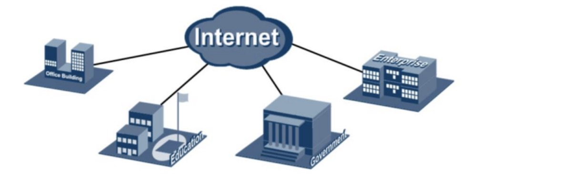
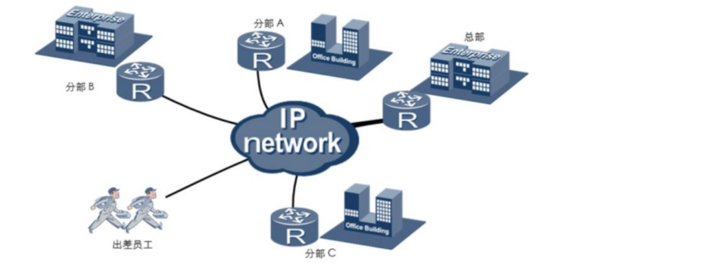
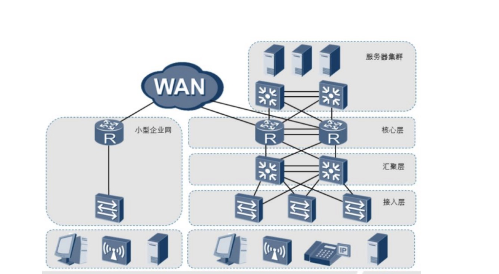
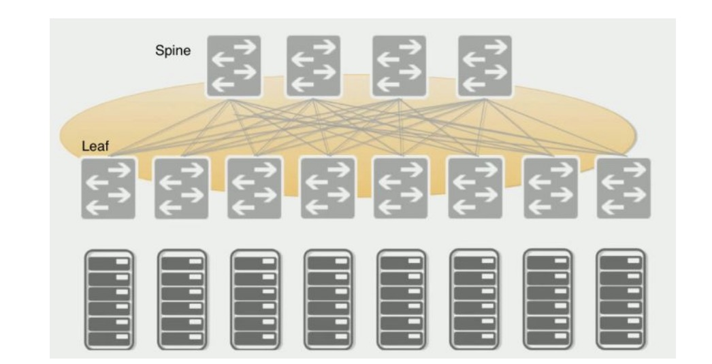
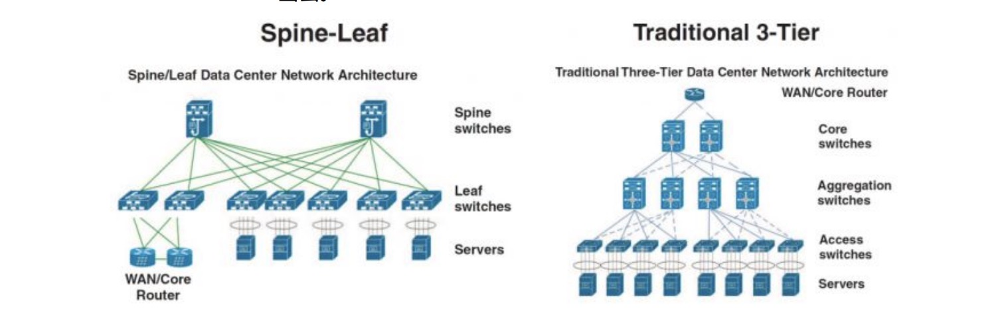
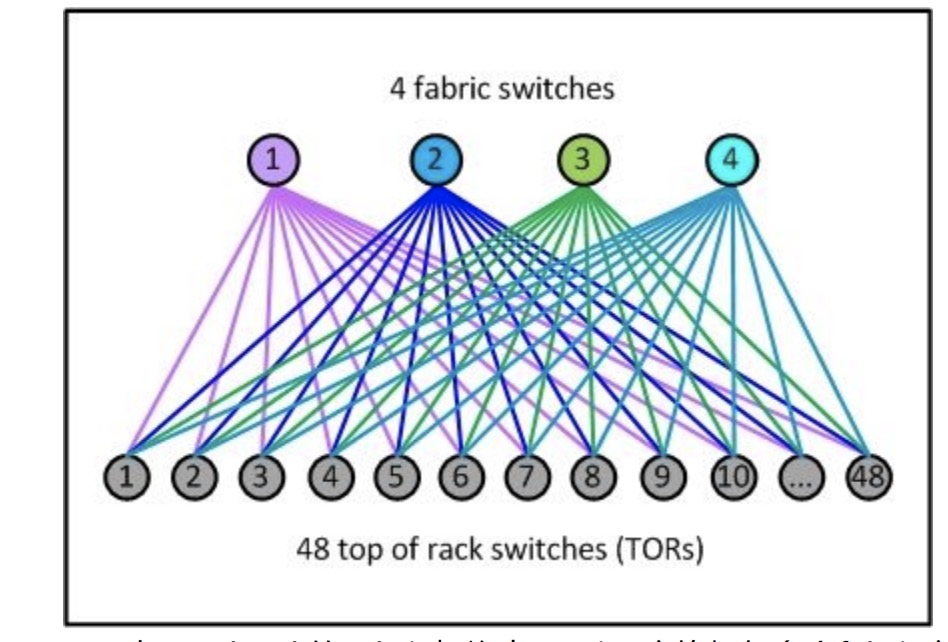
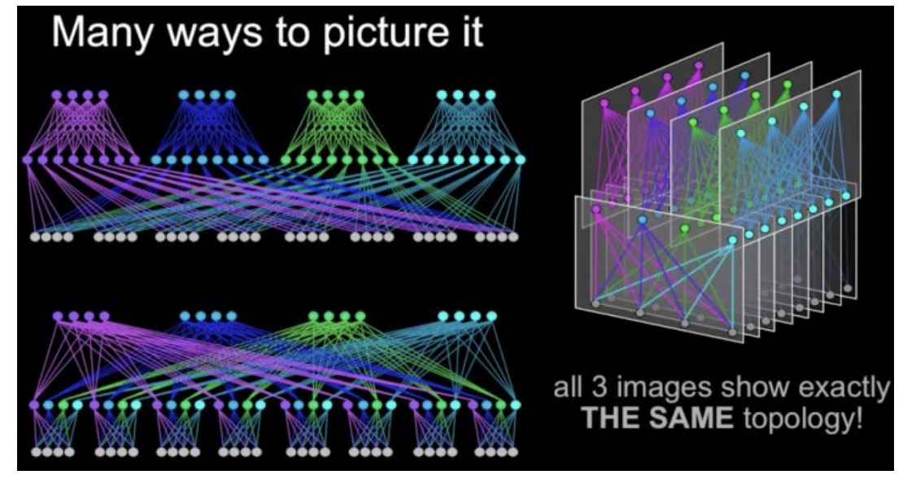
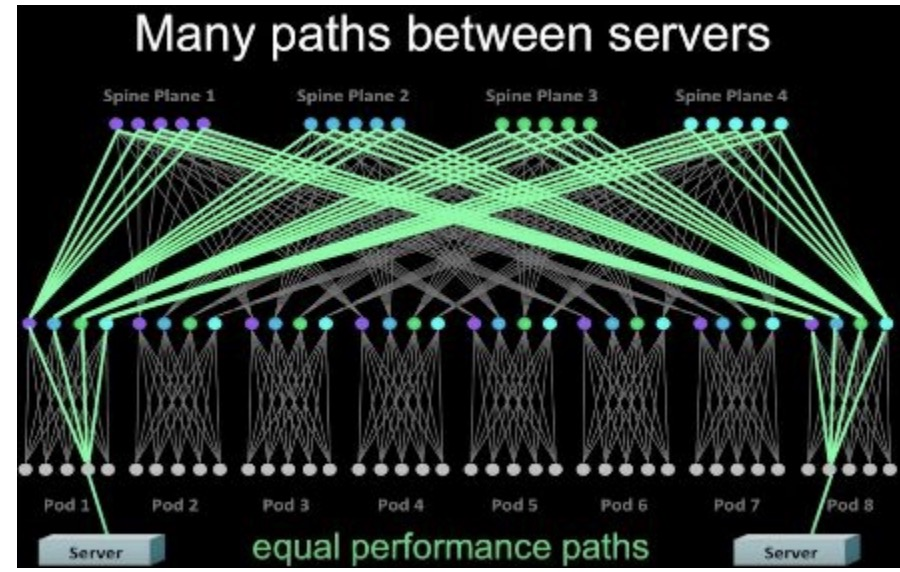

# 企业网络模型介绍

### 企业网络

​		企业的业务总是在不断的发展，对网络的需求也是在不断的变化，这就要求企业网络应该具备适应这种需求不断变化的能力。因此，了解企业网络的架构是如何适应业务的需求将变得十分必要。

 

​		最初，企业网络是指某个组织或机构的网络互联系统。企业使用该互联系统主要用于共 享打印机、文件服务器等，使用email实现用户间的高效协同工作。现在，企业网络已经广 泛应用在各行各业中，包括小型办公室、教育、政府和银行等行业或机构。

​		大型企业的网络往往跨越了多个物理区域，所以需要使用远程互连技术来连接企业总部和分支机构，从而使得出差的员工能随时随地接入企业网络实现移动办公，企业的合作伙伴和客户也能够及时高效的访问到企业的相应资源及工具。在实现远程互连的同时，企业还会基于对数据的私密性和安全性的考虑对远程互连技术进行选择。

​		企业网络组网不受地域限制，可以通过各种远程互连技术把分布在不同物理地域的网络连接在一起：

​		企业网络架构很大程度上取决于企业或机构的业务需求。小型企业通常只有一个办公地点，一般采用扁平网络架构进行组网。这种扁平网络能够满足用户对资源访问的需求，并具有较强的灵活性，同时又能大大减少部署和维护成本。小型企业网络通常缺少冗余机制，可靠性不高，容易发生业务中断。

​		大型企业网络对业务的连续性要求很高，所以通常会通过网络冗余备份来保证网络的可用性和稳定性，从而保障企业的日常业务运营。大型企业网络也会对业务资源的访问进行控制，所以通常会采用多层网络架构来优化流量分布，并应用各种策略进行流量管理和资源访问控制。多层网络设计也可以使网络易于扩展。大型企业网络采用模块化设计能够有效实现网络隔离并简化网络维护，避免某一区域产生的故障影响到整个网络。

### 数据中心网络模型

​		Access Layer（接入层）：有时也称为Edge Layer。接入交换机通常位于机架顶部，所以它们也被称为ToR（Top of Rack）交换机，它们物理连接服务器。
​		Aggregation Layer（汇聚层）：有时候也称Distribution Layer。汇聚交换机连接
Access交换机，同时提供其他的服务，例如防火墙，入侵检测，网络分析等。
​		Core Layer（核心层）：核心交换机为进出数据中心的包提供高速的转发，为多个汇聚层提供连接性，核心交换机为通常为整个网络提供一个弹性的L3路由网络。

###### Clos网络架构

​		现在流行的Clos网络架构是一个二层的脊叶（spine [spaɪn] /leaf[liːf] ）架构，如下图所示。脊（spine）交换机之间或者叶（leaf）交换机之间不需要链接同步数据（不像三层网络架构中的汇聚层交换机之间需要同步数据）。每个叶（leaf）交换机的上行链路数等于脊（spine）交换机数量，同样的每个脊（spine）交换机的下行链路数等于叶（leaf）交换机的数量。可以这样说，脊（spine）交换机和叶（leaf）交换机之间是以全网络（full mesh[fʊl meʃ]）方式连接

在spine/leaf架构中，每一层的作用分别是：

- leaf switch：相当于传统三层架构中的接入交换机，作为TOR（Top Of Rack）直接连接物理服务器。与接入交换机的区别在于，L2/L3网络的分界点现在在叶（leaf）交换机上了。叶（leaf）交换机之上是三层网络。
- spine switch：相当于核心交换机。脊（spine）和叶（leaf）交换机之间通过ECMP（EqualCost Multi Path）动态选择多条路径。区别在于，脊（spine）交换机现在只是为leaf交换机提供一个弹性的L3路由网络，数据中心的南北流量可以不用直接从spine交换机发出，一般来说，南北流量可以从与leaf交换机并行的交换机（edge switch）再接到广域网路由（WAN router）出去。

###### Facebook Fabric Datacenter

Fabric网络架构最具有代表性的就是Facebook在2014年公开的其数据中心架构：Introducing data center fabric, the next-generation Facebook data centenetwork。Facebook使用了一个五级Clos架构，前面说过实际的网络设备即是输入又是输出，因此五级Clos架构对折之后是一个三层网络架构，虽然这里也是三层，但是跟传统的三层网络架构完全是两回事。对应于上面介绍的架构，Facebook将叶（leaf）交换机叫做TOR，间添加了一层交换机称为fabric/ [ˈfæbrɪk] /交换机。fabric交换机和TOR构成了一个三级Clos结构，如下图所示，这与前面介绍的spine/leaf架构是一样的。Facebook将一组fabric交换机，TOR和对应的服务器组成的集群称为一个POD（Point Of Delivery）。POD是Facebook数据中心的最小组成单位，每个POD由48个TOR和4个fabric交换机组成，下图就是一个POD的示意图。

在Facebook的Fabric架构中，spine交换机与多个fabric交换机连接，为多个POD提供连通性。其整体网络架构如下图所示。下图中用三种方式表示了同一种网络架构。最上层是
spine交换机，中间是fabric交换机，最下面是TOR。

### 采用Clos架构的数据中心网络架构的优势：

- 弹性可扩展。数据中心可以以POD为单位构建，随着规模的增加，增加相应的POD即可。在Spine交换机端口数可承受的范围内，增删POD并不需要修改网络架构。

- 模块化设计。不论是POD，Spine Plane还是Edge Plane，都是一个个相同的模块，在水平扩展的时候，不需要新的设计，只是将原有的结构复制一份即可。灵活。当对网络带宽要求不高的时候，Spine交换机和Edge交换机可以适当减少。例如Facebook表示，在数据中心的初期，只提供4：1的东西向流量超占比，这样每个Spine Plane只需要12个Spine交换机。当需要更多带宽时，再增加相应的Spine交换机即可。

- 模块化设计。传统三层网络架构中，大的网络规模意味着高端的核心汇聚交换机。但是在Fabric架构中，交换机都是中等交换机，例如所有的fabric交换机只需要96个端口，中等规模的交换机简单，稳定，成本低，并且大多数网络厂商都能制造。

- 高度高可用。传统三层网络架构中，尽管汇聚层和核心层都做了高可用，但是汇聚层的高可用由于是基于STP（Spanning Tree Protocol），并不能充分利用多个交换机的性能，并且，如果所有的汇聚层交换机（一般是两个）都出现故障，那么整个汇聚层POD网络就瘫痪。但是在Fabric架构中，跨POD的两个服务器之间有多条通道（4*48=192），除非192条通道都出现故障，否则网络能一直保持连通，下图是一个跨POD服务器之间多通道示意图。

  

#### 简单的概括 高度高可用：

​		当某同学从一楼去往五楼时，可以搭乘电梯，也可以走楼梯，也可以走一半楼梯一半电梯。 如果当某一天电梯出现故障，他也可以走楼梯去往五楼，甚至可以从一楼走到四楼用楼梯，四楼到五楼用电梯。

​		不会出现某一处断掉就无法到达目的地的情况

