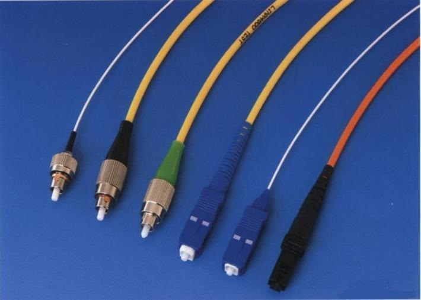
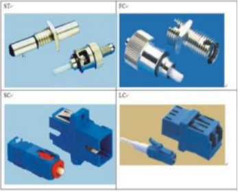
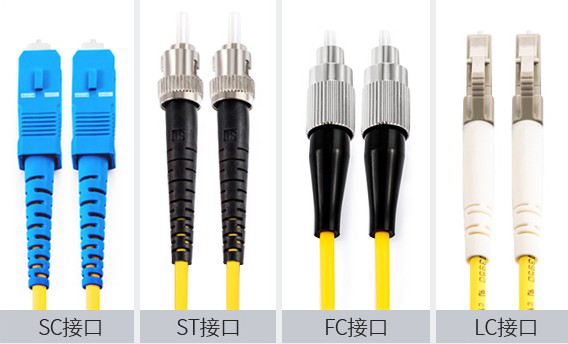
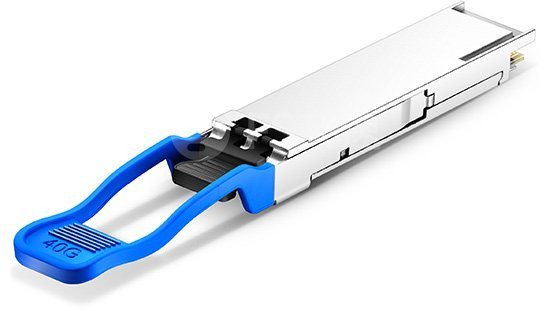
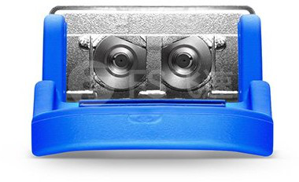
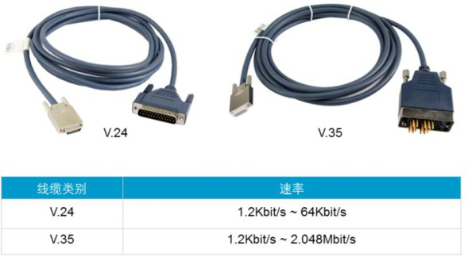
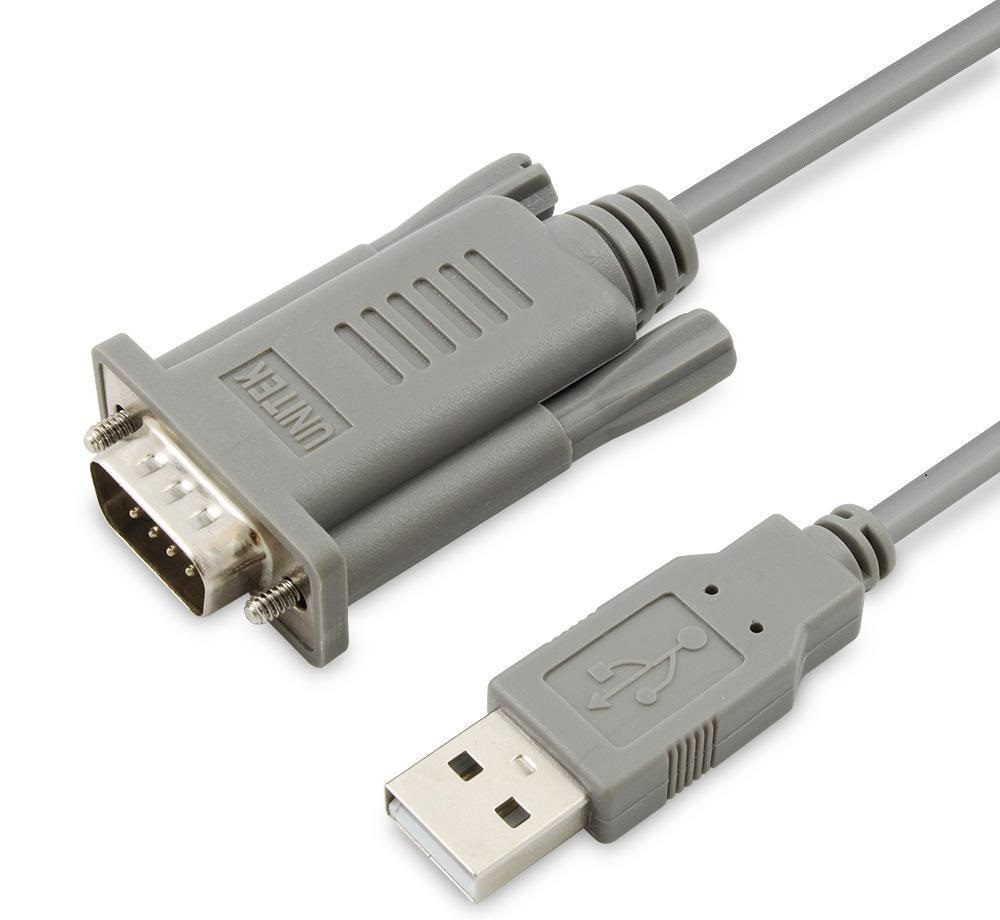

## 传输介质———光纤

### 光纤概述

​	我们知道双绞线和同轴电缆传输数据时使用的是电信号，而光纤传输数据时使用的是光信号。光纤支持的传输速率包括10Mbps，100Mbps，1Gbps，10Gbps，甚至更高。

#### 	关于光纤的优点 

​		（1）通信容量大、传输距离远；

​		（2）光纤的损耗极低；

​		（3）信号干扰小、保密性能好；

​		（4）抗电磁干扰、传输质量佳；

​		（5）光纤尺寸小、重量轻，便于铺设和运输；

​		（6）材料来源丰富，环保，有利于节约有色金属铜；

​		（7）无辐射，难于窃听；

​		（8）光缆适应性强，寿命长。

#### 	关于光纤的缺点

​		（1）质地脆，机械强度差；

​		（2）光纤的切断和接续需要一定的工具、设备和技术；

​		（3）分路、耦合不灵活；

​		（4）光纤光缆的弯曲半径不能过小（>20cm）；

​		（5）有供电困难问题。

### 单模、双模光纤

​	根据光纤传输光信号模式的不同，光纤又可分为单模光纤和多模光纤：

+ 单模光纤只能传输一种模式的光，不存在模间色散。因此适用于长距离高速传输。（色散：此处的色散毫无彩色之意，应理解为能量分散能量分散的原因是由于脉冲展宽造成的）

+ 多模光纤允许不同模式的光在一根光纤上传输，由于模间色散较大而导致信号脉冲展宽严重，因此多模光纤主要用于局域网中的短距离传输。（脉冲展宽：一条长度相同的光纤上，最高次模与最低次模到达终点所用的时间差，就是这段光纤产生的脉冲展宽。）

| 以太网标准  | 线缆类别      | 最长有效传输距离 |
| ----------- | ------------- | ---------------- |
| 10BASE-F    | 单模/多模光纤 | 2000米           |
| 100BASE-FX  | 单模/多模光纤 | 2000米           |
| 1000BASE-LX | 单模/多模光纤 | 5000米           |
| 1000BASE-SX | 多模光纤      | 550米            |

以太网标准的名字都是不同时期的以太网标准，标准名字来源于所使用的物理介质，下面先拆解一下这类名词：

- 10/100/1000： “10”表示数据率为10Mb/s， “100”表示数据率为100Mb/s。

- BASE：BASE是英文baseband的缩写，指的就是基带。表示没有使用频分复用或者其它频率转换技术，每一个信号在一个单一频率上完全控制线缆。

- 数字T/F/C等： 一般数组表示传输长度；T代表承载信号的物理介质是双绞线缆（分为UTP（Unshielded Twisted Pair，非屏蔽双绞线）和STP（Shielded Twicted Pair，屏蔽双绞线）），在这里每一对传送信号的双绞线互相缠绕以(FEXT和NEXT之间)减少电磁干扰和串扰；F和FX表示光纤。

- 最后的字母或数字（4/X等）： 在同一种传送速率下有多种不同的标准，它们之间以一个字母或数字跟随T/F/C之后的方式来区隔（例如TX）。它显示了网线的结构并指出包含的绞线对的数量。若为高速光纤，则分配代号为FX。

- 在千兆以太网标准中的字母：	SX表述短距离的光接口

  ​							  LX表示长距离光接口

  ​					                  ZX表示长距离光接口

  

​	如  10Base-5"10"代表传播速率为10Mbps；"Base"代表"基带传输"；数字“5”表示最大延伸距离接近500米，500米内不需要转接器。

​	10BASE-F 中：“10”代表传播速率为10Mbps；“BASE”代表“基带传输”；“F”代表光纤电缆(fiber-optic cable)的意思。

### 光纤连接器	

光纤连接器种类很多，常用的连接器包括ST，FC，SC，LC连接器。

#### 常见的光纤接口

### 光纤连线会用到光纤模块

​	光模块的作用就是光电转换，发送端会把电信号转换成光信号，通过光纤传送后，光纤模块再把光信号转换成电信号再进入接收端。

#### 光模块展示

### 串口电缆

​	串行接口(Serial Interface) 是指数据一位一位地顺序传送，其特点是通信线路简单，只要一对传输线就可以实现双向通信（可以直接利用电话线作为传输线）。一条信息的各位数据被逐位按顺序传送的通讯方式称为串行通讯。

​	串行通讯的特点是：数据位的传送，按位顺序进行，最少只需一根传输线即可完成；成本低但传送速度慢。串行通讯的距离可以从几米到几千米；根据信息的传送方向，串行通讯可以进一步分为单工、半双工和全双工三种。

#### 应用

​	串口的出现是在1980年前后，数据传输率是115kbps～230kbps。串口出现的初期是为了实现连接计算机外设的目的，初期串口一般用来连接鼠标和外置Modem~**调制解调器，俗称“猫”。**~以及老式摄像头和写字板等设备。串口也可以应用于两台计算机（或设备）之间的互联及数据传输。

​	由于串口（COM）不支持热插拔及传输速率较低，目前部分新主板和大部分便携电脑已开始取消该接口。目前串口多用于工控和测量设备以及部分通信设备中。

#### 串口类型

​	最开始常用的串口电缆标准为RS-232，同时也是之前被推荐的标准。但是由于RS-232的传输速率有限，传输距离仅为6米，所以有很大的缺陷。

​	其他的串口电缆标准可以支持更长的传输距离。例如RS-422和RS-485的传输距离可达1200米。RS-422和RS-485串口电缆通常使用V.35接头，这种接头在上世纪80年代已经淘汰，但是现在仍在帧中继、ATM等传统网络上使用。

​	V.24是RS-232标准的欧洲版。RS-232本身没有定义接头标准，常用的接头类型为DB-9和DB-25。现在，RS-232已逐渐被FireWire、USB等新标准取代，新产品和新设备已普遍使用USB标准。

