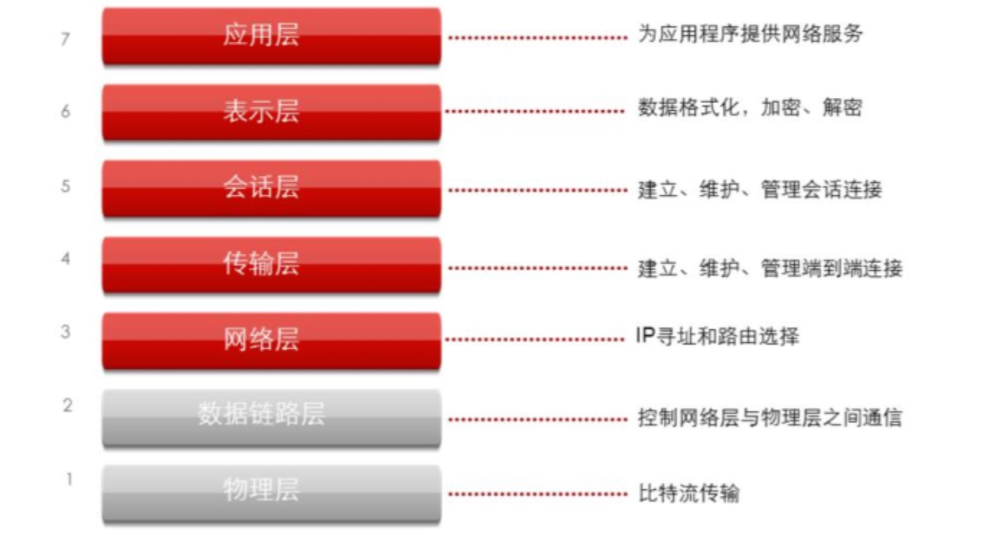
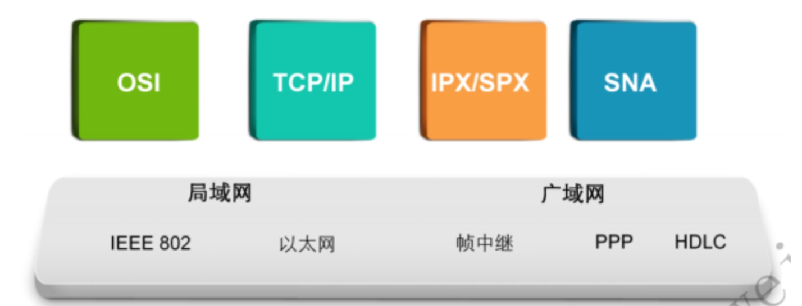
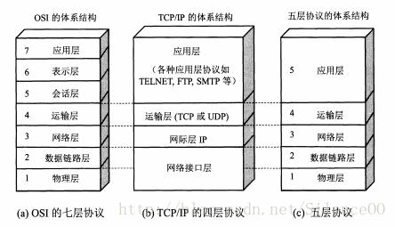

# OSI七层参考模型

​		20世纪60年代以来，计算机网络得到了飞速发展。各大厂商和标准组织为了在数据通信网络领域占据主导地位，纷纷推出了各自的网络架构体系和标准

​	后来国 际 标 准 化 组 织 ISO 于 1984 年 提 出 了 OSI RM ( Open SystemInterconnection Reference Model，开放系统互连参考模型)。OSI 参考模型很快成为了计算机网络通信的基础模型。OSI参考模型具有以下优点:简化了相关的网络操作;提供了不同厂商之间的兼容性;促进了标准化工作;结构上进行了分层;易于学习和操作。

**OSI七层模型只是逻辑上的七层，而并非物理上严格意义的七层**

## OSI参考模型各个层次的基本功能

- 物理层: 在**设备**之间传输比特流，规定了电平、速度和电缆针脚。 
- 数据链路层:将**比特组合成字节**，再将**字节组合成帧**，**使用链路层地址(以太网使用MAC 地址)来访问介质**，并进行差错检测。
- 网络层:提供**逻辑地址**，供路由器确定路径。 
- 传输层:提供面向连接或非面向连接的数据传递以及进行重传前的差错检测。 
- 会话层:负责**建立、管理和终止表示层实体**之间的通信会话。该层的通信由不同设备中的应用程序之间的服务请求和响应组成。 
- 表示层:提供各种用于**应用层数据的编码和转换**功能，确保一个系统的应用层发送的数据能 被另一个系统的应用层识别。 
- 应用层:OSI参考模型中最靠近用户的一层，为应用程序提供网络服务。

**网络通信协议:不同的协议栈用于定义和管理不同网络的数据转发规则**

​		网络通信中，“协议”和“标准”这两个词汇常常可以混用。同时，协议或标准本身又常常具有层次的特点。**一般地，关注于逻辑数据关系的协议通常被称为上层协议，而关注于物理数据流的协议通常被称为低层协议。**IEEE 802就是一套用来管理物理数据流在局域网中传输的标准， 包括在局域网中传输物理数据的802.3以太网标准。还有一些用来管理物理数
据流在使用串行介质的广域网中传输的标准，如帧中继FR( Frame Relay )，高级数据链路控制HDLC ( High-Level Data LinkControl)，异步传输模式ATM(AsynchronousTransfer Mode)。

- 帧中继（FrameRelay）是一种用于连接计算机系统的面向分组的通信方法。它主要用在公共或专用网上的局域网互联以及广域网连接。大多数公共电信局都提供帧中继服务，把它作为建立高性能的虚拟广域连接的一种途径。
- 高级数据链路控制（HDLC，High-level Data Link Control）是一组用于在网络结点间传送数据的协议，是由国际标准化组织（ISO）颁布的一种高可靠性、高效率的数据链路控制规程，其特点是各项数据和控制信息都以比特为单位，采用“帧”的格式传输
- ATM是一种[传输模式](https://baike.baidu.com/item/传输模式)，在这一模式中，信息被组织成信元，因包含来自某用户信息的各个信元不需要周期性出现，这种传输模式是异步的。
- 同步&异步
  - 同步：一定要等任务执行完了，得到结果，才执行下一个任务。
  - 异步：不等任务执行完，直接执行下一个任务。

## 五层体系结构

五层体系结构包括：应用层、运输层、网络层、数据链路层和物理层。 
五层协议只是OSI和TCP/IP的综合，实际应用还是TCP/IP的四层结构。为了方便可以把下两层称为网络接口层。

