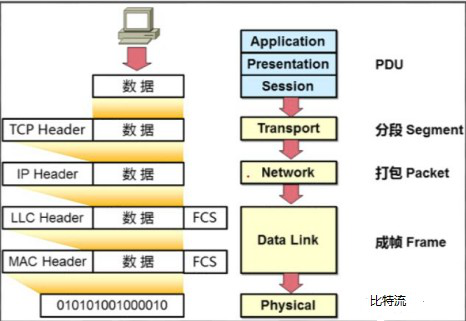
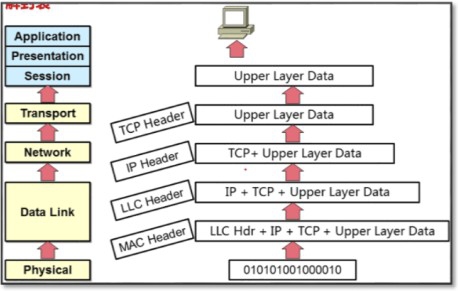

## 协议和接口

协议和接口TCP/IP协议在不同得系统上实现，通信双方逻辑上均有了相同得分层，同层之间用协议、上下层之间用接口

- 协议：讲究一致性，通信双方得对等层之间采用的协议应该一致接口：
- 接口：下层为上层服务，上层通过接口来使用下层提供的服务，接口由下层来提来提供。

## 数据封装及解封装

### PDU概述

​	应用数据需要经过TCP/IP每一层处理之后才能通过网络传输到目的端， 每一层上都使用该层的协议数据单元PDU（Protocol  Data  Unit）彼此交换信息。

​	不同层的PDU中包含有不同的信息，因此PDU在不同层被赋予了不同的名称.

1. 传输层的 PDU是数据段（segment [ˈseɡmənt , seɡˈment] ）
2. 网络层的PDU是数据包（packet [ˈpækɪt] ）
3. 数据链路层的 PDU是数据帧（frame [freɪm] ）

### 封装过程

​	一个上层数据在传输层添加TCP报头后得到传输层的 PDU,即Segment（数据段 ）；

​	数据段被传递给网络层，网络层添加IP报头得到网络层的PDU ,即Packet（数据包）；

​	数据包被传递到数据链路层，封装数据链路层报头得 到数据链路层的 PDU,即Frame（数据帧）；

​	最后，帧被转换为比特，通过网络介质传输。这种协  议栈逐层向下传递数据，并添加报头和报尾的过程称为封装。

### 解封过程

​	接收方收到数据后，会逐层进行拆解封装，然后通过接口将数据递交给上层处理，直到应用层接收到，这个过程称为解封装。

​	**数据通信的过程就是数据的封装解封装过程，这里面充分体现出了分层模型的好处。**

