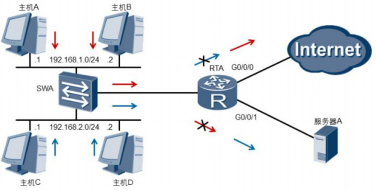
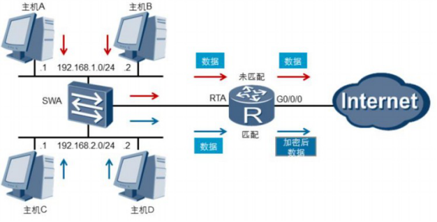
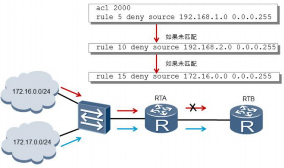

# 访问控制列表概述

企业网络中的设备进行通信时，需要保障数据传输的安全可靠和网络的性能稳定。访问控制列表ACL(Access Control List)可以定义一系列的规则，设备根据这些规则对数据包进行分类，并针对不同类型的报文进行不同的处理，从而可以实现对网络访问行为的控制、限制网络流量、提高网络性能、防止网络攻击等等。

ACL就是由一系列规则组成的集合。设备可以通过这些规则对数据包进行分类，并对不同类型的报文进行不同的处理。

例如：可以通过定义规则来允许或拒绝流量的通过。

设备可以依据ACL中定义的条件（例如源IP地址）来匹配入方向的数据，并对匹配了条件的数据执行相应的动作。

 

根据不同的划分规则，ACL可以有不同的分类。最常见的三种分类是基本ACL、高级ACL和二层ACL。

1. 基本ACL可以使用报文的源IP地址、分片标记和时间段信息来匹配报文，其编号取值范围是2000-2999。

2. 高级ACL可以使用报文的源/目的IP地址、源/目的端口号以及协议类型等信息来匹配报文。高级ACL可以定义比基本ACL更准确、更丰富、更灵活的规则，其编号取值范围是3000-3999。

3. 二层ACL可以使用源/目的MAC地址以及二层协议类型等二层信息来匹配报文，其编号取值范围是4000-4999。

一个ACL可以由多条“deny | permit”语句组成，每一条语句描述了一条规则。设备收到数据流量后，会逐条匹配ACL规则，看其是否匹配。如果不匹配，则匹配下一条。一旦找到一条匹配的规则，则执行规则中定义的动作，并不再继续与后续规则进行匹配。如果找不到匹配的规则，则设备不对报文进行任何处理。需要注意的是，ACL中定义的这些规则可能存在重复或矛盾的地方。规则的匹配顺序决定了规则的优先级，ACL通过设置规则的优先级来处理规则之间重复或矛盾的情形。 

 

 

## ARG3系列路由器支持两种匹配顺序

**配置顺序和自动排序**:

1. 配置顺序按ACL规则编号（rule-id）从小到大的顺序进行匹配。设备会在创建ACL的过程中自动为每一条规则分配一个编号，规则编号决定了规则被匹配的顺序。例如，如果将步长设定为5，则规则编号将按照5、10、15…这样的规律自动分配。如果步长设定为2，则规则编号将按照2、4、6、8…这样的规律自动分配。通过设置步长，使规则之间留有一定 的空间，用户可以在已存在的两个规则之间插入新的规则。路由器匹配规则时默认采用配置顺序。另外，ARG3系列路由器默认规则编号的步长是5。

2. 自动排序使用“深度优先”的原则进行匹配，即根据规则的精确度排序。

本示例中，RTA收到了来自两个网络的报文。默认情况下，RTA会依据ACL的配置顺序来匹配这些报文。网络172.16.0.0/24发送的数据流量将被RTA上配置的ACL2000的规则15 匹配，因此会被拒绝。而来自网络172.17.0.0/24的报文不能匹配访问控制列表中的任何规则，因此RTA对报文不做任何处理，而是正常转发。

 
