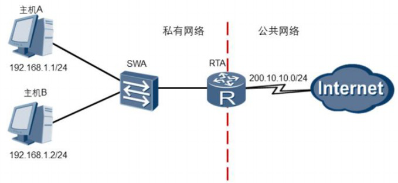

## NAT的工作原理

### 认识NAT

​	随着Internet的发展和网络应用的增多，IPV4地址枯竭已经成为制约网络发展的瓶颈。尽管IPV6可以从根本上解决IPV4地址空间不足的问题，但是目前众多的网络设备和网络应 用仍是基于IPV4的，所以在IPV6广泛应用之前，一些过度技术的使用是解决这个问题的主 要技术手段。

​	NAT（Network Address Translation）网络地址转换技术主要用于实现位于公司内部网络的主机访问互联网的功能。当局域网内的主机需要访问外部网络时，通过NAT技术可  以将其私网地址转换为公网地址，并且多个私网用户可以共用一个公网地址，这样即可以保证网络互通，又节省了公网地址。

### NAT的功能

​	NAT还有一个主要功能是把位于内网的服务器发布到公网上，让公网用户来访问，这样隐藏了内网服务器，起到了一定的安全作用。

​	NAT一般部署在接内网和外网的网关设备上。连

### NAT的实现方式

​	NAT是将IP数据报文头部中的IP地址转换为另一个IP地址的过程，根据NAT实现方式， 也会转换传输层中的端口号，网关路由器会把这些转换信息记录到NAT映射表中，这张NAT映射表可以静态产生也可以动态产生。NAT功能会加大网关路由器的负载，有些应用NAT也还是不能支持：比如DNS区域复制，NAT就不支持，所以NAT还是有些缺点的。

​	NAT的实现方式有多种，适用于不同的场景。

+ 静态NAT实现了私有地址和公有地址的一对一映射。如果希望一台主机优先使用某个关联地址，或者想要外部网络使用一个指定的公网地址访问内部服务器时，可以使用静态NAT。但是在大型网络中，这种一对一的IP地址映射无法缓解公用地址短缺的问题。

+ 动态NAT通过使用地址池来实现转换。动态NAT地址池中的地址用尽以后，只能等待被占用的公用IP被释放后，其他主机才能使用它来访问公网。

+ 网络地址端口转换NAPT（Network Address Port Translation）允许多个内部地址映射到同一个公有地址的不同端口。

+ Easy IP适用于小规模局域网中的主机访问Internet的场景。小规模局域网通常部署在小型的网吧或者办公室中，这些地方内部主机不多，出接口可以通过拨号方式获取一个临时公网IP地址。Easy IP可以实现内部主机使用这个临时公网IP地址访问Internet。

+ NAT Server可以实现外网用户访问内网服务器的不同端口，需要配置服务器私网IP地址和端口号转换为公网IP地址和端口号并发布出去，实现了一个公网IP对应多个私网服务器的需求。


## 配置共享上网

​	

​	如果要实现公司内网用户上网需求，可以选择动态NAT、NATP或Easy IP的方式


### 动态NAT配置


#### 	1. 先定义公网地址池

```shell
[Huawei]nat address-group 1 100.1.1.1 100.1.1.100
// nat address-group命令用来配置NAT地址池。
```

​	

#### 	2. 定义ACL匹配要转换的内网地址段

```shell
[Huawei]acl 2005
[Huawei-acl-basic-2005]rule permit source 192.168.10.0 0.0.0.255
[Huawei-acl-basic-2005]rule permit source 192.168.11.0 0.0.0.255
```


#### 	3. 在外网接口上进行映射

​	nat outbound命令用来将一个访问控制列表ACL和一个地址池关联起来，表示ACL中规定的地址可以使用地址池进行地址转换。ACL用于指定一个规则，用来过滤特定流量。no-pat表示只转换数据报文的地址而不转换端口信息。

```shell
[Huawei]interface GigabitEthernet 0/0/1
[Huawei-GigabitEthernet0/0/1]nat outbound 2005 address-group 1 no-pat
```


#### 4. 检查NAT配置情况

​	display nat address-group group-index命令用来查看NAT地址池配置信息。

```shell
[Huawei]display nat address-group 1

NAT Address-Group Information:
--------------------------------------
Index	Start-address	End-address
--------------------------------------     1	100.1.1.1	100.1.1.100
--------------------------------------
Total : 1

```


命令display nat outbound用来查看动态NAT配置信息。

```shell
[Huawei]display nat outbound

NAT Outbound Information:
--------------------------------------------------------------------------
Interface	Acl	Address-group/IP/Interface	Type
--------------------------------------------------------------------------
GigabitEthernet0/0/1	2005	1	no-pat
--------------------------------------------------------------------------

Total : 1
```


### Easy IP配置


#### 	1. 首先定义内网要转换的网段的ACL

```shell
[Huawei]acl 2005
[Huawei-acl-basic-2005]rule permit source 192.168.10.0 0.0.0.255
[Huawei-acl-basic-2005]rule permit source 192.168.11.0 0.0.0.255 
```


#### 	2.然后在外部接口上启用NAT

```shell
[Huawei]interface GigabitEthernet 0/0/1
[Huawei-GigabitEthernet0/0/1]nat outbound 2005
```


#### 	3.验证配置

​	命令display nat outbound用于查看命令nat outbound的配置结果。

```shell
[Huawei]display nat outbound
NAT Outbound Information:
--------------------------------------------------------------------------
Interface	Acl	Address-group/IP/Interface	Type
--------------------------------------------------------------------------
GigabitEthernet0/0/1	2005	100.1.1.5	easyip
--------------------------------------------------------------------------
Total : 1
```

Address-group/IP/Interface表项表明接口和ACL已经关联成功，type表项表明Easy IP已经配置成功

### NAPT 配置


#### 1. 先定义公网地址池

```shell
[R1]nat address-group 0 12.1.1.1 12.1.1.1 
```

​	

#### 2. 定义ACL匹配要转换的内网地址段

```shell
[R1]acl 2000	
[R1-acl-basic-2000]rule permit source 10.1.1.1 0.0.0.0
[R1-acl-basic-2000]rule permit source 10.1.1.2 0.0.0.0	
[R1-acl-basic-2000]rule permit source 10.1.1.3 0.0.0.0
[R1-acl-basic-2000]quit 
```


#### 3. 在外网接口上进行映射

```shell
[R1]int g 0/0/1
[R1-GigabitEthernet0/0/1]nat outbound 2000 address-group 0	
[R1-GigabitEthernet0/0/1]quit 
```

​	可以发现NAPT的配置方式和动态NAT类似，只是在最后调用公网和私网地址池时不加no-pat参数。

## 动态NAT 、 Easy IP 、NAPT之间的区别


| NAT方式 | 私有地址与公有地址的对应关系 | 命令存在的最大差异处                     |
| ------- | ---------------------------- | ---------------------------------------- |
| 动态NAT | 一对多                       | nat outbound 2005 address-group 1 no-pat |
| Easy IP | 多对一                       | nat outbound 2005                        |
| NAPT    | 多对一                       | nat outbound 2000 address-group 0        |

