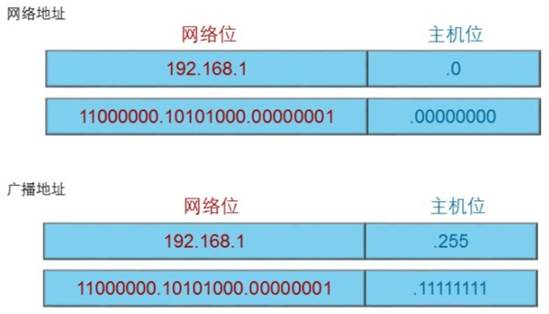
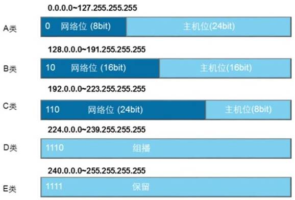

# IP地址结构及分类

## 理解IP编址是更好的设计网络的基础

IP地址是**逻辑地址**，所以设备的IP地址是可以配置和修改的，在TCP/IP网络中的设备如果要想通信，必须具备一个IP地址。

I**Pv4地址为32比特的二进制数**，通常用点分十进制表示。IP地址用来标识网络中的设备，具有IP地址的设备可以在同一网段内或跨网段通信。IP地址包括两部分，第一部分是网络号，表示IP地址所属的网段，第二部分是主机号，用来唯一标识本网段上的某台网络设备。

每个网段上都有两个特殊地址不能分配给主机或网络设备。第一个是该网段的网络地址，该IP地址的主机位为全0，表示一个网段。第二个地址是该网段中的广播地址，目的地址为广播地址的报文会被该网段中的所有网络设备接收。广播地址的主机位为全1。除网络地址和广播地址以外的其他IP地址都可以作为网络设备的IP地址。

IPv4地址被划分为A、B、C、D、E五类，每类地址的网络号包含不同的字节数。A类， B类和C类地址为可分配IP地址，每类地址支持的网络数和主机数不同。

比如，**A类地址可支持126个网络**，每个网络支持224（16,777,216 )个主机地址，另外每个网段中的网络地址和广播地址不能分配给主机。**C类地址支持200多万个网络**，每个网络支持256个主机地址，其中254个地址可以分配给主机使用。**D类地址为组播地址**。主机收到以D类地址为目的地址的报文后，且该主机是该组播组成员，就会接收并处理该报文。各类IP地址可以通过第一个字节中的比特位进行区分。如A类地址第一字节的最高位固定为0，B类地址第一字节的高两位固定为10，C类地址第一字节的高三位固定为110，D类地址第一字节的高四位固定为1110，E类地址第一字节的高四位固定为1111。

IPv4中的部分IP地址被保留用作特殊用途。为节省IPv4地址，A、B、C  类地址段中都预留了特定范围的地址作为私网地址。现在，世界上所有  终端系统和网络设备需要的IP地址总数已经超过了32位IPv4地址所能支  持的最大地址数4,294,967,296。为主机分配私网地址节省了公网地址， 可以用来缓解IP地址短缺的问题。企业网络中普遍使用私网地址，不同企业网络中的私网地址可以重叠。默认情况下，网络中的主机无法使用  私网地址与公网通信；当需要与公网通信时，私网地址必须转换成公网  地址。还有其他一些特殊IP地址，如127.0.0.0网段中的地址为环回地址， 用于诊断网络是否正常。IPv4中的第一个地址

**0.0.0.0表示任何网络，IPv4 中的最后一个地址255.255.255.255是0.0.0.0网络中的广播地址。**

## 私网地址段

10.0.0.0-----10.255.255.255

172.16.0.0-------172.31.255.255

192.168.0.0------192.168.255.255

##  特殊地址

127.0.0.0-----127.255.255.255

0.0.0.0

255.255.255.255

