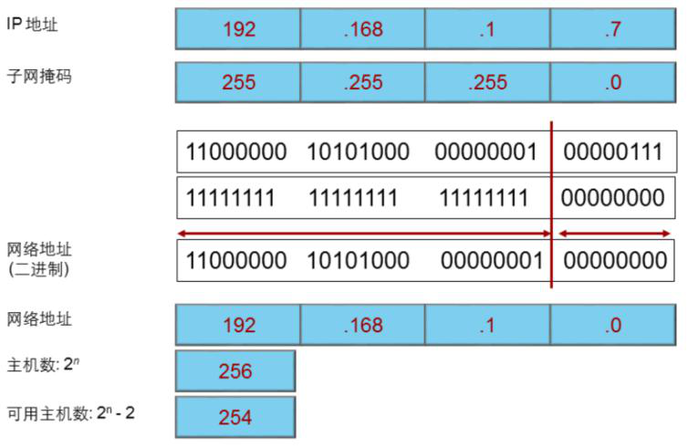

# 子网掩码的作用

## 1. 为什么要有子网掩码

​		网络通信的时候，源主机必须要知道目的主机的IP地址后才能将数据发送到目的地。源主机向其他目的主机发送报文之前，需要检查目的IP地址和源IP地址是否属于同一个网段。如果是，则报文将被下发到底层协议进行以太网封装处理。如果目的地址和源地址属于不同网段，则主机需要获取下一跳路由器的IP地址，然后将报文下发到底层协议处理。那主机如何判断和目的主机是否在同一个网络呢？

​		在这里，引入了子网掩码这个概念

## 2. 子网掩码的作用

​		通过子网掩码，可以让主机判断自己所在得网络，还可以让路由器的接口能够知道自己所直连网段。子网掩码用于区分网络部分和主机部分。

## 3. 子网掩码和IP的关系

​		子网掩码与IP地址的表示方法相同。每个IP地址和子网掩码一起可以用来唯一的标识一个网段中的某台网络设备。子网掩码中的1表示网络位，0表示主机位。

​		每类IP地址有一个缺省子网掩码。A类地址的缺省子网掩码为8位，即第一个字节表示网络位，其他三个字节表示主机位。B类地址的缺省子网掩码为16位，因此B类地址支持更多的网络，但是主机数也相应减少。C类地址的缺省子网掩码为24位，支持的网络最多，同时也限制了单个网络中主机的数量。		

​		通过子网掩码可以判断主机所属的网段、网段上的广播地址以及网段上支持的主机数。

## 4. 子网掩码的计算

​		IP地址和子网掩码“与”运算的结果就是主机所处的网络ID，主机位都取1，然后换算成十进制，就是这个网络的广播地址，中间的取值便是可使用的IP地址。

​		源主机使用自己的子网掩码和自己的IP地址做‘与’运算，得到一个结果，然后再用自己的子网掩码和目的主机IP地址进行“与”运算，又得到一个结果，比较这两个结果，如果相同就为同一网络，否则为不同网络，不同网络的主机通信，需要网关。