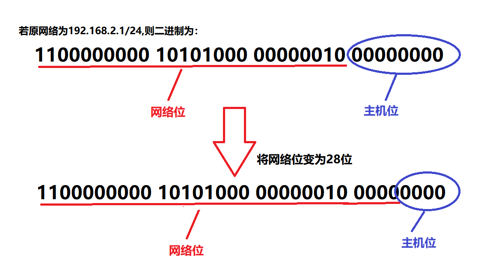
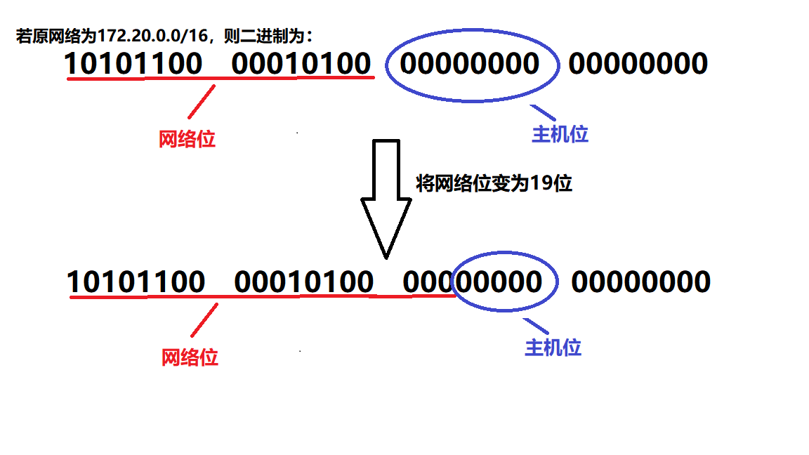

## 子网划分快速方法-子网间距

### 快速划分方式

​	子网间距指的是子网之间的距离，通过其可以快速的划分子网，如果原网络是24位的，现在划分成了28位的网络，那么其变化的是IP中的第4个字节，第4 字节还剩4个比特位为主机位，所以子网间距就是2的4次方，为16，所以就可以快速写出划分后的网络ID。

例如：

原网络192.168.2.0/24，那么划分后的网络就是： 

192.168.2.0/28

192.168.2.16/28

192.168.2.32/28

192.168.2.48/28

............ 

192.168.2.240/28

每个子网之间的距离都是16

### 例二

​	如果原网络是16位的，现在划分成了19位的网络，那么其变化的是IP中的第3个字节，第3 个字节还剩5个比特位为主机位，所以子网间距就是2的5次方，为32，所以就可以快速写出划分后的网络ID 

例如：原网络172.20.0.0/16，那么划分后的网络就是： 

172.20.0.0/19

172.20.32.0/19

172.20.64.0/19

172.20.96.0/19

172.20.128.0/19

172.20.160.0/19

172.20.192.0/19

172.20.224.0/19

每个子网之间的距离都是32

 

