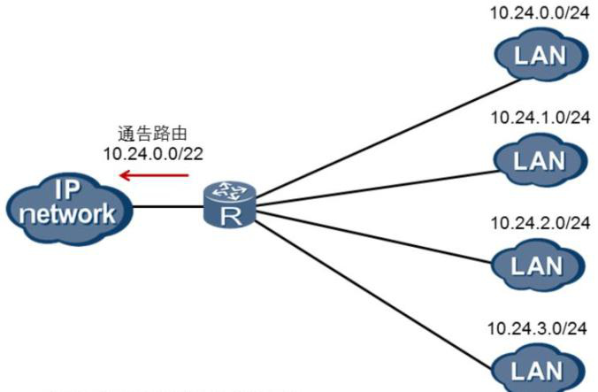

# CIDR及路由汇总

## 1. CIDR

​		**无类域间路由**CIDR（Classless Inter Domain Routing）由***RFC***1817定义。CIDR突破了传统IP地址的分类边界，将路由表中的若干条路由汇聚为一条路由，减少了路由表的规模，提高了路由器的可扩展性。

​		***RFC***：Request For Comments（RFC），是一系列以编号排定的文件。

## 2. 路由汇总

### 2-1. 为什么要进行路由汇总

​		如图所示，一个企业分配到了一段A类网络地址，10.24.0.0/22。该企业准备把这些A类网络分配给各个用户群，目前已经分配了四个网段给用户。如果没有实施CIDR技术，企业路由器的路由表中会有四条下连网段的路由条目，并且会把它通告给其他路由器。通过实施CIDR技术，我们可以在企业路由器上把这四条路由10.24.0.0/24，10.24.1.0/24，10.24.2.0/24，10.24.3.0/24汇聚成一条路由10.24.0.0/22。这样，企业路由器只需通告10.24.0.0/22这一条路由，大大减小了路由表的规模。

### 2-2. 如何进行路由汇总

​		**实际上就是找网络位的共同点**

​		将要被汇总的所有网段转换成**二进制**，然后找它们的共同部分，它们相同的哪些位，就是汇总后的网络的网络位，然后再将其主机位用0补到32位，再用点分十进制表示出来的网络ID就是汇总后的网络

**00001010 00011000 000000**00 00000000 10.24.0.0/24

 

**00001010 00011000 000000**01 00000000 10.24.1.0/24

 

**00001010 00011000 000000**10 00000000 10.24.2.0/24

 

**00001010 00011000 000000**11 00000000 10.24.3.0/24 

所以汇总后的网络就是：

**00001010 00011000 000000**00 00000000 10.24.0.0/22 子网掩码:255.255.252.0

### 2-3. 路由汇总注意事项

​	汇总有可能会出现问题，因为可能会多汇总网络，例如：10.24.0.0/24、10.24.1.0/24、10.24.2.0/24、10.24.3.0/24 、10.24.4.0/24这5个网络汇总的话就只能汇总成10.24.0.0/21，但是这个汇总网络中多包含了：10.24.5.0/24、10.24.6.0/24、10.24.7.0/24这3个网络，所以就可能会出现路由问题。

​		因此，我们必须要做因此，我们必须要做**精确汇总**，并要**合理规划网络**，才能保证通信问题不发生。

​		路由汇总就是子网划分的**逆运算**

​		最大的汇总网络是0.0.0.0/0，这个网络包含**任意地址**。