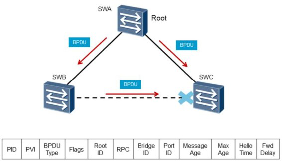
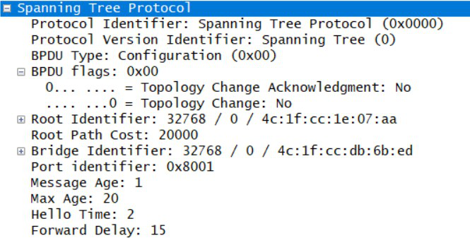
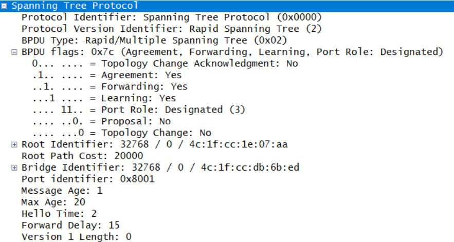
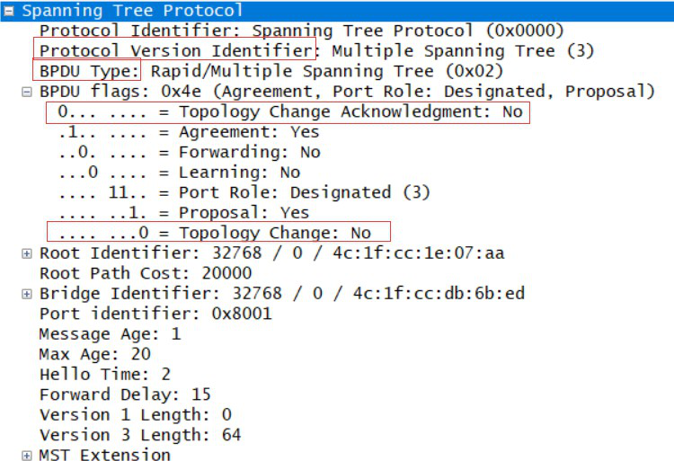

## BPDU报文

### 概述

​	STP只所以可以消除环路，构建无环拓扑，是通过协议消息来实现的，STP的消息叫做BPDU(Bridge  Protocol  Data  Unit 桥接协议数据单元 )。BPDU中包含交换机之间需要交换的相关信息和参数， 这些信息和参数是生成树计算无环拓扑使用到的。

### BPDU类型

BPDU有两种类型：配置BPDU和TCN B PDU。

1. 配置BPDU包含了桥ID、 路径开销和端口ID等参数。 STP协议通过在交换机之间传递配置BPDU来选举根交换机，  以及确定每个交换机端口的角色和状态。  在初始化过程 中， 每个桥都主动发送配置BPDU。 在网络拓扑稳定以后， 只有根桥主动发送配置BPDU， 其他交换机在收到上游传来的配置BPDU后， 才会发送自己的配置BPDU。
2. TCN  BPDU是指下游交换机感知到拓扑发生变化时向上游发送的拓扑变化通知。

### 和BPDU有关的术语

​	配置BPDU中包含了足够的信息来保证设备完成生成树计算， 其中包含的重要信息如下：

1. 根桥ID：由根桥的优先级和MAC地址组成， 每个STP网络中有且仅有一个根桥。优先级默认32768
2. 根路径开销：到根桥的最短路径开销。
3. 指定桥ID：由指定桥的优先级和MAC地址组成。
4. 指定端口ID：由指定端口的优先级和端口号组成。 端口优先级默认128
5.  Message Age（ [ˈmesɪdʒ eɪdʒ] 消息生存期）：配置BPDU在网络中传播的生存期。
6. Max Age（最大存储时间）：配置BPDU在设备中能够保存的最大生存期。
7. Hello Time（呼叫时间）：配置BPDU发送的周期。
8. Forward Delay（[ˈfɔːrwərd dɪˈleɪ] 发送延迟）：端口状态迁移的延时。

### 抓包结果

#### 	本例为STP生成树报文

#### 	本例为RSTP生成树报文

#### 	

#### 	本例为MSTP生成树

协议版本：1字节，STP值为0，RSTP值为2，MSTP值为3

BPDU类型：1字节，配置BPDU为0x00，TCN BPDU为0x08

BPDU 标志：1字节，最低位=TC（Topology Change，拓扑变化）标志，最高位=TCA（Topology Change Acknowledgement，拓扑变化确认）标志