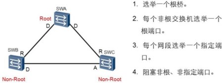
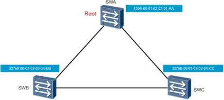
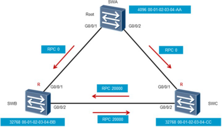

# STP工作原理

STP通过构造一棵树来消除交换网络中的环路。

每个STP网络中， 都会存在一个根桥， 其他交换机为非根桥。 根桥或者根交换机位于整个逻辑树的根部， 是STP网络的逻辑中心， 非根桥是根桥的下游设备。 当现有根桥产生故障时， 非根桥之间会交互BPDU信息并重新选举根桥。

STP中定义了三种端口角色：**指定端口**， **根端口**和**预备端口**。

指定端口是交换机向所连网段转发配置BPDU(通过在交换机之间传递一种特殊的协议报文，网桥协议数据单元（Bridge Protocol Data Unit，简称BPDU)的端口， 每个网段有且只能有一个指定端口。 一般情况下， 根桥的每个端口总是指定端口。

根端口是非根交换机去往根桥路径最优的端口。 在一个运行STP协议的交换机上最多只有一个根端口， 但根桥上没有根端口。

如果一个端口既不是指定端口也不是根端口， 则此端口为预备端口。 预备端口将被阻塞。

1、根桥选举

STP中根桥的选举依据的是桥ID， STP中的每个交换机都会有一个桥ID(Bridge ID) 。桥ID由16位的桥优先级（Bridge Priority） 和48位的MAC地址构成。 在STP网络中， 桥优先级是可以配置的， 取值范围是0～65535， 默认值为32768。 优先级最高的设备（数值越小越优先） 会被选举为根桥。 如果优先级相同， 则会比较MAC地址， MAC地址越小则越优先。

交换机启动后就自动开始进行生成树收敛计算。 默认情况下， 所有交换机启动时都认为自己是根桥， 自己的所有端口都为指定端口， 这样BPDU报文就可以通过所有端口转发。 对端交换机收到BPDU报文后，会比较BPDU中的根桥ID和自己的桥ID。 如果收到的

BPDU报文中的桥ID优先级低， 接收交换机会继续通告自己的配置BPDU报文给邻居交换机。 如果收到的BPDU报文中的桥ID优先级高， 则交换机会修改自己的BPDU报文的根桥ID字段， 宣告新的根桥。

 

2、根端口选举

非根交换机在选举根端口时分别依据该端口的根路径开销、 对端BID（Bridge ID） 、对端PID（Port ID）和本端PID。

交换机的每个端口都有一个端口开销（Port Cost） 参数， 此参数表示该端口在STP中的开销值。 默认情况下端口的开销和端口的带宽有关， 带宽越高， 开销越小。 从一个非根桥到达根桥的路径可能有多条， 每一条路径都有一个总的开销值， 此开销值是该路径上所有接收BPDU端口的端口开销总和（即BPDU的入方向端口） ， 称为路径开销。 非根桥通过对比多条路径的路径开销， 选出到达根桥的最短路径， 这条最短路径的路径开销被称为RPC（Root Path Cost， 根路径开销） ，并生成无环树状网络。 根桥的根路径开销是0。一般情况下， 企业网络中会存在多厂商的交换设备， 华为X7系列交换机支持多种STP 的路径开销计算标准， 提供最大程度的兼容性。 缺省情况下， 华为X7系列交换机使IEEE802.1t标准来计算路径开销。

运行STP交换机的每个端口都有一个端口ID， 端口ID由端口优先级和端口号构成。 端口优先级取值范围是0到240， 步长为16， 即取值必须为16的整数倍。 缺省情况下， 端口优先级是128。  端口ID（Port  ID)可以用来确定端口角色。每个非根桥都要选举一个根端口。 根端口是距离根桥最近的端口， 这个最近的衡量标准是靠路径开销来判定的， 即路径开销最小的端口就是根端口。 端口收到一个BPDU报文后， 抽取该BPDU报文中根路径开销字段的值， 加上该端口本身的端口开销即为本端口路径开销。 如果有两个或两个以上的端口计算得到的累计路径开销相同， 那么选择收到发送者BID最小的那个端口作为根端口。

如果两个或两个以上的端口连接到同一台交换机上， 则选择发送者PID最小的那个端口作为根端口。 如果两个或两个以上的端口通过Hub连接到同一台交换机的同一个接口上， 则选择本交换机的这些端口中的PID最小的作为根端口。

 

3、指定端口选举

在网段上抑制其他端口（无论是自己的还是其他设备的） 发送BPDU报文的端口， 就是该网段的指定端口。 每个网段都应该有一个指定端口，根桥的所有端口都是指定端口（除非根桥在物理上存在环路） 。指定端口的选举也是首先比较累计路径开销， 累计路径开销最小的端口就是指定端口。 如果累计路径开销相同， 则比较端口所在交换机的桥ID，所在桥ID最小的端口被选举为指定端口。 如果通过累计路径开销和所在桥ID选举不出来， 则比较端口ID， 端口ID最小的被选举为指定端口。

网络收敛后， 只有指定端口和根端口可以转发数据。 其他端口为预备端口， 被阻塞， 不能转发数据， 只能够从所连网段的指定交换机接收到BPDU报文， 并以此来监视链路的状态。

 

