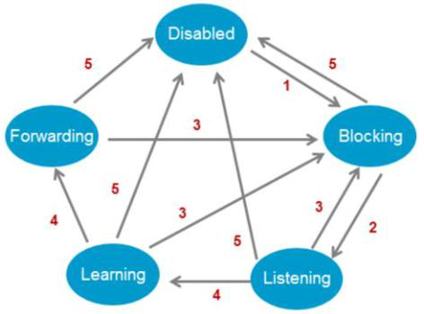
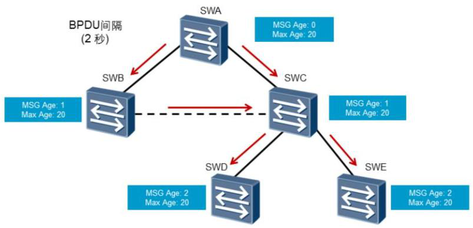

# STP状态和计时器

## 运行STP协议的设备上端口状态

- Forwarding：转发状态。端口既可转发用户流量也可转发BPDU报文，只有根端口或指定端口才能进入Forwarding状态。

- Learning：学习状态。端口可根据收到的用户流量构建MAC地址表，但不转发用户流量。增加Learning状态是为了防止临时环路。

- Listening：侦听状态。端口可以转发BPDU报文，但不能转发用户流量。
- Blocking：阻塞状态。端口仅仅能接收并处理BPDU，不能转发BPDU，也不能转发用户流量。此状态是预备端口的最终状态。

- Disabled：禁用状态。端口既不处理和转发BPDU报文，也不转发用户流量。

## 端口状态转换

端口状态转换如下：

1、端口初始化或者使能

2、端口被选为根端口或者指定端口

3、端口不在是根端口或者指定端口

4、forward delay计时器超时

5、端口禁用或者链路失效

## STP协议中一些重要的时间参数

**Hello Time**是指运行STP协议的设备发送配置BPDU的时间间隔，用于检测链路是否存在故障。交换机每隔Hello Time时间会向周围的交换机发送配置BPDU报文，以确认链路是否存在故障。当网络拓扑稳定后，该值只有在**根桥**上修改才有效。

 

**Message Age**是从根桥发送到当前交换机接收到BPDU的总时间，包括传输延时等。如果配置BPDU是根桥发出的，则Message Age为0。实际实现中，配置BPDU报文每经过一个交换机， Message Age增加1。

**Max Age**是指BPDU报文的**老化时间**，**可在根桥上通过命令人为改动这个值**。 Max Age通过配置BPDU报文的传递，可以保证Max Age在整网中一致。非根桥设备收到配置BPDU报文后，会将报文中的Message Age和Max Age进行比较：如果Message Age小于等于Max Age，则该非根桥设备会继续转发配置BPDU报文。如果Message Age大于Max Age，则该配置BPDU报文将被老化掉。该非根桥设备将直接丢弃该配置BPDU，并认为是**网络直径过大**，导致了根桥连接失败。

