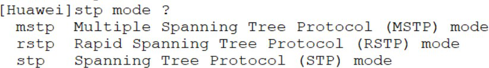
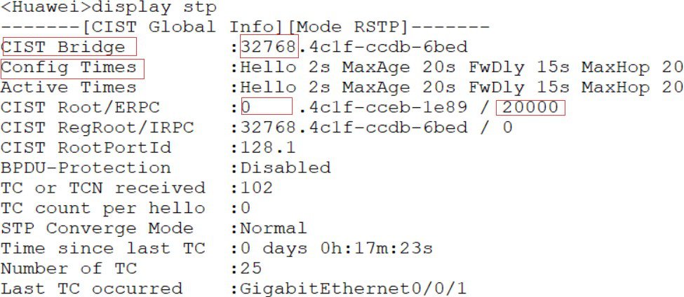
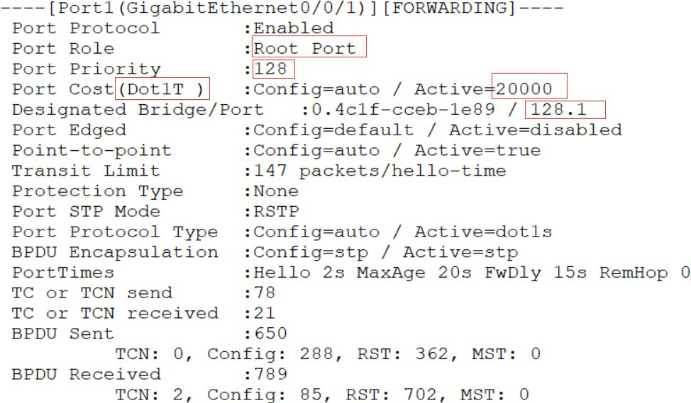

## STP基本配置

### 1、STP 模式配置

stp mode { mstp | stp | rstp }命令用来配置交换机的生成树协议模式。缺省情况下， 华为X7系列交换机工作在MSTP模式。 在使用STP前，STP模式必须重新配置。



```java

	mstp	multiple spanning tree protocol （mastp）mode  
	//   翻译：多生成树协议(mastp)模式
	rstp	Rapid Spanning Tree protocol (RSTP) mode
	//	翻译： 快速生成树协议(rstp)模式
	stp		Spanning Tree Protocol （STP） mode
	//	翻译：	生成树协议(STP)模式
	
```

### 2、配置交换机优先级：

通过配置优先级，可以确定根网桥位置。

```

stp priority priority命令用来配置设备优先级值。 priority值为整数， 取值范围为0到61440， 步长为4096。 缺省情况下， 交换设备的优先级取值是32768。stp root primary 配置交换机为根网桥，优先级会自动到0

stp root secondary 命令配置交换机为备份根网桥，优先级自动到4096

```

### 3、配置路径开销

​	华为X7系列交换机支持三种路径开销标准， 以确保和友商设备保持兼容。缺省情况下， 路径开销标准为IEEE 802.1t。

```
stp pathcost-standard { dot1d-1998 | dot1t | legacy }命令用来配置指定交换机上路径开销值的标准。
```

​	每个端口的路径开销也可以手动指定。 此STP路径开销控制方法须谨慎使用， 手动指定端口的路径开销可能会生成次优生成树拓扑。

​	stp cost cost命令取决于路径开销计算方法：

​		1）使用华为的私有计算方法时，   cost取值范围是1～200000。

​		2）使用IEEE  802.1d标准方法时，  cost取值范围是1～65535。

​		3）使用IEEE 802.1t标准方法时， cost取值范围是1～200000000。

### 4、验证配置

​	display stp命令用来检查当前交换机的STP配置。 命令输出中信息介绍如下：

+ CIST Bridge参数标识指定交换机当前桥ID， 包含交换机的优先级和MAC地址。
+ Config Times参数标识Hello定时器、 Max Age定时器的值、Forward Delay定时器。
+ CIST Root/ERPC参数标识根桥ID、MAC地址以及此交换机到根桥的根路径开销。



​	

​	display stp命令显示交换机上所有端口信息； display stp interface interface命令显示交换机上指定端口信息。 其他一些信息还包括端口角色、 端口状态、 以及使用的保护机制等。	



