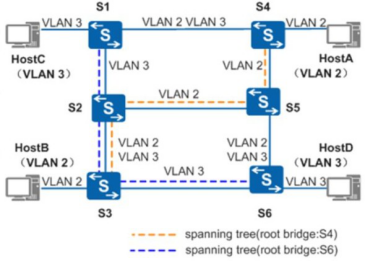

# MSTP配置

RSTP和STP还存在同一个缺陷：由于局域网内所有的VLAN共享一棵生成树，因此无法在VLAN间实现数据流量的负载均衡，链路被阻塞后将不承载任何流量，还有可能造成部分VLAN的报文无法转发。

MSTP兼容STP和RSTP，既可以快速收敛，又提供了数据转发的多个冗余路径，在数据转发过程中实现VLAN数据的负载均衡。

MSTP  把一个交换网络划分成多个域，每个域内形成多棵生成树，生成树之间彼此独立。每棵生成树叫做一个多生成树实例MSTI（Multiple Spanning Tree Instance），每个域叫做一个MST域（MST Region：Multiple Spanning Tree Region）。

所谓生成树实例就是多个VLAN的一个集合。通过将多个VLAN捆绑到一个实例，可以 节省通信开销和资源占用率。MSTP各个实例拓扑的计算相互独立，在这些实例上可以实现负载均衡。可以把多个相同拓扑结构的VLAN映射到一个实例里，这些VLAN在端口上的转 发状态取决于端口在对应MSTP实例的状态。

如图所示：



经计算，最终生成两棵生成树：

MSTI1以S4为根交换设备，转发VLAN2的报文。

MSTI2以S6为根交换设备，转发VLAN3的报文。

这样所有VLAN内部可以互通，同时不同VLAN的报文沿不同的路径转发，实现了负载分担。 

同一个MST域的设备具有下列特点：

1. 都启动了MSTP。

2. 具有相同的域名。

3. 具有相同的VLAN到生成树实例映射配置。

4. 具有相同的MSTP修订级别配置

 

具体配置命令：

1、配置工作协议是MSTP,华为设备默认就是

```
stp mode mstp
```

2、创建实例：（系统模式下）

```
stp region-configuration
```

1. 配置统一的域名revision-level 1	配置一致的修订级别

    ```
    region-name test
    ```

 2. 配置实例1并将VLAN1-50与其映射

    ```
    instance 1 vlan 1  to 50	
    ```

	3. 配置实例2 并将VLAN51-100与其映射并提交配置

    ```
    active region-configuration
    instance 2 vlan 51 to 100
    ```

3、配置根网桥和备份根网桥

```
stp instance 1 root primary stp instance 2 root secondary
```

 

 