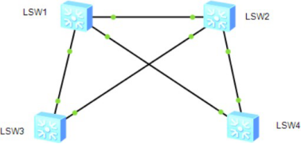

课后练习题：

实验拓扑：

 

实验需求：

1、配置生成树使用MSTP协议   

 2、创建vlan1--vlan10 10个VLAN

3、查看目前网络中哪些端口是被阻塞端口

4、创建shengzhe MSTP域，并创建实例1和实例2，将VLAN1-5映射到实例1，将VLAN6-10映射到实例2

5、配置LSW1为实例1根网桥，LSW2为实例1的备份根网桥

6、配置LSW2为实例2根网桥，LSW1为实例2的备份根网桥

7、通过查看，指出哪些端口是被阻塞端口

提交：所有交换机关键配置命令及2次阻塞端口查看结果

