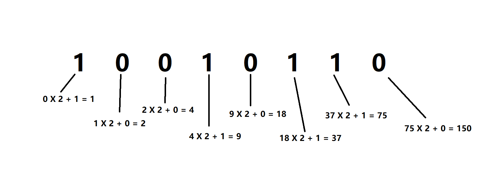
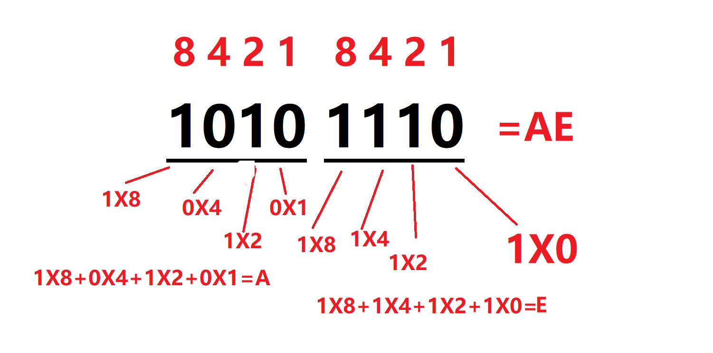

# 进制转换方法

网络中的数据可以采用**二进制**、**十进制**、或**十六进制**来表示，了解这些进制对理解IP网络基础知识很有必要。每种进制使用不同的基值表示每一位的数值。二进制每一位只有0和 1两个值，基值为2，二进制数的每一位都可以用2的x次幂来表示，x表示二进制数的位数。十六进制的每一位可以有16个数值，范围为0-F（即0-9和A-F），A对应十进制的10，F对应十进制的15（二进制的1111）。

在数字后面加上不同的字母来表示不同的进位制。B（Binary)表示二进制，O（Octal）表示八进制，D（Decimal）或不加表示十进制，H（Hexadecimal）表示十六进制。例如：(101011)B=(43)D=(2B)H

进制的转换方法：

## **二进制 → 十进制**

### 方法一

​	二进制数从低位到高位（即从右往左）计算

例：将二进制的(10010110)B转换为十进制的步骤如下：

1. 第0位 1 x 2^0 = 0；

2. 第1位 1 x 2^1 = 2；

3. 第2位 1 x 2^2 = 4；

4. 第3位 0 x 2^3 = 0；

5. 第4位 1 x 2^4 = 16；

6. 第5位 0 x 2^5 = 0；
7. 第6位  0 x 2^6 = 0；
8. 第7位  1 x 2^7= 128；

7. 读数，把结果值相加，0+2+4+0+16+0+0+128=150，即(10010110)B=(150)D。

   

****

### 方法二

从左到右开始，（0 X 2 + 第一位）X 2 + 第二位。。。加至最后一位

例：将二进制的(10010110)B转换为十进制的步骤如下图

最后得数为150

## **十进制→ 二进制**

​	例：将十进制的(43)D转换为二进制的步骤如下（如下图所示）：

1. 将商43除以2，商21余数为1；

2. 将商21除以2，商10余数为1；

3. 将商10除以2，商5余数为0；

4. 将商5除以2，商2余数为1；

5. 将商2除以2，商1余数为0； 

6. 将商1除以2，商0余数为1； 

7. 读数，因为最后一位是经过多次除以2才得到的，因此它是最高位，读数字从最后的余数向前读，101011，即(43)D=(101011)B。

   

## **十进制 → 十六进制**

大致方法与十进制转二进制方法相同

例：将十进制的(796)D转换为十六进制的步骤如下（如下图）：：

1. 将商796除以16，商49余数为12；

2. 将商49除以16，商3余数为1；

3. 将商3除以16，商0余数为3；

7. 读数，因为最后一位是经过多次除以16才得到的，因此它是最高位，读数字从最后的余数向前读，3  1  C，即(796)D=(31C)H

## **二进制 → 十六进制**

方法1、二进制转换成十六进制：从右边开始4位分组法（如下图）

注:进制表如下图

