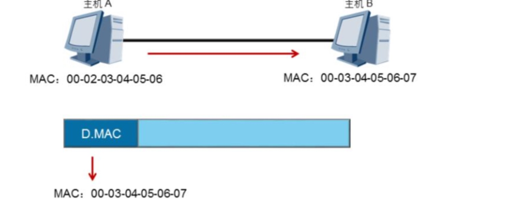
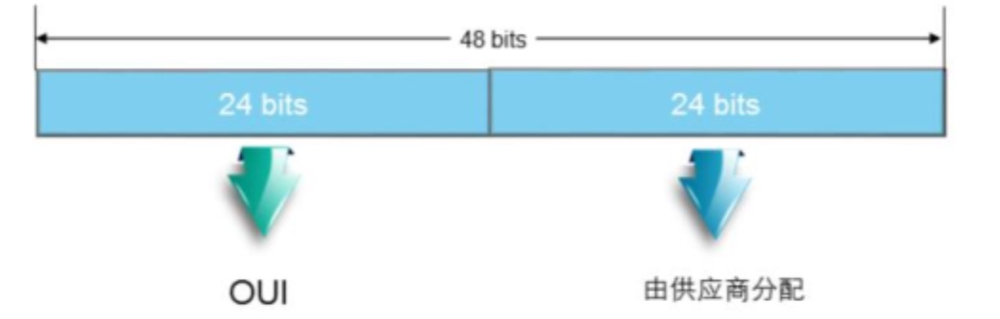
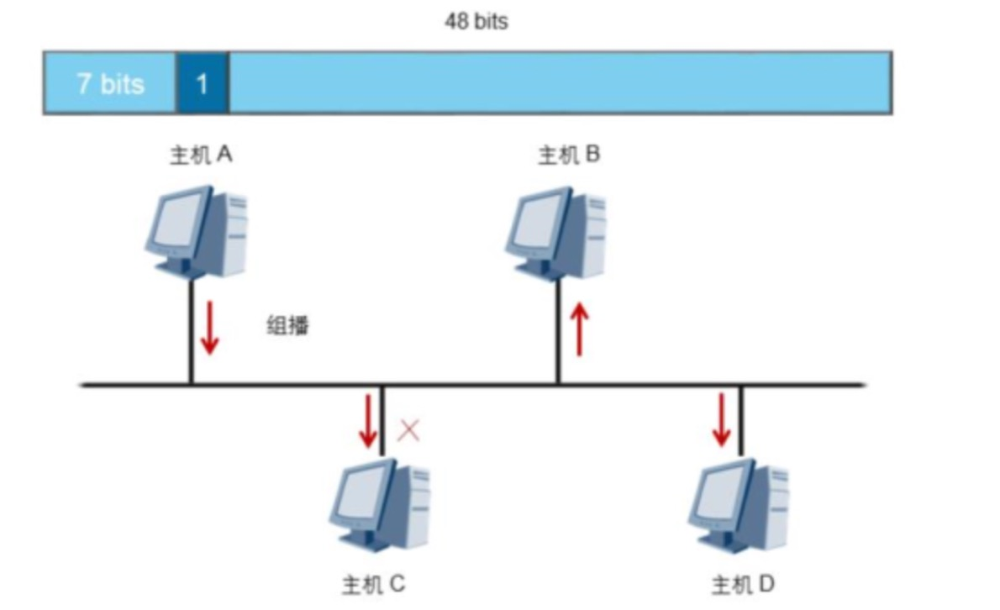
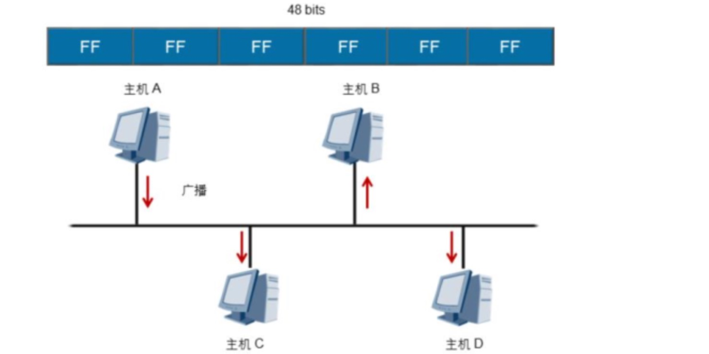

# MAC地址

## 什么是MAC地址

数据链路层基于MAC地址进行帧的传输:

​		以太网卡的物理地址就是MAC地址。大多数网卡厂商把MAC地址烧入了网卡的***ROM***中。

​		**ROM**：ROM是[只读存储器](https://baike.baidu.com/item/只读存储器/2399075)（Read-Only Memory）的简称，是一种只能读出事先所存数据的固态[半导体存储器](https://baike.baidu.com/item/半导体存储器/7674279)。

​	如同每一个人都有一个名字一样，每一台网络设备都用物理地址来标识自己，这个地址就是MAC地址。网络设备的MAC地址是全球唯一的。MAC地址长度为48比特，通常用十六进制表示。MAC地址包含两部分:前 24 比 特 是 组 织 唯 一 标 识 符 ( OUI ，Organizationally Unique Identifier)，由IEEE统一分配给设备制造商。例如，华为的网络产品MAC地址前24比特是0x00e0fc。后24位序列号是厂商分配给每个产品的唯一数值，由各个厂商自行分配(这里所说的产品可以是网卡或者其他需要MAC地址的设备)。

**1字节=8比特**

## 单播MAC地址

**单播MAC地址:MAC地址的高8位为0**

​		局域网上的帧可以通过三种方式发送。第一种是单播，指从**单一的源端发送到单一的目的端**。每个主机接口由一个MAC地址唯一标识，MAC 地址的OUI中，第一字节第8个比特表示地址类型。对于主机MAC地址，这个比特固定为0，表示目的MAC地址为此MAC地址的帧都是发送到某个唯一的目的端。在冲突域中，所有主机都能收到源主机发送的单播帧，但是其他主机发现目的地址与本地MAC地址不一致后会丢弃收到的帧，只有真正的目的主机才会接收并处理收到的帧。

## 组播MAC地址

**组播MAC地址:MAC地址的高8位为1**

第二种发送方式为组播，组播比单播更加高效。组播转发可以理解为选择性的广播，主机监听特定组播地址，接收并处理目的MAC地址为该组播MAC地址的帧。组播MAC地址和单播MAC地址是通过第一字节中的第8个比特区分的。组播MAC地址的第8个比特为1，而单播MAC地址的第8个比特为0。当需要网络上的一组主机(而不是全部主机)接收相同信息，并且其他主机不受影响的情况下通常会使用组播方式。

## 广播MAC地址

**广播MAC地址:48位全是1**

第二种发送方式是广播，表示帧从单一的源发送到**共享以太网上的所有主机**。广播帧的 目的MAC地址为十六进制的FF:FF:FF:FF:FF:FF，所有收到该广播帧的主机都要接收并处理这个帧。广播方式会产生大量流量，导致带宽利用率降低，进而影响整个网络的性能。当需要 网络中的所有主机都能接收到相同的信息并进行处理的情况下， 通常会使用广播方式。 