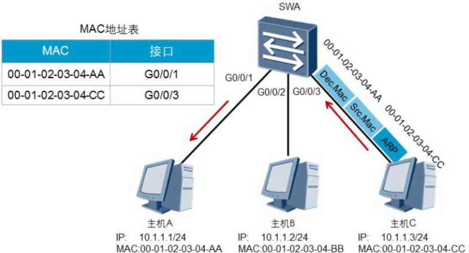

## 交换机基本原理

### 交换机概述

​	交换机基本原理常见的以太网设备包括hub（多端口转发器）、交换机等。交换机工作在数据链路层，它有效的隔离了以太网中的冲突域，极大地提升了以太网的性能。

​	随着企业网络的发展，越来越多的用户需要接入到网络，交换机提供的大量的接入端口能够很好地满足这种需求。同时，交换机也彻底解决了困扰早期以太网的冲突问题，极大地提升了以太网的性能，同时也提高了以太网的安全性。

​	交换机工作在数据链路层，对数据帧进行操作。在收到数据帧后，交换机会根据数据帧的头部信息对数据帧进行转发。接下来我们以小型交换网络为例，讲解交换机的基本工作原理。

### 交换机的转发操作行为

​	交换机中有一个MAC地址表，里面存放了MAC地址与交换机端口的映射关系。MAC 地址表也称为CAM（Content Addressable Memory）表。如图所示，交换机对帧的转发操作行为一共有三种：泛洪（Flooding），转发（Forwarding），丢弃（Discarding）。

1. 泛洪：交换机把从某一端口进来的帧通过所有其它的端口转发出去
2. 转发：交换机把从某一端口进来的帧通过另一个端口转发出去
3. 丢弃：交换机把从某一端口进来的帧直接丢弃。

### 交换机的基本工作原理

交换机的基本工作原理可以概括地描述如下：

1. 如果进入交换机的是一个单播帧，则交换机会去MAC地址表中查找这个帧的目的MAC地址。
   + 如果查不到这个MAC地址，则交换机执行泛洪操作。
   + 如果查到了这个MAC地址，则比较这个MAC地址在MAC地址表中对应的端口 是不是这个帧进入交换机的那个端口。如果不是，则交换机执行转发操作。如果是，则交换机执行丢弃操作。

2. 如果进入交换机的是一个广播帧，则交换机不会去查MAC地址表， 而是直接执行泛洪操作。
3. 如果进入交换机的是一个组播帧，则交换机的处理行为比较复杂， 则会组里的所有端口都会收到它。另外，交换机还具有学习能力。当一个帧进入交换机后，交换机会检查这个帧的源MAC地址，并将该源MAC地址与这个帧进入交换机的那个端口进 行映射，然后将这个映射关系存放进MAC地址表。

### 交换机工作流程

​	初始状态下，交换机并不知道所连接主机的MAC地址，所以MAC地址表为空。本例中，SWA为初始状态，在收到主机A发送的数据帧之前，MAC地址表中没有任何表项。

​	主机A发送数据给主机C时，一般会首先发送ARP请求来获取主机C的MAC地址，此ARP请求帧中的目的MAC地址是广播地址，源MAC地址是自己的MAC地址。

​	SWA收到该帧后，会将源MAC地址和接收端口的映射关系添加到MAC地址表中。缺省情况下，X7系列交换机学习到的MAC地址表项的老化时间为300秒。

​	如果在老化时间内再次收到主机A发送的数据帧，SWA中保存的主机A的MAC地址和G0/0/1的映射的老化时间会被刷新。

​	此后，如果交换机收到目标MAC地址为00-01-02-03-04-AA的数据帧时，都将通过G0/0/1 端口转发。

​	本例中主机A发送的数据帧的目的MAC地址为广播地址，所以交换机会将此数据帧通过G0/0/2和G0/0/3端口广播到主机B和主机C。

​	主机B和主机C接收到此数据帧后，都会查看该ARP数据帧。但是主机B 不会回复该帧，主机C会处理该帧并发送ARP回应，此回复数据帧的目的MAC地址为主机A的MAC地址，源MAC地址为主机C的MAC地址。	当SWA收到回复数据帧时，会将该帧的源MAC地址和接口的映射关系添加到MAC地址表中。如果此映射关系在MAC地址表已经存在，则会被刷新。然后SWA查询MAC地址表，根据帧的目的MAC地址找到对应的转发端口后，从G0/0/1 转发此数据帧。

​	交换机是工作在数据链路层得设备，对于通信终端来说，属于透明不可见，通信双方是感觉不到交换机的存在的；

​	交换机的接口工作在混杂模式（promiscuous mode），当收到一个数据帧的时候，如果数据帧的目的MAC地址不是自己接口的MAC地址，也要做处理决定，所以，这和网卡接口是不一样的。

