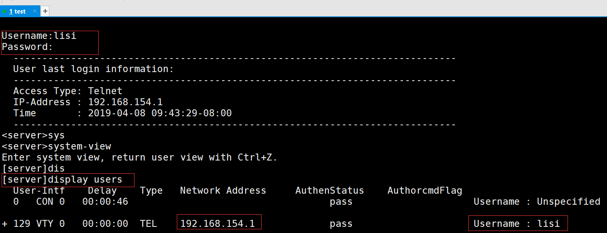

## 远程管理设备

​	设备一般会放在数据中心或者机房，如果都是通过console接口来配置，很不方便，所以，在生产环境中，设备一般都是远程管理，可以是命令行，也可以是web图形界面。如果是使用命令行来管理设备，使用的telnet或者SSH协议，如果使用web图形界面，使用的http或者https协议。为了安全，一般都是使用SSH或HTTPS这些加密的协议。

### Telnet连接

​	Telnet提供了一个交互式操作界面，允许终端远程登录到任何可以充当Telnet服务器的设备。Telnet用户可以像通过Console口本地登录一样对设备进行操作。远端Telnet服务器和终端之间无需直连，只需保证两者之间可以互相通信即可。通过使用Telnet，用户可以方便的实现对设备进行远程管理和维护。

​	Telnet以客户端/服务器模式运行。Telnet基于TCP协议，服务器端口号默认是23，服务器通过该端口与客户端建立Telnet连接。


### Telnet认证

​	在配置Telnet登录用户界面时，必须配置认证方式，否则用户无法成功登录设备。Telnet认证有两种模式：AAA模式，密码模式。

1. 当配置用户界面的认证方式为AAA时，用户登录设备时需要首先输入登录用户名和密码才能登录。

2. 当配置用户界面的认证方式为password时，用户登录设备时需要首先输入登录密码才能登录。

   

   

   AAA是认证（Authentication）、授权（Authorization）和计费（Accounting）的简称，是网络安全中进行访问控制的一种安全管理机制，提供认证、授权和计费三种安全服务。

   

### 虚拟终端类型

​	VTY（Virtual Type Terminal 虚拟终端类型）是网络设备用来管理和监控通过Telnet方式登录的用户的界面。网络设备为每个Telnet用户分配一个VTY界面。缺省情况下，ARG3系列路由器支 持的Telnet用户最大数目为5个，VTY0 4的含义是VTY0，VTY1，VTY2，VTY3，VTY4。如果需要增加Telnet用户的登录数量，可以使用user-interface maximum-vty命令来调整VTY界面的数量。

### 实操：配置验证方式

实验拓扑：

​	

#### 配置密码验证方式登录：

##### 	1、服务器配置：

```shell
[server]user-interface vty 0 4
[server-ui-vty0-4]authentication-mode password
Please configure the login password (maximum length 16):huawei123 
[server-ui-vty0-4]user privilege level 15	（默认为0级别）
```

##### 2、客户端配置

###### 	打 开 计 算 机 cmd 命 令 行 ：

```shell
C:\Users\liqingru>telnet 192.168.154.1
```


​	

###### 		也可以使用Xshell


#### 配置AAA验证方式登录：

##### 首先配置登录方式:

```shell
[server]user-interface vty 0 4
[server-ui-vty0-4]authentication-mode aaa
```

##### 然后配置AAA，添加用户并授权

```shell
[server]aaa
[server-aaa]local-user lisi password cipher huawei123 Info: Add a new user.
[server-aaa]local-user lisi service-type telnet 
[server-aaa]local-user lisi privilege  level  15
```

##### 客户端使用Xshell登录：



### 	使用加密的SSH协议登录

​	因为telnet是明文传输，所以不安全，不建议在公共网络中使用，我们可以选择加密的

SSH协议。SSH协议使用TCP的22号端口。

#### 配置AAA验证方式的SSH登录：

###### 	首先配置登录方式及进入协议：

```shell
[server]user-interface vty 0 4
[server-ui-vty0-4]authentication-mode aaa 
[server-ui-vty0-4]protocol inbound ssh
```

###### 	然后配置AAA，添加用户并授权

```shell
[server]aaa
[server-aaa]local-user zhangsan password cipher huawei123
[server-aaa]local-user zhangsan service-type ssh
[server-aaa]local-user zhangsan privilege level 15 
```

###### 开 启 SSH 服 务 并 设 置 SSH 用 户 及 验 证 方 式 ：

```shell
[server]stelnet server enable
Info: Succeeded in starting the STELNET server. 
[server]ssh user zhangsan authentication-type password 
```

###### 客户端登录：使用Xshell登录


