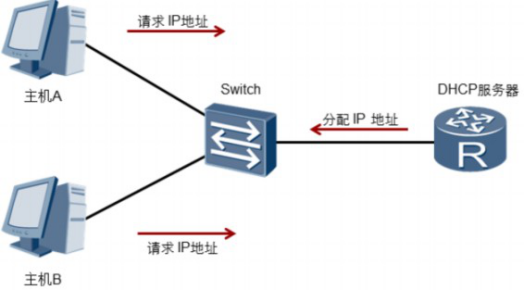
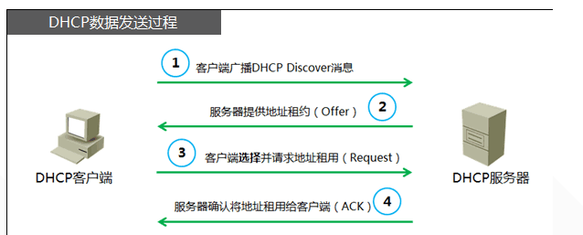
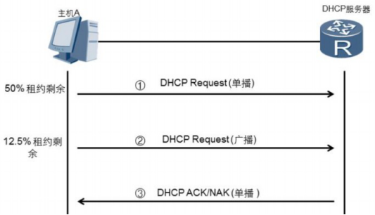
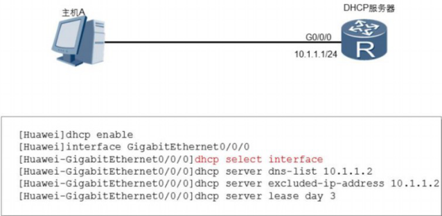
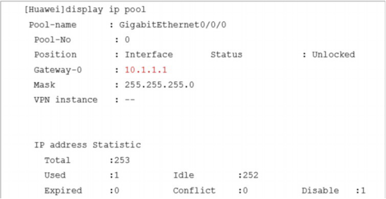
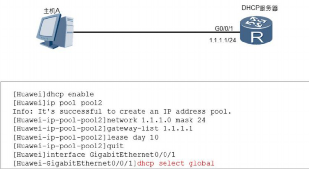

# 配置DHCP

在大型企业网络中，一般会有大量的主机等终端设备。每个终端都需要配置IP地址等网络参数才能接入网络。在小型网络中，终端数量很少，可以手动配置IP地址。但是在大中型网络中，终端数量很多，手动配置IP地址工作量大，而且配置时容易导致IP地址冲突等错误。DHCP（Dynamic Host Configuration Protocol [daɪˈnæmɪk həʊst kənˌfɪɡəˈreɪʃn ˈprəʊtəkɒl] **动态主机设置协议**）可以为网络终端动态分配IP地址， 解决了手工配置IP地址时的各种问题。

 

## DHCP工作过程

1. DHCP客户端初次接入网络时，会发送DHCP发现报文（DHCP Discover [dɪˈskʌvə(r)]），用于查找和定位DHCP服务器。

2. DHCP服务器在收到DHCP发现报文后，发送DHCP提供报文（DHCP Offer [ˈɒfə(r)]），此报文中包含IP地址等配置信息。

3. 在DHCP客户端收到服务器发送的DHCP提供报文后，会发送DHCP请求报文（DHCP Request [rɪˈkwest] ），另外DHCP客户端获取IP地址并重启后，同样也会发送DHCP请求报文，用于确认分配的IP地址等配置信息。DHCP客户端获取的IP地址租期快要到期时，也发送DHCP请求报文向服务器申请延长IP地址租期。

4. 收到DHCP客户端发送的DHCP请求报文后，DHCP服务器会回复DHCP确认报文(DHCP ACK(确认)）。客户端收到DHCP确认报文后，会将获取的IP地址等信息进行配置和使用。

5. 如果DHCP服务器收到DHCP-REQUEST报文后，没有找到相应的租约记录，则发送DHCP-NAK（拒绝响应报文）报文作为应答，告知DHCP客户端无法分配合适IP地址。

6. DHCP客户端通过发送DHCP释放报文（DHCP Release [rɪˈliːs]（释放））来释放IP地址。收到DHCP释放报文后，DHCP服务器可以把该IP地址分配给其他DHCP客户端。

 

申请到IP地址后，DHCP客户端中会保存三个定时器，分别用来控制租期更新，租期重绑定和租期失效。DHCP服务器为DHCP客户端分配IP地址时会指定三个定时器的值。如果DHCP服务器没有指定定时器的值，DHCP客户端会使用缺省值，缺省租期为1天。默认情 况下，还剩下50%的租期时，DHCP客户端开始租约更新过程，DHCP客户端向分配IP地址的服务器发送DHCP请求报文来申请延长IP地址的租期。DHCP服务器向客户端发送DHCP 确认报文，给予DHCP客户端一个新的租期。

DHCP客户端发送DHCP请求报文续租时，如果DHCP客户端没有收到DHCP服务器的DHCP应答报文。默认情况下，重绑定定时器在租期剩余12.5%的时候超时，超时后， DHCP客户端会认为原DHCP服务器不可用，开始重新发送DHCP请求报文。网络上任何一台DHCP服务器都可以应答DHCP确认或DHCP非确认报文。如果收到DHCP确认报文，DHCP客户端重新进入绑定状态，复位租期更新定时器和重绑定定时器。如果收到DHCP非确认报文，DHCP客户端进入初始化状态。此时，DHCP客户端必须立刻停止使用现有IP地址，重新申请IP地址。

  

租期定时器是地址失效进程中的最后一个定时器，超时时间为IP地址的租期时间。如果DHCP客户端在租期失效定时器超时前没有收到服务器的任何回应，DHCP客户端必须立刻停止使用现有IP地址，发送DHCP Release报文，并进入初始化状态。然后，DHCP客户端重新发送DHCP发现报文，申请IP地址。

ARG3系列路由器和X7系列交换机都可以作为DHCP服务器，为主机等设备分配IP地址。DHCP服务器的地址池是用来定义分配给主机的IP地址范围，有两种形式。

1. 接口地址池为连接到同一网段的主机或终端分配IP地址。可以在服务器的接口下执行dhcp select  interface命令，配置DHCP服务器采用接口地址池的DHCP服务器模式为客户端分配IP地址。

2. 全局地址池为所有连接到DHCP服务器的终端分配IP地址。可以在服务器的接口下执行dhcp  select  global命令，配置DHCP服务器采用全局地址池的DHCP服务器模式为客户端分配IP地址。

接口地址池的优先级比全局地址池高。配置了全局地址池后，如果又在接口上配置了地址池，客户端将会从接口地址池中获取IP地址。在X7系列交换机上，只能在VLANIF逻辑接口上配置接口地址池。

 



## 配置DHCP接口地址池

使能DHCP功能。在配置DHCP服务器时，必须先执行dhcp enable 命令，才能配置DHCP的其他功能并生效。

```
dhcp enable
```

关联接口和接口地址池，为连接到接口的主机提供配置信息。在本示例中，接口GigabitEthernet 0/0/0被加入接口地址池中。

```
interface GigabitEthernet 0/0/0
```

使用接口的ip

```
dhcp select interface
```

指定接口地址池下的DNS服务器地址。

```
dhcp  server  dns-list 10.1.1.2
```

配置接口地址池中不参与自动分配的IP地址范围。

```
dhcp server excluded-ip-address 10.1.1.2
```

配置DHCP服务器接口地址池中IP地址的租用有效期限功能。缺省情况下，接口地址池中IP地址的租用有效期限为1天

```
dhcp server lease
```


验证配置信息：使用display ip pool命令


 

 



## 配置DHCP全局地址池 

启用DHCP功能

```
dhcp enable
```


ip pool命令用来创建全局地址池。

```
ip pool <Poolname>
```

network命令用来配置全局地址池下可分配的网段地址。

```
network 1.1.1.0 mask 24
```

gateway-list命令用来配置DHCP服务器全局地址池的出口网关地址。

```
gateway-list 1.1.1.1 
```

lease命令用来配置DHCP全局地址池下的地址租期。缺省情况下，IP地址租期是1天。

```
lease day 10
```

 dhcp select global命令用来使能接口的DHCP服务器功能。

```
dhcp select glbal
```

