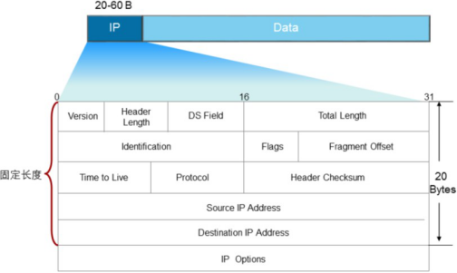
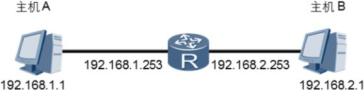

# **IP协议**

**网络层位于数据链路层和传输层之间**。**网络层**中**包含**了**很多协议**，其中**最重要**的协议就是**IP协议**。网络层提供了IP**路由功能**，路由的依据就是收到的IP报头。在剥掉帧的头部和尾部之前，网络设备需要根据帧头中Type字段确定下 一步将帧发送到哪个上层协议进行处理。以太网帧头部Type字段值为0x0800 ,表示该帧的网络层协议为IP协议，该帧数据部分需要上送到IP协议进行处理。以下就是IP报文结构：

## 

## IP报文简介:

**IP报文头部信息用于指导网络设备对报文进行路由和分片**。同一个网段内的数据转发通过链路层即可实现，而跨网段的数据转发需要使用网络设备的路由功能。分片是指数据包超过一定长度时，需要被划分成不同的片段使其能够在网络中传输。

**IP报文头部**长度为**20到60字节**，报文头中的信息可以用来**指导网络设备如何将报文从源设备发送到目的设备**。其中，版本字段表示当前支持的IP协议版本，当前的版本号为4。DS字段早期用来表示业务类型，现在用于支持QoS中的差分服务模型，实现网络流量优化。

## IP封装过程

**源和目的IP地址是分配给主机的逻辑地址**，用于在网络层**标识报文的发送方和接收方**。源主机必须**要知道目的主机的IP地址后**才能将数据发送到目的地。**源主机向其他**目的主机**发送报文之前**，**需要检查目的IP地址和源IP地址是否属于同一个网段**。**如果是**，则报文将被**下发到底层协议进行以太网封装处理**。如果目的地址和源地址属于**不同网段**，则主机需要**获取下一跳路由器的IP地址**，然后将报文下发到底层协议处理。**这个下一跳路由器的IP地址就是主机的网关。**

 

网关是指接收并处理本地网段主机发送的报文并转发到目的网段的设备。为实现此功 能，网关必须知道目的网段的IP地址。网关设备上连接本地网段的接口地址即为该网段的网关地址。

网络中转发的IP报文的长度可以不同，但如果报文长度超过了数据链路所支持的最大长度，则报文就需要分割成若干个较小的片段才能够在链路上传输。将报文分割成多个片段的过程叫做分片。

接收端根据分片报文中的**标识符（Identification）**，**标志（Flags)**，及片 偏移

**（Fragment  Offset）**字段对分片报文进行重组。标识符用于识别属 于同一个数据包的分片，以区别于同一主机或其他主机发送的其它数据 包分片，保证分片被正确的重新组合。标志字段用于判断是否已经收到  最后一个分片。最后一个分片的标志字段设置为0，其他分片的标志字 段设置为1，目的端在收到标志字段为0的分片后，开始重组报文。片偏 移字段表示每个分片在原始报文中的位置。第一个分片的片偏移为0， 第二个分片的片偏移表示紧跟第一个分片后的第一个比特的位置。比如， 如果首片报文包含1259比特，那么第二分片报文的片偏移字段值就应该 为1260。

**报文**在网段间**转发时**，如果网络设备上的路由**规划不合理**，就可能会**出现环路**，导致报文在网络中**无限循环，无法到达目的端**。环路发生后， 所有发往这个目的地的报文都会被循环转发，随着这种报文逐渐增多， **网络将会发生拥塞。为避免环路导致的网络拥塞**，IP 报文头中**包含一个生存时间TTL**（Time To Live）**字段**。报文每经过一台三层设备，**TTL值减1**。初始TTL值由源端设备设置。当报文中的**TTL降为0时，报文会被丢弃**。同时，丢弃报文的设备会根据报文头中的源IP地址向源端发送ICMP错误消息。

目的端的网络层在接收并处理报文以后， 需要决定下一步对报文该做如何处理。 IP报文头中的协议字段标识了将会继续处理报文的协议。 与以太帧头中的Type字段类似， 协议字段也是一个十六进制数。 **该字段可以标识网络层协议**， 如**ICMP**（Internet Control Message Protocol， **因特网控制报文协议**）， 也可以标识上层协议，如**TCP**（ Transmission Control Protocol ， **传 输 控 制 协 议** ， 对 应 值 0x06 ） 、 **UDP** （ User Datagram Protocol，**用户数据包协议**，对应值0x11）。

IP报头是最重要的报头之一，互联网上的路由器都是根据IP报头来进行数据的转发，应该熟悉理解里面的所有字段，为后续的路由原理打下坚实基础。

 

# **课后练习题：**

1、IP报头中的TTL字段是用来做什么用的？

2、IP报头中的protocol字段是用来做什么用的？

3、网络中的IP报文为何要进行分片？为了IP分片与重组，IP报头中使用哪3个字段来实现这些功能？

4、网关的作用是什么？

 