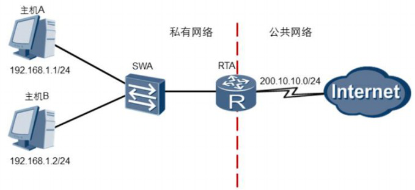
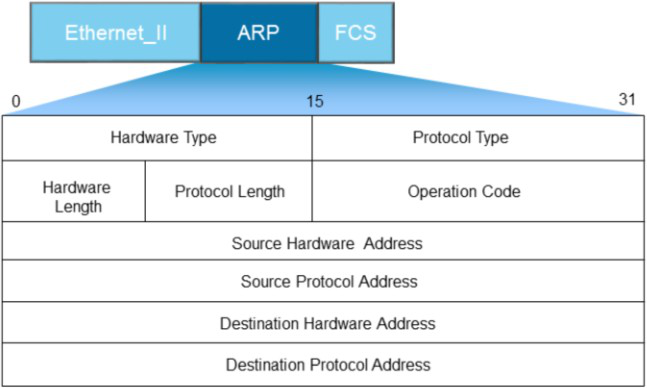
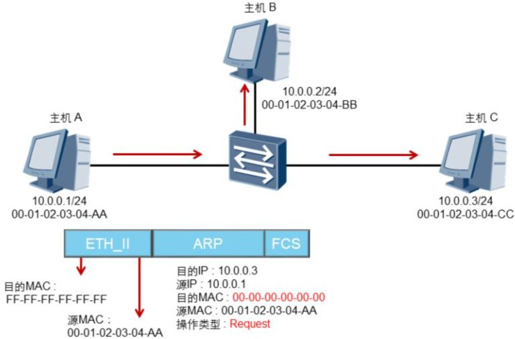
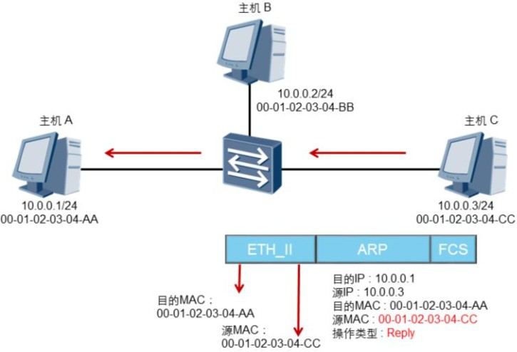
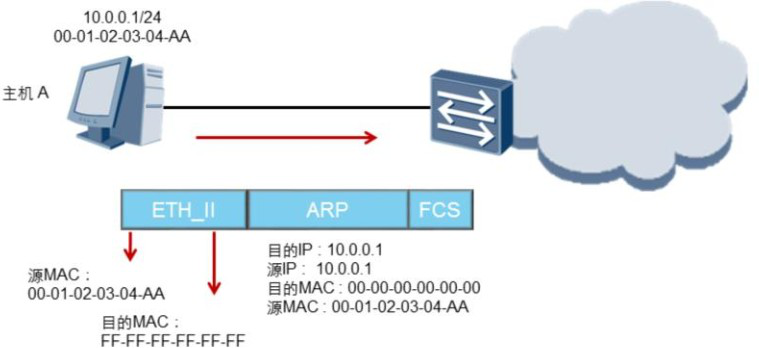

## ARP协议

### 概述

​	一个网络设备要发送数据给另一个网络设备时， 必须要知道对方的IP地址。 但是，仅有IP地址是不够的，因为IP数据报文必须封装成帧才能通过数据链路进行发送，而数据帧必须要包含目的MAC地址，因此发送端还必须获取到目的MAC地址。

​	 每一个网络设备在数据封装前都需要获取下一跳的MAC地址。   IP地址由网络层来提供，   MAC地址通过ARP协议来获取。 ARP协议是TCP/IP协议簇中的重要组成部分， 它能够通过目的IP地址获取目标设备的MAC地址， 从而实现数据链路层的可达性。

​	ARP（Address Resolution Protocol）协议，已知IP地址，来解析MAC地址，所以ARP协议只存在于以太网中，是局域网中一个很重要的协议。

### ARP报文结构

​	ARP报文结构图如下：

​	网络设备通过ARP报文来发现目的MAC地址。 ARP报文中包含以下字段：

1. Hardware Type表示硬件地址类型， 一般为以太网；

2. Protocol Type表示三层协议地址类型， 一般为IP；
3. Hardware Length和Protocol Length为MAC地址和IP地址的长度，单位是字节；

4. Operation Code指定了ARP报文的类型， 包括ARP Request和ARP Reply；

5. Source Hardware Address指的是发送ARP报文的设备MAC地址；

6. Source Protocol Address指的是发送ARP报文的设备IP地址；

7. Destination Hardware Address指的是接收者MAC地址， 在ARPRequest报文中， 该字段值为0；

8. Destination Protocol Address指的是接收者的IP地址。

​	ARP通过一个广播请求（ARP Request）和一个单播回应（ARP Reply）来实现地址解析过程，因为ARP请求包是二层广播帧，所以ARP不能穿越路由器，不能被转发到其它的广播 域。

### ARP请求

​	如果和目的IP是同一网段，请求的就是目的IP所对应的MAC地址；如果和目的IP地址不在同一网段，请求的就是网关的IP所对应的MAC地址。

​	

### ARP响应

​	所有的主机接收到该ARP Request报文后， 都会检查它的目的协议地址字段与自身的IP地址是否匹配。 如果不匹配， 则该主机将不会响应该ARP Request报文。 如果匹配，则该主机会将ARP报文中的源MAC地址和源IP地址信息记录到自己的ARP缓存表中，然后通过    ARP Reply报文进行响应，响应报文是单播帧。

​	

​	主机A收到ARP Reply以后，会检查ARP报文中目的MAC地址是否与自己的MAC匹配。 如果匹配， ARP报文中的源MAC地址和源IP地址会被记录到主机A的ARP缓存表中。

​	其实，主机在发送ARP请求之前，都是要查自己的ARP缓存表的，缓存表中没有记录才会发送ARP请求，缓存表中如果存在记录，就直接封装记录中的MAC地址成帧。

​	缓存表是  有刷新间隔的，一般是300秒。如果主机学习到错误的ARP条目，则主机就会被攻击或欺   骗，因此，局域网中应该防范ARP攻击和欺骗。

### gratuitous ARP

#### 	概述

​	Gratuitous ARP也称为免费ARP，Gratuitous ARP不同于一般的ARP请求，它并非期待得到ip对应的mac地址，而是当主机启动的时候，将发送一个免费ARP请求，即请求自己的ip地址的mac地址。

#### 	作用

1. 起宣告广播的作用，以告诉整个广播域，目前这个IP所对应的MAC地址是什么。
2. 看看广播域内有没有别的主机使用自己的IP，如果使用了，则在界面上弹出“IP冲突”字样。

#### 工作方式

​	主机被分配了IP地址或者IP地址发生变更后，必须立刻检测其所分配的IP地址在网络上是否是唯一的，以避免地址冲突。主机通过发送ARP  Request报文来进行地址冲突检测。主机A将ARP Request广播报文中的目的IP地址字段设置为自己的IP地址，且该网络中所有主机包括网关都会接收到此报文。当目的IP地址已经被某一个主机或网关使用时，该主机或网关就会回应ARP Reply报文。通过这种方式，主机A就能探测到IP地址冲突了。

#### 普通ARP和免费ARP的区别

​	普通ARP请求报文(查找别人的IP地址，比如：我需要10.1.1.2的MAC地址,10.1.1.2是别人的IP)广播发送出去，广播域内所有主机都 接收到，计算机系统判断ARP请求报文中的目的IP地址字段，如果发现和本机的IP地址相同，则将自己的MAC地址填写到该报文的目的MAC地址字段，并 将该报文发回给源主机。所以只要发送普通ARP请求的主机接收到报文，则证明广播域内有别的主机使用自己要访问的这个IP地址（这里不考虑路由器的ARP代理问 题）。

​	免费ARP的报文发（查找自己的IP地址，比如：我需要10.1.1.1的MAC地址，而10.1.1.1就是自己的IP）出去是不希望收到回应的，只希望是起宣告作用；如果收到回应，则证明对方也使用自己目前使用的IP地址。在所有网络设备（包括计 算机网卡）打开的时候，都会发送这样的免费ARP广播，以宣告并确认有没有冲突。