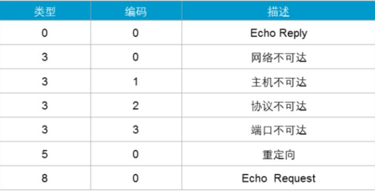

# ICMP协议

Internet控制消息协议ICMP(Internet   Control Message   Protocol)是网络层的一个重要协议。ICMP协议用来在网络设备间传递各种差错和控制消息，并对于收集各种网络信息、诊断和排除各种网络故障等方面起着至关重要的作用。ICMP是TCP/IP协议簇的核心协议之一。

## ICMP数据包格式：

 

 

ICMP消息封装在IP报文中。  ICMP消息的格式取决于Type和Code字段，其中Type字段为消息类型， Code字段包含该消息类型的具体参数。 后面的校验和字段用于检查消息是否完整。 

消息中包含32比特的可变参数，这个字段一般不使用， 通常设置为0。

 在ICMP Redirect(重定向)消息中， 这个字段用来指定网关IP地址， 主机根据这个地址将报文重定向到指定网关。在Echo（回声，应答）请求消息中， 这个字段包含标识符和序号， 源端根据这两个参数将收到的回复消息与本端发送的Echo（回声，应答）请求消息进行关联。 

尤其是当源端向目的端发送了多个Echo（回声，应答）请求消息时， 需要根据标识符和序号将Echo请求和回复消息进行一一对应。

## 常见的ICMP消息类型和编码类型：

 

 

 

 

 

 

一、ping程序：用来测试网络连通性工具                                                                                        ICMP的一个典型应用是Ping。Ping是检测网络连通性的常用工具，同时也能够收集其他相关信息。

用户可以在Ping命令中指定不同参数，如ICMP报文长度、发送的ICMP报文个数、等待回复响应的超时时间等，设备根据配置的参数来构造并发送ICMP报文，进行Ping 测试。

Ping常用的配置参数说明如下：

| window                                                       | 交换机ping命令                                               |
| :----------------------------------------------------------- | ------------------------------------------------------------ |
| -a 将地址解析为计算机名。                                    | -a 设置发送Echo Request报文的源IP地址。如果不指定源IP地址，将采用出接口的IP地址作为Echo Request报文发送的源地址。 |
| -t Ping 指定的计算机直到中断。                               | -i 设置发送Echo Request报文的接口。如果不指定接口，将采用默认的路由出接口 |
| -n count 发送 count 指定的 ECHO 数据包数。默认值为 4。       | -m 设置发送下一个Echo Request报文的等待时间。缺省值是500毫秒。 |
| -l ：发送指定数据量的ECHO数据包。默认为 32 字节；最大值是65500byt。 | -c 设置发送Echo Request报文的次数，缺省值为5。当网络质量不高时，可以增加发送报文数目，通过丢包率来检测网络质量。 |
| -i ：将“生存时间”字段设置为TTL指定的值。指定TTL值在对方的系统里停留的时间。同时检查网络运转情况的。 | -h 设置TTL的值，缺省值为255。报文在转发过程中，如果TTL字段的值减为0，设备就会向源端发送ICMP超时报文，表明目的不可达。 |

二 、 tracert（路由跟踪） 程 序 （ 有 个 也 叫 traceroute） 

 ICMP的另一个典型应用是Tracert。

Tracert基于报文头中的TTL值来逐跳跟踪报文的转发路径。 

为了跟踪到达某特定目的地址的路径， 源端发送一个UDP报文，首先将报文的TTL值设置为1。该报文到达第一个节点后，TTL超时，于是该节点向源端发送TTL超时消息，消息中携带时间戳。然后源端将报文的TTL值设置为2， 报文到达第二个节点后超时， 该节点同样返回TTL超时消息，以此类推，直到报文到达目的地。目标主机会返回一个目标主机不可达的消息。这样，源端根据返回的报文中的信息可以跟踪到报文经过的每一个节点，并根据时间戳信息计算往返时间。Tracert（路由跟踪）是检测网络丢包及时延的有效手段，同时可以帮助管理员发现网络中的路由环路。

| tracert 常用命令                                             |
| ------------------------------------------------------------ |
| -a 指定报文的源地址。如果不指定源地址，将采用出接口的IP地址作为Tracert报文发送的源地址。 |
| -f first-ttl指定初始TTL。 缺省值是1。                        |
| -m max-ttl指定最大TTL。 缺省值是30。                         |
| -name使能显示每一跳的主机名。                                |
| -p port指定目的主机的UDP端口号。                             |

 

