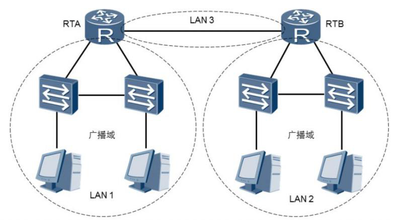
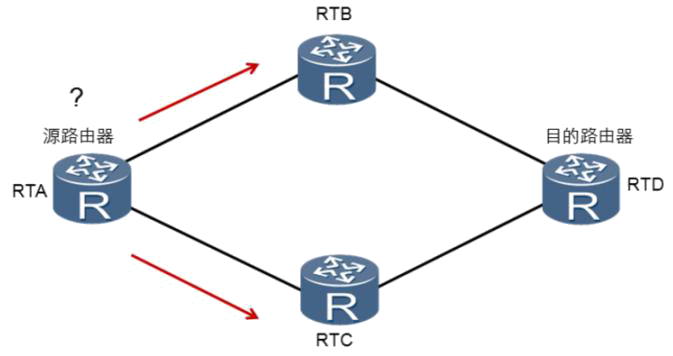
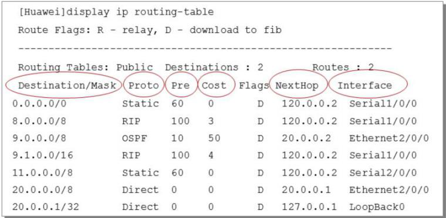
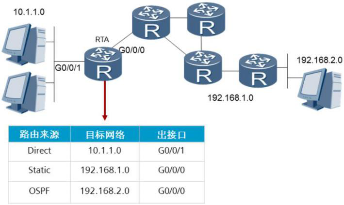

# 路由基本原理

​		以太网交换机工作在数据链路层，用于在网络内进行数据转发。而企业网络的拓扑结构一般都会比较复杂，不同的部门，或者总部和分支可能处在不同的网络中，此时就需要使用路由器来连接不同的网络，实现网络之间的数据转发。

## 自治系统（AS）

​		自治系统（AS）:由同一个管理机构管理、使用统一路由策略的路由器的集合。**一般地我们可以把一个企业网络认为是一个自治系统AS（Autonomous System）**。根据RFC1030的定义，自治系统是由一个单一实体管辖的网络，这个实体可以是一个互联网服务提供商，或一个大型组织机构。自治系统内部遵循一个单一且明确的路由策略。最初，自治系统内部只考虑运行单个路由协议；然而，随着网络的发展，一个自治系统内现在也可以支持同时运行多种路由协议。

​		一个AS通常由多个不同的局域网组成。以企业网络为例，各个部门可以属于不同的局域网，或者各个分支机构和总部也可以属于不同的局域网。局域网内的主机可以通过交换机来实现相互通信。不同局域网之间的主机要想相互通信，可以通过路由器来实现。路由器工作在网络层，隔离了广播域，并可以作为每个局域网的网关，发现到达目的网络的最优路径，最终实现报文在不同网络间的转发。

- **Request For Comments（RFC），是一系列以编号排定的文件。**

- **个自治系统就是处于一个管理机构控制之下的[路由器](https://baike.baidu.com/item/路由器)和网络群组。**

## 路由器

**路由器最根本的作用是选择最优路径和路由IP数据包。**

### 路由器的工作方式

​		路由器收到数据包后，会根据数据包中的目的IP地址选择一条**最优**的路径，并将数据包**转发到下一个路由器**，路径上最后的路由器负责将数据包送交目的主机。数据包在网络上的传输就好像是体育运动中的接力赛一样，每一个路由器负责将数据包按照最优的路径向下一跳路由器进行转发，通过多个路由器一站一站的接力，最终将数据包通过最优路径转发到目的地。当然有时候由于实施了一些特别的路由策略，数据包通过的路径可能并不一定是最佳的。路由器能够决定数据报文的转发路径。如果有多条路径可以到达目的地，则路由器会通过进行计算来决定最佳下一跳。**计算的原则会随实际使用的路由协议不同而不同。**

### 路由表是什么

​		**路由器转发数据包的关键是路由表。**

​		每个路由器中都保存着一张**路由表**，表中每条路由表项都指明了数据包要到达某网络或某主机应通过路由器的哪个**物理接口**发送，以及可到达该路径的哪个下一跳路由器，或者不再经过别的路由器而直接可以到达目的地。

路由表中包含了下列关键项：

- **目的地址（Destination）**：用来标识IP数据包的目的地址或目的网络。

- **网络掩码（Mask）**：在IP编址课程中已经介绍了网络掩码的结构和作用。同样，在路由表中网络掩码也具有重要的意义。IP地址和网络掩码进行“逻辑与”便可得到相应的网段信息。如本例中：目的地址为8.0.0.0，掩码为255.0.0.0，相与后便可得到一个A类的网段信息(8.0.0.0/8)。网络掩码的另一个作用还表现在当路由表中有多条目的地址相同的路由信息时，路由器将选择其掩码最长的一项作为匹配项。

- **输出接口（Interface）**：指明IP数据包将从该路由器的哪个接口转发出去。

- **下一跳IP地址（NextHop）**：指明IP数据包所经由的下一跳路由器的接口地址。路由表中优先级、度量值等其他的几个字段我们将在以后进行介绍。

  

### 路由表的产生

1. **链路层协议发现的路由（也称为接口路由或直连路由）。只要给接口配置了IP地址和掩码，且接口是开启的，就可以产生；**

2. **由网络管理员手工配置的静态路由。**

3. **动态路由协议发现的路由。**

   

   ​		**路由器在路由IP数据的时候有个封装解封装的过程：路由器在接收接口会解封装，然后在出接口会重新封装。**即二层帧在经过路由器的时候是会被重新封装的。路由器在路由数据包的时候做了一个修改二层帧信息的动作，IP数据包经过IP路由网络，逐跳经过封装解封装，最后到达目的地。

   ​		**路由器在做路由查询的时候，是一种尽力而为的传输方式，只要自己的路由表可达，就会路由数据，不需要去关心数据最终是否可达。**