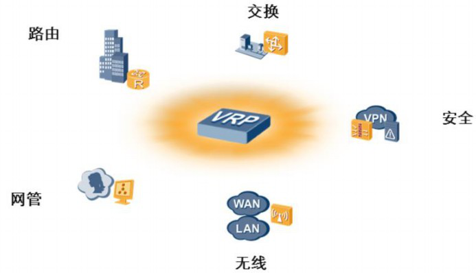
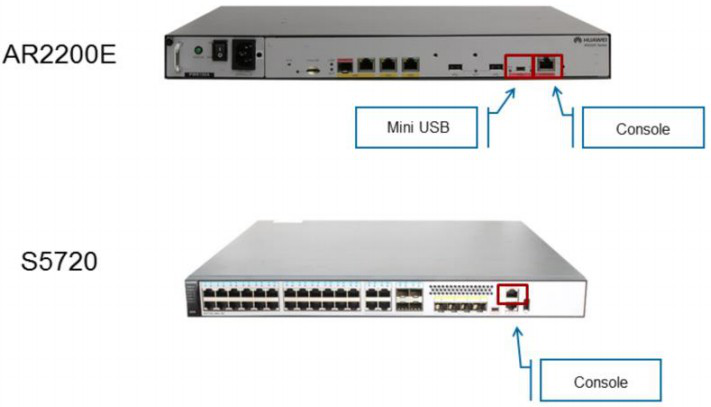
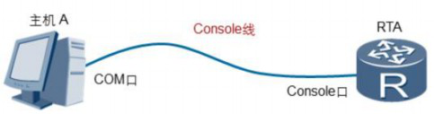
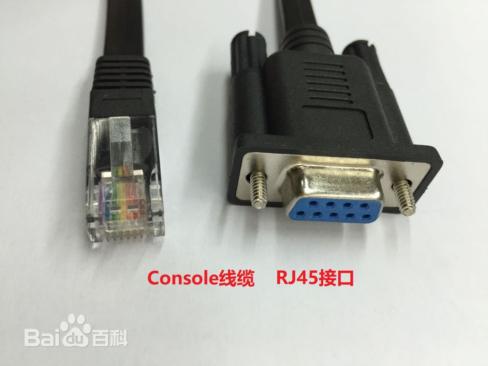
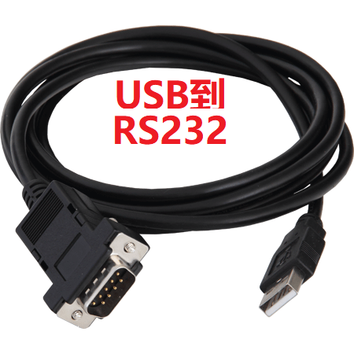
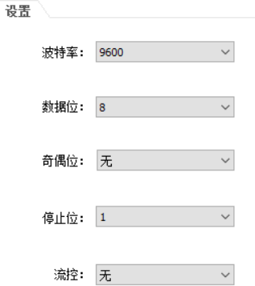
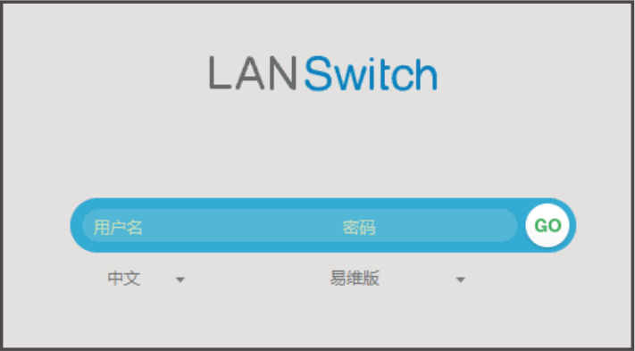

## VRP基础

### VRP概述

​	VRP（Versatile Routing Platform  [`vɜːrsətl ˈraʊtɪŋ ˈplætfɔːrm] 通用路由平台 ）是华为公司具有完全自主知识产权的网络操作系统，是华为公司数据通信产品的通用操作系统平台。

​	VRP平台以TCP/IP协议簇为核心，实现了数据链路层、网络层和应用层的多种协议，在操作系统 中集成了路由交换技术、QoS技术、安全技术和IP语音技术等数据通信功能，并以IP转发引擎技术作为基础，为网络设备提供了出色的数据转发能力。

​	

### 	应用VRP网络操作系统的设备

​	随着网络技术和应用的飞速发展，VRP平台在处理机制、业务能力、产品支持等方面也在持续演进。到目前为止，VRP已经开发出了5个版本，分别是VRP1、VRP2、VRP3、VRP5和VRP8。

​	VRP5是一款分布式网络操作系统，具有高可靠性、高性能、可扩展的架构 设计。目前，绝大多数华为设备使用的都是VRP5版本。VRP8是新一代网络操作系统，具有分布式、多进程、组件化架构，支持分布式应用和虚拟化技术，能够适应未来的硬件发展趋势和企业急剧膨胀的业务需求。

​	AR系列企业路由器有多个型号，包括AR150、AR200、AR1200、AR2200、AR3200。它们是华为第三代路由器产品，提供路由、交换、无线、语音和安全等功能。AR 路由器被部署在企业网络和公网之间，作为两个网络间传输数据的入口和出口。在AR路由 器上部署多种业务能降低企业的网络建设成本和运维成本。根据一个企业的用户数和业务的复杂程度可以选择不同型号的AR路由器来部署到网络中。

​	华为X7系列以太网交换机提供数据交换的功能，满足企业网络上多业务的可靠接入和 高质量传输的需求。这个系列的交换机定位于企业网络的接入层、汇聚层和核心层，提供大容量交换，高密度端口，实现高效的报文转发。X7系列以太网交换机包括了S1700、S2700、S3700、S5700、S7700、S9700等。

### 	设备的使用

​	ARG3系列路由器和X7系列交换机都提供了Console口作为管理口，AR2200额外提供了Mini USB口作为管理口。

​	使用Console线缆来连接交换机或路由器的Console口与计算机的COM口，这样就可   以通过计算机实现本地调试和维护。S5720和AR2200E的Console口是一种符合RS232串口标准的RJ45接口。目前大多数台式电脑提供的COM口都可以与Console口连接。笔记本电 脑一般不提供COM口，需要使用USB到RS232的转换接口。

​	

### 	控制台连接

​	很多终端模拟程序都能发起Console连接，例如，可以使用超级终端程序连接到VRP操作系统，使用超级终端连接VRP时，必须设置端口参数。下图是端口参数设置的示例，如果对参数值做了修改，需要恢复默认参数值。完成设置以后，点击“确定”按钮即可与VRP建立连接。在缺少超级终端程序的计算机上，可以使用putty或Secure CRT程序发起Console 连接，并连接到VRP，配置参数也需要恢复到默认参数。

​	

​	华为AR2200系列路由器还支持通过Mini USB口与主机USB口建立连接，实现对设备的调试和维护。在管理设备时，Console接口和Mini USB接口互斥，即同一时刻只能使用其中的1个接口连接到VRP。

​	在使用Mini USB口建立连接前，需要在主机上安装驱动程序。您可以从华为企业官方支持网站下载到所需驱动程序。目前，Mini USB的驱动程序只能安装在Windows XP、Windows Vista和Windows 7操作系统上。安装驱动程序后，主机上会增加一个新的虚拟COM接口，终端模拟软件可以通过该虚拟COM接口连接到VRP。

### web界面

​	有些设备是带有web管理界面的，可以通过Web网管首次登录设备：

​	1、使用网线将计算机与交换机的任意以太网口相连

​	2、设备上电启动完成后（SYS指示灯绿色慢闪），且空配置状态下，长按“rest”按钮6s以上松开，当交换机所有的模式灯变为绿色常亮时，交换机进入初始设置模式。进入初始设置模式后，系统默认将交换机的IP地址配置为192.168.1.253/24， 同时将默认的admin用户级别配置为15级。

3、将计算机的IP地址配置成与交换机默认的IP地址在同一网段。

​	在计算机上打开浏览器，在地址栏中输入https://192.168.1.253，按回车键后将显示Web[网管登录界面，输入缺省用户名admin和缺省密码admin@huawei.com](mailto:输入缺省用户名admin和缺省密码admin@huawei.com)，并选择Web网管系统的语言。单击“GO”或直接按回车键。

​	

​	当登录设备成功后，可以配置通过Telnet或者STelnet登录设备