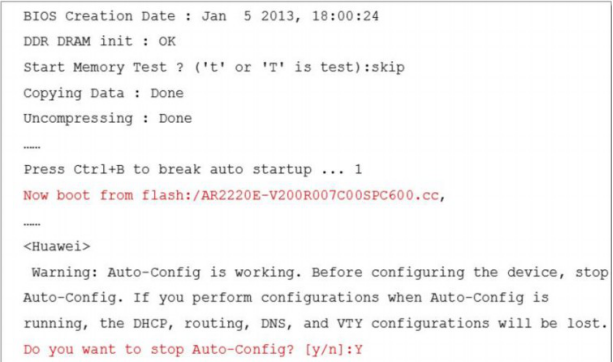
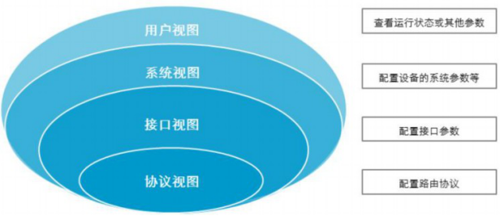
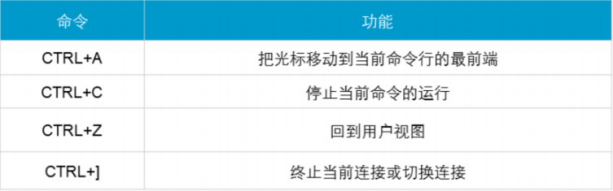
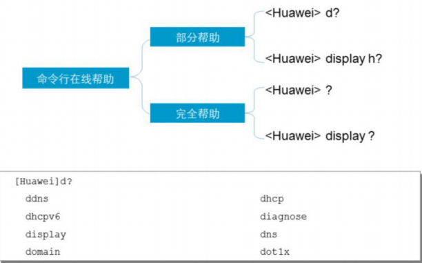

# VRP命令操作视图及帮助

熟悉VRP命令行并且熟练掌握VRP配置是高效管理华为网络设备的必备基础。

管理员和工程师如果要访问在通用路由平台VRP上运行的华为产品，首先要进入启动程序。开机界面信息提供了系统启动的运行程序和正在运行的VRP版本及其加载路径。启动完成以后，系统提示目前正在运行的是自动配置模式。用户可以选择是继续使用自动配置模式或是进入手动配置的模式。如果选择手动配置模式，在提示符处输入Y。在没有特别要求的情况下，我们选择手动配置模式。

 

VRP分层的命令结构定义了很多命令行视图，每条命令只能在特定的视图中执行。本例介绍了常见的命令行视图。每个命令都注册在一个或多个命令视图下，用户只有先进入这个命令所在的视图，才能运行相应的命令。

**用户视图**：

​	VRP上默认出现的视图是用户视图。在该视图下，用户可以查看设备的运行状态和统计信息。

**系统视图**：

​	若要修改系统参数，用户必须进入系统视图。

**其他视图：**

​	用户还可以通过系统视图进入其他的功能配置视图，如**接口视图**和**协议视图**。

通过提示符可以判断当前所处的视图，例如：“< >”表示用户视图，“[]”表示除用户视图以外的其它视图。

 

 

 

 

 

为了简化操作，系统提供了快捷键，使用户能够快速执行操作。

 

若命令字的前几个字母是独一无二的，系统可以在输完该命令的前几个字母后自动将命令补充完整。如用户只需输入inter并按Tab键，系统自动将命令补充为interface。若命令 字并非独一无二的，按Tab键后将显示所有可能的命令。如输入in并按Tab键，系统会按顺序显示以下命令： info-center，interface。

VRP提供两种帮助功能，分别是部分帮助和完全帮助。

部分帮助指的是，当用户输入命令时，如果只记得此命令关键字的开头一个或几个字  符，可以使用命令行的部分帮助获取以该字符串开头的所有关键字的提示，如本例中所示。

完全帮助指的是，在任一命令视图下，用户可以键入“?”获取该命令视图下所有的命令及其简单描述；如果键入一条命令关键字，后接以空格分隔的“?”，如果该位置为关键字，则列出全部关键字及其描述。

 

 

 