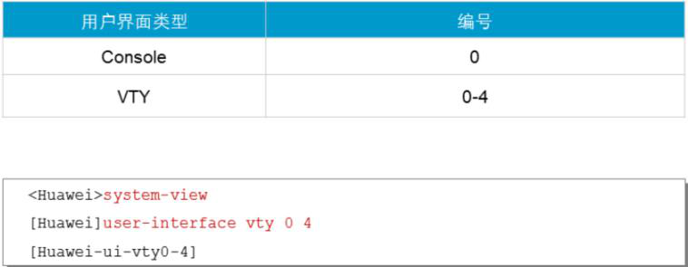

# VRP基本管理命令

## 1、配置设备名称

<!--进入系统视图-->

`<Huawei>system-view`

`Enter system view, return user view with Ctrl+Z.`

<!--修改设备名称为“cisco-caiwu-R1”-->

`[Huawei]sysname cisco-caiwu-R1`

<!--可以看到已经修改成功-->

`[cisco-caiwu-R1]`

## 2、配置时区

<!--clock timezone 名字 添加时区偏移量  时区偏移（HH：MM：SS）-->

`<cisco-caiwu-R1>clock timezone BJ add 08:00:00` 

## 3、配置系统时间

<!--clock datetime 时间 日期-->

`<cisco-caiwu-R1>clock datetime 17:06:00 2019-04-04` 

<!--显示时间-->

`<cisco-caiwu-R1>display clock`

`2019-04-04 17:06:02`

`Thursday`

`Time Zone(BJ) : UTC+08:00`

## 4、配置在用户登录显示的标题信息

<!--header login information 登录前显示的标题信息-->

`[cisco-caiwu-R1]header login information "welcome to shengzhe company"`

<!--header shell information 登陆后显示的标题信息-->

`[cisco-caiwu-R1]header shell information "please don't reboot the device!"`

## 5、访问等级

| 用户等级 |  命令等级   |  名称  |                           可用命令                           |
| :------: | :---------: | :----: | :----------------------------------------------------------: |
|    0     |      0      | 访问级 | 1. 诊断工具命令（ping、tracert） 2. 从本设备出发访问外部设备的命令（Telnet客户端） 3. 部分display命令等 |
|    1     |   0 and 1   | 监控级 |         1. 用于系统维护的命令 2. display等命令          |
|    2     |  0,1 and 2  | 配置级 |        提供直接网络服务，包括路由、各个网络层次的命令        |
|   3-15   | 0,1,2 and 3 | 管理级 | 主要是用于系统运行的命令，对业务提供支撑作用，包括文件系统、FTP、TFTP下载、文件交换配置、电源供应控制，备份板控制、用户管理、命令级别设置、系统 |

- 在具体使用中，如果我们有多个管理员帐号，但只允许某一个管理员保存系统配置，则可以将save命令的级别提高到4级，并定义只有该管理员有4级权限。这样，在不影响其他用户的情况下，可以实现对命令的使用控制。

  

<!--command-privilege level 等级 view user 命令-->

## 6、用户界面视图

- 在连接到设备前，用户要设置用户界面参数。系统支持的用户界面包括Console用户界面和VTY用户界面。控制口（Console Port）是一种通信串行端口，由设备的主控板提供。

- **虚拟类型终端（Virtual Type Terminal）是一种虚拟线路端口，**用户通过终端与设备建立Telnet或SSH连接后，也就建立了一条虚拟VTY（虚拟终端），即用户可以通过VTY（虚拟终端）方式登录设备。设备一般最多支持 15个用户同时通过 VTY（虚拟终端）方式访问。

  <!--userinterface maximum-vty 数量-->

- 执行 `user-interface maximum-vty number` 命令可以配置同时登录到设备的VTY类型用户界面的最大个数。如果将最大登录用户数设为0，则任何用户都不能通过Telnet或者SSH登录到路由器。

  **Telnet**:Telnet协议是[TCP/IP协议](https://baike.baidu.com/item/TCP%2FIP协议)族中的一员，是Internet[远程登](https://baike.baidu.com/item/远程登/2991166)录服务的标准协议和主要方式。

- `display user-interface` 命令用来查看用户界面信息。

**不同的设备，或使用不同版本的VRP软件系统，具体可以被使用的VTY接口的最大数量可能不同。**

<!--0 4 ：0是初始值，4是结束值。表示可同时打开5个会话，-->

## 7、连接超时

用户可以设置Console界面和VTY界面的属性，以提高系统安全性。如果一个连接上设备的用户一直处于**空闲**状态而不断开，可能会给系统带来很大风险，所以在等待一个超时时间后，系统会自动中断连接。这个闲置切断时间又称超时时间，默认为10分钟。

## 8、display显示内容&历史记录

当display命令输出的信息超过一页时，系统会对输出内容进行**分页**，使用**空格键**切换下一页。如果一页输出的信息过少或过多时，用户可以执行**screen-length命令**修改信息输出时一页的行数。**默认行数为24，最大支持512行。**不建议将行数设置为0，因为那样将不会显示任何输出内容了。

每条命令执行过后，执行的记录都保存在历史命令缓存区。用户可以利用(↑)，(↓)，CTRL+P，Ctrl+N这些快捷键调用这些命令。历史命令缓存区中默认能存储**10条命令**，可以通过运行history-command max-size改变可存储的命令数，最多可存储256条。

## 9、认证模式

如果没有权限限制，未授权的用户就可以使用设备获取信息并更改配置。从设备安全的角度考虑，限制用户的访问和操作权限是很有必要的。用户权限和用户认证是提升终端安全的两种方式。用户权限要求规定用户的级别，一定级别的用户只能执行特定级别的命令。

配置用户界面的用户认证方式后，用户登录设备时，需要输入密码进行认证，这样就限制了用户访问设备的权限。在通过VTY进行Telnet连接时，所有接入设备的用户都必须要经过认证。

| 认证模式 |                登录方式                |
| :------: | :------------------------------------: |
|   AAA    |              用户名+密码               |
| 密码认证 | 只需要输入密码，所有用户都是同一个密码 |
|  不认证  |             直接登录到设备             |

**Console界面默认使用不认证模式**

**对于Telnet登录用户，授权是非常必要的，最好设置用户名、密码和指定和帐号相关联的权限。**

## 10、配置接口ip

用`ip address <ip-address > { mask | mask-length }` 命令为接口配置IP地址，这个命令中，mask代表的是32比特的子网掩码，如255.255.255.0，mask-length 代表的是可替换的掩码长度值，如24，这两者可以交换使用。

**一个接口一般只需要一个IP地址。在特殊情况下，也有可能为接口配置一个次要IP地址。**例如，当路由器AR2200E的接口连接到一个物理网络时，该物理网络中的主机属于两个网段。为了让两个网段的主机都可以通过路由器AR2200E访问其它网络，可以配置一个主IP地址和一个次要IP地址。一个接口只能有一个主IP地址，如果接口配置了新的主IP地址，那么新的主IP地址就替代了原来的主IP地址。

**Loopback接口是一个逻辑接口，可用来虚拟一个网络或者一个IP主机。**在运行多种协议的时候，由于Loopback接口稳定可靠，所以也可以用来做管理接口。

在给物理接口配置IP地址时，需要关注该接口的物理状态。默认情况下，华为路由器和交换机的接口状态为up；如果该接口曾被手动关闭，则在配置完IP地址后，应使用**undo shutdown**打开该接口。

- 一般命令的取消都可以用 `undo + 命令`的方法取消

  

下面是一个配置ip 的例子：

<!--选择 g 0/0/0-->

`[cisco-caiwu-R1]interface GigabitEthernet 0/0/0`

 

<!--配置ip-->

`[cisco-caiwu-R1-GigabitEthernet0/0/0]ip address 192.168.1.1 24` 

`[cisco-caiwu-R1-GigabitEthernet0/0/0]ip address 192.168.2.1 24 sub` 

<!--查看这个接口的信息-->

`[cisco-caiwu-R1-GigabitEthernet0/0/0]dis this` 

`[V200R003C00]`

`#`

`interface GigabitEthernet0/0/0`

`ip address 192.168.1.1 255.255.255.0`

`ip address 192.168.2.1 255.255.255.0 sub`

`#`

 `return`

`[cisco-caiwu-R1-GigabitEthernet0/0/0]`