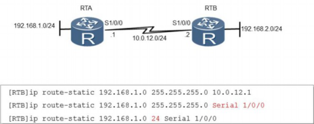
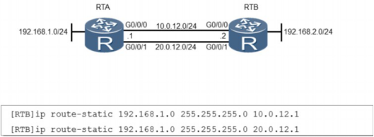
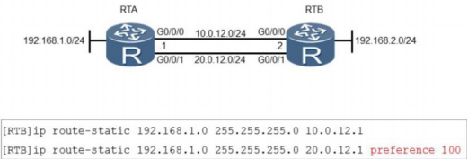
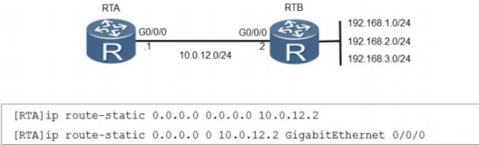

# **配置静态路由**

## 静态路由简介

**静态路由是指由管理员手动配置和维护的路由**。静态路由配置**简单**，并且**无需**像动态路由那样**占用路由器的CPU资源来计算和分析路由更新**。静态路由的**缺点在于，当网络拓扑发生变化时，静态路由不会自动适应拓扑改变，而是需要管理员手动进行调整**。

静态路由一般适用于结构简单的网络。在复杂网络环境中，一般会使用动态路由协议来生成动态路由。不过，**即使是在复杂网络环境中，合理地配置一些静态路由也可以改进网络的性能。**

## 静态路由配置命令：

ip route-static ip-address { mask | mask-length } interface-type interface- number [ nexthop-address ]

参数ipaddress指定了一个网络或者主机的目的地址，

参数mask指定了一个子网掩码或者前缀长度。如果使用了广播接口如以太网接口作为出接口，则必须要指定下一跳地址；如果使用了串口作为出接口，则可以通过参数interface-type和interface-number（如Serial 1/0/0）来配置出接口，此时不必指定下一跳地址。

在配置完静态路由之后，可以使用display ip routing-table命令来验证配置结果。

在**配置多条静态路由时**，可以修改静态路由的优先级，使一条静态路由的优先级高于其他静态路由，从而实现静态路由的备份，也叫浮动静态路由。RTB上配置了两条静态路由。正常情况下，这两条静态路由是等价的。通过配置preference 100，使第二条静态路由的优先级要低于第一条（值越大优先级越低）。路由器只把优先级最高的静

态路由加入到路由表中。当加入到路由表中的静态路由出现故障时，优先级低的静态路由才会加入到路由表并承担数据转发业务。

当路由表中没有与报文的目的地址匹配的表项时，设备可以选择缺省路由作为报文的转发路径。在路由表中，缺省路由的目的网络地址为0.0.0.0，掩码也为0.0.0.0。缺省静态路 由的默认优先级也是60。在路由选择过程中，缺省路由会被最后匹配。缺省路由也称为默 认路由。默认路由一般用于末梢网络中，也就是只有一个出口的网络中。

## 静态路由适用场景

**静态路由**可以应用在**串行网络或以太网中**，但静态路由**在这两种网络中的配置有所不同**。在串行网络中配置**静态路由时**，可以只**指定下一跳地址**或只指定出接口。华为ARG3系列路由器中，串行接口默认封装PPP协议，对于这种类型的接口，静态路由的下一跳地址就是与接口相连的对端接口的地址，**所以在串行网络中配置静态路由时可以只配置出接口**。以太网是广播类型网络，和串行网络情况不同。在以太网中配置静态路由，**必须指定下一跳地址**。

**当源网络和目的网络之间存在多条链路时，可以通过等价路由来实现流量负载分担。这些等价路由具有相同的目的网络和掩码、优先级和度量值。**

# **课后练习题：**

1、在配置静态路由的时候，可以配置下一跳，也可以配置出接口，有什么不同呢？

2、如何配置浮动路由，来实现路由备份？

3、配置默认路由时，目的网络地址是多少？掩码是多少？为何默认路由最后被匹配？

 