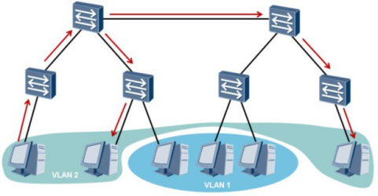
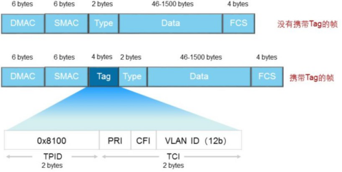

# VLAN原理

## 1、早期的局域网LAN存在的问题

早期的局域网LAN技术是基于总线型结构的， 它存在以下主要问题：

1. 若某时刻有多个节点同时试图发送消息， 那么它们将产生冲突。

2. 从任意节点发出的消息都会被发送到其他节点，  形成广播。

3. 所有主机共享一条传输通道，  无法控制网络中的信息安全。

这种网络构成了一个冲突域， 网络中计算机数量越多， 冲突越严重， 网络效率越低。同时， 该网络也是一个广播域， 当网络中发送信息的计算机数量变多时， 广播流量将会耗费大量带宽。因此， 传统局域网不仅面临冲突域太大和广播域太大两大难题， 而且无法保障传输信息的安全。

## 2、VLAN虚拟局域网的形成

为了扩展传统LAN， 以接入更多计算机， 同时避免冲突的恶化， 出现了网桥和二层交换机， 它们能有效隔离冲突域。 网桥和交换机采用交换方式将来自入端口的信息转发到出端口上， 克服了共享网络中的冲突问题。但是， 采用交换机进行组网时， 广播域和信息安全问题依旧存在。为限制广播域的范围， 减少广播流量， 需要在没有二层互访需求的主机之间进行隔离。 路由器是基于三层IP地址信息来选择路由和转发数据的，其连接两个网段时可以有效抑制广播报文的转发， 但成本较高。 因此，人们设想在物理局域网上构建多个逻辑局域网， 即VLAN。

VLAN技术可以将一个物理局域网在逻辑上划分成多个广播域， 也就是多个VLAN。

VLAN技术部署在数据链路层， 用于隔离二层流量。 同一个VLAN内的主机共享同一个广播域， 它们之间可以直接进行二层通信。而VLAN间的主机属于不同的广播域， 不能直接实现二层互通。 这样，广播报文就被限制在各个相应的VLAN内， 网络效率得到提高，同时也提高了网络安全性。

 

为了让VLAN数据跨越交换机，所以出现了VLAN标签技术，通过TAG区分不同的VLAN。

 

VLAN标签长4个字节， 直接添加在以太网帧头中， IEEE802.1Q（**IEEE802委员会定义的802.1Q协议定义了同一vlan跨[交换机](https://baike.baidu.com/item/交换机)通信[桥接](https://baike.baidu.com/item/桥接)的规则以及正确标识vlan的帧格式。**）文档对VLAN标签作出了说明。

TPID： Tag Protocol Identifier（标记协议标识符）， 2字节， 固定取值， 0x8100， 是IEEE定义的新类型， 表明这是一个携带802.1Q标签的帧。 如果不支持802.1Q的设备收到这样的帧， 会将其丢弃。

TCI： Tag Control Information（标签控制信息）， 2字节。 帧的控制信息， 详细说明如下：

1. Priority[praɪˈɒrəti] ： 3比特， 表示**帧的优先级**， 取值范围为0～7， 值越大优先级越高。 当交换机阻塞时， 优先发送优先级高的数据帧。

2. CFI： Canonical Format Indicator[kəˈnɒnɪkl ˈfɔːmæt ˈɪndɪkeɪtə(r)] （规范格式指示器）， 1比特。 **CFI表示MAC地址是否是经典格式**。CFI为0说明是经典格式， CFI为1表示为非经典格式。 用于区分以太网帧、 FDDI（ Fiber Distributed Digital Interface（光纤分布式数字接口）） 帧和令牌环网帧。 在以太网中， CFI的值为0。

3. VLAN Identifier(标识符)： VLAN  ID，  12比特，  在X7系列交换机中，  可配置的VLAN  ID 取值范围为0～4095， 但是0和4095在协议中规定为保留的VLAN ID， 不能给用户使用。在现有的交换网络环境中， 以太网的帧有两种格式：
    1. 没有加上VLAN标记的标准以太网帧(untagged frame)
    2. 有VLAN标记的以太网帧(tagged frame)

 

