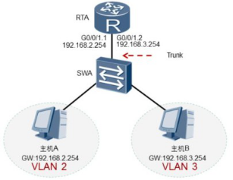

# 配置单臂路由

VLAN隔离了二层广播域， 也严格地隔离了各个VLAN之间的任何二层流量，  属于不同VLAN的用户之间不能进行二层通信。

因为不同VLAN之间的主机是无法实现二层通信的， 所以必须通过三层路由才能将报文从一个VLAN转发到另外一个VLAN。

单臂路由解决方案：

在交换机和路由器之间仅使用一条物理链路连接。 在交换机上， 把连接到路由器的端口配置成Trunk类型的端口， 并允许相关VLAN的帧通过。在路由器上需要创建子接口， 逻辑上把连接路由器的物理链路分成了多条。 一个子接口代表了一条归属于某个VLAN的逻辑链路。 配置子接口时， 需要注意以下几点：

1. 必须为每个子接口分配一个IP地址。 该IP地址与子接口所属VLAN位于同一网段。

2. 需要在子接口上配置802.1Q封装， 来剥掉和添加VLAN Tag， 从而实现VLAN间互通。

3. 在子接口上执行命令arp broadcast enable使能子接口的ARP广播功能。

 

## vla具体配置命令

### 1 、 交 换 机 配 置 

1. 创建vlan

    ```
    [SWA]vlan batch 2 3
    ```

2. 选择接口

    ```
    [SWA]interface GigabitEthernet 0/0/1
    ```

3. 选择接口类型为trunk

    ```
    [SWA-GigabitEthernet0/0/1]port link-type trunk
    ```

4. 允许trunk端口通过vlan 2 3

    ```
    [SWA-GigabitEthernet0/0/1]port trunk allow-pass vlan 2 3 
    ```

5. 选择接口

    ```
    [SWA]interface Ethernet 0/0/1
    ```

6. 设置端口类型为access

    ```
    [SWA-Ethernet0/0/1]port link-type access 
    ```

7. 将接口划分到vlan 2

    ```
    [SWA-Ethernet0/0/1]port default vlan 2
    ```

8. 选择接口

    ```
    [SWA]interface Ethernet 0/0/2
    ```

9. 设置端口类型为access

    ```
    [SWA-Ethernet0/0/2]port link-type access
    ```

10. 将接口划分到vlan 3

    ```
    [SWA-Ethernet0/0/2]port default vlan 3
    ```

### 2、路由器配置

1. 选择接口

    ```
    [RTA]interface GigabitEthernet 0/0/0
    ```

2. 打开接口

    ```
    [RTA-GigabitEthernet0/0/0]undo shutdown 
    ```

3. 选择接口

    ```
    [RTA]interface GigabitEthernet 0/0/0.1
    ```

4. 封装dot1q协议,该子接口对应vlan 25

    ```
    [RTA-GigabitEthernet0/0/0.1]dot1q termination vid 25
    ```

5. 设置子接口IP地址和子网掩码

    ```
     [RTA-GigabitEthernet0/0/0.1]ip address 192.168.2.254 24
    ```

6. 开启子接口的ARP广播

    ```
    [RTA-GigabitEthernet0/0/0.1]arp broadcast enable 
    ```

7. 选择接口

    ```
    [RTA]interface GigabitEthernet 0/0/0.2
    ```

8. 封装dot1q协议,该子接口对应vlan 3

    ```
    [RTA-GigabitEthernet0/0/0.2]dot1q termination vid 3 
    ```

9. 设置子接口IP地址和子网掩码

    ```
    [RTA-GigabitEthernet0/0/0.2]ip address 192.168.3.254 24
    ```

10. 开启子接口的ARP广播

    ```
    [RTA-GigabitEthernet0/0/0.2]arp broadcast enable
    ```

**interface interface-type interface-number.sub-interface number**命令用来创建子接口。 **sub-interface number**代表物理接口内的逻辑接口通道。

**dot1q termination vid**命令用来配置子接口dot1q封装的单层VLAN ID。缺省情况， 子接口没有配置dot1q封装的单层VLAN ID。 本命令执行成功后， 终结子接口对报文的处理如下：接收报文时， 剥掉报文中携带的Tag后进行三层转发。 转发出去的报文是否带Tag由出接口决定。 发送报文时， 将相应的VLAN信息添加到报文中再发送。

**arp broadcast enable**命令用来使能终结子接口的ARP广播功能。 缺省情况下， 终结子接口没有使能ARP广播功能。 终结子接口不能转发广播报文， 在收到广播报文后它们直接把该报文丢弃。 为了允许子接口能转发广播报文，可以通过在子接口上执行命令。

 


 