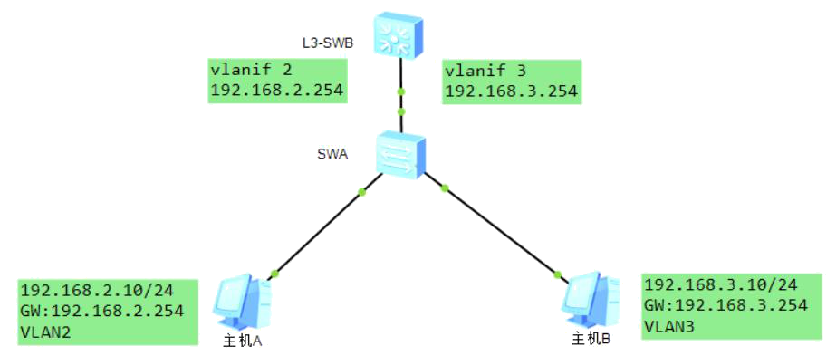

# 配置三层交换-答案

## 基础练习

1. 三层交换机的VLANIF接口如果能够被成功激活，都需要哪些条件？

   需要先创建相应的VLAN，并且VLAN中还要有活跃接口。如果没有相应VLAN，VLANIF接口不会激活

## 进阶练习

1. 实验拓扑如下：



实验要求：实现主机A和主机B跨不同VLAN通信提交配置：L3-SWB和SWA的关键配置命令

```
SWA:
[SWA]vlan batch 2 3
[SWA]interface GigabitEthernet 0/0/1
[SWA-GigabitEthernet0/0/1]port link-type trunk
[SWA-GigabitEthernet0/0/1]port trunk allow-pass vlan 2 [SWA]interface Ethernet 0/0/1
[SWA-Ethernet0/0/1]port link-type access
[SWA-Ethernet0/0/1]port default vlan 2
[SWA]interface Ethernet 0/0/2
[SWA-Ethernet0/0/1]port link-type access
[SWA-Ethernet0/0/1]port default vlan

L3:
interface GigabitEthernet 0/0/1
port link-type trunk
port trunk allow-pass vlan 2 to 5
[L3-SWB]interface Vlanif 2

[L3-SWB-Vlanif2]ip address 192.168.2.254 24

[L3-SWB]interface Vlanif 3

[L3-SWB-Vlanif2]ip address 192.168.3.254 24

```

